# 花了2万多买的Java架构师课程全套，现在分享给大家，从软件安装到底层源码（马士兵教育MCA架构师VIP教程） - P188：【IO／NIO】网络io变化 模型 - 马士兵_马小雨 - BV1zh411H79h

爱我的一个眼睛和病。或者模型模型。他讲网络IO变化模型的时候，我们先来呃在面试的时候常问的一些问题和一些关键的一个语义和词汇，在这梳理一下。目的是要把这些东西学明白了。首先你会听到的有同步。

E部在关关于IO模型这块啊有同步，有异步，有阻塞，有非阻塞。好吧，这人面试常问的。嗯他的组合模型有几种。等等的啊，比如同步阻塞，同步非阻塞。对吧还有异步啊，有异步阻塞模型吗？同学们有异步阻塞模型吗？W。

そ。注意是没有的嗯，没有没有异步阻塞模型，你异步阻塞，那就是灵异事件了。你都异步来还阻塞干嘛？没错，但是异步在令令当中基本上目前的版本是没有实现。在在这个商商商用这个版本当中。

相当于这这几个概念你就知道那这几个到底是怎么回事。那么接下来的学习方式当中会用到的指令是strs。3D。用t来追踪我们的性雕用，尤其关注那些个IO的实现啊。

lininux很难实现AL不不不不不linux的程序员，就是linux的内核的开发的程序员的数量一定比微软的程序员的数量要多。因为它是开源的，面向全球的大牛。能明白什么意思吧？就是就就拿开发人员的素质。

质量和这个经验能力上来说，肯定是大于这个微软的。只不过这件事他要不要做，想不想做这件事情，就是如何去定位自己的内核。啊，没错，linnuux是linux这个内核的缔造者。

然后但是他也不是说绝对具备一票否决权。这里面其实有很多的资本运作在里边，就是各个厂商有自己的这个AIO的想法。因为这个你就可以想成啊，内核是一个。那个是管家。但是内核就因为它是管家。

它是一个属于社会最底层的，你知道吧？底层的。这么一个角色，然后上层那些华丽的applicationAPP比如oracle，比如说IBM，他们都有自己的数据库，都有自己的一些程序。

他们都想使用一些网络的IO上的事情。所以这时候你内核虽然在我程序的权限上，你可以管理我资源上你可以管理我。但是这个内核你是毕竟底层嘛，你这个相对底层一些这个记住一些。

但是这个各个厂商其实就想因为因为你开源的，就开始想动它里边这个底层代码实现一些所谓的异步的IO模型来让自己那套程序跑的更好。但是。你你IBM的AL框架，可能你的这种DB two啊跑的特别爽。

这种C开发的。但是可能到oracle或者GBM或者其他的程序都是跑，就不那不那么。不那么爽了，然后然后人家那边也也想来一套AL的标准。然后这个时候琳娜斯就很尴尬，说哥里可别这么玩啊，咱咱这是内核啊。

咱们是服务级啊，这个东西得安全啊。然后带领的一票人，就是这个阵营啊很多不同的阵营，其实都里边都有利益或或者开源或者是精神精神在里边，就是来把控这件事情。所以他没有一直没有统一而已。能听同学来刷波一。

但是微软虽然的程序员没有那么强。😡，啊，程序员没那么强，但是微软人家说了算，说内核就得给变胖一点，变臃肿一点。内核干的事就得多一点，我得让我的程序跑到这个开发上面简单一点。啊。

我那个安全上面可以可以可以可以可以放弃，就跟CP1样，我就调整某一个级别就可以了。哎，所以这个时候其实windows是可可以实现异步的，因为它有很多IO程序，在windows的程序啊。

它不管这个IO的这个状态和这个读取，这个事就先交给内核了，内核有现程。连去接收数据，然后放到缓冲区所有的事儿。全做完了之后，最后就告诉程序读完了。那对于成来说，呦这事儿读这事儿什么发生的。

我也我也没具体去调这个这个这个读，也没等这个读完那个结果。你突然就告诉我读完了，这事好一步啊，这叫一步。😡，不是我这个成语自个读的，像Ling当中，你即便有读了附文器我我我知道了某一个文件描述可以读了。

某一个网络链接可以读了。但是我只知道了能读，我还得自个去调读读的事我还得等着，还得组组这个让我这个成序在这在这在在这在这守着，就是同步的，我得去做这件事情，所以这个lining当中，它就是属于同步的。

只不过这件事情它可以是阻塞，可以是非阻塞。因为你不来的时候，就你这是俩事儿啊，这同步异步左侧飞组，这这两个维度，两个概念。就当我当我这个想想想去读的时候，我可以一直等到你数据到达，我就读到结果。

我也可以读，发现没有之后继续忙别的。然后我一会儿我再我再读一下试试。这就是主说非组说的概念。好吧，对一个通俗的一个描述，你对它有一个宏观感之后，然后一会儿我们把代码跑一跑，通过str追踪一下。

然后把它的IO模型变化再给你梳理一遍。这个在其他课程当中虽然有讲，但是我说了还是为了保证咱们这个操IO这个章节的这个完整性啊，就是后来新人来的时候，他可以直接看这个章节就可以获取相应的知识点。

所以会的同学就别嫌麻烦，好吧，这怎么还一直出现这种。来，任何同学来刷波一啊，我开始讲课。

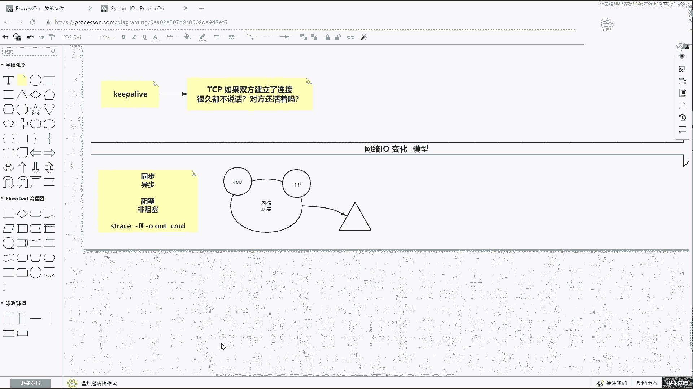

Yeah。像在这儿提醒一下，呃，尤其后边来的小伙伴什么可能没听的小伙伴，你最好先去把马老师讲的。寄组我觉得你组成那块去去听一听。什么是中断啊，什么是进程啊，什么内存管理啊，把这块的先去补一补一补。

很简单啊，稍微有点概念就可以了。然后我们来聊到。还要变成这一块。Yeah。这边我有很多的代码啊，先从最基本的tex socket。t old就就就从t sorry这个这个代码看起。这个代码是一个精简版。

刚才给你演示的是那个带proport参数的，这是一个不带参数的，一切都使用默认参数。然后呢，newserv so的时候使用的是8090。在javajava语言当中啊，我们用java言写的时候。

想想网络编程的时候，new的是一个serv so8090得到一个server。然后这个时候根据刚才讲解，在TCB层面，其实其实就起了一个监听了。啊，就绑定了8090监听那个状态已经有了。

然后也打印了提示的用户啊，这个80990已经开始已经第一步已经完成了。然后进入一个死循环，死循环当中啊，调accept等待客户端的连接，连过来之后才会得到客户端。那么没有人连接在这一直会阻塞。

这是阻塞的第一个点，当某一时间点有一个客户端连进来了。这个方法从内核就从先入内核到返回，得到了一个客户端的文件面符，也就是在内核当中四源组已经有了缓冲区域都构构建完了，文件面符也构建好了。

那这时候给用户提示，哎，这客户端，的端口号多少，已经连进来了。😊，这和刚才的知识已经挂上钩了。然后这个时候你有一个s，你一个线程啊，你一个reable，然后用一个线程当中。

把这个客户端在这个线程当中与到的run方法当中啊。往下走。う。这里面是我在调它的时候，这个怎么写的？SN点ge input这SS是谁？SN等于SSS。呃，我因为在下边掉了一个s，把客客户端传进去了。啊。

把Cllan传进去，传进去之后，这个SS其实就是这个客户端。那在这付付了一个值。复制之后，其实这S的客户端我从这个县城里边。从那个客户端里拿到输入流，然后包装一下，想去读它。但是读的时候这有一个阻塞点。

比如我的接受客户端连接是一个阻塞，读是一个阻塞。但是现在我使用多线程模型。然后注意下边代码的演示方式，这个代码能看懂学来说个一。文件描入符是什么？看我前第一节课IO的第一节课里边会讲了文件描入符。啊。

我给你演示LSOF。这里面可以看到所有的你还可以看P dollar dollar，这就是文件描符，就一个数字，数字一定会代表了某一个东西。某一个文件，某1个IO，这就是所的界面服务。

逻辑代码能听懂这个sockcket。那么注意在这有两个概念。第一个概念我们先用一个版本。用USRjavaJDJ twoSDK。变下的java C这个编译器。🤧java它的是分版本的。用java C。

这是J two1。4的版本的编译器去编译我们的t so。这样va？编译完之后得到它的class，然后把它跑起来，是你用跑运行的时候，也要用这个1点1。4。2的。但是这时候要用str这个命令接入了。

杠FF是抓取你未来跑那个commond，它所有的线程杠O，然后给出一个输出的文件的前缀，是追踪每一个线程，它对内核的系统调用。前面计算机组成也讲过什么是系统调用了，也讲过8年中断了。

追踪一个程序对内核的所有系统调用，并每一个线程都独立输出，后边会带着一个现程的线程ID号。那是哪一个命令呢？你这给的也是USRjava，然后J two S1。4闭幕下的可java可征程于这个这个讯机。

后边跟的是test sock。啊，把这个字源码加载进来，开始开始运行。当你摁下回着之后，它很快打印了第一步。然后根据我之前讲过课的。

你现在应该就知道了nicestate杠NATP一定能看到一个list绑定在8090上了，只不过现在没有任何他的建建建立任何的连接。😊，对吧然后你还可以用LOSOF。

然后杠P来显示你这个8384这个java。然后看到文件面符，任何成语都有012标准输出标准输入标准输这个这个标标准输入标准输出和报错输出。然后这个3。是1个TCB绑定liston8090了，这是3号。

什么叫文件描符？它代表了某一个东西，一切金文件，你的输入终端，你的程序，然后你的真正的文件，还有你的sockcket，还有你的这个pe plan都是文件，都可以用一个文件描符表示。

现在只得到了一个监听状态啊，那么我用s要做一件什么事情，重点来了，看刚才那个目录test soet。得到了一堆out。😡，现在你数下outt文件有几个，12345678有8个，那么代表着java。

我这个程序GVM密启动，它就是多线程的。啊，它就是多线程的每一个线程干的设计部不一样。像这里面，因为这个J two1。4的时候，它的第一个主线程out8384这个线程。其实说白了就是它的主方法。

那个线程剩剩余的线程就是一些功能线程可以你GM叉或者是呃通过这个GC垃圾回收监控。Okay。那么我们只需要关注8384这个主线程。8391。不是你可以看2。8384。Size number。

因为在主线程里边，我是不是写了一句话叫做sstem点out点pre这个step一点newso so8090，对不对？啊，那所以这时候我们去从这里面去搜一下。是不是你会看到哎。

这个就是这个8384里边掉了一个right，这是一个内核的系统调用打印写这个一就是标准输出写了一什么，就标准出就是屏幕嘛，写了啥东西了，写了一个step一new8。9就O了。

到这步都能跟得上同学来ber一就是现在要知道做件什么事情，我再用s来追踪我们java程序，它和内核有哪些交互交互了哪些内核的系统调用，对吧。😊，那在这里面。先看到最后一行。啊，最后一行是accept。

那这个accept就是在我java当中跑的时候，我可以用。用另外一个窗窗口给你演示吧。我那个代码也打打出来了。就是第一步，这已经打印了。然后程序进入死循环，然后但是到这一步，java当中的server。

这个server就是我们那个server soet点accept的时候，java到这儿java阻塞了，其实它是怎么组，就是我们的java是怎么组阻塞的？java只是一堆字节码，它跑在一个。

lin令系统的一个进程里边，就GVM里边GVM其实用到了内核性交用的except。是受内核系统要用的阻塞，而java代码也也被阻塞了。那accept在做一件什么事情，accept语音就是接收嘛。

接收谁括号里边一个3，这个三是谁？根据刚才的描述。😊，GPS我们的那个就是第二台，我要切到第一台去。看一下。就是开的窗口稍微多一点GPS。是8384这个主主主的这个这个线程组。

这个技能的ID号LOSOF你现在现在就找找到感觉了。8384这三是什么？这三就是一个TCP的1一个scket8090监听。然后accept监听谁得接受谁，accept就再接受这个三，这个三是谁。

你其实可以往上倒。😊，哎，你看这个三在accept时用了，在绑定办的时候也用了，把三绑定到了8090，所以你这才会出现一个。三是接听8090这个文件标符，然后再往上除了这绑定了3。

然后往上还有一个scket的调用，它的的值是一个3，也就是说我的。java代码当中是想有一个server socket绑定8090，并accept，其实换成系统调用的流水线，就是调了内核的scket。

得到了一个3号文件描符，代表这个你这个这个这个要监听谁，并给它绑定到8090，并做了listen，把三监听起来，这是三个最重要的。任何的程序，如果做服务端，这三个是必调。无论你在什么IO模型下。

这三个调完之后可以调accept句。接收在这个三上这个listson上接收有没有客端连进来到这步分们看懂同看懂同学来刷波一。Yeah。就是用VI去显示这个文件记录的东西。然后你可以用t杠F。

一般自动日志都用这个命令。然后追踪outt点8384。记住了，现在所有线程最后结果是8391，对不对？一共1234567，一共8个线程。你用t阻塞这个文件，它会一直显示这个文件的后十行啊。

一直到acap也的也的确在这阻塞着呢。然后这时候注意听，我用另外一个去模拟连接它。随便找一台用NC啊NC先做第一步连接，再做数据传输的第二件事情。就是在IO上其实分为两个环节，第一个是建力连接。

第二个发送数据NC连谁连的是192。168点150点11这一台的8090。去建立一个连接，注意看啊，前面是的这个t追踪日志，我的主线程就阻塞在这儿了。但是当我的客户端加机一连过来。

你会发现刚才那个阻塞就往下就往下。跑了，在这儿开始在这儿。然后就开始往下面出来一堆的这个代码执行的这个这个痕迹。但是在这里边面你去读，它会读到哎有1个34178，这是另外一个刚才这个他的随机登口号。

地址是来自于150。12，我这台是note01是11，是来自于note02150。12的1个随机单号34178和我这个3list上建立一个连接，并asap给它连接，得到了一个文件描符5。

这个5就是一个新的连接了一个客户端的，你可以继续用LOF杠P8384来看上次看的时候指到只到那个34对不对？现在你看的是不是多了一个5，这个5是不是note01note02的一个已连通的状态。

一个sockcket这个五就代表了这个这个4元组到这步能看同学来说个一。就得到了一个连接。5。那么当前我扎个程序里边有一个三是listen状态，有一个5就是联通状态了。有了联通状态之后，那这时候注意听。

现在是BLO我的是种多线程模型。首先在主线程里边，它执行到这一行，打印了这个step2。也就是在accept接收到一个客户端之后，哎，打印了。打印完之后，注意向下边它要扭一个stride。

并把它runable跑起来，这最终叫做这个start。😡，所以那现程是一个什么什么概念？那继续追踪我们这个打印完箱后的这个代码当中，你会看到有一个。代码叫做。你你去再再一做啊。有个克隆啊，到这一行。

克隆是linux暴露的一个性统调用啊，他在做一件什么事情，看他的返回值，双击这一个他的返回值返回1个8447啊，8447。其实克隆是在克隆，就是你new spread现成的时候。这是一个技础知识。

就java当中的一个线程是什么东西？它就是操作系统的一个子禁程或者叫子线程，就是通过克隆方式得到了一个具体的一个实一个单独的一个一个一个线程。84级是系统级的。那么刚才我让你数过了，我说你数一数啊。

它一共有多少个县城来着？开始看那out的时候只有8个12345678，就到就到这儿，你看是不是多了一个out点8447，这out点847怎么来的？其实就是来于8384里边做过了一个克隆。

得到了一个新的县程，这现城就跑起来了。那新的县程跑起来，注注意这样，因为它叫做轻量级进程，但是它是有这个数据共享共享的这个标志位里边标志了，我会有我的这个这个这个尤其这个文件系统啊，打开的文件等等的。

啊，那些内存区域的一个共享。所以在当前主线城里边的三也好，还有这个五也好，上面得到那个535这些文件描符打开的一个文件描符。在另外一个县城里边，就是当前这个县城里边有的，它被它被它被共享了。

所以在847里可以看到。

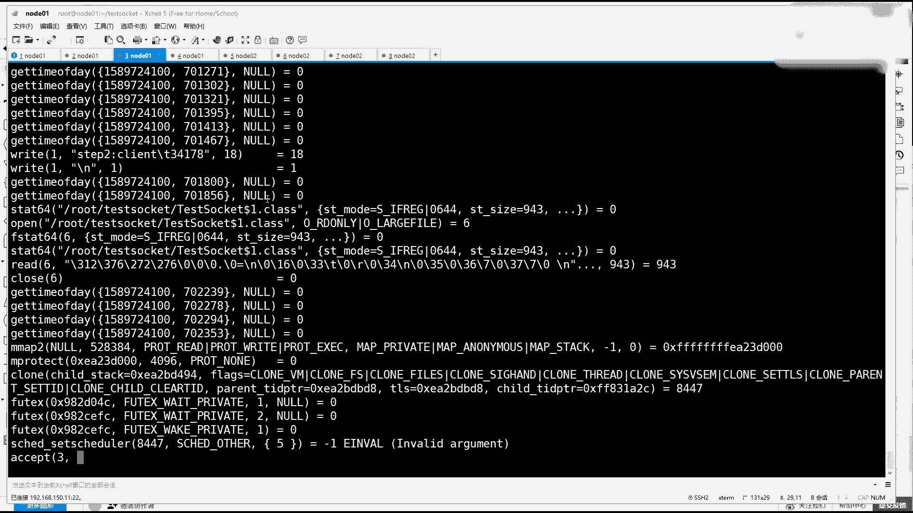

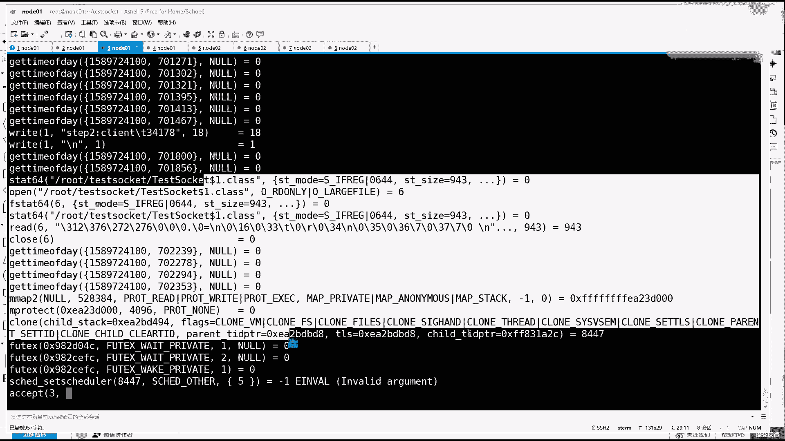

这个能听出来，上面一克隆和fo克啥区别？通俗来说。f是本质。这个事就就fo这个调用。只不过基于f参数，我可以包装出很多的具体的这个工职能的，就要不要共享一些内存的东西。

要不要最后再调1个ESC执执行新的指令啊，fo才是本质。其他的其实就是一个包装的一个一个一个间接的这么一个一个参数的一个一个一个包装啊，装饰这个如果能看懂的话，我就去看8447。因为什么？

因为在你new在我们java代码当中，你new了side之后，这个sride基本叫做异步了。因为这另外一个线程，这个sr的代码，尤其是run方法是在另外一个线程去执行的。

这里面会用到了clan去读取数据。当前线程这个这个这个这个new类事情一完事事一完事之后，3月之后光能调度回来又到这个死循环we要住着，然后又开始accept了。所以你会发现在克隆之后。😊。

得到现成之后，他马上到下面又到了except，也就是主线程只做一件事情，疯狂的等待客户端连接来了客户端就抛出线程。现程因为里边有东西共享，所以那个线程就一定可以访问到共享的东西。那我们直接去看8447。

🤧VIout点8447。打开这个文件之后，这是另外一个线程。你会看到里边，尤其看到最后啊，是不是在主线程里有三有5这两个文件标符。在这个847线程里边，是它是不是用了receive叫读取5的数据了？

这个5它为什么可以用？因为这就要现程把一部分东西，尤其文件或文件这个这个缓缓冲区papge，还有一些东西给它共享过去了，到这儿都能听同学来shopber一，这就是所谓的。多线程的方式来接收客户端连接。

看看。嗯。那以上这些东西其实还有一个学习方法啊，刚才什么看到了sockcket呀，看到了band啊，看到listen，看到了receive，看到了克隆这些东西你只要手里有linux都可以去学。

用manu，这是一个指导手册的这么一个程序，这叫帮助程序，然后可以跟一个数字2，它后边可以跟12345678，你比如说TCP你想学你想学TCP的话。TCB打开啊，这里面关于TCB的一些相关的知识和这个。

这里边都都会有一些知识啊，然后但是它属于七类杂项，就看那个文档一打开之后，左上角这个括号里边它是哪类的，或者是menuIP。但是IP之后，你看有个8类啊，这是IP的那个管理的一个命令。啊。

你可以用ifcon，也可以用IP那管理的命令。然后你还可以告诉他，我想看的是7类那个IP。

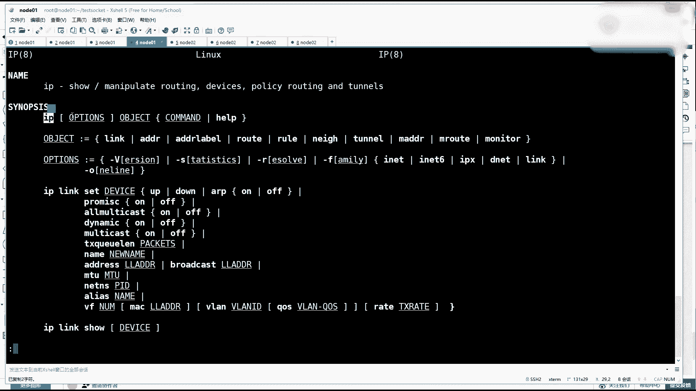

Good。

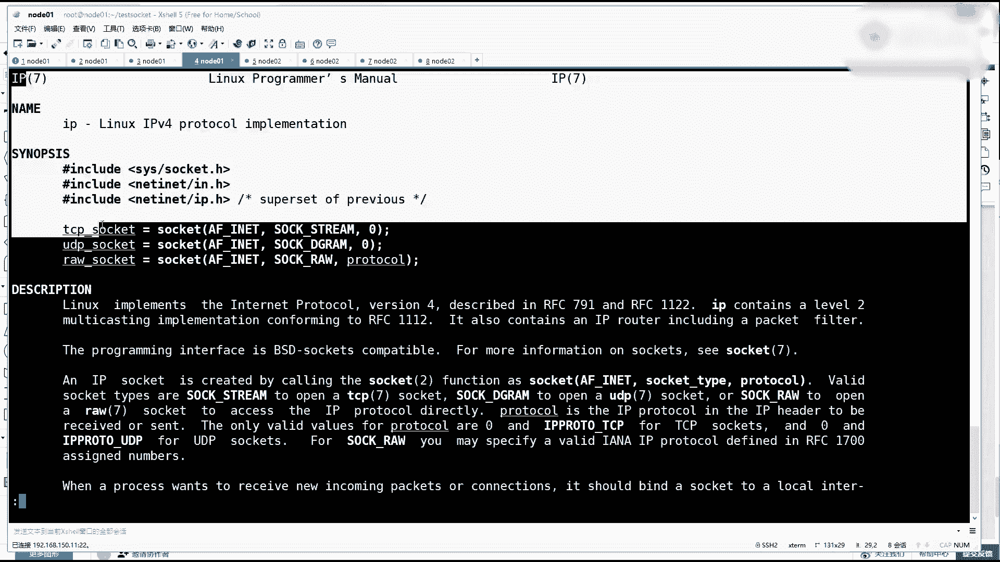

相关的维度的一些一些讲解。没错，不会就manu，然后还可以看ASCII阿玛。七类的也可以可以去看UTF杠8，就真的推推荐你们有些东西你宁可拿着它去做百度翻译，去理解，都比你去看一些。

那个所谓的文章博客更体系更完整，想学好linux看哪个帮助最重要man bash。就是你一直在交互的那个命令行，它其实是这个程序bsh。这个拜是有中文的，我要告诉你是有中文的，你最好去看英文。

因为英文当中有一些语义是对得上的。往后学的时候，我有时候给你们讲课，受的一个重定向啊，一个什么参数扩展啊，所有的知识，那并不是我生下就会的，就是在这个文档慢慢去学的。你像有时候我是不是会用and符。

然后表达式啊，然后写些脚本啊等等的，都是都是其实都是在这个文章当中去学的。🤧那么要我现在要讲什么？他123456788类文档。如果你不行的话，你。看一看这个慢他是不是扒类文档，对不对？就就是看这过程啊。

哎自个自个儿自个儿帮助一下自己啊，就自自己自己给自己那啥一下。😊，这里面比如说一类文档是用户并令，二类是是cos。系统调用啊，三类是这个C library的 functions。啊。

四类是开发和什么什么文件，五类是文件格式化什么的，六类是游戏，七类是杂项，八类是系统管理员的一些工具和后台的一些一一些指令。なか。那所以你看二就可以了。

像strs这个指令追踪到的是这个strs这个指令追踪到的都是你后边这个可执行程序的对内核的系统调用啊，所以你看到这些关键词，你看到这些关键词都叫做系统调用，所以都是stem call。

所以你就按照这个顺序学man two，比如说第一个sock it。现在会了吧，就是不需要我，其实你也可以完全自主学习了，整套东西打通了，对不对？主要是通的这个感觉啊。那sy的话，你看什么叫系统调用。

新调用你不用想的很害怕。什么叫做函数调用啊，什么叫系统调用。他们只不过是调的时候，在内存的控制上有一些区别而已。有的是直接就是给地址啊，就PP这个PC这个计计存器，我就可以直接下一个就调出就可以了。

要么就是用80中断啊，我就就走走一下这个用态那个net切换，再把这个函数调起来。😊，其实最终最终都是调起，那最终就是方法的调用。你看socket就是一个方法，它有返回值，int类型，然后呢会有参数啊。

有方法名，有签名。那这里面我们先看一眼返回值是啥。范回值有一个re value，如果执行成功的话。a file descriptor文件描述符。但是你会发现返回值不就一个数值嘛，这个数值就叫文件描符嘛。

哎，OK你可以这么去理解。😡，这文件描书是一是一件什么事情？for the new socket is retain retain。就返回了。但是这时候注意了啊。

是要返回的是一个未来你要准备开启listen状态。第一个sockcket，你会得到一个文件面符，然后关键往下看，是不是socket得到了一个文件描符，比如得到了一个数字5或者一个数字3。

这时候你再来去看man two，然后看bandd绑定绑定的时候，它是要给出一个相应的这个scket的地址和动口号。绑定上之后，刚才就看到的就是绑定808090。再去看还有一个listen。😊。

🤧listen的时候是要给出你刚才那个scket的文件描符，listsen给出它。然后这你看这里一个backlog，可以给参数的。其实在ja当中，你刚才刚才咱们看，你可以手手动去设置啊，也可以去。

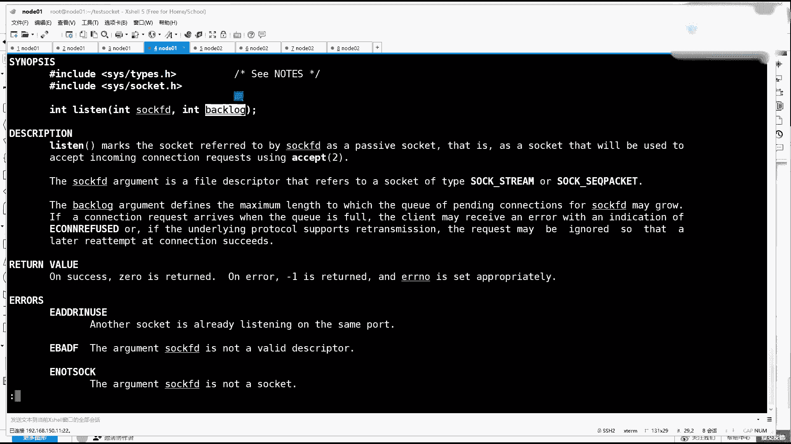

在你搜 sorry的时候，就直接给出。就在这步的时候，你用一个s circuitet的时候，后边可以给出bllo。比如给1个20。啊，是不是有这个东西，你也可以像我刚才那种写法。

就是我得到了我先弄一个soc，啥都不给绑定的时候，我可以绑定动口号，以及给出backlog。

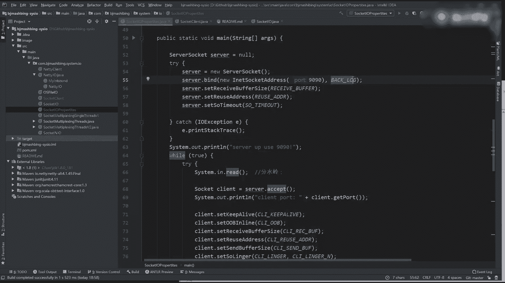

你java上写的东西，其实java嘛，它自身并不是一个真正的一个东西，它是一个虚拟。它最终你他只给了一个语法，给了1个GVM的一个字己码的一个执行的一个环境和底层脱拖脱节。但是他最终还要调到底层去。

这个能听回来上边一，是不是长得很像，因为最终调的就是他嘛。所以有有有好多人，你看网网上有很多的这个文章就说了，说学java要不要学学C。其实你会发现ja永你都会了，往C就是走半步的事儿。对吧换言之。

如果你C会了学java，其实就很头疼的把明向对象这关过了就可以了。但是如果你CC加都都会的话，学java太容易了。就在你的完全在你的掌控之中。所以学CC加加肯定是你有生之年。当然了，先学java挣钱。

😊，啊，捞到一定的这个收入之之后，那，如果C懂的多一点的话，那肯定就是啊这个加分很高的。🤧呵。关键啊这个帮助手措还有一个特点，连空格往下走。哎，你看有这叫examp还是ex，还有这个样例啊。

他让你看C去看啊band这个系统都要用。所以你要看man two band。然后往下走，走到它的exampble这个这个章节。来，这有一个 exampleample。

这个 exampleample当中其实它就是C的，咱们叫inport，它叫incclo啊，导头文件等等的。本来之后，哎它有一个主方法啊，只不过人主方法返回值啊。主风啊里边往下走的时候。

你注意看它第一个是要掉socket，然后得到了一个socket文件标符。刚刚才看它的时候，他其实就反了一个数值，它就是一个整数in。有了它之后，他判断是不是负一负一的话就报错了。如果不是负一。

然后肯定是趋向于得到一个正整数，那就是得得到了一个先先得到了一个s。有了它之后，下一步步事情肯定是对他做了一个，你看绑定。😊，绑定这个到某一个地址上，绑定完了之后，开始listen，监听他。

并给出了backlog。监听如果都成功，都没有报错的话，那往后才是要去做。accept从他accept去去从他身上获得。刚才也看到ac这个调用了。所以man two ACCEPT。

accept里边它也需要你刚才那个sck文件面。啊，那它的返回值是什么？往下找reachturn value。Okay。哪去了来了？啊，这4860如果成功的话，就会返回一个。呃。

一个文一个一个描符for the accept接收的scket。

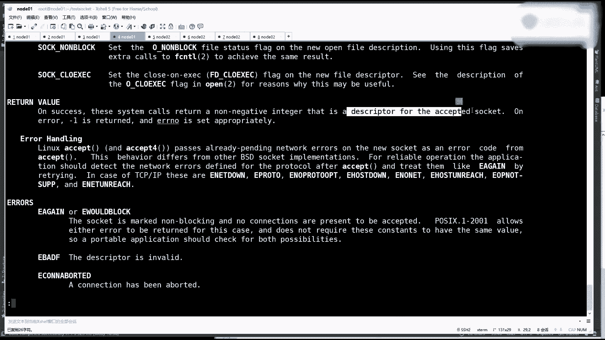

好吧，以上这些汇总一下。汇总一下，就目前刚才我给讲的东西，计算机里边有application应用程序，有操作系统内核。未来无论我讲哪种IO模型，无论哪种IO模型。

只要是想通过网络IO通信和外界通信你的application。和你的 kernelel内核之间有一个固定的一个环节是不被破坏。啊，只能做修正，不能被破坏。

这个环节就是完成刚才那一套基本的性统调用socket。会给你返回一个文件面符，比如说FD3。这是第一步。有了MT3之后，你要对它进行淡的绑定。绑定到比如8090。放年之后肯定还有listen。

监听我们的LD3。之后。你必须要先就是这串性调用执行完之后才能得到你的next state。我这给你做一个笔记。就这个执行完之后才可以得到一个结果。这个结果就是你通过n state去看。

到NATP去看就会看到一个local的本地的1个0点。0。0。0，然后1个8090。然后对端任何地方呢0。0。0。的任何顿号都可以连我，然后它是一个listen的状态。就是你为什么用nancy的？

可以看到这个这个这个条目，就是因为你的成绩代码中必然执行了这三步。听我同学来刷二波一。大家注意了，这些叫做性能，它是内核实现，它是内核有这些功能。这么讲课行吗？其实说白了这个我讲的这个有点偏细。

有就浪费时间。你说这个东西没必要讲这么细，因为他们学C的未必有我。不我讲的那么细，你可以上网找一些关于讲C课程。就那种所谓的培训啊。其实你就当你就把我现在我和马老师讲的一套计算机组成和IO等等这些课。

你就当一个茶余饭后。俩小时你去看博客或者俩小时来看这一个我们讲这个视频，呃，看视频可能就更生动一些。对吧。Okay。好，这就是应用程序必须要走完这几步才能拿到这个状态。这个状态有了之后。

那么接下来你的程序会调一个系调用。因为listson有了之后开始要调一个一个调用了，这个调用就是。Accept。然后从你刚才那个LD三身上，他想得到点啥？就是在等待客户端的连接。

那这时候就进入了阻塞状态。就开始进入一个组合状态了。对吧这是第一个组合点。如果这个组织状态过去了。那你得到了一个新的连接，这这你脑子一定一定有概念了。在你的一个程序的生命周期里，尤其服务端。

有两类scket，一个是server socket的，就是listen。就是这个3FD一类就是别人和你就是就是客户端那个联通的那个连接啊，比如说得到了1个ID5。这是两类嗯，listen呢可能只有一个。

但是面向这个listen的FD3连就是这个s给连进来的，就是面向这个8090连进来的FD5678910可以有很多连接。这个数可以很多。那第一步这可能会有一个阻塞。Blocky。但是组册过了之后。

就一定会有一个返回值，一个一个客户端连接。当有了客户端连接之后，下一步你要想读它，想读它读的时候注意就是receive。想读这个ID5的时候，它又有可能进入一个阻塞状态。

那也就是说在现在我刚才那个java代码当中，有两处可以阻塞，一个是客户端连接阻塞，一个是独取阻塞。我是怎么解决这两个阻塞的，怎么解决两个阻侧的，是用的现成的方式，也就是说抛出去一个现程。

这个县城里做了一件事情，把因为这两个组册如果在这个同一个县城里边，那我在等待别人输入东西的时候，我就不能做接收客新的客户端。那新的客户端要等很久才能接进来。所以我把这两类事情拆开了。

主线程里边就永远着做一个死循环，接受和克隆接受和克隆接受和克隆。然后克隆里边去每一个克隆书的线程去读取。阻塞在某一个连接上。お。对。Okay。对吧这里面只需要做克隆就可以了。对的。

这就是我刚才那个java在BL模型下的代码逻辑啊，如果转这使用完转圈回来之后又接收1个FD6，那这时候再再去抛出一个新的线程。这个时代叫做BIO时代听同学来说波一。是以。好。好吧，那么。十0点半了。

今天不能就讲这么多，就讲到BIO的开始，主要是把上面TCB的东西讲完了，然后BLO又开始下节课我们就全部趴在NLO上。也算也算隔的隔的比较干净，好吧。行吧？同学们。嗯。你。同步阻塞的情况。

s给的同步调用s的阻阻阻阻塞，你是发送阻塞对不对？呃，是这样的，发送一般不会阻塞，什么时候发送会阻塞就是。资源消耗来不及动了，那个时候会有一个阻塞。很难模拟出发送啊啊，对，没错，发送队列如果如果慢了。

发送队列怎么制造出摊慢嘞？我就要把对方的。发送慢。我我我我想想吧我想想吧，好吧。没有。对。nike卡夫卡能经典讲讲吗？呃，知识是有依赖的。我下节课讲完NIO，我可以给你讲n。但是这节课没有必要。

因为你现在依赖的东西还不不不不多。别着急啊，慢慢学慢慢学来了，我就踏踏实实学这样东西都能给你讲明白。连服务器的同一端口号，同1个80端口，客户端可以连比6535更多的连接吗？你等会儿啊。

这个这个我来我来来答一下疑啊。连服器的同1个80端口。客户端可以比665535更多的点，这是啥意思？你们给我讲谁谁谁谁能听懂了，给我给我解释一下。嗯。你们回答行和不行的，你们是怎么读懂他这句话？😡，え。

Yes对。Yeah。有个80服务，同一个客户端能超过6535个连接吗？首先我知道你什么意思了，你要对这个。客户端这个词儿能有什么意思吧？哎，找到这个一级痛点一级痛点。就是你怎么理解clant。

这个语义的。对吧你怎么理解cllan那个语义的？你如果对clan这个语义能听明白了，那这个事就好理解了。你比如说像我这张图当中，我的server application。这是一个一个server。

但是你看我下边把什么描述的，我刚才你如果回去翻我的视频，你去听啊。我说如果有一个客户端。连完之后，我说还有一个客户端，我说但是我说了这个客户端可能和它是同一个物理主机的。也可以不是一个物理主机的。

但是它是一个独立的连接，这个连接可以被抽象成客户端。你这样去理解这个client。然后其实你想表示的一个是一个什么意思？你想表示的是就是一个进程，对不对？或者你很模糊客户端的一个概念。

你说好像就是一个主机，这一个主机里边的一个进程能不能对一个服务端超过6535。的连接数。啊，就是一个主机，一个电脑，对不对？啊。

一个操作系统内因为他都不他说的应该都不是一个可以理解成一个一个电脑或者一个进程。啊，这个这个这个我这个理解对了，这个。对吧但是我这给你讲怎么回事啊？你只要保证4元组为一就可以了。比如说这台主机上。

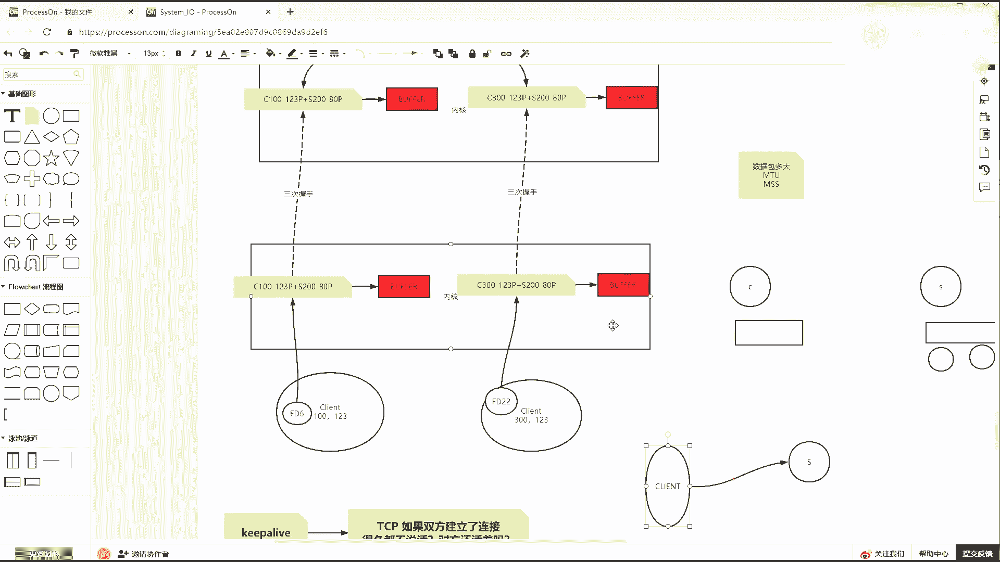

你可以做绑定的嘛，在连接的时候，然后你的你看if con。我现在的IP地址有1个1。118150。11。如果你是公网IP的话，你你你或者你在通信的时候，这个网络是不需要地址转换的。

你是可以做一个if con。在ATH0。这个子端口下。设置1个192。168。160。1211。让24。160。11150。11，他们两个各拿到655356万多个端6万多个端款号实际申请连同一台服务器。

通过这两个就可以起10多万了。

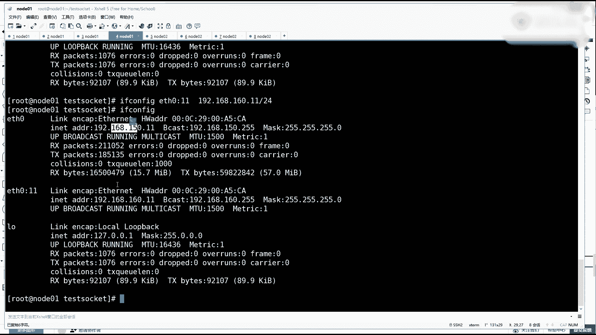

你只要保证4元组为一就可以了，能区别能区别出来，这就是TCB的语义。sock it你给我保证那一点就可以了。对吧。刚才那个问问题呢那小伙伴呢。听懂了？听懂你就敲个一。如果你IP都不能改的话。

这事这事甭想。我。对。Yeah。好吧，那今天咱咱们就讲到这儿，然后再把资料同步一下，放到KT up上。嗯。

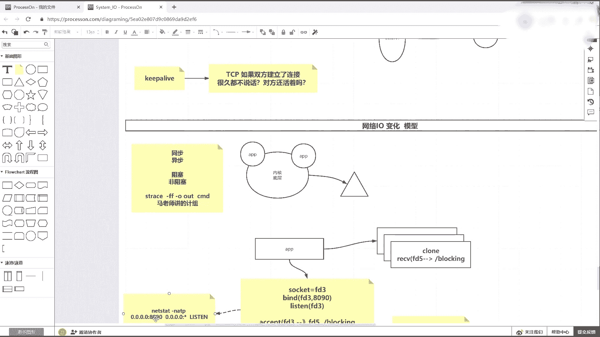