# 系列 3：P189：【IO／NIO】C10K - 马士兵_马小雨 - BV1zh411H79h

Yes。这。首先。有两件事你要做。第一个事儿有一个。帖子吧给你们发一下。嗯几篇文章啊。就是架构师嘛得得懂这个东西，有1个C10K的问题，尤其在IO的。

因为我上节课讲的是BIO甚至讲BOBO是你们应该都容易理解的，最容最最容易理解的。因为它是一种朴素的一种线性思维，就是来了一个链接，我认识出一个线程就来了一个链接，扔出一个现程现城自个往自个。

🤧随时给这一个自己去看一下，然后说看不懂的话，你给他翻译一下。我我可以很坦然的告诉你了，我也看不懂那些那些字母。然后我也是翻翻译，翻完之后，其实你从上往下读读读读一遍，读两遍，从三遍读四遍。

反正一些单词进入大脑。然后呢，我可能要去查，你就听我给你讲就可以了，好吧。哎，这个这个都大家一定要去看要去看，肯定百分之七八十是你看不懂的。但是你要看他那个因果关系，看因果关系。

比它里边描述的是一个什么事儿，你可以把它当当做故事。来完成你对碎片知识的一个穿插。C时K是啥问题？说的就是在互联网蓬勃发展的过程当中，对于单机服务器来说，连接数从一个2个10个百个千个万个C10K的话。

K就是100010的话，那就是10乘以1000是1万，那一万个客端连接会会促触发很多技术，我们让你一万个连接能进来，其实能给他们提供更快的处理，但是现在都不是C10K了。

C10K或者C10兆的问题百万连接，几十万连接，但是需求都会有。就是如果单机能力强了。即便单机能力有上限。但是如果你把强悍的单机每台机都都是很强悍，组建的分布式，这个时候才有意义。

如果你一味的做多机分布式，每台机能连5个人。那其实你要付出很多的成本。那在在做巨大的是什么？这事可能就不做了，能理解吧？啊，所以单机为什么强调你们要学设计模式，学DVM学调优单机能力强的人才符合。

和这个软件工程学当中那个职位。好吧，这个这说说说这些都没没用啊，这一个这个事自己去学，当故事听就可以了。另外一个简单回顾一下。上节课我们讲的是网络IO。

然后整个变化和模型的推导当中的第一个环节BLOBIO呢是大家非常容易理解的。就是当用新的连接进来之后，然后呢，我的主线程然后去接收accept接收得到我们的这个连接，这个客户端。

然后并克隆出一个新的线程，由这个新的线程当中去receive或者read去读取那个连接未来发送的数据，因为accept是阻塞的，然后读取数据就是得到等等待连接的建立是阻塞的，一直等着。

然后呢读取数据是阻塞的。所以在并发的情况下，由由一个线程去等着别人的来，然后排队的挨个处理每一个到到到达的人，然后并把每一个人的发来的数据由绑定到独立的线程当中。那这样的话，他们即便有发生阻塞的时候。

也会阻塞其他的这个这个这个操作。好吧，这个很简单就可以得到1个BL的一个模型，这个都都容易理解的。这块没问题，来敲波一。但是随着刚才我抛这个C10K的问题的话，那随着连接数的变大，随着连接数的变大。

那么开始抛问题啊。如果就说C1K。也就是说会有1万个人连接进来，想和你的服务器建立连接啊，那你是不是要抛出1万个线程呢？那抛出1万个线程的话，由前面讲机组的知识，计算机组成的知识啊。

你应该知道现程抛的越多。其实这时候资源消耗越多，浪费在内核调度，然后浪费在用户台内下的切换。然后浪费内存的空间这样的等等资源的消耗反而越多啊，性能更低。那这个低不低呢？但是我我刻意写了一个小代码，啊。

我刻意的写了一段小代码。

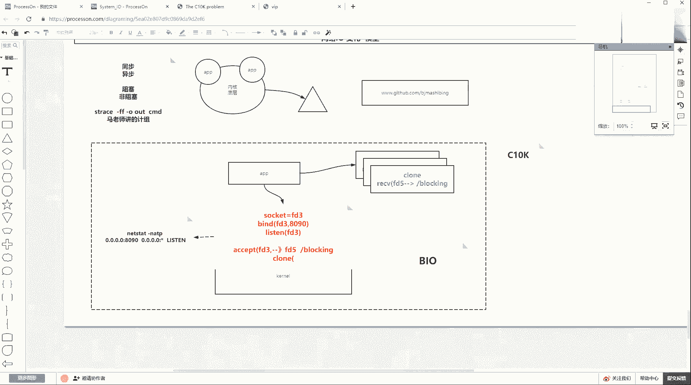

这个代码什么意思？就能先过一下。正好把前面这些知识给你固化一下。前面我讲这个。

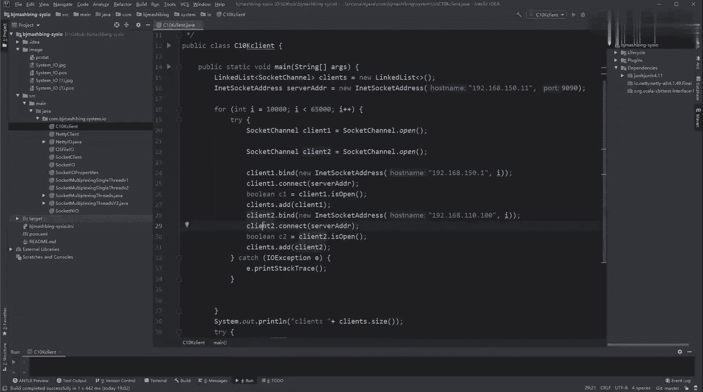

通信的时候，我说过有一个4元组的概念，还有印象吗？就set的是4元组。啊，资源组也就是资源组当中只要有一个东西能够唯一区分，这个suffage就会成立。然后在这儿我写了一个小程序。

是在我windows当中写了一个主线程，并没有抛出更多的线程。

在这一个windows的一个物理主机里的一个物理进程里边，这是现程或者进程。这一个现程里边。然后我要做一件什么事情？我准备了一个对端，就是服务端的地址是150。11，端口号是9090。

一会我会在我的linux操作系当中去启启动一个9090的这样的一个进程端号绑定上这是对端，那在我windows上做一件事情，复循环起始值是1万终止值是665000。

那么也就是说循环一遍会有55000的循环次数。那在505000的循环次数里做一件什么事情，我准每循环一次准备两个客户端，这两个客户端，一个绑定windows上的一个150。1的IP地址。

一个绑定的是110。100的地址。注意这是客户端，对，这不是sck channel，这是scket，也就是我的客户端，我我把他们两个就是个。

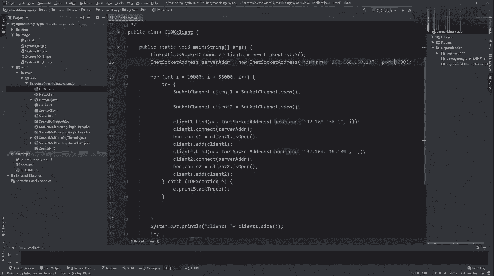

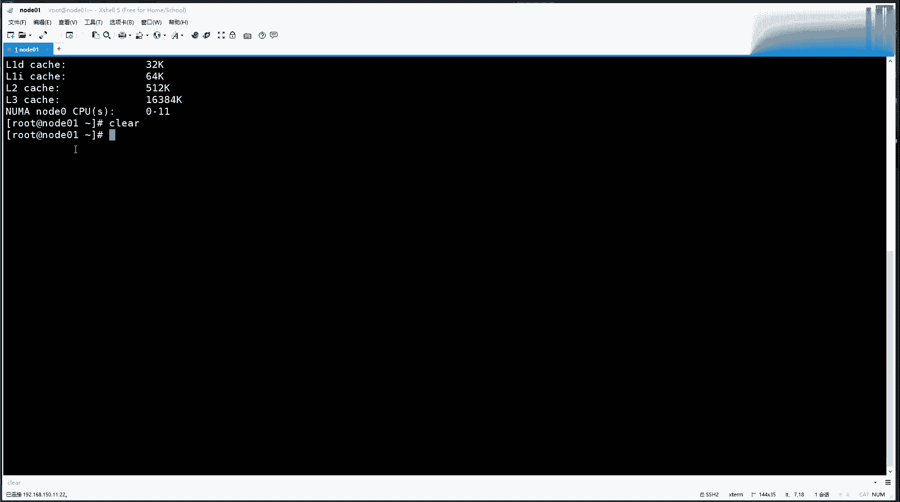

之后绑定完各自的IP地址之后，我会让他们去conect个连接我这个serv。也就是每循环一次会有相同的端口号和不同的IP地址连接相同的IP和端口号的服务。那这样的话。

55000的循环次数乘以2会也就是我会用windows的单机单进程对一台服务器发起11万的连接。也就是突破了端号的65535的限制。这个能听懂同学拉刷er一，这是我之前讲过的资源组的概念，对不对？

然后呢，用这样的一个很大量的一个循环快速循环，然后去创建连接这件事情，我会把BLONL和多路服务器的三种IO模型都用它去连接，然后感受一下他们在接受连接这个行为上的性能和速度。对吧就是有两个知识点。

第一个知识点我会让我会我会告诉你验证思源组这个事儿找什么就可以。但是这里边会一个网络上的一个小bug，我也会给你演示。然后另外一个知识点就是那我咱们为什么要学不同的IO模型。

那么IO模型其实带来的是性能？行为是会让你用肉眼看到。那么下面同学们问了一些问题，说自己设置的IP是啥意思？绑定IP啥意思。Yeah。在我这台windows主机上啊在我这台windows主机上。

我呢其实有一块有线网卡是10。100。

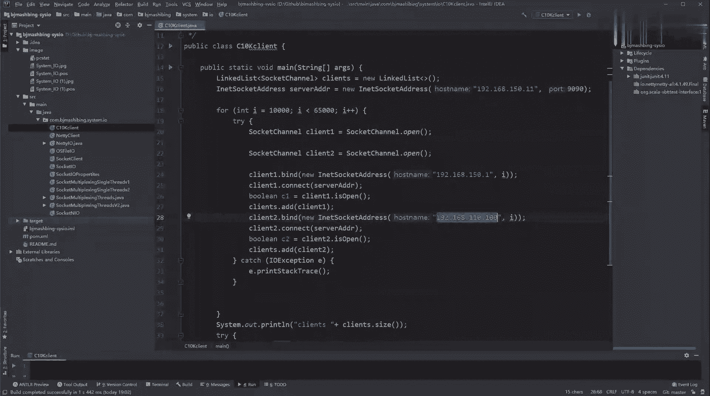

打开本地连接。然后找到你的以太网，然后更改适配器，然后看啊就是大家电脑上面就是这个支点，大家都知道自己会一块网卡网卡呢会有自己的一个地址。比如110。100啊，这是你连接外网用的。

然后当你装了vi more虚拟机之后，注意听啊，当你如果你装了vi more虚拟机之后，它有一个它除了能帮你帮你创建虚拟虚拟服务器，也能帮你创建虚拟网络，在虚拟网络里边。

我们的主机使用的都是net网卡这个这个网络模式。所以所有的主机都会接入到这个微net8这块网卡上是net模式。它的这个网段，我的网段是150。2，写在我的windows上会有一个net8的这么一块网卡。

windows上会有一个地址是15。1。也就是你不要想外接啊，你就想window自己是一个人，他地端看自己，它自己是不是有俩地址，一个是150。1，一个是是不是100。1。那我自己想往外发数据包的话。

我可以把我的数据包无论发给。内网和外网，无论分为哪，我其实的原IP地址可以在在这两个地址当中随便挑一个作为我的原地址。这个理论能听出来。邵边一就是你只需要看一台物理主机，它持有多少块网卡。

上面有多少个IP地址，它的数据包的原地址可以在里边随便挑一个都可以。因为这个地址就是他自己的，无论在里块网卡上。

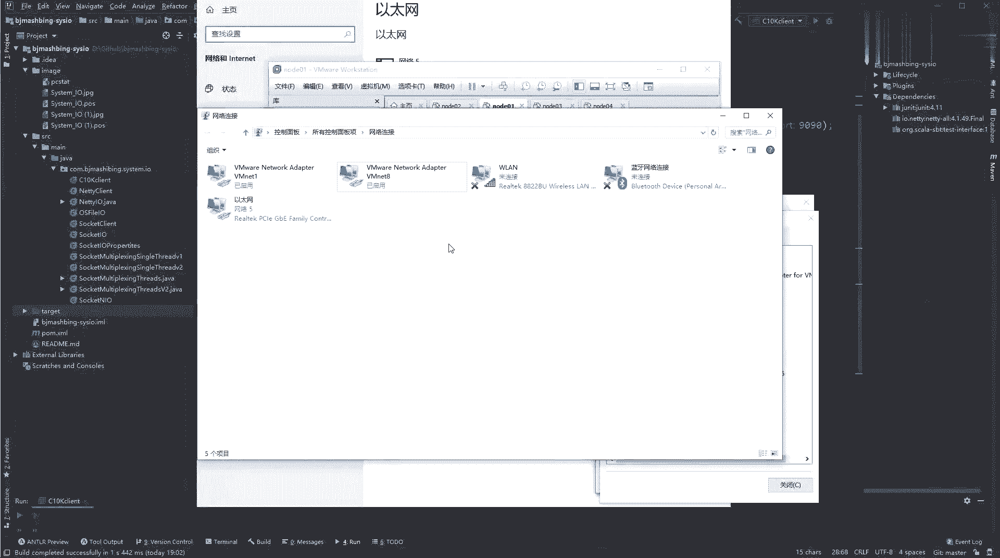

对吧那这点也要盖到。所以你再看我代码当中你就不稀奇了。在我windows上有一段代码，他期望的就是哎我有两个socket要创建，并且两个socket，一个是原地址设置成我已有的10。

1另一另外一个socket设置设置的是我已有的110。100，这两个都是我自己的IP地址，只不过登录号，我会让他们使用相同的登号，且连接的服务器是相同的服务器的IP地址和登号，那也就先验证。

那在相一台windows上，比如都是都是1万都是1万动号，那目标都是相同的地址和登号。那么只不过你使用windows同的IP地址，这连接能不能创建出来，对不对？这就是所谓的只要4元组当中一个不一样。

是不是可以创建。这个整个我这代码的逻辑需求能听出来说边一。🤧150。2是相当于V微 more的那个路由器，然后呢并在里边发生了一个net及时转换，这就是一个坑，一会儿给你演示出来，好吧。

这个代码也能理解啊，这个代码能也能理解。然后再来看这张图啊。

回回归咱们这张图，这一会儿验验这个四元组，回归到这IO的这个模型的变化当中。现在是BL是多多现成的方式。一会儿我会把这版代码跑起来作为服务端，然后用我刚才那个C0K代码去压它一下，看性能如何。然后呢。

我们得出它的快慢的感受。啊，我们来得到他的一个快慢的这个这个感受。然后先去验证一把吧。因为后边我在讲NIO和多路复容器的模型，这三个IO模型的时候，我都会用相同的客户端代码，就是这个代码。

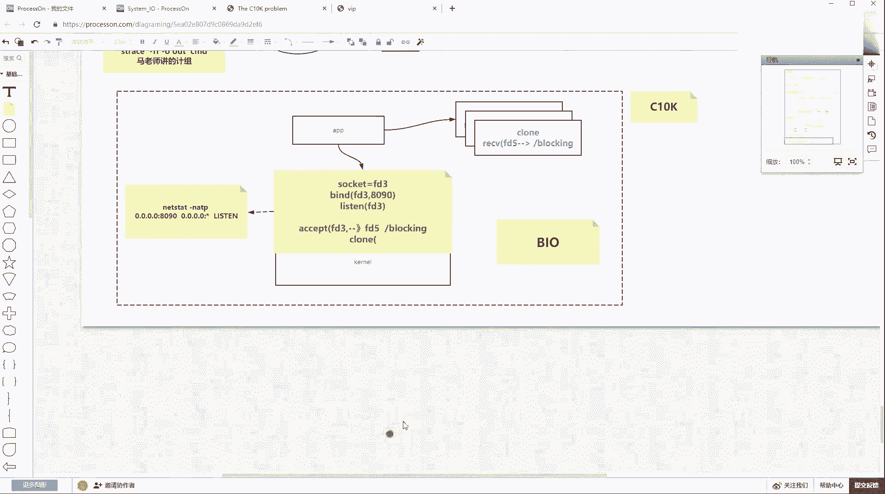

去压测，然后去找到他们的这种这种这种速度的差异。

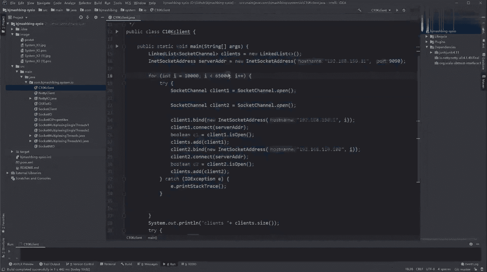

先来先来搞一版吧，先来搞一版，眼见为实。

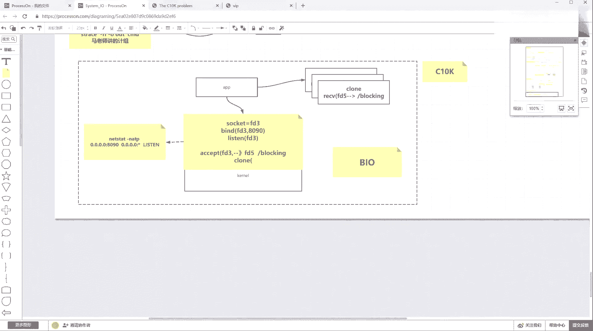

来晚了一丢丢不急呀，有流波的。那么在我手里边会有t呃，有tcket，测试我们的sockcket有测试我们NL的，有测试我们多路复云器单线程的，有测试我们多路复云器多线程。啊。

还有这个传统的这个这个不用管。我们先看那个t soft代，很简单的一个。这是基于上节课的知识，所以这个应该都是你能看懂的。它就是在当前主线当中启动之后，得到了一个sloof绑定这是8090，这应该也是。

我用另外一个。Soocket。helello。Aportice，这是我们上节课的代码。这个代码当中是。啊，这个是用了一个so socket，然后下边会有一个循环。循环里边会有s点accept。

然后并扭出现程，在现城里边要去读取。好吧，这是多线程BIO的多线程在一个主线程里边会去accept并得到的客户端会全全部抛出线程。每一个县程持有一个客户端，这个代码能看懂同学来说说一，就这个逻辑啊。

你可能上一课没没没看到，但是这个BIO逻辑应该都懂。那我第一件事情先把这个服务端跑起来，把服务端跑起来，用java C去编译st IOproport编译成功之后，用java调起st IOpro这个类。

但是这个时候注意听啊，它跑起来之后，它绑定的端口是9090。然后呢，我们来看用抓包来看一眼我的数据包能不能过来了，就用TCP。杠杠NN杠IETH0。然后抓的是号号，端我号9090。

用这个特征去抓在这个网卡上。回车，然后抓包的程序在这阻塞着，然后我们把我们的服务单机跑起来，跑起来之后，然后去执行我的这个后端代码，就这个CJ的这个测试这个这个这个这个代码，他会拿着两个ID址去去连啊。

然后我们来走待机开始启动。

启动之后，然后再来看代码这边的提示。啊，这边你看一万是不是连一个客户端连进来，哎，但是没有出现很多的连接进来。然后我们来看抓包里边，你能够看到的是150。1。

这个是我windows那个vivo8的那个网卡，拿这个地址绑定一个1万过来的。然后它也会尝试拿10。1001万进来，想去做连接。也就是说真的我的客户端windows里边会拿两个绑定地址。

会拿相同的端口号，会拿相同端口号去尝试和我的服务器的相目外地和端号去连接。这个资源组织成立了。只不过这里面会出现一个问题。

你没看到连接过来的客户端是1万10011002，不是1万两次，1万01两次，1002两次。先不要管那个慢的事啊，这里边有一个小bug，能听懂我小办达什么意思呢？按理来说，是不是我每巡你看这边还报错了。

超时这个超时了，是不是按理来说我循环一次会拿着15。1连1个1万。然后10100连1个1万。所以我服务器里边应该打印的话，是一个客户端1万，一个客户端1万会赚两次。这个问题发现了一个问题。

同学来说2边一。

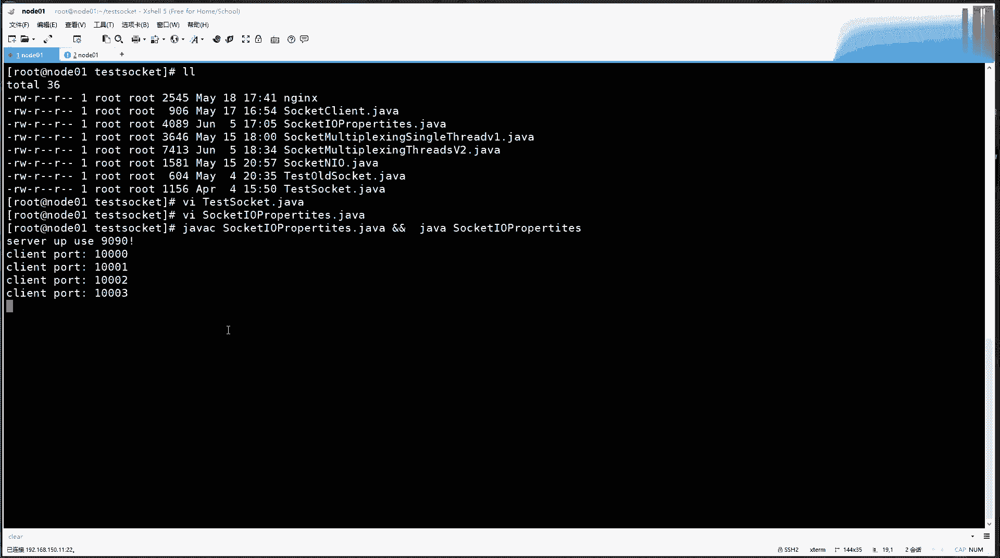

对吧那那个问题是啥？你会发现我把这边今天这个事给他结束一下。在我1。1。到服务端连接S握手，然后成功了。然后100。1万过来之后，然后你会看来了。然后我们11这台服务器也给人回了。

但是这时候却发现后边并没有那个ACK确认这件事情。并不有ACK确认件事，又又想重新给你们这个这个尝试握手一下。那其实这里边会断片了，为什么断片儿？可能说不在同一个网段。那这时候来就发现一个问题啊。

就是我windows的客户端会拿着100110。100。这个作为原IP地址目标IP地址是10。11，会去访问它访问台服务器。那也就是说回去的包有没有回到windows上，那我们来庆一下。

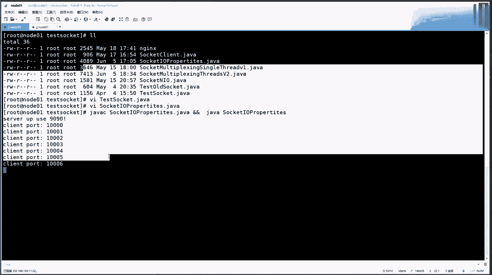

你们发现这个通路是不是通的？啊，跟着我思路，待会我给你画图啊，那个你先跟着我思路走，也就是我lininux是可以并通1。1816。100，那也就是代表着客户端如果拿着这个地址的数据包过来，应该也能回去。

对不对？是不是应该能回去？但是为什么10。100这个地址的连接却没有被创建上呢，却没有被创建成功的，只有10。1的那个345成功了。这里面有一个知识点，就是看路表。跟他搜索啊，看路由表。

在我的路由条目当中，你要明白网络啊，明白IO这块你一定要明白。面向我这台linux操作系统。他呢有一块王卡。网卡的地址是150。11，言码是3。51个0，也就是它的网络号是150。0。

也就是通过lininux是可以直接访问150这个网络的。但是就看这个路由表，你来告诉我这台lininux和1。18110那个网络是直连关系吗？是直连关系吗？就是如果P192点168点110。100。

是不是它不是直连关系，因为没有专这个条目，对不对？那这时候如果相反他其实是走了默认的这个网关，也就是数据包可以进来，也就是一个原地址是10。100的数据包可以进到这台主机，我返回的时候以它为目标地址。

我还能给你返回。但是返回一定要看路径，返回的时候，它只能走这个默认无关的一这个这个这个条目走默认无关就会以谁为下一跳，是以150。2为下下一跳。那么150。2是谁？150。2。

就是我们微 more的虚拟网络当中的那个。的8里边呢，看啊它的网关。这个网关是谁？这个15。R是谁？其实这个网络叫net，其实就是windows上的一个进程。这个进程在完成一个nett地址转换。

看网络分布式，我讲reads的时候，不是讲负高频发负载均衡的时候，我已经讲过n地址转换，这块不懂了去回去那去补一下。好吧，那么知道这个知识点的同学就应该现在明白了。

其实windows客户登数据包进到了linux主机，只不过回去的包走了10。2，1么要做了地址转换，它会把原地址换成什么呀？换成150。2。

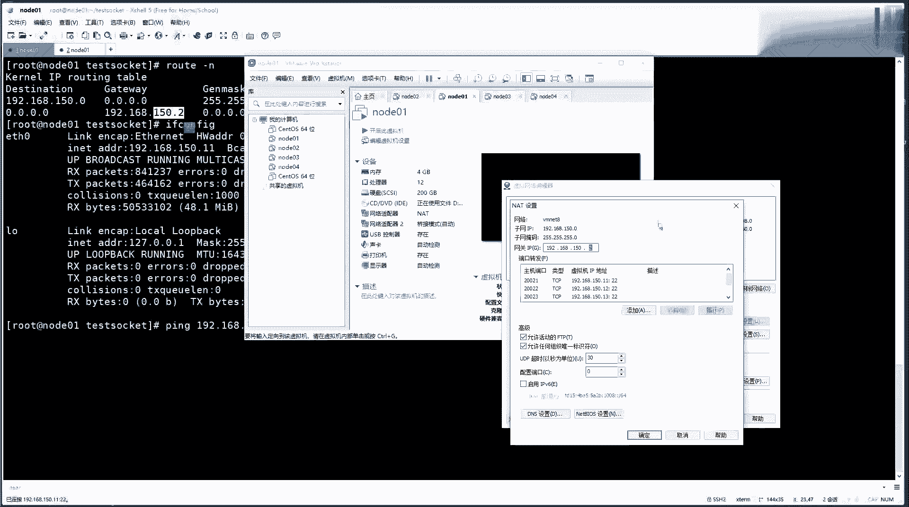

听懂这句话的同学上边一，其实在我来的数据包当中是客户端是以什么呀？192。168点110。100回元地值，目标地是151。168。点150。11作为目标地址。

这么这样的数据包紧进到我的wininux主机了。但是这个数据包如果以10。100返回给客户端的时候，那么它是目标地址，它就变成原地址了。它作为原地址。

但是这个是目标地址只能走这个路由条子就扔给了这个10。2扔给他之后，他会做net地址转换，会把150。11换成10。2。那这时候回到windowswinds就不会认他。

因为wind度从来是想曾曾经是10100和15。1，而不是和15。2，所以不对称。所以三次握手第二次回去的包被windows丢弃了，所以这个连接根本就没有被建立上。听懂学来说个一。

那么如何解决这个问题啊？哎，如果解决个问题，就是不让他走这个net转换这个条目，这个默认网关。其实走只要能因为我windows上是不是有个10。1，然后我的下一跳不是10。2是10。1。

只要扔到windows上，是不是windows就可以根据本地的路路由条目交给我对应那个那个回送的一个客户端，对不对？只要加一个路由条目，你看ro条。ad杠house添加一个主题条目，这个主题条目是谁？

就是192。168。150。点1我想10谁后端谁啊，11这个10110。1的，因为你的目标回的目标地址是不是这个地址？就是你你刚才咱们这个数据包，如果回去的目是10。100，那这个数据包扔给谁不能走他。

那他的吓一跳应该是谁？他的吓一跳是KTV网关是谁呢？是1。2。168。150。1。0。1就是windows上那个网卡。因为linux自己在150那个网络，linux自己的是11。那我的下一跳是谁？

和我同局网的windows那块网卡，一是作为我的吓一跳。然后只要是目标地址是这个数据包的，就往那个windows网卡去扔，就进了windows了，进了windows就会找到我曾经那个客户端添加。

先看我到儿给你话筒你就明白了，但你要先跟着速度走，你先看到这个东西，你现在看到了是不是会有一个路由路由条目，就是。直达10。18的是要扔给10。1，对不对？能看到这个这个这个条目吗？这个条目能看懂之后。

我们再把服务端启动一下。把服务端又跑起来了，你看这时候进来了，是不是？是不是就两个两个叠加进来了，然后把它整个整整体结束一下，重新走一遍，就只加了一个路由条问题就解决了这个问题。啊，服务端那边也停掉。

跑起来哎，他已经跑起来，他就能已经跑起来了，然后这边再去执行。

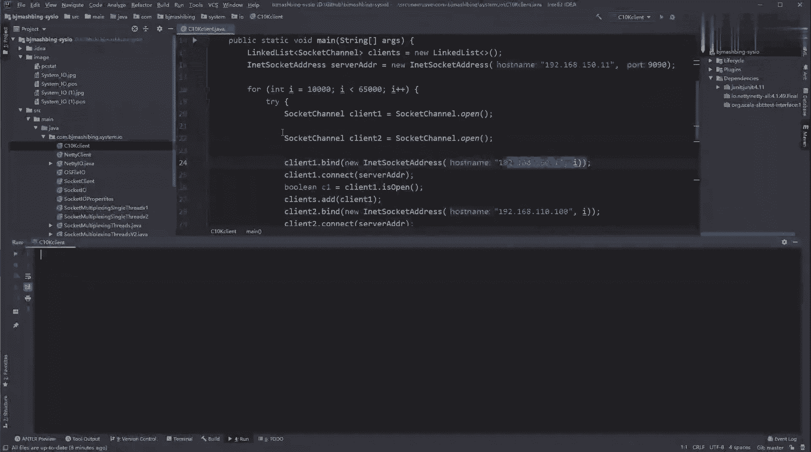

然后看哎1万100110023456，他们会有一个差，但是也也基本上程度出现了，是不是程度出现了，不光是程度出现了，你再用这边的。

net state杠NATP看连接连接里边是不是会有同样是我服务端的一这个10。11，然后9090的会有来自于110100的，会有来自于10。1的。只要保证4元组中有一个是唯一的。

有一个是唯一的这个sty就会成立就能区分出来。现在能get到这个点回来说不一也就是说，其实这个东西如果一直让他跑，虽然很慢，虽然很慢。我一直让他跑一直执行下去，我这边的一个进程。

就可以对一个服务器发起11万的连接。

嗯。就突破了6535，其实6535还是针对于什么呀？就是一套资源组里边的啊，那么这个客户端端口号就是剩下三个维度都一样。那端口号的变化的变化的这个区间就是6535，对不对？

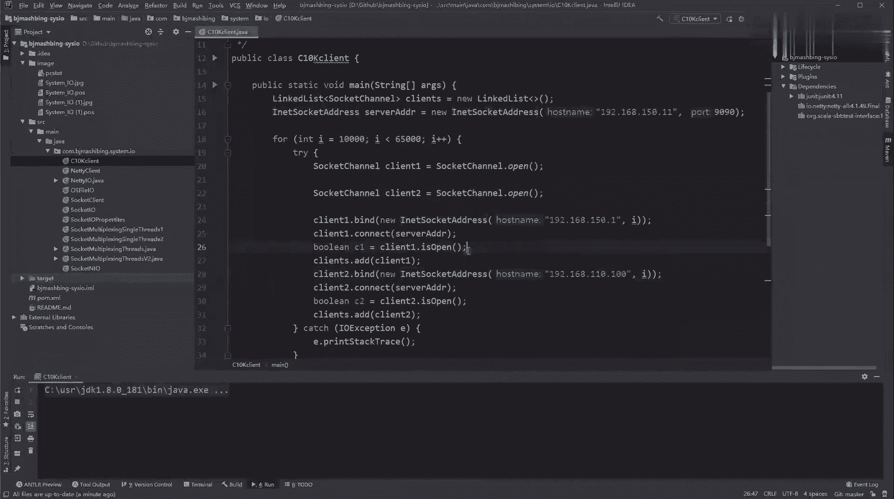

而且从现在可以看出啊，速度并不是很快。发了吗？速度的连接的间变速度并不是很快，为什么并不是很快？第一个问题解决了，就是同一个我可以建立实施，就是只要深组唯一，我可以建立很多，对不对？

文件文件文件标书没有上线这个事儿，我但是用另外一个例子给你演示啊，这个这个等到那个达到那个突过了1024的话，有点慢，待会我给你演示的。主塞嗯。是完全是阻塞的问题吗？这对我给画图啊啊，看个C。

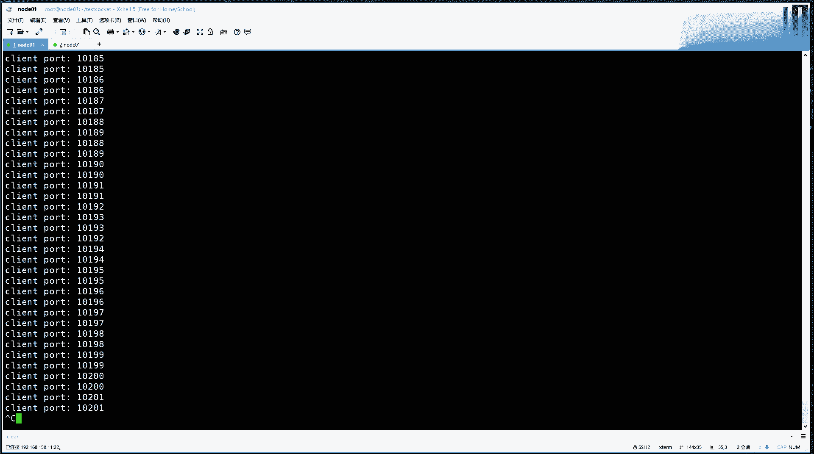

就是你把这事儿想把IO这事儿一定要想明白了，好多事你可以理解了。

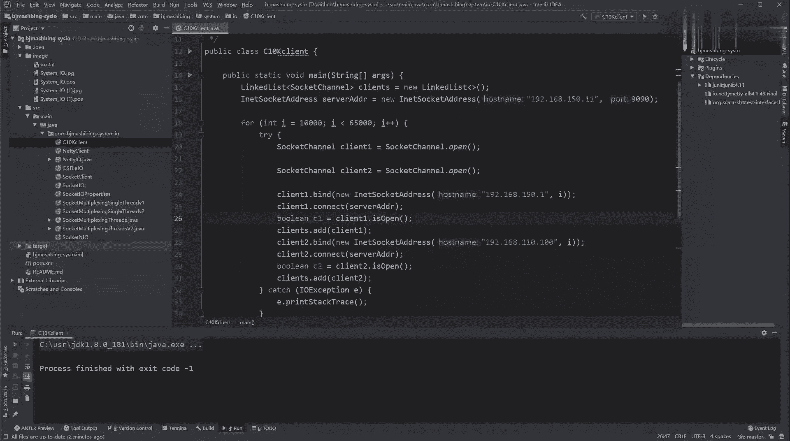