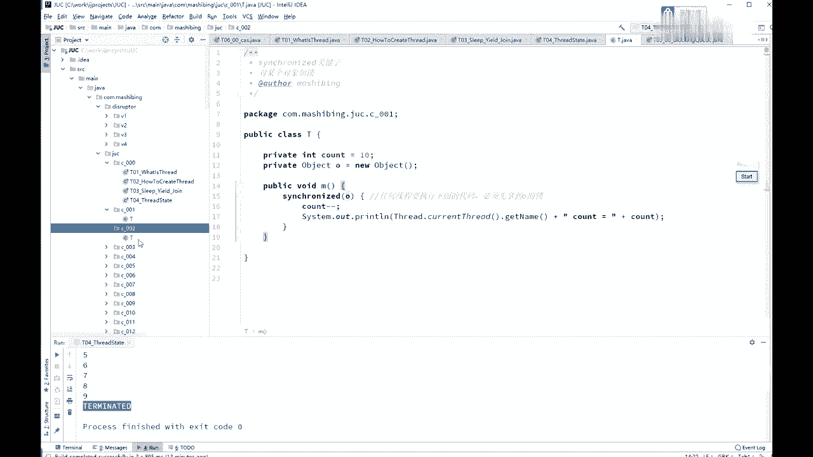
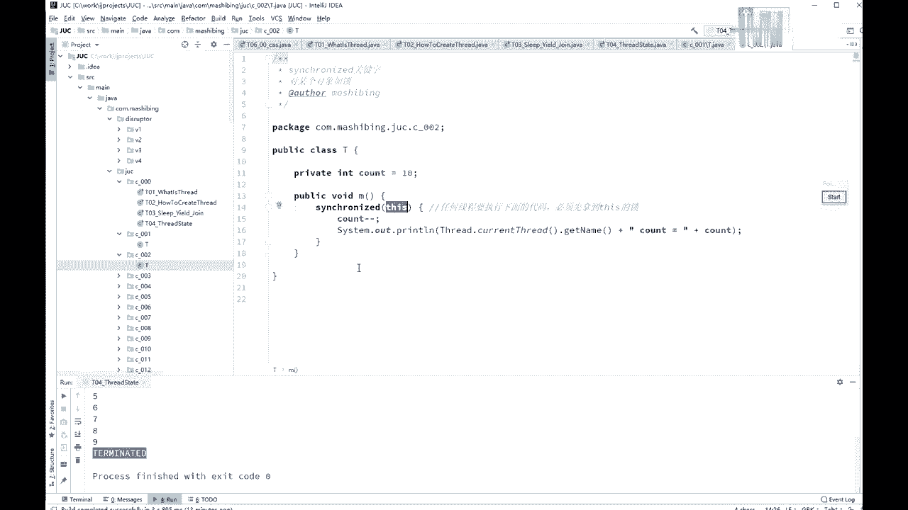
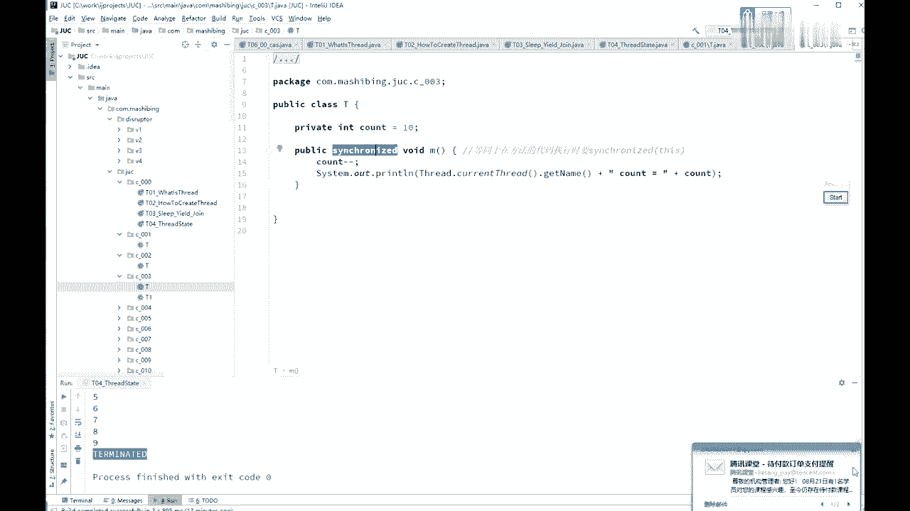
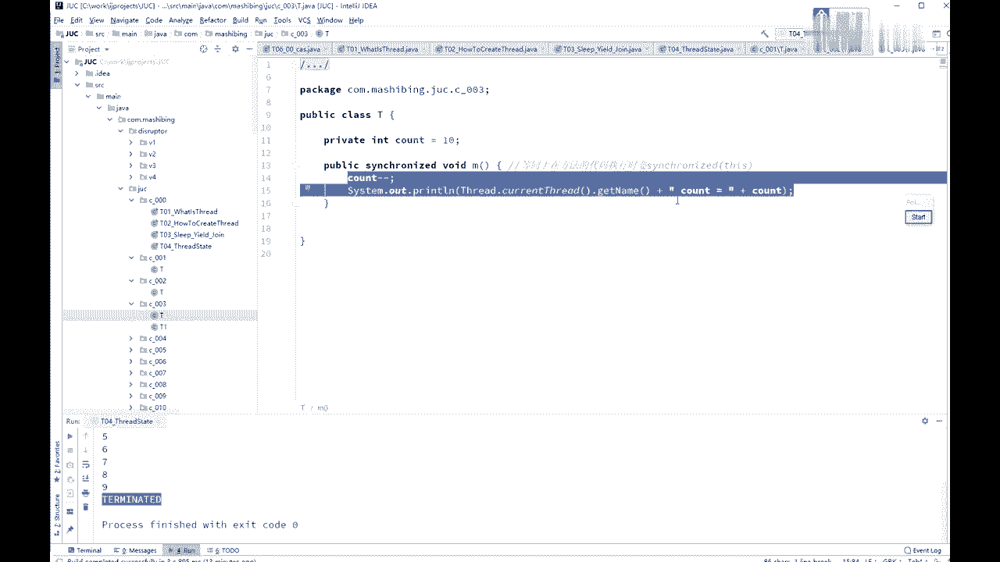
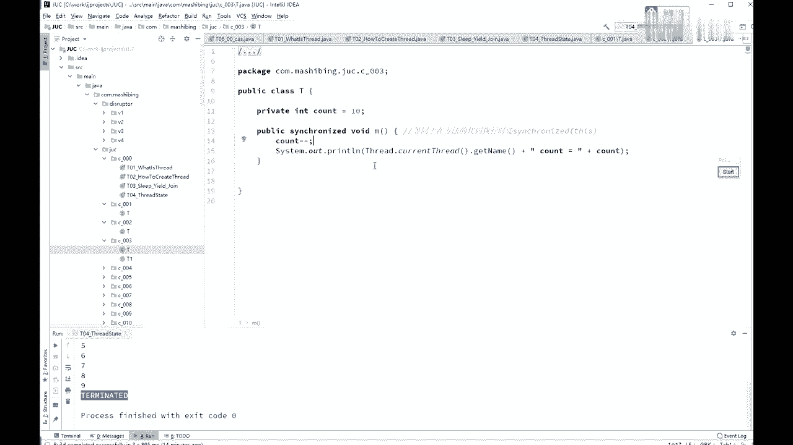
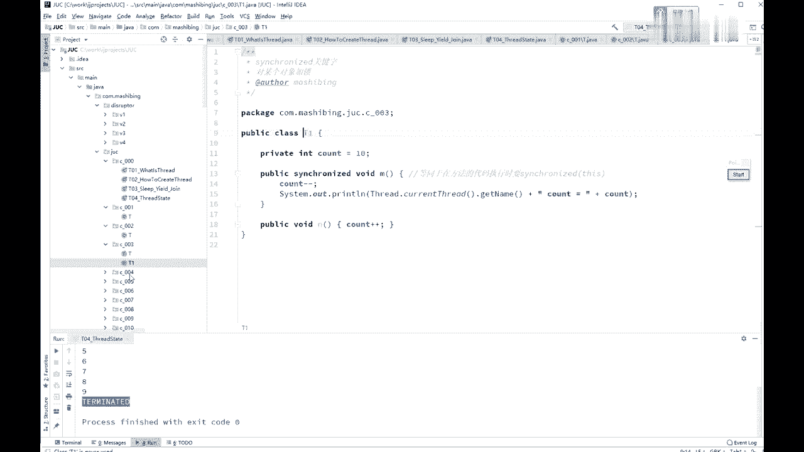
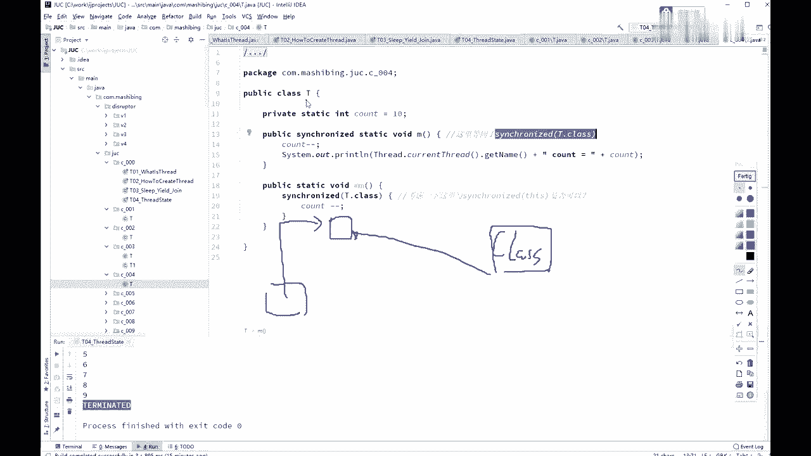
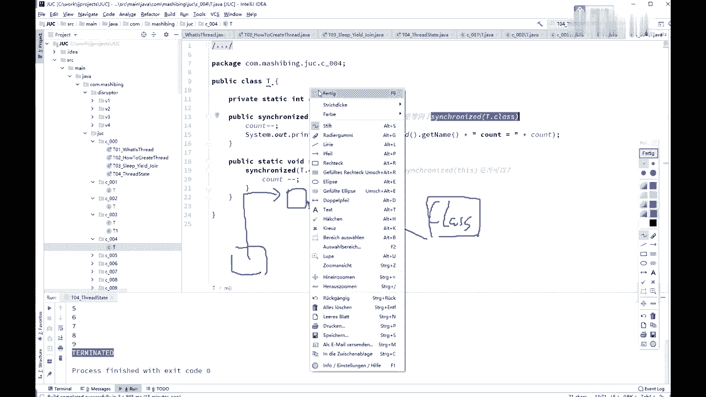
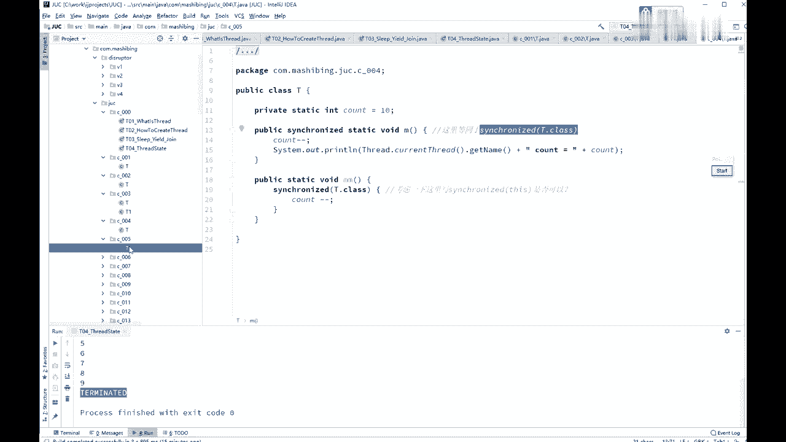
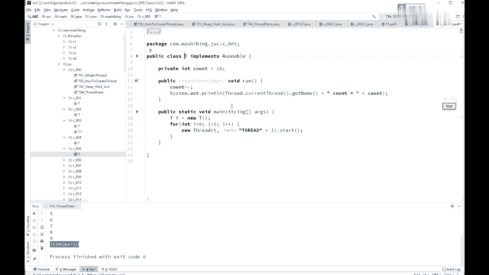

# 系列 3：P18：【多线程与高并发】锁的特性 - 马士兵_马小雨 - BV1zh411H79h

这个所谓的最基本的概念啊，我们来谈一下synchronized的它的一些个特性，如果说你每一次都定义一个锁的对象，就是object order给它new出来，弄出来一个一个对象，那这次枷锁的时候太麻烦。

你每次都得用另一个新的新的对象出来，所以呢有一个最简单的方式就是synchronized this，锁定当前对象就行了。

那么如果你要是锁定当前对象的话呢，其实你完全可以写成public synchronized的这个方法好，所以synchronize的方法和synchronize this。

symnet的方法和synchronized this，在this里面在执行这个代码。

它是等值的，是一样的。

那么那么大家知道呢静态的方法啊，静态方法static方法它是没有那个类似对象的，因为你不需要你有一个class new出一个对象来，就跟就能执行这方法，那这时候如果我在它上面加一个static的话。

加一个synchronized的话，这sychronized代表的是什么呢，这里代表的是synchronize的t点，class，说到这个tter class，大家知道那个每一个class文件呀。

漏到内存之后呢，它会生成一个专门的对象，哪个类的对象呢，class类的对象和load到内存的这段代码相对应，所以呢这里的synchronize的t0 class就是锁的是谁呢。

锁的是t这个class的对象。

他也是个对象啊，就是class那个类的对象而已。

特殊点和其他的没有任何区别啊。

