# 花了2万多买的Java架构师课程全套，现在分享给大家，从软件安装到底层源码（马士兵教育MCA架构师VIP教程） - P191：【IO／NIO】Linux速度慢的原因 - 马士兵_马小雨 - BV1zh411H79h

对吧OK那么这是第一个知识点啊，给你补全一下。另外一个就是它的速度为什么慢，速度为什么慢？这里边你要明白，就是把这块要放大了，这块要放大，刚才是整个网络拓谱。那么把它放大之后，你要理解了。

在我的整个程序代码当中，我会有一个服务端。有一个服务端，服务端，我代码逻辑是就是类似我上面这个这个代码逻辑啊。但是整个逻辑你要想明白了，服务端它先是一个主线程。我把内核服务端的内核标出来。

内核那其实一个客户端，我们先说一个客户端，你把它是在放大嘛。如果一个客户端来了。so这个s有事都不用管了，这客户端反正已也来了。当一个客户端。连进来伸走三次握手。un似work这事儿。

无论你什么IO模型，这块是必走，它是必走，这个没有什么争议。但是un似wo之后注意注意听啊，是你这个主线程当中是不是在一个死循环要accept。这一个死菌丸，他准备的。

except并当你这个accept这个由就是他村子口来了之后，时间到达之后，except有返回值了。但是这个返回值注意他要做一件什么事情，要抛出一个线程去，要克隆得到一个线程。Sund。

那么抛出一个线程，这个得到side这个过程当中，其实它这里面完成了那核，就是这里面这个线不应该这么去掉。就是在这个位置要得到这个线程，它这个程序和内核当中又一次系统交用，就accept是一个系统交流。

这个走掉，但是关键是exccept接收一个图端之后，它要多发生一个。克隆的性交用来得到我们的这个现程。这才是弊弊端。就是抛线程这个事儿速度有点慢了，有心得用，那用上也没再切换。然后呢。

那会儿还要去做做线上那件事情。啊，创建线路创建线成之后再回回回回回过头来，它才才能回到你主线程。你主要人才能去接收其他的口端连接。因为这里面是一个循环，一个阻塞的。

accept是一个循环阻塞的过程线性的。就是慢就慢到这儿，这是主要的罪魁祸首，就是会一个克隆线的过程。到这儿能听懂您来说个一。这一个是这样的，另外一个客户端来，是不是也是走这个流程。

走这个流程前面这段是抹不掉的，关键后面这段是重复操作，重复操作，不是工作现制啊，这这个慢了。好，我们找到弊端之后。啊就是抛现的这个事儿有点慢。那有人说啊我们可以持化，比如说在服务启动之后。

我是不是可以先创建出11万个线程？假假设都能创建成功，我先创建出11万个线程，你来一个，我就分配给一个县城，来一个分配线城，这这就是所谓我讲过的一个池化的概念，对不对？就是这个现线城池先准备好。

那来一个我就可以不用就少这个发生克种这件事情，因为现场已被创建好。啊，这样虽然可以提速，但是后来如果这只是接收啊，如果后来想去读数据的时候，那么更多的线程他们其实又进入一个问题。你这个线程在内。

你如果CPU合适就4颗的话，那么他们可能切换来切完去。啊，那调度这些线程，他们可能我正在调度前面挨个切换呢，那么排到第11万的那个那个那个那个线程里边来来数据，你还得等等到前面能切换到你这儿的时候。

你才能去读，还得等一个时间。这这是一期课的基础知识，是这并不是四级课，是一级课基础知识。好吧，整理这块啊知道知道为什么BLO慢这块能ge造的同学来说个一。其实在这儿你可以刚才有人说四级课。

你有的时候你去听四级课啊，其实四级课里边的很多。知识啊完完全来自于前面这一个课，有时，但是你不要认为四级课所谓的P8很表。其实前面咱们课讲的也是很深也是很深的啊。那么为了解决这个问题。

你要找到弊端是什么？整个BIO的弊端是啥？整个BLO的弊端是啥？那的问题是啥？来了。哎，我就垂直往下写啊，就横向来了。B端整体来回顾的话，就是因为刚才说了em阻塞，然后呢，你的readd读取也是阻塞。

弊端就是因为阻塞。要不然我们这你这个弊端如果找不到的话，我后边的课没哪讲。walking。对吧因为你阻塞了，你才会抛出这么多县程，每一个县城去拿着一个自己的IO在那自个组你别你的阻塞不响到别人。对吧啊。

你那边接收的时候，你自个儿阻塞了，你别用到别的人读取那个那个事，大家每个县城自个忙自个儿的，大家自己玩，所以最魁或者阻塞。那么想调优这件事情的话，那就必须要解决阻塞的一些问题。那阻塞是谁造成阻塞的。

谁的能力有问题才会造成阻塞是内核。啊，就是内核提供给我们程序在使用IO的所有的API所有的调用里边，现在是阻塞的调用模型。那只有内核提供给我们的A片，可以是非组册了，这事才能延延伸一步。

那非组册这件事情怎么实现呢？其实是像。

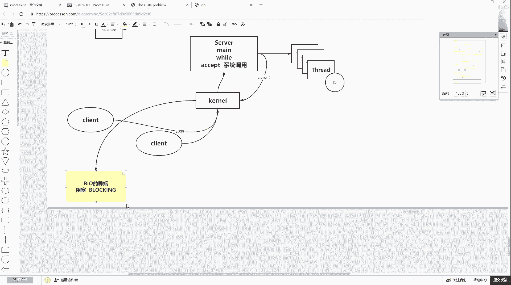

在那核系统调用的时候，来看一下。

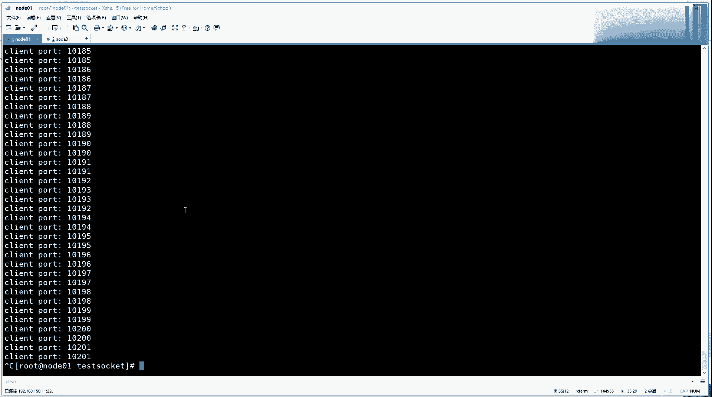

menu如因为这些知识前面你要先把我前面课程听完了，我前面课已经讲过了，在准备IO的时候有哪些性交用。you accept有 receive的软态。那他们对针对的都是这个得到这个网络连接那个文件标服务。

那这时候我们可以去看sing二类的。

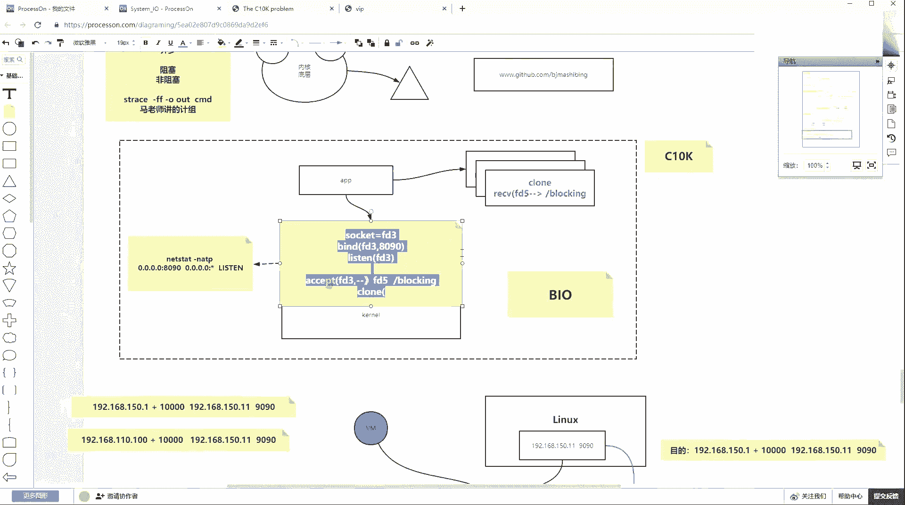

sit的看系统调用。这上节课已经讲过了。那么在准备sute的时候，新的版本内核当中会提供这样的一个选性参数。Yeah。就是会有一个socket name blocking这么一个参数。numb参数啊。

你可以在scket的时候可以通过参数传。那得到的这个文件面符监听的它就是非读做的。而且你其他的得到客户端的，还可以通过F这个fil文件控制这么一个二类个性调用来设置namemb block。不管怎么样。

你的监听的文件描符，你的客户端连接的文件描符都可以设置成非组色。那有人说了，那非阻色到底具具象这个非组合到底是一个什么东西？我们先是用实实例去看，用实例去看，打开我们代码，用java呢。

我写了一个非组色的这么一个代码版本NIO的。

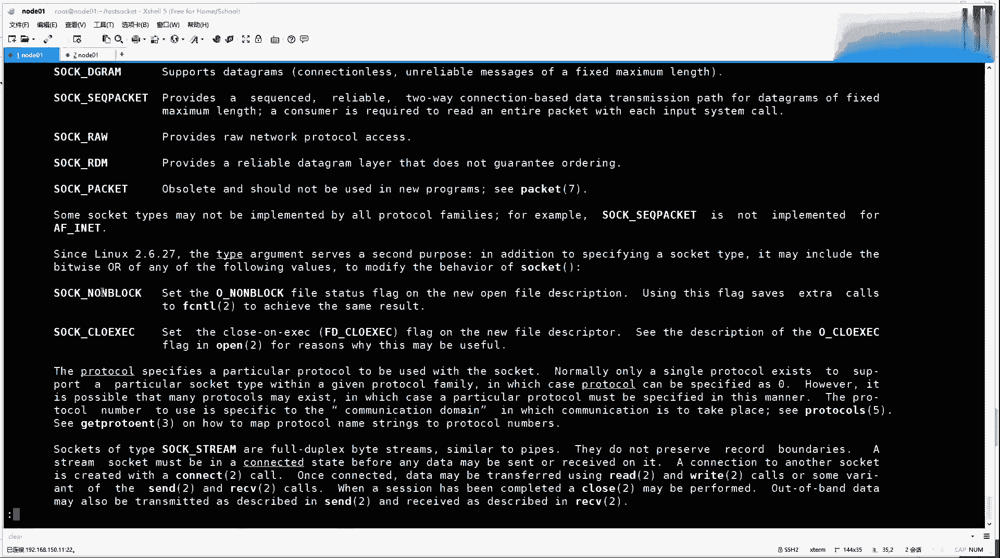

好吧。但是在这儿这个老生长谈啊，一提到NIO的时候，这个N字有两个维度。一个是你看java当中的这个GDK的点当中有点NL。

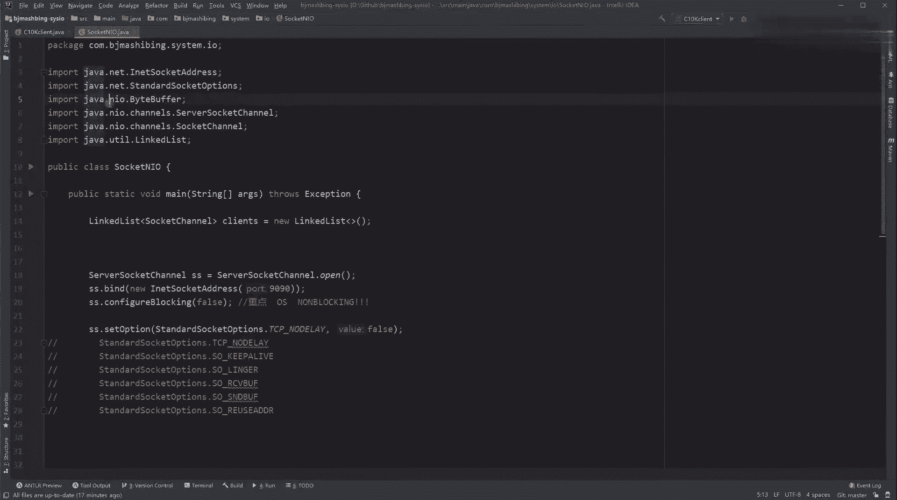

啊，那刚才看这的时候，这个。这里面还有一个。

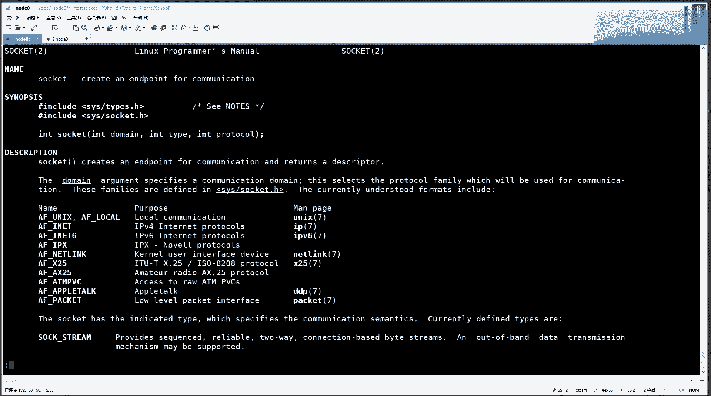

n block啊非主塞有两个。所以在这儿他头上我给你做笔记，这块一定要记清楚了。

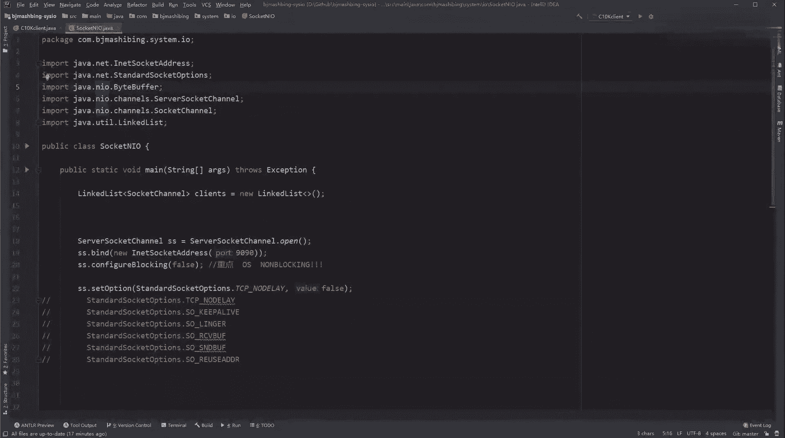

YO的N。诶。一个是在KDK里边。是应用IO的意思。一个是在操作系统。投案当中很难locking。的意思。刘慌啊，这个我知道我之前在reice和网峰制当中去讲过这个东西。但是为了咱们IO这个课的完整性。

我还是这么去讲，好吧。

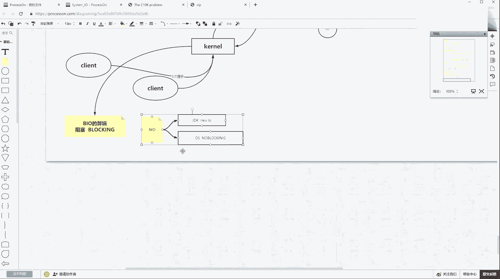

哎，那么有了个IO那这个怎么去操作它？首先啊你用的是DPK的NIO新的IO这种这种东西，那就出现了。其实在前面讲文件IO的时候，也带过这些东西，它里边有channel的概念，只不过现在不是fi参。

是s channelnel。然后呢，其实还有ffer啊，还有都是复文器概念。那现在先简单演示一下这个这个代码。现在是以基于网络的通信上的一个face子册，怎么去做的。是准备的，你看之前你有serv。

现在是serv点channel，这就是新新的API的使用方式点open，你会得到一个serv channel一个通道。其实有我们之前在追踪底层代码时候发现了linux的文件描符，它是可读可写双向的。

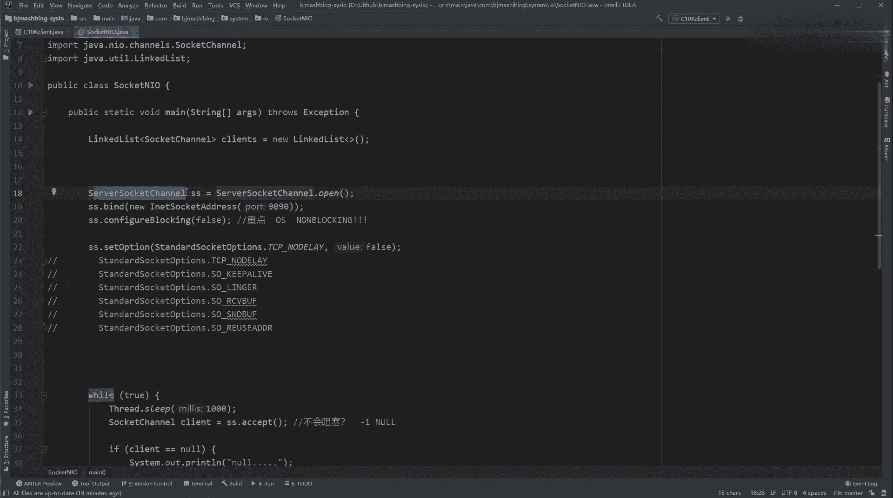

他是可读可写双享写错了吗？那少一个。

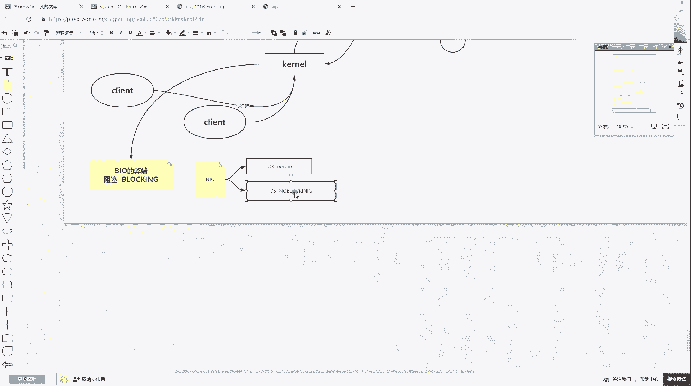

那像嗯这个类这个java当中，它分布了一个channel，这个channel是不是也是可读可解双向？对吧其实这个绑定的就有点这个十年河东，十年河西，以前是把IO输入输出两个分开了。

其实到channel里边把IO这个事给你淡化了合在一起了，就是channel就有点像文件描述符一个初相层。那么得到了一个s channelnelSS那这时候下边做一件事情绑定，绑定端口了啊。

绑定一个端口号是9090。然后关键看下面这一步SS点confi blocking false，这就是重点。我们的API是java的NIO这个N新的API。

但是confige blocking force是OS的numb blocking。这个两个你都见到了，这块能听明来说ber一，那就是在设置我们那个listen监听的。

因为server circuit嘛，它是监听的，监听的也不要阻塞。那么监听不要阻塞的语义是什么意思？也就是到下边，如果拿着这个SS这个serv so。第二accept的时候，它就不会在这一直阻塞着。

那不阻塞代表着一掉就会有返回。那返回的时候，别人如果不见连接的话，你得到这个客户端就会出问题。它不代表任何后户端。那这时候其实就是在操作性层面是负一在招务名对象里边那。如果得到了。

那就得到了某一个客户端的具体一个文件面符一个数值。设置为te就回到了blocking原始的一个状态。这点excel是在这阻塞，就回到了BIO。如果设置成fis，就是NIO。听我同学来说波一啊。

这个很简单的一个事儿，对不对？啊，那注意这是listen状态啊，这是leaen状态。就是你 sorry监听的一个状态。那当得到一个客户端之后，那你看下面分支判断的时候，如果客户端为空。

那就是掉了except没有阻塞，告诉你现在没有没有人，那就它为。那现在没有没有没有客端连进来。然后另外一种情况就是我掉了ex，这会刚才有人已经建立个握了。

你就把那个那端创建了一个文件描绑定它就是4源组有一个key，这个 key就是文件描代表它得到绑到这个客户端那客户端就不是就不是那就有了有了之后你除了可以给list状态的设置 blocking为 false。

也可以给你的一个连接的客户端设置comp blocking为 false，这个也是重点。那么。如果我客户端连接设置成非阻塞了，它的目的是啥？先不用管这个先看整整整体的概念。那么下边如果拿到客户端的时候。

它的read的读取客户端数据的时候，那么以前是要人家发了数据你才能读到，人家不发，你一直在那阻塞着，你上边做了非阻侧了，连接非组侧了，客户端非组侧了。所以这时候就不会阻塞，不会阻塞的话。

那你要么就是别人已经发了，你调了正好读到别人发的东西，那就是大于零的一个读到字节数，像那个b里去读，要么就是什么呀？你读为零或者读为-一，对方已经断开了。就是这么几种独到的可能。所以下边会判定。

如果它大于零做一件什么事情，然后其他其他盘景没有做，这只不过演示一个连接。在这里面NIO就是JDK的NL新IO里边，其实这就发现了一个8ffer8ffer这个分配的方式b bufferffer。

然后可以直接内存分配，你可以在堆里分配，可以在对外分配。这个其实在前面IO课里边已经讲过了，它是不重复给你提个下。这些是DDK的new有的东西，像confige locking force。

这是操作系统。当中的face子色的意思，整个逻辑代码其实是完全在一个县城里整规捋一遍啊，准备了一个link list，在一个县城里准备了一个link list class。然后呢准备了监听的SSS。

并设置了非阻塞，然后向下死循环在当前县程做了一个完最大化的一个死循环。这个死循环里边上来就从SSso里边去接收客户端，可能接收到，可能没接收到。如果你假设接收到了。那么这个时候就就得到这个客户端了。

那就把客户端也设置成非阻塞，并将客户端艾特到我上面这个link list里边去。为什么？因为你现在是一个线程，随着你服务器运营时间可能连了一个10个摆个1000个客户端。未来你上面这个这个循环里边。

上面这个环节，循环的前头部是要接收客户端，但是这个客户端你只。添到了例子里边，你下边还要再用一个循环去便利那个例子，再用空间去挨个去问每一个客户端，谁有没有发数据呢？

这就是这就是非阻塞在单线程里边接收是接收便利数据是便利数据，分成2块，在一个死循环里，这个逻辑现在能get到的同学来说边一，这就是所谓的非组塞代码。

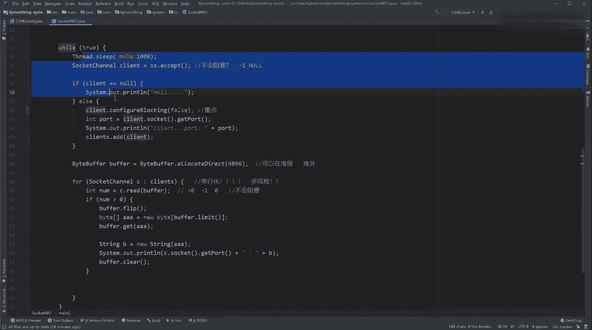

。Okay。

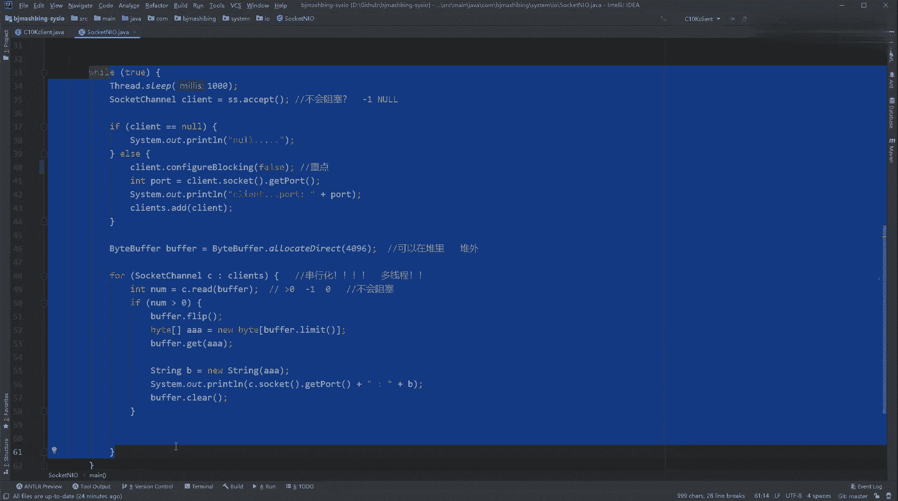

那么这个field代码呢，在我的linux上也有。

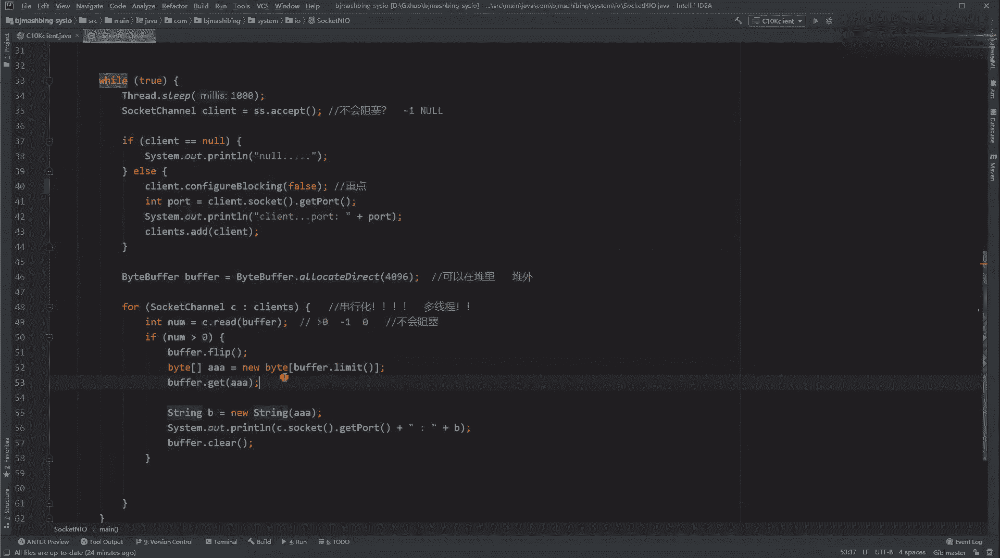

首先先去验证一个东西。

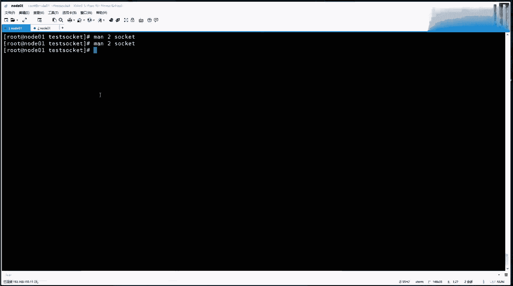

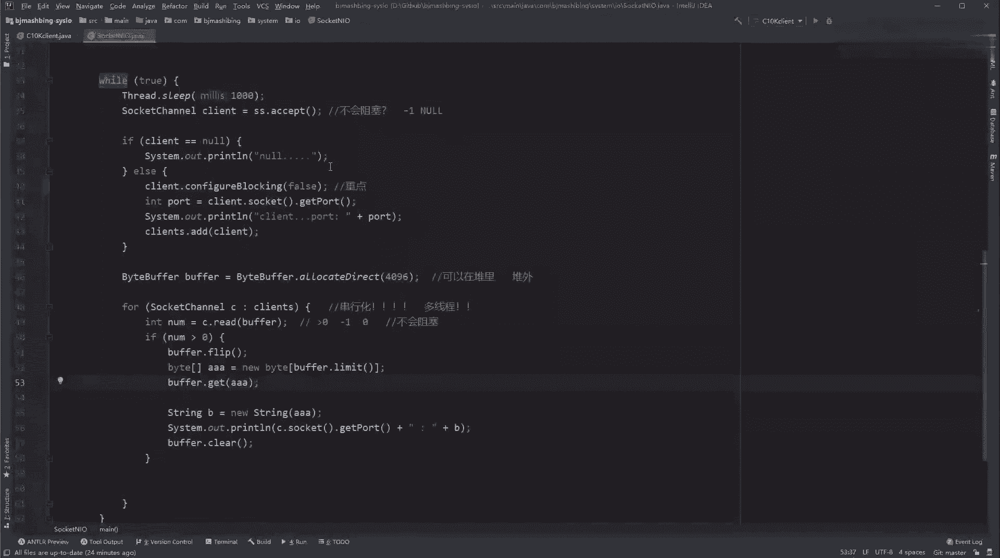

这是s的NIO啊，就是他我们先去验证一个知识点，非独特到底是怎么实现的，还记得怎么去追踪吗？这个在性用交用上。啊，不要关注注意啊不要关注我代码里边的一些逻辑的这个处理。

我把代码尽量的只写出我需要那个代码逻辑。然后呢，肯定有bug。其实我之前发过这个这个ki代，已经发过这些代码。我今天在在我讲过之前，我还发现还有bug，但你们从来没有我反反应过。

那证明其实代码里们没有看过。

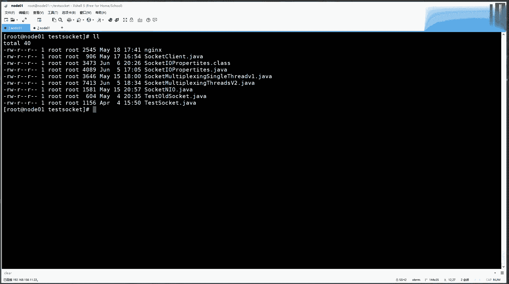

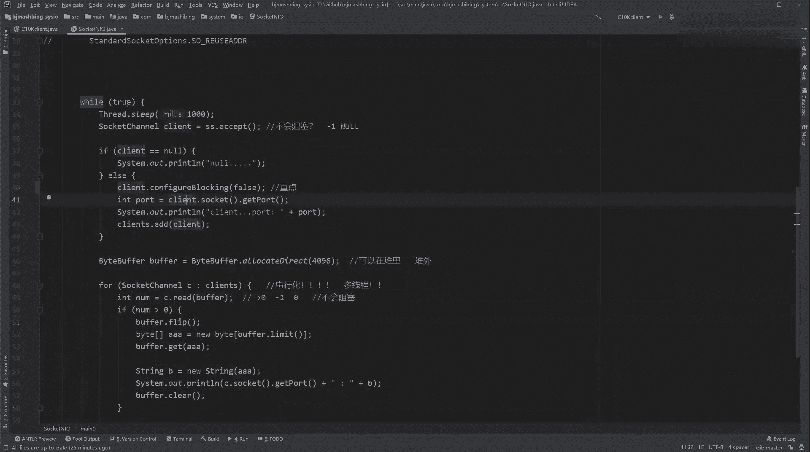

这这并不重要，重要的是先去琢磨原理，后边代码写的这个明细这个这个环节。其实这些版本代码里根本未来没有机会去写。

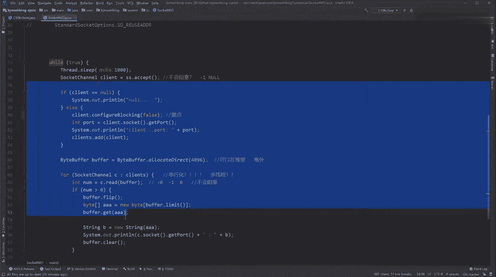

未来就直接去写nty的API就可以了。现在指的是明白原理的过程。用 screen。随时追踪让FF追踪所有线程，然后杠O输入的out开头的，然后追踪什么追踪java，然后执行的是我们的。

socket的NIO这样的一个类，但是这个还没有编译，所以在它执行之前，我要javaC去编译我们socketNIO点java编译成功之后再去追踪它，我就整个压在一行去写了。这是Lux的命令的衔接。

前面执行成功，后面的才才执行。好吧。😊，好，我们先把那会好起来加低。😊，从这个哎怎么不打印？怎么睡啊？效果不是特别好，我你先删掉。分青掉，我得改一下这个蛋。哦，我把电话电行杜掉，注是给你解开。

因为如果他每一秒钟循环一次，每一秒钟循环一次。如果循环一下的时候没有扩堂连接的话，那这个后端就应该为闹，我就要打一个闹成这样，让你看看这个效果。下来。好。一秒又一秒哎，就是代表我的循环。

我的循环是没有被阻塞住。对吧循环没有被阻塞住，听出来说说一。这不是还是在阻塞吗？

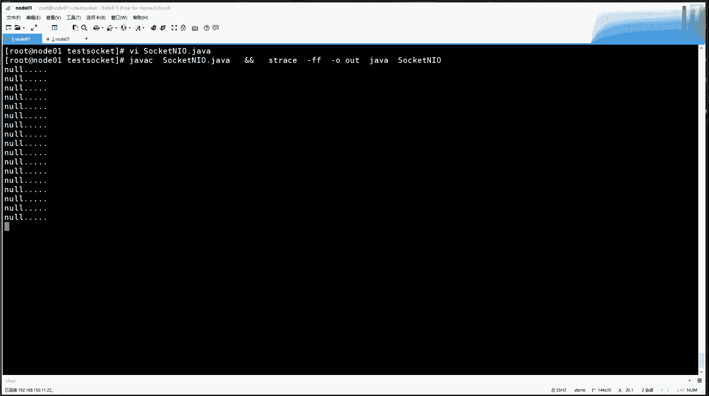

小朋友想明白，well循环在这个循环拟当中有一句话叫s pen line，它它前边会发生一个accept。如果它阻塞的话，它是阻就上面阻塞行为的话，那这一块一直阻的导的不动，代码不会往下走。

你就看不到闹的这个点。

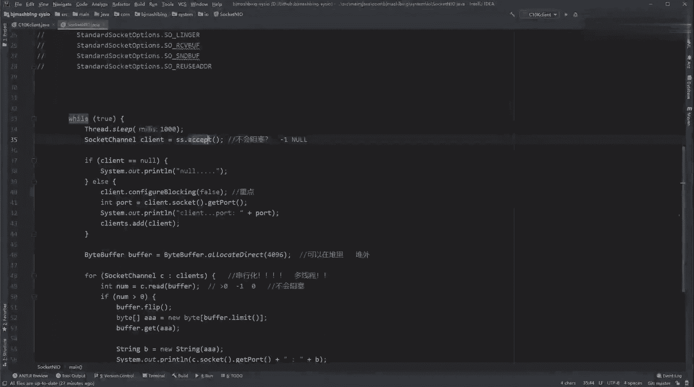

来。口说无凭。我把这个连接这块的非堵色给你制成处，好不好？就是看 blocklocking为 true就是阻塞行为，现在是阻塞行为。我水。然后再去重新编译啊，重新编译，重新执行走动吗？是不是不动了？

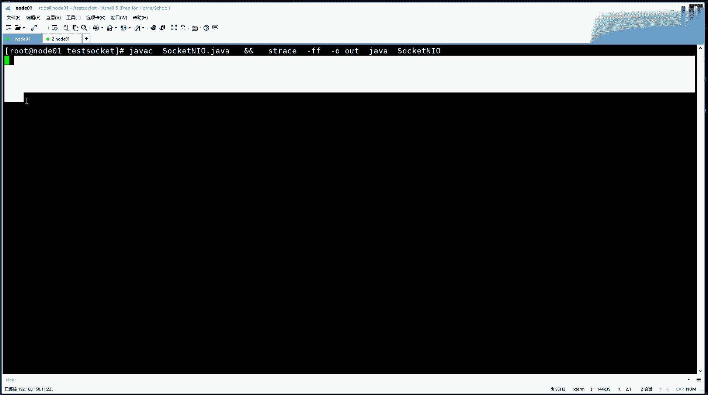

嗯。是不是不动那个点这点是不是打不出来了，为什么它挡不打不出来了，他就在这阻塞住了。

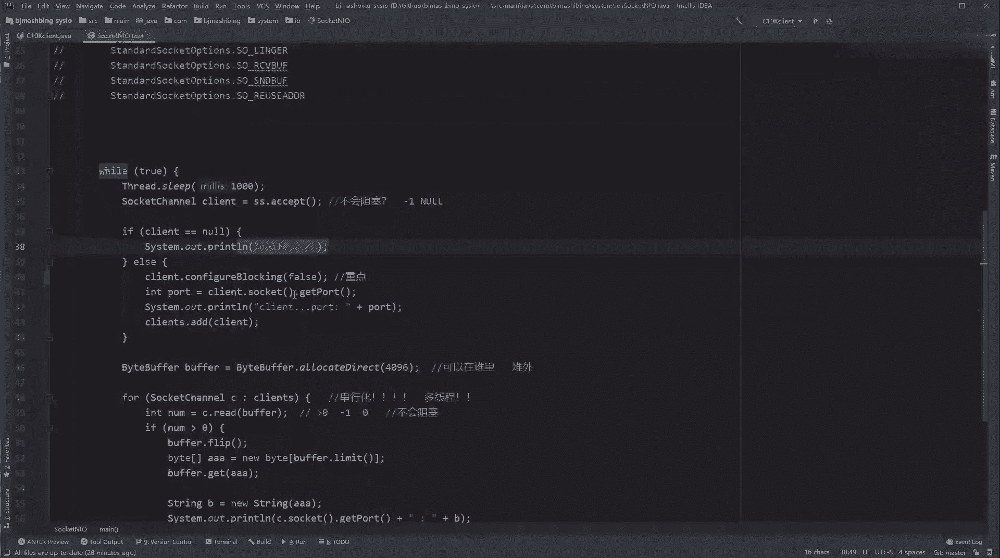

好吧，我们还可以给它取消一下，然后把木单的目布清一下。没事，有问题就问我这节个争取咱就讲一个比较细的版本。未来你们或者谁听了一个课的时候，就完全听明白就可以了。重新考刚才那个追踪这个这个这个过程。

该机一执行在这阻塞着，是不是阻塞呢？空空空口说无凭去到探 soet。这一个追踪的日志文件是不已经有了？哎，这个比较大的就是我们主线程2732VIO点2732。这是之前课程这个应用的能力啊，把前补全了。

你就会这会这些东西了。诶。诶。😊，今嘛。好，那么打开这个文件。我爸是VVM。你来到这个文件，追踪这个文件的最后一行，2855行，是不是调，就我GDK就java当中我们写的accept。

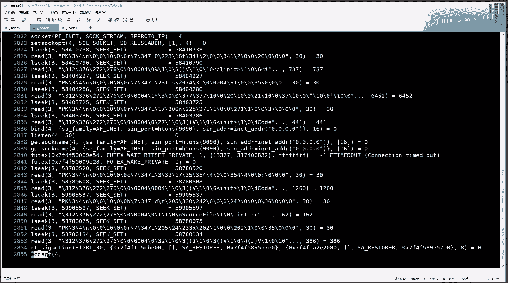

你写了一个acccept，是不是掉了底层操作性的accept，就这4分那秒符，他应该在这阻塞了。

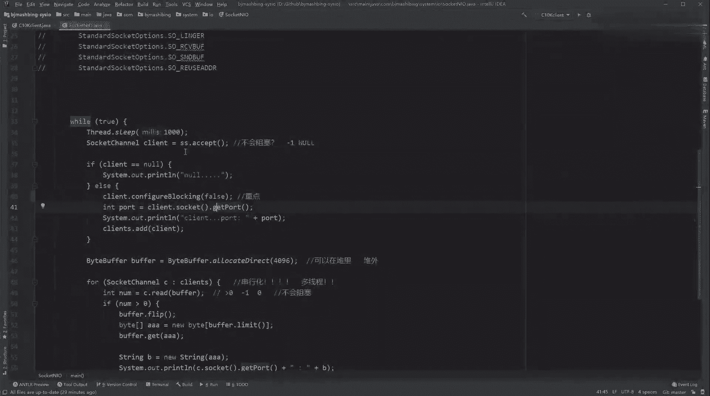

对吧嗯。这样看阻塞还是有好处的，不阻塞一直在输出，不是浪费性能啊，我不知道这么说清楚了没有，一会儿我给你解释，你先带着你个小文号，我一会儿给你解释啊。好，这个阻侧这事盖盖造之后，我们删掉所有东西。

然后再看你非组塞，它是怎么区域就行。你见到阻侧了，杠tC。然后呢，将那个目录清一下。Yeah。没关系啊。这就是你们能有很多的问号，并且你们的所有的问题都问错了。其实这个就我的预期就达到了。

因为的确和我想的一样，很多人在这块犯迷糊。在跑之前我还得编译一下。🤧就是我为什么不用VIM啊？是用VIM的时候，它有一些东西注射是蓝色的，在客户端看的时候它看不清楚。然后我不喜欢用带色。

带色的不带色的话全是白色，你啥都看不见，这个我也是为你们去考虑啊。false啊老阻塞吗？foalse不阻塞是成不阻塞了，黑堵塞了。然后再保存。Okay。那先跟种思路吧，先跟种思路吧啊，走待机。哎。

你看是不是开始出现闹闹了，对不对？那我们再来看那边。然后还是制作那个2804，因为新跑了一批奥VO点28。804。打这个文件，然后你会发现下边这里面是不是就是会有一个accept，看返回值了吗？

是不是掉了accept，它并没有阻塞，返回了-一，也就代表着没有人连进来。听懂来说说一。那重点来了，有人说这有什么意义啊，有什么意义。注意看效果啊，现在是11111堆打那闹那那对不对？啊。

我随便开一个连接进来。比如说。NC连local house。9090注意听这是不是要有一个客户端，这个NC就是netnetnet connection或net要去连接我们才台服务器ID连进去了。

因为它是非主塞的，它在某一次循环的时候，它可以接受这个客端连接，并且因为它是非主塞的。它是非组侧文。即便你在一圈循环之后，到accept的时候，别人没有连，但是你不会阻得住。

所以的循环下边的读取数据就可以在当前现程当中被有机会被执行到。

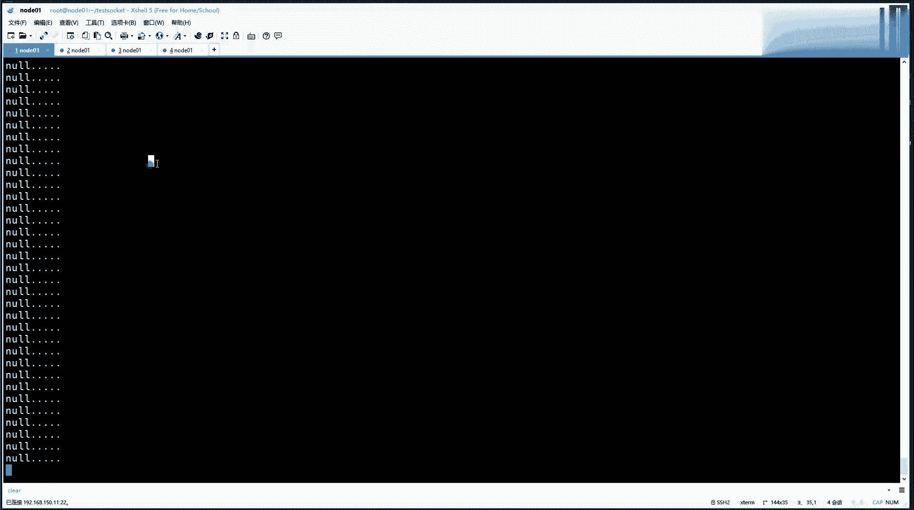

这个逻辑转过的同学来说个一，曾经你是要抛出去一个县这excel之后，你要抛出一个现场把这都能扔出去，那不需要抛县城了，完全有一个县城完完全全有一个县城。大家注意看啊，你演示。

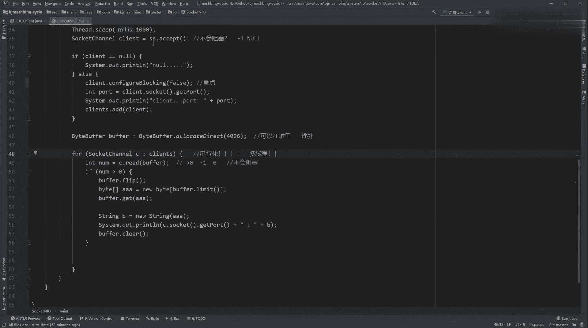

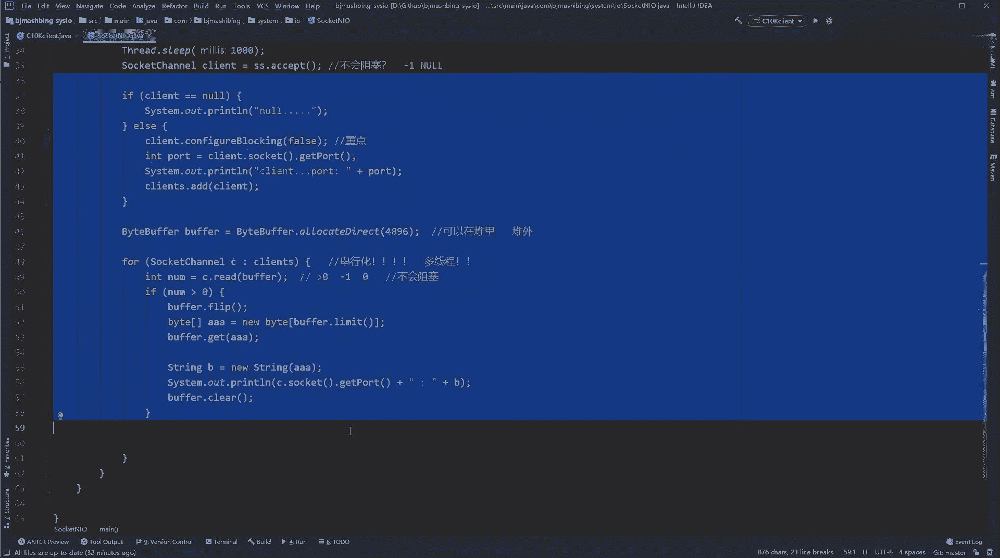

这第连进来是不是已经连进了一个客户端了，然后我是不是还可以再来一个客户端？单击是不是又连接一个客户端，两个客户端都都连进来了。那现在两个客户端连进来了，一会儿我要发数据，且这个在一个县城里边。

它既要满足excel接收，我后边还要便利，我另外两个客户端有没有读数据，有没有数据发送过来。你说如果它是阻塞的话，现在执行到外部循环BID循环回来之后，直行到这一行它阻塞别人发数据，他接得到吗？

代码是不是来不到这这这这这这这个区域，是不是代码来不到这个区域，他就不能够读取别人。

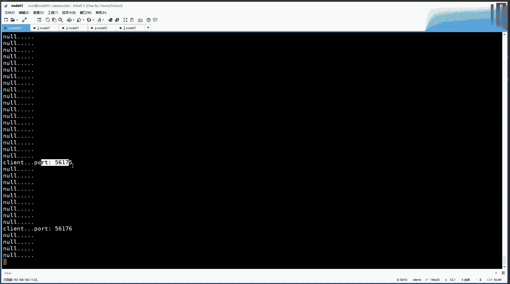

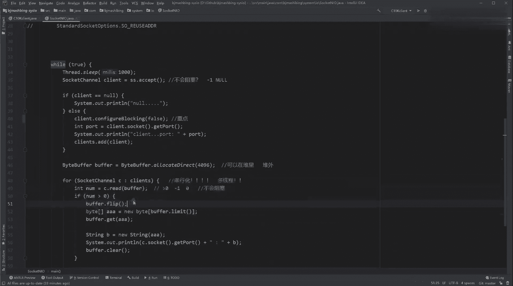

是不是单心能解决了这个问题，能听能来少数一。所以你看啊我去发数据，这个客户端发点字母的，那个客户端发点数字的，你看是不是在一个线程里边既可以解决接收客户端，又可以解决读取的事情。

只不过他们是被一个循环当中线性挨个去便于处理的。Yeah。现在能明白为什么要这个这个木兰N2是什么意思？木兰把你的问题抛出来。你先泡着，我给大家画图总结。

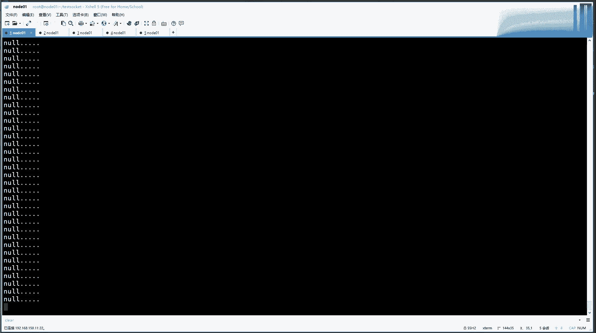

我给大家画个总结。那么其实要进入NL这个环节，你怎么去理解这件事情？其实你要明白是nblelog是内核当中增加了功能。那么再来去思考上面这张图。还是这样的一个逻辑。嗯，我怎么把它挪下来？Yeah。

我说个事。这个时候是NL，这不是BL。还没有多到多录复文器啊，那么还是我的application，还是我要去设置我的这个想先确进监听的。只不过在这里面这个逻辑上发生了一些变化。

他首先不需要抛出更多的线程，因为你要解决的BLB端就是不blocking。然后很多线程NLO里边是不需要更多的线程，你可以用一个线程或者用个别几个县程来处理一件事情。然后呢。

你的application逻为代码是先得到listen监听。当得到监听之后。注看把你的。MD3。3。设置成n blocklock。我们对这个监听的文件面符设置了一个非注塞，然后下边用了一个死循环。

循环里边accept。当从FD3去接收客户端的时候，这个东西就酷出色了。到这步就是这个循环里边啊，这个循环里边接收这个事儿不会阻塞，所以它就会有返回值。只不过这个返回值的可能性有可能是-一啊。

就是没有得到客户端。比如说ja人的有可能返回了1个FD4作为一个得到一个客户端，这两种可能。对不对？得到之后，其实你还可以再继续对FD4进行一个number。的一个设置。

那如果你给他设设置numbb locking，那么未来这是一个循环里边，你就有机会可以补选FP4，就是receieive。读取接收我们的FD4的数据。只不过我在java里边，因为你这个循环每循每循环。

一会FD418这5F66，你每次循环的时候，既要接收新的，又要把456所有客端便利。所以我用了一个liing list来接收给持有很多的客户端。那么在下面的时候，其实读取数据的时候是要做一个。

再做一个循环。就是两层循环，一个大循环里边，既要满足excel接收和所有客户端读取的便利，完全都在一个线能里执行成功了，它就不需要再抛出线头了。嗯。这只知道哎，我还没有到多了复讼器，我来处理一下。

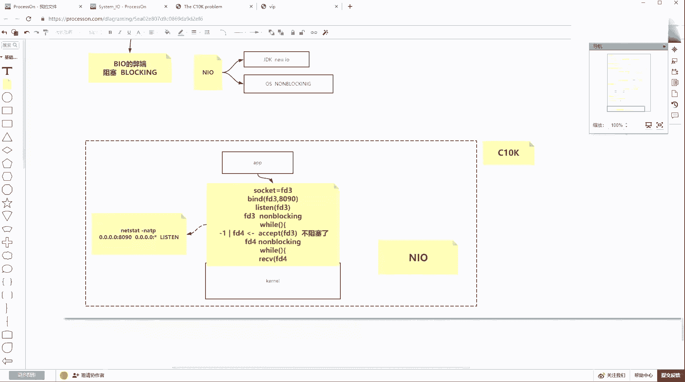