# 系列 3：P193：【IO／NIO】连接数超过1024的原因 - 马士兵_马小雨 - BV1zh411H79h

那会儿的4K为啥还没忘？对啊，4K这个事儿。Yes。是不是想问那个问题？She。Yeah。一緒に。这个问题。😀呵。😊，下就我查查的告诉你们好吧，我刚才也一脸懵，听出来了吧，我也在这，哎，我说4K哈是吧？

想明白吧？😊，嗯。Oh。

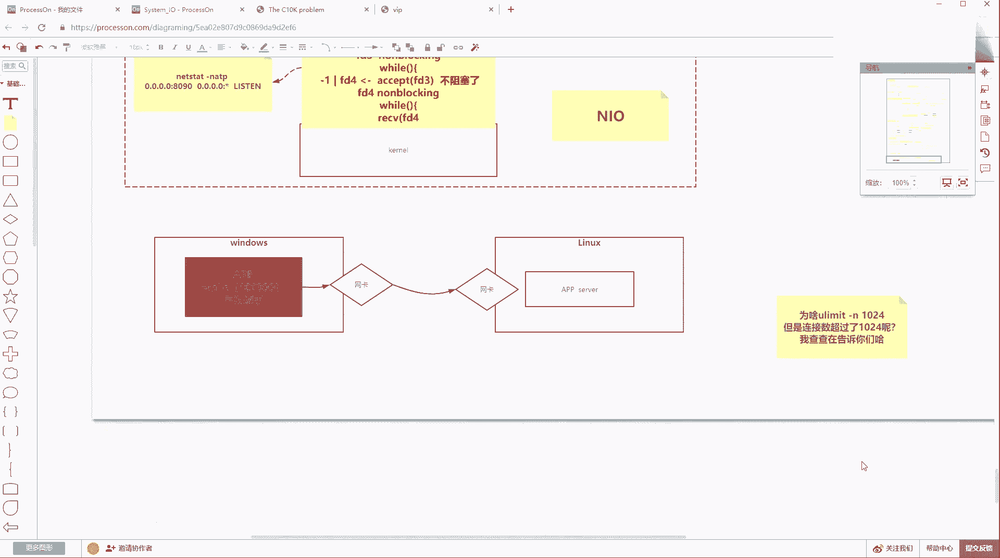

呃，这样啊。反正歇歇会儿，让让计算机别闲着。G已经存在了SU switch到get。现在是一个普通用户，看到吧？现在是一个普通用户。有limit表N。我看跟root有没有关系啊。还得不行，还得收拾回来。

image。1。24，然后再switch下。这个limit这样。现在现在一个普通用户约束了普通用户启动进程，他的完全服就是1024。然后粘了是s的NIO。然C的没有编译了吗？然C。

我猜的我猜的好像是跟入ot关系，知道吧？要不然说不通这个事儿。没有这个权限。甚体争议样。哦，这个不行，我这个目录啊，我这个目录是录的，还得把它挪挪走。宝贝。socketNIO点class。

到TMP目录CD到PMP日干。嗯。哎，我去这没问题。然后再让我们的gavastock的NIO把它跑起来，然后再去压测，看这个数能不能上去走。他他他特别闲着我我我们来让我们来休息，让他来跑起来。

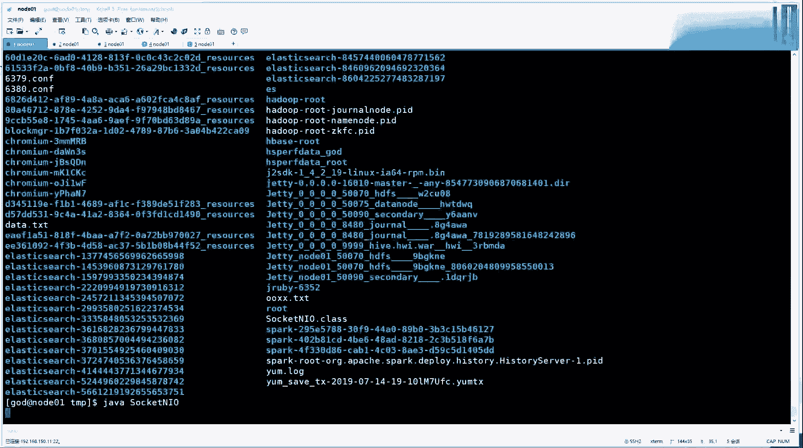

So。NIO是java的NIO是newIO里边的多路复容器select用的。

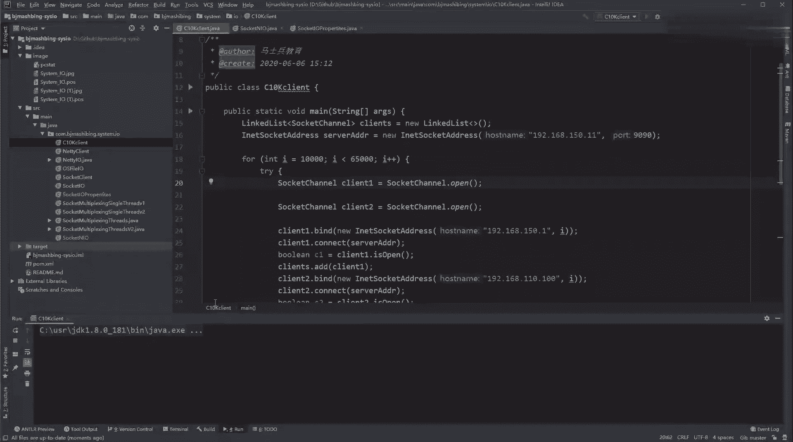

哎呀，这话怎么没说呢？准备连上了。oo many哎哎哎哎哎哎哎哎哎哎，看到没看到没看到没？小小伙伴们看到没？是不是这都是双的，都成对的，这是不是已经101几了，是不是已经101几了。

是不是 too many open files了，是不是是不是现在是不是普通用户，对不对？普通用户是不是完全受制于受制约束，但是你的路途用户其实有的时候是可以跳出一些限制。屌不屌屌不屌？

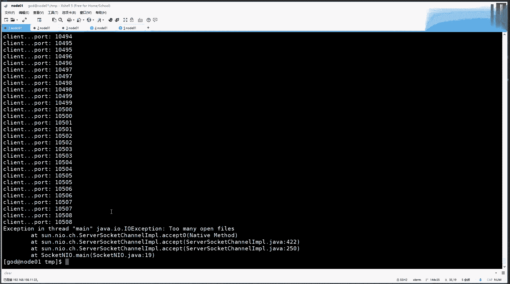

好了，不用我下去查了，我现在可以告诉你啊。😊，这个理论是对的，只不过要看用户。而且。公司。收少方便。等电。是 they。启动。所以这个理论是暂住讲。Yes。你咋拍的，我咋拍不到，因为那个。

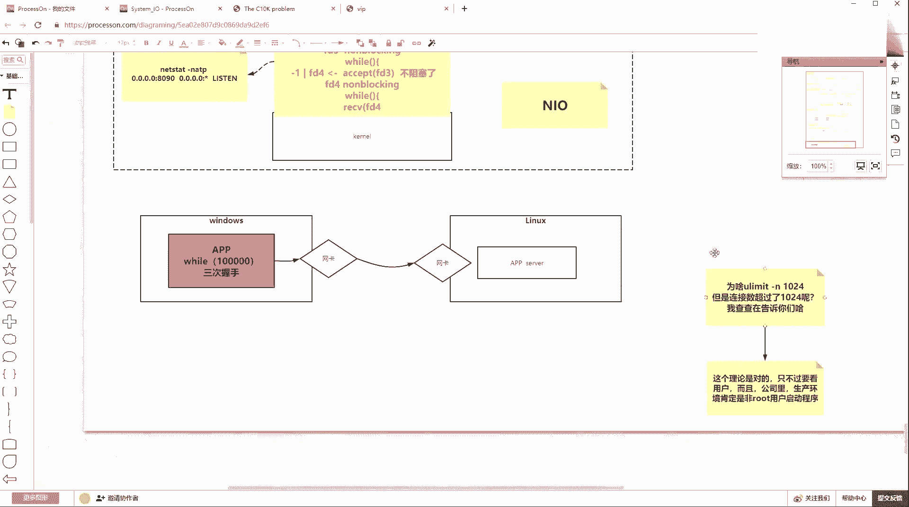

因为我意识里边意意意识里边有这么一个有这么一个事儿，就是root就全限在root面前是。

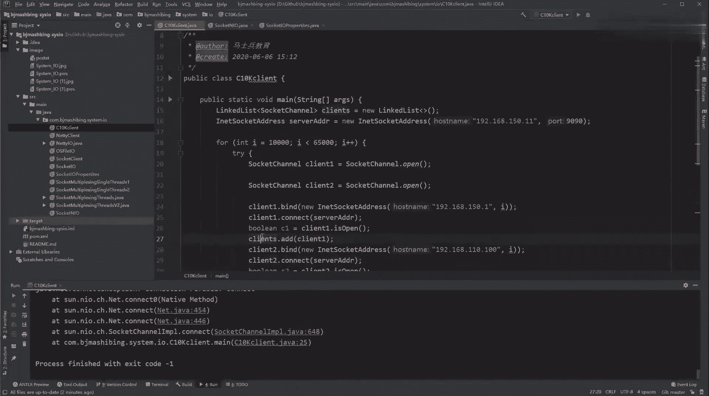

呃，等于虚设就这么一句话，然后很多资源的约束，其实在root这也是相对放放开的。

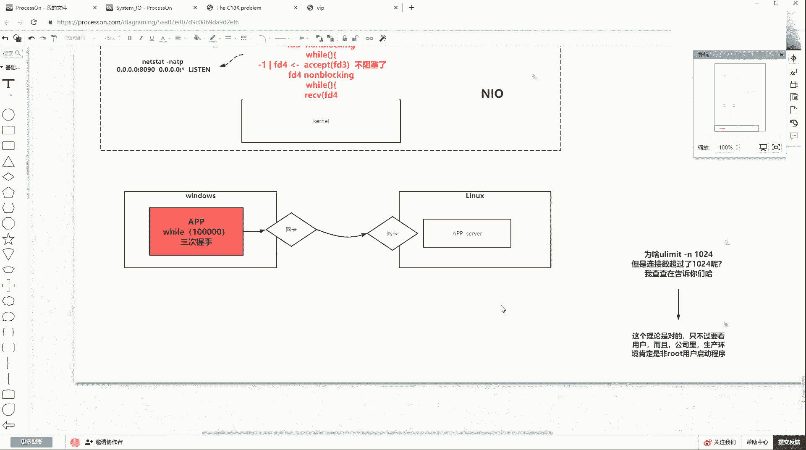

Yeah。为啥是成对？成对？因为我是我是在客户端代码的时候，我其实就是你看我客端C0K代码的时候，我I比如1万的时候，我是准备了两个客户端一扣户端2。然后客户端一的时候。

我是用1万这个端口号windows的1万。

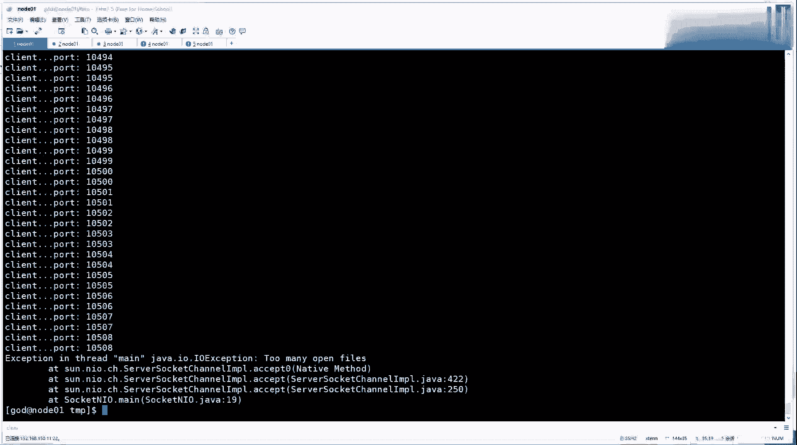

就是等于约等于windows上用了1个1。2。668。150。1，正好21万。然后呢，连了我们的这个上面这个服务器。去02192168点150。11的9090。然后又下边用用第二个cl。

就这做了一个connect连锁。然后第二个cllan。陈二又去绑定的是我客户端那边的。192。168点110。100，正好是1万。因为这两个变量I是一样的。

也就是都使用windows相同的1万弄号直播使用windows不同IP地址。但是他们访问相同的服务端。这9090。那这时候其实这这边是windows暂时制造的那翻回来其实就是在什么呀？linux当中。

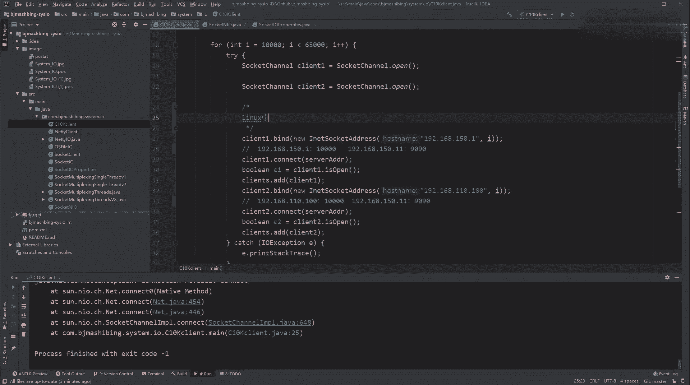

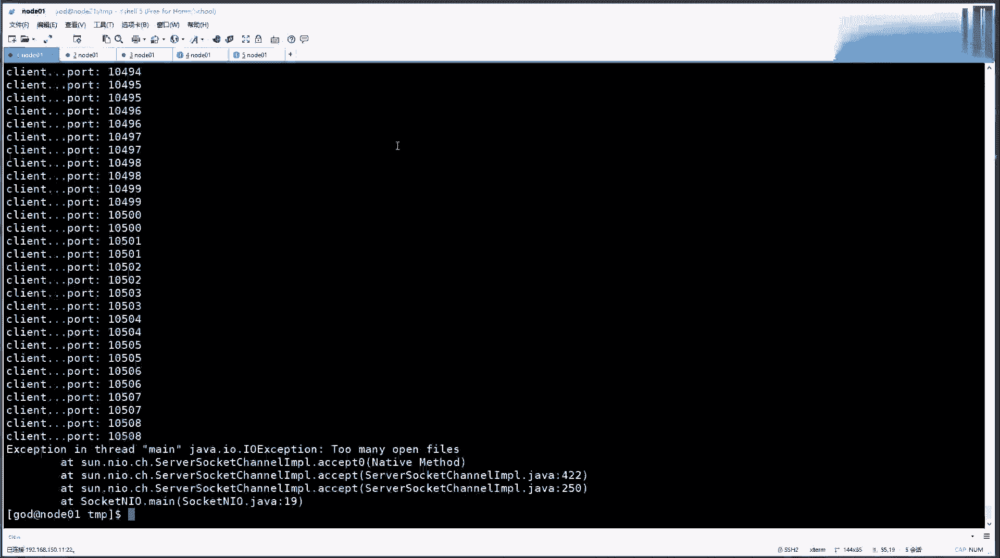

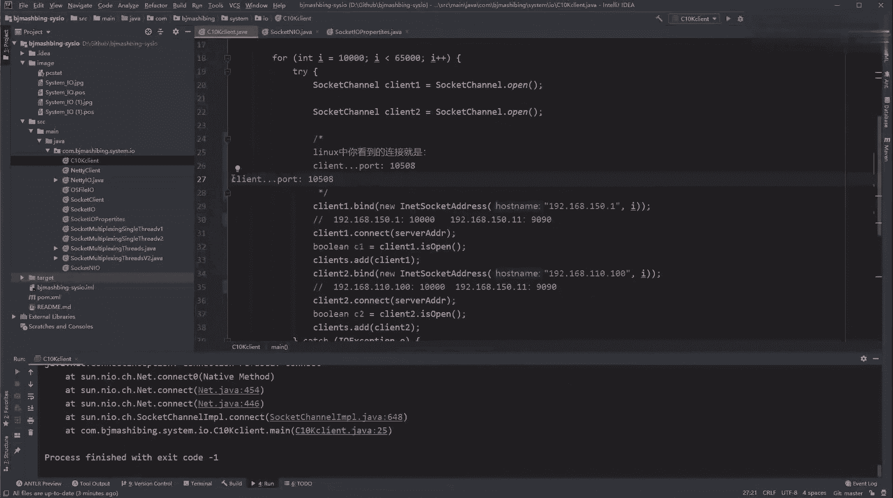