# 花了2万多买的Java架构师课程全套，现在分享给大家，从软件安装到底层源码（马士兵教育MCA架构师VIP教程） - P194：【IO／NIO】压测 - 马士兵_马小雨 - BV1zh411H79h

把11万个人接建起来了。对吧我就对用个图给你补充一下。那在这个压测的过程当中啊，我给你用一张图，其实是windows上边。

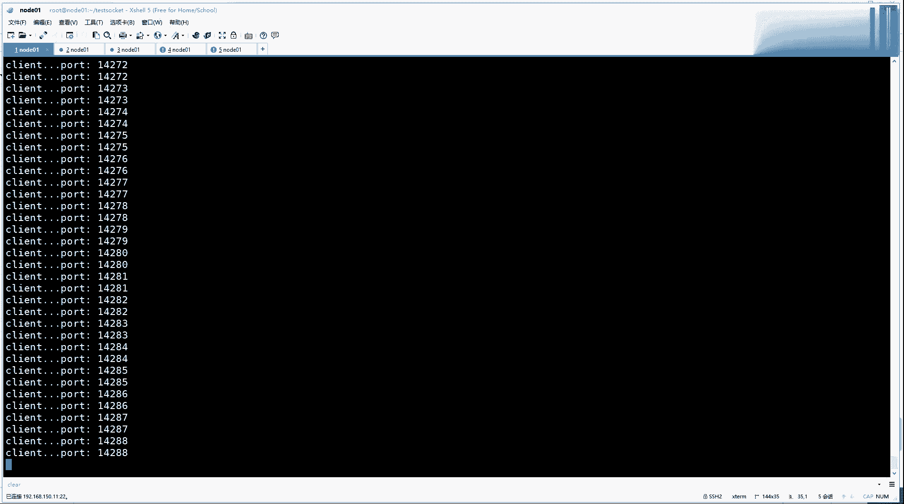

是在windows上。windows上有一个程序。然后通过网卡。我用破骨来表示啊。应该你能看懂，除了windows之还有一台linux，我用拓扑图了，不用那个。实际这个图吧。然后你还有一个Lingux。

然后这边有一个servver。还有一个serv，他们两个之间连接之后，然后注意看啊我这个app application里边是一个循环，这个程序是一个循环。比如说10万次。那每一次循环这个循环是一个线性。

你定明白，循环是一个线性，就是每循环每循环每循环这线性一个线性里边完成什么事情，三次握手。这是重点。先完成一个三次卧收，再完成一个三次卧收，再完成一个三次卧收。这是我windows逻辑代码？

就是你这个程序先完成一个三次握手，建立完一个连接，回来循环循环一下，再建立一个三次握。这是我windows一个逻辑，这是一个拓扑。window中是不是循环一次，这只只不过建立建立两个连接。

先建立一个再建立一个。

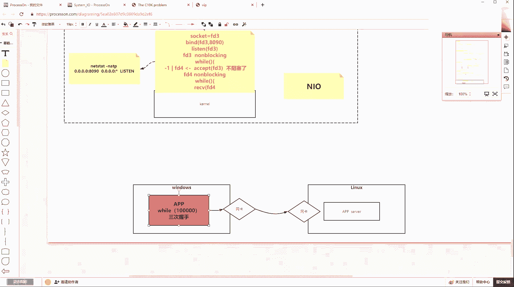

然后再循回来，这简例子，他们是现性的，他们并不是并发的。到这儿呢，想跟同学来说个一。

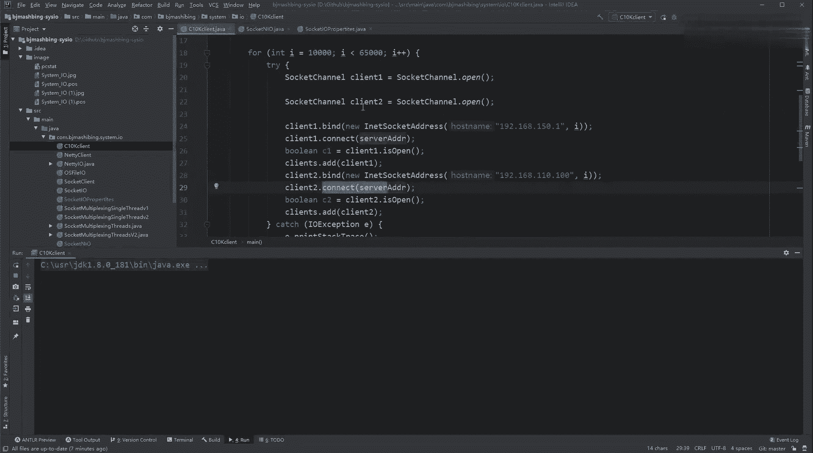

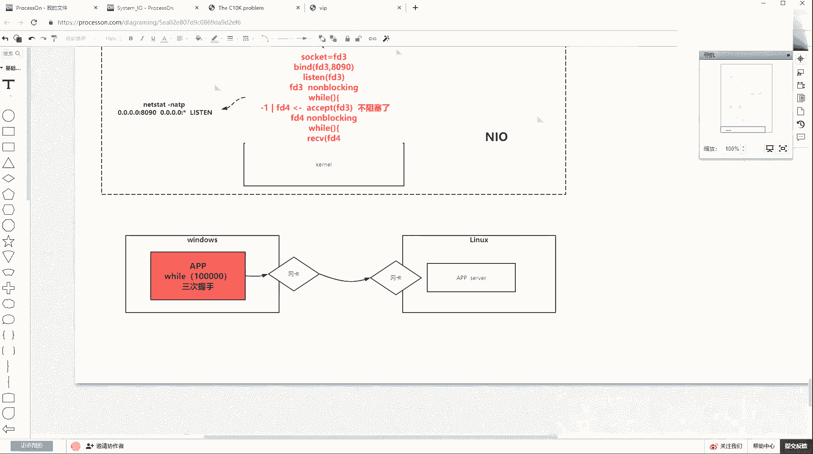

好吧，你看这还在还在建立，还在建两，这建立，就是还还还还能走，不然我就结束了，在这就没有没有必要浪费时间了，这只是一个过渡。现在基本上你也不会去用这个NIO的编程方式去解决这个连接性能问题。

因为这个性能还是不够快。这样我先给你看这个就是我们先把问题梳理出来。你就要知道问题的时候，就是它还不是特别的快，并没有并没有看到修修咻修疯狂的这个过程，即便是这种模型，这个模型这样的。

我先让你看到看到疯狂啊，要想使其灭亡，必然先让其疯狂路过。我们先来看疯狂的一个地方。

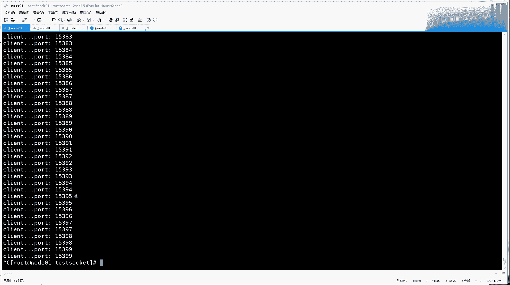

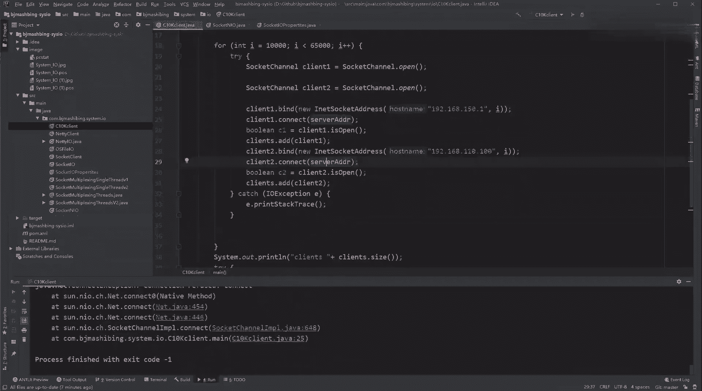

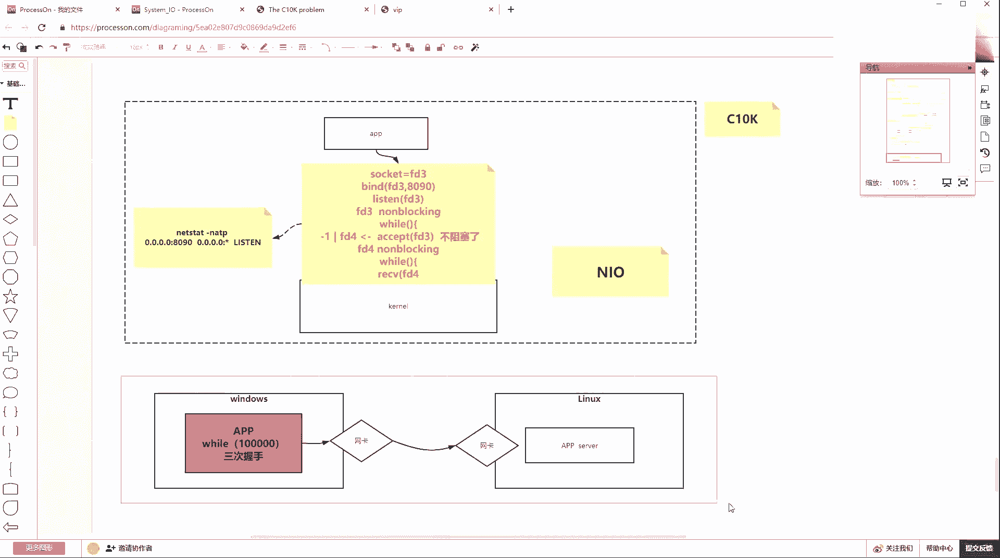

Yeah。我说你看什么？这里面我会有一个多路复云器。因为下一个NL讲完之后，它的下一个就是多路复云器了。那么我们先来看多路复云器的这个代码。而且还是单线程的啊，也是单线程的。刚才NIL是不是单线程的？

我现在那个sockcket的那个多路服容器也是单线程的，它的代码当中也没有6时的线程，它只不过用了一个seelection这种多路服容器JD的包装，然后也是在一个线程里边，代码逻辑你不用看。

我们只先要只需要先去看性能，好吧，加va C。Soockcky的。单线程的编译编译完之后，然后java淘我们的socket。单现程。现在逻辑啊就是我们还没有讲多路速分器。

但是多路复分器是NL的延伸的1个LO模型，以及这个多路速文器，N也是支撑易炮的。就是它底层其实用的就就其实其实它底层就用用的易炮啊，其实它是呃ny底层其实就是用的易po。那也就代表如果这个性能很快的话。

也是代表着后边我们的。这个都是数分器，也就是netty的性能应该是也是比这个应该还还要再快一点。因为它毕竟单线程，现载体还是一个多线程的。先来看效果吧，我为它跑起了，跑起来之后呢。

我还是会用我的这个CGK去连接它去测去测这个压力。好吧，能能听懂小白达什么意思吧？它也是单线程的啊，把它跑起来，服务器已经启动了，它的顿号也是9090。注意看，我要看看这个这也是一个单线程啊。

windows上也是一个单子线程，也是线性的去建立连接。然后看其实这windows建连接可以有多快呢。

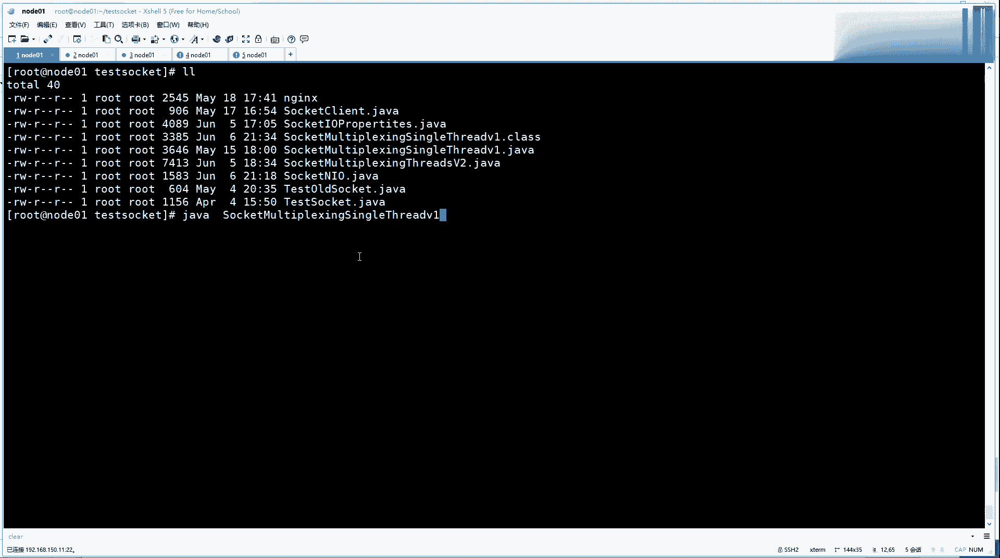

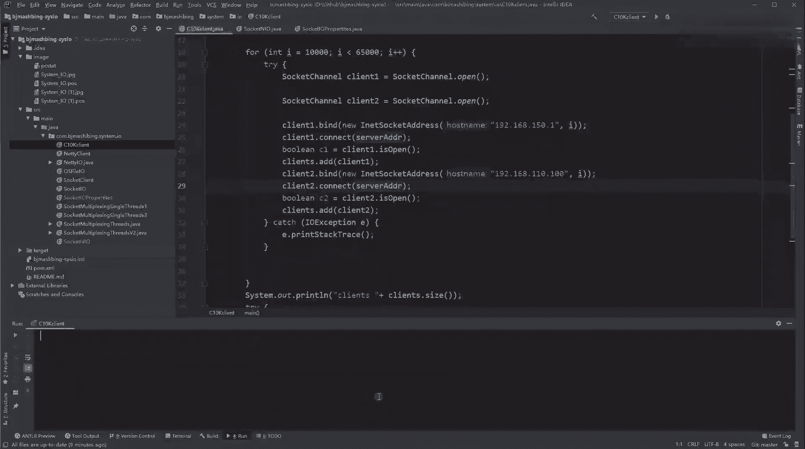

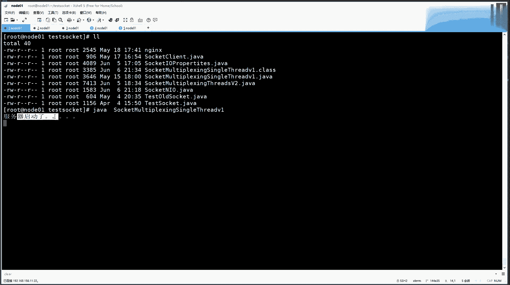

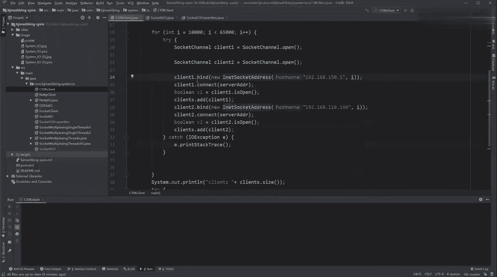

这已经4000多。哦。看到吗？8000多。快不快2万多了，比刚才的所有的BLNLO是不是都要快，只能都路空气这种。这种事件呢是不是快很多了？那就哎这这东西它为什么这么快？小小问号能重新出现了。

我说太快了，那这这个都不行，快对对。这这东西为什么快，对不对？为啥？你看你有问号了吧。Okay。没事，让他快一会。Yeah。为什么要让他快是吧？我们看看到他能不能突破6万6万多个那个连接，对不对？啊。

没有突破6万多，这是hoto memory space。Yeah。嗯，我现在内存是多大？这个没有没有没有没有没有没有ge得到这个点，他这边内存还会预出呢。数字。Yeah。

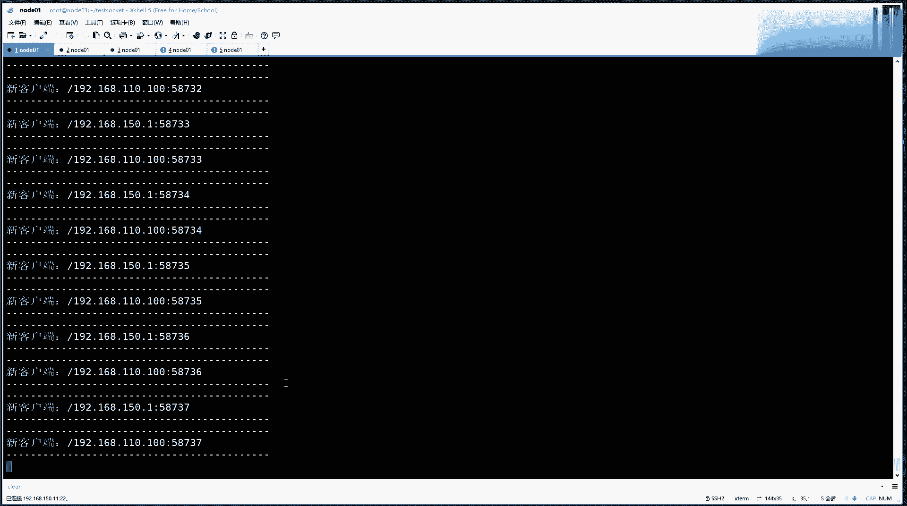

不对啊。那个那边的号已经滚不到这了，其实并没有导置，我就关闭。

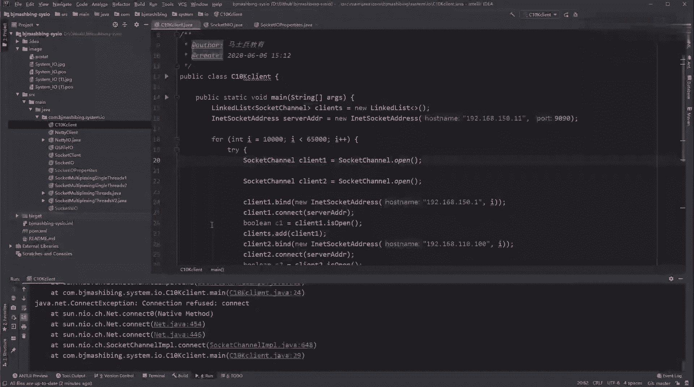

最好没有。再来一页。嗯。是。嗯。哎，对，这时候其实已经已经标出那个数量了，因为它是成对，它就成对。这能如果能出现3万，其实已经有6万个链接了。听朋学来刷波一，就是3万的时候，其实有6万的连接数了。

只不过说登我号还没有涨到6666没有账出66535对不对？林数其实已经占上去了。Yeah。

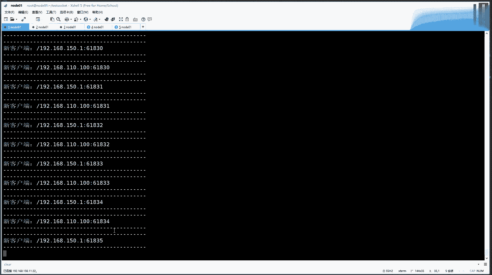

已经6万多了，是十多万的连接了，这已经十0多万的链接了。

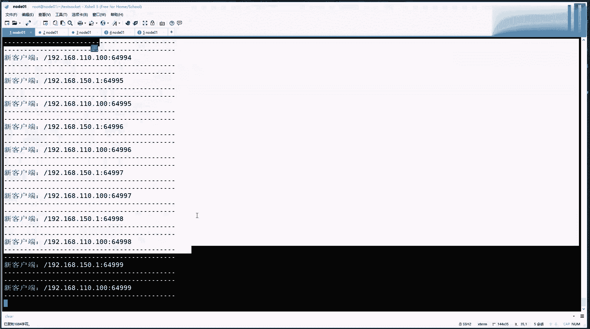

6499结束，我客户端那边结束了，一共是100099954，中间是有一些这个erread use，就被被被我这边windows有些占用了，没有使用上有些断码能理解吧？

但是这时候其实已经我单就是在这个单线程，就是单单单单进单进程单进程线性处理的一个模型当中，已经对那边保持了一个10万的一个连接啊，已经有10万连接已经已经打过去了。

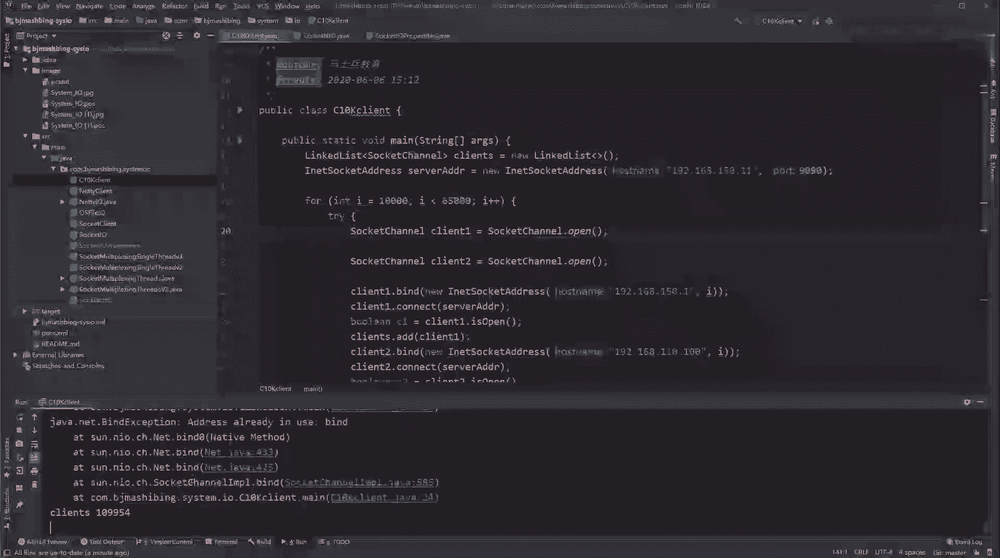

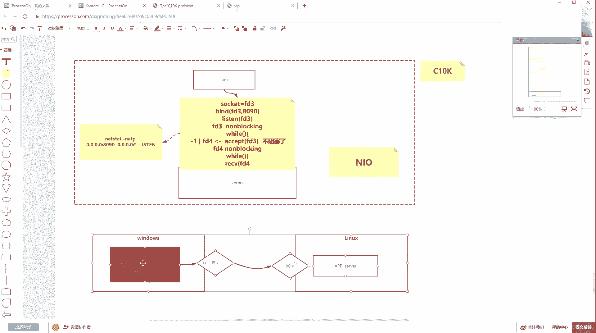

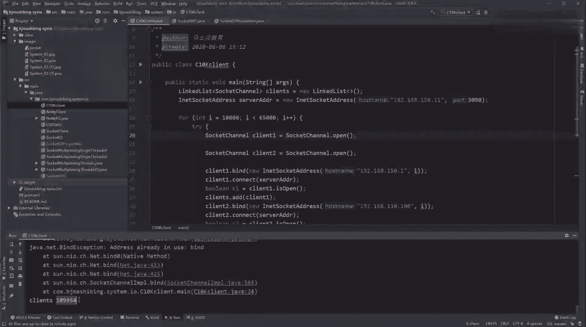

了不了？你你你去互联网网上搜没你这样的课，这样的文章你都搜不到。信不信信不信？

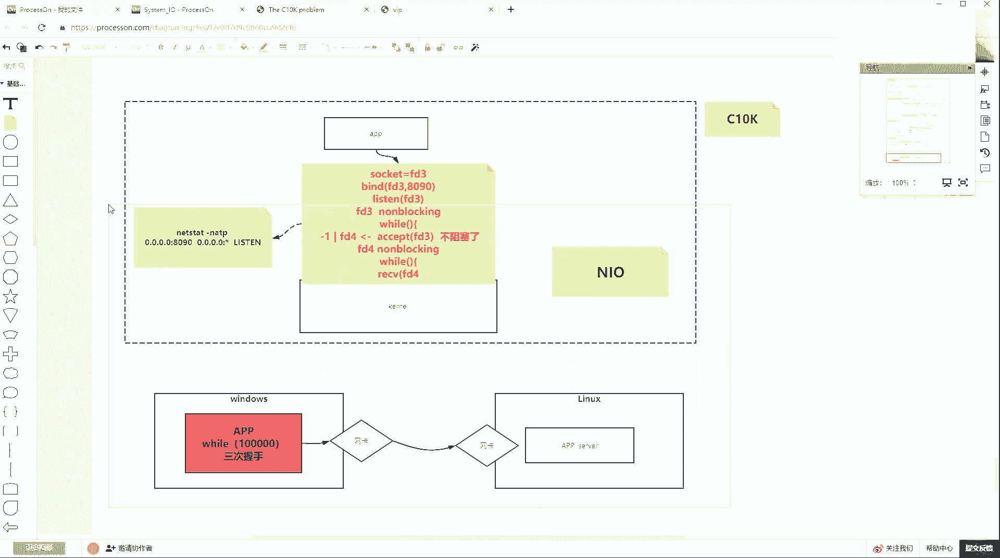

Yeah。

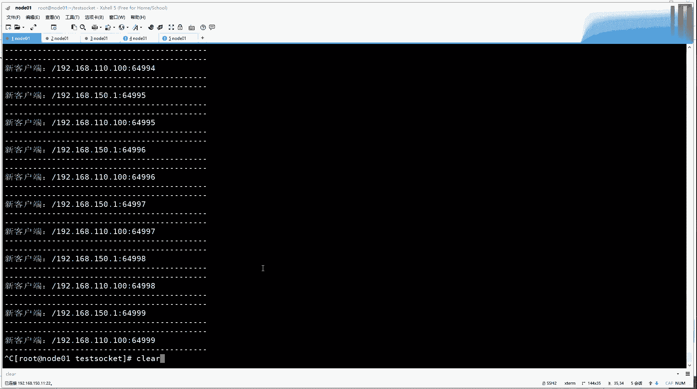

好，哎，他为什么？🤧啊，他为什么就刚才我们讲的是NLNL这块这这个速度。那为什么我没讲多服器，但是我一演示多服器，而得用JDK的编编程方式。它它为什么可以如此之快？

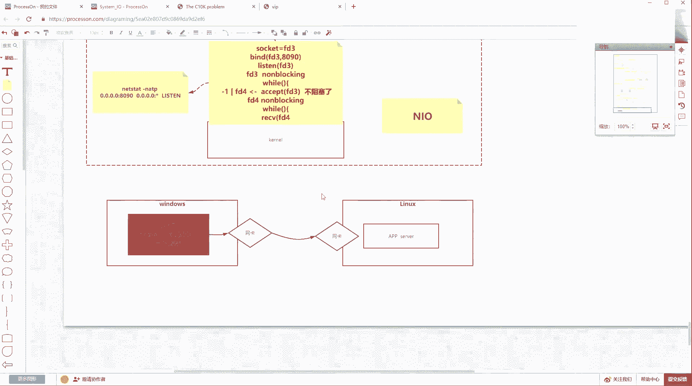