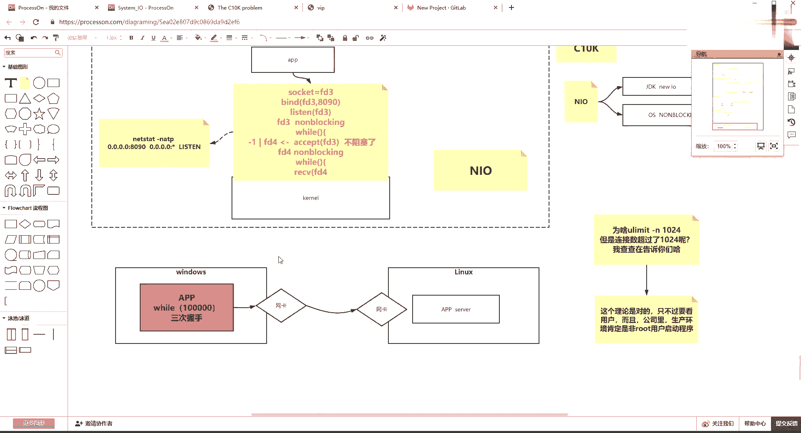
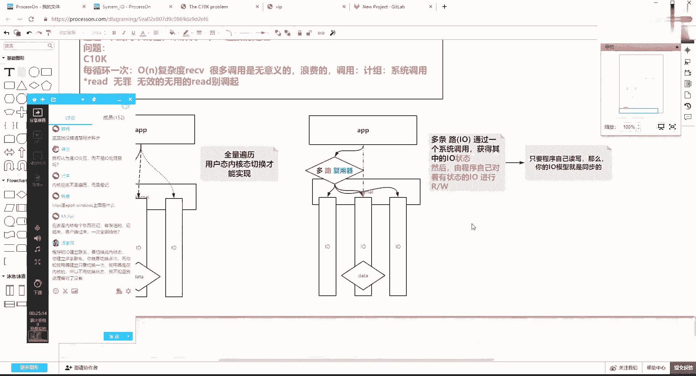

# 花了2万多买的Java架构师课程全套，现在分享给大家，从软件安装到底层源码（马士兵教育MCA架构师VIP教程） - P197：【IO／NIO】多路复用器引入 - 马士兵_马小雨 - BV1zh411H79h

造就了你的不同业务场景下，你对IO和现程池的分配的啊这样的一个关系。Yeah。好了，人也差不多了，我们来开始讲课了。8个04。🤧嗯。今天今天周日啊，明天周一好多人其实是。比比比较忙。M。嗯。

今晚核心nike前戏嘛差不多吧，今天其实聊一聊的话，nike我不讲你你查资料也能听懂这个他在说啥事儿。

就是IO这块不懂的话，其实你上来升学nike。其实有的时候你你get到它的精髓。好了，不不不不说那么多那么多废话了，我们来讲课。😊。

L模型从BL模型到NL模型已经讲完了。然后呢，NL也这个昨天也这个昨天课也压了一下。其实这个在访问速度上。

肯定下一个模型多路复云器快一点。但是这个时候其实模型的过渡，这是一个时间轴流过渡，先有的BLO后有的NLO，然后才会有多路复云器。那么NLO为什么要向多路复云器去过渡，且多路复云器为什么比NL快？

那NLO到底慢在了哪里？相对于多路复云器NL肯定会比BLO更省资源，某些证件下，它的速度更快一些。那NLO的问题出现在哪里了？啊，这个是这节课骑手要做的一件讨论这件事情？

首先，to步模型你要懂IO呢最简单的就是单线程模型，一个线程里边，它的接收行为和它的读取行为都不是阻塞的了。所以我就可以用一个循环在里边把接收和读取这两件事情给它便利一下。啊。

这样可以保证一个线程处理所有。但是这个时候其实你要放大一件事情。既然我们谈到C10K了，那我们就开始放大。

NO的问题在哪里？Yeah。え？当你找到了NIO的问题，然后紧接着就可以找到多路复务器的感觉。不是线条，是这个。这个在前面的课和工业课也讲过，但是在这儿为了完整性，我们再来讨论一下。🤧H。

那么他的问题是什么？在NLO的时候，虽然我一个线程可以解决所有的事情，但是注意听你每一个操作都要触发一个系统调用，是由软件程序主动的。无论去接收我们的客户端，这个行为，这个调用。

还是说每一个客户端的尝试读取，有没有读到有没有读到有或者没有读到这样的一个操作都是由程序向内核去调用，由内核给他反馈。那这样的话，其实你问题你怎么去设置这个问题啊，你只需要把C10K这个问题引进来。

那C10K是什么意思？也就是说当我的客户端连接的数量，就是IO的连IO的这个连接的数量已经达到了1万个了。那么这样的话，其实会引出一个问题，每循环，就是你的你这个单线程啊，每循环一次。

每循完一次，它的成本是一个什么成本？那么将近是有1个ON的。不大度。什么叫有一个ON的复杂度？如果你有一万个连接的话，那么每循环一次都会有O1万的这样的一个receive的调用。

每一个连接都要问你的程序都要问问一点那核说数据到了吗？数据到了吗？数据到了吗会有1万次的这个这个这个系统调用。但是其实其实真正到达数据的就是IO里边数据来了。

你可以读你可以通过这次receive调用拿到数据的连接的数量，就这个这个有数据到达的连接的数量并不多，可能就三五条数据到了，你这个receive调了有意义。那间接着可能有9000多个调用是没有意义。

所以这个这里面会一个浪费。

是无意的浪费的。因为在这种调用的时候。这个调用就牵扯到一个机组的知识。回去往前翻马老师讲的基组的知识，这个叫做系统调用。系统调用里边会牵扯到啊这个所谓的软中断，然后用泰n个ad保护现场恢复现场。

然后进程调度的这样一个等等一系列的事情。🤧所以成本比较高啊，那所以成本比较高啊，那到这个环节能听的同学来说波一，这就是NO的一个问题。NO行，我担心我可以解决现成的问题，这是它的优势。

把前面优势写一下优势。哎O的优势啊是可以通过。一个货。几个县成。来解决。温管是。N格海鸥。处理。你可以用一个线程，也可以用多个线程。你比如像上边，我如果1万个连接的话，我把1万个连接放到一个数组里边啊。

那这如果你有4个县程，那这个111万个这个数组可以切成四段，一个县程负责一段的便利。第二个县程负责另外一段的便利。

对吧这样你可以使用若干个线程，但是绝对不会一连接一线程，就是把现程开的很多，对吧？那这就是NLO相对BLO的一个优势。但是它的弊端就是无论是你一个县程还是多个县程，你每个县城持有了大量的文件面入符。

你都要去调用一次，通过返回复一来知道啊你没每你没有数据到达。但我再去再去询问别询问别的，那么无用无用的调用太多，所以浪费。🤧这是问题。那么要解决这个问题的话，其实向下引申这个问题如果想解决的话。

那线下引申的话，就是要找到多路复文器的这个实现的这个过程。那么多路复文器的实现过程是什么意思？我们简单解释一下。

没错，read德系统调要用是瓶颈。没错，其实其实不是不是啊，这句话不标准。你看有有有同学说了这么一句话啊，我给你打个星号啊，他说了read。这个NL的问题是因为re德的系统调用是瓶颈。不太精确。

因为嗯瑞的自身是无无罪的。就是你你read也好，reivereive也好，你必须要通过这个调用，才能把数据读回来，这就是同步模型。现在我们还没有这个AA这个这个讲到异补，也没有异步。d当中。

在同步模型下，你的程序最终一定是要通过read或reive去读取数据的。所以它并没有罪，只不过你让它有一些无效啊，没错，无效的和无用的。被吊起，那这个就就有问题了。啊。

这个思维一定要一定要想明白这个事儿啊就是你你你如果我调4次readd，我就可以完成真正到达数据了。那9000个，我不调，这是最优的。但是现在这个模型情况下，你是一万个都得调啊，这是弊端。

找到这个之后，其实我们可以简单画一张图啊。

清晰吗？这样这样这样去聊，如果每1个IO啊每1个IO。如果每1个IO你想成是一条路，为什么管它多路服用器？我先把这个路这个事儿关联到我们IO上。如果每1个IO是一条路。然后这个路上有没有数据。

有没有data？发送过来，假设其中某一1个L有有数据，但是这些个路是先扎在哪儿的，这些个路啊是扎在内核上。你的程序肯定是不知道这个每条路有没有数据到达的，然后你的application。

在目前NLO的模型下。使用它的这个编程模型的时候，你NIO当中要融入代码，且代码自身要完慢的去便利。便利某每每条路。喺许许许许喺许呀呀许呀呀。对吧就是你的application是要一个一个去便利。啊。

自己去编历便历的时候，它的成本是在这儿发生的。第一个其实全量。便利。然后写这个便利是用户太内核太。切换。才能实现。相应的成本成本复杂度比较高，有些浪费有些浪费。那是现在的一个模型。

这这个就是你一个人要去问很多条路。但是这时候其实你发现了这个模型当中啊。

🤧路上路上有没有数据到达这个事儿，谁第一个先知道的，那肯定是内核先知道的，内核肯定是这个事儿。然后呢，你从远端挨一个一个的。就是每一次调用是O一的调，只能调一个资源。那这时候如果换成我程序。

和你那盒之间不是打一个电话问一个人，而是我想打一个电话问所有人谁到没到。那么通过一次调用访问所有的路的状态，那就是多路被一个调用复用了。就这一个调用访问了所有的路，就是多路复用了一个系统调用。

现在是每条路有要消耗一次系统调用，多路复用器就是多条路的状态被一个调用所获取。这能听懂出来说个一，也就是说你需要一个多路复音器。多路的路是谁？多路的路就是每一个IO。复用这个复用什么意思？

这个复用器或复用什么意思？他说的是我们。一次调用。把很多条路的状态就是用内核。来获取每一条路的状态的结果题给你这个用程序返回。Yeah。对吧我们先从拓扑上来理解这个事情。那这边的描述就是多条路。

也就是IO。通过一个系统。调用。或者通过一次性调用。获得。提供。あ5か。或者其中的IO状态啊，你一次OE的一次就可以了。但是注意听啊，就是你前面在读取它的时候，既访问他想读。

然后他告诉你结果可读或者不可读，或者能不能读回来，就是把状态和读取的行为放在了一个每一个调用压在了每一个路上。那使用多路复用器的之后，多路复用器只负责注意注意听啊，这重点来了。

那么这里面状态这个词很重要，就是你通过多路复印器只能获取状态。然后。然后由。程序自己。对着。有状态的IO进行。读写啊进行读写，就是最终还是由程序自己去读取他们。所以你最终还是你的application。

比如说他他啊他这个有有数据，这状态就通过这一次调用，虽然复用问了3个，但是给他返回的是这一个IO上有状态了。那么有你的abplication自己要去最终去读取它。Yeah。线条颜色。就自己读去。

所以在这种模型下得出一个结论来，只要程序自己读。自己读写，那么。注意听你的IO模型就是同步的。注意听啊，是你的IO模型是同步的，不是说的你读完了IO的数据，好多的IO的数据读出来之后。

在多个县城里或者在一个县城里处理，那叫处理的同步或异步。好吧，那么就讲到这儿有问题，有没都能不能都都听懂，这就是所谓的多鲁夫尼。那多鲁夫尼是啥？一会给你讲，它有几个实现。

而且它的实现的时候还可以有快速的有消有相对的消耗资源的。😊。

有通用所有系统都支撑的，还有这个个别系统独立实现的。🤧刚才那句话能再说一遍吗？哪句话，我看看木兰啊，主要咱们盯着木兰，木兰如果能搞懂。名词明白，这有啥有啥好处？

什么处理啊，就这个啊，就是我知道你你卡在哪了？就是同步和异步是面向IO尤其这我说了，你的IO模型是同步的那这里其实很简单啊，如果说假设这里面有两个IO都有数据了，都有数据了。

如果这一个县程把他俩的数据读出来之后，把读到的数据抛到两个县城里边去。

抛到两个线程里去执行了。就是你调了方法，这个方法其实底层拿着数据去那边的线程去处理这一个数据了。比如解析集到里边数据的那个那个意义是要连接了一个数据库，然后取出数据再给你返回。

你等着那个方法的返回给你返回回来。你可以阻塞等着，你也可以说调完之后，然后通过放里边放一个回调函数，你的函数是是在堆里边，然后它那边处理完再去调那个函数。

那这时候其实就是同步和就是这个组组这个同步阻塞和同步非阻塞，不是这个这个异步啊，异步，因为交出去了嘛，不是在当前那个县城里边，你线程就直接往下走了。嗯。能理解吧？啊，就是如果我调了我我我读到的数据。

就是把IO这事过完之后，IO模型现在是同步的。但是我LO读到读到的数据读读进来之后，这个结果的数据数据肯定要计算。我这个计算我可以放到我当前那个线城里边，我也可以调一个方法，这个方法。

然后扔扔到另外一个县城，然后我在里边放回调也好，或者我不等下我这个当前程继续往下走，就叫异步了，就是没有在我当前线城处理那个处理可是异步像n等等，其他就可以构建一个事情，或者我们自己写也可以啊。

你先先这样吧，你先去把这个。记一下先先去记一下，一会儿我我用代码给你演示，咱们有这个几种呃有这个IO加上现成的模型的这个这个这个演示但。

