# 系列 3：P198：互联网架构的演变之路 - 马士兵_马小雨 - BV1zh411H79h

好了，同学们，咱们开始准备上那个Spbo了。好吧，来能听到我声音同学扣个一。呃，今天啊咱们开始那个讲spring，呃，很多同学一直在问说那个ringbo讲到什么程度？呃，我希望讲一个完整性的课。

就是说从基础，然后呢到后面的一个精通包括到源码，我们这边都会讲的所以些基础东西啊，大家可能听得很烦。因为之前你们在公司里面已用到了。但是我这还是希望把这些东西啊整体再做一个回顾，很重要一点信息。

好吧咱们ring课大概我的计划是6到8节课，有可能时间会更长啊，这不一定在最少也要上6次课。懂我意思吧？sp还讲不会的spring啊是我们基础班的一个课spring从基础班的一个时间一个课呃。

基础班的时候也是一样的，我也会从基础东西开始讲，然后讲到源码呃，还是一样，我希望就是把这个整体的知识点啊都做一个整体的完整的一个学习。这样的话对大家的一个好处更明显一点。

如果你所有东西都听一半或听一阶段可能不太好O大数据是不是要上的呃，大数据讲了还要维，包括那个。日志的那个小小小项目，然后后续的话可能会讲麒麟啊，基本上三门课我都讲了啊。呃。

大家还是根据自己的一个需要说我到底要学什么东西。基术班随还没开始，刚刚讲到GS啊，刚讲到GS呃JS这块我没去讲，然后请了一个专业的一个老师来讲解的，后面的话都给大家补起来，这个大家放心啊，呃。

刚刚很多同学提到大数这件大数据这件事情啊，呃，我再说一下大数据东西啊，怎么说呢。😊，呃，很多同学说老师我没时间看哦，没时间看或者怎么怎么样。好吧，呃，还是一样，大数据应该是一个必备技能。

你们现在买的课没时间看没关系啊，没关没关系，后续的话啊有时间了，一定要把大数据课补起来。因为你往后看3到5年大数据一定会像java一样来大街，它会成为一个必备技能。而且咱们这边大数据课啊。

大数据课应该是比较专业的光嗨对跑，周老师讲了14节课。😊，懂我意思吧？应该有很多很多这方面的一个东西非常非常完整。所以你需要哪一块听哪听哪块就可以了，不叫大不要求大家说，每天必须要跟某一门课。

你根据自己的需求来决定就O了。懂我意思吧？今天集合项目嘛，看情况看能不能讲到这块，但应该讲不到，我们只是一个刚开始的一个基础课好吧，行了，废话不多说，我们开始讲解springspring然后再说一下啊。

呃大家看到了，我上课的时候，首页打开了spring官网，之前我在讲课的时候也是一样，非常喜欢啊，非常喜欢或者带大家看一下我们spring的一些包括一些其他框架一些官方网站啊，官方网站呃。

为什么官网永远是我们第一手的一个学习资料，所以我希望你们以后学知识也是一样的，所有东西从官网里面直接去看这些点，很重要的信息。好吧，韩江雪说腾讯课堂目录有点乱。呃，这个应该不会特别乱。

因为之前给大家做了一个整理。那天有学生反馈之后，我这专门做了一个整理啊，大家可以看一下。😊。

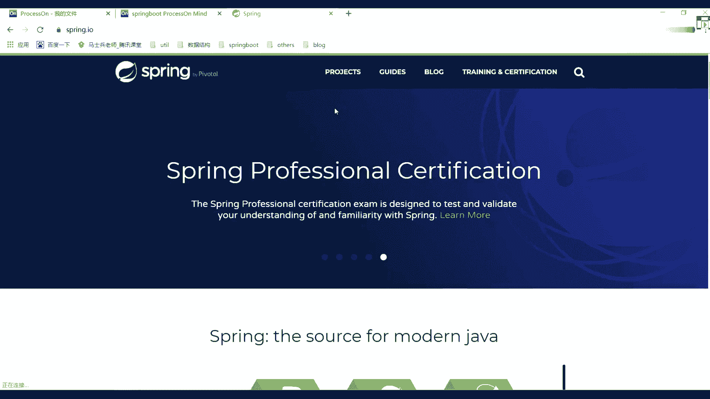

其实啊只是家校课里面稍微有点乱，因为家校课里面我们加了很多的一些怎么说呢？很多的一些加了很多餐，所以这块可能会稍微呃乱一点。然后这块都大家做做好整理的网络分布式。

然后s cloud多线能高并发s源码nikeNIO然后呢JVM以及流量的项目，包麦测度条优架构师的前置知识，这块都给大家做做了总结。😊，听白意思吧？所以这一块几乎后面的东西啊也都会一直更新的。

不用担心啊，大数据的顺序有吗？大数据就按照课程顺序往里边写就行了，往里边学习就OK了，懂我意思吧？就按照我们课程的一个呃正正确目录顺序。

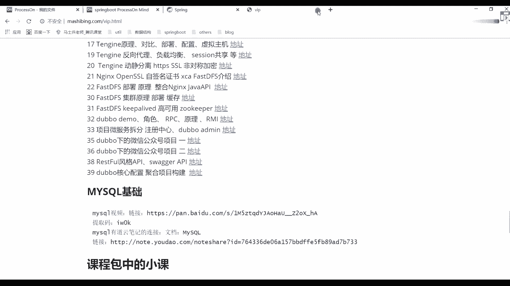

呃，SS来说了，非物流冰说质检吗？呃，没关系啊，你们能够找出来问题或者提出来bug，这很正常。我们是人不是神，我们也会有这自己认知错误的地方。如果有问题，希望大家能够及时反馈好，及时反馈，没问题啊。😊。

现在没有意义，根本跟不上，慢慢就跟上了。总之一点，你记住一定是要学的就可以了，懂我意思吧？架构室里没有有没有中台项目啊，呃，这个怎么说呢？呃，看情况吧，大家如果对中台有有兴趣的话，可以学一下呃。

给大家说一下中台项目，我们是请的一个现在已经投产的，已经在呃产生一些商业商业价值的一个项目，对公司CTO来进行讲解的。所以咱们的中台才是正儿八经的一个中台项目啊，到时候你们期待就可以了，一定会有的啊。

😊，好了，废话不多说。来先聊一下我们的springbo。😊，啊吧，很多同学在公司里面一直在用sringbo吧。来在公司里面，现在没有接触过sringbo同学扣1，没有接触过的。😊。

别说接触过没有接触过扣1。这么多吗？不可能吧。是我认知错误了吗？😡，嗯。来给大家说一下，呃，现现在还有很多传统项目，很都还是SSM呃，那我们就更要从刚开始来进行一个讲解了。刚开始来进行讲解了。

还是一样先说一下我们的SSM其实在SSM之前，应该是什么叫SSH对不对？它是有一个整体的过渡阶段的。在SSA之前可能还有和GSP对吧？他们几乎都是一脉相承的一个东西，这块，我希望从刚开始第一节课的时候。

能够帮大家拔高我们整个架构的一个认知啊，架构的一个认知。大家想一下，在我们的项目或者我们的IT行业发展起来之前，最开始的架构。😊，最开始的架构。没人知道好吧，叫单一架构好吧。

单一架构这块给大家看一个东西，看什么呀？我们看一下double的一个官网，double官网里面有这样的一个描述，我不知道你们有没有没有看过我们架构师根本不信这些拍胡照东西，呃，要信好吧。

这些东西设计还是非常有意义的啊。我们来找一个文档。😊。

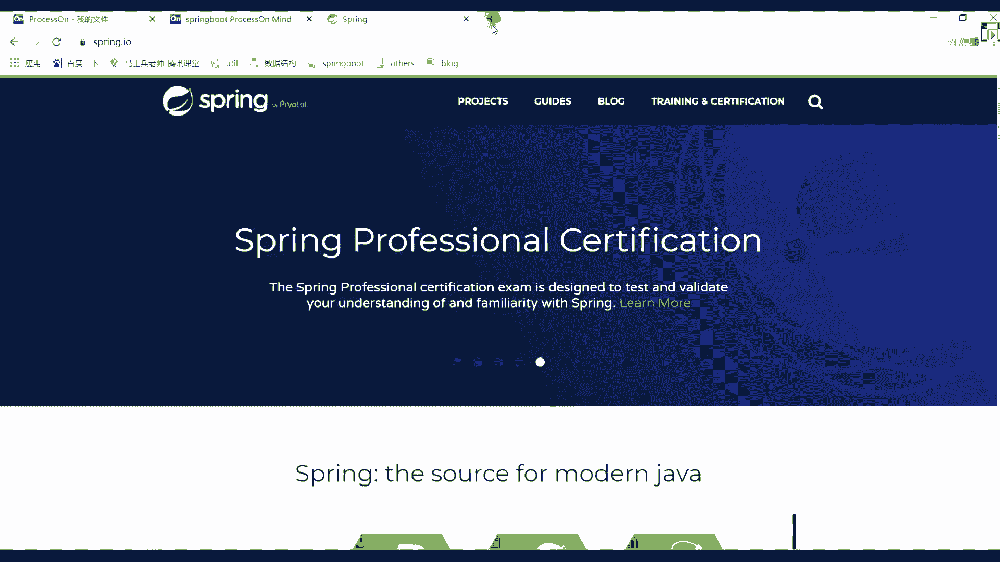

在档里面有一个背景，大家可以看一下这样的一个描述。我们今天不讲大ou宝吧，不讲大宝没关系。然后这单这边我们要看一下互联网的一个发展趋势，说随着互联网的一个发展，网站应用的规模不断扩大。

常规的垂直应用架构已无法应对分布式服务架构以及流动计算架构势在必行。急需一个治理系统来确保架构有条不紊的进行演进。所以这里面几乎画了这样一个学习路线图，或者说一个架构的演变过程的一个图。

这个图我不知道你们能不能看懂好吧，但大部分应该是没问题的往看上面放了work什么框架吧后我们的架构后面有我们的表示我们的集群好吧，它就是这样的一条时间线的这个图我不知道你们有没有见过，没见过没关系。

我这带着你们看好吧，刚开始OMMACRPOA对不对？刚开始是什么呢？叫all in one就是我们说的单一应用架构。说了当网站流量非常非常小的时候，只需一个应用将所有的功能都部署在一起。

以减少部署节点和成本。此时。😊，简化增山改查工作量的数据访问框架OM是关键。这个里面描述了一个什么信息啊。就好比你们在刚刚接触java的时候好，一般在学到serv之后啊。

很多人可能说老师我终于学我可以做一个前后端交互的一个项目了。所以一般情况都开发一个常简单项目。当你这个项目开完成之后。

一般都会部属一个包放到我们的一个top容器里面或者其他一些呃动态的一个 web容器里面，然后进行一个运行。这个时候你看到你的浏览器可以进行访问，然后说后面呢有一些数据交互，这是最开始这样一个过程。

但是你要注意一点，这是最最最开始的时，一个架构思想，然后呢随着技术的一个演变以及用户量的一个激增，慢慢的说这种单一应用架构不太符合我们实际的一个情况了，那怎么办？有了叫垂直应用架构。

大家其实可以看一下这个图看这个图来做一个对比，什么图对比刚开始叫 in one后面呢叫垂直的应用架构什么意思？这个图是没有任何变化刚开始一个蓝色块后变成三个蓝色块。😊。

然后下面集训规模由1到10台变成10到1000台，这表示都是我们的应用程序。也就是说当用户的一个访问量逐渐增大的时候，单一应用增加机器带来的加速度是越来越小，为什么你想一件事啊，你想一件事什么事情？

你注意了任何一个硬件，它都是有自己的一个性能上限的。你所有东西都不是在里面的话，就算你扩架或者增加你的硬件的一个效率，它其实对带来速度影响也是非常非常小的。

然后说了将应用拆成互不相干的几个应用以提升效率。因为我现在需要把单一的一个应用拆分成123或者说N多个应用了，这样的话就变成一个什么呢？叫垂直应用架构。然后页面之后说了在垂直应用架构中。

此时用于加速前端页面开发的外部框架的MVC是关键什么叫MVC啊，modeltl了，包括你们现在写项目的时候，一般都怎么写，现定一个controlll用来接收我们用户的一个请求，对吧？

然后第一个model，我们实体类好吧，然后还有我们的呃MV。😊，试图是我们的一些浏览器页面，是不是经营这样一个方式。你们现在做的时候依然是一样的。只不过现在我们用spring也好。

还spring book也好，他帮我们做了一个整体的整合啊，整体整合。这个大家注意了好之后我们再来说我们再说这块然呢由垂直架构之又做了一个演变叫什么呢？

叫分布式架构di什么意思一样的也是说当垂直应用架构越来越多应用之间交互不可避免，将核心业务抽离出来作为独立的服务逐渐形成稳定的服务中心。这个时候你注意了，当你形成N多个服务中心之后，会存在什么问题啊。

他们之间一定要产生数据的一个整体交互过程体交过程这个交互的时候通过什么这通过我们的RPC了什么RPC是不叫远程过程调用这样的东西。

远程过程用这样西这后面这说程过程调用来进行一个演变后还没完又往下进行一个演变怎么演变说当服务越来越多的时，容量的。😊，小资源服务的浪费等问题逐渐明显明显。此时需要增加一个调度中心，给于访问压力。

实时管理集群容量，提高集行利用率。此时，用于提高集行利益率资源调度和治理中心就成为了关键，就是我们的SOA是不是大家看到了这段有一个基本的描述。这个描述里面就阐述了我们整个互联网架构的一个演变之路。

当然很多同学可能年纪还比较小，好吧，你可能没有接触过前面这些架构的一个演变过程。好吧，你下来之后可能直接学smebo搞定了或者直接学飞服务。对不对？但是前面的这些历史你要有一个感知，会有一个认知。

它一定是要不断进行发展的，好吧？而发展的最终的目的是为了什么？是不是使我们第一开发效率提升。第二，我们对应的一个应用程序，它执行的一个效率要做一个提升。所以人们怎么样呢？会发挥自己的想象力。好吧。

创造出来各种各样的一个东西，好吧，来达到我们想要的一个效果，这块要注意了。所以刚刚这个架构演变之路能听明白的同学来扣个一，这同能看懂吧？Yeah。你们要不要想老师，你这个图你是怎么知道的，我还是那句话。

你多去看官网，你不一定说我学什么技术，就一定要看什么官网啊，没必要。但是你要知道一件事儿，当你看官网之后，他们其实可以交叉进行学习的大包里面东西是不是介这个架构演变之路。

我们在spring就可以进行一个使用了。而且现在在企业里面几乎没有spring没有公司不用springspring它有一个全家桶理工里面提供了非常非常多的一个服务吧。这块希望大家能够认知到好吧。

往下看这是spring的一个官网，我刚上来打开就是这官网好吧，springring cloud和spring cloud flow它这3块表示什么意思呀？什么意思？第一个叫biild叫构建一切好吧。

第二个呢叫协调一切吧。第三个呢叫连接一切，这是spring它想做的一件事情，然后里面分了N多组件来进行一个描述。第一个spring5就是我们spring框架这东西咱们加构课里面可能不会再讲了。

后续的话基础课里面会讲吧，基础课里面会讲，然后呢讲完之后。😊。

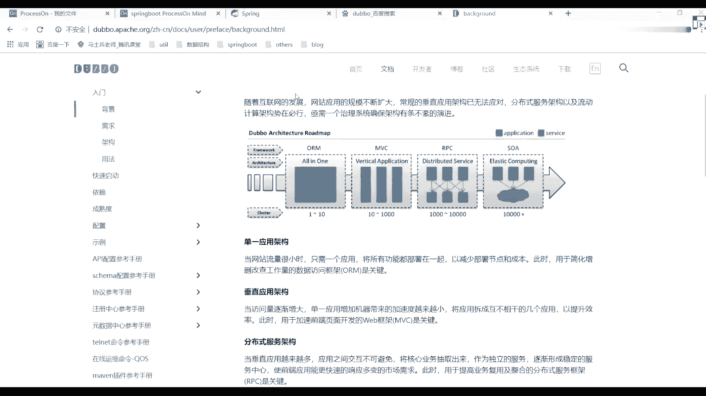

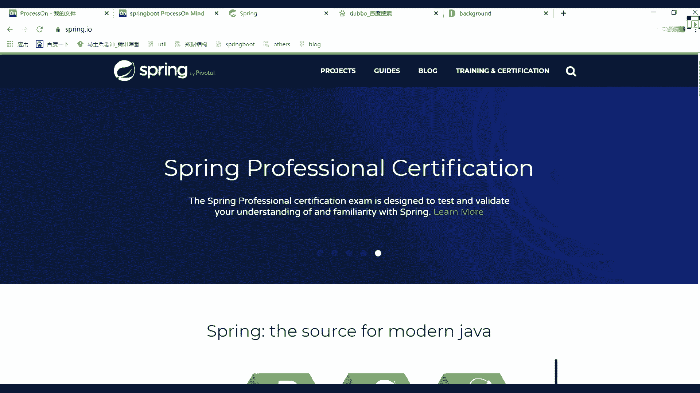

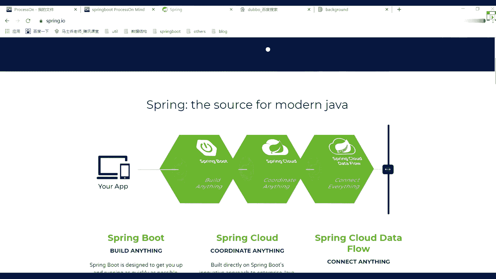

会把那个课单独拿出来成了一个小课。之前我也说过了，我们有自己的一个视频网站。这个视频网站我还在开发，好吧，大概在1月1号的时候会重新给大家进行见面。包括我们整个网站的一个设计。

整个网站的一个设计都会呃进行一个更新啊，其实现在也在做，我可以给大家提前看一个东西看啥呀？呃，给家找一下。就我们后面一直在做升级，很多同学可能有平常问问题的时候。

可能找不到我为什么一般都在开发这个推开发这个项目啊，大家看一下叫web杠test。诶。😊，没了吗？t杠外杠 index的HTR。大家看到了啊，这个现在这样看起来，这个图现在还没在做，好吧。

之后的时候别老想着翻车，好不好？之后的时候我们会把网站进行整体的一个升级。好吧，这是我们后续的一个网站这边的一个规划，应该比我们现在官网要好好看很多吧，好吧，大家今天等着以后啊。

还是一那句话会提供越来越多越来越好的一服务给大家。你们从官网里面或通过我们的视频网站都能看到很多信息，但这开发啊只不过呃需要一段时间，所以希望大家能给我一段时间。好吧，一人就是一支军队啊，不是啊。

我们肯定要呃做这块东西的。懂我意思吧。😊。

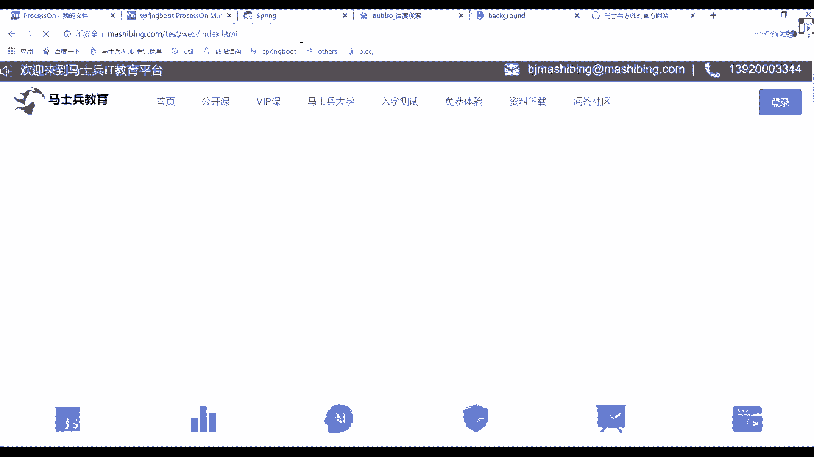

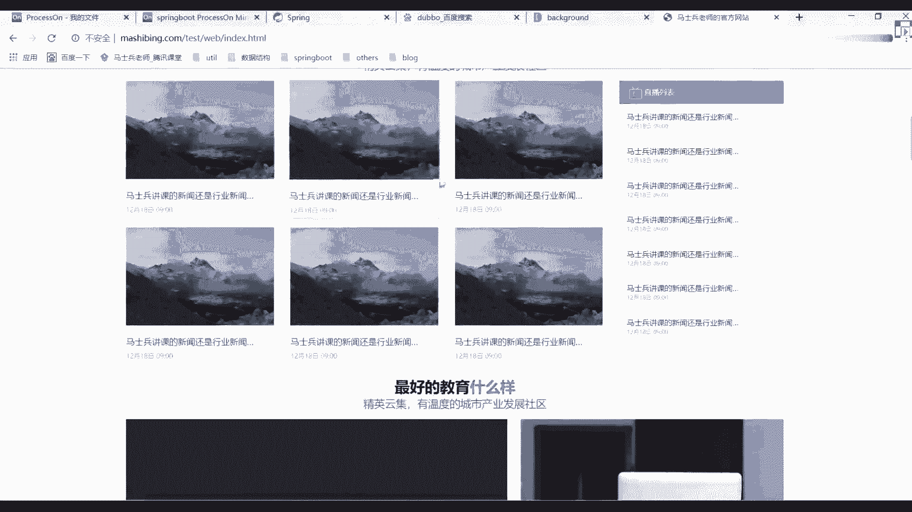

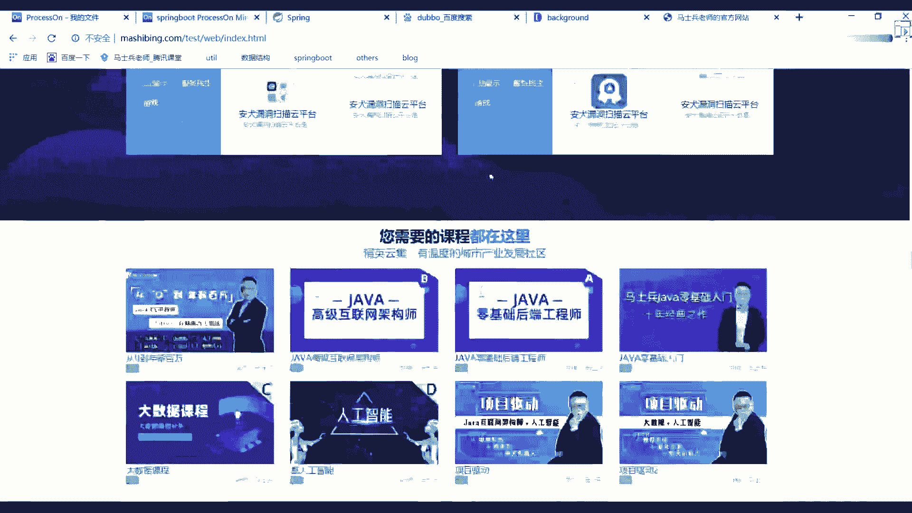

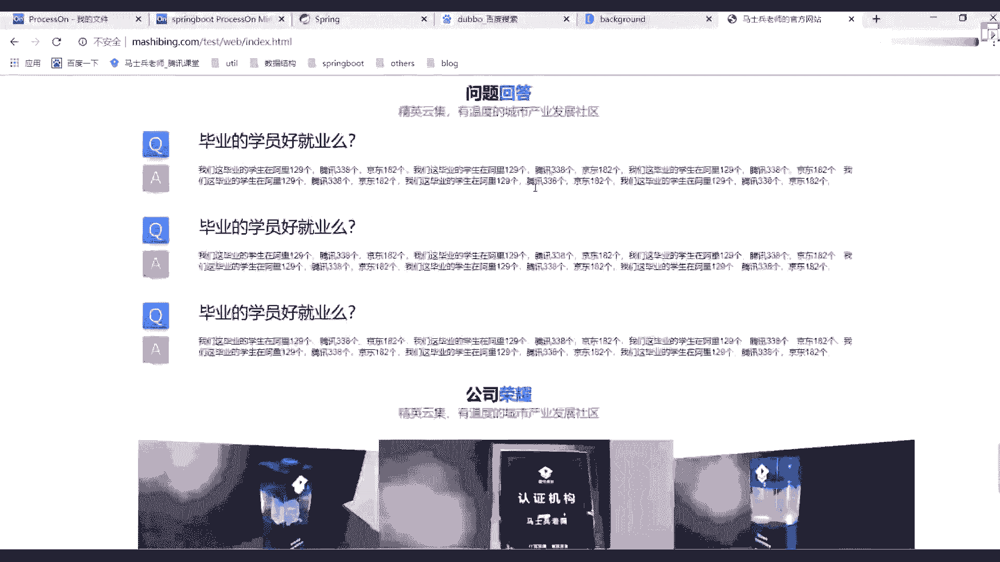

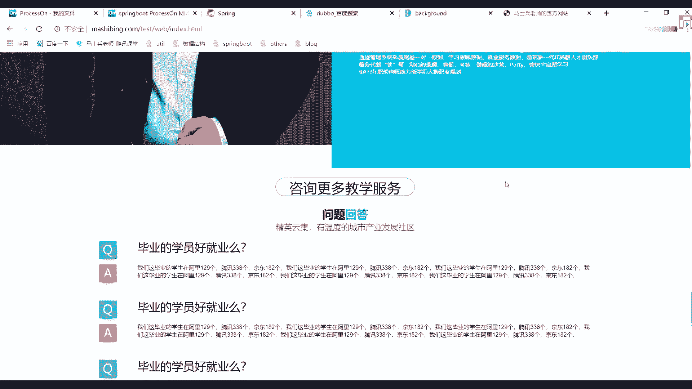

用的技术你们就不用管了吧，用的技术你就不用管了，前端也是一手包备包干嘛，呃，基本上都在自己做，好吧，基本上都是在都都在自己做。所以有时候可能回答问题不太及不太及时，原因在这就在这一块，要是招人物。

我可以去招啊，可以投简历，好吧，欢迎大家投简历，反正你能想到东西，我还是那句话，你能想到东西，我能做的都帮你做了。所以希望大家能够争惜自己的时间，抓紧时间学习就够。懂我意思吧？

不知道企业头像有没有没有了，没有了。😊，没几天了是没几天了，我们后续这些东西都都都都在做啊，不是不给你们看其他页面了，没有意义啊呃，做完之后你们等着。😊。

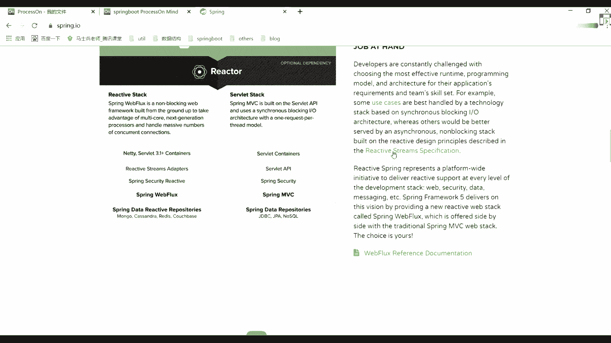