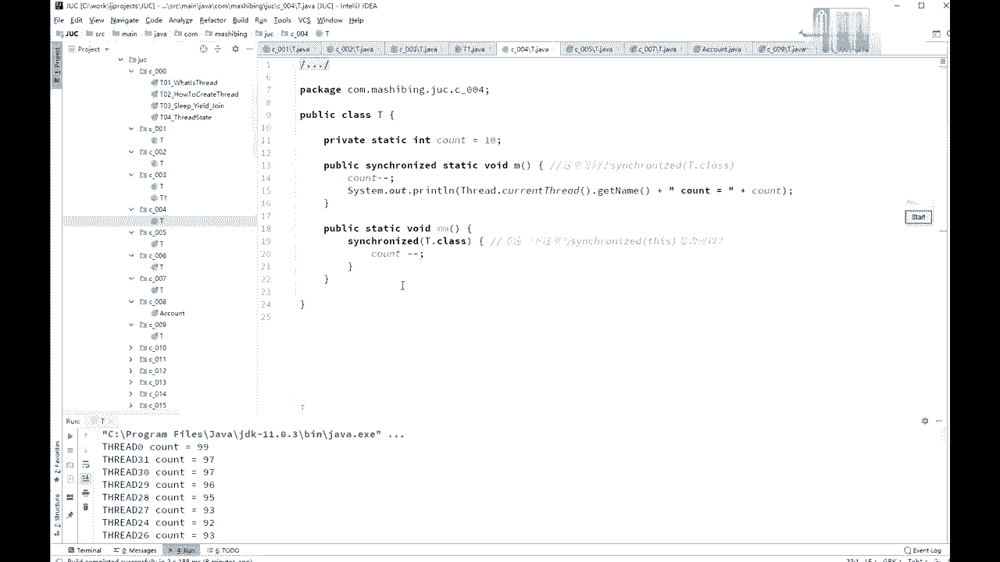
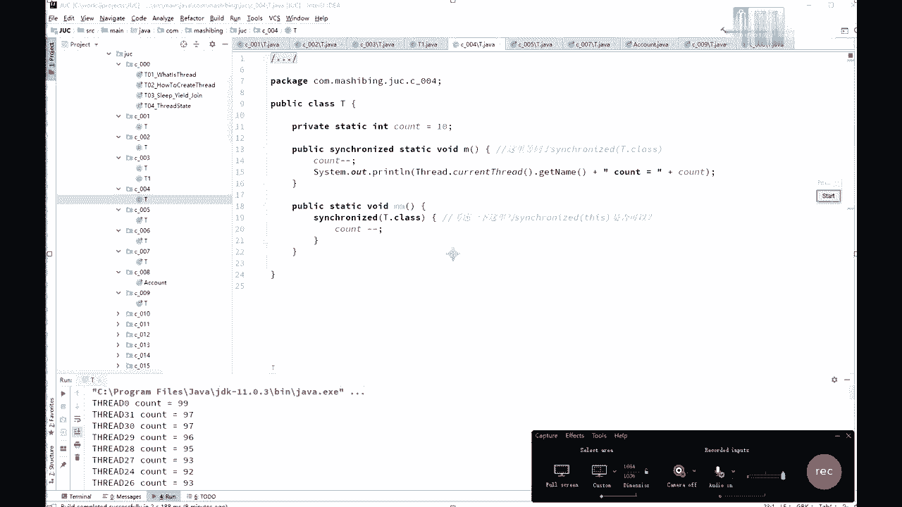
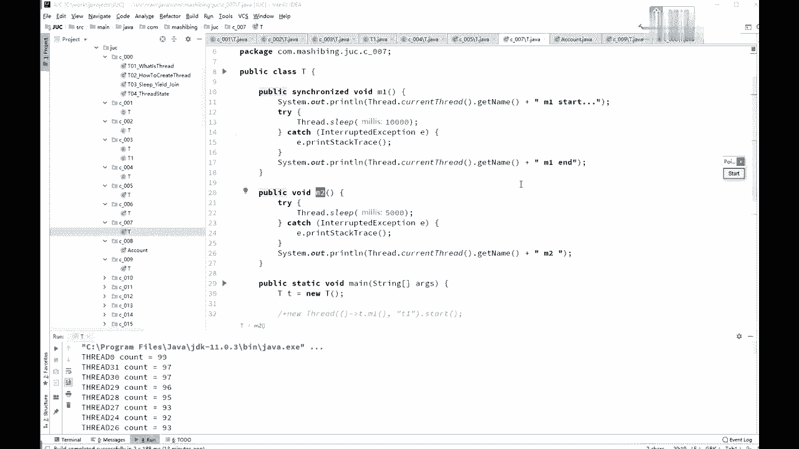
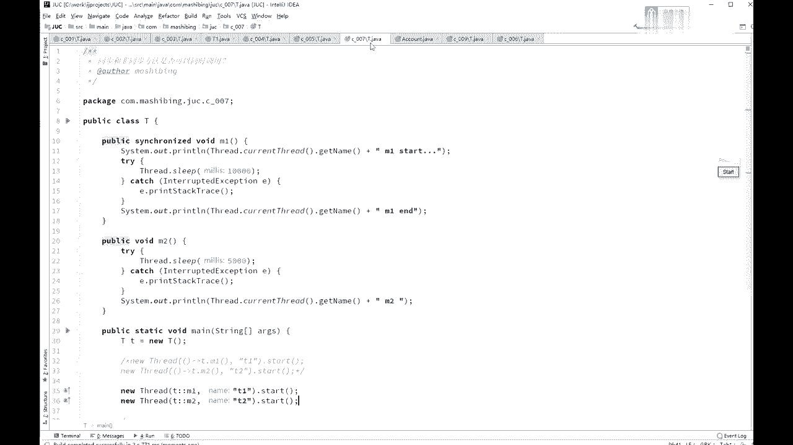
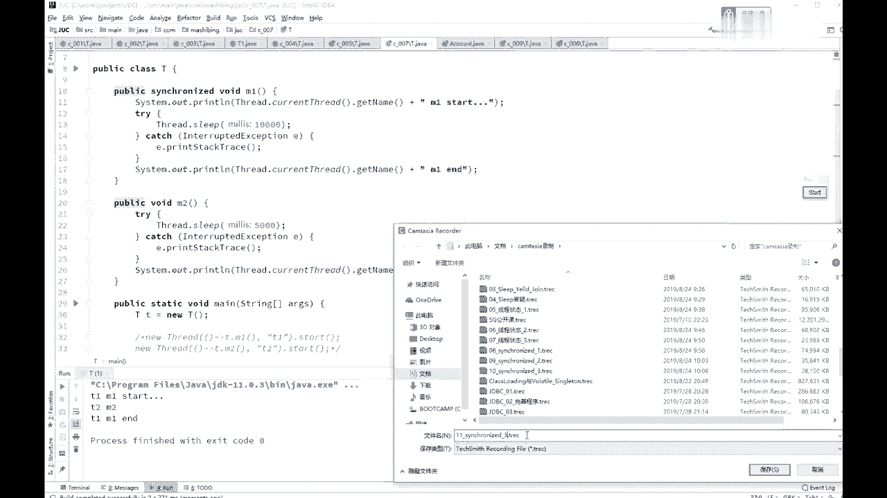
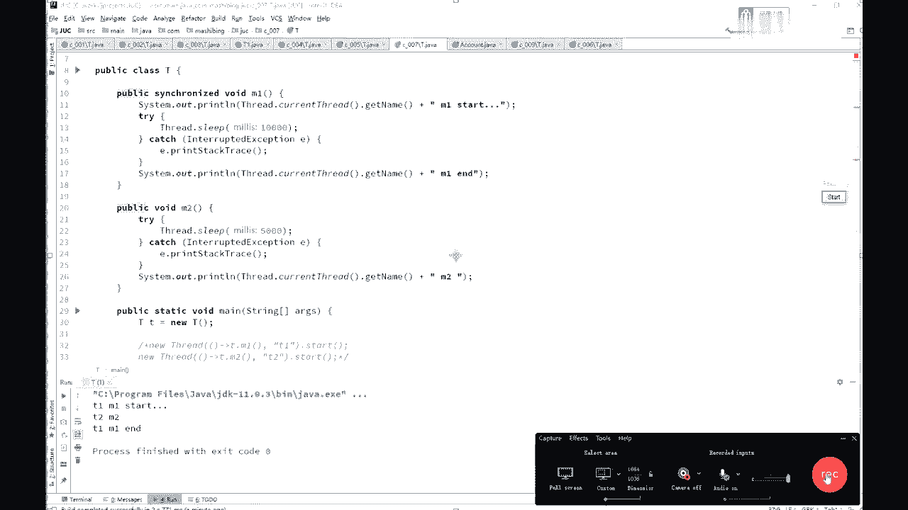
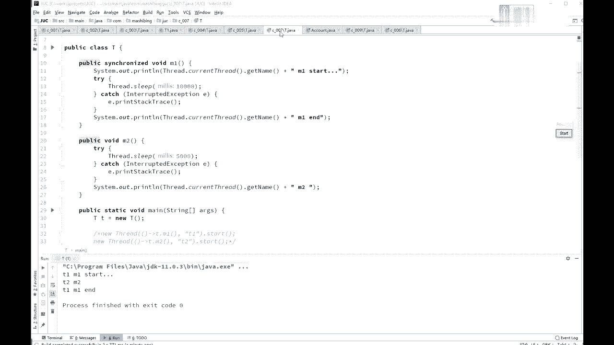
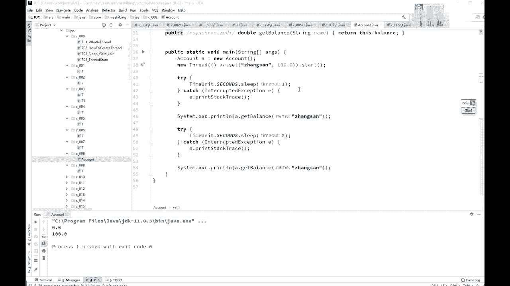
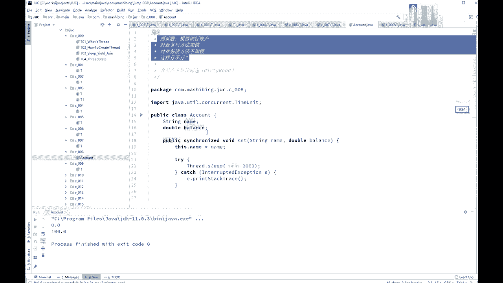

# 花了2万多买的Java架构师课程全套，现在分享给大家，从软件安装到底层源码（马士兵教育MCA架构师VIP教程） - P19：【多线程与高并发】设计小程序验证锁的问题 - 马士兵_马小雨 - BV1zh411H79h

还有同学给我们继续啊，嗯后面代码呢前面几个几个小代码也不难，我讲的速度呢稍微快一些啊，看这里嗯，我们来分析一下这个小程序，它的输出有没有什么问题，sorry，will they go。

啊是这个啊005这小程序的输出，你仔细读一下，看着小程序的输出又没什么问题啊，另一个thread是吧，然后呢start start呢让count呢不停的减减，好，这小程序的主要的问题在哪呢。

主要问题呢有两个，刚才那个我看有同学说没有写过，他对嗯，这是一个啊嗯但是，严格来讲呢，这个小程序呢，其实跟那个沃坦没有太大关系，就是另外一个呢，他有可能嗯读不到别的线程，已经改过的内容，这是很有可能的。

除了这一点之外呢，其实它本身还有问题，问题在哪儿呢，就是这个count剪完了之后呢，下面这个count的输出，和你看的剪完之后的结果不对，这很容易分析，如果有一个线程从十把它减到九了。

然后另外一个线程在第一个前面的县城，还没输出呢，另外一个线程进来了，把九又减到了八，前面这些能继续输出，就把这个八给输出出来了是吧，他输出的那个不是不是不是九啊，所以他呃这个呢是有这样的一些个毛病。

那第一个呢是上面加volatile，这边改了之后，另外一个呢马上得到，除了这个之外呢，其实最关键的呢，你还是要在这里加synchronized是吧，这程序比较简单，就不多说了。

加synchronized呃，那我问大家一句，加了sronized的，我还用加volatile吗，当然现在还没有讲vlta，所以我简单提一句啊，加了synchronize就没有必要加播了，巧了啊。

为什么呢，因为civilized既保证了原子性，又保证了可见性好，我们讲volt的时候再说，嗯就是这个小程序啊，来看第七个c007 里面的这个小程序，呃这也是会被有有可能会被问到的。

就是同步方法和非同步方法，是否可以同时调用，诶什么意思呢，就是我有一方法看见了吗，m1 sychronized，我掉点mv的时候能不能调m2 可以吗，这个可以不可以，你拿大腿想想，其实就能想出来。

你都不用不用试，这肯定可以啊，必须得可以啊，你本来这个县城里面访问，访问m一的时候呢，需要加个锁，可是访问m2 的时候我又不需要加锁，所以你还不如不让我不允许我真想m2 啊。

所以问这问题的人脑子都进水了是吧，开玩笑啊，你本来在这儿正在运行，你往这一坐，正在运行是吧，你是不是也上个锁，前面得把这门锁上，这是必须的，可是人家有别的方法，别的方法是什么呢，人家后面有一擦马桶的。

擦马桶的不需要这把锁，直接就可以擦，是不是，所以你运行这是m一啊，运行你自己的事，这是m1 ，人家参考筒，这事是m2 m2 不需要加这把锁，在你运行的时候，人家直接就可以在后面参考桶啊，没问题。

当然呃讲到这儿呢，听我说啊，有很多的那个呃原理性的东西啊，这原理性的东西，还有一些细节上的那些状态的迁移等等，关于这些东西呢，你如果能够写程序去模拟，让它显示出来，这是一个很好的能力。

呃，所以很多时候呢，你要去想办法去做这个方向呢，做这方面的模拟，你能把这个模拟的程序想象出来，怎么写，对你也是一个很好的锻炼，所以以后呢有什么别人给你讲的，什么的知识，你都想要想办法去写程序。

模拟它下好吧，只要能模拟出来的就是一个很好的锻炼啊，呃不然的话你只能说老师告诉你是什么，你就认为是什么，你是没有办法做实验去验证它的，我写的小程序期间，中大这小程序m一是枷锁的方法。

然后在枷锁的方法里边m m e n，呃中间睡了是10000ms，然后m2 呢是睡了5000个毫秒，输出来的一个m2 ，那么大家可以想一下，如果说我对m一加了锁之后，它不允许m2 执行的话。

那它必须这肯定是m一结束了之后，才会显示这m2 ，如果中间显示出来了，那就说明肯定是允许m2 执行的，是不是啊，同学们，所以我是这么来设计这个小实验的啊，这小时间的设计也比较考验功力的，同学们。

所以你们我告诉你们的，任何的这种这种多线程的，或者是这个虚拟机的等等，各方面的这些个理论上的东西之后呢，你要自己去想办法去写程序去实现它呃，你比如说我我，我说那个你一点区对象满了之后呢。

它就会产生y d c，那我怎么去验证它，你得写程序能去验证它，好吧，这其实是比较有功利的，然后写了两个小程序啊，new thread t一执行m1 ，t2 执行m2 ，运行一下，看结果。

t e m e start是吧，你看m2 出来了，接下来md才结束，说明什么，当然允许人家在后面擦马桶，啊这个小程序有没有同学有疑问的。

等你是吧，好继续啊，好如果没问题，我们继续，我们再来看一个synchronize的应用的例子，这是模拟一个银行账户对业务方法的枷锁，对业务写方法加锁，什么意思呢，看这里。

我这里定义了一个class叫account账户，账户有一名称，有一个余额，balance name和balance，写方法set给哪个用户设他多少余额啊，the surname name。

the balance，balance，读方法，get balance，通过这个名字去得到这个balance的值，方法呢都相当简单，那好如果我们给写方法加锁，给读方法不加锁，会不会有问题，其实这个呢。

好这个过程呢其实呃，不能说它有没有问题，而是说你的业务呀，容允不允许你产生这种问题，如果你的业务说呃，我中间读到了那些不太好的数据，也没关系好，那这个时候呢其实也就没问题啊，如果说你不允许客户读到那个。

中间的不好的数据，那这个就有问题，这，因为呢我们加了锁的方法，和没有解锁的方法是可以同时运行的，同时运行的是什么概念呢，就是说如果有的人啊，你比方说张三诶，你给他设了100钱启动了是吧。

然后睡了一个毫秒之后呢，去读它的值啊，然后再睡个两秒钟之后又有多大的值，这个我需要，要做这个实验的话呢，需要把中间打开啊，set的时候呢先设好它名字，然后两秒钟之后再设它的值，才能模拟到这个效果啊。

实验一下，这个问题呢肯定会有，你会你会看到你读到的呢，你本来说的是100，但是你读到的呢是一个零呃，多零的原因是什么呢，是因为呢你那个在设定的过程之中，这点内幕完了之后呢，你中间睡了一下。

然后在中间这个过程我模拟了一个线程，在这个时候来堵，这时候来读的时候调的是get balance方法，而调这个方法的时候是不需要加锁的，所以呢我不需要等你整个过程执行完。

我就可以来读到你中间结果产生的内容，那么这个现象的叫做曾读，叫dirty read，叫脏读，如果你想解决这个问题，这个问题的产生就在于，sirnet方法和非siri方法是可以同时运行的。

想解决这个问题怎么办，简单你就把get balance也加上synchronized，就可以了，啊关于这个小程序，看有没有同学有疑问的，当然我再说，我再强调一下啊，如果你的业务逻辑允许，没问题啊。

读到中间结果啊，没有关系，我读完了之后，反正我也不做任何重要的业务逻辑，我就读一下就就ok了，也可以也没问题，你就不用加锁，能不加锁就不加锁，加完锁之后的效率低100倍好吧。

有逻辑允许不加足，那就别加了，如果不允许就加上sn，但这个小实验，记住呃，看着这个面试题来写。

你不要看着我的代码来写，你们那个做这个面做这个题的时候呢，不要拿我的代码在旁边跟着这么来做参考，而是自己想象着自己手动的把它写出来，因为你去面试的时候，不可能说你旁边有代码啊。

