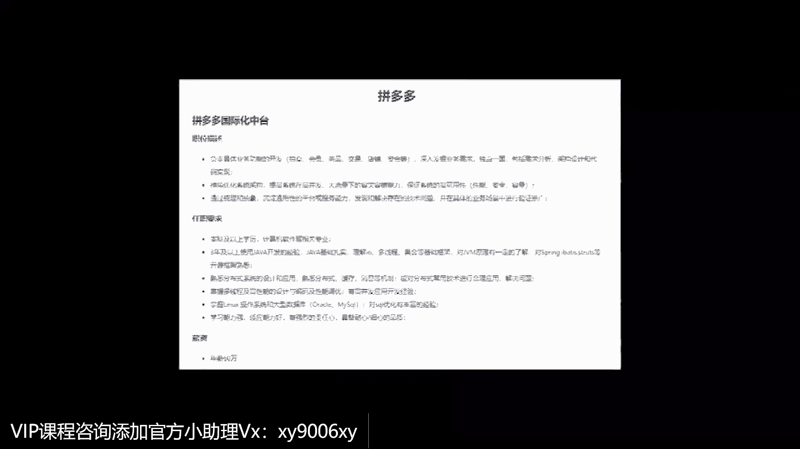

# 系列 3：P1：互联网P8架构师的工作内容与能力重点是什么？ - 马士兵_马小雨 - BV1zh411H79h

什么是P8嗯，大多数做传统行业软件的小伙伴呢，他是比较熟悉这种传统的CD的，这样的一个软件的结构，但是很多人其实并不熟悉项目，互联网相关的这些软件的架构，它到底是怎么搭建的呃。

我们的G8课程呢主要就是集中在互联网，三高这样的软件的结结构，从一个高层上它是怎么设计以及落地的啊，这个落地呢也非常的重要，我们是专门搭建了自己的几十台的服务器，花费上百万给大家模拟一个最真实的环境。

然后用一行一行的代码来教大家，怎么样有一个项目把这个互联网三高，也就是说唉高可用高扩展嗯，还有呢就是高性能，互联网三高的这样的一个软件结构啊，一行一行代码用在真实的环境上，怎么让他给落落地。

这是我们的P8课程，为什么要设计P8架构师课程，呃我们当时考虑这个是P8，这个架构师的课程呢，呃主要是看到市面上从来没有一套，能够把P8的这种理论，把架构师的人类理论完完整整带给大家。

一行一行代码来落地的这么一套课程啊，实际上是没有这个东西，在这个方面呢我们是绝对的原创呃，也没有人肯花一个很大的成本啊，这个几十台的真正的服务器，在线上来模拟一个云的云环境啊，把这个东西呢搭建出来。

所以呃我们就讲的就是任何一个理论，你讲出花来，如果不能让它落地的话，因此在这儿呢我们除了P8的这种，就是架构师的理论课之外，大概有十几篇的理论课啊，涉及到分布式的方方面面。

唉在这个之外我们又搭建了真实的环境，让他们有这种落地的这样的一个呃学习机会啊，这个很多人呢做传统的行业里，实在是接触不到的好，呃，在这儿呢通过一个完整的课程，让你来了解一个互联网的流量特别高的啊。

这样的一个项目，它怎么样用好多台，几十台，上百台的服务器来搭建起来这样一个环境，并且代码还有分门锁呀，分布事务啊等等这些方面是怎么落地开发的哦，就是这个东西呢对我们很多的呃。

做传统行业的小伙伴呢非常有纪念意义，所以这样我们就设计了我们的批判教程师课程，学了P8课程的程序员能获得哪些能力，有什么好处，学习了P8课程之后，大多数的成员不管你是什么样的语言。

你都会有这种加工性的思维和开始，可能呢在咱们每个程序员来说，你的开发的语言的方方面面，java c加加的做gold，做点net做PH等等，但是每种语言如果你学到一定的程度之后，没有这种架构性的思维。

软件结构高层的这种思维的话，那么你的向上的空间是打开的，所以P8的课程，就是为了给大家这么一种加厚的感觉，呃虽然说我们整体的落地呢是以java为主，但是呢站在一个比较高级的架构师角度来看。

其实语言并不能够不可以限制你的个人发展啊，就像你造一所房子对吧，你的这个柱子绑成水泥，那更合适啊，两门的话那就得用用用用用木头可能更合适，所以说合适的比放在合适的地方，这是一个比较牛啊。

非常牛叉的这样的一个架构师，应该啊所考虑的这么一种一致一种思维，所以呢不要让不要让语言，局限于你自己的架构性思维的发展，希望大家伙呢也能够，每个人到达一定的天花板之后，考虑往架构的方向往上走一步。

你能够把握整体软件结构的时候，你的向上的空间就打开了，程序员以后的职业发展和瓶颈，大多数成员呢到一定的年龄之后，我会感觉到自己的一点压迫感，一些中年危机存在，但是P8的这种架构师能让你消除这种危机感。

呃，一个在市面上来说，你的技术能够达到架构师这层级，并且管理水平再跟上来的话，在所谓的35岁啊，所谓的40岁，也可能就是你新的职业生命的开始呃，在这方面呢，我们有过很多的那种传统软件行业啊。

他有的是甲方公司，比如说他专业不是做IP的，他也需要有很多这种有互联网的方面经验的，有这种高并发大数据量处理经验的，这样的一些架构师，给的薪水也非常非常高啊，白药基本都是百万以上这样一个薪水。

所以你能够做到这一点的时候，就说技术上能够有架构师思维，同时和人类沟通啊，然后再加上部分的管理，这样的几条腿开车一块走路的时候，你的新的成长空间就打开了，当然按钮是温水煮青蛙，然后只是天天cr it。

就是天天crud10年，也就是个熟练工种而已，所以希望大家伙能够放弃这种温水煮青蛙的，得过且过的这种佛系思想，给自己一点点压力，让自己在这软件这条路上越走越宽，提升你自己，就在今天。

下周我们项目如何落地。

谈到我们的落地的项目呢，我们也是选了一个大家伙喜闻乐见的，就是再造淘宝这样一个项目呃，为什么这么选他呢，是因为呢淘宝这个项目综合了很多很多，现在在互联网领域里头，就是特别受欢迎的那种技术。

比方说它的并发量都非常高，他在双11的时候，他在那个过节的时候，他在秒杀的时候，它的并发量会非常高，比方说呢它的数据量会非常大，比如说他会牵扯到推荐系统，这种初步的人工智能。

比方说他会牵扯到智能聊天的机器人啊，这种智能客服等等，比方说他会牵扯到各种各样的分布式锁，分布式事务等等，就是关于分布式的方方面面，这样的一个呃项目来讲的，就是大家伙很明白它的业务逻辑。

这样就能很快的把这个关注点的，关注在哪个技术上，那么在这个时候呢，嗯你如果能把我们的整体的这种赛道，赛道淘宝的项目跟下来的话，那么你就是一个淘宝级别的项目，是你可以想象一下你的价值观课程太长。

如何选择课程。

呃我们这个架构师的课程，他的课程非常长，长达1500个小时左右啊，为什么这么长，其实你要了解这一点，就是呃从你参加工作开始，到成长一名P班级别的这样小老师，需要长达五到10年才能造成到达这种水平。

所以我们在授课的这个方面上呢，我们是考虑到嗯更有水平的人，就是哪怕你水平差一些，我可以带你从头慢慢的走到这个级别，所以这个课程呢肯定是要做的比较长，如果不能够做特别长的话。

你相应的这种技术点我也讲的很深，所以这个呢课程的长度是必须的啊，当然呃，课程长度呢，不是说就是代表了我们课程会非常贵啊，我们在缩减了各种各样的有线下的成本之后呢，其实我们课程的性价比是非常高。

只有课程比较长的时候，然后才能够做到你的课程非常的深，我相信大家都能理解这一点，但这个时候呢会有有有同学会有些问题说，呃老师啊，我有一些其中的一些课程的基础，我已经有了。

那么这个时候我来跟这个课程应该怎么来跟呢，针对我们现在这种课程的设计，我们给出来的是定制化的学习，所谓定制化的学习，就是能够根据你现有的这种水平，然后以及你短期的长期的诉求，由老师来给帮助你。

给出一份这样的学习路线，比如说先学ACDE，然后达到你短期诉求，用剩下的时间里慢慢的整体性的提升啊，那么你水平稍微差一些，我先给你一个初级的版本，以前慢慢成长到一个哎，稍微那个那个弱一点的水平。

在达到你这个涨完薪水之后，你可以慢慢的再用其他的时间来，把自己的整体水平再升上来啊，我觉得这是一个非常不错的，比较友好的这样的一个学习氛围和设计，也是我们的特点，在这个哈我也是我们的首套。

希望大家喜欢我们教研团队。

讲师团队优势，我们呢有非常牛的这种教学团队，呃，像来自于阿里，来自于美团的，那么以及嗯嗯比较有名的算法的老师啊，还有呢北大的读书后，我们两位清华的老师。

dit go的老师在这全都有，然后除了这个之外呢，因为我以前有很多学生呢，他们在大厂已经呆了很长时间了，但是呢他们水平虽然很高，讲课可能未必适合，但没有关系，他是我们的，他们会是我们的教研团队。

那么教研团队呢，会给我们提供各种各样的解决方案，以及呃这个呃课程上的各种各样的这种课件呀，呃这个答疑啊，呃咨询啊等等这方面的图，所以我是相信这一点，就是在一线，尤其是在一线大厂有过实战经验的。

这样的老师才能带出比较牛的学生来，嗯其实效果呢我估计大家伙也都会慢慢看到，我们现在有很多很多的学生，都已经通过这样的一个学习方式进到了大厂呃，这是第一点，而且呢我们现在的教育水平。

也得到了各路大厂的认可，像以前的有很多学员出去说，很忌讳的说我是培训出来的，但是在这儿呢告诉你，有嗯N多的大厂的人找我们做内推啊，这个呃百度的，阿里的，腾讯的，京东的这个我们都全部都有自己的那堆渠道。

拼多多啊，头条全都有啊，甚至头条呢会有专门的人，就是专门给我们做的定制化的内推呃，为什么，是因为认可我们的角色质量，现在呢你在这学习的话，其实完全没有必要忌讳说我是参加过培训的。

那么你在这儿参加过培训的话，在大厂会受到欢迎。

我们都有哪些特色售后服务。

我们现在也形成了自己的非常有特色的服务，比如说一对一的简历指导，一对一的职业规划，有很多很多一线的老师，包括在就是在这个行业中待过很多年的，讲的前辈，来帮你规划你以后的学习路线，升迁路线。

职业发展的路线，这是非常有价值的一件事情，除此之外呢，我们还有自己的内推服务，以及合作的猎头公司，来帮大家寻觅更好的发展机会，另外你在你的整个的工作期间，如果遇到了各种各样特别难以解决的问题。

在这儿还能提供给你技术咨询的服务。

第一点开了可以吧，嗯呃搜索，然后存储，然后分布式锁事务，分布式的配置可以更新吗，注册与发现网关路由浮雕，用负载均衡断路器分布消息链路追踪，预警监控啊，以及其他的一些常见的问题，呃我讲到这儿啊。

我不知道大家伙有多少人能有把握，说我能到P6的，有能到P6的小伙伴，你举个手扣个一说，我非常有把握，这些东西我掌握了嗯，mp5这要求我们公司怕是一个月招不会的，不会的啊，P5都够呛，没关系啊。

就我相信人这一辈子不可能，这哥们天生下来他就是P5或者P6，不可能都是从头开始学习的，和练习的没有关系啊，感觉掌握了不错啊，感觉掌握了你就有批流水平，P6水平的话呢，在哪里来讲的。

他现在应该是年薪在40万到60万之间嗯，应该很少比这个少，也很少有比这个高，我记得是还有一个VIP，他是个特例，他去了阿里的哪大厂，年薪90P6P6P6呃，我给你看过那个例子，就在那接着喜报上是吗。

嗯哎哪哪哪和顺丰科技，他都拿到了将近100万的年薪，P6水平，为什么这也比较特殊啊，当然像这种特例呢，你也不要太在意，你还信90，你搜90应该能搜到是吗，九十九十六一个就是进腾讯的那个呃。

那你搜一下百万百万百万，咳咳咳是这个吗，虾皮不是，这个是什么，这个盲盒是不是不是这个，现在九十百万不是这个美团唉，这个是这个吧，这个嗯，这个你来说吧，我我我我对这小这小伙还真不是特别熟，P6加薪水。

年终股票大概80，这是P6加的，这是阿里的哪咤大的诶，我一会专门跟大家说说，这个P6加这个加号是怎么回事，就是为什么还有P6加这件事，你们想听吗，嗯那咋的对，呃，怎么说呢。

我给你稍微讲讲这个加号是怎么回事啊，这里面其实就涉及到了你的晋升的路线了啊，我们想到哪就讲到哪儿了，那个你说我我想问你啊，假如说你进了一个大厂的体系，我们假设假设你进到阿里，你现在定的是P5好。

我现在想问你呃，你作为屁股来讲，你应该怎么样才能够升到P6呢，它的流程是什么样子的呢，好卡好卡嗯，这三家已经定薪酬嗯，客户端不卡对，好你们，你们好好想啊，KPI我看到有小伙伴说了啊，说是KPI。

我把咱们聊天窗口拖进来吧，盖着咱们一点没关系，可以看看大家的聊天呃，能力积攒加上人脉嗯，其实你说的都挺对的，都挺对的，就是你怎么才能升到P6呢，它实际上在阿里内部应该是一个比较科，比较完整。

现在应该是一个比较完整的流程，就是一般用适应你的领导开始提是吧，哎我我我手底下如果有十个屁股啊，我今年想提三个人，想让他升P6，那么他就提上去，提上去之后呢，下一步应该是要做一个出了审查了。

对答辩答辩要答辩评审，答辩答辩评审，然后呢，最后还需要沟通，如果有意见的话，我记得原来阿里内部还可以公开的投诉，还能投诉，对他是一个特别完整的体系，那么在这个里面呢，它就会涉及到一些怎么去评判。

你这个人能够达到了下一级水平，我告诉大家，你们说的什么人脉啊，什么KPI啊，你们说的都特别对，他一定会有这方面的指标，你比如说最简单的就是说嗯你你的绩效什么样，我说绩效这俩字大家都都能理解吧。

绩效这俩字，绩效就是说呃，同样的这个同样的这个这个这个完成完成度，那么有的人完成的特别漂亮，他机会就会好，有的人完成的不好的绩效就会低，一般来讲，这个绩效工资在你的工资水平里头，都会占一部分。

嗯嗯那么绩效就是绩效要好，对不对，呃，完成度要好啊，然后呢你具体教给你什么东西都都能完成了，那么像这些东西是不是就定了呢，其实不是，一般来讲呢你这个人能进到下一集，就是你要第一你要具备下一级要求的水平。

你如果要下载的水平，你到不了的话，那肯定是不行的，那我就想问你了，你怎么样才能你在P5里面，就大家伙100个P5现在都想升P6，指标只有30个，你怎么才能做到，你就是升上去。

那个你们想想塞包颜色不排除有这种可能性，你要个漂亮的女生现身，没准也有可能性，但是你要靠这个上去，我相信你也待不住啊，我告诉你，你仔细听，我就跟你说一句话就行了，提前做P6的事，能不能听懂。

我现在是P5，但是我对我自己的要求都是按P6来的，明白了吧，是不是老师一句话就给你就给你搞定了，来能get到的，给老师扣个一，啊马老师一语中地对，记住很简单，提前做漂流的事儿，就是你现在薪资20万来。

多承担30万以上的事儿，你相信我，你一定有一天啊，或者你起码得干，你升上去的概率要比别人大得多，所以我现在跟你说，叫P6plus，你现在是不是能大概能理解了P6plus，这哥们儿是P6水平。

但是他能担任P7的一部分的事，听懂了吗，这个就叫P6plus，原来原来阿里内部有一句话，先做上一级别的事，再做上一级别的人啊，对啊，这个就是这个意思没错，你比如说说一个最简单的。

我们说P6升P7的时候啊，P6升P7怎么升呢，P7要求的是带一个小团队的，这要求的是带一个小小的团队，这个团队的可能不太多，初级的P735个人哎，你就是那最核心那个你就是那个P7了。

那你如果P你在做P6的时候，已经有这样的经验了，那你说P7的可能性是不是高很多，听不听懂了吗，就是这个东西呢，当然我说技术是硬指标啊，你说你技术上必须得到位，那个很正常的，就是除了技术之外啊。

当然还有还有很多很多的技巧和东西，我们都是有迹可循的，这个这个不急，我们我们我们讲到哪了，刚才刚才讲的这玩意，之前我们聊点讲的那个职级的薪资，职级各职级要求的要求，C，大家可以看啊。

嗯就是有把握能够做得到的，那挺好的好吧，你要想P6P7升的时候，来先把P7的这些东西呢给搞定了啊，就是呃我记得曾经啊，曾经以前就是拿那个技巧和调优来说，我们说P7里面的这个要求，那么对于P6来说。

我记得曾经以前有一张表格，他会列特别细，这是啊啊这是阿里很早以前的表格了，是我以前很老学生学生发我的很早以前的标杆，它它会它会把一个东西呢列特别细，他说你如果你是P6，那么对于JVM这样的技术点。

你应该掌握到什么程度，这个大家能不能理解，对于存储这样的技术点，存储里面的MYSQL应该掌握到什么程度，存储里面的REDIS应该掌握到什么程度，存储里面的大数据相关的，应该掌握到什么程度好。

同样的还是这些东西对于JVM，对于存储的东西P7应该又掌握到什么程度，这画图图画有点不好看，换一个刚才那个那个那个PPT，在这里啊，我简单给大家伙列一下，他这个要求呢是很早很早以前的一个要求。

就也也也挺挺细致的，哎这是一个P6，这是一个P7，那么对于PP6，对于JVM的要求是什么，对于多线程的要求是什么，比如他熟悉能应用好了，这就P6的要求，一般来说是这样的，熟悉啊，能能能应用能调。

好像是存储啊，你这个MYSQL熟悉也能用，能分库分表，那么到PC的要求往往就是精通，精通的概念是什么呢，知道原理出了bug之后，知道怎么样进行深度的调试，P6对于NT来说。

它的应用很可能是哦我我能熟练熟练运用，没有问题，到了P7很可能是你必须得知道原理，所以P7和P6第一个的区别，在以前的这个标准里面，叫做你要懂得更深的原理，不知道我说清楚没有，这就是我为什么啊，我们。

有一门课程叫做嗯spring的源码，我把它叫做P7的课程，很多人理解不了，说老师那个你讲的spring源码怎么就到P7水平了，呃这么大家说，这是调优不那啥了嗯，视频源码课就是嗯拿spring源码。

源码源码课程来讲的，就是为什么说spring源码，就到了一个什么P7水平了，原因是什么，主要是把spring源码讲的什么深度视频上讲的，这种源码的特别多，我们源码也很简单，我们大概讲了80个小时左右。

注意就这一门课啊，大概讲了80个小时左右，为什么，因为我想让你就靠这一门课，就直接给面试官留下一个P7的印象，因为这门课可以让可以把spring做到定制化开发，就是你拿过spring了。

你改的源码编译好了之后，是一个你自己定制的spring，能理解的意思吧，好了到这种程度，你如果正好被问到了，你答的不错，那么在你面试官的眼里，你就是P7水平，这是技术水平啊，不知道说清楚没有。

能get到这一点，同学老师扣个一，当然我讲的这儿呢，也顺带着给我们，给我们黄老师呢做一个小小小的广告，呃，黄老师最近讲的另外一个，一个特别牛逼的源码呢，叫做同K源码，好像最近刚刚刚跟上来啊。

诶到底是哪个呀，也是大概有一个很长很细的一个内容了，顺带着做点小小的广告，就是老师这个课呢就是同样的课程，源码分析和架构思维，同样的课程我们会讲的比外面深入的多啊，也许你看到别人的大纲特别浅的时候。

说我也有这个，我也有那个，但是我直接告诉你，这是深入的多得多，一个课很可能就让你怼到P7了，当然靠运气，有一定的运气啊，你得把那个P你要想特别完善的那个P7，就把P7的要求全部拿下来就行了。

我们回到刚才那张那个图啊，大家看到呢，现在这里是大3W2，我原因是什么呢，因为新版的这个直接的体系和标准，我们也也也跟随着大厂的东西呢，进行重讲的更新啊，痛点怎么规避啊，祖父悖论等等。

完全穿透各种言语啊，还有一个全局意识啊，百万设计师就是在我们课程里头，有一个叫做架构设计的课，就是没有没有这架构设计，我直接告诉你呃，你可能到不了年薪百万的，那这个呢也简单也简单介绍。

就刚才90万年学习那个你腾讯这哥们儿，他呢你看到他那个腾讯的面试题，你就知道了，就就就这就这个面试题，呃你可以拿过来做设计做练习，你把这玩意儿练好了之后呢，你基本上就是腾讯的那种。

九十九九十万年薪左右的水平啊，嗯当然这个东西不是很容易呃，它的难点在于，你要深刻的考虑互联网的三高思维啊，原来讲三高现在快进行到四高了，三高思维高可用高扩展，还有高性能，你要深深的考虑好。

在三高思维的指导之下，像这样的东西我们应该优先考虑哪一高啊，你可以思考一下好吧，当然我们现在呢也在正在直播的是一个三高课，我记得是吧，嗯对在那个不it，全面封就是抽奖对能搜出来三个在同一课程上。

嗯正在直播的是一三高课，也给大家伙儿调来看看吧，就是我们现在呢呃，现在正在直播的是一个互联网，微服务的分布式的三个落地的其他项目课，呃这课呢是那个所有的知识点的一个综合运用，那么在这个课程里面呃。

从嗯基本简单的开始吧，到我们呃，我们特特别邀请了阿里的P8的老师，来给大家分享一下十多年的电商发展史，就是以电商来举例子啊，我们最终的呢把这个三高的一个一个课程呢，来进行落地。

后面的都是一些落地的方案了，呃这个课呢目前正在直播，然后在你当然你要学习这个课，我真心建议你先把什么呢，先把我们课程里面的关于这些课程的，那些支撑的技术点先搞定，那么你跟这个课就叫做事半功倍好了。

实在的介绍了点我们课程啊，我们继续来聊这个，就是你先把你先把这些东西啊，先把这些全部都搞定之后，再来跟这个三高课事半功倍，你很可能靠这一个项目就达到P7水平了啊，我们说到这儿，这是P6的40万到60万。

这是P7的，我们聊聊聊一下简单的薪水啊，P7的话，那就是50万到70万，800~1000 250，1250，这个好像是最新的数据吧，这好像是最新的数据啊，这就是P7的一个大概的水平呃。

但是呢其实有好多人最后最终定位的是P7，他的年薪呢是过百万的，这个这个原因是什么呀，就是P7plus就是快到P8了，这样我们从头呢我们简单说一说，就是你怎么到P5，怎么到P6，怎么到P7，好吧。

三高课程学完主要解决什么问题，现成的像京东阿里呃这一这一类的大规模的，能够接受大规模的大病发量的，这样的网站到底是怎么设计的，就是干这个事的呃，让你的薪资超过50万，干这个事好吧，哦我看有人问课程。

我简单稍微回答一下VIP多少钱嗯，去找一下咱们小姐姐问问，因为今晚上应该是有活动的，学完这些呢，如果每天安排两小时，正常来说大概需要多久呃，建议是周一到周五两个小时，周末你是要翻倍的呃。

如果你看你的基础啊，如果你是零基础，从P5开始学，我估计你全部学完要一年呃，但是呢老师这边的教学方式比较特殊的呃，我们是一种定制化的学习方式，所以你会看到有什么呢，有那种特别时间特别短。

我就搞我我就搞定的啊，有时候这是我们帮他设计的一条路线，叫6+2，这以前很早的路线了，只只看了自己感兴趣的部分就涨了，涨了新了啊，好了好了，我们先不做这些个广广告什么的，你像这个的话。

那就是两两个月就涨了50%，就是说你你寻求如果全学完，我告诉你一年左右时间，如果你寻求你说以目标驱动，说我目标我就是想涨个薪水，那就那就简单了，所以就看你想干什么，取决于你要花多长时间听懂，听懂了吗。

VIP跟MC什么区别和关系，那个VIP就是VIP学习的课程，叫做MCA他俩是一回事啊，哦我们还还继续说这个直接这件事啊，一会儿如果大家有兴趣的呃，你想说我想达到什么级别，想跟老师聊一聊的都可以啊。

我跟我跟曹老师都在这，超老师也指导的学生，指导挺多的，我觉得曹老师最牛皮的是一个高中生，是给弄进阿里去了是吧，我觉得你你别就这种事还是少宣传，以免有很多高中生真的想过来全头发里去，因为今天就有。

我们不是有大厂必进班嘛，然后有一订单已经满了，今天今天就不说这个大厂，毕竟嗯嗯好像已经满员了，不也没过也没关系啊，就是说如果，就是那个那个高中生，你说说看他他是怎么能进到阿里的。

我说到这儿说点学习上的事啊，就是说你你知道有很多的大厂啊，大厂这件事儿呃是特别在乎学历的，你说你高中肯定没戏的，我告诉你有哪些大厂，你要是高中肯定没戏，其中一个呢下载华为啊，另外一个呢叫腾讯。

还有一个叫百度，还有一个快手，还有其实还有挺多的嗯，其实还有挺多的就是特别特别看重学历的，这些个会特别多，然后呢那个还有一部分相对没有看到，那么那么那么那么大学历的啊，其中有一个呢就叫阿里。

阿里为什么不看重学历啊，原因是啥，你阿里为什么不看重学历，因为老板学历不高是吧，对对对，因为马云大专毕业，马云大专毕业啊，然后原来他最开始的时候，那个18罗汉好像很大一部分人，学历都都都比较差。

我记得呃安马云的讲法是原像那个18罗汉说，我要按照现在的标准啊，我们阿里的标准来招人的话，你们一个都进不来哈哈，他学历并不能说明一个人的能力差，他只是在你面试课程的大大厂会偷懒呃，我学习好的。

我已经够挑了，我就干脆不费劲去从那个学历差里面挑人了，他这么他是这么个逻辑，但是阿里呢他不太在乎，还有一个不太在乎的，那叫京东，京东着急的时候，什么大专呀，这个这个全要啊，嗯我一会儿告诉你。

一年里头最好进的时间是在哪儿啊，就是什么时候他会着急呃，前些日子，因为我们现在跟京东合作合作比较紧密，我记得前些日子就京东嗷嗷嗷叫的找咱们，要人就找我们要人就要到曹老师，这京东数科。

京东数科的京东入口发过来的岗位80多个，全是集中，没一个不着急的好，这种时候大专生是最好进去的时候，嗯嗯但是我们VIP好像比较那啥，当时那个京东还没有涨涨薪资好多看不上，好多看不上京东薪资。

现在应该京东涨起来了，基本16星了吧，涨涨了一个，涨了一个月的薪水，我记得是，还有一个不太在乎的呢，滴滴稍微的那什么点，但这个比较特殊，它这个分项目组啊，你像我们大厂班里有一个带高浪的老师。

就是高浪专门带人进大厂的啊，我们的高原老师他呢是滴滴的，他说呢像在学历这块呢，在滴滴来讲的是主要是分项目组，项目组不要着急，也不也不在乎啊，当然还有一些像顺丰，还有一些二线的厂子，像什么五八呀。

那个就这这一类的2223线的厂子，他们也会不太在乎学历啊，行，那高中高中生是怎么弄进去的，我当时也比较好奇，我都忘了忘了忘了问题，首先第一点是进技术足够强，因为大厂他招人去了，毕竟是要出活的对。

第一是技术足够强，第二是在外面干到一定的title，就是可能一些小公司，你就是小公司，他最开始招人不挑，然后你进去了，然后在里面的技术也非常好，管理也非常好，然后可能你干到一个架构师或者。

技术总监的岗位，然后你再去面试大厂，那么就是你原来的职位或者你原来的薪水，已经能证明你的能力了，就不需要学历去证明了，这个时候也是特别容易进去的，我不知道大厂听，我不知道大家伙听清楚没有。

这里面就包含了大专生，怎么样才能进入到大厂，我在前面讲大专生的时候呢，我就强调过一句话，我说你作为一个大专生的在校生来讲，如果想规划好好自己进大厂的路，你的前三连一定要走好，大厂最喜欢要的年龄三到5年。

这是最喜欢最喜欢要的，你的前3年一定要走好，你前三项一定要走好，怎么走，在座有大专生吗，在校的比较年轻的，工作没满3年的，有没有那个郑大建是吧，郑大建还在吗，郑大郑大建是今天刚报名的哦。

嗯两年是ok good，研究生研究生相对进大厂要好好进的多啊，我们就就是把握性要要高得多呃，吴大伙这是OK嗯，大兴庞各庄毕业是吧，小岳岳好呃，我我给我给大家伙那个现在你在校的大专生，还有一个啊。

呃你现在工作没有满3年的大专生，我给你指条路，沿着这条路走，你是有很有一定的概率进到大厂，这条路怎么走，如果从驾校来说，你的第一次就业就是你毕业的时候，那次就业你首先第一得进得了行业。

尤其像我了解很多的大专，如果在没经过培训，不管是线上还是线下，你其实很难进到行业里去的，所以第一件事要进到行业好，进到这个行业的时候，你尽量的要多拿一些offer来挑了，这是你的技术水平了。

但是这个时候最不应该看重的叫薪水，就说我挣个五千八千，跟我挣个1万21万3，不要太看重那个几千块钱那点区别，人这一辈子不可能靠第一份薪水你就致富的，没有这种可能性，你就不用想了，你随便找案例行。

我第一份薪水我就靠它来支付，扯淡不可能，所以你的第一份主要看什么，看你看重你将来的发展，这个发展主要看什么，如果说这个企业能它有很很好的一个空间，能够让你在里头待够3年，这是最最完美的企业。

同时它一定要有长对应的涨薪机制，就是你在三尖头上想进大厂，那会儿最理想的情况，刚才曹老师说了，你有一个固定特别好的一个薪水，证明你的能力，或者你有一个特别好的title，证明你的能力。

所以你要在刚进去的时候，如果有一个厂子说容忍，你能够在3年之内成长到一个比较好的水平，那太好了，Very good，但是大多数的厂子实际上不具备这种水平，尤其是你们刚毕业的时候。

很可能就拿到多少8000块啊，1万块，1万2，这种薪水你就不要想了，进不了大厂，大厂一看你这薪水，第一个第一个反应就是啥水平，一定是这样的，这样的，你一看你薪水就证明你能力不行。

所以一般来讲大多数的人要走一年，在第一年的时候，你给我好好学习，好好攒经验，项目经验，技术经验，按按照我要求的这个能力，你和我好好攒，攒完之后，在你一年毕完业一年的时候，跳第二家要注重薪水。

这个时候就要注重薪水了，不知道说清楚没有，我再说一遍，一年的时候，最开始薪水可以不太好，一年头上结束，跳第二家的时候，一定要注重薪水，薪水将前途并重，就是你这第二家的选择。

一定是建立在你第一年好好学习的基础之上，你的选择那会特别特别宽，然后呢，当你有了这个选择之后，你在第二家选择的时候选什么，必须注重薪水，建议2万以上，必须注重前途，这个前途指的是什么呢。

就是你要考虑到你在这里要做，做足两年之后的下一步大厂的上升空间，考虑这件事儿，然后呢呃理想的情况在你两年毕业的时候，你这个时候的薪水呢应该在2万到2万5，甚至到3万，这时候进大厂，你的大厂的概率。

怎么着也能提升到60%到80，我就真认为是没事，没问题的，就是你就是打转手，那么最在理想的一个情况，在你这个期间还拿了一个学历嗯，概率高多了，在座的大专生不知道我说清楚没有。

如果工作的1~3连是拼多多的前三连。

那就那就不用进大厂，对对对，我们看你看看哪个大专那里，我觉得老师原来有一个呃，这个是有这个大专生不幸错过案例，入职申通，申通其实也还可以，你说二线厂的肯定没问题，他当年他这个时候是初中的时候。

主要是主要是正面那个申通的时候啊，那个阿离给打了，打了几个电话，打了八个电话，打个电话一个都没接着，正正在面试申通的第四面，第三面忘了啊，第四离第四面啊，这属于比较倒霉，但是他水平一定是到了。

不然阿里不会给他第三遍第四遍的机会，那个我记得原来超老师手底下有一个学生，他是大专，刚刚应届生，是拿了21K我没事，我没记错吧，是在广州，广州是一在it行业来说都不算一线了，其实嗯就搜我搜不着了。

那这个你看这个小伙是大专学历，受到多家大厂的offer，他当时给的那个跟这个描述啊，你仔细读是肺腑之言，他说明哥非常感谢帮忙批改简历，这是我们服务之一，也感谢我们教育的课程指导。

学的接触了接触不到的东西，安卓老师的说法就是认知偏差，我之前的简历呢很少有面试邀请，现在基本每天可以排满，经过三周面试，已经收到不少offer，后期会记得学习啊，他说真是讲的大专学历的。

我也不再只是那些中小型公司喊我去面试，就你最差最差，你认真的学习和准备之后，就算你是大专学历。

你没有进那种超一流的大厂，但是你绝对不会只是在那个中小型公司在混了，明白吧，嗯很多时候呢，就是它会有一个自我的认知的一个偏差，这个偏差呢一般我们称之为叫达克效应，感兴趣你自己去搜。

我希望你们从这个效应里头一定要走出来啊，注意是达克效应，也叫邓宁克鲁格效应，不要不要不要叫达克宁就行好吧，开个玩笑，把你自己从认知偏差里走出来，你这时候你会发现人生广阔，天地皆宽，跟你的学历关系并不大。

记住马云什么学历。