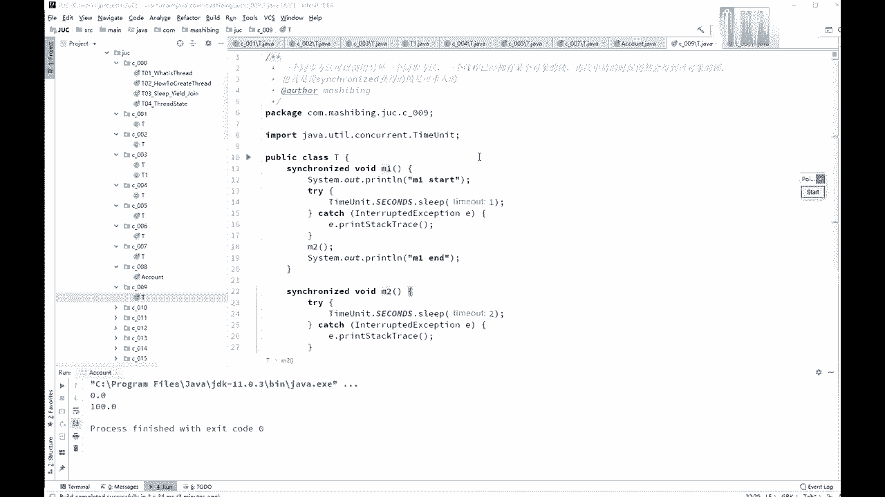
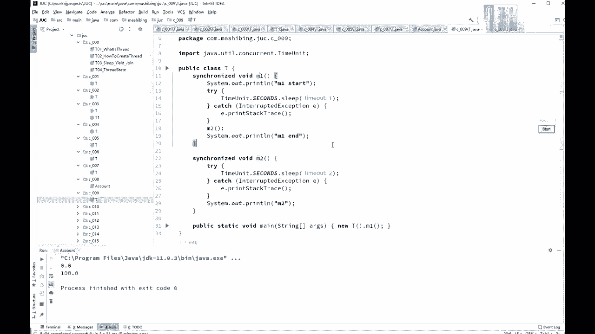
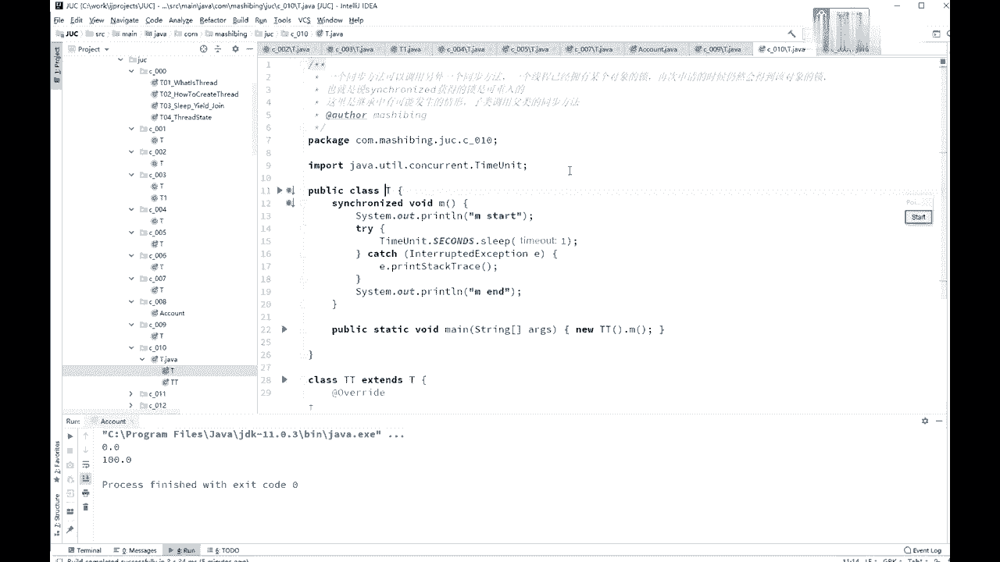
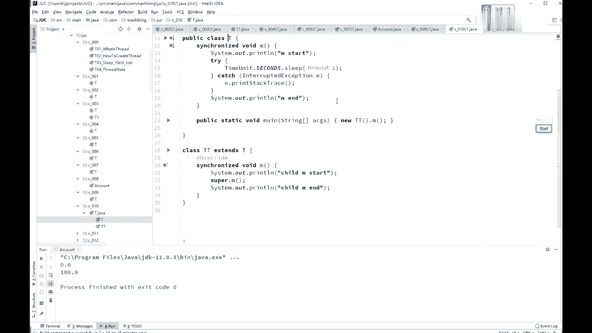
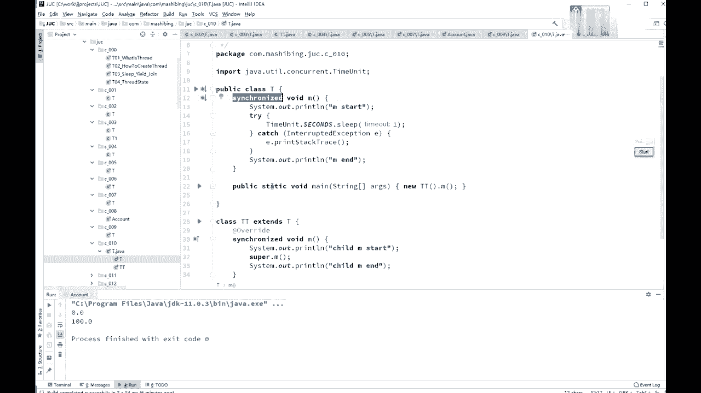
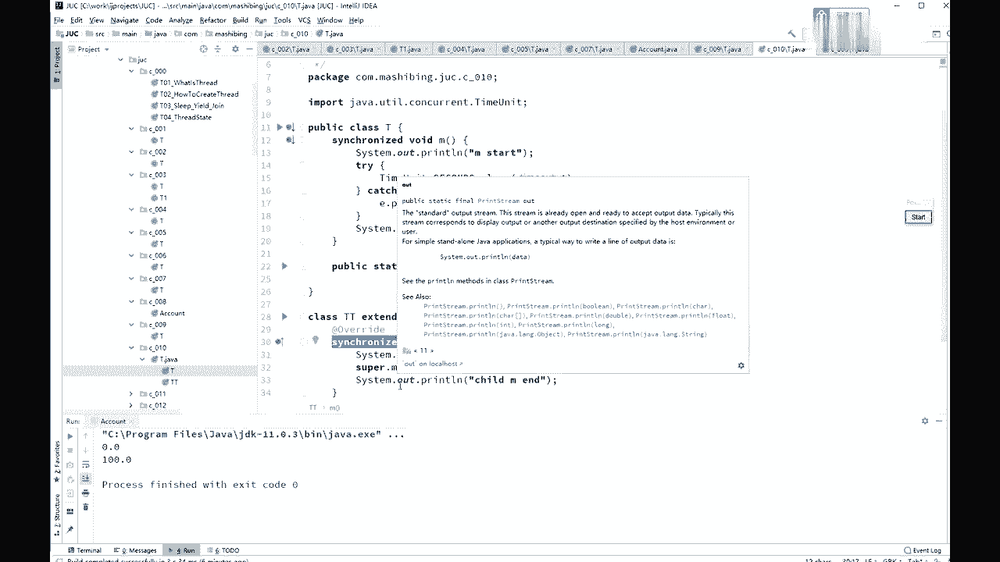
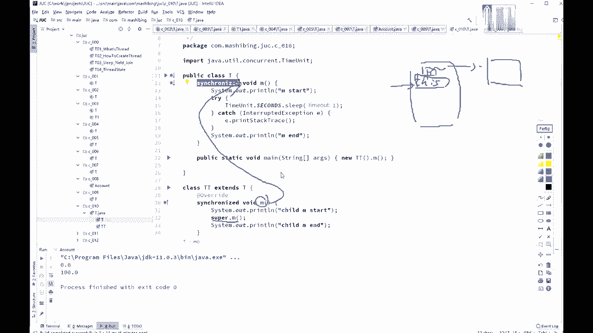
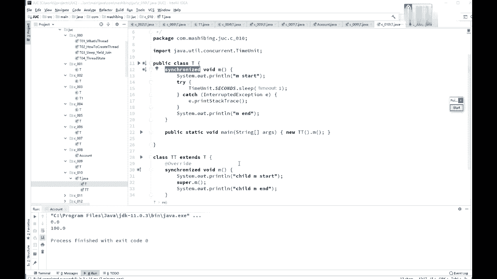

# 系列 3：P20：【多线程与高并发】锁的可重入属性 - 马士兵_马小雨 - BV1zh411H79h

下面我们来看sychronized等等等，另外一个属性，这个属性是什么呢，就这个属性叫做可重入，这可重入也是secret的必须的一个概念啊，不然的话就没法使用它了，辛格代词叫可重入，可重入是什么概念呢。

如果说一个同步方法调另外一个同步方法，有一个方法加了锁了，另外一个方法也需要加速，加的是同一把锁，也是同一个线程，那这个时候申请仍然会得到该对象的锁，也就是说c是可重入的。

什么意思，有一方法m一它是synchronized的，有一方法m2 它也是synchronized的，m一里能不能调m2 可不可以，如果它不可重入，会产生什么现象，你分析一下，c ronized。

我们m一开始的时候是这个线程得到了一把锁，然后在m一里面调m2 ，如果说这个时候不允许任何一个县城再来拿这把锁的时候就死锁了，这是不可能的，这时候如果再掉m2 的时候，他发现还是同一个线程。

因为你m2 也需要生成这把锁，结果他发现掉m2 的时候呢，我需要设计这把锁的时候，发现哦，原来是同一个线程申请的这把锁允许可以没问题，这就叫可重入锁，所以sronized是可重入锁啊。

synchronized的必须是可重入锁，以前有个同学会被问到了，问到了面试的时候，问到这么一个问题，simple是可不可重入的，为什么它必须是可重入锁，原因是什么呢，你比方说你有一个父类。

parent，它里面有个方法m有一个子类child，它里面有个方法m重写了它，但是呢它掉了super。m，如果你上面是synchronized，ok这里也是synchronized的，你说掉super。

m，这个很正常啊，我就负类的这个m方法，但是如果他不能够重复的话，你就直接负了父子类之间的这种继承，就直接死锁了，这肯定不行。

好了。

这是simple代的可重入的概念。

好看这里啊。

这个呢就是我刚才模拟的一个父类子类的概念，负类srt是吧，子类调用super。m的时候必须得可重入，如果不可重入的话，那肯定戳你了，调父类的还是同一把锁嘛，必须的呀。

你看synchronized是锁的谁啊，锁的this this类项。

这个cma也说的是this对象嘛。

还是同一把锁啊，估计有同学可能会在这儿有疑问，说我这个sronized到底锁的是负类的this对象还是子类this对象，我记得我原来画那个父子类的这个图的时候。

你弄出来这个对象叫tt在它里面呢有两种方式啊，第一个就是说基本上就只有这种实验方式吧，就是它有一个他有一个那个那个呃parent的这个指针，指向的是他的父类的对象，但是锁对象的时候。

你想想看你调的这个方法，symphonized的，他说的是谁，锁的是this，这个例子是谁啊，都是他吗对吧，当你调跑到这个方法去掉的时候，super。m他锁的还是要this吗，这才是谁，还是他。

所以锁的是同一个对象啊，呃所有的重入锁就是那个你自己拿到这把锁之后，自己不停的加锁加锁加锁加锁加好几道，但是锁的还是同一个对象，还是你自己锁的，你去一到就减个一。

