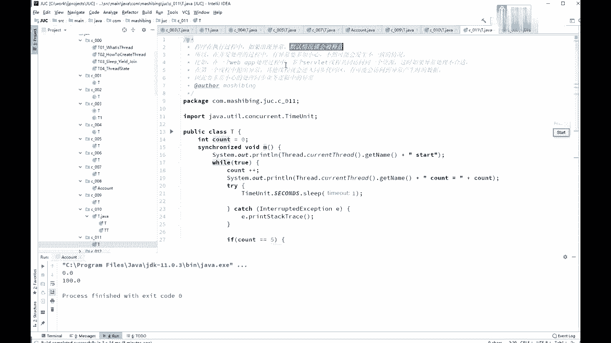
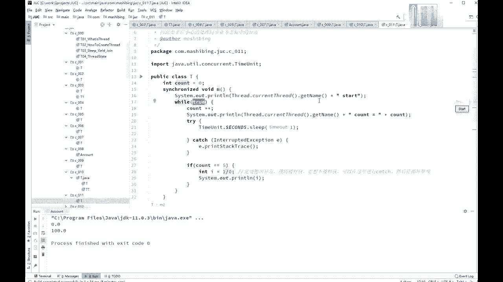
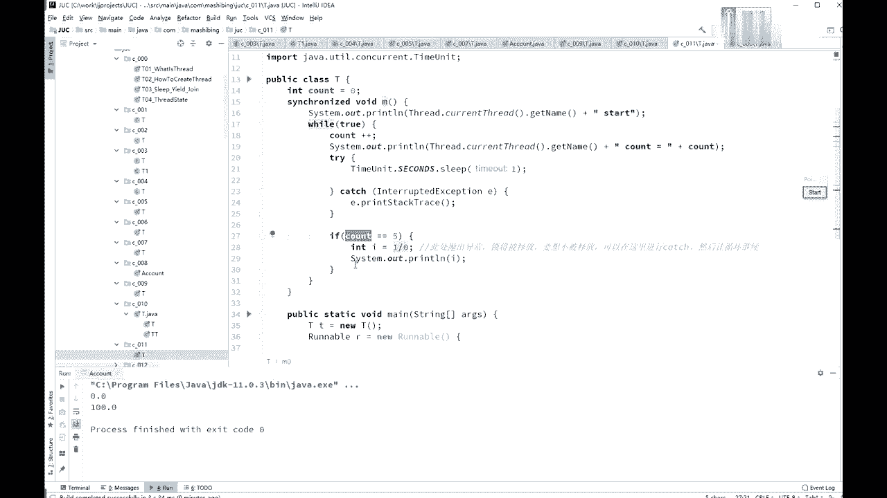
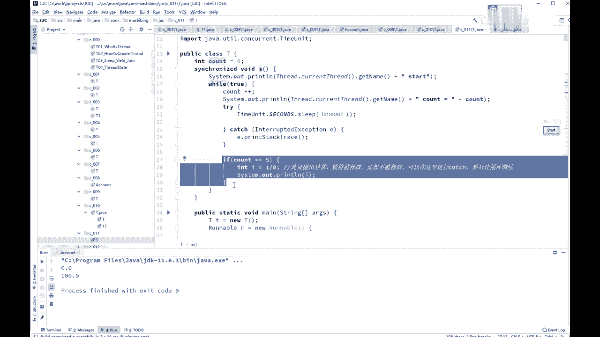
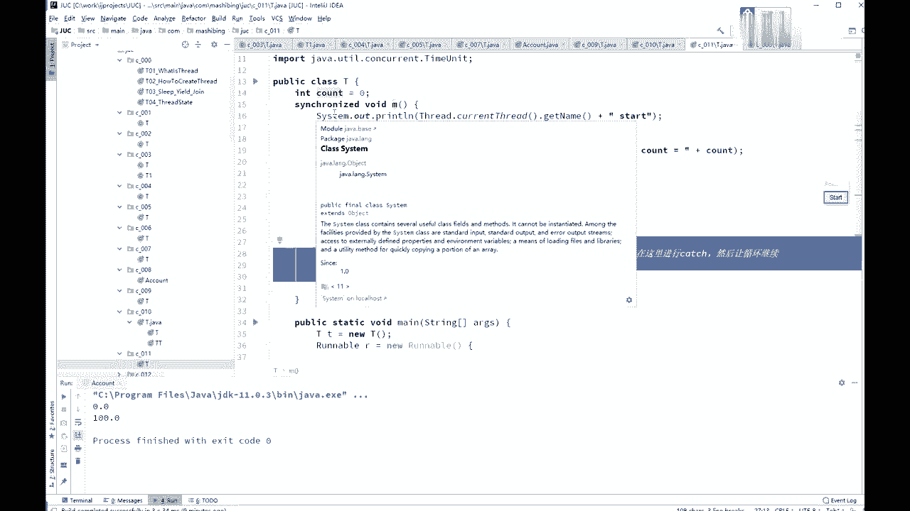
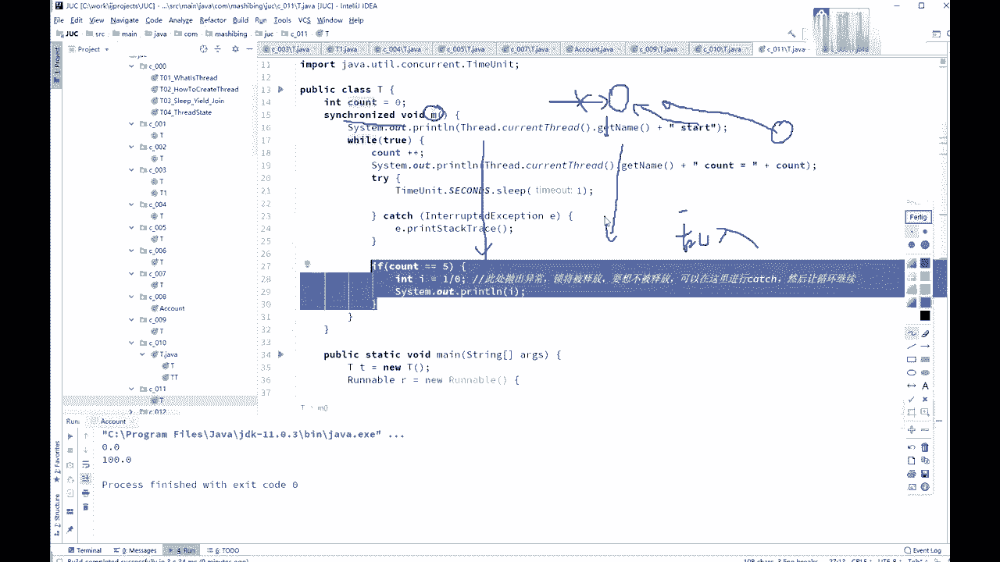
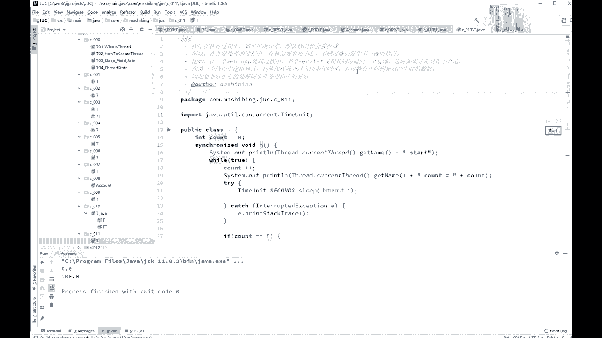
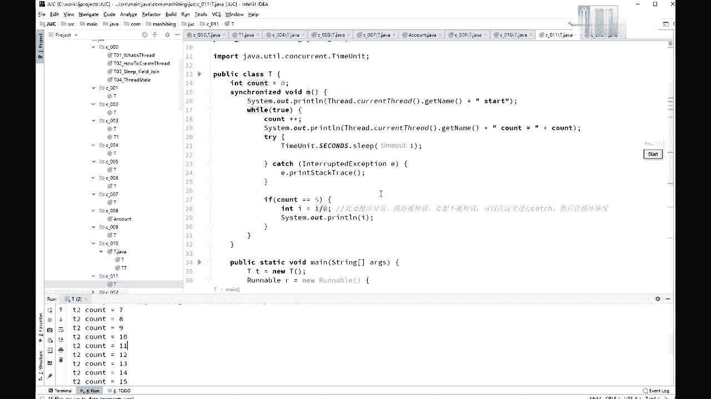

# 花了2万多买的Java架构师课程全套，现在分享给大家，从软件安装到底层源码（马士兵教育MCA架构师VIP教程） - P21：【多线程与高并发】异常跟锁 - 马士兵_马小雨 - BV1zh411H79h

啊如果没问题，那我们来看这个异常跟锁啊，这个也是也是需要你小心一点的概念，这异常跟锁的概念，异常跟锁的概念是什么意思呢，就程序之中如果出现异常温的情况下，锁是会被释放的，再说一下。

记住这一点就行了，程序之中如果出现异常，默认情况下会被释放，看这个小程序加了锁。

secret void的m while处不断执行线程，启动com加加嗯，等com sleep，如果看到no 5的时候，我让他人人为产生了异常，i等于1÷0，这肯定会产生异常，除零异常锁将被释放。

如果不想释放，让循环继续，本来我们是well true，一个服务器程序在这里不停地运行，然后呢还加了锁，synchronized的别的方法进不来。

这个时候你如果产生了任何的异常的话。

ok中间产生了任何的异常，就有可能会被会产生一种什么情况呢。

会被原来的另外的那些个，准备拿到这把锁的程序乱冲进来了，乱入程序乱入是吧，本来，我要执行象征性的代码，要拿到这把锁诶，但是呢我中间产生了异常，然后我就把这锁给释放了，另外的所有的那个程序诶。

正等着往里头运行呢。

马上我就拿了这把锁，有可能会对你的数据产生不致，好这个叫做异常，会释放锁。

所以一个web application的处理过程，多个surface线程，异常处理不合适，抛出异常之后，其他的就有可能进到这个同步区，会产会访问到你异常产生，去出的那些中间的那些数据啊，这要非常小心。

嗯，这我就不演示了好吧，本来你看上面那个县城，我要出门不停的运行，但是一旦抛出异常之后，这个就会被其他线程所运行了，上面呢是我们的，t小t等于6t呀，t。m都是叫t。m方法。

那么第一个线条呢是去掉它的tdm方法，第二个线程是t2 ，也是叫tdm方法，输出的是每一个线程的名字，本来正常情况下是t一运行，t2 不可能运行的，不过呢它一旦产生异常之后。

t2 这个可能运行来看一下结果，第一次第二的啊，你看你这里产生了一个异常by zero，结果马上t2 就得到了执行执行结果了，看到了吧，得到了执行的机会啊，你的程序呢本来正常是不允许他执行的。

ok好，这里呢是异常和锁的概念。