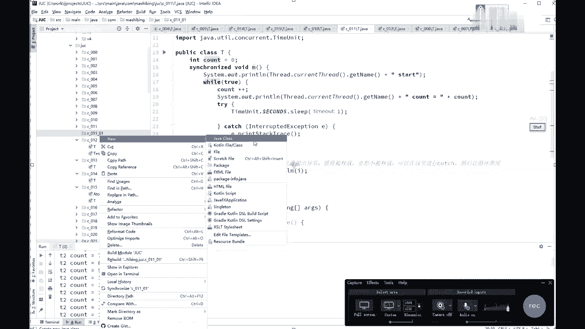
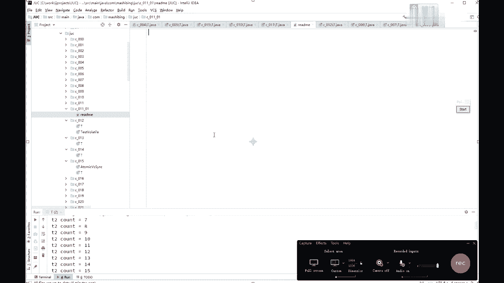
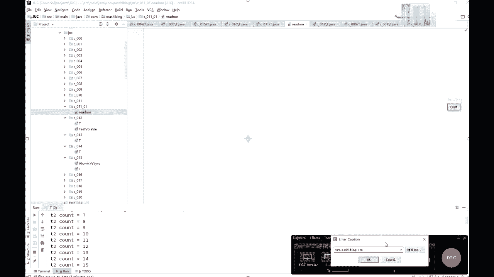
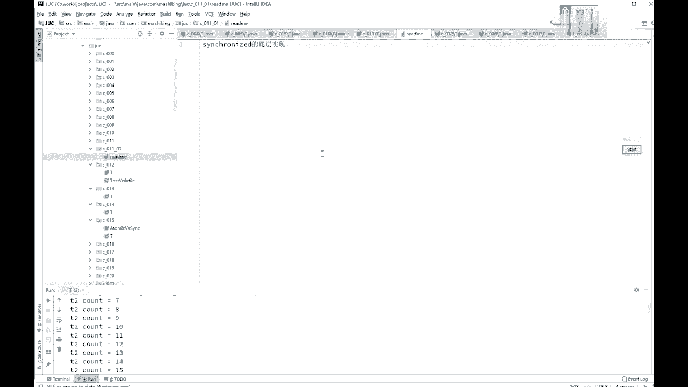
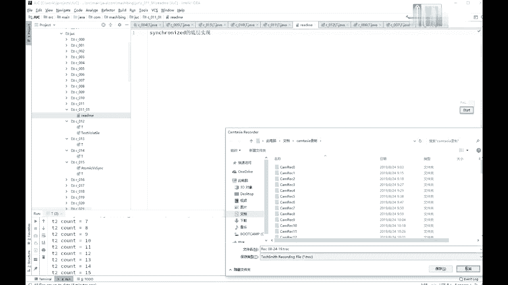
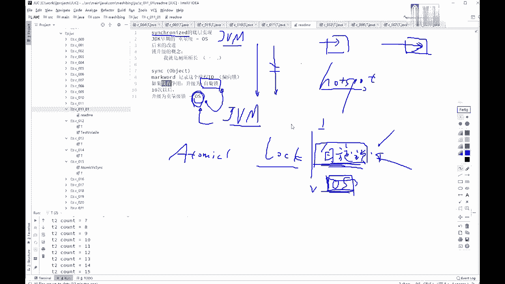
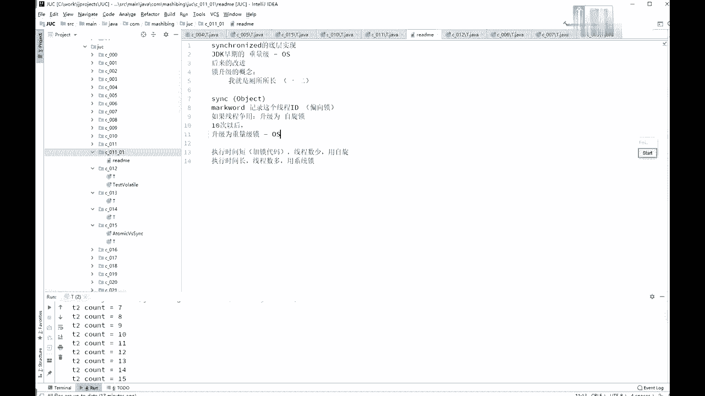

# 花了2万多买的Java架构师课程全套，现在分享给大家，从软件安装到底层源码（马士兵教育MCA架构师VIP教程） - P22：【多线程与高并发】锁的底层实现 - 马士兵_马小雨 - BV1zh411H79h

好看这里啊，ok同学们呃，那么讲到这儿呢，我觉得有必要呢跟大家谈一下，这个synchronized的这个具体的底层的实现。

啊看这里我那个建了一个新的package包啊，4001201，我觉得我好像少跟大家谈了一点小问题啊，我把这个siri的具体的实现在这儿呢，跟大家交代一下，这个cironized的具体的实现呢。

有他经历了好几个阶段，可以这么说啊，就原来呢最早的时候，在jdk比较早期的时候吧，这个也不太记得到底是哪个版本了，总而言之是这这dk比较早期的时候，这个sima的实现是重量级的。

信用代时间是非常重量级的，他所有非常重量级的一个概念，是什么概念呢，就是它这个synchonized，都是要去找操作系统去申请，所然后就会造成superman的效率非常低，后来呢嗯就是要java。

后来越越来越开始处理那些高，并发展这些方面的这些程序的时候，可能那个成员就特别不满意，说你sirnas这个方法，这期简直用的是实实实在是太重了啊，我没办法，我就得开发新的框架，不用你原来原生的了。

后来做了一些改进，后来的改进后来改进成什么样了呢，其实siri呢是有一个所升级的概念，关于这个所升级的概念啊，我还专门写过一个文章，叫做我就是厕所所长，大家去找一下啊，我的我的那个公众号里面也有呃。

然后那个网上你搜一下，应该网上也有啊，两个一共是两个一和二啊，我专门用小说的形式讲了这个所升级诶，到底是怎么样的一个概念，我不带白读了好吧，两篇文章还是有点长的啊，在这里我跟大家交代一下。

这个锁升级是什么概念呢，这个锁升级的概念呢是这样的呃，原来呢都是去找那个操作，都要找操作系统，要找内核去申请这把锁重量级的到啊，转向系数1。51。5之后是吧，嗯好。

到后期呢进行了一些对simple做了一些改进，它的效率呢变得比原来要高不少，改天在什么地方呢，当我们使用super nt的时候，hosport的实现是这样的啊，上来之后第一个去访问某把锁的线程。

你比如说synchronized的某一个project，上来之后呢，先在这个object的头上面，mark word记录这个现场，就记录一下这个线程的线程号就行了，就往这个object上一记录。

什么也不干，没给他加锁，我再说一遍，如果只有第一个线程访问的时候，实际上是没有这个给这个obj加速的，在内部实现的时候，只是记录这个线程的i d，这叫什么呢，叫偏向左，所以偏向组的概念。

就是说你你是我的第一个，我骗了你一些，我默认将来呢不会有来第二个县城唉，来抢这把锁，ok这个时候使用的是偏向锁，只记住这个线程id效率非常高，如果还是这个线程回来访问，诶，一看这就是我的那个对象得了。

我也不用申请什么锁了，乱七八糟的了，我直接开始执行就完了，所以它效率非常高，而且大多数情况下呢，也都是一个线程来执行啊，这是偏向锁，然后偏向锁如果有现场征用的话，如果有现成争论，好这个时候就升级。

为什么呢，自旋锁，自旋锁什么概念，自旋锁的概念就是诶你蹲在马桶旁边，这个这个有有有一哥们儿在这蹲马桶呢，对不对，这哥们儿在这儿蹲着马桶呢，好另外来了一个哥们，他干嘛呢，他在旁边等着。

他不会去跑到那个我刚才说的那个在cpu上，那个就绪队列里面去，不会他就在这等着占用cpu，用一个while的循环，while true是吧之类的，类似的这种循环在这转圈，玩转了好多圈之后。

发现这哥们儿你还不行吗，得这种情况下，整个锁才会再进一步升级，自觉所选默认的情况下是选多少次呢，是选十次之后，两个县城，一个县城在那站着锁，另外一个县城跟他自旋，悬了十次以后，如果还得到这把锁，升级为。

重量级锁，所谓重量级锁，就是去操作系统那里去申请资源，来加这把锁啊，这里呢是经过一个所升级的概念，有了这个新生代的改进之后呢，原来曾经有一些个文章哈，还有一些那个其他的那个那个那个啊，讲法也好。

说说这个seized啊，比atomic原子类的那些操作慢不少啊，等等这样的一些个说法啊，但实际上我告诉大家，经过了这些个所升级的这些概念之后，siri用的偏向锁自旋锁，然后呢重量级锁你如果做测试的话。

你会发现大多数的情况下，siri的并不比那些a tomic慢，原子类哈，不不比那些慢啊，好了，所以这是一个所升级的过程啊，好看看这一小块儿呢，有没有同学有疑问的地方，折子戏中好像还有一个cs的过程。

大哥自旋锁在干嘛，october，自选十次不夜战的cpu，别人也释放不了锁呀，如果释放不了，再去升级为重量级锁的时候，这个线程就成为等待状态，就不占cpu了，october，锁好像只能升级不能降级。

对没错是的，所以好像是没法降级的嗯，唉jonas，你提的这个问题还是很尖锐啊，这个说的非常的非常的到位啊，就是说你本来这个锁大家伙的征用，征用来征用去诶，然后呢它升级为重量级锁了，升级为重量级锁之后呢。

后来这个中央下来了，就只剩那么一两个线程，这时候呢如果你再回来，效率会更高，但是呢你回不来了，其实能不能回来，我想啊，如果你的你的虚拟机实现写的到位，也可以做到能回来，我再说一遍。

synchronnet这个东西，java虚拟机实现里面并没有规定，他到底该怎么实现，所以我说的这些全都是hob实现，就oracle的这个虚拟机的实现，假如oracle虚拟机实现不是这么实现的。

我也没法跟你这么讲啊，哦tober，感觉自旋没有用啊，你再感觉感觉我给你三分钟，四分钟，五分钟之后啊，十分钟之后，如果你再感觉感觉，如果你还不能不能理解我，再讲给你听，自选组啊，呃既然讲到这儿了。

我们讨论一个问题啊，在什么情况下我们使用自旋锁比较好，因为atomic以及包括后面的很多锁啊，这各种的lock，其实他用的呢全都是那个自旋锁，用的自旋锁，基本上用的全都是自旋锁，这个他人口有一个特点。

它是占cpu，但是他不访问，操作系统，所以呢它是在用户态，在用户态去解决这个锁的问题，它不经过内核态，因此它的效率上，这个枷锁和解锁，这个效率上，其实要比那个经过内核态这个效率要高，但是呢你分析一下。

在什么情况下用自旋锁会更好一些，在什么情况下用重量级锁会更好一些，经过内核的要要要好一些，你们分析一下，在什么情况下呢，自旋锁由于它是要占用cpu的，而os这把锁呢实际上是不占cpu的。

所谓的不占cpu的，意思是说，在旁边竞争的那些个县城，是进入的等待队列里，等待队列呢就是说你在那等着不占cpu，什么时候cpu让你运行了，你才把你把你叫起来，你才运行，所以什么情况还用自旋锁。

什么情况还用这种锁，你分析一下，执行时间长的，用系统锁没错，说的非常对，这个问题你们要好好思考，像这个问题，如果在面试的时候能跟面试官谈清楚，肯定会高看你一眼啊，没错啊，这writer说的非常对啊。

直行时间长，尽量的用系统锁，执行时间特别短，另外除此之外支撑时间除了短之外，你的这个线程还不能太多，2万个县城跟这等着自选，我告诉你，这事儿也受不了，一个县城正在执行，19999个，在那自选。

你觉得你cpu受得了，所以，是执行时间比较短，这是第一点，就是说枷锁代码执行的时间比较短，他别人经过这14自旋，这个别的这个锁可能已经就已经拿到了，好在这种情况下，直播时间短，线程数比较少。

用自旋锁执行时间比较长，线程数呢比较多，用系统锁啊，ok，那就给大家写出来，这里指的是枷锁代码啊，用自旋，执行时间长，线人数多用什么系统手，就是你用siri，就这意思啊，o。

好四分钟也过了啊，刚才那个刚才是谁有问题了，october是吧，o小鬼懂了是吗，好啊很好啊。