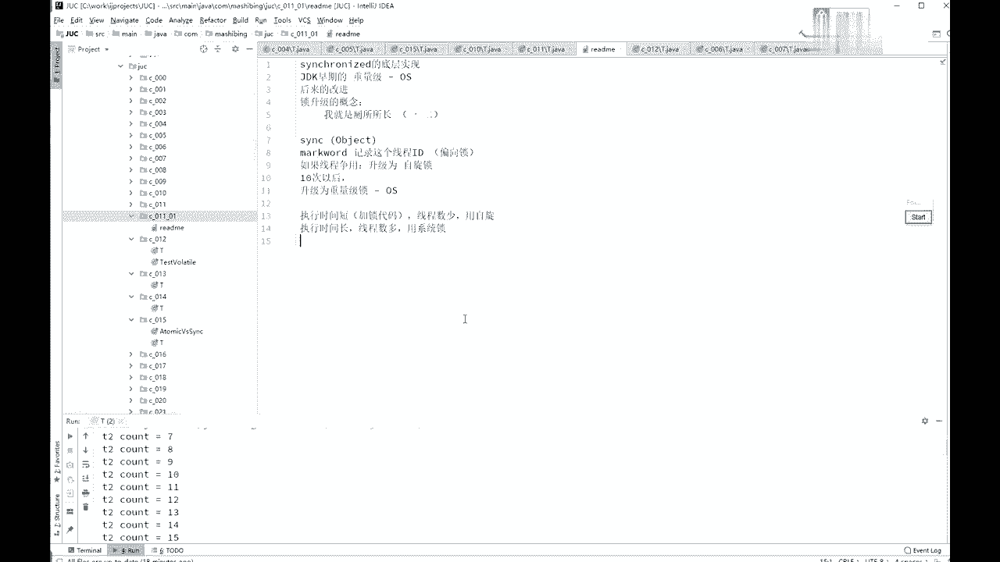
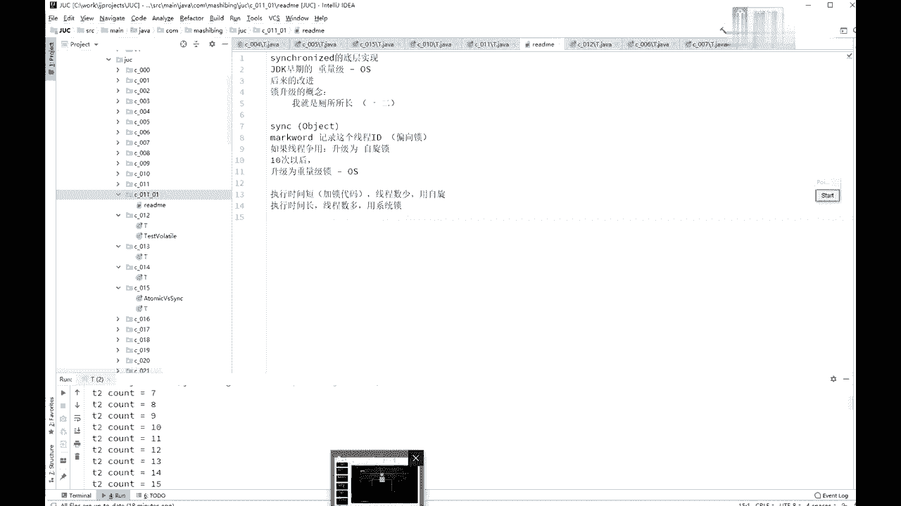

# 系列 3：P23：【多线程与高并发】第一天课后总结 - 马士兵_马小雨 - BV1zh411H79h

好那我们呢稍微回顾一下今天讲的内容好吧。

稍微回顾一下今天讲的内容啊，今天呢实际上就讲了哎，到底什么是现场，现场的概念，启动方式嗯，常用的方法，sleep join，常用方法，嗯然后呢我们讲了线程同步的概念，主要讲的是什么。

synchronized，我们稍微问一下这个synchronized到底什么意思，首先synchronized锁的是谁啊，锁的是一个对象，锁的是对象，不是代码，这是必须要搞清楚的，第二一个呢。

如果你在一个方法上，如果不加任何锁的话，锁的是呃，不加不加任何指令的话，锁的是this，好呃，除了这个之外呢，你可以锁静态的，所静态的锁是什么，锁的是什么什么点，class，是不是所认为嗯。

还有一个呢就是synchronize呢是锁定方法和非锁定方法，可以同时执行，ok，除了这个概念之外啊，就是所升级它本身有所升级的概念，所升级呢是经历了三个过程啊，第一个过程呢是偏向左支线索。

就是那个你来了之后，我就进你个号就行了，开门还是你还是你，那你就进来了，这意思，第二个呢是自旋锁，我先不尝试去找操系统申请那把大锁，先申请这个小锁，先自己悬着在旁边转圈玩，然后呢才是重量级锁。

就是像操作系统申请的重量级锁，然后呢我给大家讲了在什么情况下用自旋锁，什么情况下用重量级锁，ok这是我们今天讲的内容，呃sorry啊，我想起来了，我想给大家讲了一个小问题，就是讲一首我少讲点什么问题呢。

呃锁定就是synchronized，你锁定这个对象的时候啊，这个object不能用什么，不能用string，不能用integer，不能用long这些基础的数据类型，不能用string的概念主要是什么呢。

因为呃不能用string的常量，严格来讲应该是这么说的，你尽量的连那个死神对象都不要用就行了，不能用spring常量，为什么不能用spring常量啊，你分析一下。

如果你super ized的一个比方说是super ized，是这么一个玩意儿，是这个对象，字符串常量，那字符串常量大家都知道那个所有用到这个字符串常量的地方，其实用的都是同一个，对不对，好。

假如你某一个线程锁定了这个字符串常量的话，而且很不幸的是，这是一个类库，一个library，别人用的一个炸包里面，你写的某一段程序，你锁定了这个字符串常量。

然后你的用户的现成的人呢又尝试着去锁这个字符常量，结果就会发生什么呢，用到这个类库的那些的代码诶，不小心给给这个给锁定了，结但是呢当你用到这个类库的时候，又需要锁定这个，你发现你一不小心。

别人写的代码跟你写的代码之间竟然锁定的是同一个对象，中间会产生什么奇怪的现象，我就不知道了，放下也不记得说重录了，你给我哪凉快哪待着去，重物一定是同一个线程啊，sorry你我我我我来我打两回。

打点钱哈哈这个也有可能你跟你用的那个类库的确实是同一个县城，但也有可能不是同一个县城，如果不是同一个县城，很可能就死锁了，如果是同一个选择，很可能重录了，重录了也不一定是想你想要的那个结果。

所以记住这一点就行了，你不要用这个磁针常量也不integer，因为image它内部做了一些特殊处理，你每产生这个integer，只要那个里边那个对象稍微变一下那个值，它就会变成一个新对象，ok所以。

记得这个结论就行了，不要用死真常量，不要用这些基础的数据类型，听懂了吧，所以就别废话。