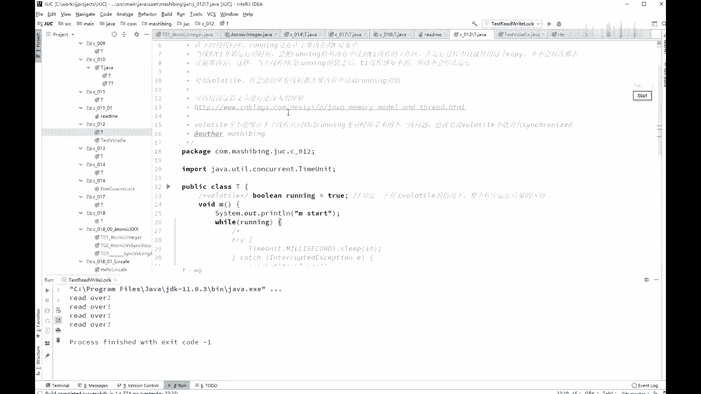
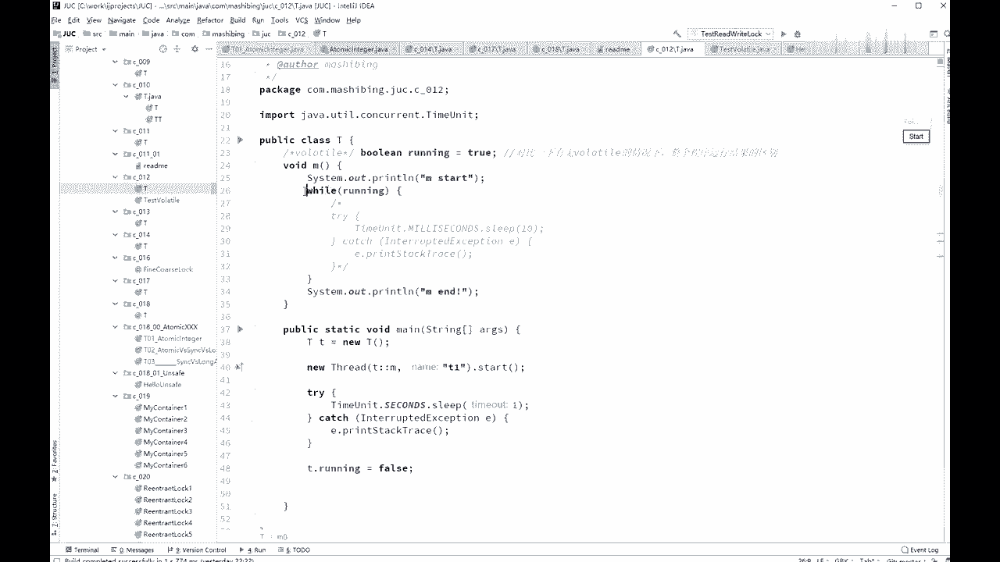
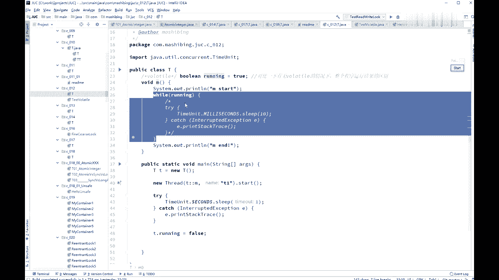
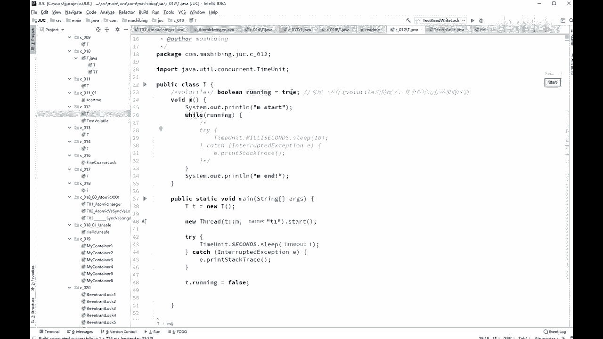
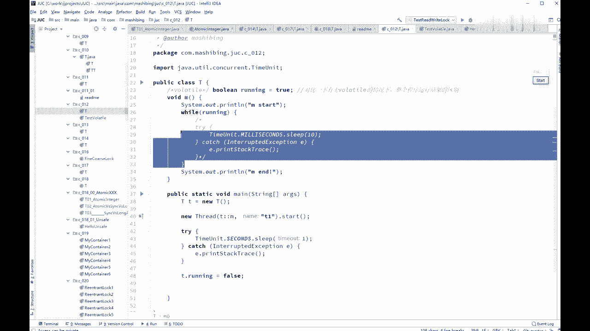
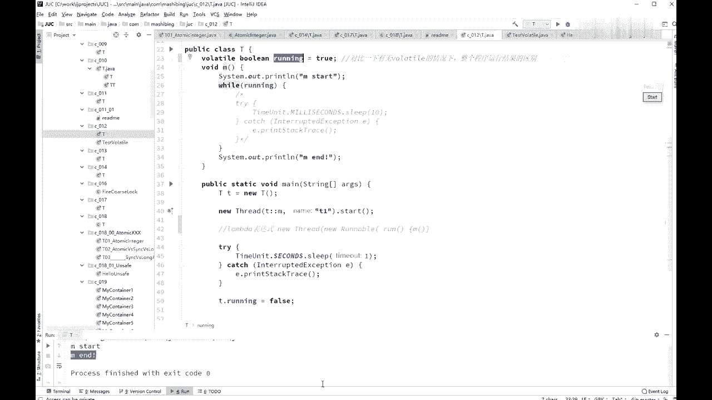

# 花了2万多买的Java架构师课程全套，现在分享给大家，从软件安装到底层源码（马士兵教育MCA架构师VIP教程） - P25：【多线程与高并发】Volatile保证线程可见性 - 马士兵_马小雨 - BV1zh411H79h

demon就行了，形成有一个方法叫set demon，设成true，继续查thread类里面的一个方法，ok我们呃。

下面我们来看这个volatile的概念，volatile到底是什么意思，呃，volatile呢我我们直接来看程序，来看这个小程序啊，volt也是面试，现在现在像那种大的互联网企业的面试。

那么他有时候也不太问了，因为他认为呢你应该会，所以你会不会呢，他他也不问了，但是呢像那个中小企业呢，他也开始问这方面的问题啊，volt那volt到底是什么意思呢，来我们来看一下这个小程序你就知道了。

看这小程序小程序怎么写了，一个方法，先首先定一个变量布尔类型，ring等于true。

说现在这么在正，是不是正在跑的呀，是的。

然后呢，我们呃写了这么一个，这么一个一个一个方法啊，这方法呢是诶上来之后能输出m start，然后while running，while running的意思是说诶如果说正跑着，我就执行我的操作。

这里模拟的是什么呢，模拟的是一个服务器的服务器的操作，大家知道那个不管是什么样的服务器啊，游戏服务器也好，a t p服务器也好，这些服务器呢，一定是说在没有停止的情况下。

他就在那7x24小时不间断的运行，什么时让他停止，你可以点他一下，可以强制强制的杀死他，我们模拟了这么一个操作。

这个操作呢用一个布尔人型的变量来指示。

你要不要继续运行，如果这个值为true，那么你给我不停的尖端的运行，我什么时候把这只false，你就应该停止了，这里呢是一个非常理想的情况，我什么时候把这个值设成false，你就应该给我停止。

所以这时候你应该输出end，ok好，大家看这里啊，我的方法是怎么测的呢，我的我来对应对它进行测试，有了小t我就不说了，new thread起了一个线程，这线程调用了m方法，好，这个写法同学们没有问题吧。

有问题同学给老师扣一，后面林老师在初级里，我给大家讲了咱们的表达式，这是lamba表达式，lamba表达式相当于是我弄了一个thread，因为有同学有问题啊，这是lab的表达式的写法。

相当于呢呃是这么写的，new了一个thread，new了一个rnable，然后在这random里面呢，大家都知道他要重写run方法是吧，在run方法里边直接调用了m就是这个意思，ok，哦sorry。

这是我的问题啊，有问题扣一，你扣的是二哈哈，sorry，我的问题啊，我那我就不多说了啊，然后呢new了一个线程start，我把这个值设成false，那就是理想情况，你把这个值设成false之后。

理想情况这线程应该就停止了，这线程停止的话，他就应该输出m and我们来运行一下，看看是不是它会停止啊，看一眼，你看m42 的啊，你就数吧，两秒钟，三秒钟，四秒钟，你数多少秒，这哥们儿呢就是不停。

但是神奇的事呢，你只要把罗兰特打开，唉，如果这里呢我们修饰这个变量的时候，加了voltavola运行，m4 好，mn，ok大家能理解的意思是，你加了高了调，这这个他就能准确的停止，如果不接他就停不了。

ok这这就是voluntel它起的作用，那volatile到底起了什么作用呢，好volatile本身的含义呢叫做可变的，易变的，容易产生改变的，那意思就是说这个值是可变的，你得使劲儿的跟踪这个值。

什么时候它发生了变化，你要好好跟踪它好，你认真听，大家看这里外头要聊起来呢，它有两个作用，第一条作用呢叫做保证线程可见性，第二条作用叫做禁止指令重排序，大家给我记住了，由于面试常考。

你也啥话也啥也别废话，给我记住就行了，保证线程可见性，禁止指令重排序，不是实时监控，听我说，看这里保证线程可见性指的什么意思呢，指的是这个意思，我讲过很多次呢，这个现成的概念呢。

jvm我们是讲完这个并发之后才讲这位m，所以如果有同学没有听过的话，那我简单给你解释解释一下，大家知道的，java里面是有堆内存的，多内存呢是所有的线程共享里面的，这个内存，这是呢所有线程共享的内存。

除了所有线程共享内存之外呢，实际上呢每个线程都有自己的专属的区域，都有自己的工作内存，如果说在共享内存里面有一个值的话，比如说像刚才我们的running，它等于true啊，或者等于false啊等等。

当我们县城某一个县城，这是我们的主线程，这是我们的t一线程好，这两个线程都要去访问这个值的时候，他们会把这个值copy一份，copy到工作性，自己写成这个工作空间里头，然后对这个值的任何改变。

首先是在自己的空间里进行改变，比如在这里呢我把它变成了false，但是这个force什么时候写回到中，共享内存里头不好控制，我再说一遍，什么时候写回去不好控制，o，所以你刚才看到他什么时候喜欢看。

这玩意儿，真的不好控制，除此之外呢，还有一个呢，就是这个while使用flag的副本，这块的内容，那他什么时候他已经拿到这个副本了呢，他while不断的循环不断检查。

他什么时候再去检查这里面有没有新纸啊，也不好控制，那好如果你对这个变量不加高了调，就是这种情况，他什么时写回来，我不知道什么时候读这个新的，有没有改改过的，这个值我也不知道，那，对不起啊。

我感觉什么时候读是不知道的，什么时候写的话，应该是你改完之后会马上写回来，改完之后会马上写回来啊，这个sorry，这我要查一下啊，应该是改完之后马上写回来，但是什么时候读是不知道，但是不管怎么样。

在这个县城里头它会产生一个现象，就是在这个县城里头，对这个副本进行了更改，并没有及时地反映到另外一个县城里面，ok并没有及时的反映到另外一个县城里面，这个就叫做线程之间呢不可见，县城之间不可见好。

那既然县城之间不可见的话，你这个县城里头改变另外一个线程，就不知道，我刚才是在may线程里头把它设置成false，那么我在提这个县城里头，他什么时候看见这force，他不知道对这个变量值加了mod之后。

就能够保证一个线程之间的改变，另外一个县城马上就能看到，这是博let条，窝头它本身，如果我们说的再细致一点的话啊，听我说我不知道会不会考到这么细啊，其实现在这种这种，这种变态的考试越来越多了。

请大家去查这个词叫如果没记错的话，m e s i呃，这个是它它的本质上是使用了cpu的，一个叫做缓存一致性协议，cpu的缓存一致性协议，缓存一致性协议啊，我刚刚想起来呃，大家去分享，就是多个cpu之间。

它也需要去进行一些个缓存，由于你不同的线程是运行在不同的cpu上，所以这个cpu里面的这个副本，改了另外一个cpu，不一定马上就能看得到，本质上呢它这个它呃这个概念上是一样的。

但是呢你java里面这种线程之间的可见性，实际上要靠cpu的缓存一致性协议，你才能够保证你你你你你能得到这个值，不然你考虑一下它中间写回，读取的这个过程，如果在读取的这个过程之中，又有人改了又怎么办。

