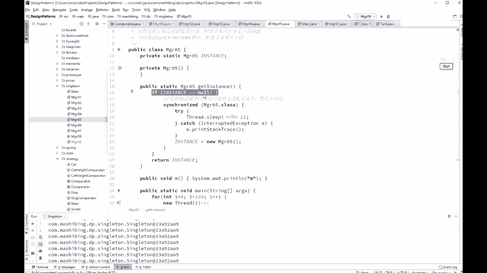

# 系列 3：P26：【多线程与高并发】Volatile禁止指令重排序 - 马士兵_马小雨 - BV1zh411H79h

那么volt还有一个很重要的，它的作用是什么呢，叫做禁止指令重排序，那么禁止指令重排序又是什么概念呢，听我说我们先说指令重排序是个什么概念，指令重排序呢如果往深里挖的话，也跟cpu有关系。

也是跟现代的cpu是有关系的，那么你去考虑一下啊，每次写都会被线程读到，对每次写都会被线程读到，这个指令能白剧呢，如果往细节上抠，它也是和cpu有关系的，cpu呢原来执行一条指令的时候啊。

他是那个就一步一步的顺序的执行，但是现在的cpu为了提高效率，它会把指令呢并发的来执行，这是第一个指令，指令的执行到一半的时候，那么第二个指令就可能已经开始执行了，第三个指令就可以开始执行了。

这叫做流水线式的执行，都是一线，那好在这种新的架构设计架构的这种这种基础之上呢，如果想充分地利用这一点，那么就要求你的编译器compiler要求你的编译器把你的源码编译完了，这个指令之后呢。

可能进行指令的一个重新排序，重新排顺序，原来是a等于三，b等于四，你代码里是这么写的，但是由于这两个如不如果说他们两个之间啊，后面又把b的值赋给五了啊，那么编译器呢可以对它进行一个一个重新的排序。

有可能把b等于三排，b等于四排前面啊，马上后面b等于五，跟上后面写a等于三，这件事情很正常，这是一个逻辑上的概念，那么细节上呢就是那个汇编语言上的它的一个重排序，这water还有一个作用呢。

就叫做禁止指令的重新排序，那么禁止指令重新排序，他会起什么样的作用呢，我通常给大家举例子举的是这个例子叫做double check lock，这个例子呢也是非常深入的一个内容啊。

好下面我来聊这个指令重排序的问题，指定龙排序其实经常举的就是这个例子，而且这个例子呢原来是一个面试题啊，甚至其实在这个业界里头也曾经出现过很长时间的争论，就是说我到底应不应该加volt。

那么这到底是什么意思呢，我来一步一步讲给大家听，好，我们来聊呢，到底什么是单利，单利的意思呢，就是这个意思，我保证你在jvm的内存里头永远只有某一个类的一个实例，其实这个也很容易理解。

在我们工程之中呢有一些类啊，他真的没有必要用好多个对象，你你比如说什么样的类型权限管理者，权限管理者，那哥们儿就是专门管权限的哪个操作呢，我都进行一个权限，我真的没有必要用好多个，一个就可以嗯。

守大门的对吧，一个就够了，这时候呢叫做单机上的这种单例模式，单列模式呢最简单的写法是这种写法，这种写法呢叫饿汉式，饿汉式的写法是说看这里我有这么一个类，定义了这个类的一个对象。

然后这个对象呢是在这个类内部的同时呢，我把这个类的构造方法设成什么，说成private的意思就是说你别说你没法new我，你不要去虐我，你不要去给我new manager 01，只有我自己能用。

所以我自己就new了一个扔在这儿，既然别人new不了，只有我自己能扭，我扭完了之后扔在这，那么理论上来说，我就只有这一个实例了，那什么怎么样才能访问我这个实力啊，通过一个方法叫get instance。

我就拿到这个实例给它返回，是返回去，所以无论你就要用多少次的get instance，本质上它只有这一个对象好，这是一个小程序，非常的简单，我解释的比较快，没问题，同学给老师扣一啊，有问题直接提。

但是这种写法呢非常的简洁，也很容易理解，而且呢由jvm来保证永远只有这一个实力，为什么这vm能保证这个很简单，一个class no到内存之后，这个static是由jvm来帮我们做初始化的。

由jvm来帮我们做初始观，那那个只有初始化完了之后，你才能使用，这个jvm就直接给你保证，肯定就只有这个实力了，那好，但是有的人呢他会吹毛求疵，他会说我还没开始用这个对象呢。

然后我没没用这个对象调这个方法是吧，你干嘛把它给初始化了，你能不能够说什么时候我开始用的时候，有时候get instance，什么时候调这方法的时候，你再给我做初始化。

所以呢这个是另外一种磁带和上一种一样的鞋，反正不说了啊好，所以呢就会产生这种懒汉式，懒汉式的意思是说我get instance，什么时候我一开始调用这个get instance的时候。

我才可以对它进行初始化，当然你这个初始化的话，你尽量不要初始化两次，你应该只能初始化一次才对，不然就成了俩对象了吗，所以上来之后，你先判断instance等于空的话，我才初始化，那你可以想象一下。

如果有人访问啊，发现他是空吗，我就初始化了，那么后面一个人再来的时候，发现他是空吗，已经不是空了，那就把这个instance给返回回去，不过更加吹毛求疵的事情就来了，说我不单单的要求你。

我用的时候才初始化，我还要求你线程安全，那这里就要就要问大家了，同学们这种写法是会使线程安全的吗，能不能支持线程的安全性，不会这个肯定不会吗，你第一个线程判断他是空，第二个线程同时也判断他是空。

第一个县城溜了一下，第二个线程又扭了一下。

这所以你多个线程开始访问的时候。

那他一定会出问题，这个我不运行了，只要他一定会出问题，你自己去实验，所以他会怎么做呢，我们要加一个synchronize来解决，这是肯定的对吧，我们加把锁嘛。

所以我加这个叫做pis that a synchronized to get incense，这句话一旦加上肯定没问题了，那所以这句话一旦加上肯定就没有问题了。

因为这里面从头到尾的就只有一个线程运行。

那第一个第一个线程发现他那个空给它扭了，第二个线程他无论怎么访问，这个值已经永远都不可能为空了，所以它只能是拿原来第一个线程初始化的这个部分，这是没问题的，但是有的人又开始持白求疵。

说你对simple一下，加在方法上。

你锁定这个代码，这个代码去啊，实在太长了，说不定里边还有其他业务逻辑。

咱们说对于枷锁这件事情来说，叫做代码，能能能锁得少的，就要尽量地锁得少，这个后面我还会提这个问题，所以呢有的人就开始进一步的吹毛求疵，它会变成新的写法，这个写法是什么呢，上来之后您先判断就先别加锁。

你先判断判断它为空。

这叫做锁，细化也是锁的一个优化的一部。

不过很不幸的是，这种写法是不对的，为什么这种写法不对，我们来分析一下，第一个线程判断它为空，然后还没有进行下面的执行的过程，第二个线程也来了，也判断它为空。

那那么第一个线程呢就开始synchronized sirng，上来之后对它进行初始化，初始化完了之后把锁释放了，但是这个时候第二个县城记住，第二个县城也已经执行完这句话了，他还仍然是为空的。

那会儿海第二天能拿拿到这把锁，又初始化了一遍，这种写法是有问题的，所以就会产生了好今天我们要讲的volatile这个问题，这个问题呢是是是是是这样来产生的啊，这样这样来问的，我们把这条给住着。

ok看这里，这叫做双重双重检查锁或者叫双重检查的单位是怎么写的，是这么写的，他说if ec等空，synchronized synchroni，完了之后再判断一遍，这叫做双重检查，它是不是等于空。

如果在这种情况下，刚才说的那种现成的问题就不会再有了，来分析一下，第一个线程来了，说ak你确实是空值，然后呢它进行下面的初始化过程，假设第一个线程把这个instance已经初始化了。

好第二个线程检查第一线程检查一等空的时候，第二个线程也检查它为空，所以第二第二个县城在这句话之后停住了，暂停暂停之后呢，第一个线程已经把它触发完了，释放锁，第二个线程继续往下运行，继续往下运行的时候。

他会尝试拿这把锁，他能拿到这把锁吗，可以第一线程已经释放了，对不对，他释放完之后，拿到这把锁之后，注意它还会进行一次检查，由于第一个线程已经把伊森初始化了，所以他这个线程已经通过了。

所以他不会再重新录一遍，因此这个双重检查这件事儿是能够保证线程安全的，讲到这里，有没有同学有疑问的，没问题，给老师扣一，我马上讲，wallet特，他说那外面的判断没必要啊，外面判断可以省很多很多的。

你不用加锁，外面这个判断不用枷锁，你理解吗，不加锁的话，上来不用加锁，你的效率就会高啊，刚才我们肯定不是哪位同学提的这个问题，我再说一遍，你想你县城，如果你如果你没有外面这个，你上来之后呢。

你直接就开始申请锁，这个效率当然就会低锁竞争吗，但是呢如果你上来之后先检查你是不用申请锁的，你先检查一下，多数的情况下，这个值已经不为空了，肯定有个现成本已经把他初始化了，如果他已经不为空了。

那你就直接拿就行了，跟跟锁就没有任何关系了，呃听懂这意思了吧，所以外面这个还是有必要的，好现在的问题是，你看啊，我用了双重检查之后，我起了100个线程。

这100个线程每一个都调用一个get instance，打印它的hash code，为了县城之间的互相之间会干扰。

所以我还中间让他睡了一个毫秒，跑一下，那么结果你会发现呢。

我告诉你，就这个程序无论你运行多少遍啊，你就算在高并发的情况下运行，拿100台机器同时访问这一台机器上的这个binance，然后那个每个机器上跑跑个1万个线程，使劲跑。

ok使劲儿使劲儿地跑，这个程序最后运行出来的结果一般也是正确的，我，周总说没有，外面一开始方法上不就一样了吗，不是这是两回事，我我经常省略了这其中的一些业务逻辑的处理，在这种地方很可能有一些业务逻辑。

能理解吧，我省略了这些了啊，所以还是不一样的，你家cnet加在方法上的话，没有这个必要吗，嗯，好那我跟我同学会说，那到底要不要加volatile，好，这是一道面试题，这道面试题他会直接这么问。

你听说过单例模式嘛，你肯定得说听说过，你要说没听说过单利，你还聊个肾，那那单立模式里头有一种叫双重检查的，你了不了解好，你这时候要说不了解，咱就咱就挂了，就别聊了，你说了解，ok那了解的话，问你一句。

这个单例要不要加volatile，通过我们的实验来看，你哪怕就是进行压力测试，压个111百万遍，它依然不会出问题，你拿到的依然是同一个对象，但是要不要加高了跳呢，答案呢是要价。

这个以前由于这个实验你很难做出来，就是让他出错的情况，所以以前很多人就不加这波罗跳，但是他也不会出问题，那么加了不加mod条，问题会出在哪呢，就会出现在指令重排序上，好认真听这个模型的特别的复杂。

你认真听我们说，第一个县城，第一个线程需要你了解这句话就是instance等于new manager，那么new manager经过了我们的，j vm虚拟机的编译编啊，所以这个编译器编译完之后呢。

它这个指令呢其实是分成三部，你有一个对象的时候分成三步，这个指令分成三步，第一步呢是给这个对象申请内存，第二步是给这个对象的成员变量初始化，第三步是把这块内存的内容赋值给这个instance。

所以它是123，好我再说一遍，申请内存，申请完内存之后呢，这个值啊是一个默认值，还是给大家在拼t上画一下。

先说new对象的这个过程就能给大家画一下，没有对象的这个过程，运动泵这个过程呢分成三步，第一步呢是申请这块内存，假如它里边有个值的话，呃i这个值它会给这个i它会a这个值吧。

a这个值他会给这个值呢-1个初始值默认值，这个默认值如果它是类型的，它是一个零，k是一个零，然后呢进行第二步，第二步呢是把这里面成员变量这个值呢设成真真正正的那个初始值，比如我们给a a负的初始值是八。

那么再把这个a变成八嗯，然后呢是第三步，第三步是什么呢，是把这个变量啊，这时候它的值已经是八了，是把这个变量呢啊真真正正的赋值给我们那个instance。

大家知道那个instance是在那个呃站内村里是吧，让他呢a指向这个变量的地址，理解这个过程啊，第一步申请内存，第二步改值，第三步呢把这个值赋值给他，但是如果说认真听，如果说这里面有指令重排序。

会发生什么呢，会发生a等于零之后还没有对d0 初始化之后好，我们就已经把这个instant的值赋值给他了，也就是说把第三步和第二步给换了个位置，这个a等于零的时候，我们这个instance里面就有值了。

就已经指向这个这个这块内存了，反正这块内存的地址是不会变的，我刚才讲的这个内容，有没有同学有问题的，你给老师提出来，没问题，给老师扣一，也就是说什么呢，这一个对象在半初始化初始化到一半的时候。

就已经赋值给这个变量了，那如果复制给这个变量之后，你仔细分析一下第一个线程synchronized的，虽然说它加了锁了，synchronized加了锁了，new了一半，a的值变成零，第二个县城来了。

第二县城，你刚才咱们刚才也读点代码了，第二个线程来了之后，他上来先判断这个instance是不是等于空，可是大家注意，由于它已经初始化一半，而且这个instance里面有值了，它已经不再是空值了。

同学们，所以它不再是空值了，就相当于第二个线程已经拿到这个对象可以直接使用，既然拿这个对象可以直接使用了，我很可能会使用里边这个值，这个很正常，但是呢我本来期望这个值应该是个八，可是很不幸的是呢。

这个值是个零，假如在一种超高超高并发的状态，这种情况是有可能产生的，超高超高并发的状态，阿里京东秒杀的时候是有可能产生的，如果你秒杀的时候，这里记得是一个库存的值，原来或者订单的值吧，订单的纸。

原来这个订单下到1万了，1万个订单了，你本来这个值再来一次的时候应该是10001，但是很不幸的是，中间你得到了一个零的状态，结果这个订单值变成一了，好不知道我说清楚这个问题没有。

所以在这种状态上你就会出问题，redemption，你说的这个你的这个疑问呢跟搬初始化没有任何鸟关系，没出隐患，会完全释放锁，这跟释放锁不释放锁没有任何关系，我说的是这个instance的值已经有了。

既然有这个值了，那么你在另外一个县城里头上来先去检查，你会发现这个纸已经有了，你根本就不会进入锁那部分的代码，听懂这意思了吧，那好那么java volatile会怎么样呢。

java volt指令重排序就不允许存在了，对这个对象上的指令重排序不允许存在，所以在这个时候一定是保证你初始化完了之后才会复制给你这个变量，这是莫罗特的含义，两个含义我就讲完了。

看看有没有同学对这块有疑问的，它有两个含义，第一保证线程可见性，底层的实现cpu的缓存一致性协议，第二个含义禁止指令重排序，单立的时候超高级情况你才可能会出现，但是平常我们写成绩是测不出来的。

我是没办法测出来的，如果你要是愿意的话，你可以测一下试试啊，其实是可以测啊，我跟你说，其实是可以测，只不过程序写起来比较麻烦，怎么测呢，大家知道那个a s m呢是直接。

就是a s m是可以直接操纵二进制码的，你只要在二进制码呃，这三条指令之间啊，就是说申请内存初始化赋值这三条指令之间，你你你插入一些代码睡觉就能测出来，到这个太费劲了，我就懒错了，我错嗯好的。

我们看看同学们还有什么有什么问题，当然有的同学可能很难理解，说那个中间居然是三条指令，你你怎么证明是三条指令啊，我给你看看，证明一下好吧，我随便写一个小程序，我比较简单的小程序啊，没有。

rest test，没办法，什么都不行，就直接写new object，选，order的o等于new object，嗯跑一下，跑掉之后，这是我后面讲虚拟机的时候，一个小工具。

这种容易被观察人类方法生成的那些个，二进制码它的扣的它的汇编指令是怎么生成的，你看这个汇编指令，这汇编指令呢它是没有这个对象的时候，有这么一条指令，第一个是new new就是申请内存，先把那钻石拧上。

dedication是复制的，就不说了，你完了之后的第二条指令duation，这个是下面就是指定要用的，你不用去不用去管它，第二这个一条指令内容念完了之后，申请完内存，申请完内存之后。

invoke special，invoke special，你看他掉的是什么呢，要的是object initial方法，调的是object的构造方法，所以他先用用完了之后调构造方法进行初始化。

初始化完了之后，a store才会真真正正的把这个值赋值给这个对象，所以你仔细如果看的话，这还不是一条指令的，这是四条指令。

