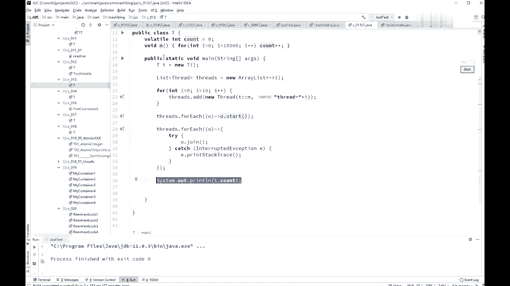

# 花了2万多买的Java架构师课程全套，现在分享给大家，从软件安装到底层源码（马士兵教育MCA架构师VIP教程） - P27：【多线程与高并发】Volatile不能保证原子性 - 马士兵_马小雨 - BV1zh411H79h

ok好了，同学们继续上课啊，看这里，那么word跳呢刚才我们说了，它能够保证线程可见性，也能够保证也能够禁止指令重排序，呃，网上呢它并不能够保证原子性，lol是不能够替代synchronized的。

这个千万要注意，那么什么意思呢，我们来看这个小程序一下，因为比较好玩，model in account等于零，接下来有一个方法，m m呢循环了1万次，让cos加加，那么cot值就会变成9999啊。

好看这里又变成1万啊，6t呃，我做了一个线程，作为一个list list里面全是线程，然后起了十个线程，i等于零，i小于是i9 。

然后thread。at这个县城里面调用了m方法，十个线程，每个线程都m方法共加了10万次对吧，把所有的线程都启动，等所有线程结束，最后输出这个值嗯，同学们考虑一下，由于我加了窝了桥了。

每个线程在访问这个值的事呢，一定是能读到最新的值。

当来能不能告诉我最后这个值是多少，有没有什么问题。

会不会是10万，我要不加volt。

大家想肯定有问题吗，你先说不加volt。

不加菠萝头78000，好家乐珈乐我的特，加了没得挑，你想一下诶，这个时候是我的新的值，一旦改变啊，我的另外一个线程是马上能看见的。

另外线程马上能看见他就应该拿新的值啊，拿新的值来加了对吧，他正常应该是10万的，86000，再跑一遍，65000，再跑进93000，反正总而言之是到不了10万的，原因是什么呢，分析一下，原因其实很简单。

虽然说你看到加加这一块呢，你是保证这个cos值改了之后啊，能够被别的县城和看见，但是看光看点没用嗯，现在这个count值是零，第一个线程确实他是一，他加了一下变成一了，他把这一写回去了。

然后第二个线程也读到这个一了，第三个线程也读到这个一了，所以第二个线程拿到的还是以，第三个线程拿到的还是以能理解吧。

所以第二个性能加完是二，第三个性能加完也是二，两个血回来到最后还是二，不就少加了一次吗，所以归根结底是说，这count count这个值是保证可见性，但是count加加本身，它并不是原子性的一个操作。

那有同学会说老师count加加，这不是一句话吗。

他为什么不是原子性，刚才你看到了，你没有object还是一句话吗，在java的内部会分成好多条指令来执行count。

加加，也是这个我在后面讲虚拟机的时候，才会讲到这个指令的问题啊。

com加加呢本身它会分成好几条指令，至少三条，所以中间被打断的可能性也非常大。

保证线程的可见性，但是它并不能够是替代synchronized，保证不了原子性。