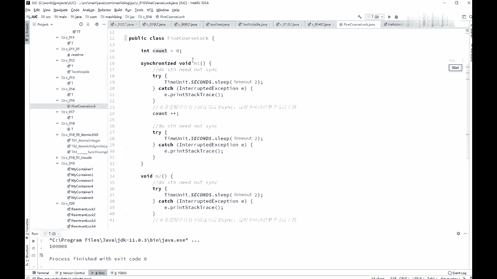
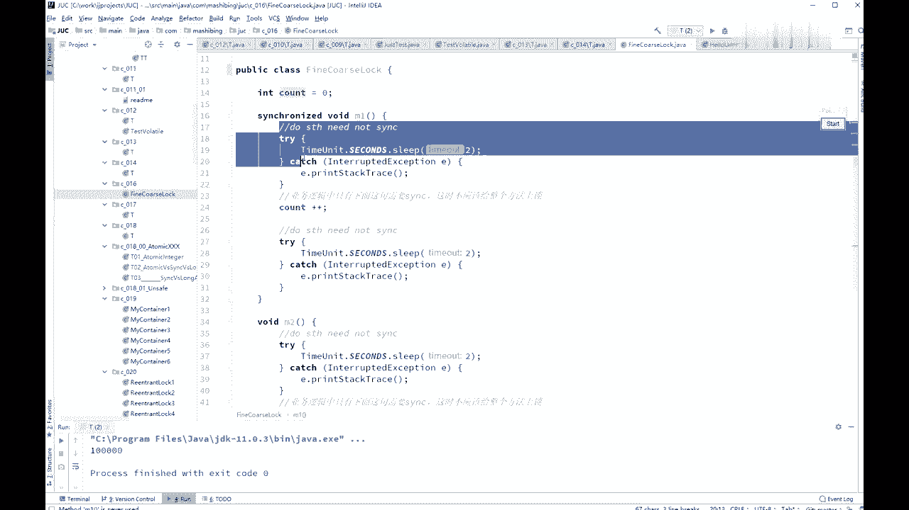
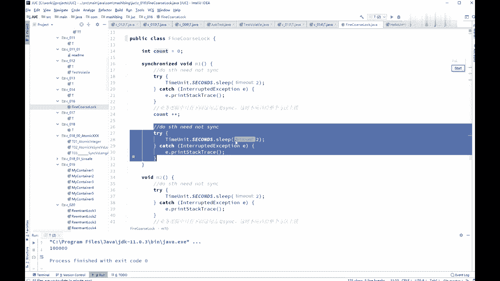
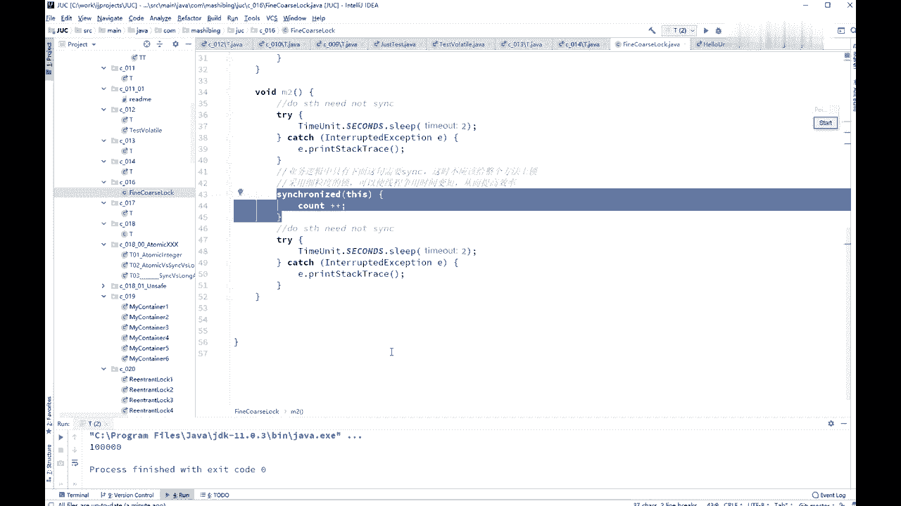
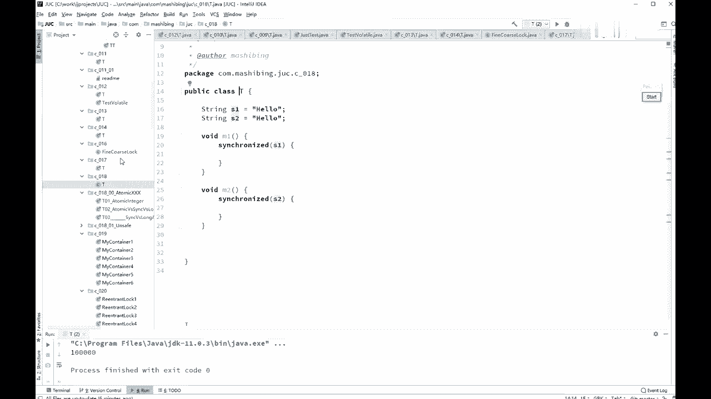

# 花了2万多买的Java架构师课程全套，现在分享给大家，从软件安装到底层源码（马士兵教育MCA架构师VIP教程） - P28：【多线程与高并发】synchronized优化 - 马士兵_马小雨 - BV1zh411H79h

我这就是就是线程这块内容就特别好玩，你如果按照逻辑来讲的话呢，它是这么一个顺序，1234567是吧，七七的内容，但是你如果按照优化来讲呢，它这些优化的内容呢，可能分布在不同的里面的。

不同的这个这个步骤之上，所以优化呢我我讲到某一个问题的时候，讲到优化我们就谈一次，讲到优化我们谈一次好吧，这优化呢所优化这个问题呢，其中有一个叫把锁力度加变细啊，还有一个叫做索力度变粗，且说到一回事。

什么意思呢，作为cle单子来说，你这个锁呢要，这种不是很很剧烈的前提之下，你这个锁能力度最好是要稍微小一些，好我这个小程序呢叫fine cofine是细化的，course，是粗糙的，这个意思啊。

fine cause look，什么意思，看这里呃。

如果说我们这个m方法啊，他假如说前面有一个有有一堆业务逻辑。

后面有一堆业务逻辑，这业务逻辑呢我用sleep来模拟了它。

然后中间是你需要解锁的代码，那么这个时候你不应该把这个锁，加在整个方法上，而应该加在哪呢，只加在count加加上，听懂我能理解的意思吧。

这非常简单，这叫做呢锁的细化，那有的时候会不会进行所得粗化呀，有有有有有没有明白，你们能想象一种情形，让你对进行所优化的时候不是细化，而是让它变大变粗，有这种可能性吗，能想象吗，考虑一下。

争议特别频繁的时候没错，假如你这个锁，由于你锁的力度能越编越细啊，特别特别越变越细诶，好别别运气好多好多小的系数啊，就跑跑到你这个上面，这个这个这个这个方法，某或者说某一段业务逻辑好好，特别细碎的锁。

那你还不如干脆给他弄成一张大锁，他的征用反而就没那么频繁了，嗯也会容易容易死锁，是你写程序的问题，你程序写得好也不会发生死锁，我说的优化呢是是说你程序没问题，但是你可以有进一步的更好的写法，这个叫优化。

这个时候呢你可以某些情况是可以进行锁，粗化的，把锁加大，这是没问题的，数据库的一张表，你在某一行所有的行程都加锁，大哥我跟你说，你的效率就会累死，随便的读写某一行上都加锁，那你不如把整张表都加不。

加拉锁得了，嗯这个所粗化所细化的问题呢，是一个概念上的东西，它并没有一定之规，理解这个概念就可以了，好关于这个小问题，我们过了没问题吧，有问题给老师扣一，sorry，有问题了，扣二没问题。

扣一我们以后没问题，永远扣一啊，那好下面又是一个小概念，很简单很直接就能理解，所以我速度会比较快，你认真听，锁定某个对象o如果o的属性发生改变，不影响所的使用，但是o变成一个对象，一定会产生产生问题。

什么意思，object o等于new object，如果我们把它当做synchronized o，但是你在某一种特定的不小心的条件下，你把o变成了别的对象了，大哥，这个时候现成的并发就会出问题。

这事太简单了，因为我们刚才说过，这个对锁呢是在对象上头上的两位，来代表的，你这个县城本来大家伙都去访问这两位了，结果突然之间，您老人家把这把锁根变成了一个别的对象，去访问别对象那两位了。

这俩之间还有活人，基本在现场没有任何鸟关系，因此你如果用对象做锁的时候怎么写，同学们来告诉我怎么写，不让他发生改变，所以你会看到别人的那些大牛的人，写的程序，它非常非常的规范和细化。

这个final他是少不了的啊，很简单啊，没问题吧，有问题没问题，扣一啊，继续string这个类型嗯，我我已经讲过了。

