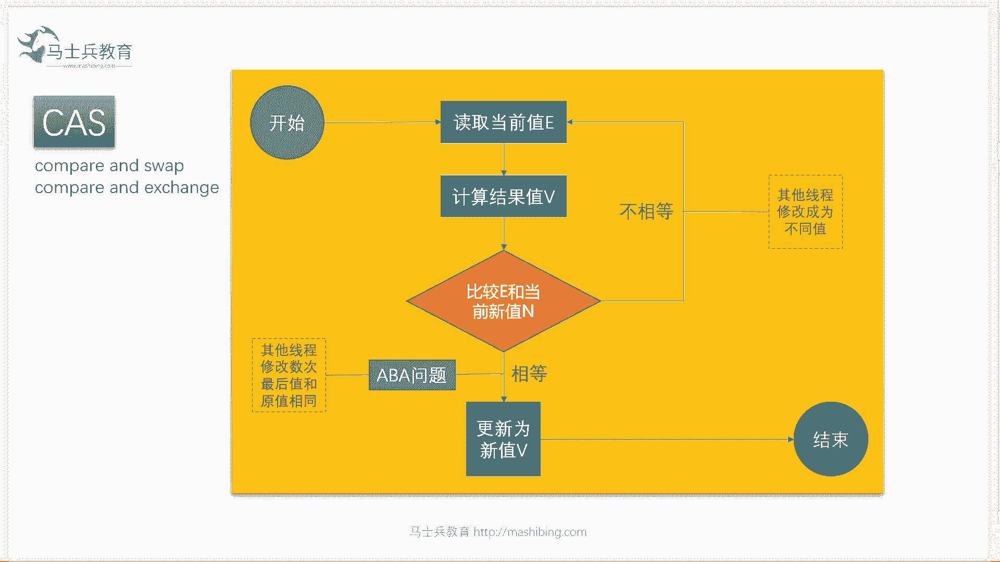

# 花了2万多买的Java架构师课程全套，现在分享给大家，从软件安装到底层源码（马士兵教育MCA架构师VIP教程） - P2：【多线程】什么是CAS？（基本概念） - 马士兵_马小雨 - BV1zh411H79h

ok那么今天讲什么呢，我们今天讲这个synchronized，主要是讲synchronized volatile，今天讲不到位，今天讲的内容是超级难，如果就算你以前听过啊，你今天再听估计也会感觉比较难。

依然比较难好吧，所以不知道synchronize是什么东西的，你可以撤了，wallet tel，今天讲不到位，我们先不讲。

好关于synchronize这块呢，我估计今天今天晚上三个小时能给你讲清就不错，schronize这块各种大厂问的问题特别特别特别多，所以就这块的话呢，你要掌握住的话。

基本上能够压中大多数大厂的其中的一道题吧。

好吧呃，为什么大厂喜欢问这些用不到的东西呢，我觉得大肠有他自己的考虑，第一个呢是骗自己能显自己牛哈哈，有的面试官是有这样的想法，我觉得这种就非常的幼稚呃，第二种呢就是想看看你对待技术的态度。

看你在技术方向的潜力，你对待技术这块呢，你有没有这种深挖的这种态度，技术潜力，这方面有没有朝底层方向发展的潜力啊，还有一种呢，其实本质上最最根本的其实就竞争太激烈了，筛不出来，选一厨师大会都会切菜。

刀工都不错，那咋办，我怎么选啊，a也a也行，b也行，我得调一个更牛的呀，我就问点儿平时用不着的，比如说胡萝卜，它到底营养营养素方面是在哪方面好，谁答出来谁来，所以呢ok就就就就就变成这样了。

好多好多特别其实平时用不着的东西，他都开始问啊，比如说锁升级，你说你用得着吗，基本也用不着，你说它的效率怎么样，其实也很简单，你你写几个程序呃，做一下压测不就行了吗，没有必要看它的原理，但是没办法。

他就问这是今天我们要讲的内容，好，今天我们讲什么，就讲一个词，就是synchronized啊，俗称就是辛苦辛辛辛辛苦了的啊，辛苦了的啊，sychronized，今天我尝试着会讲得更加的稍微细致一些啊。

呃大家先听我说啊，如果说想了解synchronize的话呢，首先要补几个基础，你认真听基础，第一个基础呢叫c a s。

什么叫cs，我们先说这件事，cs要不了解，我跟你讲c空战的基础，你肯定听不懂，我们先聊什么叫cs，cs全称是叫做compare and swap，或者叫compare and set。

或者叫compare and exchange，那这句话的意思就是比较并交换，比较并设置等等，呃举个例子，我们举例子说明内存里头有这么一块内存，这里面有个值是零，我现在多线程去访问这个值。

每个线程都想把这个数给它加上个一，平时呢我们知道如果想做到现成的数据一致，这时候你得对它对它进行加锁，加synchronized，但是这uc的包出现之后增加了一种新的方式，这种方式叫cas操作。

所谓的cs操作是什么意思呢，好是这么来做的，我的第一个线程把这个零拿过来，在自己的县城本地区域里头做计算，知道了哦，原来加一之后，这个值会变成一，然后呢再把这个一给写回去好了，这是一个线程执行的过程。

那么如果我想做到不加锁，就能够实现数据一致性，我再说一遍，不加锁就能实现数据一致性，原来我们不是得加锁吗，加锁的意思就是我在我加一的这个过程之中，任何其他线程不能访问这个值，呃不不不叫不能访问。

就是在我枷锁的这个给加一的这个过程，只有一个线程能能能执行这个操作，但是现在我不想加速，不加速能不能完成，可以用什么方式呢，用cs cs方式怎么做呢，把这个零拿出来，放到自己形成内部加成一。

把这个一写回去的过程之中，要进行比较比较，拿什么比较呢，比较的意思就是说看看这个值是不是依然为零，大家还记得吗，我把它读出来的时候，他这个值是零，然后我给他加上个一，如果我会写的时候，他依然还是零。

那说明什么，说明这哥们儿中间没有被人打断过，比如说啊在我拿出来把零变成一这个过程之中，有另外一个线程又拿了这个零，自己回到这个一，又给他写回来了，这时候它的值已经变成一了，那这种情况会发生什么呢。

我第一个线程就会说哦，我拿出来是零，你现在已经是一了，说明有人动过你了，有人动过你了，我就不能够把这个值把新的一给你写回去，我怎么办呢，我重新再来一遍，你现在不是一吗，我把一拿出来改成二。

再把这二写回去，写回去的过程中，我再比较比较什么呢，比较我拿这个一写回去的过程中，你依然是不是还为一啊，如果你依然唯一说明没有人变过，那在这个过程中，如果又有人把你变成二了或者变成五了。

那这时候怎么办呢，那我就重新再来把这个五拿出来，改成六，把六写回去的过程之中，看看你是不是依然为五，那如果依然为伍的话，说明没有人动过，我就把这个六写回去，这样我就不需要上锁了，如果中间有人动过。

我就不断循环不断循环不断循环，直到我这个加一操作成功为止，ok这个东西叫做c a s叫compare and swap，专业一点读取当前这个值计算结果比较当前新的这个值。

就是你原来内存那块的值和我原来读出来那个值是不一样的，那如果一样，说明没有人变过，没有人变过的话，我就把你更新成新值，ok就结束了，如果说有人变过，我就重新再来读你最新的值，再计算结果再来，好了好了。

这个cs大概的意思来get到同学老师扣个一，这里面会有一些细节莫及，那这里面呢会有一些什么问题呢，首先我们说cs的话，它中间有一个著名的a b a问题，面试的时候经常会被问到什么叫aba问题。

依然是这个值，这个值是五，我拿出来之后把它改成七，我想把这个七写回去的时候，看他依然是不是我，但是在我拿出来做计算，往回写这个中间过程有可能有一个人把这个五拿去，把它改成三了。

有另外一个线程又把这个三拿拿出来，又改回成五了，你的女朋友跟你分手之后经历了别的男人，明白吗，哎等你回来的时候发现啊，他依然是你那个女朋友，但是他中间已经经历别的男人了，好在这种情况下。

这个叫a aba问题，原来是a中间曾经改成过b，后来又又换回成a了好了，这个就是有可能会产生a b a问题，那么a b a问题怎么解决呀，这个办法呢其实很容易解决呃，加个版本号就可以了，什么意思呢。

比如说任何一次改变都给它版本号加一，原来是版本号一点，改过一次就变成二点，再改一次变成三点啊，等你你一点的时候离开你女朋友回来的时候，发现你女朋友上面写着99点啊，你就会知道经历了多少次。

ok然后你采取什么样的措施来处理，这个是你自己的事情啊，当然是原谅他了好了，所以这就是aba问题怎么解决，就是加版本号呃，这个版本号呢还有两种，第一种呢是数值型的，第二种是布尔类型的。

这个我就不详细讲了，总而言之cs是有这种问题的，好吧，那个不能叫绿了，人家又没有跟你在一起的时候是吧，那个不能叫绿了啊，有些概念必须得澄清，那讲到现在为止。

关于这个cs的基本概念。