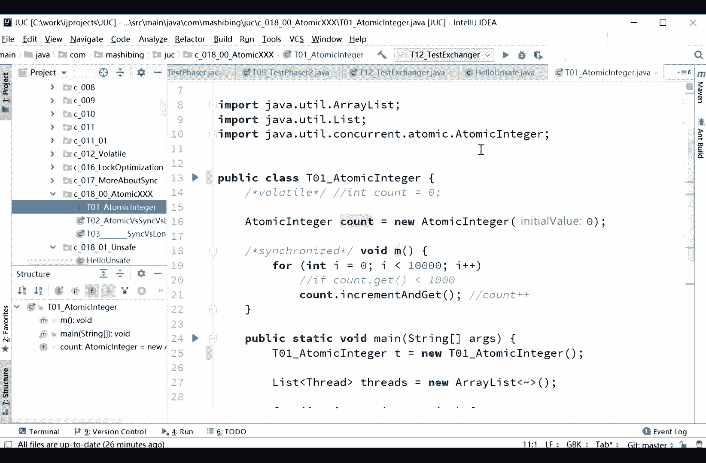
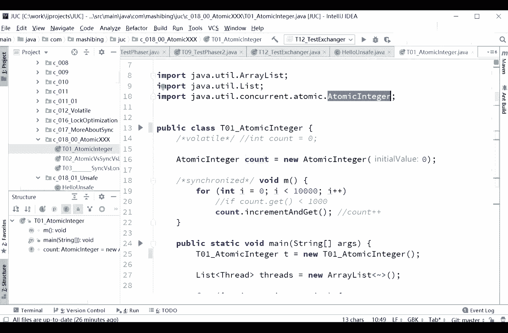
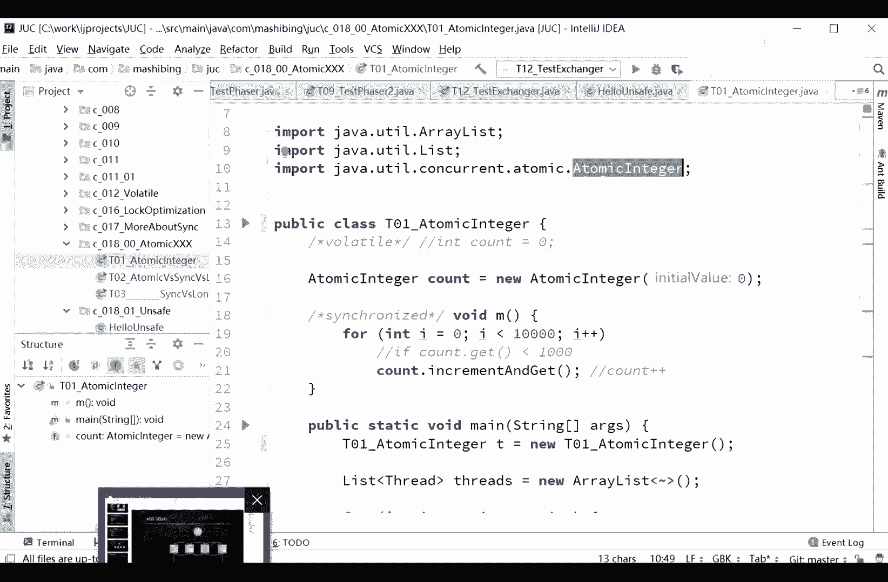

# 花了2万多买的Java架构师课程全套，现在分享给大家，从软件安装到底层源码（马士兵教育MCA架构师VIP教程） - P33：【多线程与高并发】第三天课前复习 - 马士兵_马小雨 - BV1zh411H79h

我们稍微回顾一下，上节课呢我们讲到了这个atomic engineer。

the tra叫原子性的，原子性的，它里边做的任何的操作呢，都是用c a s来实现对吧，这个原来讲过这个问题了，就是讲过cs来实现cs呢其实就是三个值，哎你要改的那个值，然后你期望这个值。

以及你要改成的那个值啊，如果说我们稍微复习一下，因为我发现有小伙伴原来可能是没听过。

这个c这个概念呢，还是非常的重要，而且考的特别多，所以稍微给大家把这个cs复习一下啊，我目前的这个大小是多少啊，有屏幕分辨率比较高啊，就是先先这个大小吧，呃，我们稍微复习一下cs这个概念啊。

cs其实还是不难，就是乐观锁的概念，compare and set compare and swam，就是一个乐观锁的概念，它一般来说呢，一个cs的操作呢会有这么几个值，其实严格来讲呢就两个指。

因为cs的操作基本上就两个值，当然有的会写三个值啊，你要改的那个对象，这个就无所谓了，你肯定要改的有一个expected，就是你希望那个纸，还有呢你要改成的那个纸。

update update a bit value和expected value，expected叫期望值，小时全成中文，大家看得清楚，阿贝呢叫更新更新值或者叫新纸呃，你你可以这个叫旧址老职，旧的纸。

新的职也可以，我们用一个，m加加吧，那个m加加来举例子，比如说呢最开始的是m等于零，然后m加加呃，需要注意的是呢，如果说我们不同步的话，那么这个呢会产生多线程访问的时候呢，会产生问题，这一点呢比较简单。

不多说，那么我们可以采用无锁的操作，无锁的就是s操作，cs操作呢想把零给加个一的话，可以这样来多久，cs我希望你原来的值是零，然后呢我给它改成一，然后它里边的一个操作是怎么操作的呢，就是说。

类似于这样的一个操作，我这是伪代码啊，一个不停的死循环，就说如果，当前m值等于零等于你期望这个值，如果当前m里等于期望那个值，说明什么呢，说明很简单，说明没有人进来改过吗，没有线程进来改过这个值。

对不对，既然没有建成改革，那我现在呢就可以把这个值设成一，m等于一好，这是cs的概念，原来我讲cs的时候还说过，说这个cs呢，假如说你在m等零和判断m等于零，会把m变成e之间，如果有线程进来。

也会把m给改掉，可是呢现在的cpu呢是在原理层面上，是支持这种ci操作的，其实cpu呢就是这块内存的内容，它可以呢，前前后加个屏障，不让别人懂，唉直接原子性的更改这块内存的内容好吧。

所以这里呢就是cs的概念，其实就是乐观锁，跟乐观锁的概念是一模一样的，我就乐观的期望啊，就是在我改的这个过程之中，没有线程改过，所以我就直接改，那有人改过怎么办呢，我就跟着循环等着，等什么时候。

你比如说他下个值已经变成一了，那我这个cs就变成一二，如果需要就变成二了，就变成二三等等，这是cs一个操作叫无锁的操作，所谓的无所呢其实就是一个乐观锁啊，好那关于cs，尤其是咱们第一次过来听听课的同学。

有没有什么问题啊，有问题你提没有问题，你给老师扣一好吧，没问题，我就继续了啊，这个是期望值，怎么决定这个期望值呢，就是你读一下，上面先读一下rem，我读一下，这值这样来写，is expected。

等于m这个值，你从你m这个值里面读出了一个值，然后你在cs更改的时候呢，你只要把这个c a s这个期望值，扔到这个值，如果在你读出来和你的在你读出来啊，和这个呃你你cs中间如果有人改过的话。

那你就重新读，你在cs里面重新读。