# 花了2万多买的Java架构师课程全套，现在分享给大家，从软件安装到底层源码（马士兵教育MCA架构师VIP教程） - P35：【多线程与高并发】ReentrantLock - 马士兵_马小雨 - BV1zh411H79h

今天呢我们来讲这个经常用的基于c s操作的这种比较新的一些锁，新类型的锁，所谓新类型就是和呃怎么老的这么说，老老类型所的就是synchronized对吧，新闻台总经讲完了。

我们来讲基于c s操作的一些新类型的锁，我们先来讲这些所得用法，然后再来讲呢这些锁的原理好吧，嗯ok我们可以继续了，哎你给老师扣一好吧，测试很重要，对没错，这么跟你说，你实际写程序摸了条基本用不着。

摸了条就是用来干面试了，你在写程序的时候基本用不着va强听懂了吧，就是用来面试用的，在中国我们来看第一种算是比较新的东西，这个词呢叫做reaction rog，可重入选，其实有可重入锁本身的这个概念呢。

super nt的本身就是可重入锁的一种，哎，来看这里啊，什么叫可重入，可重入的意思是说我锁了一下之后呢，我还可以再锁对同样这边锁再锁一下，打开我的好评软件，右翻左右变成这个很好。

本身我们synchronize一个东西的时候，我们是锁定的这个对象，所谓锁定的对象就是在对象头里面呢，其实我用了两位来代表这个对象给我加锁了，那如果说我锁了一下之后呢，这个县城又毁了锁。

用神行这把锁发送呢这县城一申请的时候发现哦，当前持有这把锁的就是我自己这个先生，那好可以，你就继续执行你的代码就可以了，这叫可重入好可重入的呃，那必须是可重入的，不然的话你你你子类实现调用父类的。

你是没法实现的，来我们来看这个小程序啊，这个小程序是这样写的，siri的m一就是m一方法，然后m一方法里面睡了一个是唉，爱循环睡了睡了啊，做了一个循环是吧，领导时的一个循环。

second睡一秒十秒之后呢，打这个一呢可以想象一下那个0123456789，非常简单，接下来呢调这个m2 m2 呢是也是一个cnt的方法，那么来个主程序，主程序怎么写呢。

new thread me 1 start，就这么简单，两个线程就起来了，分析一下这个执行的过程，这个执行过程呢第一个线程在执行的时候，执行完，第二个线程就会起来，那假如说我们说这个锁要是不可重入的。

会是什么情况，会是第一个线程呢，我们申请这把锁锁的这个对象，然后，这里如果说我们是第二个线程来进行申请的话啊，这是因为这是别的县城能跑一下行了，那么你们想一下这个第二线程会start吗。

他start不了，必须得等什么呢，得等第一个线程结束了，因为这两个呢是不同的见证，所以你会看到呢，01234567891直m2 最后才能才能输出，但是你m2 得不到那把锁，所以没法执行。

所以在这种情况下，两个线程之间肯定是有征用的，但是如果说是在同一个线程啊，这个我是没有写出来是吧，就在这儿给大家做一个实验就行了，嗯如果是同一个线程的意思就能其实就是你在那个m一里面调m2 ，看啊。

a等于零，a小，于是i加加打印爱好艺术，呃如果等于0=2的时候，我们掉下来嘛，来同学们讲一下这个m2 能执行吗，m2 也要申请锁对吧，因为m2 也是synchronized，看到了吧，m一呢持有这把锁。

m2 也要申请这把锁，所以相当于在同一个县城里头都要进行son，那这样可以不可以呢，这样是没问题的啊，不起第二个线程，是，那你看到等于二的时候，m2 就被调用了。

说明snront方法是可以调schronize方法，也就是锁呢是可以重录的，好关于刚才的这个小概念，有没有同学有疑问的，有没有，所必须的可重入，尤其是secret如果不可重入的话，你自己想一下。

如果父类某一个方法是synchronized，那子类的话，调这个方法它没法掉了，没法重写了是吧，你重写的时候需要调父类的时候，你不也是新出台的调性空战机的吗，锁的是不同对象就不可重入了，那当然了。

你所不同对象当然就谈不上重录这个概念了，那不叫重录，那叫心路呀，大哥，slim free，同一把锁吗，如果是sample this，那就是同一把锁，这是simple net的方法吗。

不就是simple net this吗，同一个this当然是同一把锁，嗯，所以不能去小区，呃如果我们用这个logo呢，其实和原来的这个log reaction log啊，可重入锁，这是新型的一把锁。

他和synchronized的，它是可以替代synchronized，我再说一下，他是可以替synchronized的t型用来割，怎么t呢，原来写simnet的地方直接写lock点，look。

相当于加锁，解完锁之后，需要注意的是呢，一定要记得lock unlock解锁，我们siri是自动解锁的，只要这个siri的后面这个大括号执行完了好，这个锁呢就自动结束了，那么关于这个lock呢。

这不这不行，lock呢必须得手动解锁，手动解锁一定要写在try finally里面，要保证最后一定要解锁，不然的话你给上了锁之后。

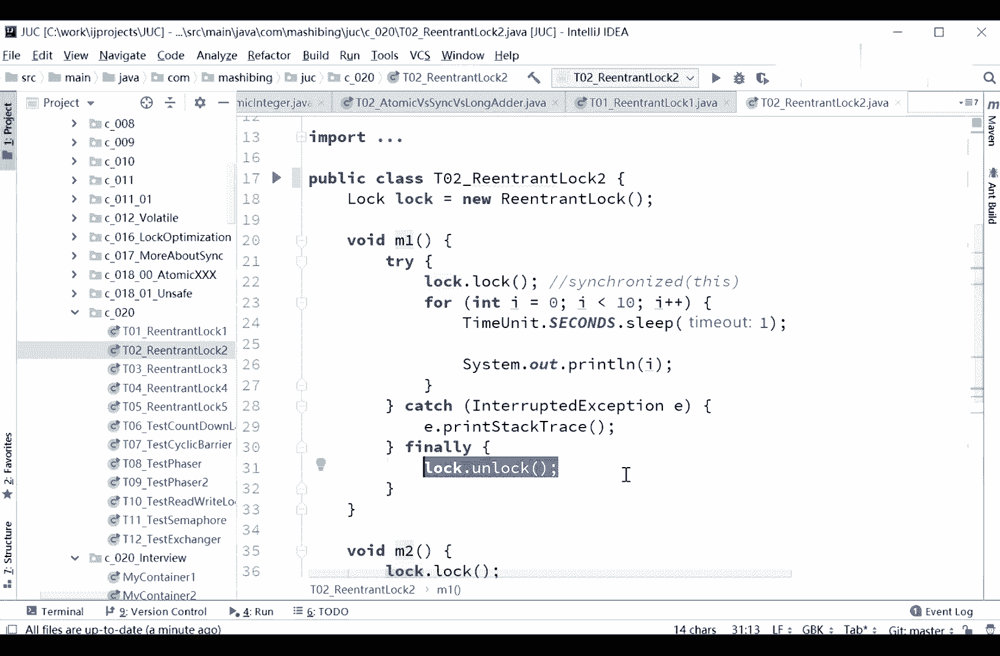

你要是中间执行的过程中有问题了，死在那儿了，那别人永远也拿不到这把锁，所以一定是要写try lock finally，unlock。

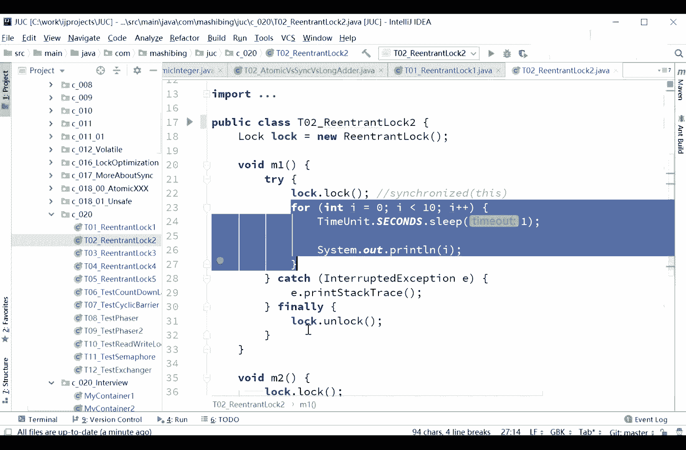

同样的m2 的方法呢，我们也不需要写synchront door，我们怎么写，就lock。log log log就可以了，当然我们直列我再说一下，应该写try finally。

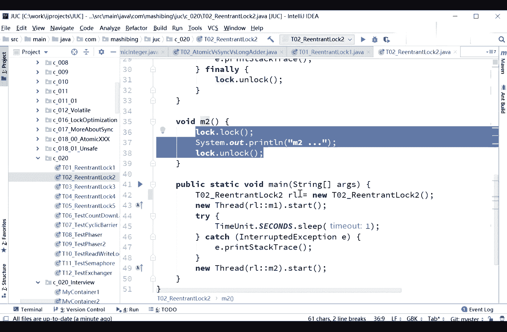

sorry，有时候讲理论的时候呢，把代码写的太复杂了，不容易讲清楚，倒不是别的概念，比不是别的意思，lock unlock啊，好当然这种情形呢其实和synchront是一样的。

它肯定是必须得等这把锁释放完了之后，然后呃thread呢就第二个threat才可以执行，这个说了比较简单，原来这个log呢，那有同学可能会说这个呃ranch logo既然和sonnet差不多的话。

那要它有什么用呢，reaction log有些功能还是要比sonnet强大的，强调在什么地方呢，你看这里第一个呢你可以使用trilog尝试锁定siri，如果说锁锁不了，上来之后进找那把锁。

如果锁搞不定的话，他肯定就阻塞了weight了，但是我们如果用reaction log，你自己可以决定你到底要不要weight好，可以用try log trilog，你可以尝试申请五秒钟之内。

我要求得到一把锁，如果说得不到的话，如果说得到了，就让他输出log，如果说得不到的话，我就我就我我就不干了，我说我啥事都不干了，就这意思，所以说你五秒钟你要是把你的程序执行完，那我可能就能得到这把锁。

如果得不到的话就不行，就这意思。

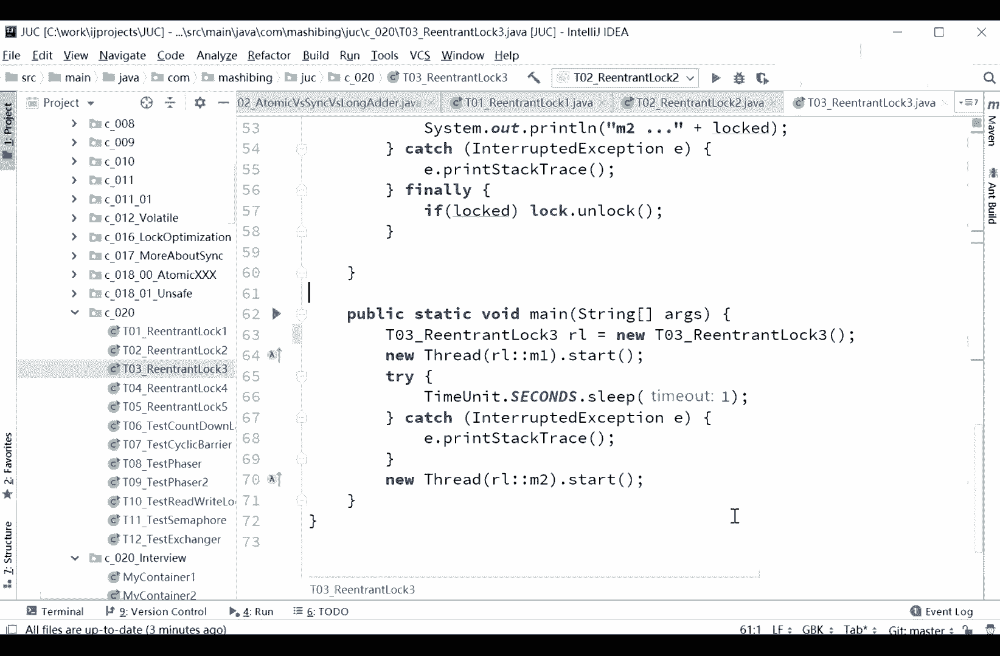

他们来演示下这小程序啊，现在呢由于我的第一个线程呢。

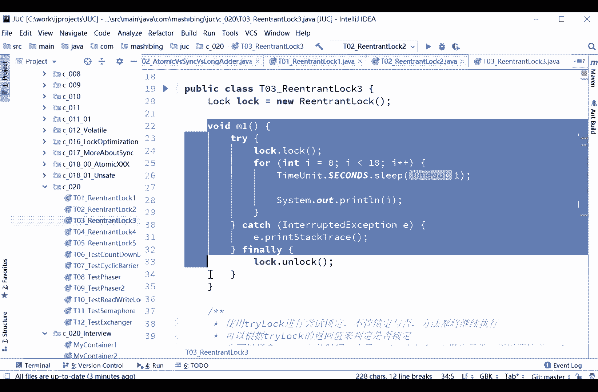

他跑了是十秒钟了是吧，所以你说你在第二个线程里头申请五秒五秒申请，你肯定是拿不着的，来实验一下，这是reaction log呢，比synchronized的好用一些的地方，你可以使用trl。

你可以自己尝试，你看m2 false m falls指的是什么，没拿着它锁了五秒，没拿着吗，没拿着，这是bollocked啊，lock等于try lock，如果说拿到了。

那么这个locked那一定是变成true了，他现在肯定是没有拿着，五秒钟没拿着，那怎么给他演示一下，能让他拿着呢，其实很简单，我让他循环三次就行了是吧，跑一下，三四这边完了，那m2 肯定就拿到了。

五秒钟之内，保证你拿着他不是说一定得等五秒，是五秒钟之内，保证你能你你拿着就拿，拿不了，就就就就你自己自己做出处理，所以simple来都是做不到这一点的。

所以这是reenterlock with simalized，牛的地方，当然不止这一个地方，我们继续看啊，siri除了这方面比较牛之外呢，还有一些其他方面啊，这个reentry log。

react to log呢，还可以用什么呢，用这种方式叫look interruptily logan，interrupted logan，interruply的意思是说我在logo的时候呢可以响应。

被别人打断了，你不要打断我的话，我是可以做出响应的，但你还记不记得sronized synchronize，一旦wait了之后，你必须得让别人notify，你才能够醒来，不然的话你是醒不过来的。

就是你可以被打断的枷锁，如果是这种方式来加锁的话呢，我们可以调用一个interrupt就可以打断这个线程二的等待啊，这个意思好。

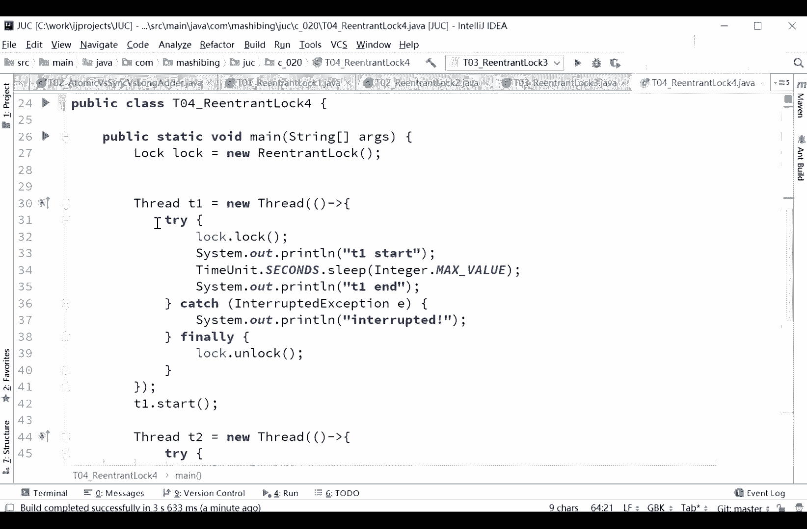

线程一怎么做的，线程一是这样做的，线程一呢干了一件事上来之后加锁。

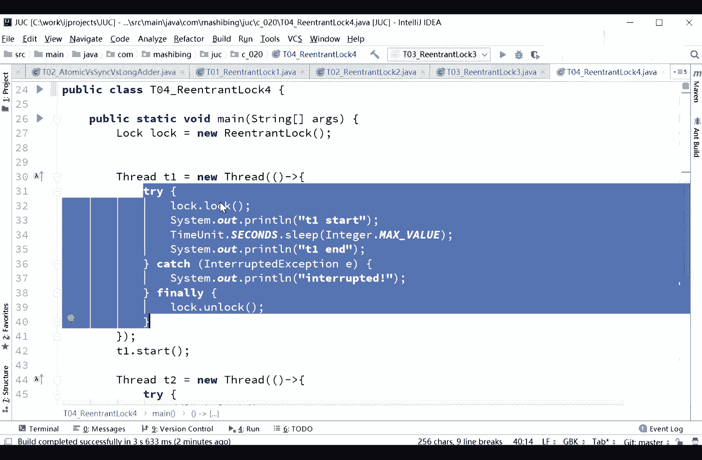

加锁了之后呢，他开始睡睡多长时间呢，integer max value，那就睡起来，没完了没完没了，没完没了，一定是睡，那建成二呢，县城二呢他这时候申请，如果说被县城一已经拿到这把锁的话。

那县城二想拿到这把锁基本不太可能了，他拿不到这把锁的情况下，他会怎么办呢，他就会在那等着，但是呢如果我们使用的是原来的这种look，你是打断不了他的线上是停不了的。

我们还可以用另外一种方式叫locking roduly，可以被打断的好，这时候你要想停止线程二，你就可以用interrupt，一旦他被interrupt之后，那么它就可以做出响应了，继续往下执行了。

就所以你会看出tr started tr and catch到exception之后呢。

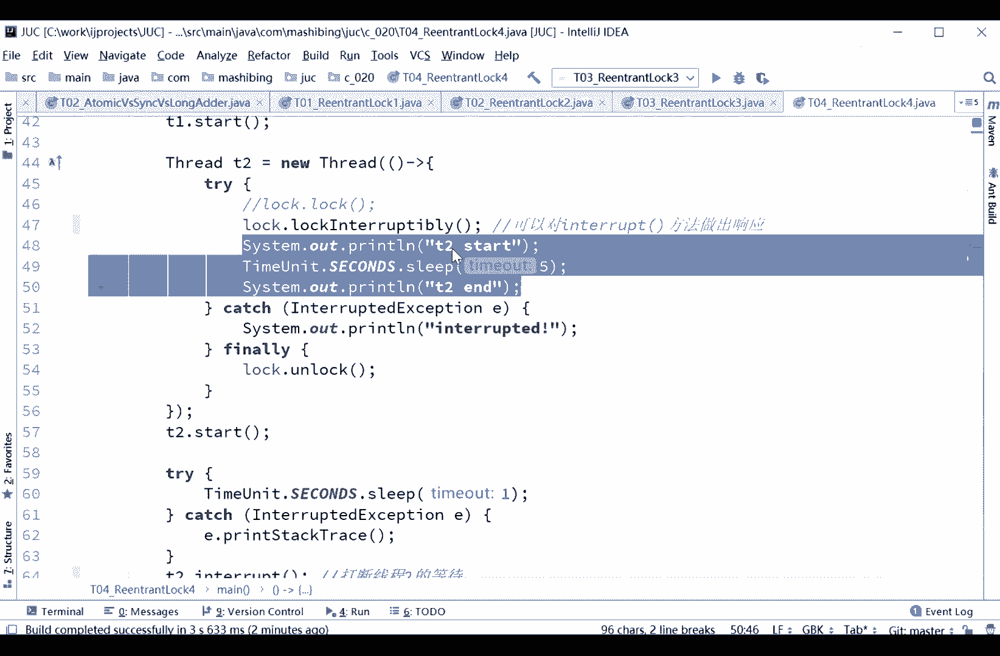

interrupted跑一下试试，啊t1 that，你会看到那个。

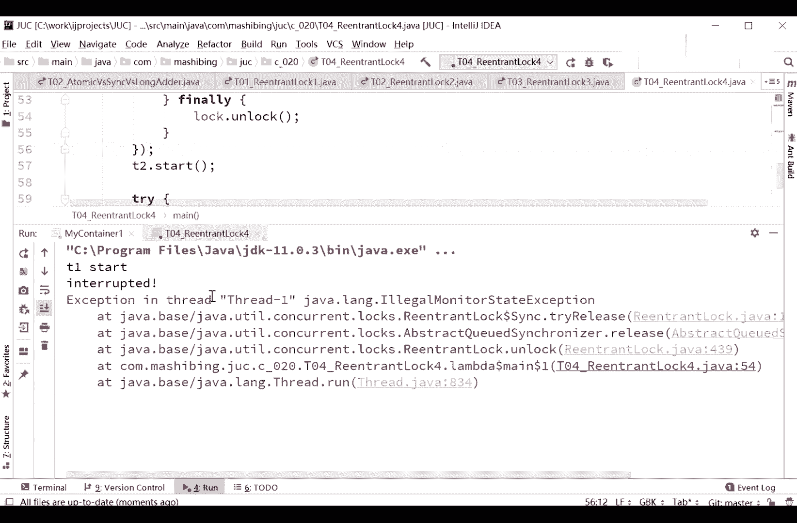

这时候呢我们就catch到了。

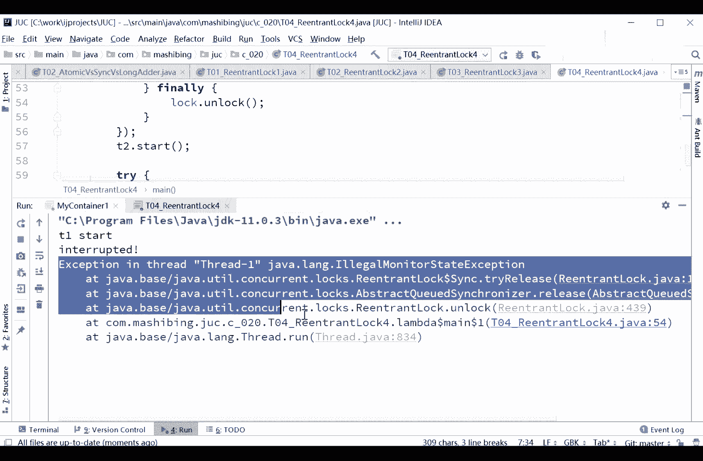

interrupted exception，illegal monitor，data，lock unlock是说，没有锁定不住啊，这个得需要做一个更好的一个判断。

not interrupt the world，最后我们要解锁，这里稍微有点小问题啊，就一会儿再说啊，所以呢在那个lock里面，你还可以调用这种方式，locking roberly。

这也是他比siri好用一些的地方，维加索到了一场对我们一会再来聊这个判断的时候，他这个lock interrupt的返回值是一个void，所以在什么地方做判断是个小问题。

对我来说啊好这是reaction，not呢。

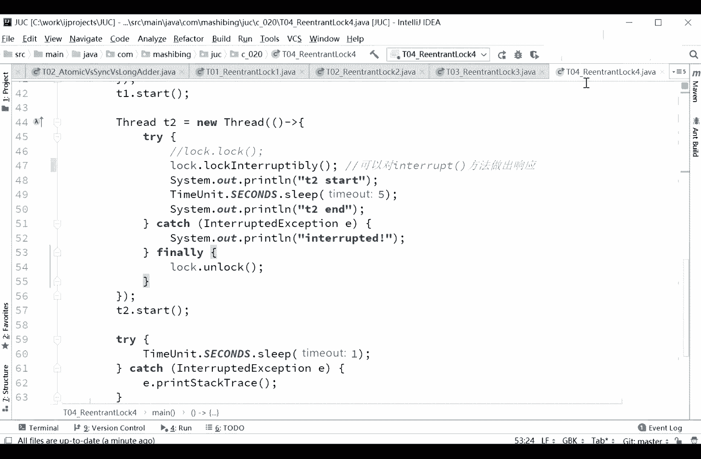

比sronized的，牛的一个地方继续看啊，留一个看，看完之后呢，先对h logo有一个了解。

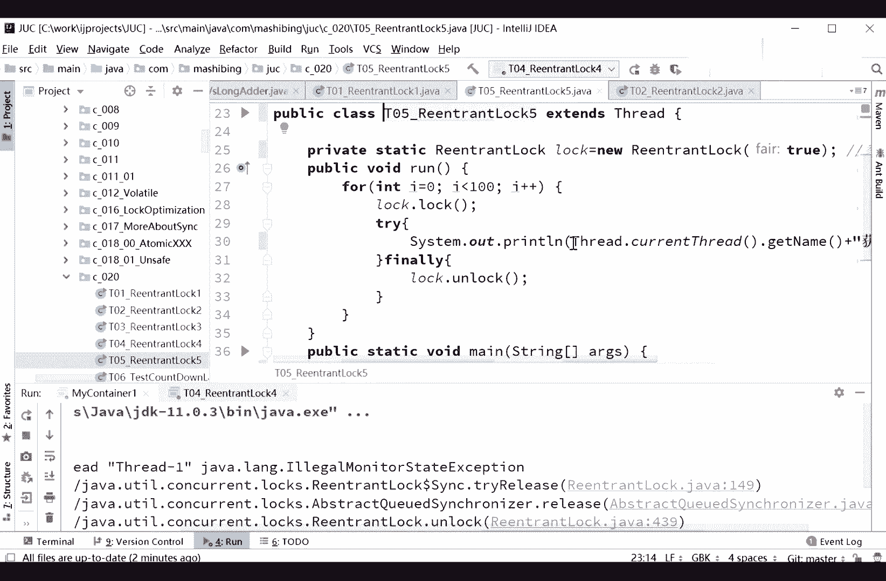

那么如果这波还可以指定为一个公平锁，公屏锁的意思是当我们另一个reaction log，你可以传递参数为true处呢，而不是说谁后来了之后马上来执行这卫星所这么简单啊。

所以这是一个新的有可能会被考到的人，认真听你看啊，这是那把锁在这个县城等着就好多好多县城都在等这把锁，实际上这些线程呢是位于一个队列里，这是没问题的吧，唉1234等等，听我说。

当又有一个新的县城来的时候，它呢会不会检查队列里面有没有内容，是公平锁的关键，如果说这个锁不公平，这个线程上来就抢，他是有可能抢到的，如果说这个锁是一个公平锁。

好这个县城上来会先检查队列里有没有原来等着的，如果有的话，他就先进队列，等着等别人先运行，这是公平锁的概念，不知道说清楚没有，有没有同学有疑问的，你看他说出了他一定是，有一些嗯，默认是非重点。

是不是有一句logo啊，默认是非公平的死，当它为true的时候，rock。lock，lock on lock，总共100，这是输出的问题，这应该不是那个什么的问题，过流血thread current。

thread t1 t2 t2 t一就显示的图像是很公平的样子啊，嗯，那么如果说你是非公平的，它是有可能二话不说，直接一个线程全执行完了是吧，另外一个线程才能拿到，如果是公平锁的话，这实验确实不好做啊。

再说，如果是宫廷锁的话呢，你会看到它有一些交替的输出呃，一般来说呢他会中间有交替的情况，那有的同学可能会说，那老师他为什么不是挨着牌的交替，就是一完了之后马上按，完了之后马上三呢，其实呢是这样的啊。

注意这个公平锁呢它也并不是说就能保证的嗯，嗯没有线程执行完了，另外一个线程的必须必须得是另外一个线程执行，如果是那样的话，你必须得用那个线程之间的通信才可以，这个我们后面讲面试题的时候，再来讲这个问题。

给大家画一下这个图，非常有可能是什么情形呢，有一个线程拿到这把锁，然后呢你看啊他落后完了之后呢，打印完了之后呢，unlock对吧，好unlock完了之后呢，接下来另外其他的县城还没有进队列呢。

他自己又进了队列了，他下一个循环又进了队列了，所以下一个循环拿出来了，还是这个先生，所以一次他往外输出的时候还是还是t1 t1 ，完了还是t1 t完了还是t啊，但是至少呢它会有一些间接性的输出。

就提完了t2 t2 t1 ，如果我们用非公平的锁啊，你会看到大片的全是t1 t完了之后才是t2 ，听听雨落说，lock lock放for循环外面放for循环外面。

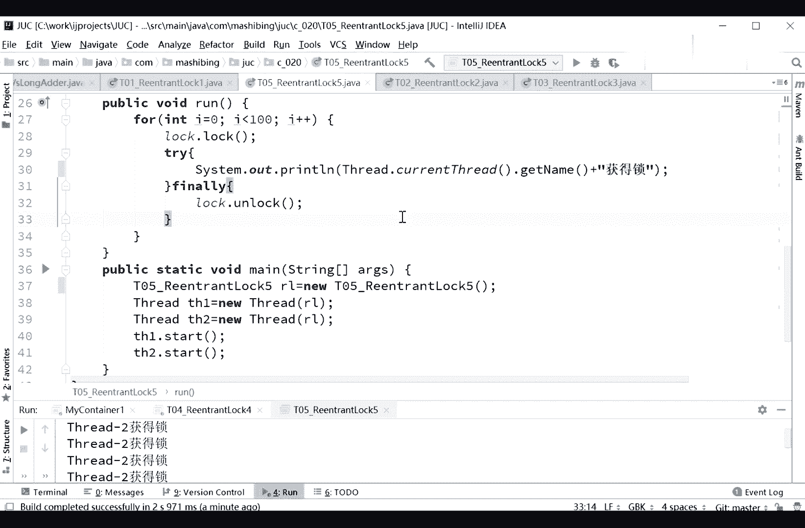

你t一不就马上执行完了吗，你想t一拿完锁之后，马上t一就结束了，那一定是t2 了，这个不用想。

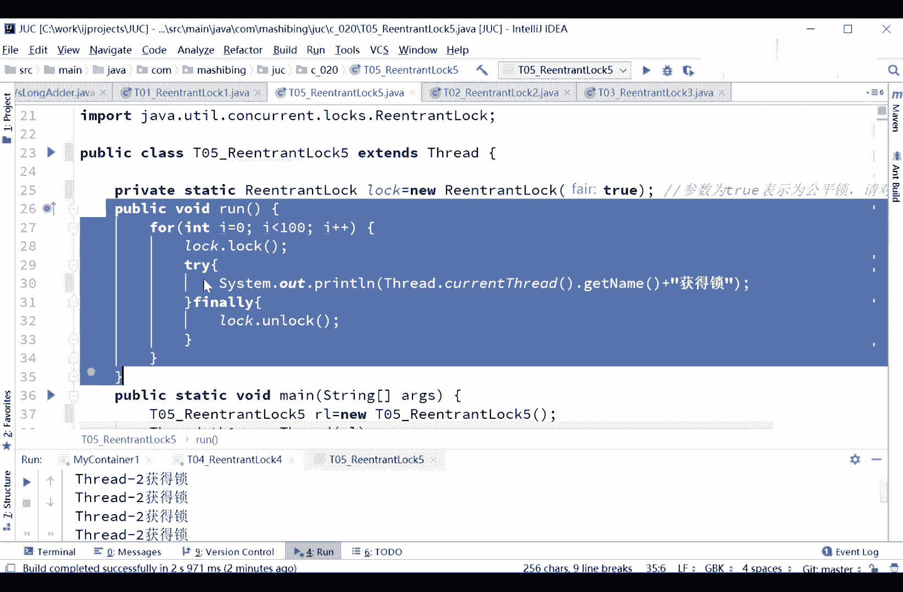

所以你理解这个不清楚的概念就行，公平锁的概念我再说一下，并不是说那种完全的公平，说我执行完了之后就得是你不是公平锁的概念，是由于我们是在一个等待队列里，公平锁是后进来的。

这哥们需要检查一下队列里有没有人，队列里有您先来，队列里又没有，我就来了，非公平事，我才不管你呢，我抢了算我的，谁抢了算谁的。

听懂这意思了吧啊，reenter note和synchronized之间的一个对比，这个对比是什么呢，纹身work可以替代synchronized，这是没问题的，他也是可以重录，也是干嘛的。

也是没锁定的，这是肯定没问题的，本身的底层是cs，对srt的本身是一个所升级的概念，那么它呢可以指定，可以有travel自己来控制我锁不上怎么办，他还可以有，呃look interrupt。

好中间你还可以被打断，非公平的切换对吧，好归公平和非公平的一个切换，而sychronized就只有非公平锁，它没有公平和。

