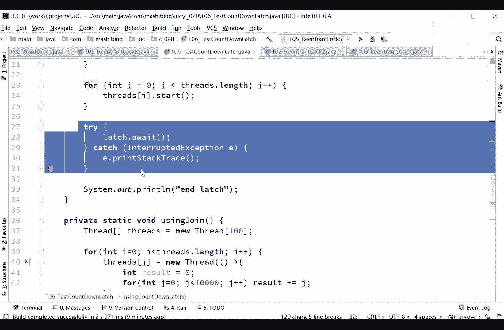

# 花了2万多买的Java架构师课程全套，现在分享给大家，从软件安装到底层源码（马士兵教育MCA架构师VIP教程） - P36：【多线程与高并发】CountDownLatch - 马士兵_马小雨 - BV1zh411H79h

我们来聊这个count down latch，count down，lash呢count down倒数lash是门栓的意思，而倒数的一个门栓啊，54321数到了，我的门窗就开了这么一个概念。

我们来看这个小程序，这个小程序呢叫using coundown，let是什么意思，看这里threads等于new一个thread，100个线程，接下来我来了一个100个数量的。

come down lash，诶什么意思，这是一个门栓，这个门栓上面积了个数，记了数是多少呢，是surprise，their lance，是100，每一个线程结束的时候。

我让let。come down。

然后缩写成start来点await。

ok最后and come on mage到底干什么使的呢。

先从这儿看，上面是所有的线程开始。

这是没问题的，let awaight的意思是说，门栓在这儿给我拴住，门给我插住，不要动，当执行到这句话的时候，这个门栓就在这里等着，并且上面接了个数是多少，是100。

每一个线程结束的时候都会往下come down，come down的意思是减一变成往往往下，原来都说的是基础上减一好，现在原来是100，一个线程结束了变成99，再一个线程结束了变成98。

再一个线程结束了变成97，咣咣咣咣咣，什么时候这个栓才会打开呢，很简单，变成零的时候就会被打开了，所以这就是门栓的概念叫countdown lash，倒数倒数奇数，那么它用来干什么呢。

你理解了这个东西之后，你说他用来干什么的呀，用来等着那些线程结束，等多少个线程结束之后，我们来干什么，干什么干什么，这就是一个门栓的概念啊，唯一用过的就是condolesh。

ok so and lesh，当然有同学可能会说我结束也可以用别的没错，可以用什么呢，可以用joy，这是没问题的，每一个县城都等着合并在当前现场上，ok让他让让他结束，这个也可以啊。

comblech叫嗯滚动发车，坐满就走，可以这么来理解，很简单，本身这个con lash比较简单啊，好关于condolesh，我就聊五分钟，用法上我们就聊五分钟，有问题吗，condolesh的用法。

有名同学就问你主要几个函数来配合，第一个呢是let。await，拴住了，什么时候这个打开栓继续往前走，111步一步不停的come down，等康康down到零的时候，这个栓就继续往前走啊。

性能上比折耳有很多嘛，性能我没错，这个我估计也不会比，照样有很多，而且你用common lash来聊性能，这事本身就不靠谱，康纳是干嘛的，await大哥。

await阻塞的阻塞里有什么这种这种这种阻塞的东西，你有什么性能可聊啊，就得等着所有的你的运营正在运行的线程结束了，你才能够继续往下移，那你运行线程运行多长时间，这才叫效率高，我靠好吧。

好这就是come on let的最常用的一个用法，因为门栓栓在那儿，什么时候，我想让他继续往前走的时候好，我可以来程序来进行控制，那如果你用joy能用joy，实际上不太好控制，你分析一下，用joy呢。

必须你这个线程结束了才能控制，但是如果是一个门栓的话，我在一个县城里可以不停的coundown，coundown，coundown calm down。

我在一个县城里就给他康down到从100直接给他数到零，我一个县城就可以控制这个门栓什么时候往前走，但是我如果用join的，用join的话，我只能说我当前线程结束了，你才能自动的往前走。

