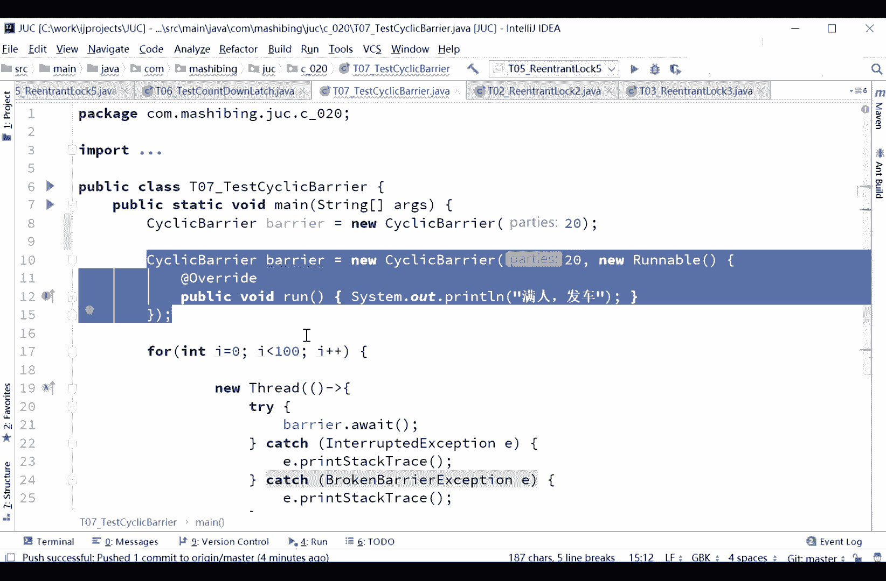
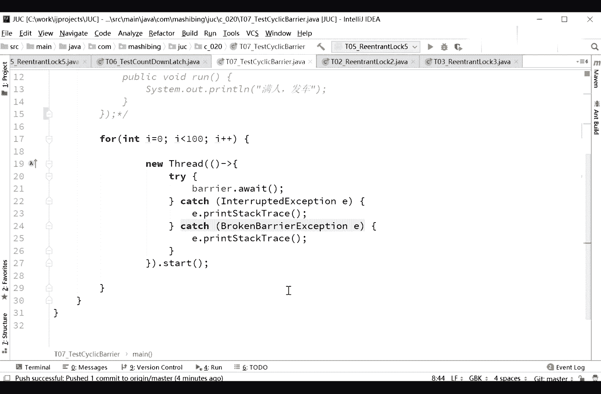
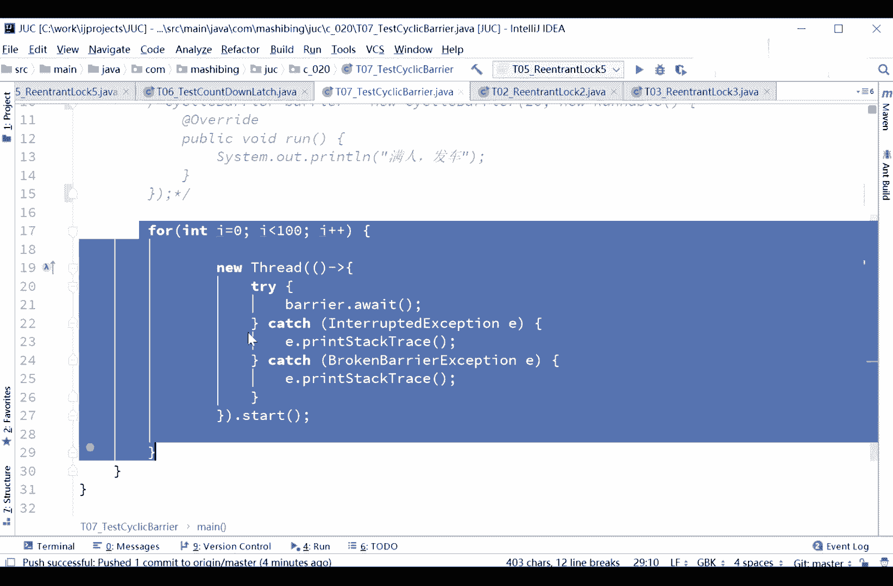
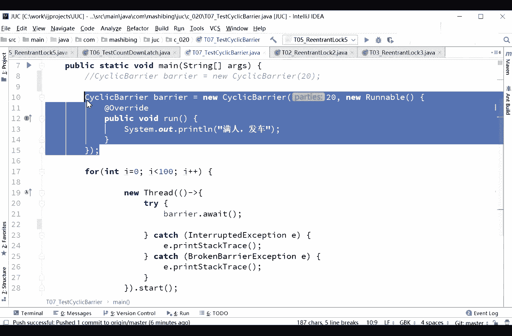
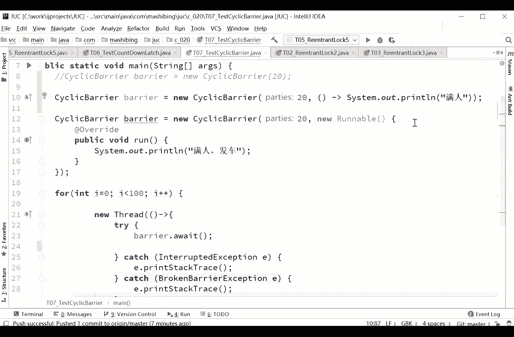
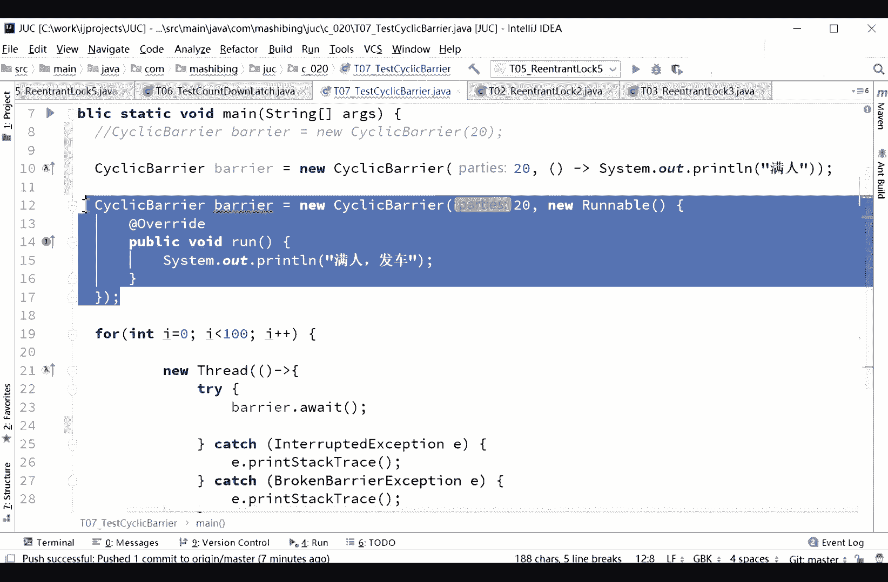
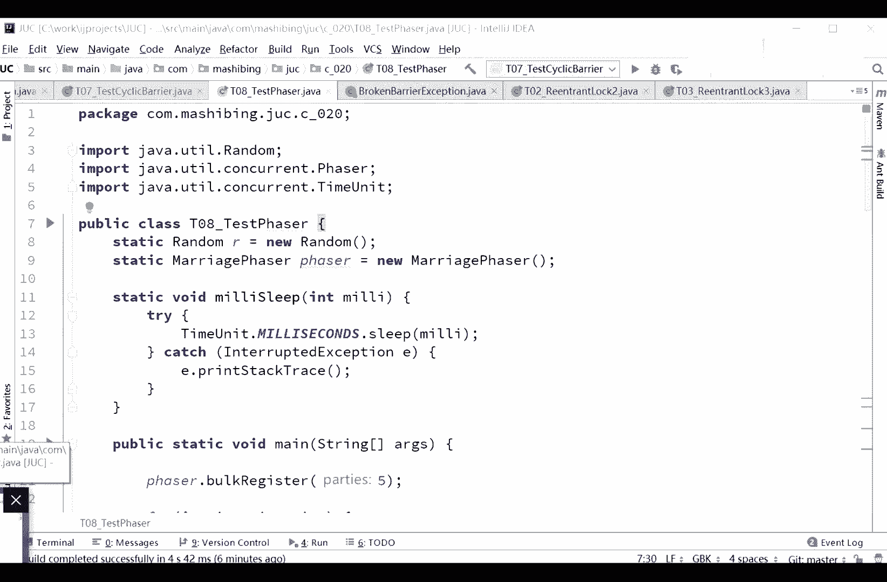

# 花了2万多买的Java架构师课程全套，现在分享给大家，从软件安装到底层源码（马士兵教育MCA架构师VIP教程） - P37：【多线程与高并发】CyclicBarrier - 马士兵_马小雨 - BV1zh411H79h

那我看这里啊，我们来讲，另外一个同步工具，这个同步工具呢叫cyclic barrier，cyclic barrier呃，cycle和bl的意思，栅栏这个炸弹呢就像什么呢，就像那个发令枪一样，嗯。

只有一个栅栏是吧，什么时候这边人满了，满了之后呢，就把这渣渣推倒，哗啦哗啦啦都出去了，都出去了之后呢，哎炸弹呢又重新起来，新来的人满了，把推倒推倒之后呢。

又继续就这样循环cyclic循环的cyberrier栅栏，循环栅栏好看，这里，clibarria等于六一个celebra，两个参数，当然第二个参数不传也是可以的，第二个参数不传的意思是他满人了之后呢。

你不做人了事，第二参数是一个什么呢，是一个rnable，它叫做berry action，两个30，第一个参数是20 20的，意思是满20个人发车，满20个人满了之后帮我调用第二个参数指定的动作。

我们这个这个动作呢就是一个render对象啊，所以我定了一个ro打印满人翻车呃，当然啊，同学们听我说，这三个加a呢有好几种内衣方式啊，sander berrier barrier的new，一个最简单的。

没有一个3d barrier，一个参数的20，其实这句话的意思就是说呃所有的程序一旦到20个县城。

到这儿之后，好这个栅栏才会被放倒，然后你才会继续看这里。

for a等于a小于100 100的线程。

new thread，每一个thread呢barrier weight，barrier weight的意思是beryl在这等着，你可以想一下第一个线程来了之后，在beryl前面等着，第二线出来的。

也等着什么时候这块都会被放倒，这块会被放倒呢，很简单，就是什么时候等到20个人了，就是你这里指定的是parties，参加者是20个，什么时候指定20个人了，我就发车，那就是满人发车。

你就想一下有一辆车扔在那儿是吧，什么时候人满了，什么时候翻，拿一簸箕，上面好多人什么时候坐满了，什么时候给你扔，扔到山底下去，周老师，你理解不对，好这是第一种方式啊，就是他圆满之后呢不做任何操作。

当然你这个av完了之后继续下面写任何操作也可以啊，人满发车也可以，不过呢跟我们家优雅的一个方式是这样来写的，就sexy berry啊，等于new bl，六完之后呢，人满之后，你让他执行一个rainbo。

类型的对象，其实说白了就是让他直接一个操作了。

我打印这个，我这个操作很简单，就是猛然发车，当然还有这种写法啊，我写出来看大家能不能理解beryl等于new cyberyl 20，the bactional，就我这样来写，就是拉姆达是，本人，啊。

这是这种写法啊，我只我只不过像这种写法呢是为了让大家看得更清楚。

那么上面这种写法呢就是用来b表达式的写法啊，o好看，这里来我们来执行一下，看看软，好买买买买买，15个满了人之后呢，说明人满了，程序可以继续往下执行了，所以这样的意思就是大家伙都在这等着。

什么时候人数够了够了，什么程度呢，什么叫够了呢，你指定你自己指定有多个线程跑到这儿了，如果说不够，大家伙都跟都跟我这等着，如果说够了好，你继续。

那么刚才呢真的是说这coronline的区别只能是循环一个正数，一个倒数，不不不，你千万千万别这么认为，这跟正数倒数没有任何鸟关系，好吧，你看他哪句话写了证书，哪句话写了倒数。

他如果看down是确实是个倒数，但是这个可没有证书的概念，这如果就是大家伙，县城在这堆满了，我们继续才能往前往前执行，而count down的意思是说我calm down了之后，什么时候归零。

什么时候当前线程继续往下运行，我可没有一定说就是100个县城或者多少个县城在那儿扛到，我可以一个县城一直扛到，老魏啊，周娜斯不知道说我说清楚没有给我点反馈啊，就是那个康down啊，他只是说拴在那儿。

他什么时候变成零，什么时候就继续往下执行了，但是你怎么让他看到呢，你不是不一定非得在每一个县城里coundown一下，你可以在一个线程cdn多下，什么时候归零啊，什么时候减下去就ok了。

20个县城是一直在这等着吧，19个县城，确切的说是19个县城，sing in the rain，同学为什么是16位啊，第二次第二次被建成来了就满了，满了大家伙就发车了吗，会询问这个栅栏的场景是啥。

这个栅栏的场景，栅栏的场景，我给你举一个限流的概念吧。

我想想啊，这个是不是很贴切啊，加栅栏的场景，最直观的场景就是面试，我告诉你嗯，然后呢，你就一个限限流的概念啊，clic barrier，塞雷贝尔这个限流。

嗯嗯你比如说我们前面来了很多很多的从前从从从从客户端那里啊，用来很多很多的一个访问，然后打到我们的web server上，我们web server呢由于可能秒杀也好，或者是突然之间的打流量冲过来也好。

大家知道呢，在后面的微服务要访问到我们某一些具体的服务的时候呢，唉我们要进行一些个限流，就你说这些这些流量太大了，我实在承受不了，如果任由他打到我后端数据库上的话，我数据库直接就崩了，我可能顶不住。

那这时候呢我们要进行一个限流，那限流怎么做呢，限流就是前面这个流量的入口啊，特别特别多，但是呢我后面的出口，我给他限制住后面的出口，我给他限制住，好这出口，我就给他限制住，我就给他说。

比方说你只有你两个请求能过来，或者是只有30个，40个，50个，60个，70个线程请求能过来，这时候我是不是就可以用clebarry了，胡云你想想他这个情景能想象得到吗。

当然我告诉你实际用的时候是用哪个的呃，一般来说有可能用的是那个，娃娃，java里面那叫rich limit，这是呃google对那个专门做了一个限流用的这样的flag啊，我可能会用这个，这得等够了。

20个一起处理，对没错啊，对或人说的很对啊，这个我举的这个例子呢稍微的有点问题，他来了19个应该就来了，前面少于20个就直接就过去了，所以限流这个概念就是大家伙儿等齐了这件事一块才能出发。

比如说我们某一个县城需要等到所有其他线程结果全都结束了，我另外一个线程才能执行，那么其他县城呢不能直接往前跑，在这种情况下，就需要就可以用cliberry了，对对对，这是令牌桶的限流。

这个和那个celebra这个例子举的举的不好啊，sorry，这个就不好，这是限流的概念，这个，赛里ban的就是有些县城啊，他必须得等其他的这些县城都完事了，你才能够继续往前执行嗯，举个例子的例子。

我们如果说做某一个操作的时候，我们需要干嘛呢，需要其中先去数据库取个取个数据，然后另外一个再去网络上了，取个数据，爬一个数据，还有一个去硬盘上读一个东西，假如说我们顺序执行这个例子。

应该会让你明白这件事啊，我重新举个例子啊，这实际上是限流的概念，不是sei berrier，呃vivi的概念没拼错，可能别人david的概念呢，你比如说一个复杂的操作，需要好，如果需要好的网络。

标准文件，假如有一种方式，你是顺序执行所有ipad的，全执行完顺序执行效率可能非常低，这是这是这是这是一种方式啊，但是还有一种可能性呢，我们就是病犯这种，就是我派某一个原来是123是吧，原来是123。

这么来执行并发执行的就是不同的线程，sheet，不同的线程去执行不同的操作，不同的院长出现不同的操作，有的线程的去数据库找，有的线程去网络访问，有的线程的去读文点好，等这些线程全都读结束了之后。

必须得三个线程全都到位了，我下面的操作操作才能进行好，这个时候就可以用sk barrier或云，不知道说清楚没有，拼错了是吧，这看着有点别扭啊，ok，很好啊，我们都看到单独。

