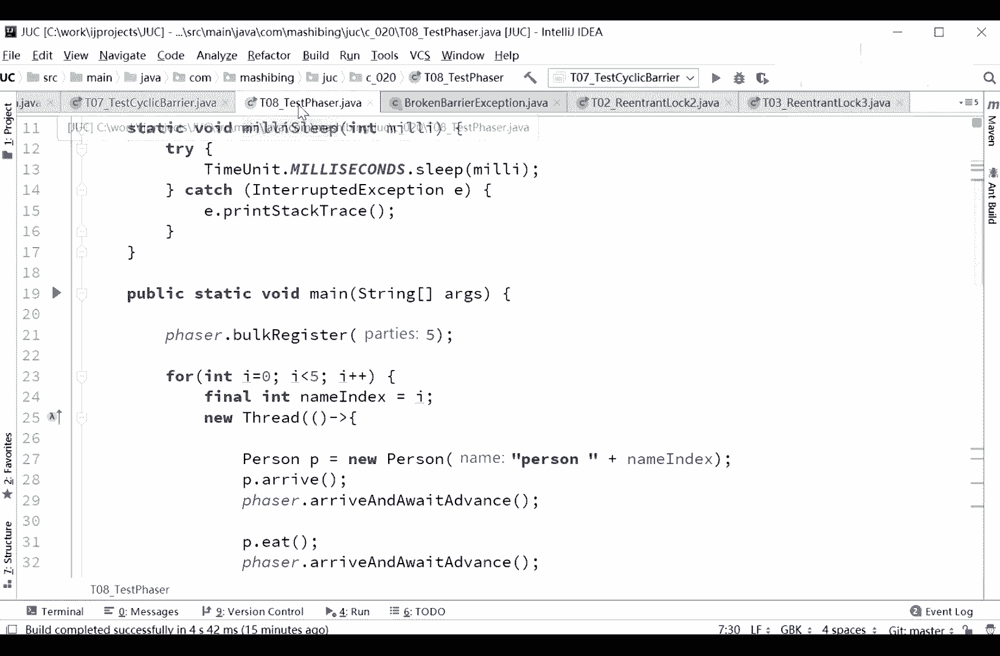
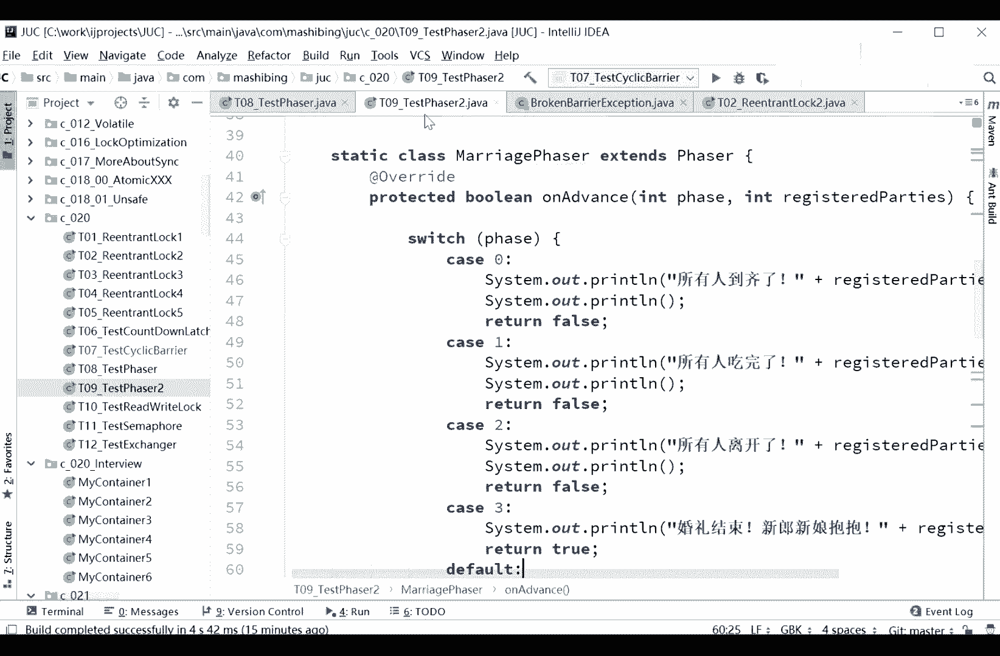
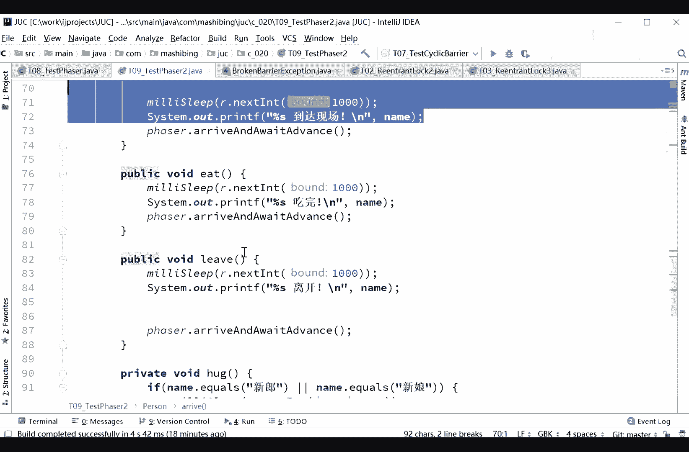
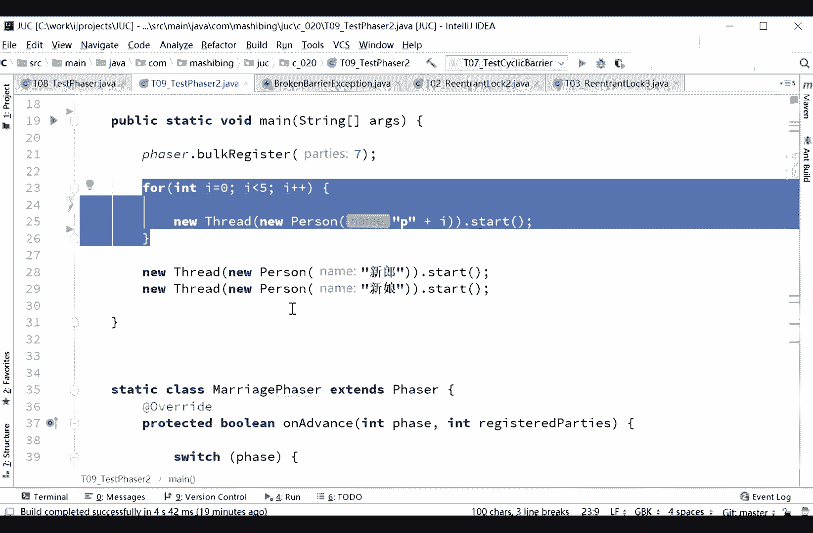
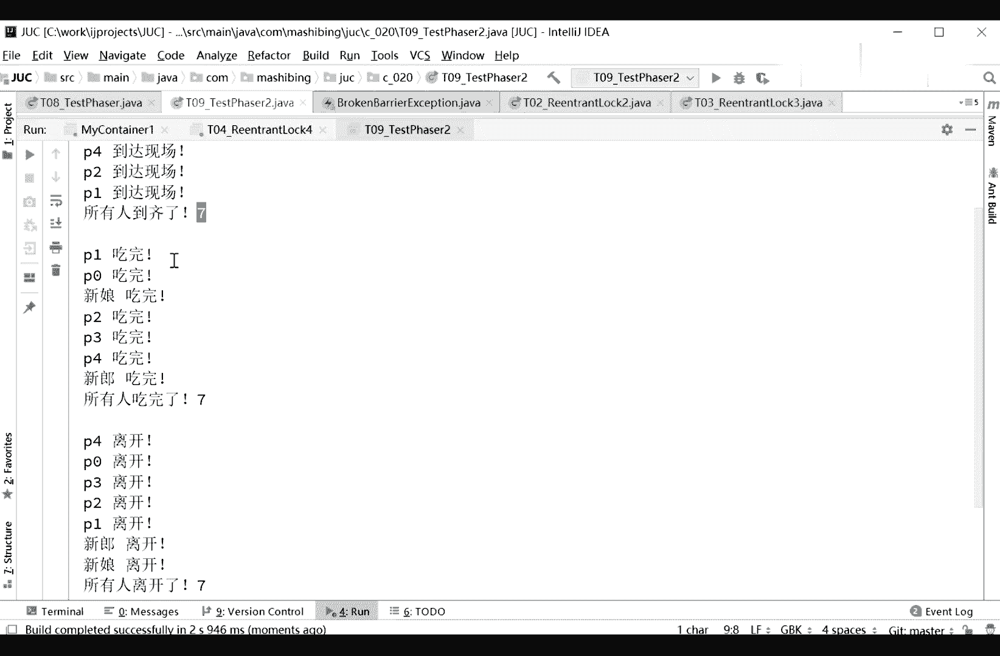
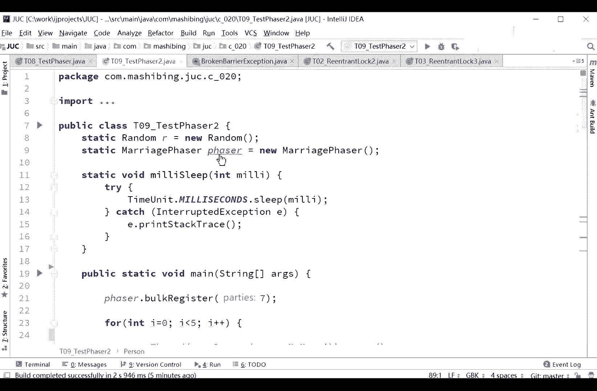
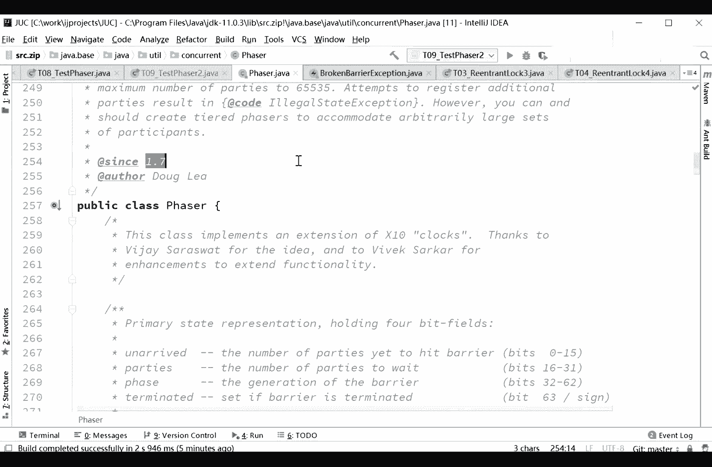

# 系列 3：P38：【多线程与高并发】Phaser - 马士兵_马小雨 - BV1zh411H79h

那么面试官那肯定会对你高看一眼，是肯定的啊，咱们这个啊这个稍微复杂一些，这个叫什么呢，你这个叫fer face嗯，faze的意思是阶段不同的阶段，fer呢是按照不同的阶段来对现场进行，执行什么利益。

什么意思呢，就是它本身啊是维护着一个阶段，这样的一个成员变量，就当前我是执行到哪个阶段呢，是第零阶段呀，还是第一个阶段啊，第二个阶段啊，第三个阶段啊等等，那么每个阶段不同的时候呢。

这个线程呢都可以往前走，有的县城走到这儿的时候，他就停了，有的县城呢一直会走到结束，所以如果你在，各种，各种的你的程序之中，如果需要用，到时候分好几个阶段执行，而且呢有的人呢必须得同时。

几个人共同参与的，像这样的一种一种一种情形的情况下，你有可能会用到这个fer呃，我直接告诉大家，我是没有用过的，就是真正在我们自己写程序的时候，我只能是给大家写演示程序，但是有有一种情形可能会用到。

就是如果你写的是遗传算法，一传算法呢你上网自己查一下啊，这一传算法呢实际上是计算机的，来模拟达尔文的那种进化策略，所发明了一种算法叫遗传算法，当你去解决这类的问题的时候。

这个fader是有很多能用得上的，面试官没听过咋办，面试官没听过，你讲给他听了，哈哈哈，有点像先一步后同步大兵，你这个例子是，你这个理解也应该是没问题的，每个阶段就是先异步同步，其实这东西更像是什么呢。

更像是cyclic barrier，就是barrier这东西，栅栏这东西一个一个的栅栏，它原来是一个循环的栅栏循环使用诶，但是这个栅栏那是一个栅栏，一个栅栏，一个栅栏，一个栅栏，这么扔下去。

我们来看我给大家举一个小例子吧，好不好啊，自己造一个概念，忽悠面试官，可以，你只要能不用，面试官肯定是没问题啊，我，们我们直接看这个test fer 02就行了。

test肥皂二就可以了啊，fer 2呢比fer一又稍微改了一下，会更加齐全一些啊，我们要读这个小程序啊，小程又一点点多看这里啊，我们先不看这个fer的部分，我们先来看呢。

有一个现在我模拟了一个一个一个场景啊，这个场景呢是一个结婚的场景，听我说我模拟了一个场景，这个场景呢是一个结婚的场景，你认真听啊，这结婚呢是有好多人要参加的哦。

因此我写了一个class steady class，person implements rable，这个写的不是特别好，应该叫从thre集成就就行了，但是不管怎么样能理解就行。

就是我们是一个renderable，可以new出来扔给threat的执行的模拟，我们每个人要做一些操作，那这个人呢有自己这个名字，这个倒没问题，很简单，注意看它有几种方法呢，有这么几种方法。

第一个叫arrive，到达叫it是leave，离开hug，拥抱就这么几个，好听我说作为一个婚礼来说，它分成会分成好几个阶段，分成什么阶段呢，第一阶段是大家伙都得给我到齐了，第二个阶段呢大家伙开始吃饭。

第三个阶段呢大家伙离开，第四个阶段呢就是新郎新娘入洞房了，这两个可以hug，其他人是没法hug的，那好了，每个人都有这个方法，arrive it leave hard，看这里在方法的实践里头。

其实我就简单的睡了1000个毫米，这个你你就不要再纠结这个地方，我自己写了个方法，写了try catch了，要不然老老在写try catch，看着别扭啊，把开try catch扔到一个方法里了。

milliseconds，mini sleep，其实我就是把try catch扔到这方法里了，因为一堆摔开始看着太别扭了，那这就不解释了，每个方法我都让他随机的睡这么几秒钟，模拟我们的右逻辑。

然后我们打印谁谁到达现场，是哪个人到达现场了，arrive方法，意德呢是哪个人，吃完了live的那个人离开了，谢拉新娘啊，是进了洞房了，o好看，这里，下面这句话呢我们先不聊好吧。

叫fader arrive and weight advance，我们先不聊这几个方法。

大体的意思不知道大家看清楚没有，再看一下啊，一个类属性name方法就这么几个，arrive it leave her没了，先不看其他的逻辑好，到现在为止应该没问题吧，逻辑太简单了。

无非就是个非常普通的java，但是我们再来看它，实现了renov这部位得run方法，套在县城里去，这个县城里呢就是他就执行这四步，反正每个人参加婚礼吗，无非就这四部。

rive it leave和hard，没别的，还有这方法我就写完了，这个论文写完了有没有问题，刚才我讲完的这部分有没有问题，那没问题，那我们继续，然后呢我们来看主程序我是怎么写的。

主程序呢我们先不看上面，先看下面i等于零，i小于五，然后又多了一个小，咱们表达式的时候多难啊，然后represent，然后把它装到thread is start，所以p01 直到p4 p0 。

p1 p2 p3 p4 ，一共有五个人参加婚礼了。

接下来新郎参加婚礼，新娘参加婚礼好了，七个人，一共七个人参加婚礼，我们用线程来模拟它，它以start会调用我们的run方法，调用我们run方法，它会挨着盘的调用每一个阶段的方法。

那好大家记住在每一个阶段，我们是不是得控制人数啊，第一阶段是被所有人到齐了，我们才能开始啊，哎你们说新郎新娘还没到齐呢，就开始是吧，第二个阶段所有人都吃饭，第三个阶段所有人都离开。

但是到第四个阶段进入洞房的时候，你就不能所有人都干这事了，所以呢如果我们想模拟这个程序，我们呢会要把整个的过程要分好几个阶段，而且每个阶段必须得等，这些县城全都给我干完事了，你才能进入下一个阶段啊。

你不能说那个刚吃完就进洞房，这不行，不允许，ok看这里刚来，你就进病房是吧，连吃饭都不吃，对不起，那怎么来模拟的过程呢，我这样来写，我呢用了一个phaser，定义了一个pser哈。

我这pser呢是从fser这个类继承marriage，fer，extends fer重写，注意是重写的一个方法叫on advance，advance，英文是什么意思呀，前进，什么人会前进。

听我说到了这个栅栏满足条件之下，这个方法会被自动掉，on advance，县城抵达这个栅栏的时候，这个on advance会被自动调用，就是说，第一个是所有的线程都满足了，第一个战略的条件了。

这个on advance自动调用，目前我得有好几个阶段，这个阶段呢他是写死的，必须得是数字零，开始好几个阶段，switch phase，好advance的时候会传递两个参数。

后面这个呢是register parties，就目前这个阶段有几个人参加，顺子是第几个阶段，目前这个阶段由第几个人参加，是由谁来决定的，failure docker register。

往里头注册一个七个人，就是当前最开始的这个阶段，是有七个人参加，这个数字会被on advance接收到，我们重写，重写会被调用吗，这个会被调用，调用的时候，那个数字会被接收到，就到这里啊。

release please，当面是第几个阶段呢，如果是第零个阶段，第零个阶段的意思就是说，所有人都已经到了到了第一个炸弹，第一个炸弹被推倒了，结束的时候好，我打印所有人都到齐了，打印空行。

return false，到第二阶段，所有人都吃完了，return false，第三个阶段，所有人都离开了，第四阶段，婚礼结束啊，新郎新娘可以抱抱了，最后return true。

当我们return true的时候，所有的线程就结束了，整个的这个栅栏组，这个痱子的栅栏组就结束了，那好，那我怎么样才能让我的县城，在一个栅栏面前给停住呢，每个不同的阶段的栅栏给停住呢，就用这个方法。

fer arrive and waited varrive，到达weight advance，等待着继续往前走，我们再来执行一下，一会儿我们再来过一遍这代码啊，你会明显的看到呢它分成好几个阶段。

一个阶段新郎新娘到达到达现场是吧，p01 直到p1 p4 ，所有人都要齐了，目前呢当前接收的人数是七个。

这个阶段接收的线程是七个，七个线程，第二阶段全都吃完了七个县城。

第三个阶段呢全都吃完了七个县城好，最后一阶段新郎新娘洞房了，其他人没有了，只有两个现场，为什么只有两个线程呢，是因为我们在这写了，其实不是因为别的，而是说我们自己写的，在hug里面，我们写的是。

如果name是等于新郎或者新娘的时候，你可以动皇继续arrive and awaited vs，这是没问题的，其他的情况下叫arrive and diregister，就是你可以到这个阶段。

但是呢be regist，register是注册，d register是解注册是吧，不要在这注册了，这个阶段没我的事了，再往后的阶段没有我任何事了，就是到这个阶段啊，其他的人你都滚蛋。

只有新郎新娘继续可以往前走，生孩子干嘛的，随便，如果你再加一个新阶段啊，生孩子之类的，那么前面的这些个线程就都没了，好我我我画一个图，然后先来了解什么样的流程啊，这个具体的写法。

上一会儿你们下去再仔细看，先给大家画一个图，先了解这个流程，目前呢我们所谓的这个痱子呢，会成分成好几个阶段的栅栏，这第一个呢是零，第二个呢是一，第三个呢是二，第四个呢是三啊，我就这么这么几个阶段。

然后呢，这第一个呀大家伙得等大家伙来全了，五个人加两个人，一共七个人啊，五个客人，两个主角，这两个主角嗯把下面，好这是我们的两个主角啊，别总来拳了，然后这个这呢才会倒掉，倒掉之后呢会说所有人都来全了。

然后大家会去干嘛，进入下一个阶段，进入下一个阶段的意思是大家都都失败，o一完了进入下一个阶段，待会儿都离开，你开完了之后呢，进入下一个阶段，所有人都到了啊，但是在下一个阶段里头呢。

我们让这些个人啊都低于jor了，所以如果再有下一个阶段，这些人就不会再参与了，啊不知道我说清楚这个过程没有，这个是就是pser的意思啊，我们再来回顾一下这个写法，写法呢是这样的，你要用飞的时候。

需要呢从你要想处理每一个face的逻辑，你自己呢要写一个定义的自定义自定义类，从fser继承重写它的on advance方法，而这个方法呢是，当我们每一个站位被推倒的时候，它会被自动调用。

里面有两个你可以用的参数，第一个呢是当前是哪个阶段，哪个照样被推倒了，第二个呢是目前有多少人参与了这个阶段，就推倒之后还剩多少人可以这么来理解啊，ok 0123，所以剩下的过程呢。

就是你可以调用arrive and weight month，等着进入下一个阶段，或者是arrive and diredist，我就不进入下一个阶段，所以它不仅呢可以控制栅栏的个数。

还可以控制栅栏上等待线程的数量，这个呢就叫做废纸，还是那句话，是给大家拓宽知识面用的，假如说我面试好像都没人，都没人问到对，像cyclic不要读circle大哥，plic barrier的升级版。

1。8新的这点是哪个从哪个版。

哪个1。7，1。7cc，1。7。