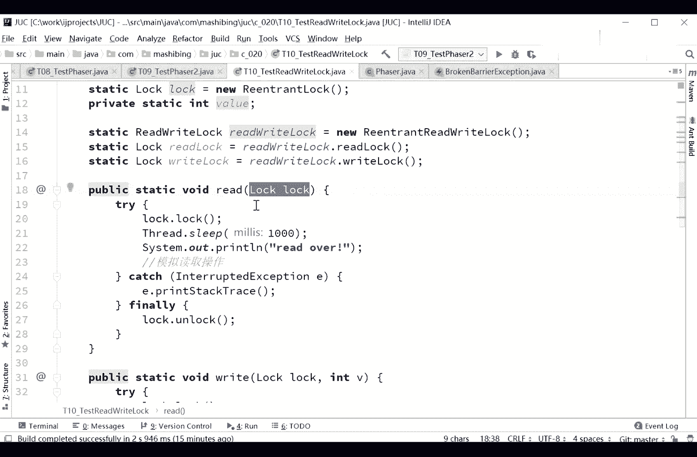
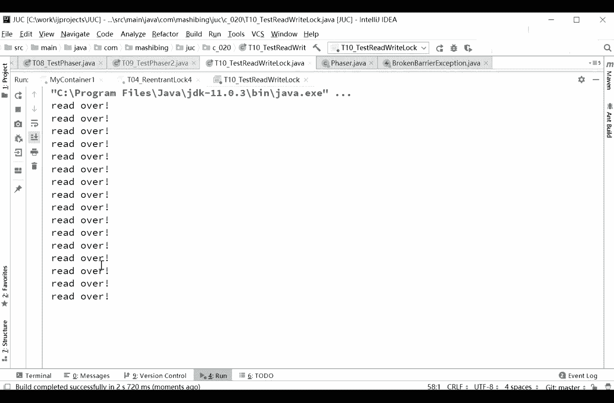

# 花了2万多买的Java架构师课程全套，现在分享给大家，从软件安装到底层源码（马士兵教育MCA架构师VIP教程） - P39：【多线程与高并发】ReadWriteLock - 马士兵_马小雨 - BV1zh411H79h

ok这个是被问到过，而且是有可能会被使劲考的。

认真听，那么这个是什么呢，这个叫做reader read lock，读写锁好，读写锁的概念呢其实就是共享锁和排他锁，嗯，好就是共享锁和排他锁这两个音读锁和写锁，读锁就是共享锁，写锁就是排他锁啊。

这是什么意思，我们先要来理解这件事儿啊，读写呃有很多种情况，就是你那个数据库里的某条数据，比如说你放在我的内存，就可能读的时候特别多，其实改的时候呢可能并不多呃举个最简单的例子。

就是我们一个公司的组织结构，我们要想显示这个组织结构底下有哪些人在网页上访问它，所以这个组织结构呢经常会被访问到会读，但是他很少更改，除非是借人或者踢人是吧，雇佣人或者解雇人的时候，这个结构才会更改。

所以读的时候特别多，写的时候呢并不多，但是如果我们这个时候好多现场共同来访问这个结构的话，让大家想一下啊，好多线程共同来访问这个结构的时候，有的是读线程，有的是写线程，我们可以采用一种什么样的方式呢。

如果想不会要求他不不产生这种数据不一致的情况下啊，你不能说你这边写一半了，这边就读出来了哪些数据了啊，这边刚写一个张三，要要要入职，结果你刚写到张字啊，这边读出来了啊，有新进来一个有职员叫张啊。

这个还好是吧，要是写一个写一个什么别的不太不太好听的啊，这王八衰啊，前面俩字刚写进来，后面这读的县城开始读出来了，这个就不对了啊，所以这个时候呢你得最简单的情况就是枷锁，不管你是写的时候还是读的时候。

你都得给他上把锁，我读的时候只能我自己读，我写的时候只能我自己写，但那种情况下呢效率会非常的低，尤其是毒性程特别特别多的时候，毒性能特别特别多的时候，他效率就会非常的低，所以我们能不能做成这样的锁。

什么样的锁呢，就是当我读线程上来的时候，我加一把锁，这把锁呢是允许其他读线程可以继续读，就这把锁呢，如果是别的那个线程写线程来申请，我不给他，我正在读呢，你先别写，等我读完你再写。

但是别的独线程来的时候，我发现你是毒性程，好了好，这个时候我就允许你进来，大家伙一块儿读，因为你不改原来的内容，但是血线程上来二话不说就直接把整个的全锁定，你先别读呢啊，等我写完你再读。

这样的话效率就是比较高朗啊，s s问王八衰是什么鬼，很明显你没有看过倚天屠龙记啊，一天都有，你是吧，叫什么赵钱孙李周吴郑王了，赵敏所带的八个侍卫是赵赵赵一衰，前二拜孙三回，李四催。

这个这个赵一铺叫什么来着啊，最后一个叫王八衰嘛，你知道学名法老是，呃折叠器读的线程很多，会不会一直读，不是放锁血线程，一直读着，现在就等着呗，那你显现程一直等着呢，你在什么情况下。

你说写线程一直得不到这些，你告诉我一下，那除非cpu出问题了，cpu就挑那个毒的往里头扔，写的他不管，程序里的读写锁，数据库里的锁会不会冲突，两回事，数据库的锁，数据库的锁，程序锁，程序测锁两回事。

数据库的锁是你访问数据库的时候加在数据库上面，你读你从数据库读出来了之后，你会扔在那个程序里吗，那程序里的话是你扔在内存里的两回事啊，你别别混一块儿，我们读一个程序的时候。

不就是说先去数据库里把内容读出来，读出来了之后，你内存里才有，对不对啊，这时候已经读完了，都你至于说你读的时候需不需要给行上把锁，或者为整张表上把锁，那是你自己的事情。

你读完了之后是我们说的是这部分内容跟数据库没有任何鸟关系啊，我现在容易经常死锁，我去真的一会儿咱们好好聊一聊这件事啊，好我们先我们先讲先讲内容啊，我看这里啊。

嗯这个毒蝎手呢其实啊我后面给大家讲完这个reaction logo的condition之后，大家就会了解这个毒解锁呢其实就是和肯尼神的概念呢非常的类似，我们先不说，就说这件事啊，你先说这个读写锁怎么用。

读写锁呢，我们这么来用啊，嗯，啊。

咋看这里啊，看这里呃。

我们现在有两个方法，第一个方法呢是read读一个数据，第二个方法呢是写right。

写一个数据，read这个数据的时候呢，我需要你玩这个传传一把锁，这个你传那把锁你自己定，我们可以传自己定义的。

所有的全都是排查锁，也可以传自己定义的毒蝎锁里面的毒素和解锁。

这个随便你rap的时候也需要你传把锁，同时rap的时候需要你传一个新知。

你往这个纸里头传一个内容啊，也就是模拟这个操作，所以他就读的一个什么值呢。

读的是一个int类型的值，模拟一下，好，读的时候，我上来之后先上锁，读的时候也要上锁，写的时候也要上锁，刚才说过了，因为你读的时候万一被写，中间被写进去，你就读了脏数据了，所以不会是上锁。

read over表示我读完了。

做完了操作了，就这意思，最后unlock不说了，接下来解锁，解锁是上来之后unlock绕口完了之后呢，税表示写完了，把这个新值呢设给value，设完了之后呢。

unlocal非常的简单啊，我们的现在的问题就在于我们可以把这个往里传这个logo。

传这个logo的时候呢，有两种传法，第一种呢我就直接传这个logo，很清楚，等于new一个reaction log。

直接把这个logo传进去，但是你想一下，如果是这个logo传进去的话。

分析一下啊，啊，啊定义一个round对象啊，第一位round模对象呢是调用read方法，第二个呢是调用right方法，同时往里头扔一个随机的值，这个值是什么不重要，然后呢，我起了18个线程。

这18个是独线程啊，起了18个毒线程，起了两个血线虫好，你认真听同学们，这两个东西我要想执行完的话，现在我传的是什么锁呢。

我传的是一个reenterlock，看到了吧，这把锁大家知道他一旦上了手之后。

没有任何人，没有任何其他的线程，我能拿得到这把锁，同学们，你们告诉我一下这20个线程执行完需要多少秒，实验一下走。

你，你的血线程啊，你必须都得给我等着是吧，所以如果你起18的毒腺中用这种互斥锁。

互斥锁也叫排他所，我拿了这把锁，没有任何人能拿，如果用这种情况下。

你就得等20秒才能干完这件事，我们来换一下，这次我往里传的时候，虽然说还是read还是right。

但是我这往里传的时候呢，我换了锁了，这把锁是怎么做的呢，这把锁是这样子做的，看这里，read red log读写锁等于一个reentrant。

read red lock是read reload的一种实现，在这种实践里头呢，我分出两把锁来，第八锁呢叫relock，等于revlog的relock。

通过调用它的relax这种方法来拿到这relog对象，读索我就拿到了，通过断relog方法，我拿到他的reload对象，所以呢我把这把手分成两把，第一把呢叫relog。

第二把呢叫red log，好这两把锁在我读的时候。

我给扔进去，new road rer start。

这次往里读的时候呢是read read lock，传的是relog，而写的时候传的是red lock，刚才我们分析过啊，同学们，我说当一个这个对象上上了一把毒索的时候，其他的那种独线程也是可以继续读的。

所以理论上来说，看一下。

你自己看，回头把rap我没了，再来看一遍啊。

刚才那是一个一块多，但是现在我用reload呢，你看啊，real over rever，rever没了。

所以在这种情况下。

我现在这么聊这件事，大家能理解了吗，再看一遍，我们现在有一个值a sheet啊，好我们现在有一个值啊，这个值呢是一个int类型的数，然后我有18个独线程，使劲往里使劲儿从里往外读啊。

然后还有两个线程呢使劲往里写，我们加一个互斥锁或者叫排他锁，在这种情况下，一个线只能一个键能读，其他线上也不能读，也不能写，效率非常低，但是我们换用读写锁之后呢，在读线程里面加的是毒锁。

在写线程里面加的是写锁，写锁是排他的，我不能说我写的时候别人也可以写，我写的时候别人也可以读，这是开他的，这个没问题，由于血线程比较少，所以这个没有这个效率呢，呃也也不会降低太多，为什么呢。

因为我在一个线程读的时候，其他的也可以进来继续，好了哎，hello world，说的很问的很对，他说读的时候不加锁呢，读的时候如果不检索，那那就是说你读到一半，我这个假的中间的数据就可能写进去对吧。

这人叫王八衰，结果你读了前两个字儿啊。

