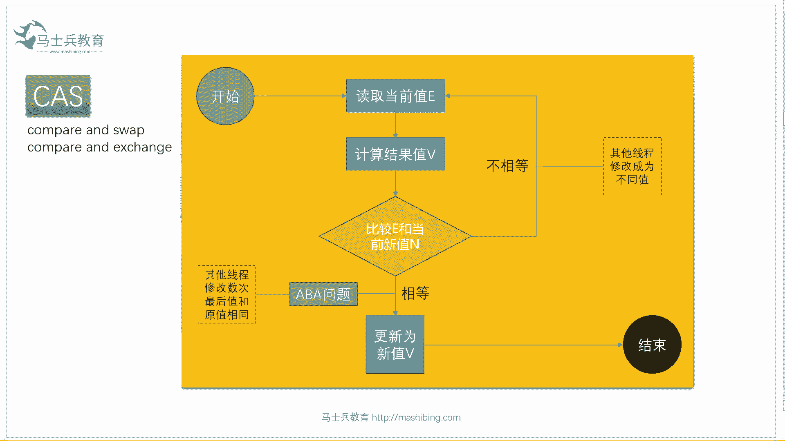
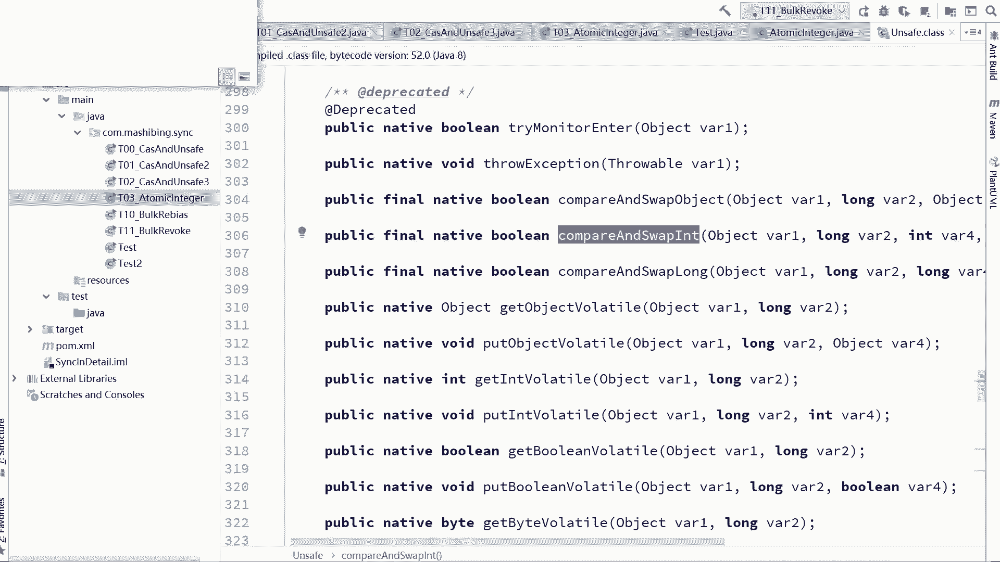
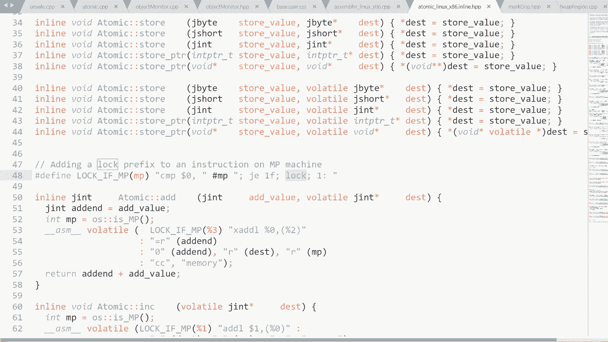
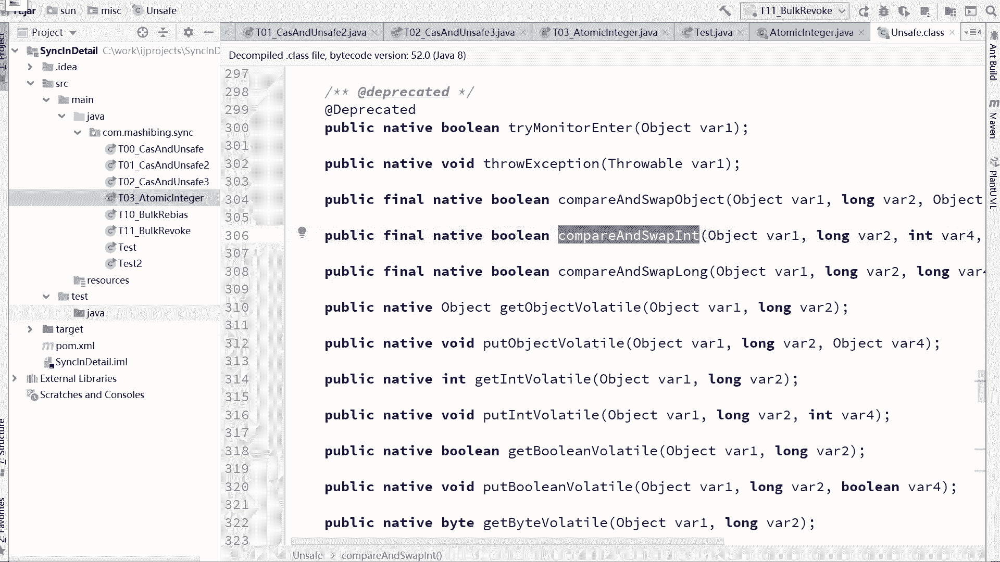
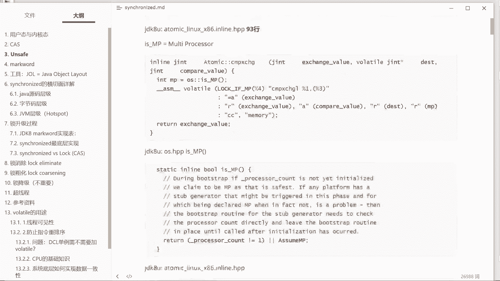

# 花了2万多买的Java架构师课程全套，现在分享给大家，从软件安装到底层源码（马士兵教育MCA架构师VIP教程） - P3：【多线程】CAS在新的JUC包里有哪些运用？ - 马士兵_马小雨 - BV1zh411H79h

普通了，那么cs在新的j u c的包里头有哪些运用呢。

大家看这里，看代码，呃我觉得大多数人呢应该是了解过这个类的，这类叫什么，这类的叫atomic integer，atomic energy，它用来干什么的呢。

用来对一个int类型的这样的一个数字进行原子性的访问，比如说对这个数字进行访问的时候，是不需要加锁的，什么意思呢，比如说最简单的，我刚才说过这个问题啊，如果我们有一个值，这个只是一个普通的值，是一个零。

那么好多线程对这个零对这个数字进行加加的时候加加操作，那么这时候必须得加锁，如果我们用atomic engineer就不需要加速，怎么做呢，大家看这里。

etopic engineer等于new一个atomic energy，初始值是零，里边装了一个int类型，我如果多线程对他进行访问的时候，比如说我在这里有100个线程。

这100个线程对它进行访问的时候，每一个m的值，每一个都把这个m的值拿出来，给它增加了1万次，好增加1万次，平时我们怎么写啊，平时我们不这么写m加加吗，如果他是一个普通的int类型的值。

我们是不是写m加加，但是如果你那么写的话，你就需要加锁好这块能跟上同学给老师扣一，没问题吧，嗯如果平时用的时候，我们需要对它进行加锁，但是如果我们用atomic integer这样的一种方式的时候。

我们就不需要对它进行加速，你看我们我没有任何地方用了synchronized，也没有任何地方用log什么的，我只是调了一个方法，这个方法叫m。increment and get，ok那么你拿大腿想一下。

就这个方法一定是保证了它的原子形不用解锁，也能保证它的原子访问，那他是怎么做到的呢，就是用cs的方式，我们来跟进去看一眼，点increment and get increment。

增加get拿拿又拿新值，这个意思，increment增加，我们并没有拿新职过来用，所以我们要看它增加部分就可以点increment get点进去，点进去之后你会发现呢他进行了进一步的调用。

它调用的是unsafe这个类的，get and at in的方法好，我们再点进去跟进去，在get and an end里面，然后你会发现一操作这个操作是什么呢，do while一直不停的循环做cs吗。

然后里边调的是哪个方法呢，这个方法叫compare and swap in compare and swap in，compare and swap，大家看到了吗，cs出来了好，我们再跟进去。

compare and swap in，当我们跟到这里的时候，你会发现这哥们儿变成native了，好，那native是什么概念，native就是hobc和c加加代码实现的，你java代码到此为止。

那这时候我如果还想看它底层到底是咋实现的，怎么办呢，不好意思，你得去看c和c加加代码，那我就进去看看，没打开，我打开我的c和c加加代码。

呃这块呢如果大家会想编译代码的话，得需要在linux上啊，我懒得在linux上给你演示，我就直接打开对应的代码就好了好吧，那么刚才你看到了啊，呃其实，你我们呃在那个java里面调的是一个unsafe类。

那么这个类呢实际上对应的c加加代码呢是hot pot源码里面的，unsafe。cp，好那么我们刚才调用的是大家还记得吗，叫compare and swap int，有没有印象，那么在哪里实践呢。

实际上你在这儿啊，unsafe compare and swap int在这里实现，如果你要跟这个c代码跟进去的话。

你会发现它实际上调用的是atomic这类的compare and exchange方法，当然atomic这个类的compare and exchange方法啊。

就是atomic的cp里面的atomic compare and exchange，如果我们再跟进去的话，你会发现它掉的是本质上是另外一个compare exchange啊。

我就不给你演示中间一路跟踪的过程了，总而言之你跟到最后的话一定是跟到了这个文件里面，这个文件呢叫做嗯atomic linux x86 ，in linder，hp etom啊，原子类到底是怎么实现的是吧。

呃linux版本上的实现x86 这种架构的实现啊，in lit b b，那好在这个里面你会跟到the dominate啊，compare and exchange，跟到这个方法上，好。

这个方法上就等于说是不是是不是有点晕啊，晕了吗，晕了没关系啊晕了，我帮你做笔记了，你们知道吗，就这么贴心，unsafe啊，你要跟跟跟跟过来的话，实际上是调到了unsafe。c p。

然后这个点p p c p p，你跟过来的话，最后调用到了eatomic linux x86 的in line，好大家看这里，这里面调用了compare and exchange，调到了这个方法。

那在这个方法里面到底怎么实现，你会发现呢，他原来是用汇编实现的，是用汇编语言，汇编语言a s m a zler啊，这种语言来实现，那么在这个汇编语言里面呢，调用的是lock if mp，好。

这句话又是什么意思，反正最终呢就到了这里啊，我们说最终的视线好吧，总而言之，一顿两眼花缭乱的操作，穿出了我们八卦阵，走向了我们胜利的红场，在哪呢，就在这句话上，好这句话有一个红操作。

这个红的我就不一一的给你看，定义了，这个红其实非常简单，你看他的写法就就就很明白，lock if mp，那一定是有什么地方我要加lock，什么地方加呀，lock if mp吗，mp是什么意思。

mp的意思叫multi processor，呃多个处理器在多个处理器的情况下，我要加lo，在没有多个处理器的情况下呢，我就不用加lock，是这么回事，所以所谓的加lock到底是什么概念呢。

指的就是在这条指令的前面加上这条指令叫lock指令。

ok也就是到现在为止啊，不管你是听的能听得懂还是没跟得上。

都没有关系，我跟你说最后的结论，总而言之，cas的操作在底层到底是怎么实现的，好是这么来实现的，是这条指令来实现lock compare exchange，那现在这个事儿就就就就就好玩了啊。

这个到底是个什么东东呢，我知道有很多同学应该是没有接触过汇编的，这个很正常，有好多jav成员是培训过来，从别的专业转过来，没有接触过汇编，这个很正常，没有关系，汇编是直接对cpu进行操作的，机器语言。

最底层的语言啊，没有比他更底层了，那么也就是说实际上啊compared to change在底层是有支持的，在cpu的级别上，cpu源于这个级别上是有支持的，同学们，你们想过没有。

我们刚才所说的这个cs实际上有一个巨大的bug，没有讲，我把这个零拿出来之后，我把它改成一把这个一往回写的过程之中，需要进行比较，比较完了之后再把这个值新值写回去，那大家你们想过没有。

如果我这个值在比较往回写这个过程之中，注意他是两条啊，比较完了之后往回写这个过程中被其他的线程打断了，想过没有，是不会有这个问题来，能get到的，同学给老师扣个一，所以如果说啊同学们你们想一下啊。

如果说我们想真的完成cs操作，你最后这条比较和交换这条指令必须得是原子的，如果你不是原子的，那玩蛋还是依然能把别人打断，你还是不能保证数据一致性，那最后它是原子的吗，注意这条指令不是原子的。

这条指令中间也是有可能被其他cpu打断的，那为了保证整体的cs操作原子性，它在前面加了一条lock指令，这lock指令什么概念，lock指令的概念就是有任何一个cpu在访问这块内存的时候。

我在对它进行什么操作的时候呢，进行compare and exchange操作，也就是cs操作，在进行cs操作的过程之中，把总线上锁，或者把某个信号上锁，不许打断，我再说一遍，在最终的底层。

在cpu的级别，lock compare and exchange，这句话的指令的意思是在执行这条指令的过程之中，我这里对一个内存进行ci操作的这个过程之中上锁，不允许其他cpu刷完就看这个内存。

不允许其他co打断我，好当然硬件层面logo呢是锁定一个北条信号，这个就这个这个就算了吧，没必要了解到这个程度，雷克雅维克不是lock if吗，单cpu就不用加lo。

单cpu这两个指令之间本身就是序列化的，所以不用加lock，多cpu必须要加lock lock if的意思是如果是多cpu加lock，所以c a s的底层操作是用这条指令来实现的，情态的背过。

面试会问好吧，年薪50万以上的面试会问，好了，我刚刚讲完的这一小段来能够跟得上的get到同学，老师扣个一cs，我讲完了，今天我讲的synchronized cs呢只是个开胃菜。

我上周面30万的也问了谁这么有病，是不是听完老师课的天使官太过分了啊，这不还是枷锁了吗，那你觉得呢这个锁比我们在，比我们在操作系统级别，比我们在这vm级别的锁，是不是效率高多了呀，这不是还是加速了吗。

你说的很对，最终如果不加一点锁，你怎么把那种多线程的访问，对共享资源的访问变成序列化的。

