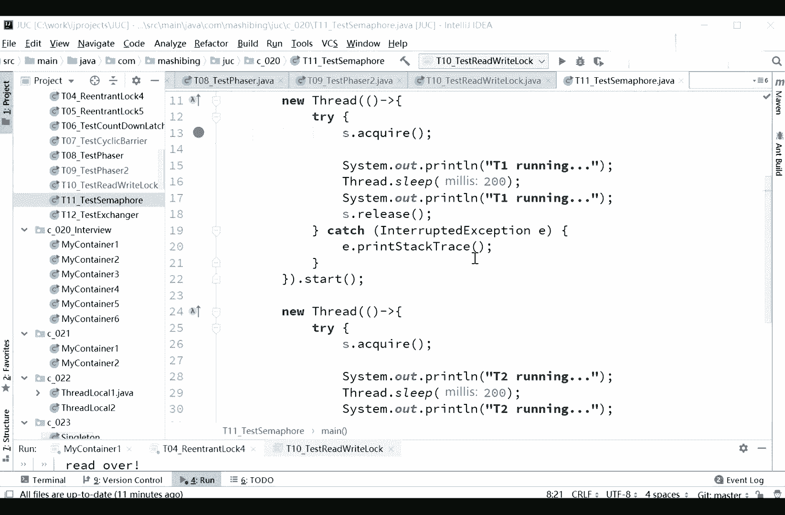
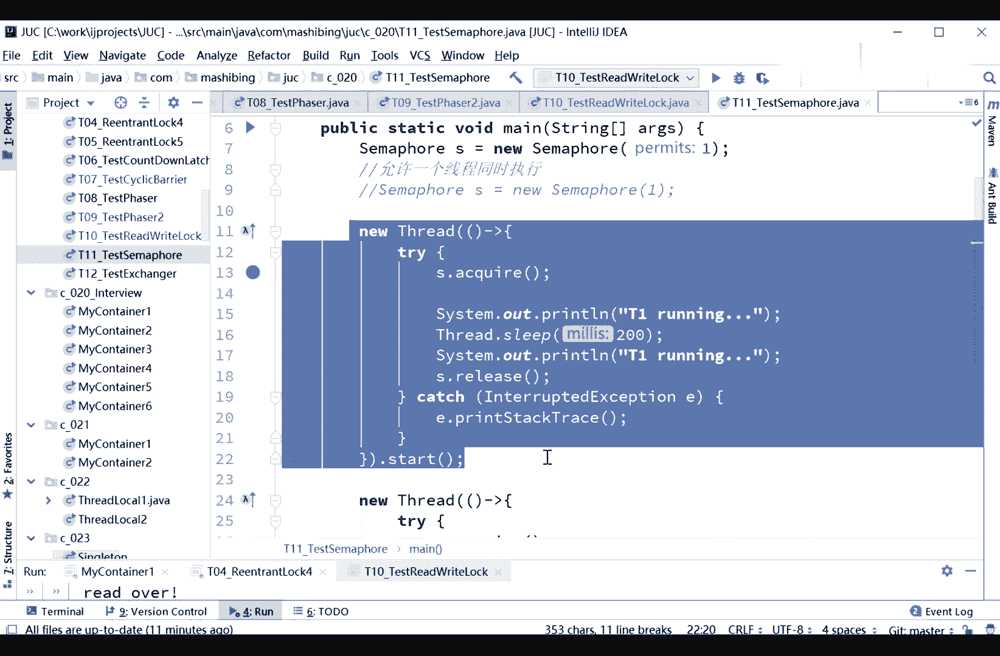
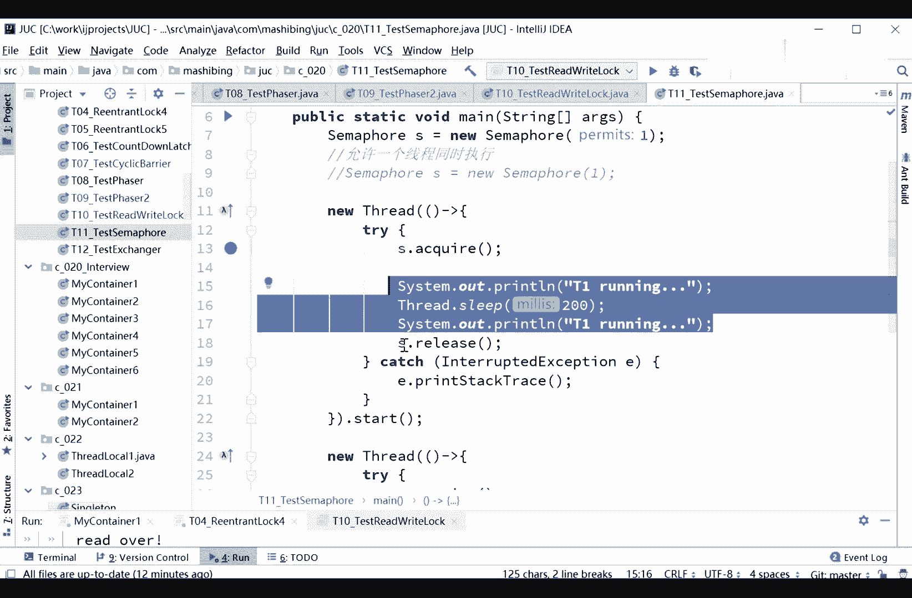
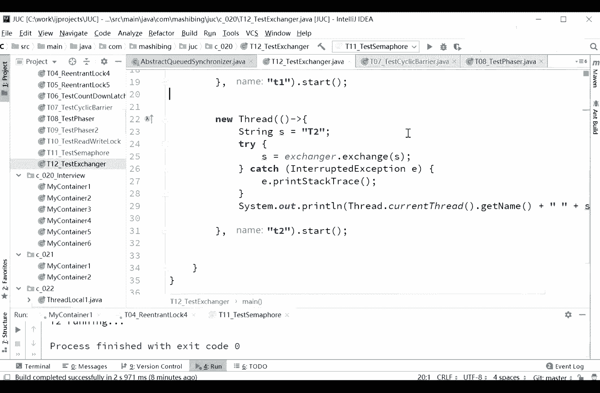

# 花了2万多买的Java架构师课程全套，现在分享给大家，从软件安装到底层源码（马士兵教育MCA架构师VIP教程） - P40：【多线程与高并发】Semaphore - 马士兵_马小雨 - BV1zh411H79h

好大家看这里啊，那个我们来聊这个sam这件事，sam呢叫信号量，sam for叫信号灯，灯塔是吧，信号灯这里面呢是有几盏sumer，你可以往里传一个数，这个数是promise，叫允许啊。

promise是要允许的数量，就是你可以想着有几有几盏信号灯啊，或者一个灯里面的闪着数字，到底允许几个来参考我这信号灯这个意思，那ser等于new ser，好看这里，太照顾每一个人啊，ok我们看这里啊。

这个simht是什么意思，有信号量，你远远的看着有个信号灯，那个灯亮着的时候，我就可以执行，不亮了，我就不能执行，大概就这么一个概念好，那怎么样才能执行，怎么样他不能执行呢，是这样来写，很简单。

sfs等于new sm for new thread，其其实我我我上次讲我记得的也得花了八个小时才把这个课给讲完，呃所以你说公开课一堂课顶三堂也不也也不太可能啊，哦看这里啊，而且真正理解透呢。

确实就得进行一些探讨，这个很正常啊，来s。acquire好，这个方法叫阻塞方法，阻塞方法意思就是说我如果快点不到的话，我就停在了，acquire的意思是什么呢，acquire意思叫得到取得。

英文取得的意思是，我认为这里写的一好，我取一下，快一下，它就会变成零，当变成零之后，别人是a qui不到的，对17年我也讲了八个小时呢，我们我们这次还讲了全加了很多内容。

所以不太可能能够说短时间内给大家讲完啊，大家理解好吧，奖金为主，后面你看视频的时候，你可以快快放两倍，三倍好看，这里啊s的快快的意思是你看啊，我们这个信号量上面写了个一好。

acquired的意思是我拿到这个一给它变成零，减个一变成零，这个呢是快。

ok然后呢继续执行执行执行执行执行直接完了之后。

注意看，当这个程序结束了之后，结束了之后呢，他就会县城结束，我在这里写，要写注意要release啊，s。release，我执行完该执行的，所以呢我把它release掉。

acquire的返回值，我看看是什么，是void，这里我写的稍微有点问题啊，应该是，finally啊，对不起，看到没啊，s。release release的意思是呢，诶他又从零又变回一了。

我从一元变回零了，表示我得到了，然后呢从零变回一了，表示你其他人可以继续得到了，大家看两个线程，现在我只有两个线程，第一个线程，第二个线程两个t1 t2 t一得到了，那么t2 就得不到p2 。

人物得到必须得等t一执行完了，这个就是acquire的含义，t20 t2 了，必须提一般的t一呢嗯弄完了t2 才能执行，所以这也是一种锁，这锁的意思呢就是看你在这里promise写了多少个，你要写两个。

这俩就可以同时执行，看这里这俩同时执行代表着就t running，中间可能会打印t2 running，我们来看一眼，你看啊t一软件t20 。

t一软件t2 杠0k所以samer的含义我想大家伙一看就明白了，sample含义是干什么吃的呀，这个自己能呃总结出来吗，sf行业干不干事了，限流哎这个是限流，这个才是限流是吧。

就最多的时候我最多允许你多少个线程同时在运行，就这么个概念，所以sam for你可以用哪种地方呢，哎可以用在，比如说我们卖票，我们最多开五个窗口，那你这三个号就写五，只有五个三个孔。

就是同时在买票的人只能有五个，好了，所以这是sm的一个概念，好我现在看大家的问题啊，我觉得待会儿提的问题挺好玩的，我都不知道你们是从哪想到的，这个是做限流啊，aqua从哪里获得，现场是有队列吗。

听我说aqua，那快乐的意思是获得这把锁，大哥，我可能我我我我不记得我说过从从哪获得县城大哥是这个县城，要想继续往下执行，这个县城到这儿了，要想继续往下执行，你必须得从sam for里面获得一个许可。

他一共有五个许可用到零了，这个时候你就得给我等着，你可千万别说获得某个县城acquire得到的嗯，明课不要说清楚，没有这个概念，千万别混了啊，那那你如果说那个比如说new fixed特别to。

一是感觉差不多，new fixed thread pool，好认真听，这个线程池里面永远就只有几个，你写new fixed threp，二呢就只有两个线程，但是summer呢说的是。

我有100个线程同时运行的，同时运行的只能有两个，听懂我意思了吗，雨落同学给点反馈啊，你fixed frap，你线程池线程只有一，你你固定的就只有那么几个，sam是来控制。

可以有好多个线程同时acquire，但是同时acquire到的就只有两个，也就是只有两个线程在同时运行，诶这个地儿这我为什么在这个地方很容易卡住啊，那个谁还没给我反馈呢，这这个这个这个刚才问的语录嗯。

啊线程数不一样，那跟那跟fix有什么关系啊，跟fix的说的作用是一样的，为什么总有这样，他线程池是往里现成线程池里面扔进几个县城去，要执行什么，要不要同步，那是另外的事情。

这个我们讲的是要现成同步的是这几个线程，你可以有一堆的线程池，然后这几个线程里头可以同时有多少个执行，你肯定是哪哪哪哪卡着呢啊这是完完全全没有半毛钱关系的事情啊，看这里，这是机动车道，八条车道。

但是很不幸的是，前面有一个收费站，只有两个，好八条车道，八个县城或者甚至更多的车都可以同时往这冲，不好意思，到这儿，谁acquire得到其中某一个谁执行限流。

但是你这八条车道里面的线程扔到线程池里没问题啊，没问题啊，理解意思吗，嗯，所以这里的限流呢非常类似于呃车道和收费站好吧，也不管车道和收费站啊，或者是买票什么的，都都是一个概念啊，嗯semer公平好。

我们来说这个公平的是跟表面上很像啊，跟表面也没有关系，肯定是拿卡着呢，语义上完全不一样，那就是个线程池，你往里头扔线程用的不涉及到同步的概念，那县城里边要不要同步是两回事，这个是要做同步。

是线程之间呢要进行互相之间的控制和访问，要进行同步是两回事啊，千万别混一起，你尤其是跟面试官聊的时候，你要这么聊的，聊的话，面试官直接那鄙视的小眼神就开始看你了啊，好关于sam for，看这里。

you new sf，注意看下面有第二个promise，可以12号bin，这里呢是有一个fire还是呃公平还是不公平的，默认是非公平，纯处公平，但是公平这事我说过了，还是那句话，是有一堆堆列在那等着。

是大家伙过来排队，如果我们用刚才这个例子来来举例子的话，我也想啊，刚才就是车车道和收费站这件事来给大家举例子啊，其实上呢是这样一种情况，就是现在假如说我们有四辆车都在等着进一个车道啊。

好后面又来一辆新的的时候，他不会抄到前面去，这叫公平，他也必须在屁股后面排着，这叫公平，听懂了吧，就这意思啊，哇居然可以什么什么什么可以s x，你在说什么，所以说内部是有队列的嘛，对内部是有队列的。

不仅内部是有队列的，这里面用到的所有东西，我今天讲的所有的从头到尾，retrock condolcelebra，fire，rylock summer，后面我要讲的exchanger都是用同一个队列。

就是同一个类来实现的，这个类呢叫a q s啊，啊我们后面讲原理的时候再来聊好不好，fire extends sink，sink，他从谁记仇，看到了吗。

就这个类abstract cute super iz，这个里面维护了一个队列，这个队列呢叫first in first out的先进先出的队列，它实际上叫c s c r h队列。

我们讲原理的时候再来聊好吧，我们先来看怎么用，你们先学会怎么用，再来聊原理，不会用的时候可不跟你聊原理啊，所以所有的东西啊你先学会怎么用，你就理解哦，里面是有一个队列没错。

当然各位同学现在已经感受到了有队列，但这个队列是怎么实现的呢，就就通过通过它来实现a q s。

