# 花了2万多买的Java架构师课程全套，现在分享给大家，从软件安装到底层源码（马士兵教育MCA架构师VIP教程） - P41：【多线程与高并发】Exchanger - 马士兵_马小雨 - BV1zh411H79h

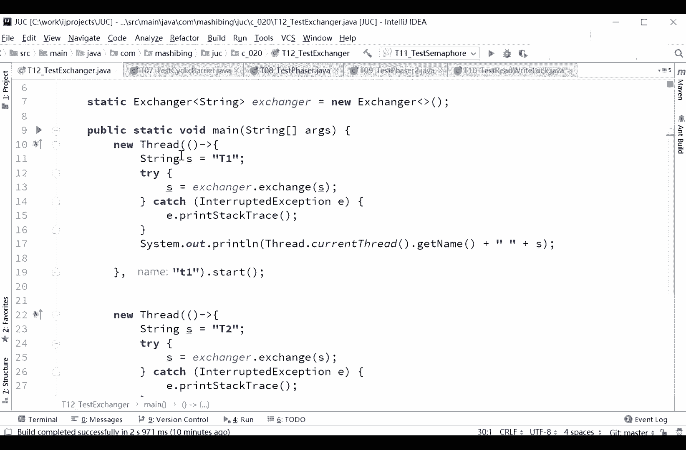

告诉你没法使用公屏，看到这里你自己好好想一下啊，这有什么疑问，能不能探讨这里呢，我定义了一个exchanger。

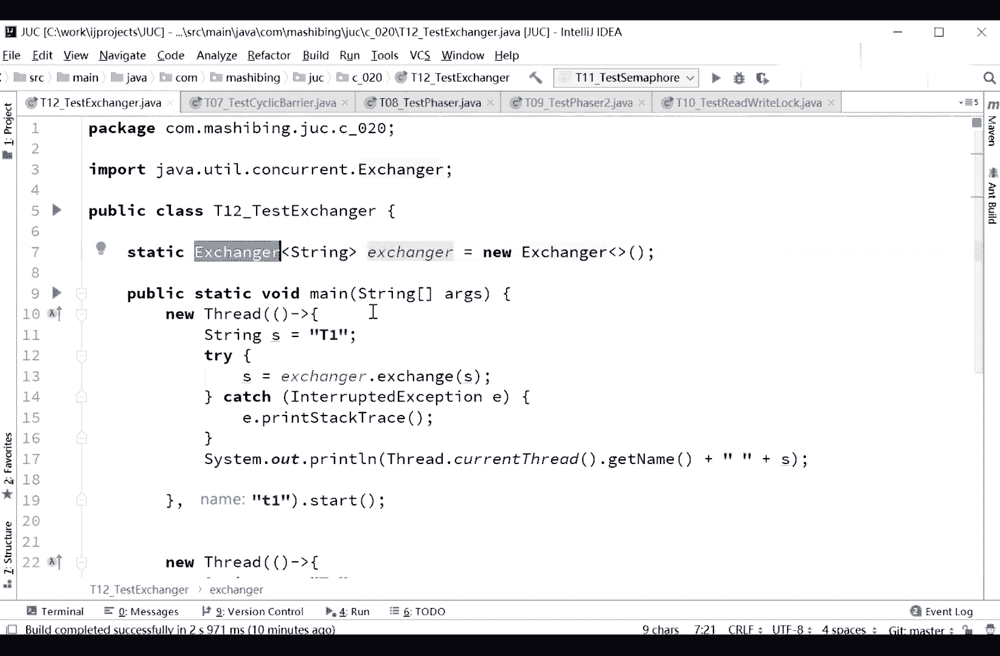

exchanger叫交换器是吧，就是俩人互相之间交换和数据用的，那怎么交换呢，看这里我第一个县城，第一个线程内部有一个成员变量叫s，它的名字，它的十个字符串类型叫t一好，接下来呢我把这s的值等于什么呢。

让exchange exchange s哇塞好好绕啊。

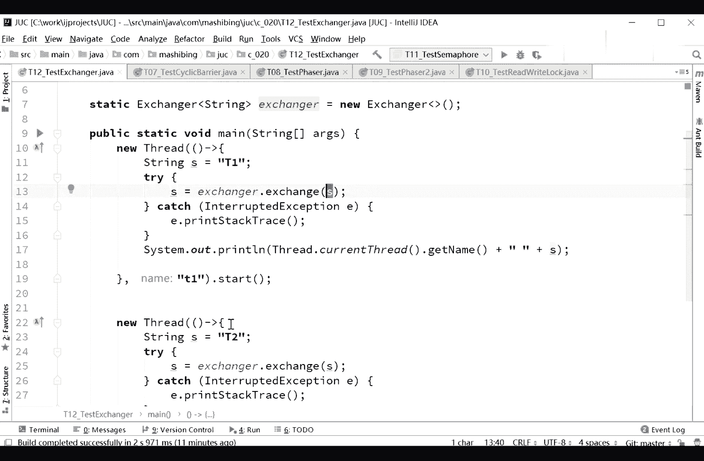

exchange exchange s好。

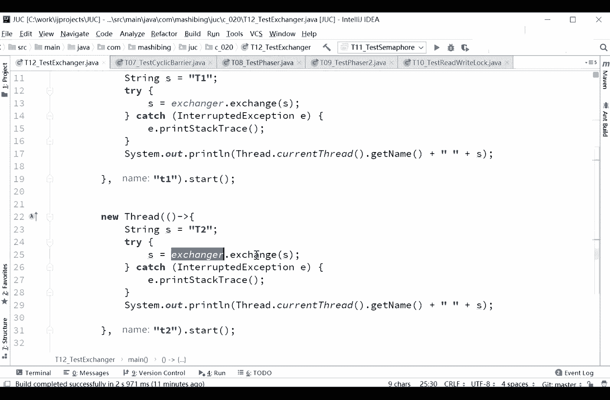

第二个呢也是它的名字叫t2 ，仍然呢把它这个值呢也是exchange exchange s。

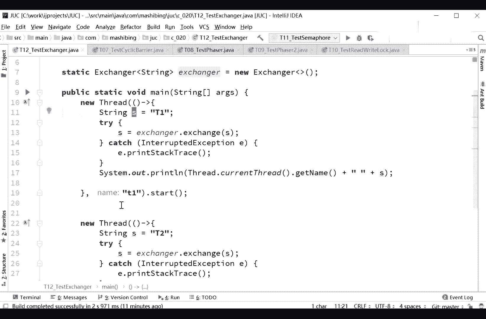

大家知道啊，我这个t一的线程。

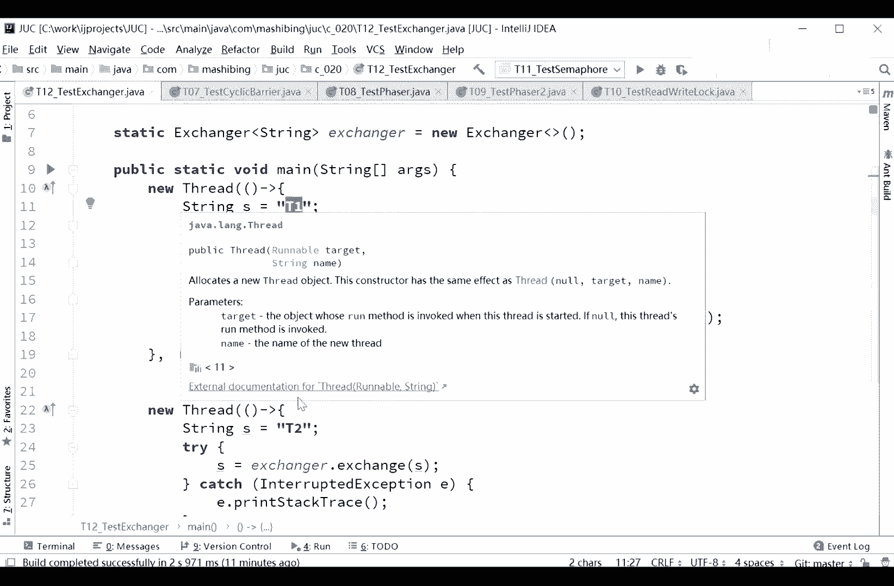

t一这个线程它里面的s名字叫t1 ，这个是没问题的。

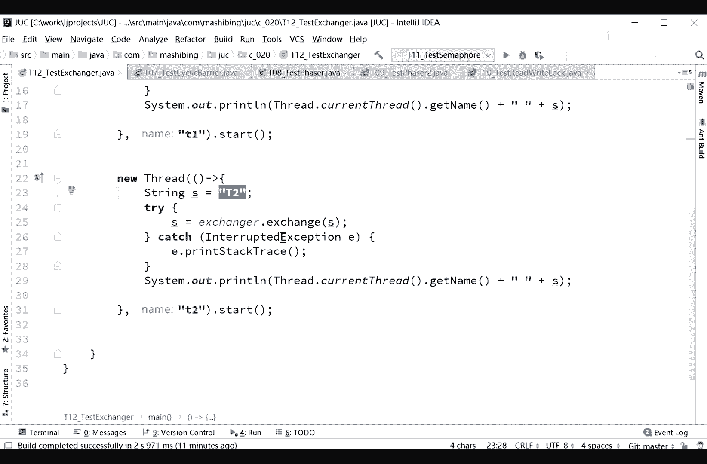

对吧好，第二个线程，它里面这个s的名字叫t2 。

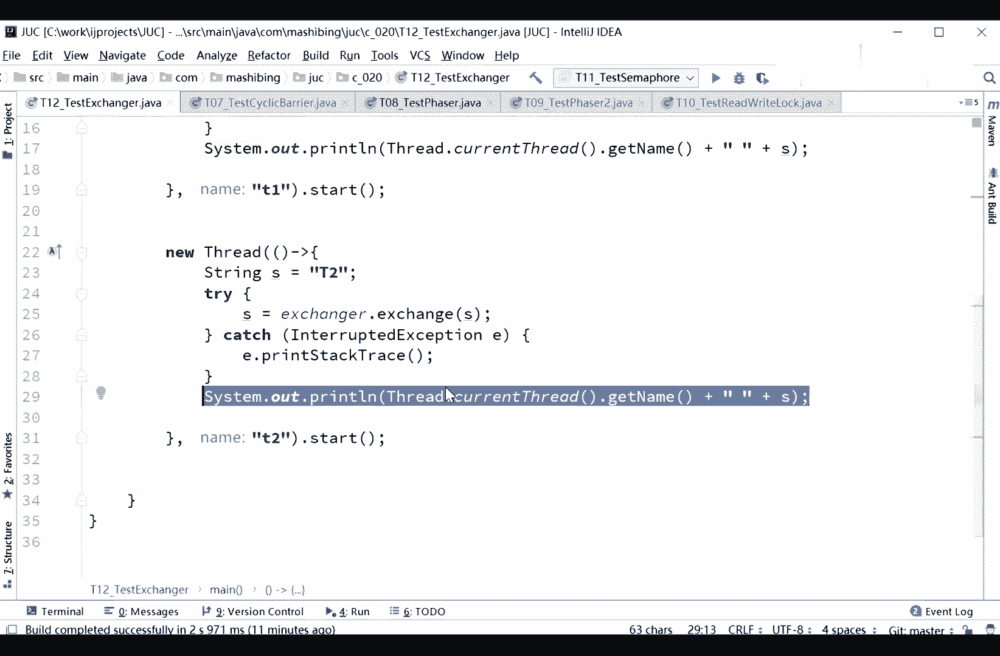

当我们经过了一系列的交换之后呢，然后我们最后在打印最后这个s的时候。

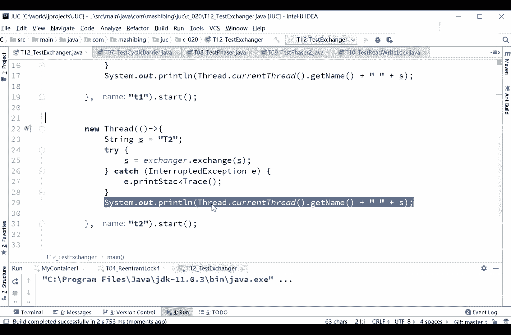

打印出来诶，你会发现呢这这俩哥们儿交换了一下。

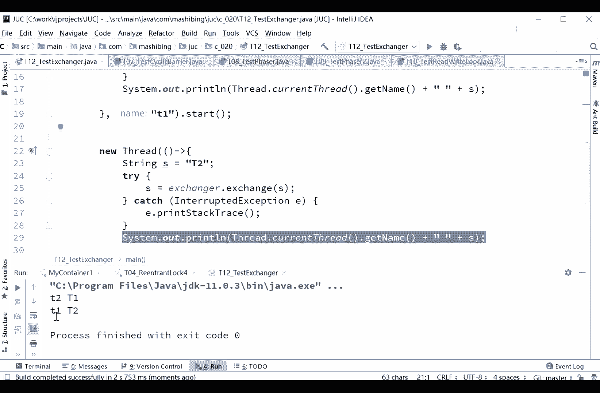

嘿嘿t2 t1 t2 里面变成t一了。

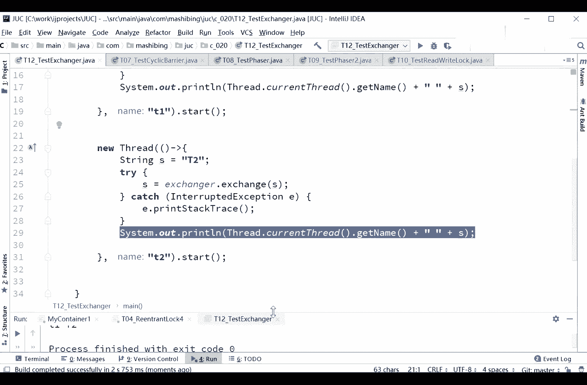

t一变成t2 了。

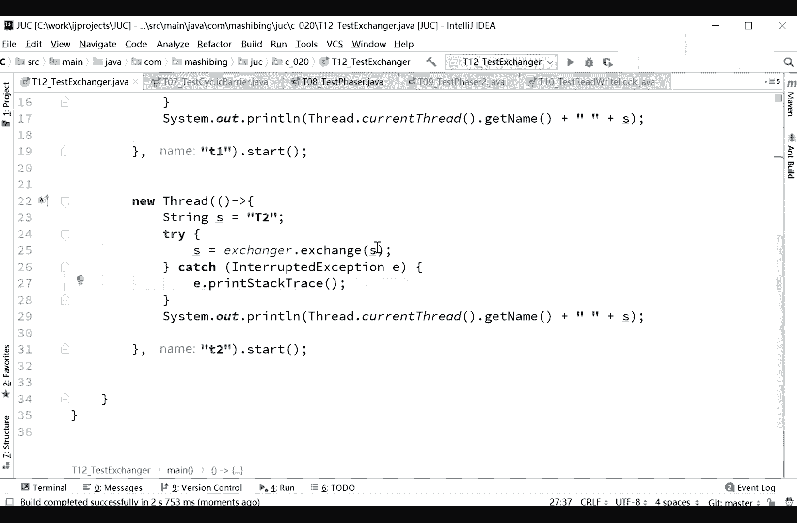

线程间通信的方式非常多，这只是其中一种啊，就是线程之间交换数据用的，而且这交换数据呢是exchange exchange，它背后呢还有一点cyclic，barrier的概念啊，什么意思，我们怎么理解。

就这个最好这个啊，首先呢我们有一个exchanger。

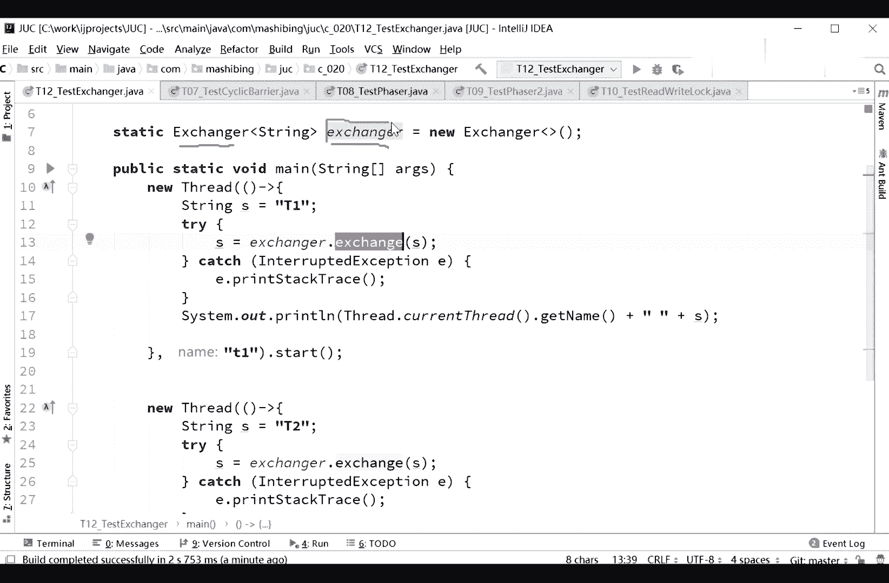

你可以把它想象成是一个容器，这个容器呢。

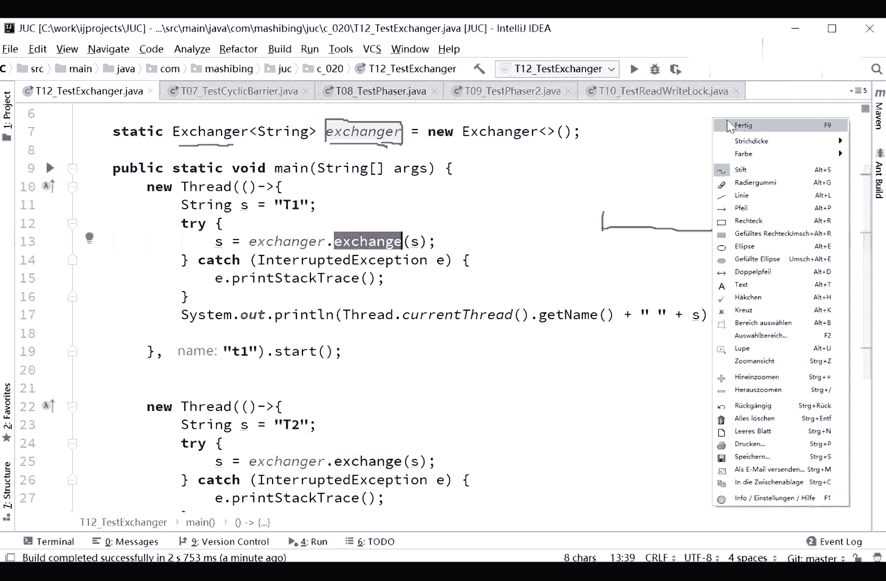

可以有两个值，可以有有有有有有两个格，给大家的批评画吧，我们来聊这个exchanger的概念啊，x exchanger，好两个线程啊，这是第一个线程，在第二个线程需要注意的是。

我们两个线程的都调用了exchange exchange方法，注意这个exchange exchange方法是阻塞的，这是我们的exchange，在这里面呢有两个啊，一个，两个位置。

两个两个位置注意看好，第一个，第一个线程执行到exchanger exchange的时候，这是第一个线程执行到这句话的时候，阻塞我再说一下阻塞exchange exchange方法啊。

exchange的时候阻塞，但是需要注意的是，我这个方法呢是往里头扔了一个值，对不对，这个值会传哪去呢，你可以认为这里的我们的t扔到这儿了，从这注意它阻塞了，然后第二个线程开始执行，他也执行到这句话了。

exchange了，也执行到这句话的时候，ok他把自己的这个值t2 扔到这，接下来这俩哥们儿之间交换一下，里边儿，好俩哥们之间交换一下啊，他们两个之间互相交换一个值，这个t2 扔给t1 。

这个t一扔给t2 ，两个线程继续往前跑，好理解了吗，我们先说先不先不提后面的问题，先说我刚才讲的概念有没有什么问题的，没问题吧，这是exchanger的概念啊。

好听我说exchanger只能是两线程之间，所以你刚才提的三个线程，不知道三个线程怎么交换，不清楚三个线程你只能自己同步，如果只有t一执行exchange，t2 不执行，会怎么样，阻塞呀，刚才不说嘛。

阻塞等着吧，什么时候有一个线程过来在上面执行，执行了第二个exchange，他两个就交换了，就这么简单，而且我想问你的是，你三个线程交换是什么意思，怎么交换，是a给b还是a给c，还是c给a还是c给b。

你得规则的定义还是a给了b b再给csb，再给c，c给d，所以你不能张嘴就来啊，说这三个线程怎么交换，三个线程本身就没有交换这个概念，他们只能两两交换这东西啊，只能两两进行，没听说过三个在那交换的。

