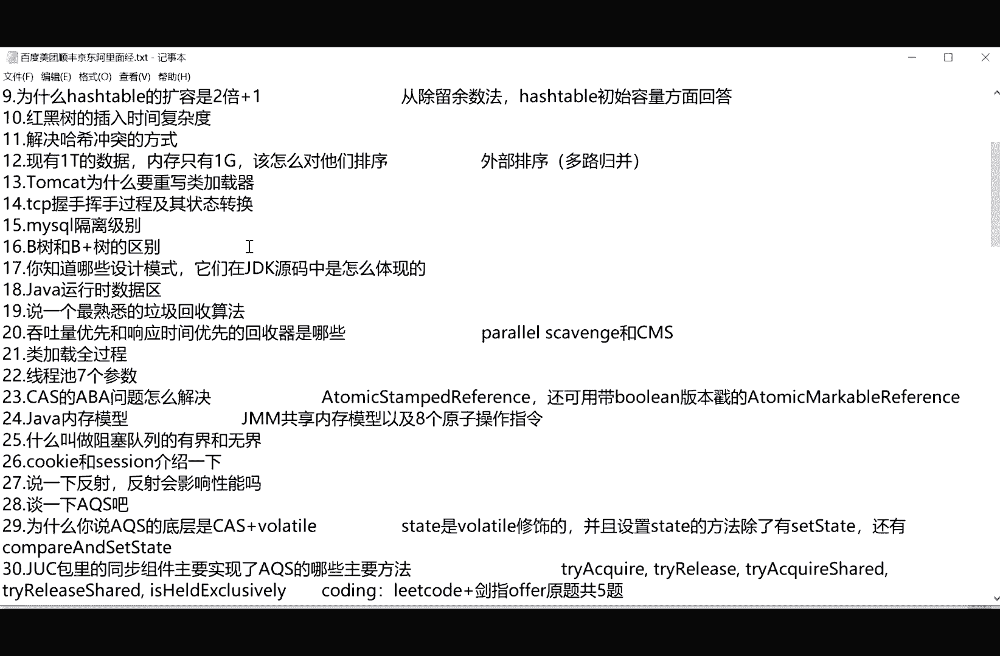
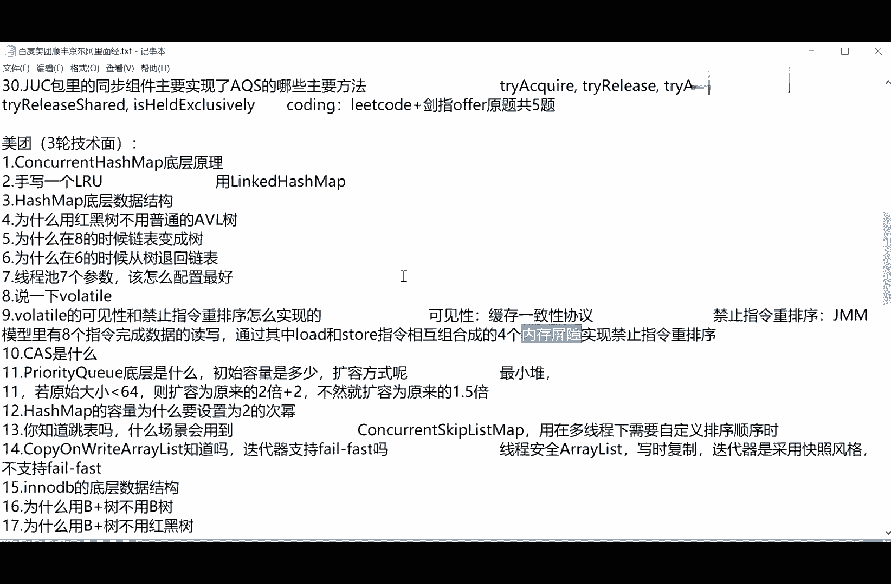

# 花了2万多买的Java架构师课程全套，现在分享给大家，从软件安装到底层源码（马士兵教育MCA架构师VIP教程） - P42：【多线程与高并发】第四天课前复习和课程规划 - 马士兵_马小雨 - BV1zh411H79h

好大家看这里啊，前面三节课呢我们是聊了这些内容了，就现成的基本的概念，这就不多说了，非常简单呃，我重点讲了synchronized，这个synchronized，你看啊，在这个面试题里头呢，他就已经。

问到了好几次可以这么说啊，你找找看这个synchronized呢。

问到好几个词，sunonized reaction。

lock的底层实现和重录的底层原理是吧。

synchronized的升级。

我看在哪里，啊又又问symphonized reaction lock的一同。

synchronized的升级用太多了，找不着了。

嗯锁的四种状态，他们有没有那个新生代合金子，锁的四种状态和升级过程，这个就是所升级的概念，所升级的概念呢在secret我已经给大家讲过了，他所谓的我讲的是三种状态，反正他是所谓四种状态呢。

其中有一种就叫无所，这个synchronized端上来之后，要锁定某个对象的时候，首先是一个无锁的状态，没有锁，ok然后呢接下来是偏向左，就是这个只有一个线程去占有这把锁的时，候，这把锁呢就是啊。

我说我在脑脑袋上有两位来记录啊，这是一把偏向锁，只给了一个线程，用接下来升级成为轻量级锁，所以它中间呢有一个所升级的过程，这个synchronnet所升级的过程，从今年看。

这些一线互联网的大厂已经开始猛问了，还有volatile，那我讲过这些问题了啊，然后volatile呢也问的特别多，关于a volatile呢，问得最深的呢其实是这道问题。

volatile的最深的问题是volatile的具体实现。

没想到他会问这样的问题。

voluntel的具体实现。

还有看这里这个问这是问的最顺利的问题，叫volt的，大家我跟大家聊过，这个可见性和指令重排序，这是窝窝头的作用，那么他问的是呢到底怎么实现的啊，这是美团问的，这比较这就比较讨厌了，呃。

因为这个问题呢我是在讲这个gmm的时候，才会给大家说这个问题啊，呃j m m ja memory model，就是咱们现在是上文断成高并发，我会讲到这个问题，所以现在呢你答不出来也正常。

这个是怎么实现的，一个是缓存一致性协议啊，msi对真真的说了，那么禁止指令重排序呢，主要是添加内存屏障，添加内存屏障，内存屏障呢一共有呃四各就各种组合，在你的写入和读存取之前添加内存屏障。

禁止它质量重排序，就干这个使的，这我们讲到gm的时候再来说这个问题，反正总而言之一句话，现在问的是越来越底层，越来越深入，所以大家呢做好心理准备，好好的努力啊，不过大家也不用担心呃。

课程讲到咱们这种深度的也不多，只要你使劲的把这个课程消化掉，我相信你还是能在面试之中的脱颖而出呃，atomic这我就讲了，讲了几个就a atomic integer，atomic long。

还有呢long adder，啊以及这个嗯at tell me alone啊，就加srt的各种各样的对比，然后呢我们聊了这个j u c的同步锁，lock，condolege，sally，barrier。

fer，right，right log，这部分我没有讲，但是我看到有的他在面试题里头，居然开始问这个了啊，stem log给大家留一作业，你回去查一下这个stem lock。

stem log是rrolog的一个升级态，比realloc能稍微的还要控制的更好一些，sam信号量用来限流的exchanger，两个线程用来交换数据的呃，我回去之后翻了一下，因为因为多线程和高并发呢。

我需要查好多好多资料，然后呢，把各种书上的内容给大家综合到一起，不小心落了一个lock support，一会儿，今天我们先把这个补上啊，log ort，那么我们回到这道面试题吧。

schnet和reaction lock到底有什么不同啊，synchronized和reaction log有什么不同，回想一下sychronized research log，人不懂的，自动解锁。

reach logo需要我们手动加锁，手动解锁，religion logo可以出现各种各样的condition，那这condition代表什么呢，condition代表的就是你不同的等待队列。

srt是做不到这一点的，ok底层的直线呢ranch logo呢是cs的实现，那么synchronized呢它默认进行了四种的锁，这个锁的状态的升级，这就不太一样好，我们今天讲什么内容。

我们今天呢第一个呢讲这个log sp，把遗留的这个lost ort讲给大家听，这个也比较简单，第二个呢我们由于我们学了这些个所的呃，基础的技巧之后呢，我们来看看，看两道面试题，我给大家讲两道面试题。

接下来我会给大家讲那些所这一集，这里面所有的锁基本retry，locon lecelebra，对我就不念了，总而言之，里面所有的锁除了logo之外，locbd相对底层，其他的这些锁都是基于谁来实现的呢。

都是基于aq s来实现，今天我教大家怎么样去阅读这里面的源码，重点呢教大家源码的阅读技巧，源码呢层出不穷，生生不息，掌握了源码的阅读技巧，大家培养起来对原阅读源码的兴趣，之后，好多代码呢你需要自己去抠。

抠出来啊，才可以才是你自己的啊。