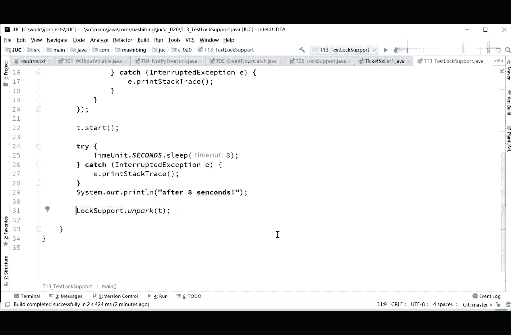
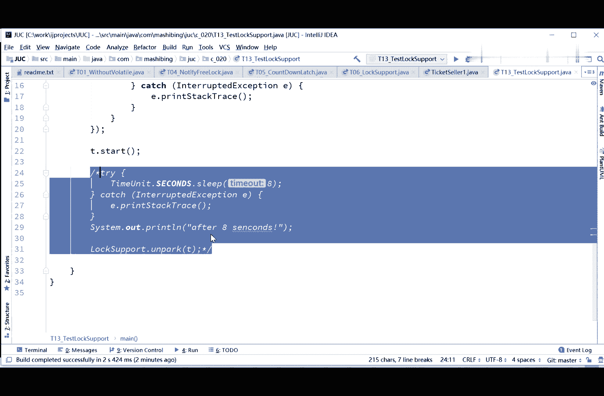
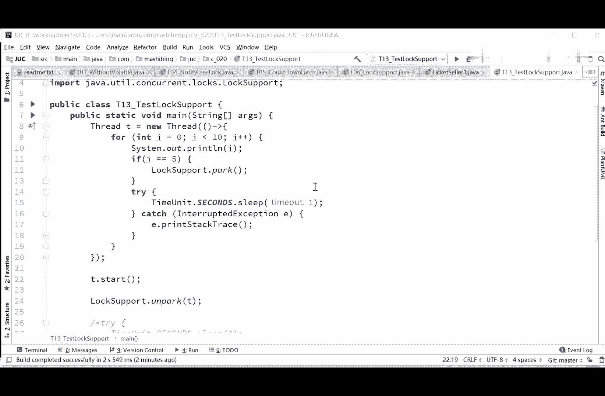

# 系列 3：P43：【多线程与高并发】LockSupport - 马士兵_马小雨 - BV1zh411H79h

我们要讲的内容啊，嗯，第一个呢我们先讲这个lock po，咱们上演一些小程序的，后面我们加一个小程序，就是log support，呃这个lox support呢，其实非非常简单的一个用法来测试代码。

比如说我们来一个程序嗯，没有thread，cr给它一个定义，threat t等于new thread，在这个县城里面，写一个小小的循环，for i i等于零，i小于十吧，i加加，然后呢s out i。

这个非常简单啊，嗯unit第二second，不小心放大了，一个数字出来，我们定义了这样一个线程啊，然后呢呃我们来让这个线程启动，t0 start，那么大家可以想一下呢，老外打印啊，我们来看一眼，跑一下。

012341直打印到九啊，然后就不演示完了，这个小程序非常的简单呃，现在呢现在以前的时候吧，我们就是说很难控制说指定某一个线程，某一个具体的线程啊，让他阻塞和停止，但现在是可以了。

现在可以的原因是什么呢，是因为呢在jdk一点一点几之后啊，这个你自己去查logs，它添加了这样的一个api，这个app叫做log ort，看这里循环的时候这样来写打印i啊，if i如果说等于五的话。

等于五的时候，like support their park，park是什么意思，park是停车的意思，locked support所的支持，其实从这个角度上来讲呢，这个类呢是专门为了实现所支持的支持。

怎么去实现锁的这么一个类，但是我们可以直接拿来用，love support park，park的意思是停车，当前线程停止等于五的时候就直接停止了，看这里跑一下，01345好，打印完了。

你看到了整个县城就停止了，阻塞了，停在这儿了，那好那我们怎么让这个线程继续运行呢，继续运行，我们让线程继续运行的话呢，我在主线程里让它继续运行，专用机运行，啊这样来写啊，我在主线程。

second the sleep，我是让它睡八秒钟吧，在主线成八秒钟之后，我才给他解开，after eight seconds，那现在已经是八秒钟之后了，他才会打印出这句话来，打完这句话之后呢，t点。

unpark，unpark的意思，哎哥们儿，你别在那儿停着了，这个县城您别在那停着了，请你继续往前运行吧，来看一下这个小程序的执行结果，01345好五停，这时候主线程呢在那等着八秒钟了。

after 8秒钟，6789，立即续往下运行，所以log ort的给我们实现了什么功能呢，我们总结一下，log ort们实现的功能是当前线程阻塞，而且你回想一下，同学们。

在我们没讲loco locp之前，我们让当前线程阻塞，我们一般怎么做，还记得吗，回想一下，对你得加在某宝锁上，对风吹的同学说的非常对啊，他说用了weight或者await，不管用哪个都没有关系。

但是这个呢你是必须得有一把锁的，得加在某一把锁上，你比如说你想用weight的话，你是不是得用synchronized的给夹子，夹子夹在某宝锁上才可以锁定某个对象，才可以，log ort是不需要的。

log ort想停，想什么时候停，就什么时候停，而且如果说你呃原来像原来啊，我们要想叫醒一个县城的话，叫醒一个线程的话呢，我们得用notify，ok叫醒一个线程的时候呢，我们要用notify。

而且叫醒一个线程的时候，实际上这个线程呢，是往往是放在一个等待队列里的，你要叫醒某个指定的线程是非常费劲的，但是logs pop不一样，log ort有了之后，我们要叫醒某个指定的线程。

直接写t就可以叫醒这个线程啊，t这个线程还有一个，还有一个我们完全可以干嘛呢。

我给大家做个实验。

大家看这里，我在t。start之前啊，看这里，t。look support，点on park，唉这就比较好玩了，我先让他不停车，然后我再让它启动跑一下，看看效果，他本来正常到五这里啊。

他应该是停住的是吧，on park to the start，托尼由于还没有启动啊，ok你看到效果了啊，看到什么效果了呢，你会发现你看啊，分析一下我们这个小程序的执行过程啊，这小程序呢呃是这样的。

我们有一个呃t这个线程，t这个线程呢，他本来12345~5的时候，预期应该是停在这儿了，对不对，然后呢执行的时候是这样来执行的，这t线程已经开始执行了，与此同时啊，注意这句话。

实际上是和t线程同时开始执行的，我这么好，大家应该能理解吧，因为这是我们的主线程test data了之后，这句话已经看已经已经执行了，on park已经开始执行了。

也就是说on pk这件事是在这儿执行的，可是这时候替这个县城停车了吗，没停啊，他到五才停，对不对，你上来之后先不让他停，这说明一个什么问题呢，说明on park可以先与帕克调用，我再说一遍。

on park你可以在park之前调用，回想我们一下以前的，我们能在weight前面调notify吗，他还没有weight呢，你notify起作用吗，起不了，你必须得先wait了掉。

notify才起作用，但是park和on park不一样，on park呢是上来你可以先调，先调了，就代表什么，先调了，代表这个县城里面的某个状态改变了，说我已经给你放行了，即便是你后面要停车的时候。

你也停不住了，为什么，因为我on park里头告诉你了，你不用再停车了，你停车也没用，所以这两个呢，你可以认为on park给它变成了一，park给变成了零，我上来的时候先变成一了。

你帕克呢你发现变成一了，你也就别继续往前运行了，你直接变成零顺，直接直接往前走就行了，等于我这两个已经帮派，已经把你这次派克给你取消了，就这个意思，所以它的用法上要比synchronized要比。

