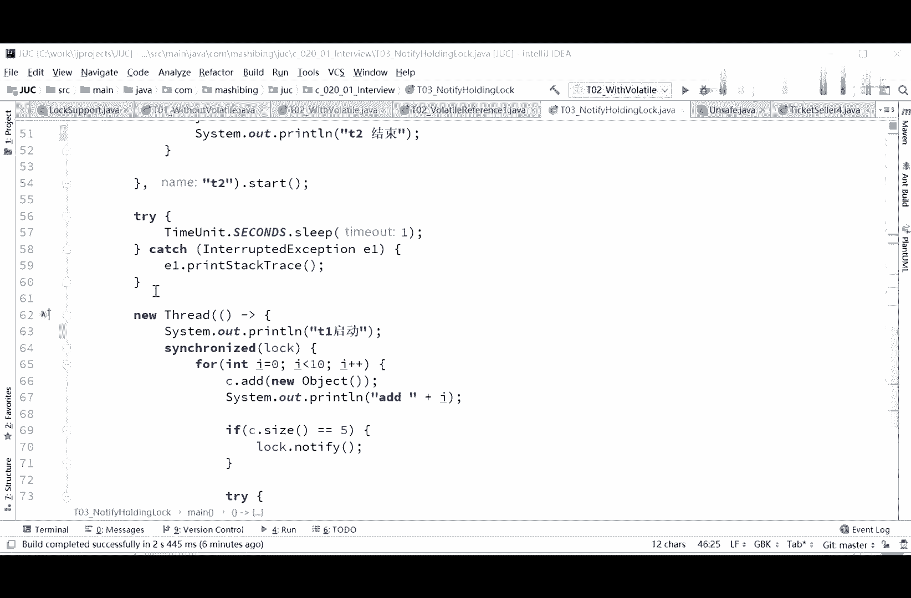
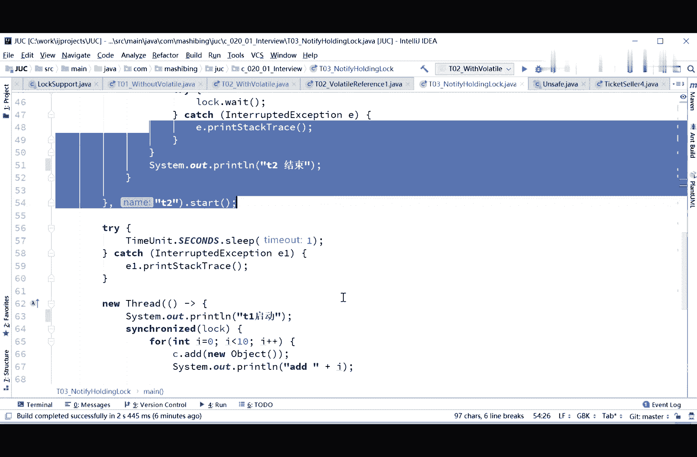
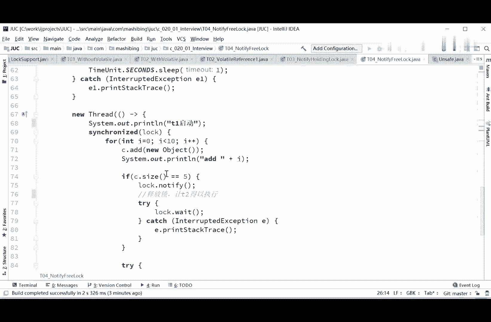
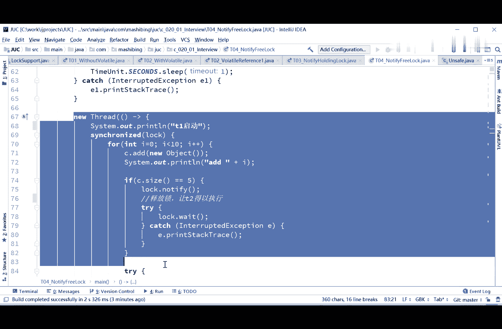
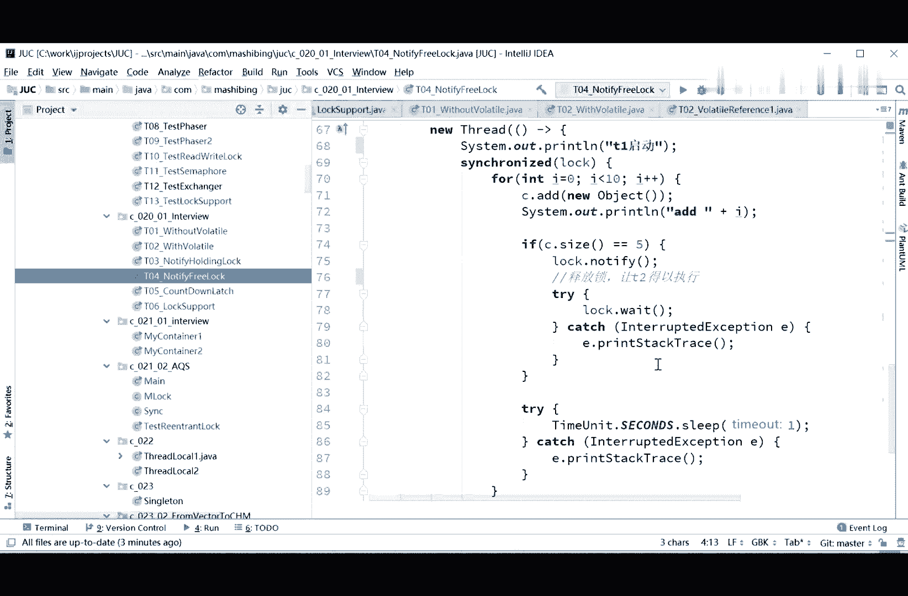

# 系列 3：P45：【多线程与高并发】面试题一(2)_wait,notify - 马士兵_马小雨 - BV1zh411H79h

看看这里啊，我们看第三种写法啊，就这种写法先读一下，先读还是先读，加了一个list，这加不加vd都无所谓了，大家看这里，这里呢我用了锁的方式，fal object lock等于new object。

第一个线程，synchronized lock，加锁，加锁之后启动，启动完了之后，如果size等于五的时候，你不是在这循环吗，如果说size等于五的时候，lock。weight，如果size不等于五啊。

sorry，这里先启动的是第二个线程，观察者那个县城啊，跟旁边观察着，如果size不等于五，我就wait这句话i意思是什么，你你你你你你，我们往里头往这个容器里头加内容啊，一个一个加。

刚开始呢这个第二个项链，就其中我在观察着，如果说你不等于五的时候，我就wait了，睡了在等待队列里睡着了，然后呢我是我保证先启动的是第二个线程。

保证先启动第二个线程，我启动第一个线程，第一个线程往里加，什么时候，size等于五的时候，我让lock。notify，哎，这件事情到底行不行，你分析一下，来先给大家30秒钟消化一下，刚才这个小程序啊。

给大家解释一下这个这个流程，就是我们还是这个容器，这个龙技能首先启动的是t2 观察者，现场在这儿观察着，上来之后一观察，这哥们还不等于五，不等于五，怎么办呢，我就wait了，等着了死，就是在这睡着了。

阻塞了，然后我启动第一个线程，第一个线程呢往里装，往里装，往里装，装到五的时候，如果再等于五的时候，我notify，我把你这根本给你叫醒，叫醒了你不就继续往下执行了吗，这件事总是可以的吧，好大家看这里。

wait完了之后把你叫醒，叫醒完了之后，你就应该继续往下执行打印这句话了，t2 结束，来分析一下啊，看看这件事行不行，我们先来跑一下，这样启动第二保证先启动了，t一启动0123456a还是不行。

一直等第一个线程加完了，第二个线程才结束，好分析一下为什么不行，县城还是不可见，真的是你你想你想多了，这个跟县城可见不可见就没有任何关系了，因为这里我们是用了synchronized的weight。

notify，啊对啊，不知道同学已经发现了，对你记住这一点啊，这个notify这东西，我们说这也是考经常考的一个重点，notify这东西是什么，不释放锁，好吧，不释放锁，不释放锁这件事就就比较恶心了。

你想想看，其实t2 ，这里呢我们想synchronized的执行的时候，你lock wait回来了之后，需要注意的是，你还这里头其实有一个隐藏的点，你wait完回来之后，必须要拿到这把锁，为了回来。

必须得拿到这把锁才能继续执行，可是很不幸的是，你虽然在这notify把人给叫醒了，叫醒没用，叫醒了，他也是在旁边等着，为啥呢，因为你本身这哥们儿你没释放锁，你只有打印完了，这把锁才释放释放了。

这哥们不是醒着呢吗，醒着呢一直在旁边等着这把锁呢，每次cpu调不到这个县城的时候，发现我要锁，我要锁，我要锁，结果要不着，他就只能在等着什么时候，等你第二线程执行完了，就是t一这个线程执行完了。

第二线能拿到这把锁才能继续执行，第二才能结束，这是weight notify的嗯，也是一种经典的用法，很多原来考，多线程的题啊，考的还是with notify，就必须要牢牢掌握。

好刚才这个小程序它的问题就出在这儿啊，我看不少同学开始提怎么解决了，没错解决是怎么解决啊，解决当然是这样来解决是吧，就是我第二个线都可以上来相位，他没有关系啊。

但需要注意的是呢，我的。

往里头啊加数据的这个线程啊，t一这个线程我让第二个等于五的时候，我让第二个线程notify，notify之后呢，我自己得去wait，我得让出这把锁来另外一个县城才能继续，好吧，来我们看看这个结果。

这就对了，天启动第一启动t一线程里头，如果再等于五的时候，它会wait叫醒t2 ，而且还会wait，所以t2 呢肯定是运行天已经结束之后，让出所t一继续运行，那我问大家一句，注意看。

其实我在t2 这个县城里，最后写了这句话，lock。notify，大家能不能理解，哈哈这句话不写会不会有什么问题，这优化不行，肯定是有问题的，t一就死在那了对吧，来问一下这个小程序的执行过程。

所以wait notify是必须你牢牢掌握的啊，with notif，这个执行的过程是这样的，首先上来还是那个容器，然后t2 上来呢，观察说这哥们儿不等于五吗，它不等于不等于u怎么办，它wait了。

他就在这停了，wait了，t一呢就往里装装装装装装装道路的时候，叫醒叫醒他，好叫醒他，完完了之后让自己去wait，一定自己得暂停停住，那么由于他自己wait了，所以他已经让出这把锁了，让出锁的情况下。

t2 继续运行，t2 t续运行会打印t2 结束，打印完t2 结束之后，注意你t一还在这里，wait，你起来继续运行，所以t一继续6789把后面的打印出来，然后t一结束，t2 结束，整个两个就全结束了。

好这是wait notify的写法，也是非常经典的写法，这就是为什么能体会成对出现就行，哈哈哈，不不不一定是不一定，在所有情况下都是需要成对出现的啊，好像一般都用notifall啊，jonas。

你好好用，好好想想，咱们这里为什么用notify，不用notifal or notifall，想想这道面试题，这是两个线程，只有两个线程，我一个县城在那跑着呢，notify的话也就通知另外一个县城。

不会有别的对吧，所以就就两个线程，当然你要是好多个线程，也就是我们后面这道面试题的时候，你就得用note all了，有没有和all是一样的，对没错，无非你你你就是那个杀鸡用牛刀呗。

本来你用单兵就可以解决的问题啊，你非得派一个团出去也可以，所以其实多线程的题麻烦就麻烦，在怎么写都可以，对你用notify就显得专业严谨一些，好了同学们，这是wait notify的写法。

以及它容易出现的问题，以及wait notify最核心的一点就是，notify它不会释放锁，而weight是可是会释放锁的，weight要回来继续执行的时候，还需要拿到锁才能继续执行。

