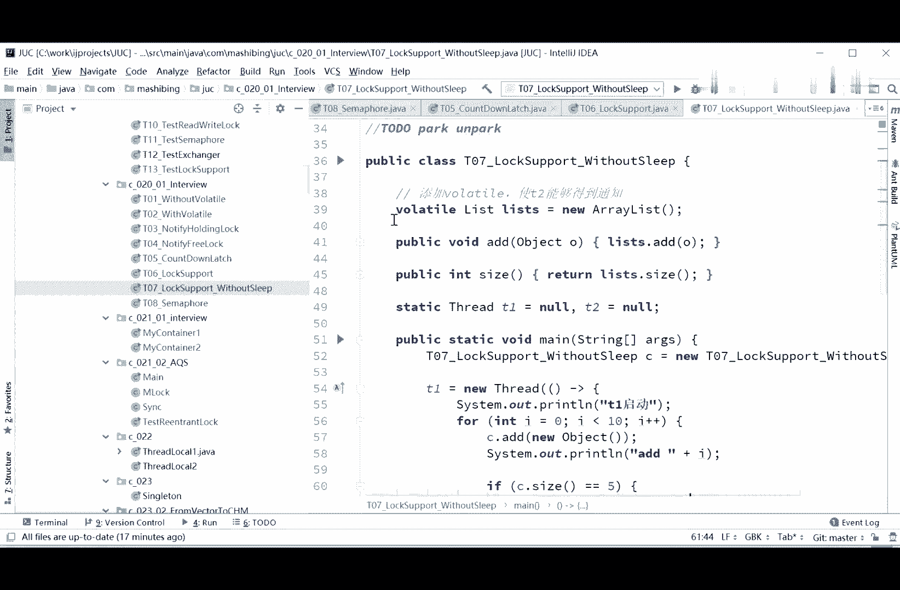

# 花了2万多买的Java架构师课程全套，现在分享给大家，从软件安装到底层源码（马士兵教育MCA架构师VIP教程） - P47：【多线程与高并发】面试题一(4)_Semaphore,其他思路 - 马士兵_马小雨 - BV1zh411H79h

说的有道理啊，这个sx提供了提供了很好的思路来写一下我们new javloss t08 ，我使用三个法。

变成c，当然必须得保证t2 先t一先和快而道。

the volt add thread t，172，这个有道理啊，我觉得sam确实有可能实现，062321，这不出无所谓了，然后t1 ，t一启动，i小于五的时候，第，i s b a quire。

呃快完了之后呢。

我们，打印，2=2小于五加加at的in等于no 5呃，在这个时候呢，我们the release release完了之后。

release完了之后，t2 呢得取个快。

点快，最后the release，然后继续，s点快，但中间必须得您什么意思啊，也不是很完善，也不是很完善，这里release完了之后呢，你不能够保证是t2 的快速道。

而不是t一马上又要快到了s是吧。

所以还是有点有点小问题啊，那么那么呃ss的思路呢应该是以呃是一个思路啊，这是我们用semh sample里面promise是一的保证，就只有一个线程运行，这是肯定的。

然后呢呃t6 线程在跑的时候跑到第五个的时候，我上来先acquire，快到了之后跑到第五，第五个完了之后呢，我release掉，然后这个理想情况啊，现在是t2 本把他的快到了t2 ，快到了之后呢。

继续跑，跑完之后呢，诶t一呢继续在后面的五个数里头，从从六开始啊，后面的五五个数里头继续取个快，但是这是理想的情况，可是很不幸的是呢，呃当你释放的掉这个seer的时候，你不能给我下一次保证一块的时候。

是我的六继续还是第二集训，所以这个这个也也不好啊，你得你得你得呃先控制哪个线程先执行，那你要精确的控制好的话，或者是condole，所以还是不行啊，还是不行，legend啊。

legend也提了一个很好的想法啊，可以对嗯，大家伙还是很有想法啊，for对你们说的非常对啊，这个时候呢你看上面是小于等于五了对吧，这时候我应该是从五开始，从五开始小于十再继续输出，都快完了之后。

out，然后最后呢在sdr release对，贴点重哈对啊，这个legend和henry啊，这两位同学有点意思啊，t1 t一上t1 john可以，没错啊，这个可以啊，这个这个应该肯定是可以的啊，对不起。

不是让t转，而是让t2 转一啊，所以这是第一，拉克尔天结束嗯，这个理想呢，当然现在的小程序还是有问题啊，好看这里啊，这个，这个嗯还是稍微的有点小问题还是有问题好，我们先说这个就join的这个方法啊。

还是用这个permits summer为一，第一个线程打印到四的时候释放三个符，释放为零，然后另外t2 这个线程理想情况他会拿到，刚才我们说有可能我们这个t一积蓄，但是呢我们现在是在中间调用了join。

调用join会代表什么，会把t2 这个线程等着t2 线程结束完了之后才会继续往下运行，所以加的这个t2 john也是非常好的，理想的情况，没问题啊，现在是非常理想的情况，但是很不幸的是。

还有一个还有一个问题，我们说上来不是t1 ，并不是t一先拿到的，这个sam for，而是t2 先拿到了上来，他就acquire，acquire，完了之后直接就结束了，然后release了。

同学们是不是又不对了，哈哈哈嗯好，你们发挥自由发挥吧，好不好，你们自由发挥啊，多线程呢就是大家自己多写写，多探索，探索新的思路，好多题呢解起来，由于各种各样的，咱们现在各种各样的所学的比较多。

各种各样的写法层出不穷，可以说嗯你们自由发挥好吧，又提了个思路啊，说不用锁t2 ，在t一里边start，然后在t2 join t2 ，在t一里边start，哈哈有点意思啊，但思路越来越开阔了。

呃这个意思是他的意思是说呢，您这t2 啊，您也别控制了，我t一来控制你的t2 ，然后来join可以这可以啊，可以大家听懂了吗，就是您在这提二start啊，star的都tr join，这肯定没问题啊。

很好啊，你开脱了老师的思路，也我现在真没想过可以这么写，wait，这是，非常gbk convert，编码的问题啊，嗯嗯可以，当然这里如果换另外一道题就不可以了，这道题留给大家，你们也下去思考好不好。

这道题留给大家思考，这道题的要求呢是要求你两个县还是两个线程，依然是两个线程，但这两个线程呢我要求你顺序打印一个线程，是打印a一直到z，a一直到z，然后呢另外一个线程是打印一一直到26 两个线程。

但是我要求你交叉打印，什么意思呢，就a打印完了打一一，打印完了打b a1 b2 a n d4 ，听懂这意思吧，啊大家一起造了个火箭对，这也是两个线程，但是这个线程你用sam for就不太好写了。

就像刚才那样啊，你就不能用join了，因为你因为我们刚才所谓的用这个join，是因为我们t2 线程就干一件事，而且结束就不干了，但是你现在在这种情况下，用join是用不了的，所以大家发挥你们的想象力。

随便你们怎么写，看看能不能写完。

