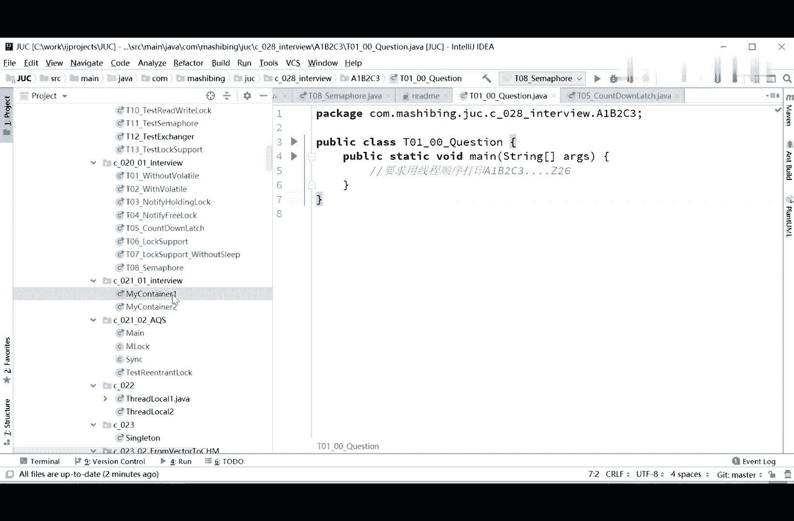
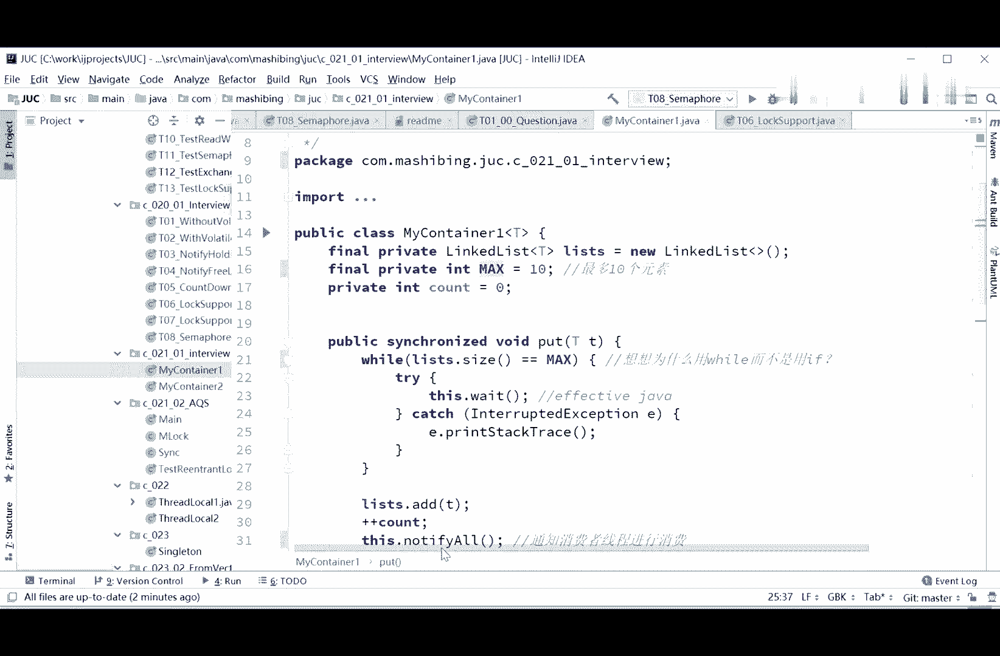
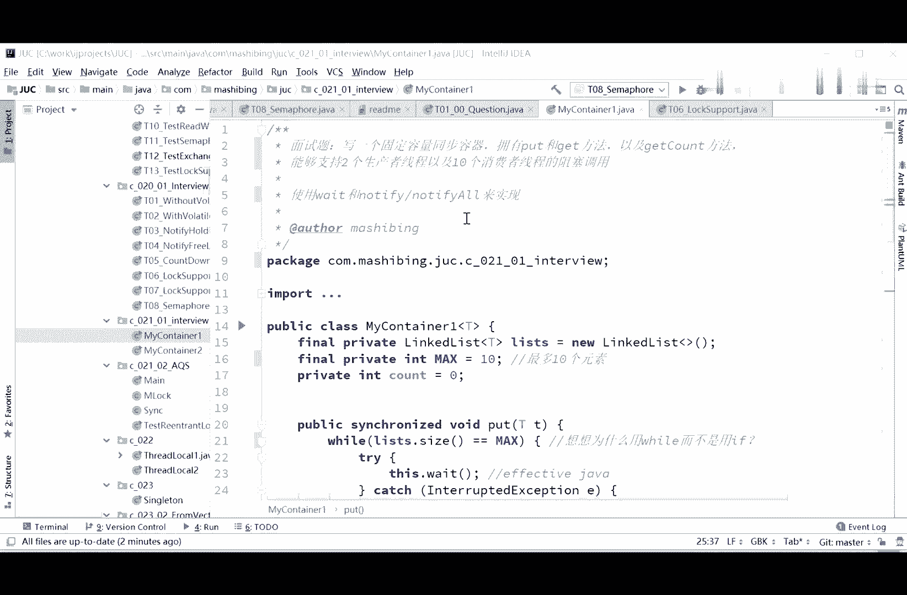
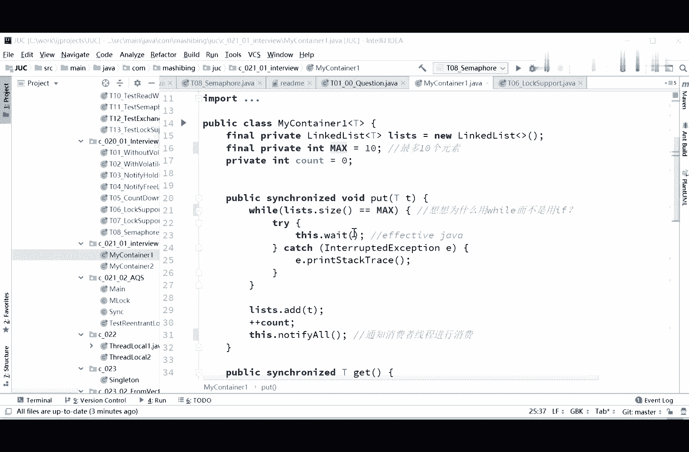
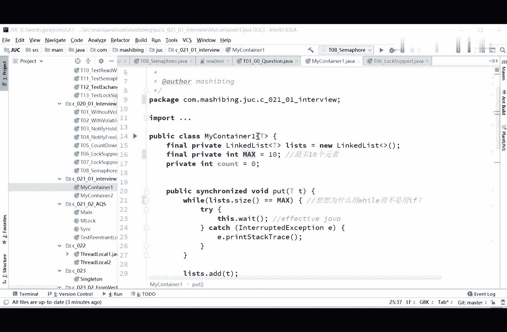
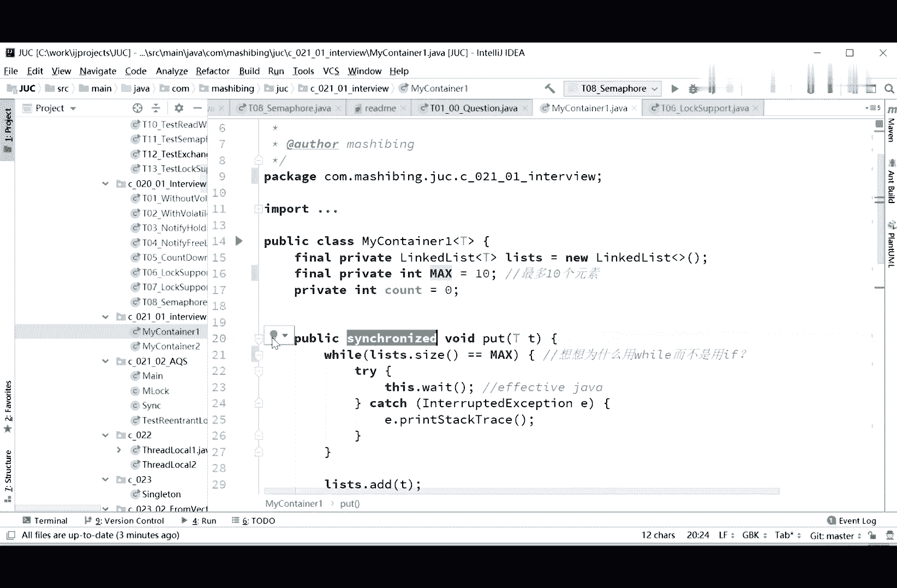
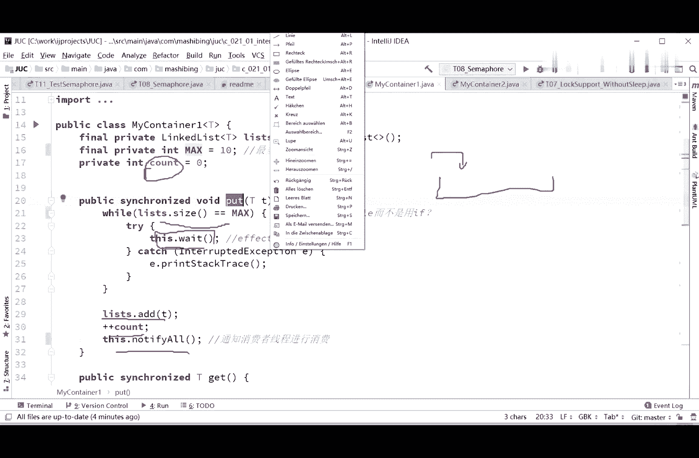
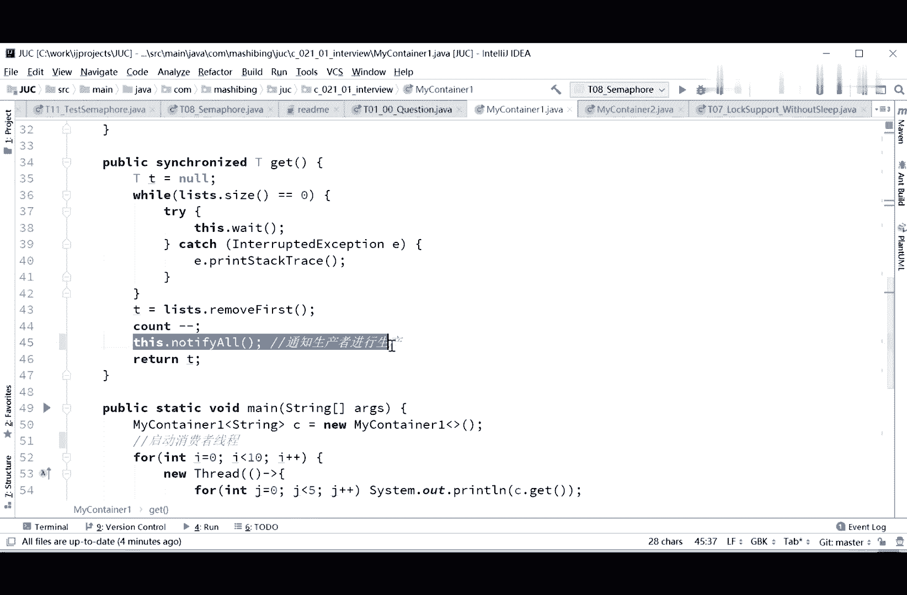
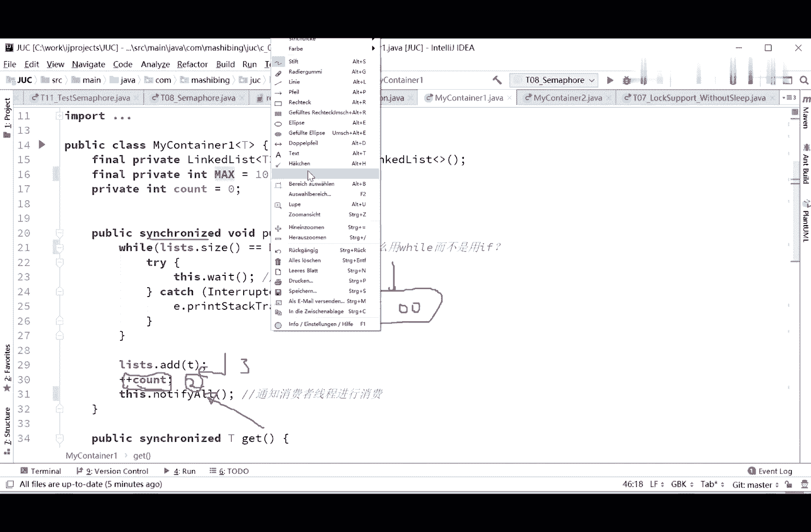
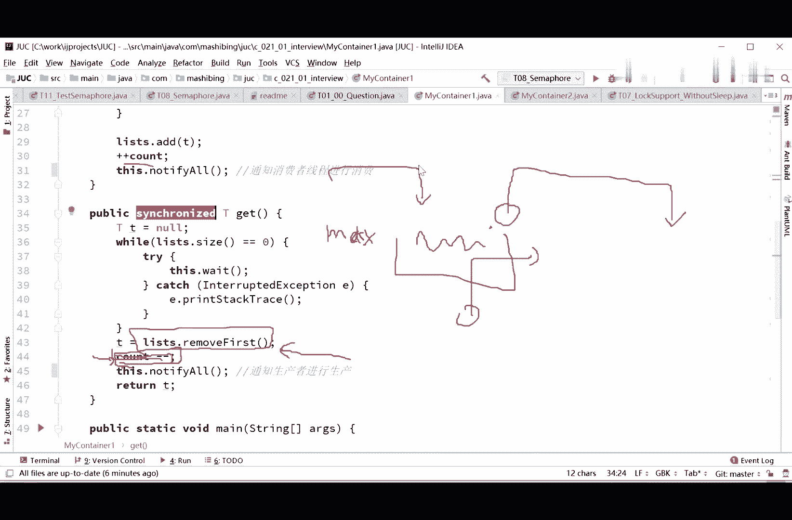

# 系列 3：P48：【多线程与高并发】面试题二(1)_synchronized - 马士兵_马小雨 - BV1zh411H79h

我们看第二道面试题。

第二道面试题呢是写一个固定容量的同容器，put get方法，get count方法，支持两个生产者线程，十个消费者线程的阻塞调用，这就是非常经典的呃，生产者消费者问题就是大家伙呢有一个固定的容器。

这里边可能就一个框了啊，最多装十个馒头，有两个生产馒头的人，包装包装就往里扔，什么时候满了，他们应该阻塞住停住，而另外有十个消费者线程，从里头往外吃馒头，什么时候吃空了，他们应该停住，就不要再往里。

不要再吃了，这个意思。

这道题link link list等于你一个link list呃。

我写了自己的一个container啊，这container是支持泛型的。

max等于十，最多十个元素同步容器吗，synchronized的put while list size等于max。

不是我是直接给了答案是吧。

对直接给了答案啊，这个没有办法了。

没有时间让大家伙自己思考了，所以就直接给答案呃，我们想一下往里头扔的时候，所以这个容器来说，往里扔的时候会怎么写，往里扔的时候呢，你必须得判断，如果说它等于最大值了，说明已经扔满了嘛。

扔满了你就得wait了，停住当前线程，停住diy o然后如果说没满，那你就往里加，加完了之后呢，加加count计算一下这个count的值啊，往往里头啊递增一通知消费者线程npo，让消费者线程进行消费啊。

这里头put的写法。

那get的写法呢依然是synchronized，如果说他size等于零了，说明什么，说明你已经取空了吗，取空了你就得wait，接下来remove first，取掉我们第一个，如果没，如果里边还有。

我们就拿掉，拿掉一个com减减好，通知生产者线程进行生产。

这个容器我们就写完了，其实这个写起来非常的简单，我建议大家呢把这种写法背过再说一遍，你2号别说把这种写法背过，直接略过就完了，当然你要有把握，现场能写出来也可以啊，其实也也不难，比较简单。

这是同步容器的写法，那么同步容器为什么叫同步容器，是因为它可以支持多线程往里装，多线程往外拿，为什么在这里面我们要思考几个，为什么第一个我为什么要加synchronized，同学们自己自己思考一下。

为什么，为什么要分析一下，同这个其实就是这句话的问题，加加count，因为我们往我们往里头扔了三个馒头，三个馒头扔到三个馒头，你还没来得及把这个count往上加的时候，这时候count还是二的时候。

如果你没有加synchronnet，另外一个线程独到的值很可能是二，它并不是三，所以最后结果就会出问题，所以这个理解起来非常简单啊，这里往里扔的时候是必须要加srt。

等到同理啊，往外拿的时候也必须要加sncnet，原因是什么呢，原因是我这数还没来得及剪呢，我这个东西已经拿走了，拿走的时候你remove first了吗，已经拿走了，拿走完之后。

我这count值还没来得及剪呢，如果这个时候又来了新的线程往里加还是会出问题，因为他上来之后会先判断这个count值等不等于max，如果这时候正好满了，全部都是满的。

我remove the first拿走了一个了，可是我还没有来得及把这count值减了，目前count还是max这个值，那我新的线程是不是就加不进来啊，本来你有一个空位了，我还是加不进来，不隐加不进来。

我看着加加看的还会出问题。

