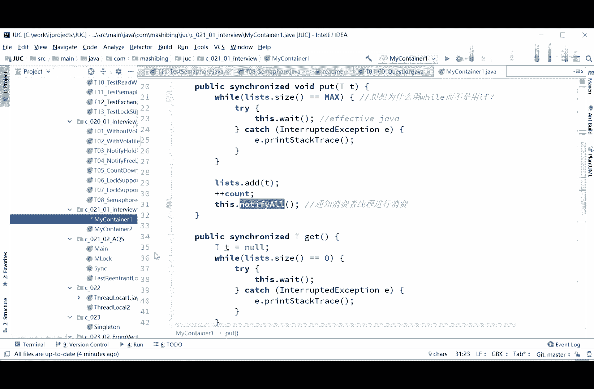

# 系列 3：P49：【多线程与高并发】面试题二(2)_CAS - 马士兵_马小雨 - BV1zh411H79h

s的写法，啊s说这个问题用处就和take是最方便的，你这不是废话吗，人家现在要你自己去实现阻塞队列的，put和take，你现在要用另外一个阻塞队列的put和take，那你这题解下来不就没有意义了。

要求你的，不就是自己实现阻塞的put和take吗，我现在是用的synchronized，是用的锁，但是呢我们想想看，实际上是可以用c a s的这个cs怎么用，你们你们能想到吗，同学们，cs怎么用啊。

在put之前上来先读出来这count，你分析一下啊，put之前先来先读这个count，比如说这count等于五，破完了之后呢，这个count要加加的，对不对。

count加加的时候是用c a s来加cs的，期望值是一个五，更新值是一个六，只要你这个现有的这个值是期望的，这个五说明我在中间往里装的过程之中，没有任何一个线程打打断过他。

所以呢你就把五变成六就可以了，我大概说了一下，这写法大家能理解吗，对当然这里面还涉及到aba问题，这就有点有点复杂了，你自己写的话会巨麻烦啊。

ok ok。

对嗯好了不多说了啊。

ok我们现在来看这个嗯。

222个生产者线程啊，两个生产者线程往里扔啊，这等于零，这小于25，不断的往里扔。

两个县城一共有50个是吧，然后消费者线程的i等零啊。

起了五个，并没有起十个，无所谓，都一样的不断的往外get，然后生产者线程的不断的往里push。

在线程里头呢，我们就不再需要加锁解锁了，为什么呢，因为我put和get方法，这两个都已经是同步的方法了，所以你应该会看到秩序井然的啊，往里装往外拿，往里装往外拿。

producer啊，p0 p1 p0 p一啊。

就往外拿的这个过程，ok，有点小瑕疵，好像嗯。

好这个生产者消费者的最简单的一种写法。

大家能够理解，同学啊，你给老师扣一，然后呢，你思考一个问题，为什么这里用while，为什么不能用if思考，思考一下，sx说有瑕疵是吧，嗯有瑕疵指出来哪里，好像这里为什么我们先来聊这个，为什么不能用呃。

if，你你如果用if的话，如果用if这句话是不行的，因为你this。weight了之后，当你list的size等于max，你已经wait了对吧，然后被你被叫醒了之后，你不会再判断它是不是还等于max。

你就会继续往下运行，如果你用if的话，所以假如你被叫醒了之后，另外一个县城又往里装了一个，他实际上还是已经满了，可是你二话不说就会往里装，然后还加加抗的，所以就会出问题，因此必须用while。

必须用while，你醒了之后也得再回来判断一遍。

哎哥们儿，你是不是还是满着的，当然同理啊，那部分呢你判断是不是还是说啊被空着的。

ok，当然这里头有一个小瑕疵是什么呢，我们先说刚才这小程序啊，这第一个小程序能够消化的同学，你给老师扣一啊，在这个基础之上，我们才能来讲第二个，这个没问题是吧，好我们来聊第二个问题。

第二个问题是我们用的是no tic all motif，or，这件事就会叫醒等待着的所有县城，那么大家都知道我这个synchronized的一家，就只有一个县城在这里跑，其他的县城你都得给我wait。

不管你有多少个县城，wait的时候，这里面是有量啊，生产者的线程和消费者的线程，所有的都在这个位置队列里，我一旦note for all空机全部叫起来，这些县城就开始争抢这把锁，抢到的仍然只有一个。

可是如果说我们比如说啊，我们是生产者的线程，生产满了，满了之后呢，我们叫醒消费者线程，可是很不幸的是，能他同样呢也会叫醒另外一个生产者先生，假如这个这个生产者上来，拿到了刚才的猎把锁。

刚才第一个生产者释放的猎把锁，拿到了之后呢，他又喂他一遍，对不对，mate完了之后呢才会又叫醒，那那其就是其他的舰长，你才去争抢这把锁，所以其实从这个意义上来讲呢，如果你是生产者的线程wait的。

你是没有必要去叫醒别的生产者的，我能不能够叫醒指定的，只是叫醒消费者。

而不叫醒生产者。

就是生产者线程只负责叫醒消费者，而消费者线程只负责叫醒生产者。

如果想达到这样一个程度的话。

用另外一种写法，这个写法呢叫做condition，condition，看下面这种写法，这个写法我就不再用sonnet。

我用的是reaction look，人for logo，我们说和super的最大区别，其实在这个面试题里就已经体现出来了，we rolook，它可以有两种condition条件。

producer等于new condition，consumer等于new condition，在我们put的时候，是我们的生产者，现场生产者，look，最后unlock不多说，一旦满了之后。

我是producer，await，就是我是producer，这种情况下我阻塞了，然后我叫醒的时候只叫醒consumer。

而另外这个消费者线程呢，消费者线程是我一旦空了，我是consumer await，然后我只叫醒的是producer啊，没叫醒别的，所以这个condition的含义，它能够精确地指定哪些先程被教训哪些。

而不是哪个。

好那是人听，那consumer和producer的本质是什么呢。

就是说lock condition的本质是什么呢，如果说啊只不过我们说producer啊，awaight什么consumer，await，你可能理解不了，其实认真听这个本质非常的简单。

依然是热巴松在synchronized the weight，notify的时候，它只有一个等待队列，如果我new condition了之后，它就变成了多个等待队列，听清楚我再说一遍，肯定是的。

本质就是等待队列个数，我们直达本质，这是那把锁，原来只有一个等待队列，现在我new了两个condition，一个叫producer，好，一个等待队列出来了，这个等待队列叫producer。

另外一个叫consumer，这个等待队列叫consumer，当我们调用producer weight的时候，指的是这个县城进入producer这个队列等待，指的是这个线程进入consumer的这个县城。

这个对这个队列里等待，那我要指定叫醒的时候，我就producer的时候，我就只叫醒consumer这个队列里的，而consumer呢只叫醒producer这个队列里的。

所以condition的本质就是不同的等待队列啊。