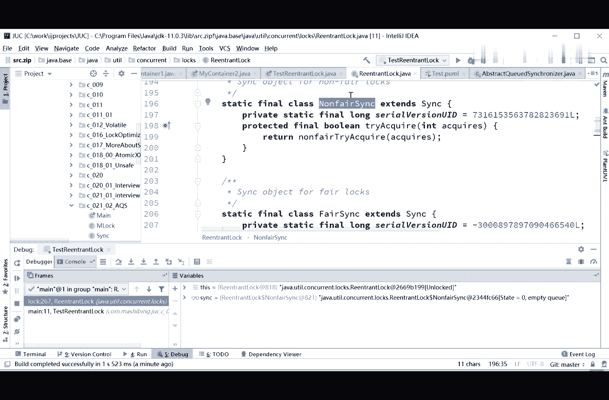

# 花了2万多买的Java架构师课程全套，现在分享给大家，从软件安装到底层源码（马士兵教育MCA架构师VIP教程） - P51：【多线程与高并发】ReentrantLock源码 - 马士兵_马小雨 - BV1zh411H79h

好当你理解了这个原则问题之后呢，我们来试试看啊，即便是这样，我我可以告诉你啊，你读源码也会废死老鼻子劲，这事儿很正常啊，但是呢你只要开始读了，慢慢的你就会越读越顺，越读水平越高，阅读你就从小河边儿唉。

找到了天宫，各种死亡芭比粉，各种色号，你就开始认识了，ok啊我们来看看它的到底是怎么实现的呢，lock lock这个很简单，软件之log里面调用了log方法，好，这个mod方法它调用了谁呢。

调用了sink的快方法，同学们听我说，你读源码的时候，自己分析源码的时候，我建议大家呢一定要尝试呢自己去画图。

自己去画图，画什么图呢，画这种图，这种的其实叫甬甬道图，又按照图的一种甬道，你如果说现在还不了解ui妙图怎么画，没有关系啊，我这个是装插件是可以画的。

看看啊，三，你有，你有你有你有新的，我这里能不能换，mary sources new啊，看着我这是装这个插件的，叫plul法，你可以尝试着呢，一边呃用就画这个sequence图，随便写一个啊，test。

ok，我这是可以画这种图的啊，你呢要是不熟或者说没装这个插件的话呢，你就装一下装一下，试着画好玩玩，这个呢就是相当于，这个玩法我在这改吗，这个这个插件啊，我回头我再看看啊，看看怎么用。

相当于呢就是这个类里面调用哪个方法，这个类里面调用哪个方法啊，如果说你ul用的还不熟。

没有关系啊，你不一定非得用u m l，你只要能画清楚，让自己看清楚就ok好听，我说你画的时候一定要画画出来。

然后你慢慢的呢这个流程就理解了，就是我现在教你的呢，如果说每个代码我都带你去读一遍，这代码量太大了，我现在教你一些方法，就是你看到啊，我们这reaction log调用它log方法的时候，它会调用谁呢。

它会调用reaction look里面的这个acquire，谁的acquire啊，是think的acquire。

对不对，是think的acquire方法，这很容易理解啊，回到，put on your ma，回头我再教大家这个吧，原来教大家呢都是那个呃russian rose。

但russian rose呢那个那那那那个还是挺好用的，不过后来这个软件呢已经没了用，也有好多好多可以画的啊，但我我我下了一个这个呃idea里面自带的它的一个插件啊，据反应应该是挺好用的，我稍微看一看。

然后再教大家怎么用啊，好大家看这里，我们还是回到a q s源码的阅读上，我刚才说了，你看一个呢，你就画一个，现在大家看到了我的人生lock的lock方法，它调用了think的acquire方法。

那think用的是谁呢，这个think啊，我们去看一眼，还是得让它跑起来看才可以，好继续让它跑起来，第八个，跟进去好，我们点开这个think，这think是谁啊，你仔细看一下啊。

它是relock的一个内部类，叫non fire sink，nonfire sink。

非公平的think，非公平的同步器。

所以这个图我相信大家应该能看懂了，这个图呢实际上是这样的，在我们的logo方法里，它调用了我们内部的一个类，这个类类呢叫no fair s，这long farethink。

它里面有个方法叫acquire，它调用了这个方法叫acquire，一。

当你读到这里的时候，为什么要开始分支，你要知道这个sink是一个什么样的类，大概扫一眼，我说我要按顺着线读进去吗，大概扫一眼，然后呢你再看这个acquire方法里面，它内部又是怎么调用的。

好看这里这个think是谁呢，它是一个nonfire think，我们找到这个nonfire think，找到呃，non fire sink，and substract class sin呃。

nonfire sink，在这里啊，这个nfire think的父类是think是吧。

所以你再画一张图，画什么图呢。

画这个图，就是这个no fair think，它的父类是think，因为你看到这个父类里面这个子类里面方法的时候，他有可能用到父类的方法，所以你要去分类里读才可以，所以你这个图也要画好。

就nfl think他爹是谁呢，是think好，既然not fair think，他爹是think，我们再回到think同步器啊，这个里面你看他爹又是谁啊，think他爹是谁，a q s好。

这是我告诉你，这是所有的锁的核心eq就是不管是condoleslie，barrier semhy，还有reaction log，内部都是用它实现的，aq，看sx同学遇到的这些面试题啊。

这个a q s到底有多少a q a q s也找不着，不会吧，就，我，看这里啊，是吧哈，ok为什么说a q s底层是cs加volde，弹一下a q s吧，好吧还有没有，这就不知道了，好了。

所以反正百度呢至少是问了四次是吧，a q s，其他人问了吗，我看看美团没有问顺风了，好像也没有问了，京东里面，京东里面没有问，百度问的比较多，问a a q s啊，问了好长时间是吧。

所以这个a q s呢是比较重要啊，就是呃这些全学嘛，当然了，为什么为什么不学，我们目标是奔向一线互联网大厂，就算你进不了，你至少也要比其他人要强很多啊，必须得削，要不然不会给你讲这么这么这么深。

这么细吧，嗯数据库还挺多，数据库主要集中在索引，我们来谈到这个a a q s了，这个a q是核心，所以最后呢我们会这个图。

你们自己应该是能画出来的，没问题吧，没问题，同学给老师扣一啊，就是说这个图你之上是能画出来的嗯，然后呢我们继续，我们现在呢这个lock呢是调用了acquire 1，这个方法是谁的。

aq r一呢是not fair sink的扣一，not fair sin又是谁，他是sink的子类，think又是谁，think是a q s的子类。

所以调用了aq r一多少块一的时候，我们再跟进去，跟进去，你看这个aqua一这里调用的是谁呢，调用了a stratute synchronizer，好，这里已经调用了a q s的acque了。

你看这个ag是一吗，所以这个块一又调用了aq s的快一，而在a q s里面。

它调用的是什么呢，要用的是try acquire，如果没有锁上try acquire获得，如果没有锁上某个值好该怎么办，下面是一堆算法，我们先不看他的，先看这个，如果说没有锁上，没有锁上有什么意思。

他又调动了谁呢，再跟进去，你会发现这次调用的是n fire sink里面的try也快啊。

哎这事儿就比较好玩了，刚才我们读的时候，你已经知道a q s里面有一个try a choir，但是它里面是throw了一个exception。

所以这很容易理解是因为not fair think里面重写了这个try a try啊，所以acquire一里面，调用了我们的nonfire sink的try块，我讲到这儿，有没有同学有疑问的，有问题吗。

有位老师扣一没问题，sorry，sorry，没问题的，给老师扣一啊，有问题，那你直接提，所以当我们acquire的时候呢，这里它调用的是它的一个子类的穿越宽二一的一个实现，然后他父类也有一个实现。

但这个实现基本没用，因为他上来就是throw new exception，你你要是不重写它，它肯定是抛exception，所以什么叫做模板方法，你们现在能理解了吗，模板方法是我在父类里面有个方法。

就是这个出二块一，它调用了我此类的一些方法，但这些子类的方法没有实现，我调用了我自己的方法是先写好是吧，但是呢由于这些方法就是用来给子类重写实现的，所以我就像一个模板一样，我要打造一辆汽车，我要造底盘。

造发动机，造车身，最后组装好造底盘这件事儿子类去实现哪个车厂实现，哪个是哪个车厂的事，奥迪是奥迪的事儿，奥拓是奥拓的事儿，车身也是发动机，也是最后反正这个流程是一样的，就像一个模板一样的，模板是固定的。

可是里边的方法是由具体的子类去实现，这个就叫模板方法，当我们执行到这里的时候，就会调用具体子类实现的函数，所以叫钩子函数，就像一个小钩子一样，勾着谁呢，勾着子类的实现了叫call back方式。

好同学们，在这里不知道大家理解这个什么叫模板方法了没有，redemption，说就是堕胎，这不废话吗，所有的设计模式，基本上90%的设计模式全是堕胎，吃这个try acquire啊。

它是就是要求让子类去重写啊，在这里呢not fair thing呢就是重写了try块一。

当然我们再来去读这个方法的话，你会发现啊，这个吹二快一又调动了谁呢，调用了nonfire tracquire，我们再跟进去，none fire tracquire，好，这事儿就比较好玩了。

当我们读到这里的时候，就必须得了解a q s。

