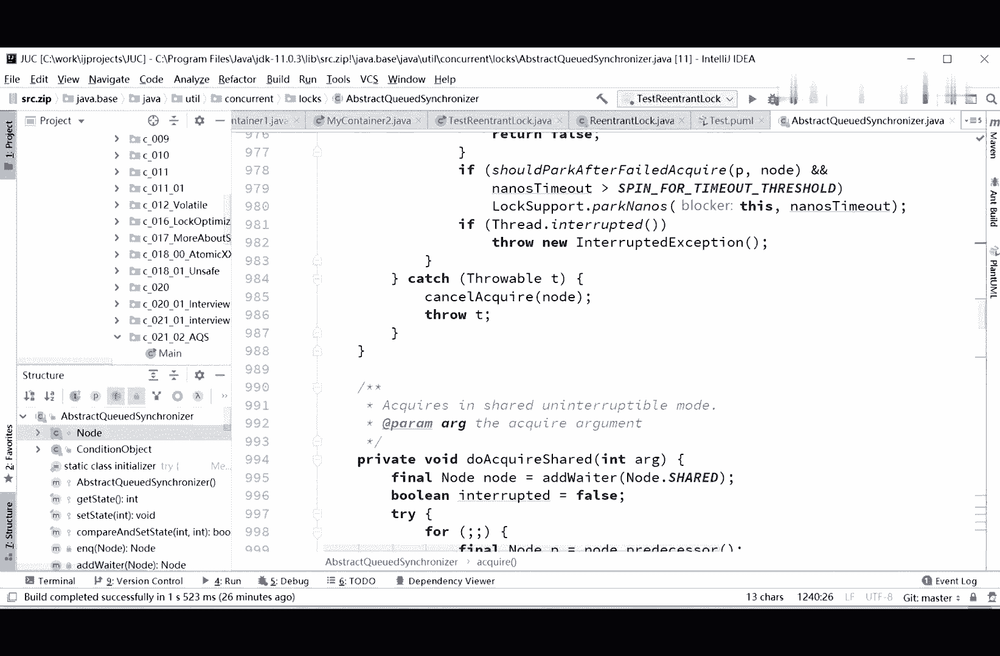
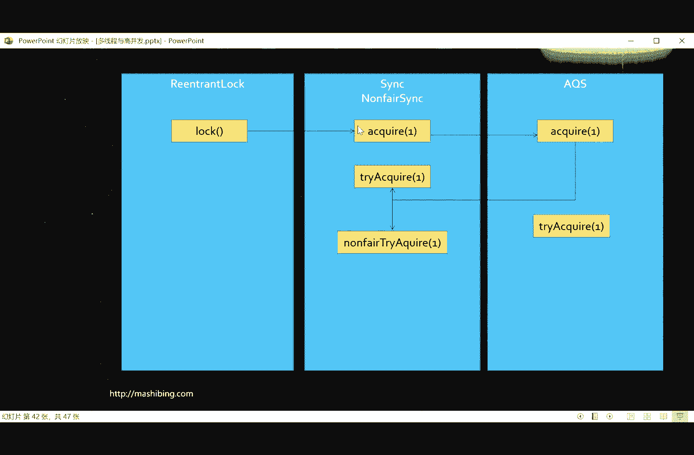
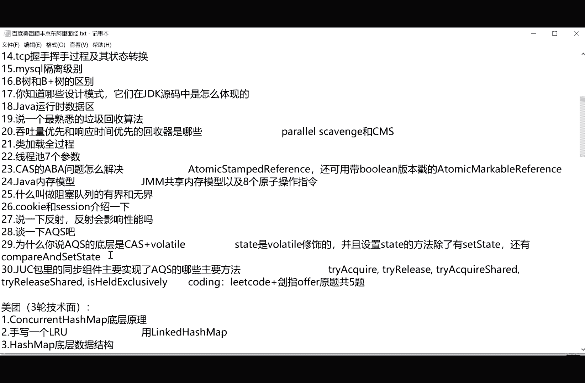

# 系列 3：P52：【多线程与高并发】AQS源码 - 马士兵_马小雨 - BV1zh411H79h

moon fire tracquire，非公平的去获得好，我们先说这个非公平这件事儿啊，什么叫非公平，什么叫公平，这里面要你自己去搞的话，就会时间比较多了，所以我讲给你听，第一个事呢，什么叫公平。

什么叫非公平，好大家知道，当我们获得一把锁的时候，有一些等待队列，如果说新来了一个县城，要获得这把锁的时候，先去检查，等待队列里面有没有人，如果有，他就在后面排队，这个叫公平，上来先排队，公平。

上来二话不说，我才不管你的队列里有没有人在等着，我上来就抢抢着，就算我的插队非公平，诶我突然发现刚才有同学提了个很触及灵魂的问题啊，这个同步队列和等待队列是不同的队列吧，吃完饭再说，你能提出这个问题了。

你的脑洞也够大的，说明你的基础真的是差到一定程度了，我估计你这面试题里边应该有90%到百分之百的不会哈哈，你认真听啊，这个同步队列呢指的是队列，然后里面实现了同步，就多线程可以安全地访问等待队列。

等待队列是指等这把锁所附带的这么一个队列，至于这个具体的实现是同步的还是不同步的，这件事呢是具体实现的事，它是两两种概念啊，这个锁的内部的，它这个队列的实现呢，由于是虚拟机内部。

具体实现了它的同步不同步，这事呢不知道不好说，所以不去管它，这是两个概念，这就好比说呃这个这个这个这个老婆和老婆饼是不同的东西吧，对它是不同的东西，因为它是不同的角度来看待的，开个玩笑啊。

等我们你如果还是不理解的话，等我们后面讲的同一队列再说好不好，ok，呃我我我我我来看这个刚才讲了同步和非同步的问题啊，就是公平和非公平的问题啊，sorry，讲到这儿的时候呢。

你会发现呢他开始去去涉及到什么源码了呢，涉及到这个源码了，认真看诶，程序呢在这你看啊，他说final thread current等于thread current thread，好。

得到当前线程非线程有关系了，int c等于get state诶，what这里突然出现一方法叫get state啊，没有关系，我们看这方法到底他是给我的debug跑哪儿去了。

你看这方法呢到底是在哪儿的这个方法啊，程序被我停掉了吗，啊重新给气死我了，你在这设个断点吧，啊没停掉啊，很好没停掉啊，我以为被我停掉了，好在这儿啊，我们继续往下，刚才我们是直接跟进去跟进去。

我们往下执行一步，step over，把这部执行过去好，当我们到达这句话的时候，c。get data的，我们再来看这个get方法的在在哪里跟进去，你会发现这guest day的方法又去哪了。

又去了a q s里面，所以在他的这个实践里头，你可以直接调父类已经实现的方法，get it，那我们这个dress state这个state又是个什么东东呢，这里头是理解a q s的关键。

这个state到底是个什么东东，按住ctrl键点过去，你会发现这个state就是一个volunteer int类型的数o，这里就牵扯到a q s的捷报了，aq s队列也可以称之为c rh对点。

这个结构到底有什么结构，他是c h c h的一种变种啊，这个c o h c l h是三个人，三个人的首字母的缩写，你如果知道这名词跟面试官砍的时候，就会显得你知识非常的渊博，如果不知道。

你就别在这瞎说了，就说a k s就行了，好a q s最核心的结构是什么样子的，a q s的核心就是这个state，就是刚才我们读到的这个硬盘类型的数，给大家标注一下啊，这是一个int类型的数。

同时呢它是lolo的，所以我为什么要给大家标注这个东西呢，是因为，我看刚才这个ss给的面试题里头呢，他专门的说问了这么一个，百度多讨厌问这个东西，问了一个什么东西呢，问的是为什么。

你说a q s的底层是c a s加volt，所以你要了解这个state是waller的保证，线程之间可见，ok这是这里面最核心的一个数值，这个数值是什么呢，这个数值所代表的意思随你定，随子类来定。

就这个state到底是什么意思，你自己定，你看我们现在讲的是reentrant lock，好，这个值呢刚才值不是零吗，当你获得了之后，它就会变成一，就表示当前县城得到了这把锁，小声有什么。

什么时候你释放完了，ok从一又变回零，说明当前线程已经释放了这把锁，所以这个state 0和一就代表了枷锁和解锁，人称look，ok接下来如果我们讲的是countdown latch，这是我今天的作业。

你回去去读coundown lash的源码，这里面这个a代表什么呢，因为count down lash里面写的是五的话，好这个state就是代表我这个门栓得calm down多少次，你才能够解开这个数。

可能就是五，所以这个state这个东西，water tel啊，写错了都打错了啊，有瑕疵，这个你们自己改吧，理解什么意思就行了，写错了，volatile la。

ok这个呃这个值是根据你子类的不同的实现取不同的意义，我讲到这，有没有同学有疑问的，没问题，给老师扣一好，这个这个值目前来说从零变成一，就表示我们加了把锁从一变成二级，表示加了加了。

另外加了第二次锁就可重入锁吗，又重新重录了这个state值的基础之上，它的下面跟着一个队列啊，这个队列呢是a q s自己内部所维护的一个队列，这个队列里面每一个都是一个node，一个节点。

这个很容易理解了一个node吗，他在哪呢，在a q s这个类里面，lt 7，a q s这个队列，你看它的有一个内部类，也叫node final class，node这个mod里面有这么几项比较重要啊。

它的成员变量里面有这么几项比较重要，最重要的一个是这个在这个mod里面最重要的一项是，它里面保留了一个thread，一个线程，所以这个队列是个什么队列呢，是个线程队列。

而且你看这个node previous前前面那个节点，next，后面这个节点，所以这个队列是个什么队列呢，是这样一个队列，a q s里面比列是这样子的，一个一个的node。

这个node里面装的是现场装的是thread，ok然后这个node呢它可以指向后面的这个也可以指向前面这个，所以叫双向链表，我说这个讲到这儿，有没有同学有疑问的，所以eqs的它的核心是一个state。

以及监控这个state的一个双向链表，每个列表里面有个节点，这个节点里面装的是现成，好了，同学们，那么哪个县城得到了这把锁，哪个线程要等待，都要进入这个队列里面，所以这是一个双向链表，除此之外呢。

它还有一个head，有一个tail，好当我们其中某一个node的能得到这把锁，就是拿到了这个state给他改了，改成功之后，就说明这里面这个线程持有这把锁，所以当我们acquire快要来了之后。

上来看你这个stay值原来是零，那我就直接咔嚓，我拿到这把锁，就相当于我拿到了，如果说后面没有拿到的，现在是非公平，非公平就上来就抢，抢不着怎么办，抢不着进入队列里。

所以我们看这个代码的执行了大概的逻辑，回过头来，看到这儿呃，那能再看到这车也快了，如果说没有拿着，这不是非公平锁吗，上来就抢嘛，就是没抢着怎么办，没抢着，acquire cute。

acquire cute，什么意思，跑队列也给我挡着去，所以你进入队列继续等待，那如果抢到了，抢到就抢到了是吧，那怎么怎么是抢到的呢，这么来抢的等于scar s得到当前线程，拿到state，如果等于零。

用cs的方式compare and set state，cs的方式，期望值是零，然后尝试把它改成一，假如改成了set exclusive owner thread，设定当前的呃，excuse。

独占的当前的县城是谁呢，是current，就是当前现场把当前县城设为独占这把锁，这个state的这么一个现场，就说明我已经得到了这把锁，而且这把锁是互斥的，我得到之后，别人是得不到的。

因为别人再来的时候，这个c已经变成一了，那如果说我当前县城就已经是独占的这个县城了，get exclusive，get exclusive owner thread，当前的这种独占的县城是谁呢。

就是我当前县城怎么办呢，往后加加个一就表示可重录了，好了同学们，这个lock的大概的方法，我讲到这儿，现在大家能理解这个流程了吗，当然我需要你回过头去之后呢，好好地去阅读里面的源码，最重要最重要的。

我希望你能够掌握这个读源码的原则和过程，好吧，你听着可能不难，你听着不难的原因是，因为我直接把这个结构告诉你了，我如果不告诉你这个节奏，你呀读起来依然还是非常的费劲，所以你不要觉得独眼码这件事特别容易。

我们翻回头来看我们这个第三个小节讲了什么，讲了呢，我们讲了读阅读源码的原则，回想一下啊，第一个跑不起来不堵，记着这个原则，第二个呢解决问题就好了，有好多时候你接手，尤其是接触好几手的这种源码的时候。

解决问题就好，不要追求太高，一条线索到底，就像我刚才读的这样，咔嚓咔嚓一条线索读下去，而不要说大面上的阅读，大家说阅读什么情况下会用呢，你需要了解大致这个类是干什么的，比如说a q s这个类。

刚才那个no的节点是怎么回事，你肯定是要大概读一下无关的细节略过，我不会是这么读源码，我不会说上来a q s，我从头读到尾，所有的这些源码全读一遍，不要这么读，这个读起来是非常费劲的，也不是好的方法。

好这几条原则。

你们现在应该是有深刻认识了，应该有没有，如果有的同学给老师扣一好吧，好在你阅读的过程之中，我希望你画两种图，第一种方法之间的调用图，哪个方法调用哪个方法，你自己做笔记的时候还可以做得更详细一些。

哪个方法都干了些什么事儿。

那第二种类之间的类图，这个类之间的类图比较讨厌我，因为用的是idea的community版本，那么community版本它实际上是不支持通过源码直接给你生成类图的。

可是你如果要是用的是crack版本的话，这里面是有菜单的，这个菜单里面是有一个叫diagram，那个呢是可以直接的自动的帮你生成这个类图，那就更爽了，不过没有关系，我还是那句话，读源码，读源码。

重点在于你自己去阅读，所以你自己手动画一下，其实印象会更深刻，我说过那个黄石去面试的时候，最后是拿到p9 级别给他面试，他面试就是把这图都画清楚了，左手一张纸，右手一支笔是吧，把图画清楚。

那个a p s源码呢，我希望你们自己先读一下，因为由于这个结构我已经告诉你了，所以你读起来那就应该没有那么费劲了，其实所谓的ak原码呢最核心的是在哪呢，最核心的就在于后面我们讲那个对。

讲那个同步队列的时候，也会讲相应的内容，它最核心的问题在哪呢，就是它最核心的点在哪儿，最核心的点其实就是怎么入队，怎么出队的问题，原来入队出队你需要加加锁的，对不对，这里的入队出队用的都是cs。

用cs方法往尾巴上加，为什么什么意思呢，因为我们来分析一下啊，就是说这当有这样一个队列的时候，呃你呢两个县城啊或者多个县城都来抢这把锁了，但这把锁呢已经被别人调用了，被别人调用的时候怎么办呢。

你是不是得跑到这个队列里排队啊，那几个县城都往尾巴上加啊，都往上抢，谁先抢着，到底谁后抢不着啊，如果说你想让他不会出现这种一个尾巴带了好多好多新的尾巴的问题，你只能是一个来了之后先加上。

另外再来了之后只能加在第一个后面好，如果有这种情况下呢，你你最简单的想到的方法是应该加锁，对不对，是加速，哎但是呢现在的aq s的实现刀布里写的呢就直接不用加锁，是用c a的方法。

所以这里的重点就是cs啊，因此呢这也是为什么面试的时候就是谈一下cs啊，我觉得sx这个这小伙儿啊肯定是说啊a q s就是cs加播了，那他肯定要问你啊，为什么a q s底层就是c a s加播了。

tell啊，你把我刚才的这个图给大家画出来，然后记住了，state是波拉特修饰的，改这个里边内容是compare and sets data，你这个你如果c s x，你这样答的是不对的啊。

这里面的那个最重要的是维持了一个队列加速，就是往往往队列的尾巴上加东西的时候，这里用的是compare and set set state。

