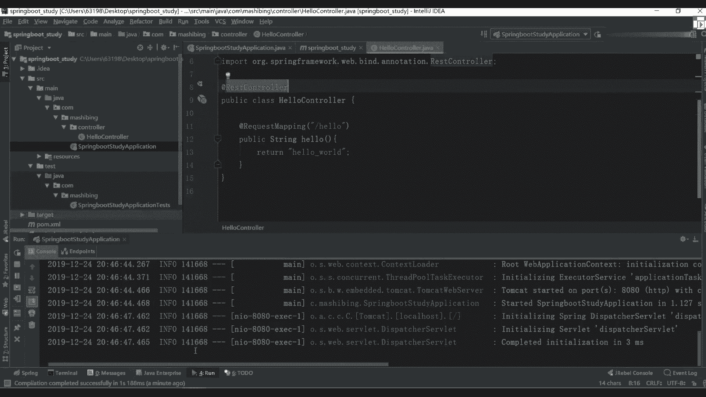

# 花了2万多买的Java架构师课程全套，现在分享给大家，从软件安装到底层源码（马士兵教育MCA架构师VIP教程） - P55：【Spring】第一个Springboot程序 - 马士兵_马小雨 - BV1zh411H79h

按时间了。

怎么学啊，好多同学又懵了，老师一涉及到知识点去就慌了，如果后面再出来一个spring port怎么办。

非常简单，官网我一直在强调这件事的重要性，my sql也是一样，我不是带你看过吗，你们要看好吧，叫spring boot，我们现在讲课用什么用，最新版本是2。2。2好，2。2。2。

有可能我们的使用boss还没讲完，这就更新了，smod更新啊，是比较快的好，但没关系，基本的核心点应该是不会变的，懂我意思吧，基本的核心点不会变，你可以从这儿进行一个查看啊，进行一个查看。

先点开之后挨个看就行了，大家看就行了，懂我意思吧，这块一定要看，那老师我不行，我看英文之后头疼头疼怎么办，一直老师翻译啊，没用好吧，翻译出来之后可能意思跟你想要的意思就不那么一样了，那怎么做也非常简单。

我这儿给大家分享一个也是别人写好的一个博客，好吧，叫gtbook啊，gtbox这里面有sp 2点x的一个中文文档，好大家看一下这个中文档里面有详细的一个介绍，好详细的一个介绍。

他说了6月时间基于spring bot 2。1。5的官方文档进行了翻译，注意了，这是2。1。5，我们现在用多少，二点点一吧，但我说过了这个小版本的一个更新的话，其实呃有些点可能会变化了。

所以这一块我还是希望你们能看一下中文的，看不懂英文，我们看中文总可以吧，一定要秉持下去，这是我我强调过这件事情，我觉得别别的老师也应该强调过，你不要说老师所有东西等着我喂给你没意义。

现在就你看官网其实能学到很多东西，这边导航栏你直接看就可以了，其实我说了，如果我不讲，我不讲，你也应该能学会啊，只不过说这东西怎么学的一个方式，所以这样我会带着你说，告诉你这块应该怎么学。

老师可以把这些app放到相关笔记里面，可以可以啊，一会儿我会把相应的一些笔记给大家都补充到里面去，下课路再补充吧，我们上课不浪费时间了，好一会我把这个图分享出去，你们从图里面直接看就行了，懂我意思吧。

一会儿做啊，这忘忘了往里面进行整理了好了，来往这看吧，上面的都是一堆废话，告诉你说我要怎么进行构建之类的东西啊，我们这儿不看了，这块它翻译还没翻译完好，我还没翻译完。

但是这些东西已经够我们进行一个使用了好吧，第一个先看入门，入门里面对spring boot做了一个基本的介绍，基于spring的一个应用，我们对spring平台和第三方内部有自己的考虑。

因此您可以从最基本的开始，大多数同人不同应用只需要很少的spring配置对吧，然后说你可以使用three boot来创建一个可以使用java杠站的命令来运行，它提供了一个什么呢。

叫运行spring这个呃sprts的一个命令行工具吧，有多种这样的一个方式，把后面告诉你说目标是啥，这块不用看了，你知道他运行完成后，或者你写完代码之后。

我可以通过java杠炸的一个命令来进行运行就够了，所以所以当你写完代码之后，你看到应该是什么，是不是应该是一个完整的炸文件对吧，这样大家只能所有人都知道啊，所以都知道这块不用多说了。

那下面有什么有系统的一个要求，现在一般情况下你们的电脑可能都满足了，但现在系统是什么意思，告诉你说我用什么样的一个web容器好吧，server的版本是多少，以及我们的jdk的版本是多少。

现在一定多少八了，所有人应该都用八了吧，没人再用六和七的吧，如果你公司里面还在用，就无所谓好吧，但是说了，虽然您可以在java 6 java 7上运行存不，但是我们强烈推荐你使用jaa 8，懂我意思吧。

一定要使用我们正二八这样一个版本，告诉你说如何进行一个安装啊，好吧，告诉你面有一堆的安装方式，这不再多说了啊，这里面有这样的一个机构的一个配置是啥，没了吧，你们对moon熟吗。

我来问一下现在听课的学生有没有不会问问的，有没有不会问问的，不会的扣一好吧，你还有一些基础班的学生啊，呃不过没关系，之后基础班的时候会讲maven这东西怎么算会呢，你知道可把我把我把我问住了。

基本的操作吧，基本的操作吧，这门课和架构一般的spring课是重复的吗，呃有一部分内容会重复，但是这边的话可能讲的更加那个就一期的时候教大家更多是一些使用，这边的话会使用加原理都讲，把石油家里也都讲了。

懂我意思吧，来看看这边告诉你maven gradle好吧，安装fbot c l r这块我们都不用好吧，所以对于你们没有东西不用管它往哪看，11叫开发第一个spring boot应用程序。

把cbot应用程序啥意思告诉你，我如何来进行一个最基本的创建过程，非常简单，第一步先在这里面安装maven，我这儿已经安装了，大家看到我电脑的c盘里面也有了一个maven，但是版本比较低啊。

b的低无所谓，这里面我希望大家改一个东西啊，改什么东西啊，改一个settings比较差，其实有两个非常重要的配置，那两个第一个是我们本地的一个仓库路径，你设置好好吧，第二个是你要参考的一个镜像地址。

大家看这我要用谁的，是不是阿里云的，是阿里云的，你这块可以自己做切换，无所谓，好无所谓，但是我建议你换啥里云的，因为有可能你访问国外的话，可能速度会比较慢一点，有可能我们现在班会比较多啊。

阿里云的话可能速度更快一点，所以这块做一个推荐，我作为推荐，当然你可以如果你比较熟的话，你看自己心情想要什么英雄就可以了，对于初学者，一会我会把这个配置文件发出来，发完之后你按照我的文件改就完事儿了。

懂我意思吧，不要在这个配置上面浪费太多的一个时间，懂我意思吧，就这块这是我之前配的啊，这是我之前配的，我不知地址改了没有，反正现在还能用，现在还能用，ok地址变了，不是应该是吧，就这个吧。

反正我现在还能用啊，我不知道他有没有改地址，因为基本上改完之后没动过它，没动过它好了，不再管他了，不再管他了，你现在之后自己配就行了，反正我我就一直用用用用用这个配置啊，不管它了。

来看第二个要创建pom文件，就是你把刚刚配置粘过来就完事儿了，好这样可以选对应的一个版本。

然后有个配置class的一个依赖，是不是分别分了n多个步骤，然后告诉你说如何进行一个编码操作。

然后使用rest controller和request mapping注解，然后把alt confit注解。

然后命方法只有预约的样例了啊，这块我们来运行一下，看一下应该怎么做好。

看一下应该怎么做，其实非常简单，我说了，这是第一种方式，你可以用我们的idea来做，除了之外，你可以用这样的一个工具来做，当然你在自己学的时候用它没问题好，因为他没问题。

但是如果在公司里面肯定没人这么干，太麻烦了啊，怎么做呢，这样可以选一个main project，然后选择一个编程语言叫java，第三个选一个版本，我们是不是2。2。2，就这个版本下面什么呢。

叫project mad，这可以选什么，选上你对应的一个group，这个group一般是你公司域名的一个告诫吧，怎么写，come点把视频对吧，这可以写一个叫spring boot，再见斯大林不讲究。

这有个option是详细的一些选择，比如package name python，我把它删掉到这儿，到com点把视频就够了，这第一个版本是八，这都可以做一个选择，除此之外好吧，除此之外。

这页面里面提供了我们各种加载的一个工具，好比如说上一个什么呢，叫dv twice，是不是进行热部署的，第二个box是不是进行那个那个实体类的那个sg方法进行一个填充，填充的是只需要加注就可以了。

现在有我们的timate是模板，比如后面我们要用simul对吧，security有spring security对吧，os二点是不是有各种各样的版本，然后circle我们用g d c好。

或者用spen dj d b c都行，把更多版本你可以选择自己需要的东西好吧，需要什么加什么就可以了，暂时我们是不是原生的，原生的话，我我就搞一个什么最基本的，比如说web项目吧，大家都选上勾。

选完之后拿去吧，这是告诉你说一个flat，然后把那个合起来好吧，别动不要了，点开它嗯，合不起来吗，我看这是不是可以写一个叫spring web，然后写完之后搞定了，别的东西不叫价，你不用不用管它了。

然后再选一个按这个按钮，它就会下载一个炸文件，对我把这文件拿出来，这很快啊，这很快啊。

c2 位拿过来，拿完之后直接解压，他就是一个项目，然后用我们的第二天打开，呃之前群里面有人问啊，说idea过期了怎么办，你过期了，你就从淘宝买一个，或者淘宝上搜一个。

我一会儿可以给你分享一个就是免就是到2099年的一个东西啊，一个注册码，你自己需要做一个配置，很麻烦，你要不想麻烦的话，你就你就搞一下啊。

这些东西很基础啊，这不再浪费时间了，你们应该都会了，呃这spring源码啊，我再带你们看源码东西呃，我现在给大家说一下，后续的话我们会讲组织源码，spot源码呃，很多学啊。

可能觉得那个老师sboot源码就是我看起来很麻烦，很麻烦，呃，这块给大家说一下，我会给大家写一写笔记，写写笔记啊，呃这我几乎整理了一些，大家没整理完，后续的话会给大家加东西的。

就是你在入口的时候去写东西，应该加什么样的组件，这块注释啊，我都会给大家写的啊，都会给大家写的懂我意思吧。

所以希望你们可能看源码看不懂，或者说看完之后就忘原因在哪。

你很少去做一些注释或做一些笔记，你把这段如果做完之后，你回头再看的时候都会感觉比较清晰，ok 2099年那个工具破解完之后就是2099年了啊，所以你们如果需要的话，我就给你们，你们需要吗，需要的话。

一会我分享一下，这没啥难的啊，这很简单的东西，需要就给你们无所谓，哼要啥你也要啥，你们什么你们都想要来cos project，这样可以选什么，选哪个，有import open吧是吧，交易版可以用。

打开我们的，desktop选他，ok，那这样这样会有一个妹妹的一个构建好妹妹的一个构件啊，等一下是构建好了，构建好了之后，这块可给大家说一下，你可以把几个，如果你看这个目录比较多的话，可以把这东西删掉。

这东西没用，这删了，反正我每次删掉他，我感觉没啥用，ok这就来一个s2 c，然后连上4s这种mean java里面有什么come，这个vision就是我们对应整个程序启动的一个入口了，听明白意思吧。

好吧，这块就有这东西了，所以这之后你就可以怎么样直接运行，当然我们现在运行之后没有任何效果，因为我现在是什么都没写，什么都没写了，这几个是啥啥是啥，开启源码入手啊，现在讲到源码，现在讲源码已经懵了。

但不知怎么样，现在这样直接运行了，运行完之后能开启，我们能运行我们对应的一个东西，删了几个字啊，一个是get的，一个是那个呃maven的一些相关配置的文件也无所谓，直接删就行了，你这个id留下。

把其他东西无所谓好现在我现在这种东西无所谓啊，然后看完它之后。

试验是不是弄好了，我们现在没法访问，因为你什么都没写，什么都没写没意义，那怎么做，非常简单，先看一个文件叫喷我文件，power文件跟我们刚刚那个spring boot是相呃。

跟我们那个maven是相互关联的，大家看一下里面有什么样的一个东西，好吧，往下找，刚开始上面写一个parent，是不是我们父母的一个东西，或者说一个副项目里面的东西。

还有个东西叫spring boot starter parent，这样可以点进去好吧，点击之后就看到有parent是不是各种各样依赖，the spot dependency，后面有各种各样的一个东西。

过过滤器了之类的相关相关属性配置，你这还可以往里面再接着点点，点完之后往下翻插这块儿是吧，这块属性我希望给你们看一下，因为我们之后再加载我们spring boot的一些相关的一些依赖的时候。

我们很少去写版本啊，为什么写了本，因为在他的父亲的父亲的这个配置文件里面，已经帮我们加了各种各样的一个版本了，这里面有一套配套的，所以一般版本这件事情我们就不会忘了，我们不会加了，不加也没啥意义，好吧。

这也帮我们定义了很多东西，好很多东西，这直接导入就行了，懂我意思吧，哇这里面这个配置啊下去之后可以详细看一下之后，像原版的时候我会带你们详细看啊，这是我们这个附体里面的东西。

再来看是对于我们当前这个项目的，那告诉你说这节课的版本是1。8，这有个dependency是我们的依赖，一个叫web，一个叫test，这块希望大家注意一件事，什么东西呢。

在我们的spring boot里面，它定义的这些依赖都是非常非常规范的，什么东西上面全部叫o r g three framework，点bot下面的都是three boat，gstar开头的。

后面是一个web，其实这个start就告诉你了，留情期之后意味着什么，如果我想加一些其他额外的组件的话，只需要加载对应的一个一带就行了，这东西怎么加啊，也非常简单。

来往下看，我们来找一下吧，还是要去官网找啊，知道在哪吗，官网我们看英文官网在哪找，你选这个叫user spring boot，停了之后，你往下看看这儿有个哪去了。

往上看在这块什么东西叫spring boat application star，只有一堆的启动器对吧，ret m q a m p p，然后呢a p然后呢有bg catch，是不是各种各样的组件好吧。

你后面需要用什么是dj b a d d b c dj p a好吧，l d a p mango对吧，你有for这个release是什么都有直接检查我们的pom看一下，在画布之后，这会有一个对应的依赖。

你把下面的一些dependence加进来就可以了，我加进来就可以了，直接粘非常方便的一个方式啊，所以官网里面都把我们定义好了，拿过来之后直接把手站搞定。

懂我意思吧，那么现在我们已经把当前项目给导进来了，导完之后再怎么做，主要测试一下，说跟当前项目能不能运行啊，首先因为我导入了一个外部模块，导了一个test模块，test不用说了，你可以直接进行一个运行。

这非常简单的一个方式啊，应该是一个context loader里面写就行了，主要是我们这个web，也就是说我可以把当前项目当成一个web项目进行运行，但是你看一下，我这有部署任何跟他们相关的东西吗。

能不说吧，因为刚刚看到一个东西叫什么叫内建的。

看官网首页，在高考里面是不是有一句话找一下，玩法什么东西叫内建的一个运行时的一个支持吧，例如tom cat gt m的the road undertale，是不是各种各样的一个组件。

这块它的本身里面就有了把内置的好内建的这样的东西。

所以我们这儿不需要做任何的一个事情了，这块所以我刚才为什么你读那块东西，因为读完之后你能获得很多启示，现在现在怎么做呀，非常简单了，现在运行的时候，这儿你有一个package等同学老师。

谢谢ctrl开电脑，很多人都这么干对吧，想看出了之后又一个吧，因为class叫hello，ok写完之后里面就能写东西啊，我说主要写一个方法叫帕贝克，就是说ring hello括号。

然后里面写一个return，哈喽，这样写完之后本身非常非常简单好吧，写这块的时候需要你具备一个基础知识，就是spring mvc，保存完vc，当然我说过了，有些同学可能没之前没有接触过，之前没接触过。

没关系，这样你按照我的写就可以了，那这块要加注解了吧，之前我们家是怎么加的，这是不是写一个东西叫at control，搞定了吧，是不是搞定了，然后呢这块是不是要写写什么。

是写一个at叫瑞quest mein main，写一个对应方程的，要发生一个请求叫杠，比如写一个hello，是不是检查检查之后按照我们之前说的，除此之外你还要写什么东西。

这是一个at response body，是不是写这东西，等我先这样写，先这样先这样写，一会儿再说rise control的事，是不是先这样写，这样写完之后，我们现在该写什么呢，这是一个命函数。

是有in方法对吧，一会儿我们直接把当前项目重启，等下重启啊，现在要重启啊，报错了吗，没有吧，开启端口多少是8080，这个端口端口开启了。

在这个时候我可以打开我浏览器进行访问，the local host 8080，然后加一个叫杠，hello，听到了吗，是直接返回，就是我们的，hello，这有点大，我来，我写一个logo，h e r o。

这不是请到了对吧，这是一种方式，除此之外，刚刚同学说了，老师可以用一下rest controler什么意思，在我们刚刚这个代码里面，一定是不是已经发送了一个对应的请求。

请完之后，我这是不是返回去一个合格的做出，你这样可以做一个修改叫word，然后重新启动。

修完之后一定能看到东西效果。

改了吗，改了吗，是就我们刚才写代码，其实这个题就没问题了，当然很多同学在使用的时候，他不太喜欢用这样的方式，他应该怎么写啊，老师我要这样写，把这东西删掉，不要了，然后上面这块我要改另外一个主语。

叫什么叫rest，可说了，等下了吧，打完之后我重新启动，让他再进行一个访问走能用吗。

穿线清缓存刷新没问题吧。

是不是也能访问到，所以两种方式你在写的时候都行好吧，你喜欢用哪种就用哪种，这无所谓啊，这个东西没有什么版本的一个限制，说我必须要怎么样好，这东西没有什么限制的，懂我意思吧是吧。

所以写的时候直接写就可以了，这是一个最基本的程序，大家看到了，我刚刚运行的时候有什么区别，vs ctrl就相当于是我们的ctrl加上我们的results bu，他返回的时候只能返回一个字符串。

返回字符串啊，这东西啊后面会讲到用，担心好吧，这个是不是一个这样一个ctrl，刚刚在我们的官网里面。

官网里面，他这是不是也给了一个建议，找一下找回叫格林start，哪去了，刚才是不是给了一个叫start，这个只要不说你第一个spring boot的一个项目，项目完了之后往下走。

这边告诉你说我要写什么东西，往那边去了，看这这写的什么东西，叫这是ctrl吧好吧，官网里面是不是推荐我们这样做的，所以你写的时候也可以这样做好，也可以这样做，直接把这个写成它就可以了。

刚学的时候还是那句话，在初学的时候，你就按照它的配置写就行了，他怎么写你怎么写。

你粘过来就搞定了，懂我意思吧，但这块我希望仅呃提醒一件事好吧，特别是对于我们对应的一个初学者，这点非常非常重要，非常非常关键，所以不太注意啊，这个启动器我能随便放位置吗，比如举个例子这块儿我在里面呃。

在这里面吧，再创建一个package，这写一个test，写完之后，我把刚刚那个移到我们test里面去，也去了吧，移完之后这块我是不是又可以运行我们的程序了，运行走，看到了，这是不是已经没问题。

启动好了吧，当你启动好这个东西之后啊。

那怎么办，我是不是又可以进行访问了，还是一样同样的请求地址是吧，告诉你说错误页面对吧，我们问过扫描不到好吧。

上面要加一个配置项吧，什么妹子叫叫auto哎，诶那去了干com s干嘛好吧，后面加一个组件加什么，不加上我们队的一个the com，第二把士兵，可是我加加加加上一个这样的组件和加加的组件。

加完之后我再重新启动。

然后呢我现在在刷新，听到了吗，听到了吧。

这是不是请到了大家发现了，原来我默认情况下，如果我没移动之前，它默认扫描是什么，但有些同学当然一般是没人去动它的，这肯定没问题，他不注意不注意之后，他把这个报告位置随便都是乱放。

之前我记得咱们班有一个学生，谁问我来着，就是这个问题，所以其实报错了，这个时候一般情况下最好不要动，为什么不要动，因为在我们的这个注释里面啊，注释里面它有一堆的一些自动的一注解吧，好吧。

这个注解也很重要好吧，注意这个注解也很重要，把这块讲就是相关的一些相关信息，其实注解一会儿我们再聊这事儿，但你要知道，如果你改变了，你要加上我们这个component，然后把对应的路径给加上。

加上这个路径之后，它就能进行扫描了，但一般我们没人干这事，所以你把它给移出来好，弄弄弄错了吧，老百姓，我会把它删掉，就是你发完错误之后，发生错误之后，你要知道在什么地方能做一个对应的修改。

好遇到什么问题怎么解决，它就搞定了，懂我意思吧，好吧，ok这是我们刚开始spring boot的一个基本讲解，大家看到了难吗，不难吧好吧，非常非常简单的一些东西，一些配置啊，很简单的一些东西。

后面这个resource里面有什么东西，一会儿我来我我我会来说好吧，我们通过源码且能看到很多的一个配置，懂我意思吧，注解我问一下呃，咱们同学有人自定义过注解吗，有人自定义过渡解吗，都不能用过是吧。

想要资金注解没在这块，我希望大家明确一件事，明确一件什么事情呢，注解其实是一个非常重要的东西，而且非常怎么说，虽然非常非常好玩一点，一会儿如果大家没接触过的话，一会我来讲一下自定义注解。

在我们的jdk里面，它默认提供了14个叫圆注解，叫元注解是吧，什么叫圆柱体啊，一会儿来解释，ok我们休息一下，十分钟之后，我们回来讲一下重点相关东西之后，你再看注解的时候，你就不懵了，懂我意思吧。

别看了注解之后，我看原版时一看这些注解是干嘛的，不知道好一会儿来讲这些东西，你知道了好吧，一会再聊，休息十分钟，十分钟回来之后，我们再接着讲好吧。

这人就不多说了啊。