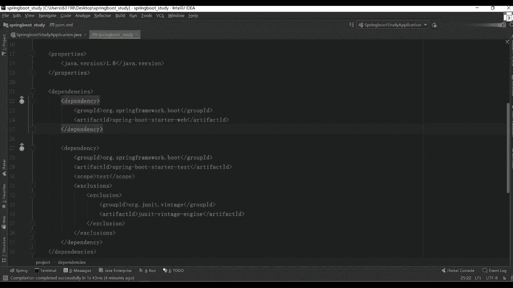
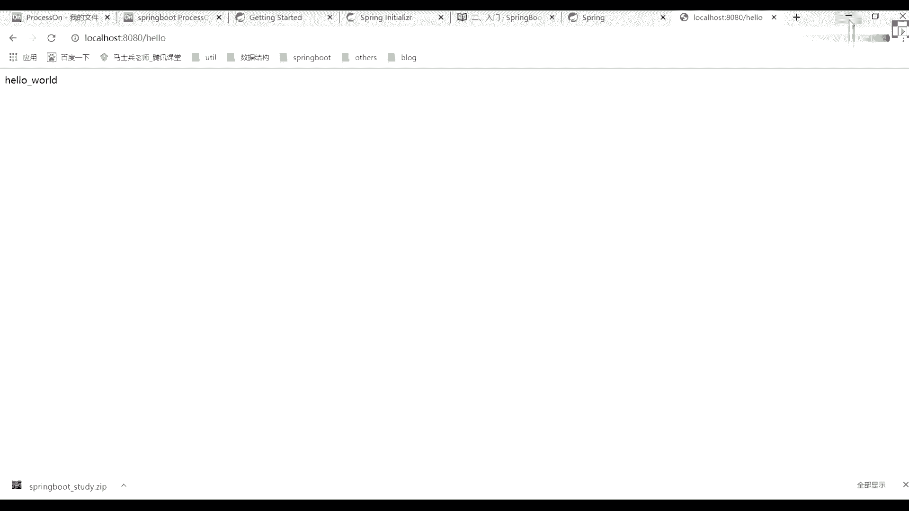
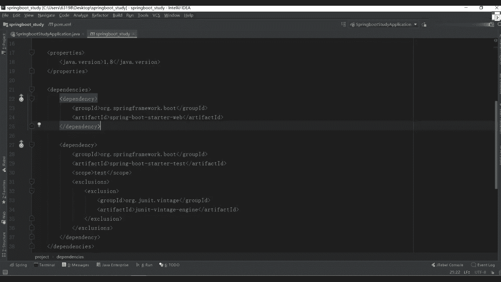
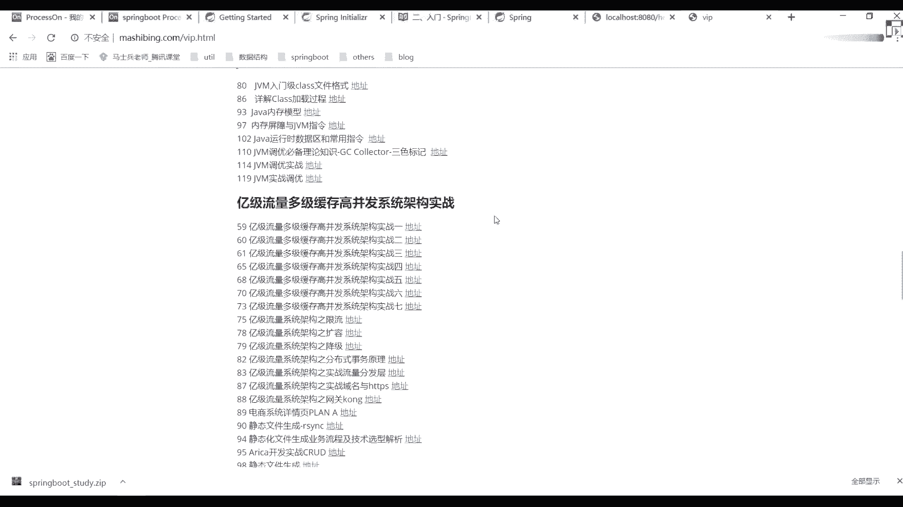
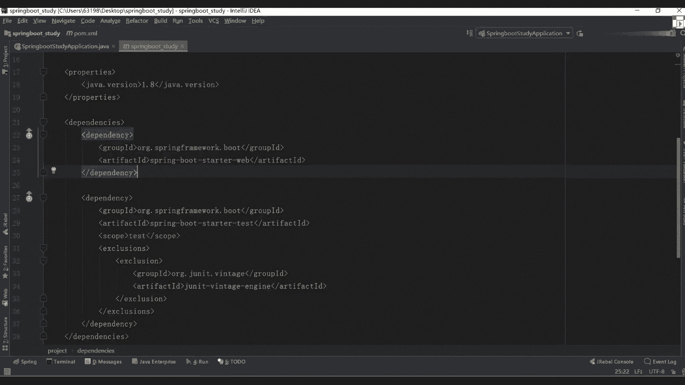
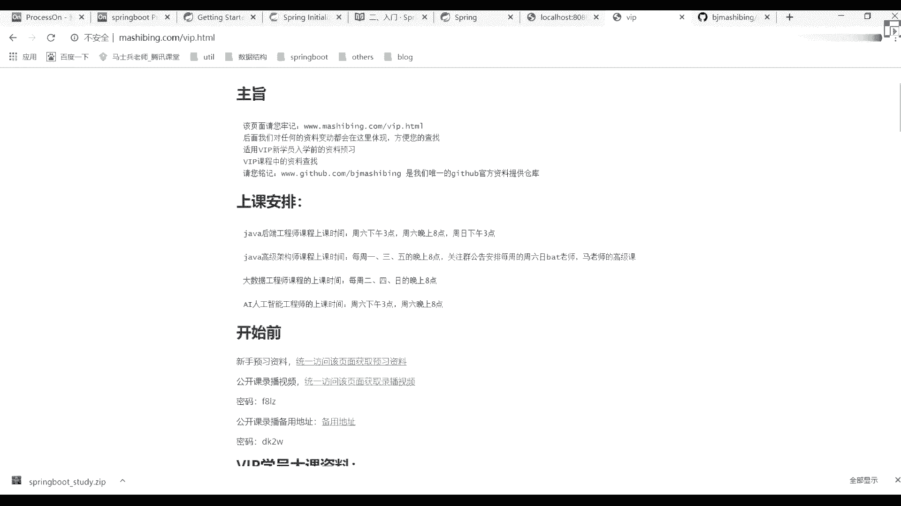

# 花了2万多买的Java架构师课程全套，现在分享给大家，从软件安装到底层源码（马士兵教育MCA架构师VIP教程） - P56：【Spring】课间答疑 - 马士兵_马小雨 - BV1zh411H79h

我能看一下pom文件吗，能啊，破文件在这块儿想看啥啊，呃死人后要学到什么程度，其实不需要需要什么程度，但是很多同学说老师现在面试被问到源码了三分，之所以咱们就把源码讲一下，你记住啊，它就是一个工具。

反正我的理解存不就是工具，它就是应用层面的东西，懂我意思吧，工作会用就好对，确实这样的面试的时候可能会问一下你这个相应的一些原理，好相应的原理，这原理东西啊，咱开源码之后就知道了，别慌，能面试就行了。

就是自动装备，你把自动装备搞下来就行了啊，今天晚上这么多人没人过平安夜，身边都没有女朋友，哈哈哈哈哈，老师吃了几瓶啊，没吃呢，都在外面摆着呢，那班主任不给你们发了好多图片吗，嗯，你还有科比女朋友重要。

别吹好吧，别吹啊，初二陪天20炮，我说孤单，你陪我干嘛，我回去回不去，你回来加班，那中泰项目是不是要关联大数据的知识非常非常多呃，中台这东西啊是最近才提出一个概念好吧，然后我给大家看一篇博客啊。

你的中台比较感兴趣是吧，中台，这些东西，大家有时间可以看一下这个帖子，就有个中台四节是呃，后续的话给大家讲课的人啊，就是中台四节他们单独出了一出来之后成立的公司好，到时候你就知道什么叫中台了。

会有现成的产产品给大家做演示，你放心。

这个没问题的好吧，先让自己了解下就可以了，呃怎么说呢，这就是大数据里面东西确实关联很多，像他读博哈维这辈子可能都要用到，最好还是换的，最好还是会一点吧，会的可能更好一点。

看一下spring bot在使用上相比于之前的spring mvc更新的注解，然后还要取消了配置文件，这样呃，但如果单纯从应用层上来呃，层面上来说的话，确实是这样的，单独从应用上来说啊，就是这样的。

一期的spring源码呢还没看二期的特征描述，我们spring的源码应该不会讲啊，呃基础课的时候我会再讲一讲啊，基础课会再会再讲了，先看一七还是27，这东西看你自己的一个水平吧，看你自己一个水平吧。

这东西还是怎么说呢，二期的话会有像只不过很多同学最近在问那个私人bot，那个量化什么投资平台的项目还有吗，有但只讲一期，但只讲一期好，只讲一期，随后大家讲几课，6~8节，6~8节，明哥说。

穷人不会让你朋友玩，那个量化投资只会讲一次，之后就不会再讲了，那东西怎么说呢，怕你们着迷哈哈，本来打算3月山谷跑路一期，哪些东西要优先学，如果你是为面试做准备的话，刚刚给你看的vip里面的东西。

像上面几个点，你是都要学的，上面你都要学的，散人boss是为网约车项目做准备吧，是的是的，哪几个这块儿。

第一个强调粒子高，一发这块要看第二个吧，如果不会被服务的话，微服务要看多线程高并发要看，然后这个gm要看nike和ni o要看，然后就是下面这个蓝色的条要看好，把这些点看完就行了。

陈老师网约车视频根本看不了，为什么看不了，最后留言，为什么看不了。

学生boss要先学哪些课，s你要会吧，spring源码暂时不需要吧，呃你你可以你可以看，当然很多同学反馈说那个呃听不太懂啊，这所以这块也跟自己情况吧，我建议还是看的建议还是看的建议还是看的。

因为怎么说呢，呃很就是看一下面试的时候有的吹，就比如说ioc和op的一些底层原理，你要知道他的一些environment的环境，你要知道的这东西必须要知道，这次跟我讲项目。

你说纯的那个spring boot呀，你们需要我们做个增删改查，这没啥，你们需要我们做增删改查，这没这没啥，你就跟s一样，你们需要我就找一个前端模板，我们直接投模板，我们前端不得了，不要浪费时间啊。

就是我你们要说的话，就找一个前端模板，我讲下增增删改查，坐一下看一下就知道了，那个很简单的，没啥难度啊，我觉得这个东西没必要，反正你们之后马上接触网约车，网约车的时候，项目里面有代码。

到时候也可以用基础课，看什么时候开始讲点深的东西吧，肯定会讲的啊，肯定会讲的c2 是没必要，我先讲一些想先讲一些基本的应用，等我把这些基本的应用，因为咱们班有很多同学可能之前没用过。

所以这些基本用还是要讲一下的，讲完应用之后就可以开始讲源码了，所以大家如果这个基础应用都会的话，你可以暂时先不听，讲源码的时候，我会让那个班主任老师在群里给大家做出通知啊，这在群里大家都做通知。

到时候你来听也可以，可有同学提现的东西可能感觉比较简单啊，你如果觉得这个东西拿费时间就没必要听了呃，看下别的课也可以，这东西自由选择，无所谓啊，老师的课件在什么地方拿啊。

所有的相关资料都会在我们的get up上面进行展示啊，都会有get up展示，开始听声音做项目，谁听着声音做项目。

呃课件在这儿可能有很多新报名的学生啊，要说一下吧，咱们那个所有课的课在所有课的同学都在里边啊，这同学大家说一下吧，第一个是我们那个架构师课程里面，把之前讲的知识点都在里面，都给大家分好块啊，放好快啊。

这里面都有啊，这边都有，然后呢第二个第二个就是我们的大数据的大数据在这儿啊，这边不在这儿啊，这是那个后端工程师内容课的东西，好吧，就jo c里面的东西，都在这里面，你现在里面能看到很多东西，懂我意思吧。

咳咳，为啥我感觉ioc像多肽，我今天先看其他课了，等会再来，可以啊，讲原版的时候，我会在群里面都通知的，大家如果觉得这东西比较简单，你可以先不看，这没关系啊。

主keeper和release的文件夹里面是空的，可能吧，这有项目吗，这有这东西吗，有的，基础课基础应用课大概讲几节，这看大家把今天讲一下，今天讲一下，明天讲三节课吧，三四节课样子吧，三节课吧。

最多三四节课，最多，k8 s和docker在上传了吗，上传了上传了这这没有什么，看一下，没有的话，一会我更新一下，一会我更新一下，之前班主任忘了，之前班主任忘了，一会我更新一下，一会下课之后我更新一下。

等会扣我k8 s北京是不是很冷，是的，今天很冷，不加思成考怎么会，一期的时候是讲一些基本知识点，做了a项，后续的话我们把spring co详细讲的，周尔发个图，如果没有的话，找班主任要一下啊。

周尔发个图，要不把ioc和dotm关联写的是集大成吗，这个架构师这个歌单目录啊比较大，300多兆，所以有时候可能会比较多，你最好下某一个啊，一个一个下，樊东红，如果哪个资料没有，你去联系班主任。

然后班主任老师给你找好上课资料，我们都留着，主要有时候老师可能会帮我上传啊，这都有啊，最好听一下吧，二级会比一期更全面更完整好，会把一期课更全面更完整懂你说这块儿不用不用不用疑惑啊，嗯如果你面试集训。

你就听一下，面试基本不问你就行，不问就行，呃我还是那句话，你要知道我们这样设计这个课的原因是啥啊，都是已经在职的，都是已经在在职的，很少有小白的课，很少有小白，所以就说我们希望你在工作的时候。

或者你在工作过程中，应该知道哪些是需要，哪些是不需要的，那应该也非常的辨别能力好吧，游戏项目建议你们还是学一下，里面用到很多nike的东西，我觉得挺挺挺挺挺重要的，如果这个公司分到难题了。

你把这个视频看了之后，基本上都搞都挺好玩，在职的才是小白，那些在校时大佬，哈哈哈哈哈哈，咱们这个在校学生确实有些东西有些人是比较出色的，像斗罗的s对吧，心强这些人确实比较优秀，小怪兽。

