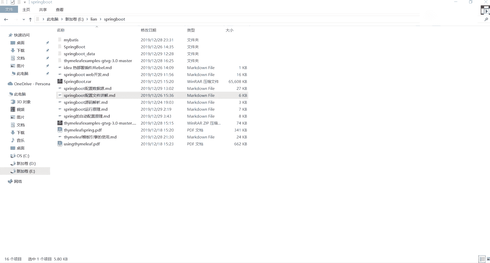

# 花了2万多买的Java架构师课程全套，现在分享给大家，从软件安装到底层源码（马士兵教育MCA架构师VIP教程） - P59：【Spring】SpringBoot基础回顾 - 马士兵_马小雨 - BV1zh411H79h

此书页码还是我讲过了，如果你们觉得还是听着不太不是特别清楚的话，到时候在基础班的时候要不要重新讲一遍吧，重新讲一遍这东西啊，好了，今天呢我们接下来讲我们spring boot相关的一些知识点。

然后上节课讲完之后呢，我们讲的都是一些基础的配置和应用层面的东西，很多学生说老师那个我刚学这东西，然后呢可能学的不是特别清楚，你能不能帮我写一份笔记，所以这边呢给大家准备了一些笔记。

给大家放到这个地方了，好大看到有很多markdown文档，好吧，很多东西都已经写好了，所以一会儿下课之后，我会把这个笔记给大家分享出来，一看笔记就够了，ok我们先来对上节课的一个知识做一个回顾好吧。

我my sql基础家调小课啥时候出呃，正在剪，正在剪那个视频要剪辑啊，咱们那个视频网站大概在1月1号的时候会上线，把夜宴会上线，你会看到就是一个全新的一个视频网站啊，现在还没做好，现在还没做完。

还差两天时间，做完之后，你们从从那个视频网站上就能看对应小课了，好吧好了，我们先来回顾一下上节课大概讲点什么东西，其实讲东西啊也比较简单好吧，就是spring的一个spring bot的一个基本入门。

然后加上一些相关的一个配置配置文件这一块儿呃，很多同学啊可能之前没学过那个s s m和s s m，所以导致说老师这个spring配的配置啊，我不太清楚不太清楚也没关系，这边呢给大家整理了一个文档。

好给大家一个文档，文档里面讲的就是spring boot配置相关一些东西，就我们配置的时候，在之前的时候可能大家更青睐于用xml文档，好xm 2 xm文件在进行配置的时候。

每一个框架还有自己配置文件的格式，而现在到spring bot之后，你只需要配置到我们单独的spring boot的配置文件里就可以了，那个配置文件它支持第一个properties这样一个形式。

好properties这样一个文件格式就是k然后写一个等于v这样的格式，第二个可以，这是一个什么叫y a m2 好ym或者说ym都行好吧，这是这样的一个配置文件，然后这边给大家想写了一些比较详细的配置。

比如说如果我要用properties的话，我应该怎么做配置，ok然后呢创建实例对象应该怎么进行一个引入，引入的时候也是一样，可以通过我们的as the value来进行引入。

这比较基础了或者比较简单好吧，之前你们在学spring的时候，大家都是都是这么配的资源，mc的时候都是这么配的好吧，第二个这有一些测试类的一个测试，下面还说了，除此之外，在我们的purpose文件里面。

还可以引用相关的一些随机数的一些类这东西啊，上一节课我是没讲的好吧，这东西哪哪来的，也是从官网里面直接拿过来的，东西还是一样，不废话，我直接带你们看官方网站里面包含的东西，这是英文的，是中文的。

给他找个中文网站网站，你们从中文上直接看就行了啊，呃很多同学说老师我找不到这个中文网站，我给大家发一下，我给大家发一下，你们把这东西好好看看好吧，里面有一块是专门针对我们的压码，二个我找一下。

这太多了啊，看这块儿他说了石油压马号来代替我们这样的一个文件属性，里面告诉你说它是一个什么叫k，然后呢冒号v它是一个分格式的一个形式，写的下面有各种各样转换的一个形式。

比如说多profile亚马逊的一个文档，然后呢后面还包含我们对应一些缺点，然后按键属性的一个配置，以及后面说可以使用一些随机变量，找一下，刚写代码就从官网上面粘的啊，松三绑定，那怎么没有了随机数呢。

诶我的随机数呢没有了，嗯没有了吗，找不到了啊，你现在就自己找一下吧，反正就是在关关于我们这个随机数，这样有一个配置，这个配置哪去了，反正就是从官网里面粘出来的那个代码，就是从官网里面一模一样的代码。

然后呢我直播帮你在项目里面写了一下，然后把配置文件给追上了，大家看到了可以怎么写的，用dollar符号加一个大括号，写个random点，value rm点，int rm。l。

它分别会转换成对应的一个随机数的一个值，就是说之前我们写随机数的时候，必须要在java代码里面写一个random的一类，然后呢next什么东西，现在不需要了，这直接能帮我们进行生成，然后后面也一样。

可以通过and value这样的一个标签进行一个引入，引入，这代码我不带你们写了，非常基础的东西下去之后沾到你的ide工具里面直接运行就可以了，这个文档上写的比较全好吧，第三个就是多环境的一个配置。

这不用说了吧，比如说我们可以通过spring。profile their active，是通过这样的一个属性值，然后指向我们的dv或者text或者produ p r o d。

就是生产环境可以由多环境进行一个切换，这块东西啊也一样，下去之后自己去测，ok这上节课讲的东西，我们检测一个回顾，下面我说了，除了用properties之外。

还可以用一个东西叫ym l y a m l好吧，他什么东西啊，他说不是一种标记语言的一个外语缩写，但是为了强调这种语言以数据作为中心，而不是以标记语言作为中心，而用反谱词重新命名。

反正这东西啊很奇葩很奇怪，你知道它只是配置文件的一个形式就行了，现在回顾没关系，现在是回顾上节课都说过了好吧，然后后面告诉你说他是一个什么样的形式，比说了语法比time ml简单很多。

然后告诉你它有一些语法的规则，注意一下就行了，然后如何进行编写啊，这水写了，如果你要完成一个多环境的话，可以用spring，然后property，然后呢active加上它后面是用杠杠杠做一个分割。

这表示dv的环境，这表示test环境这块你可以选择你到底使用哪个环境的一个具体配置，也就是说我们现在之前上去给他演示的时候，我写了多个压码文档哦，y哦y a m2 文档。

现在呢你可以把它写到一个里面去了，但是要加三个杠，把它做一个基本的分割，好看这个舒服一点，这是第一点，第二点它也可以支持我们这些属性值的一个赋值，而且你在使用这个文档进行赋值之后。

它在其他属性之方也依然可以引用我们上面指定好的变量值，又写了一个bulps点，name major personage，是不是可以接引用了，然后在我们实体类里面想注入这些值的话，可以怎么注入。

叫configuration properties，前面必须要加一个前缀，因为这块它是一个是一个缩进方式来表示的，person表示说我可以引入里面对应的一个属性值了，然后引入的时候它就会自动进行装配。

就不用管它，但是而且呢它只是一种送餐绑定，就算你的名称写的不是那么一样，它也能绑定上来，但是不要区别太大，因为送餐绑定它有自己的一套语法标识是吧，刚刚在官网里面看吧，这个是不是它的一个缺点，比这儿啊。

松开绑定，好兄弟，你怎么回事，这给你演示出来了，好吧，告诉你说呃什么什么风格，然后建议在什么东西使用，然后建议什么投风标识，下划线表示法大写风格都有东西，这块从官网里面能看到很多的一个信息。

这块只给大家做了一个总结文档，然后再往下做了一个configuration properties和value的一个对比啊，他们两个有什么样一个特点，ok所以这个文档啊，我代码都给它粘出来了。

你下去之后拿这个文档好好配一下就行了，这东西没啥可说的，如果很多同学是刚接触的话，熟练一下，如果是接触的比较久了，在公司已经使用了这块，直接跳跳过去，不用怕了，好吧行了。

那关于我们spring book它的基本配置。

