# 花了2万多买的Java架构师课程全套，现在分享给大家，从软件安装到底层源码（马士兵教育MCA架构师VIP教程） - P5：【多线程】对象的内存布局（大厂必问题） - 马士兵_马小雨 - BV1zh411H79h

到现在为止我们补了两个内容，那么下面呢是用汇编语言解释的，怎么样用对对对对，系统调用，通过通过用户态指向内核态的一个系统调用啊，这个今天呢我们就不单独的去专门讲它了，因为这里面牵扯到的内容呢又非常多了。

呃vip小伙伴通过老师讲的java成员应该掌握的底层知识啊，那里面讲专门讲了这部分内容啊，嗯听我说今天补了两个内容了，第一个呢是cs，第二是用户在内核态再补一个，必须再补完一个。

你才能够深入了解synchronize，真的没那么容易，再补一个啊，继续补，再补一个什么呢，补一个mark word，ok大家看这里，嗯现在很多大厂都会问这个问题，你了不了解一个对象的内存布局。

一个对象的内存布局，好什么叫做对象的内存布局，就是当我们new一个对象出来的时候，它在内存里头到底是怎么分布的，需要向大家交代的是什么呢，呃new出一个对象来之后，这个对象在内存中怎么分布这件事。

听我说这个东西是跟特定的j vm虚拟机实现有关系的，我们今天讲的主要是hobt实现啊，主要是hob时间，其他的别的虚拟机，人家有可能不是这种事情，这是很正常的，好吧，今天主要讲的hosp实验。

hosport在内存之中new出一个对象来，它是这么来布局的，认真听尿出这个对象来之后，比如说我们有一个类class t里边有一个小的成员变量叫m int类型，它等于几无所谓，当我们new一个t对象。

new出来之后，放到内存里，放到堆内存里，它是一种什么样的类型的布局呢，首先上面八个字节的mark word这个词你给我背过就行了，这个词直接背过好吧，这个词儿叫mark word。

如果你非得翻译成中文还不好听，叫标记字不好听，你直接背过，一共有八个字节，它是mark word，在默认的情况下，四个字节的class pointer，四个字节的类型指针类型。

指针的意思是这个指针通过它可以找到我们t。class这个类，也就是说我这个对象是属于哪个类的，通过哪儿去找，是哪个类的对象，通过哪儿去找呢，通过这个class pointer去找到它。

第二个class好，接下来是它的成员变量，instant data，成员变量，刚才我们说的是一个int类型，int类型占几个字，几个字节呀，四个字节，所以这里又有四个字节，好，我们继续还有吗，还有。

如果说一个对象啊，一个对象在hot ball里面实现，它要求这个对象八字节对齐，八字节对齐这些东西你要理解，八字节对齐的意思就是这个对象大小务必是八的整数倍，字节数啊，字节数不必是八的整数倍。

那看我们现在这个对象，我们现在的对象是8+4+4，一共等于16，是八的整数倍吗，是所以后面没有了，假如说我前面正好是个12，而不是16，那这时候怎么办呢，后面对齐四个字典。

四字姐给加上一共补到能够被八整，能够被八整除为止，所以我们稍微回顾一下我刚才讲的这个小知识点，这个小知识点说的是什么呢，说的是当一个对象new出来的时候，它由四部分构成。

第一个mark word一共是八字减，第二个class pointer，默认是开启压缩的，压缩之后是四字节，instant data，这个里面是多少，这事呢得看你的对象里面有多少成员变量。

那如果一个long类型，这里面呢又是一个八字节，8+8加就等于20 20，不能被八整除怎么办，后面再补四个字节，这四个字节是空的，好了刚才我讲的这小段知识能跟得上的，给老师扣个一。

方法你要问出这个话题来，说明你根本就不了解方法是个什么东东，好了，方法叫做放在虚方法表里，那个是另外一个视线啊，别问那么多，你先跟吧啊，今天晚上能消化掉就不错，ok那讲到现在为止。

我们用一个工具来证明它，这个工具呢叫java object layout，能证明这件事的工具特别多，java的agent h s d b那种工具，最最方便的就是这个这个是什么呢。

叫java object layout，这个工具是来源于open jdk，open jdk提供了这个工具，所以你在你的程序，你的程序里面加这个maven就可以了啊，把maven依赖加上就ok。

比较简单好看，这里。

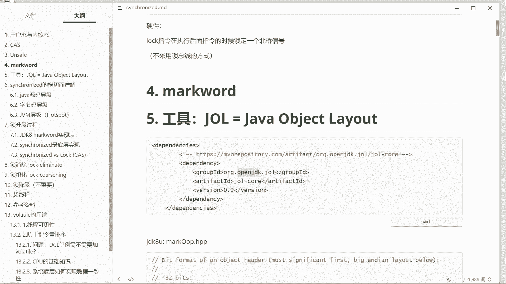

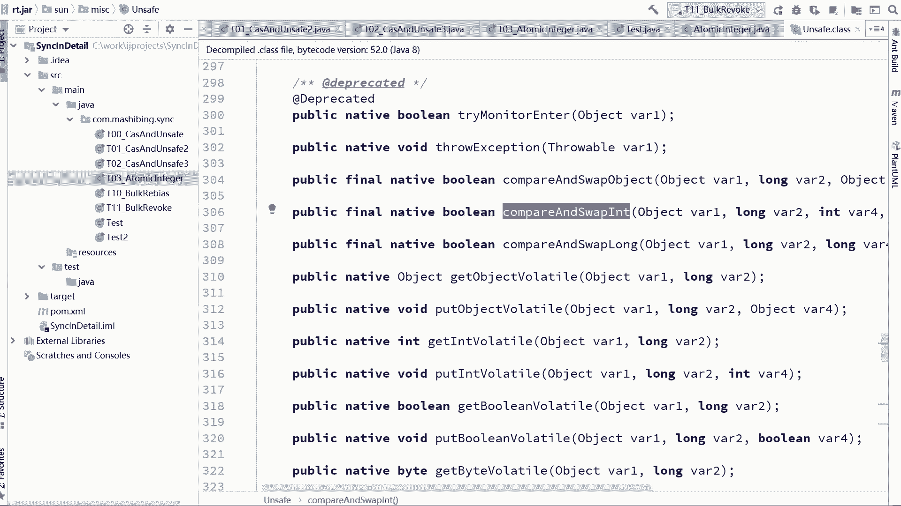

我看我这个加没加加了。

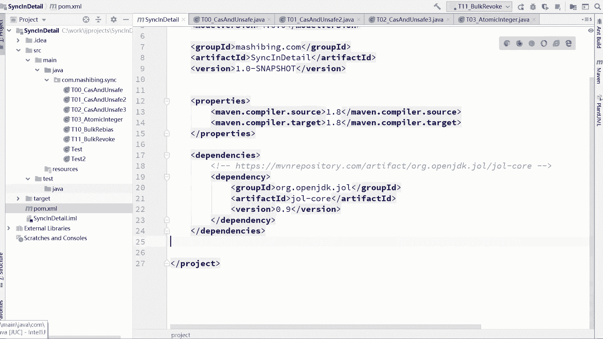

改个名字啊，respectory name改成叫，零四hello j o l reflection，呃来我们看这个小程序啊，来我们看这小程序呃。

这个小程序呢给大家说明了一下这个j l l l这东西到底该怎么用，这东西用起来相当简单。

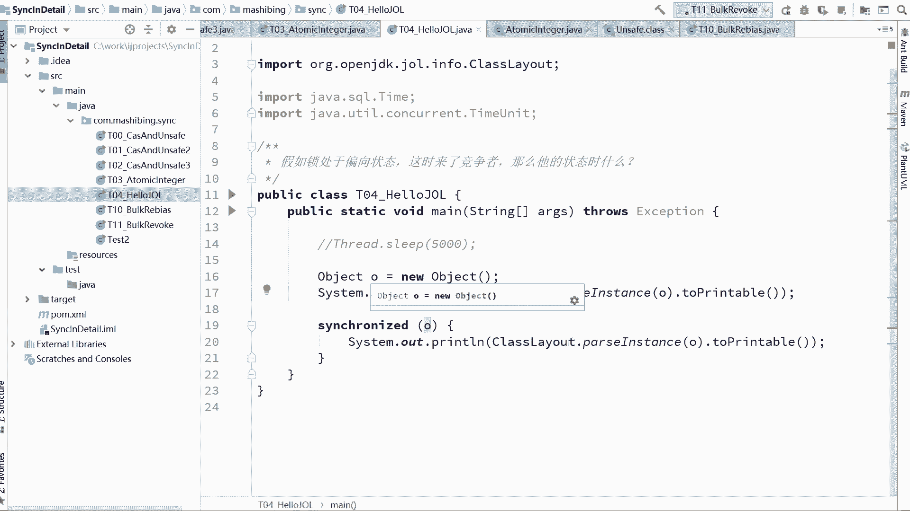

大家看这里，下面先把这个代码输掉呃，我们先来看这个代码，这两行代码就足以说明问题了，object o等于new object，然后我们把这个object进行一个分析，怎么分析的呢。

用的是gl工具里面的一个类，class lout，这个类有静态方法叫pass instance，把这个o进行一个分析，分析完之后呢，转换成为可以打印的字符串类型，然后我把它打印出来，就这么简单，跑一下。

跑一下看结果，看到结果你就理解了，我们用了一个非常普通的object，好大家看这里，这里拿到的就是object这个内存，它在它在内存里面的一个布局，显得显示不是很全诶。

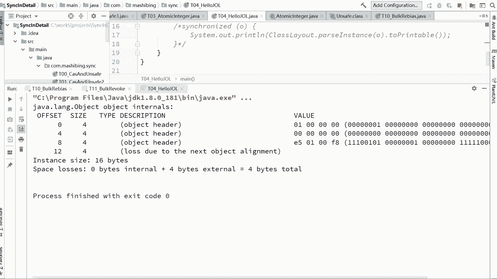

往这边拖一拖。

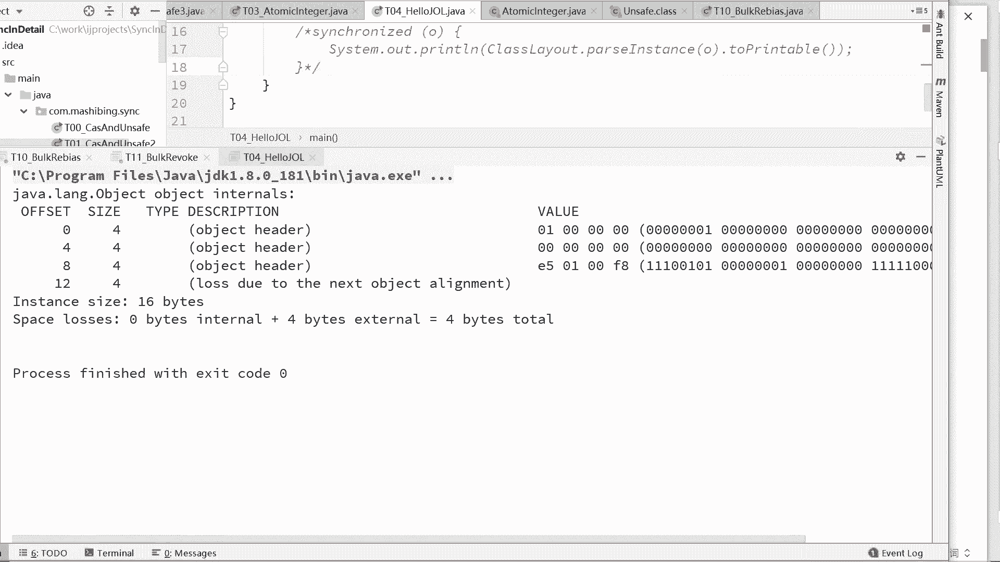

还是不是很全啊，一会我给你拖拖拖过去看吧，我们来看这个内存的布局，看看是不是我们讲的那个四个内容，大家看这里这个内存打印出来之后是什么情况呢，从零字节开始往后数四个字节，又从四个字节开始。

又往后数四个字节，所以呢每一行都是四个字节，这里一共是八个字节，这里呢它称之为object header，object header有两部分，第一部分呢叫mark word。

所以这里是mark word，从第八个字节开始，右数四个字节，这四个字节是什么呢，这四个字节是class pointer，所以你看到的这个值它指向的那个通过它能够找到object，第二class。

因为我们用的是object，由于前面三个加起来是12，不能被八整除，所以后面又有一个对齐四个字节，lost due to the next object alignment对象的对齐。

所以整个对象呢它的大小是多少个呢，是16个字节，ok大体能看懂的同学来给老师扣个一，这块没问题是吧，好当我们理解了这件事之后。

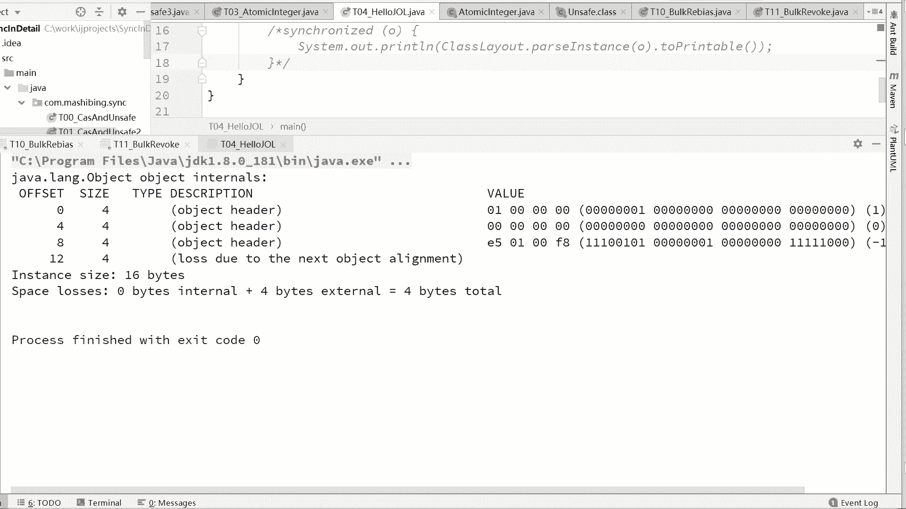

下面呢我们来看看看什么呢，有同学说老师您是讲synchronized的大哥啊，class data去哪儿了，大哥这不叫class data，这叫instance d，你new了一个object了。

object里面有instant data吗，没有啊，所以他去哪了，他没有的东西，你问我去哪了，明镜本非静菩提议非台本来无一物，何处染尘埃，没有的东西，你问我去哪儿，我能知道吗，滑向了虚无。

每当我遥望广袤的宇宙，我的心总是滑向虚无，回来回来啊，搞反了好，大家看这里，但是不要忘了我们讲的是synchronized，synchronized什么，我们来比较一下，看看synchronized的。

如果是synchronized的，他到底是做了一件什么事，往这看，symphonized o表示锁定这个对象，锁定它，锁定他之后，我再对这个对象进行布局的输出，为了让大家看清楚啊，算了就这么走就行了。

好，看一下做个比较。

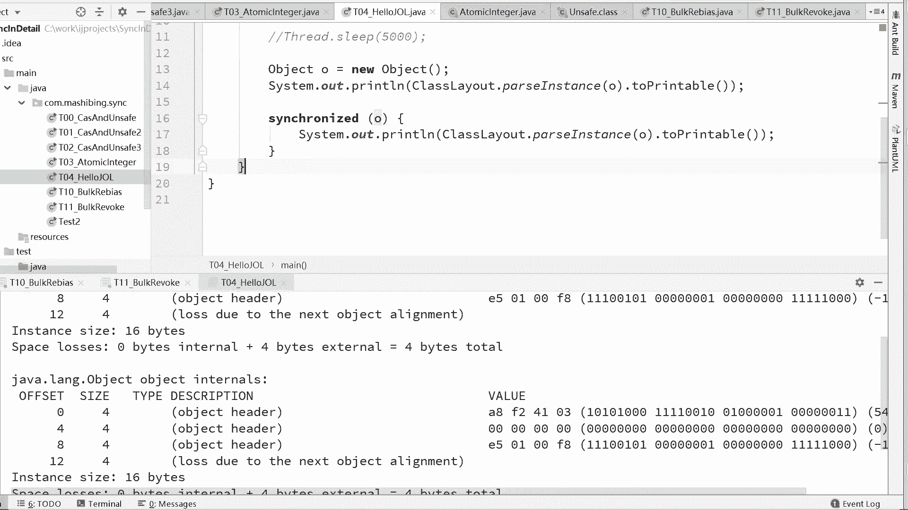

好好比较一下，看看上下两个对象有什么区别，比较一下，我看不知道哪国文字的小同学来说，为什么布局输出是四个字节一段显示的，人家喜欢，发现了吗，这一行和这一行是不一样的。

当然如果随着后面的srt越来越复杂的时候，跟你说是前面两行都是不一样的，前面两行是什么东东来着，还记得吗，前面两行叫做mark word，mark word这东西ok在这里你就会发现了。

原来我们所谓的上锁给对象上锁指的是一件什么事呢，在hobo里面的实现就是修改mark word。

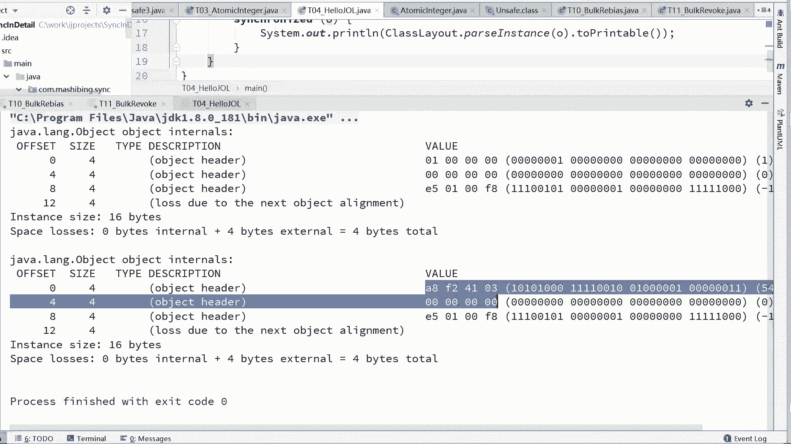

所以所信息它被记录在了mark word里面，好讲到这里，我们得出一个结论，关于mark word这个东西，它里面记录了非常重要的信息，最重要的信息就是锁，synchronized。

ok能跟得上同学来给老师扣个一，当然如果我们说的更加详细一些呢，关于这个mark word里面还记录了什么呢，还记录了什么呢，还记录了hash code，这些个都有好吧。

如果大家伙想弄清楚一个mac word里面它到底详细的记录了什么，大家找到hot spot源码mark o o p。hp p文件我已经给他摘下来了，摘出来，好。

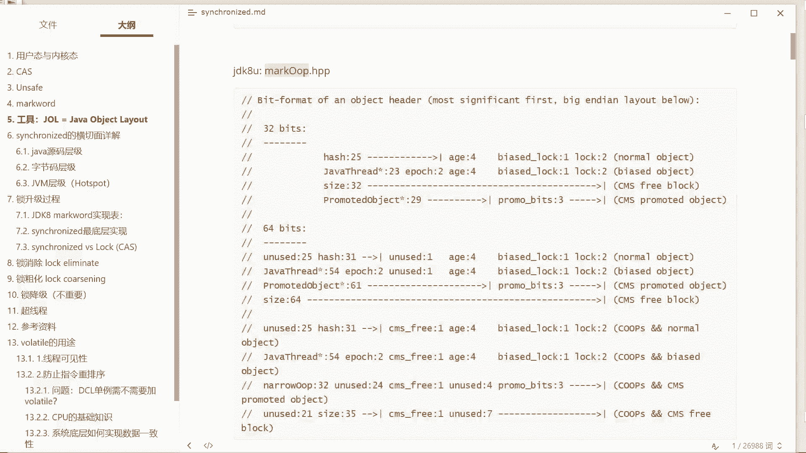

啊再来找出来mark op的hp在这个文件里面不需要看它的仔细的实现，去看它的注释就可以，注释呢分成两种形式，一种是32位，一种是64位的，64位的，直接看64位就可以，好吧嗯。

64位我们现在讲的都是64位啊，在64位里面一个mark word里面，你会发现他详细的记录了这么多信息，我勒个去太多了好。

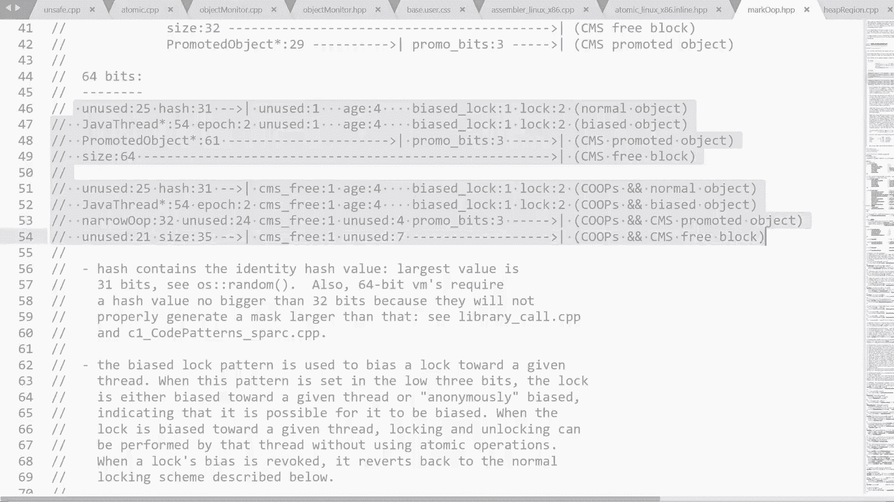

那这些信息到底是什么呢。

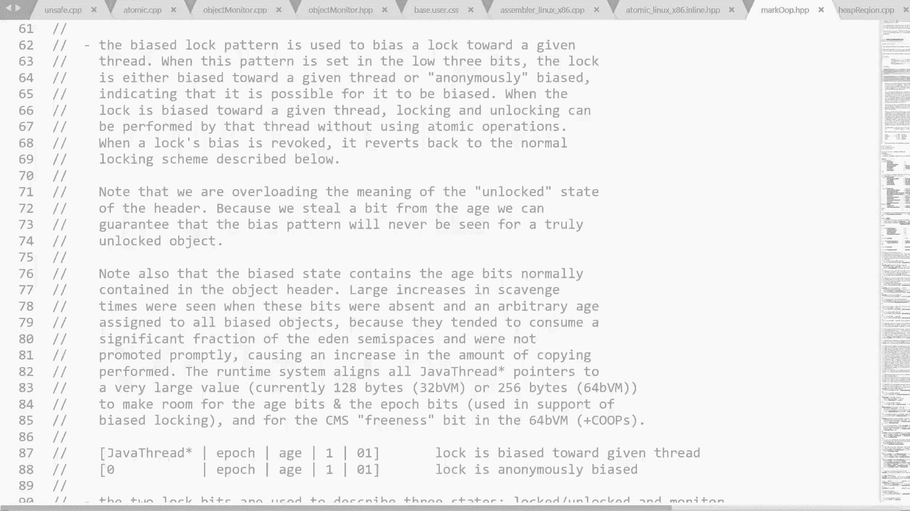

老师已经帮你总结出来了，32位的往上一堆。

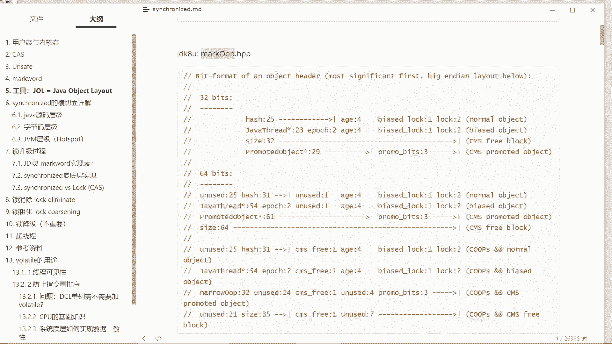

64位的网上还没有，目前只有老师这张图是最新的，所以是不是要抓下来啊，更新一下我的笔记。

讲vip的时候，那会儿呢讲的是32位的啊。

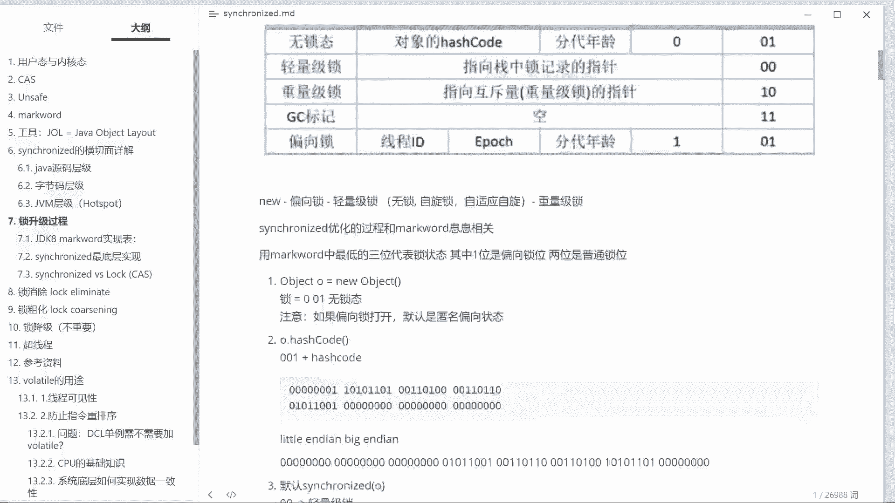

