# 系列 3：P60：【Spring】SpringBoot整合Servlet - 马士兵_马小雨 - BV1zh411H79h

下面要干嘛呢，我们聊一个东西叫web，也就是说现在我们用swim boot搭建我们项目的时候，他在开发一个web项目的时候是比较容易的，因为在官网首页里面告诉你了。

说spring boot里面内建了一个什么叫tom cat啊，真理这样的一些容器，对不对，然后直接运行了，运行时java杠炸就搞定了，但是在运行这些web项目的时候，我希望你能注意一些细节点。

为什么在官网里面对这块其实描述的也是比较详细的，你往下翻，这个东西叫开发web应用程序，说spring boot非常适用于开发web应用程序，你可以使用嵌入式tom tom cat，这题好吧。

大多数web应用程序使用spring boot starter的杠web，这是我们什么，也可以使用这个wiflows好吧，来搭建响应式的一个web应用程序，但不管怎么样，你要知道一点。

用它来搭建web的时候非常容易，因为我们在创建一个普通web项目的时候，只需要勾选一个模块就够了好吧，至于说为什么要勾选这些东西之后，我跟大家说还是一样，我们可以通过源码层面来说。

其实啊很多同学应该都知道，sn bot里面它底层最核心的和原版里面最核心的介绍是什么。

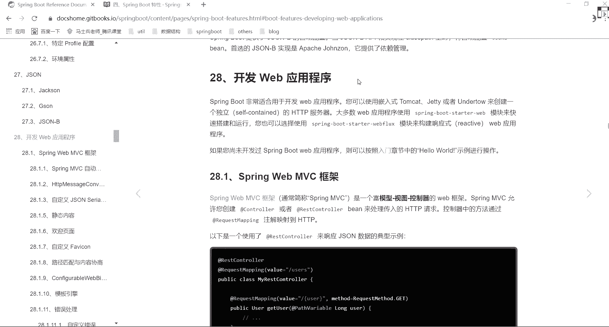

叫自动装配原理，对不对，好吧，叫auto configauto config，在to config往下走，这儿有一个spring factory，在这个factory里面，你往下翻看这块什么东西呢。

叫able auto configuration，里面有一堆以auto configuration结尾为这些文，这些类这些类干嘛的，最终就为了帮助我们完成一件事，就是自动装配啊。

就是自动装配这样一个原理，这个原理后续的时候我会告诉你它一步一步是怎么来的，但是你要有这样的一个意识，所以你需要哪个组件，直接把哪个组件直接以一个泡沫网页形式打进，加加进来就可以了。

我说老师这里面你看一下有这么多的一些auto configure，我每次启动程序的时候都需要进行加载吗，这都最近下载吗，不是的好，为什么，不是你可以往上翻点，随便点开一个，点开一个之后。

你会看到很多的一些标签，有两个非常显著的标签叫什么呢，叫conditional，什么东西，conditional什么东西是啥意思，什么叫condition，表示条件的意思，比如说它会进行一堆条件的判断。

如果你没有引路的话，大家看到这是不是爆爆一个红，那意味着此时他是不会进行自动一个装配的，也就是说你导入对应的配置文件之后，就是我们的pom依赖之后，它才会进行相应的一个导入哇，这块像有一个基本常识。

这是为什么告诉你们说每次在开启项目之前。

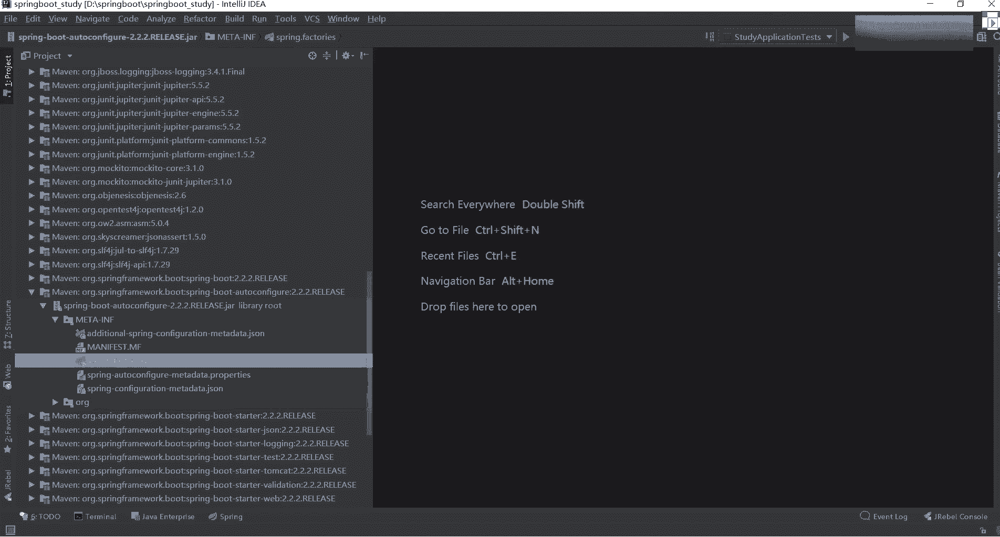

先把我们的炮母舰配置好，配置好之后导入对应的一个依赖，原因在这好吧，ok这块先聊这么多，再来看说spring web mvc框架对吧，告诉你说mvc是个什么东西，应该怎么做一个最基本配置这种东西啊。

其实之前我们已经讲过了，或者聊聊聊聊的已经比较多了，这块我希望提一件事，特别是年龄比较小的同学，有没有接触过server lake这样一个东西，有接触过这东西吗，什么叫s叫server apply吧。

是不是一个服务的一个小程序，把它本身是这样的一个意义，好吧，很多记住了mvc或者说一些外部的一些框架，几乎都是用于我们的，sorry，来来开发出来的啊，js的对的，这是比较老气的一个版本好吧。

其实它有一个过渡的过程啊，刚开始是jsp，然后呢加so late，后来呢切换成s s h，后来到s s m到现在又变成spring boot，是不是还有这样的一个历程好吧。

我不知道你们这块有同学接触过没有，然后最近打电话发现有好几个同学，他们公司里面还在用ssh stress to和harbor net，很多同学可能都没有经历过这块这块环节也没关系啊。

全经历了s刚学的时候最好都学一下，反正我认为最好学一下，因为学完之后你会感受到这些框架的升级，它带来的一个便利之处，把那天带来的便利之处，你会发现你的开发越来越简单了，很多框架就为什么要进行框架。

一个迭代原因也在这个地方，就在于说它让人或者开发人员变得越来越呃懒或者越来越简单，开发过程能够加快一点，懂我意思吧，那这块我们要学一个东西是什么呢，第一个点先学一个叫server lt相关的一个点。

刘老师为什么要学server rate啊啊为什么学server rate还是一样，因为我们的spring boot里面可以集成我们的so，可以集成我们的surface好吧，它里面有对应的一个相关配置。

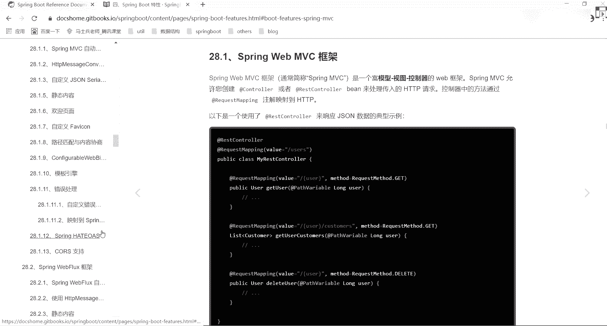

给大家找一下，这叫内嵌siri的容器好吧，支持这些东西有什么用处啊，用处非常非常多，给大家说一下，就比如说我们后面啊，今天我应该会讲到数据源这个层面啊，就data source，大家注意啊。

你在公司里面可能在用的时候可直接获取，我用g d b c现在已经没人用了，更多可能要建立我们的数据库连接，然后再写一下我们的database，好吧行啊，data source不对啊。

要写下data source，在选择data source的时候，大家想一下现在用的最多的，好用的最多的一个是什么叫黑carry，是swimt里面自己自带的对吧，除此之外还有一个什么叫德鲁伊。

这是阿里巴巴开源出来一个框架，而且大家应该知道德鲁伊他是什么，叫专门为监控而生，还记得吗，是不是监控而生，也就是说你要想实现德鲁伊它对应的一个监控的一个性能的话，它需要你内嵌thy进去。

所以这块要作为我们第一个优先学的点是cbot，大部分开发人员只需要简单对应的starter来完成获取完整的配置实例，默认情况下监听8080上的http请求。

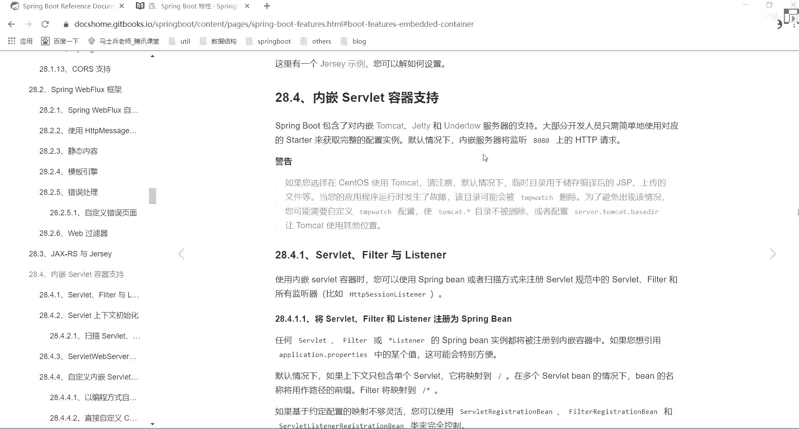

这块我们已经讲过了吧，来再写个代码试试啊，怎么做呢，非常简单，new一个project是啊，等一下come，这样把视频这样写一个spin，bot下划线加web 2宝拿走，刚next这要勾选了吗。

第一个勾选上我们的spring web这样一个框架啊，把它勾选上其他东西你可以自己去加好吧，自己加这里面透露出来另外一个东西好，另外一个东西叫spring boat dv toys，这是啥呀。

这是一个开发者工具，这些笔记我说一下啊，打断一下这些笔记，我最终都会上传的。

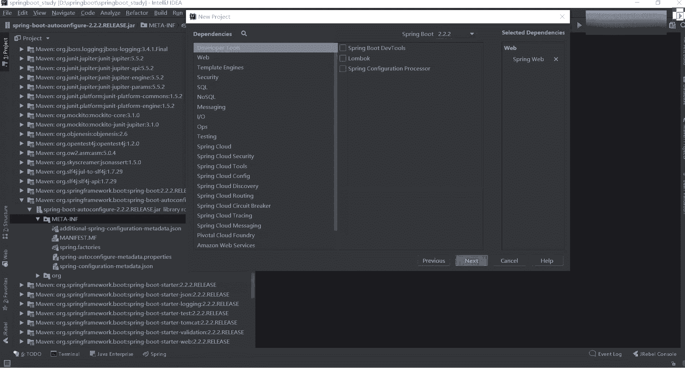

上传什么地方啊，咱们有这样一个地址，可能喜欢能先来啊，再说一遍，在bo马士兵这里面有一个internet t tt，在这里面这里面我建了一个单独的目录，叫spring boot。

好第一天第二天讲什么东西，我这都会往里面写好吧，所以拿过来之后，你直接从这儿下载就行了好吧，直接下载就可以了，ok这不都说了，刚刚看到一个东西叫dev toys。

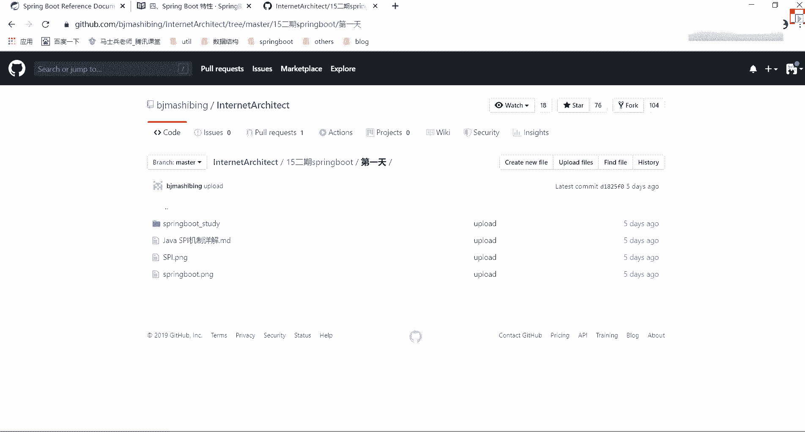

叫热部署用的，很可能都知道，除此之外还有什么东西叫jio好吧，这样东西我不知道你们在公司里面好吧，哪个地方用的更多一点好吧，这块儿我们一会儿都说一下，都用过是吧，如果你要用dv twice的话，怎么办。

你直接加载一个maven依赖就可以了，而如果你要用我们的jbl的话，这块你可能需要进行额外的一些配置，我也感觉是宝好用一点好。

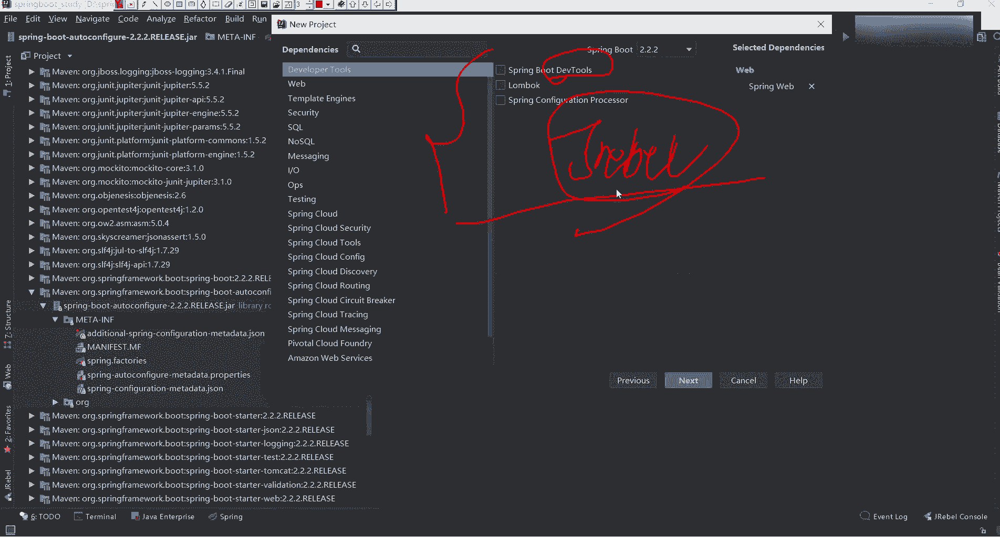

这边好像一点好吧，怎么做也很简单，告诉你官网里面哪个地方有，非常简单，你往上翻往上翻，这儿有一个开发者工具，在开发者工具里面他说了，你可以使你的开发体验更快，syn bot第1v twice。

以提供额外的开发时的一些功能，需要知识的话，把一模块加进去好吧，加完之后告诉你说应该怎么用，下面有一堆配置文章，解释下之后自己看就行了，但是我知道啊，这个dv twice我们这儿我介绍了。

不是不想介绍了，没啥用好吧，我们现在重点来说一下我们的jb jb也非常非常简单，我这给大家写了一个madam文档，好马大的一个文档，这文章里面我写的比较清楚了好吧，第一步安装在我们在idea里面。

fail setting plugin brother rise，卡在里面写入我们的jer宝，说了之后，找到jerball for int install子，弄好之后，然后重启就行了。

但是它需要进行一个激活，而这个激活的时候好吧，大家注意了，这儿有一个激活的步骤，你按照这个激活步骤去进行操作好吧，最好你自己能做一个反向代理的一个服务器，自己搭建的话，不用担心失效，可能需要失效。

之前明哥应该也说过这东西啊，之前明明说的时候应该是在那个一个例子里面讲过的，我这是idea里面的，所以这块都有了，下去之后按照这个文档来做操作就行了。

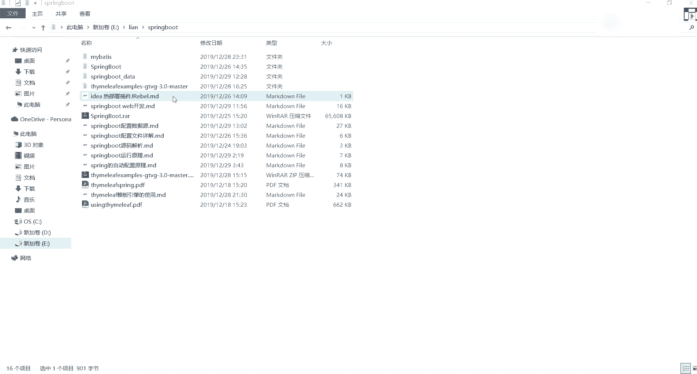

这不演示了，我这这个id里面已经集成好了，那看这个这个图标了吧，只有只有宝里面的一个图标，非常简单，如果谁在安装过程中遇到问题了，私聊我好，很简单一个东西了，这不说了啊好了。

刚刚我们是不是选择好一个web的一个窗口了，选完之后点next，这样改一下啊，spring boot spring boot web，我们改，我们改一下这个目录，我直接给你们上传上去。

给他reports internet嗯，这怎么没有，老王还没同步啊，没同步，我换一个吧，这样写到斯不是bot放这里边，杠啊分析师，ok，直接打开就行了，打开之后如果你想配置一个web项目的话。

就变得非常非常简单，怎么做呀，直接在我们把这些东西先删掉，这东西想删删不删无所谓啊，我看着难受就删掉了，s r c选择me，在这里面可以建一个ctrl n t r o，待会r ctrl完之后。

在里面可以随便写一些东西，知道吧，叫my control，创建好之后，前面加一个at叫regress controller，只要解说rise control吧，它什么意思。

然后pp这string hello，这是我们之前写的东西啊，还是一样，retur，spring报他来返回上面呢，加一个at request map，加一个，hello，看见了吧，写完之后直接运行。

我们当前这个应用程序启动一下，行动号召。

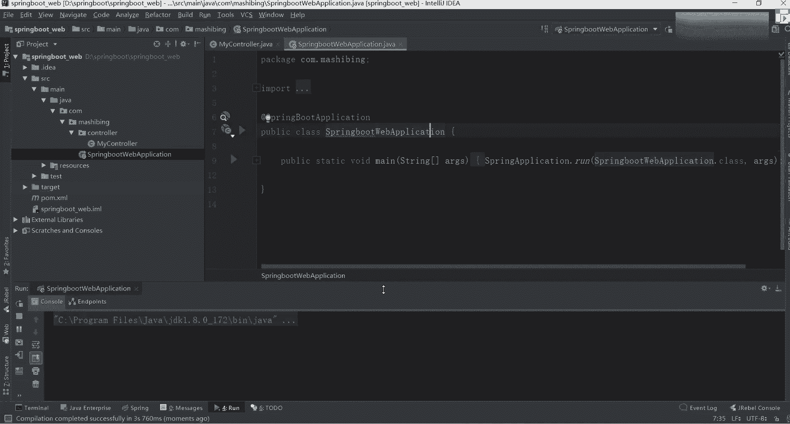

这是默认在8080端口进行一个启动，所以此时我们可以直接进行一个访问，叫local host 8080，然后杠flow走，是不是告诉你返回hello，spring boot，大家想一下。

这是不是就是一个web项目了，这是我们之前说的搭建，非常非常简单好吧，最简单的一种方式，除此之外我说了它可以集成我们对应的一个so late，后续的时候我们会对它进行一个使用，就这块我希望大家能够了解。

然后在这块集成的时候注意了，他说了一遍啊，你把它翻这块儿说什么东西，然后呢在使用so late的时候，你可以配什么，第一个pso late，第二个pay filter。

第三个pay listener好吧，此外就不用说了，就是我们实际处理的一个业务逻辑类，然后呢fire是什么东西，是过滤器吧，然后listener呢是不是我们对着一个监听器这块。

你都可以做一个最实际的一个操作，他说了使用它的时候可以使用b或扫描方式来注入sr好吧，然后呢说将这些东西要干嘛，要注册到内嵌的容器中，如果你想使用这里面值的话，这样可能会更方便一点。

后面告诉你说我应该怎么加入这些过滤器，是不是写了一堆参数代码，写这些案例吧，这块我们直接来演示我们的案例，代码还是一样啊，我这儿给大家写了一个非常重要的一个文档，web开发。

来看一下第一个cbot web开发，说第一个叫整合我们的servlet好吧，折都进行整合，第一个你要先写一个s好吧，先写一个s这块是不是我们原生代码，我这把拿过来了。

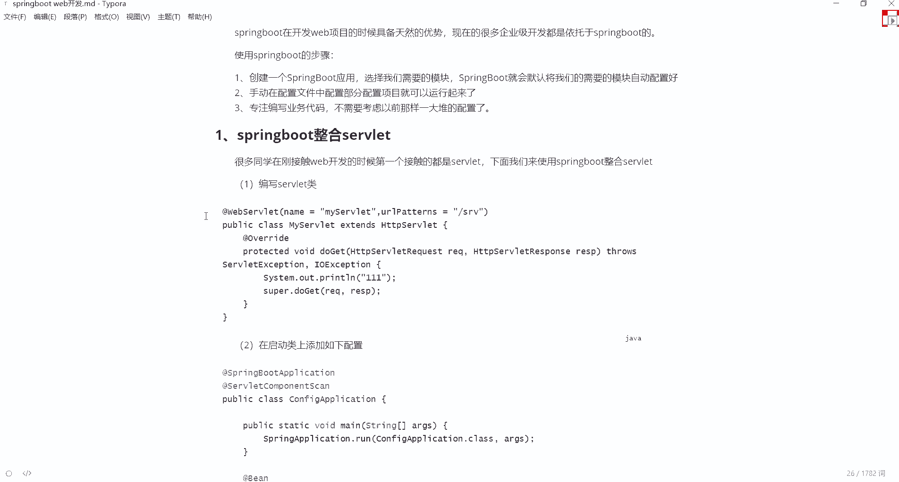

正好不浪费时间了，没啥没啥意思啊，来直接打开我们的代码，开始sorry的二位扎完之后，这是用的是sorry 2333点吧，是不是直接用我们的注解就可以了，注解配的时候写什么东西。

第一个叫web so late，第二个写一个名称，第二第三个写一个叫you are pattern好，这两个东西是什么意思啊，你们都卡吗，我这儿没卡，所以应该是不卡的啊，如果卡的话。

可能是你自己网络的问题，不是我这的问题是吧，自己重新调一下网络，ok来我来看，当我们导进来我们对应的一个server之后，他首先需要继承一个叫http ser，这不叫继承好介绍完了之后。

上面写一个东西叫web solid，表示说这是一个si的实体类，如果原来你没有用注解的话，你怎么办，你想一下你在之前搭建项目的时候，是不是都有个东西叫web点插毛对吧。

server name等于什么东西，survey class等于什么东西，还有东西，you are pattern，python里面是不是写了一些呃nt in设置的东西，好，很麻烦很麻烦好吧。

所以这块儿他做了一个简化，然后这第一个是我们的名称，你要写一个名称，第二个写上你对应请求匹配的类，好把它写上就行了，听起来，麻烦啊，其注意了，这块我们其实并没有写全，为什么。

因为这里面除了一个do get之外，还能有另外一个叫do post哦，叫do post这块其实都有用到，比如这个你可以写一下，多看到了吗，这是一个do post的好。

一般写的时候就说你匹配到你对应的一个get和post post这样一个请求方式，仅此而已，我们这儿进入我们的get请求就不用管它了，这里面我的处理逻辑啊非常简单，没处理就直接写了一个一只能打印就够了。

河南老师这个c位的整合用的不多吧不多，但是我说了我们后面会有一个应用场景，然后有一个应用场景，什么场景，就是我们在配置德鲁伊监控的时候，我们需要自己来写一个srt，那时候也需要自己写好吧。

其实英文思维的东西都是一模一样的，你这块先稍看一看，先要理解其中的一个最基本的一个原理，这个说看就行了好吧。

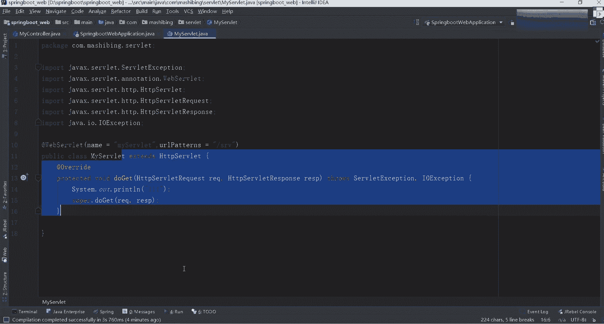

说完它之后没完还要干嘛呢，说在启动类上添加如下的一个配置，这个配置才是最核心的一个点，就是说你这只是定义了一个srt，我怎么知道或者siming boot，怎么知道你当前这个so late应该生效。

或者说什么时候生效呢，这就意味着你要在你的启动类里面好吧。

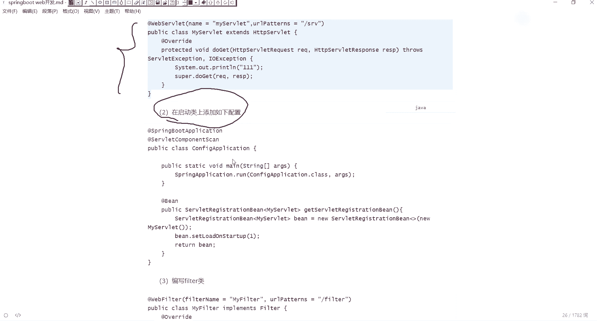

加一个东西，第一个找到我们启动类这块儿加什么东西叫at server le component sky，一个注解吧，好把它给装载进去，它会有一个自动扫描这样的过程，大概加上加完之后里面没完。

你需要把你对应的那个service注册为我们当前sbot容器里面的一个ban好。

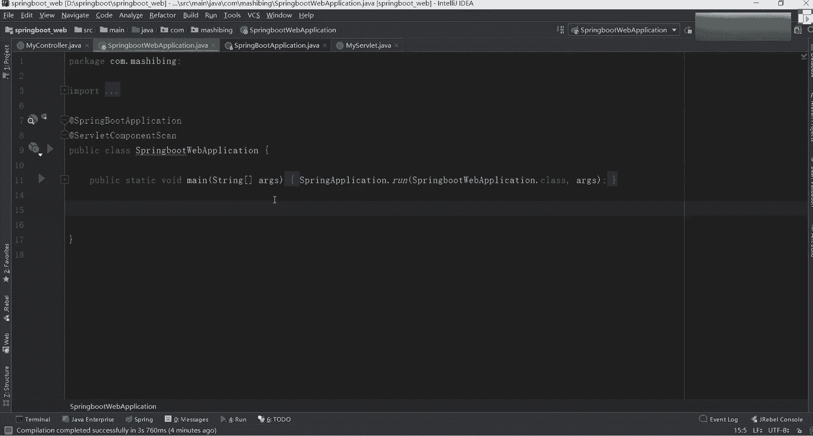

这块怎么注册，他写了一堆代码。

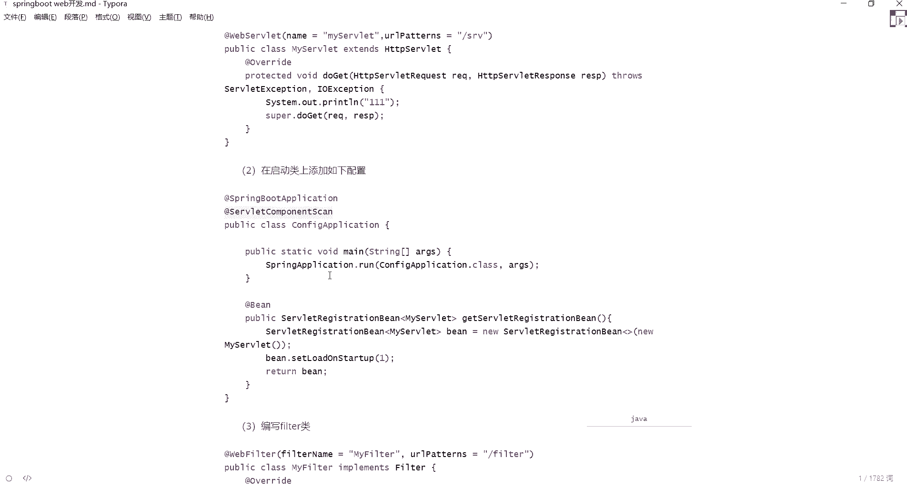

我们把这个b直接拿过来，大家看一下这个病，其实非常简单，做事情也不是特别麻烦，你注意了啊，你在写代码的时候，你没必要说老师我每个代码都是手写吗，没必要来看看这个逻辑吧。

这边有什么东西叫get server register，registration b什么意思啊，获取server注册的一个并对象吧，然后这首先创建一个东西叫serate registration。

并然后后面告诉你说你有一个这样变，把我们当前这个si的对象给放进去，放完之后，这儿有个东西叫bsload on starup，很多同学如果你配置过web点叉ma的话，应该有这样的一个呃记忆，这是干嘛的。

这设置我们当前sl它装载了一个呃，什么时候进行启动，什么时候配置，我们当前这个类好，这个加属性，我们这配置成e了，然后配置完之后把这个并返回去，此时就意味着我当前这个病已经加载进去了，好加进去。

那这怎么办啊，直接进行一个重新启动，之前我们中学怎么起的，是不是用我们这个直接键启动的不太好啊，我们这换成我们的追日报，启动之后的话，我们这儿就不用管它了，好吧，等一下吧，开大几刀啊，嗯。

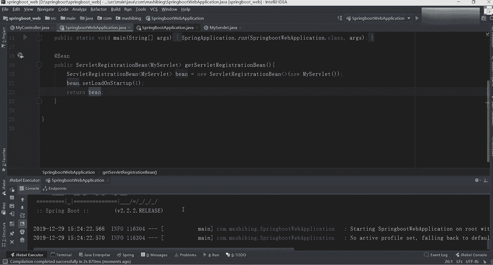

没报错吧，此时我们可以发送我们队内一个请求了，暂时用什么东西叫杠杠s r v吧，回车诶，怎么有东西啊。

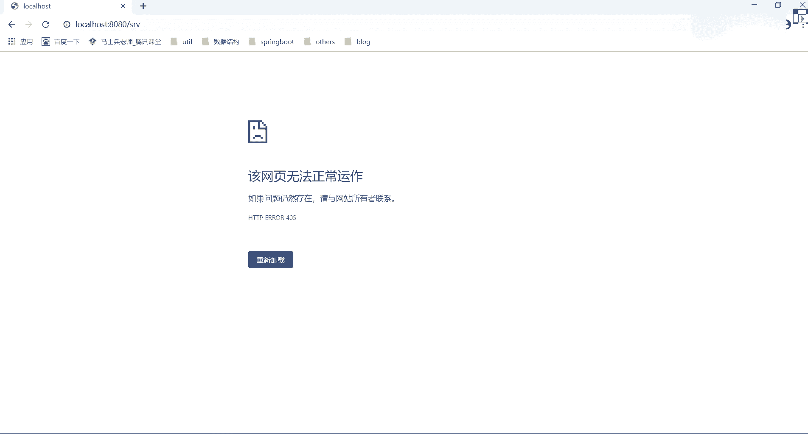

看着看这个信息打印出来了吗，答案出来了吧好吧，这个大家不是已经看到了，我刚刚写msl里面是不是打印了一个111这个这个请求，这是不是这已经打印出来我们对应的一个结果了，懂我意思吧，所以这个配置非常简单。

只需要说我自定义实现一个surface一类，实现完了之后，然后直接把当前类的类注入到我们的spring boot里面就搞定了啊，这配置难吗，不难吧，当然刚刚那个风声也说了。

老师这个sy单独用的话是用的很少，事实确实是这样的，几乎没人用啊，但是但是你要知道一件事，什么事情呢，我在进行这样的一个呃page的时候，我怎么把我们对应server lt给注入到我们当前这个容器里面。

也就是说在我们当前这个启动类里面，这行代码或者这几行代码非常重要的好，这写下这个注释吧，添加到，我知道了，除此之外注意了，这后面还可以写东西，叫什么叫u r r making，好，什么意思。

这可以加一个叫杠，这写一个s2 吧，随便写东西啊，杠s2 好，随便写的东西，写完之后，这块你必须要重启，我们这再来发一个请求。

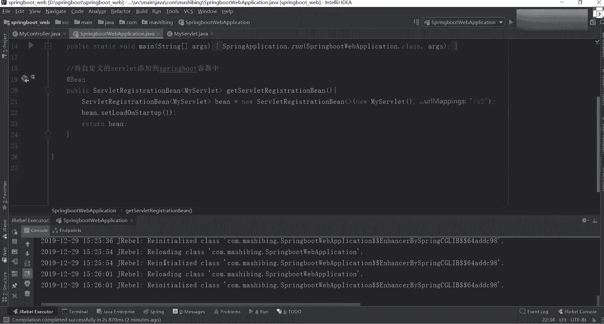

叫s2 回车。

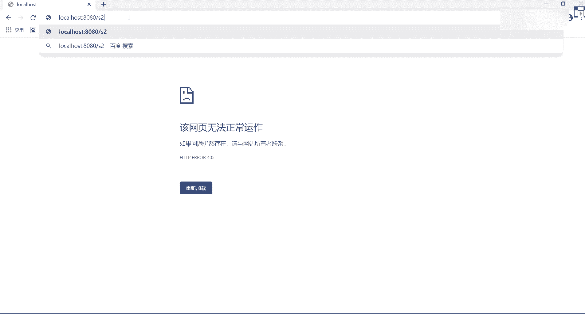

是不是这页面没效果吧，因为我们这没有返回任何东西了，看这这返回对应结果了吗，是不是返回了，然后我们对应结果了吧，好这回大家一定要注意了，好吧，把我们当前这个结果你返回来，意味这也能调用成功。

就这意思好吧，容器是指定容器吗，是的，l o c容器就是我们自动装配这个对象是lo c，是这样的。

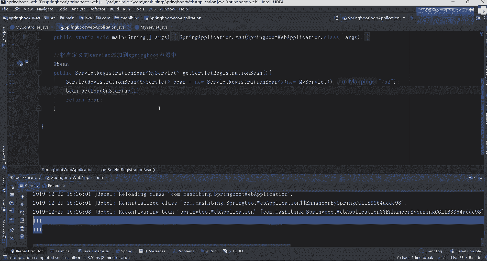

好这把听明白了吧，他呀并不难好，它并不难，要让文档里面直接写就行了，好吧，我要说的不是这个东西，要说的是什么，是我们s2 生效了。

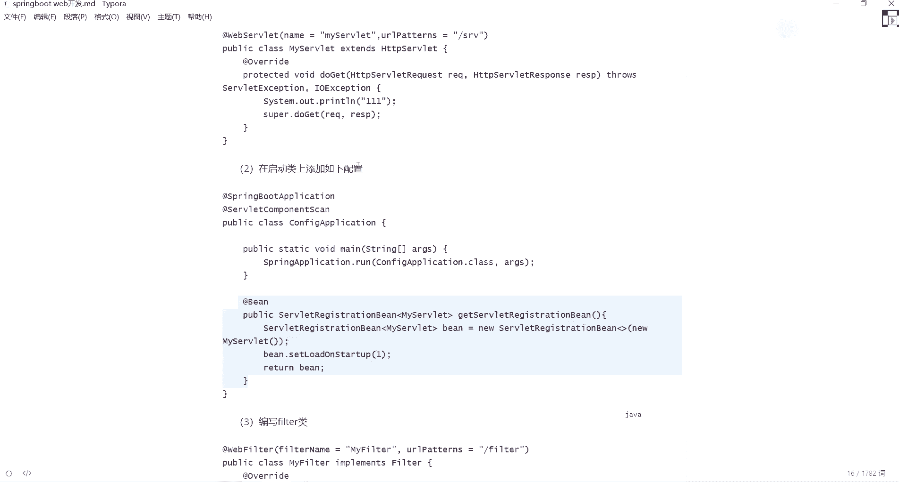

s r v还有一还有生效吗，你就按生效吗，我把它干掉。

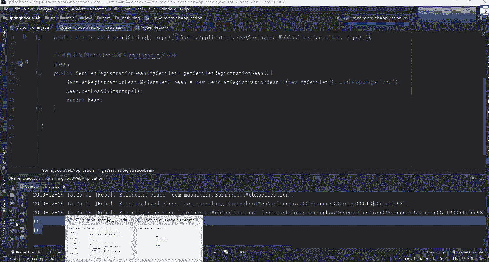

来配一下，二位高。

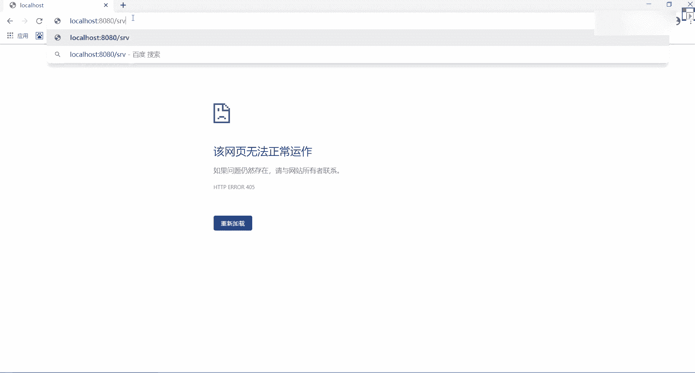

看一下后台效果，答应吗，打印吧，为什么一次请求有两个打印这块来给大家说一下这块在请求的时候，为什么会有两次打印的一个结果，他在请求我们对应的method late的时候。

这时候按道理说是不是只打印一次就够了，是不是按c够了，你想一下它是怎么样的一个轮转过程，如果你的do get就是这四位里面的东西啊，如果你的请求没有请示，没有请求到的话。

它还有一个action的一个请请求，艾肯的一个请求再看一下啊。

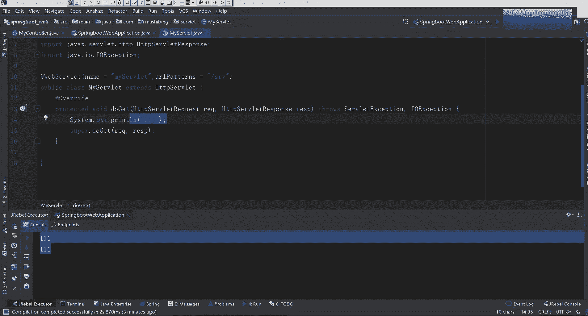

很多人可能已经已经已经很少很少有人看这东西了，我给大家看一下，大家知道了，找一下我们对应的一个更多工具开发者工具诶，你看一下我们的network这块，我们来刷一下页面，大家看一下，这仅有几次。

这什么玩意儿，什么状况请求啊，date image，拼这bass诶，这啥玩意儿怎么出来，是这样的，那思维这家产帽车s2 ，注意啊，这块有点问题啊，我们这怎么做的过滤啊，我想想就你这块。

你看你的xx r在哪呢，下面一块是吧，这两个东西吗，咱这块我给大家说一下原因，我给大家说一下原因是啥啊，在这块是吧，先刷一下，这没有啊，这行不，这s2 的，他没发到任何请求啊。

搞抽几下。

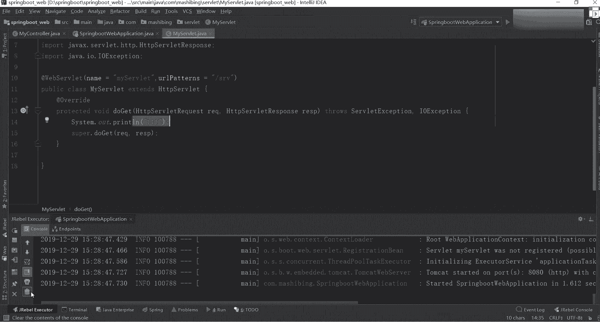

好吧，清掉清完之后我们再重新刷新刷，刷完之后大家看到这怎么没打赢啊，好了，现在我们来请求一个东西叫s2 回车，这边依然是我们的error配置对吧。

解完了之后，你往这儿看后台是不是打印了诶，变成一色的吗，教学事故，这不大家试过之前给大家说一下吧，呃之前的时候如果你写过servlet的话，大家应该知道当我们在发请求的时候，因为我现在过滤器什么都没写。

所以他除了会发现我们当前这个请求之外，还有一个action的一个请求，那个请求如果你不过滤的话，如果你不过滤的话，它依然会发一次请求，请到我们这个地方，所以此时的话会打印两个一，现在看到了。

我这还有两个一吗，没有了吧，没有原因是啥，你现在再发送我们这个s r v lv 6请求的话走。

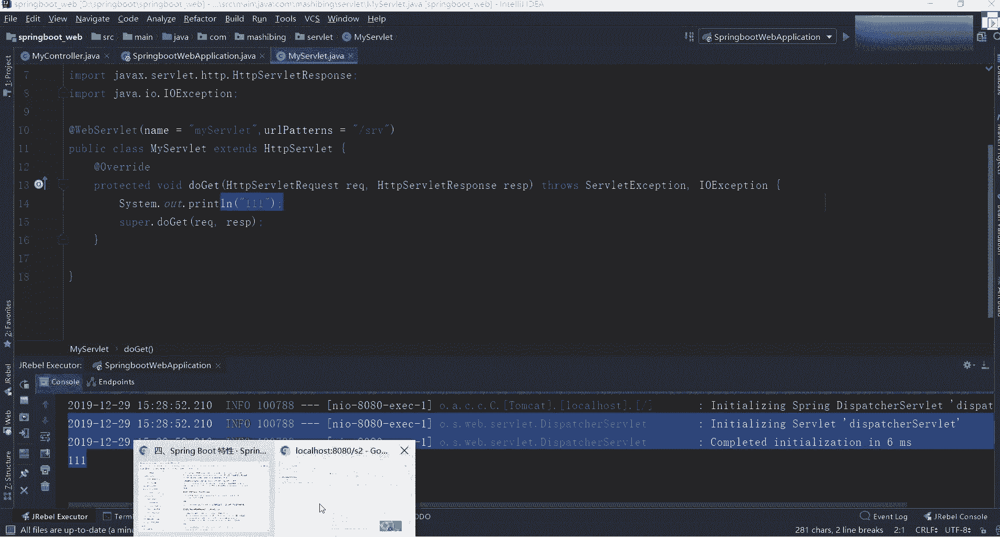

你往后看。

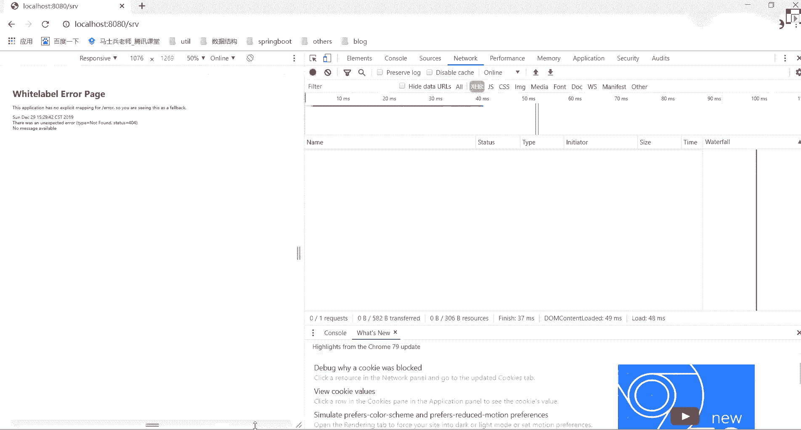

大家求到了吗，已经请不到了，因为什么，因为刚刚我在这块是不是已经配过杠s杠s2 了，当你配置好之后好吧，后面前面的之前的那个配置就不生效了，这可以写一下，高配置是u22 magic之后。

serve it，自己的配置，就不会生效好吧，所以这块你只能请什么请求我们的s2 ，这样我们再试一下吧，刷新一下是吧。

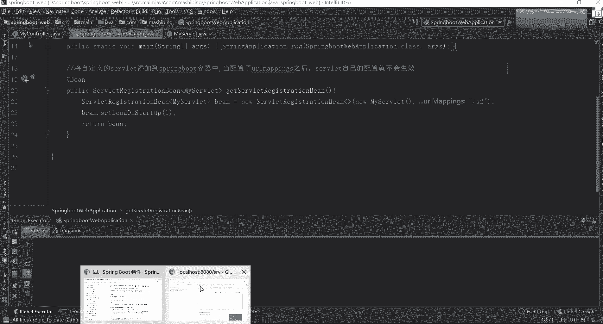

看后台有打印吗，没有吧，我现在换一个请求挂着我们的s2 走。

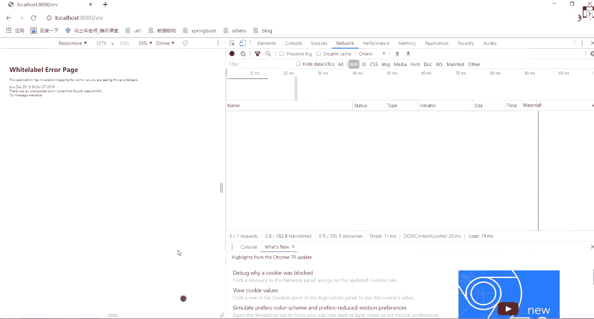

然后这时候来再往下看，是不是请求了，这个请求是不正常了，懂我意思吧好吧，这块大家一定要注意了，ok折腾记说老师不用加到容器里面也能响一把server le server component scan。

但这块我相当于什么，我把它注册到我们对应一个病里面了，好吧，这就是这个意思啊，这边有个属性来着，叫base package吧，是不是有这个tage，你后面可以加上一个随便的一个路径，com点马士兵点。

然后加一个sle，它是不是也可以自动扫描，但是你这如果要进行一个自动扫描的话，那意味着你在你对应的mesol里面，这不是因为他了，拜拜，sorry，it，这也可以生效，但是啊最好你把它注入进来好。

这样子的方式比较好的。

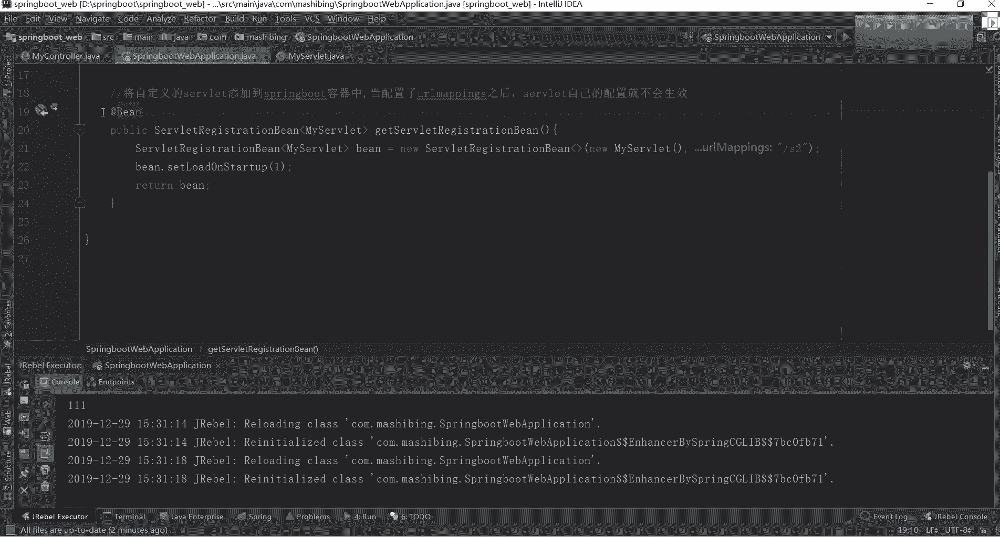

为什么这么说，这官网里面给我们推荐一方式，给大家找一下，可以看一下我们这个server我转了一类，你看这块就知道了，这里面有这样一个东西嗯，看这他说了，默认情况下，意识到杠多个sb的时候。

变的name运作前缀，所以过滤到更新，如果基于约定配置的映射不够灵活，您可以使用什么呢，叫super late registration，being filter registration。

并和他的东西类来进行一个完全控制，在这里告诉你说你可以使用这样的方式来进行配置，所以我在演示的时候就直接演示这样一个配置方式，懂我意思吧，周子健，那多个three不是得多个ban吗，是这样的。

一般我说了，刚刚那个风声也说了，srt其实用的很少，关键是什么东西，关键是我们要看一下，下面要讲这个过滤器和过滤器和监听器，过滤器电器比较多，像这块用的比较少，这种配置可以写路径还一样。

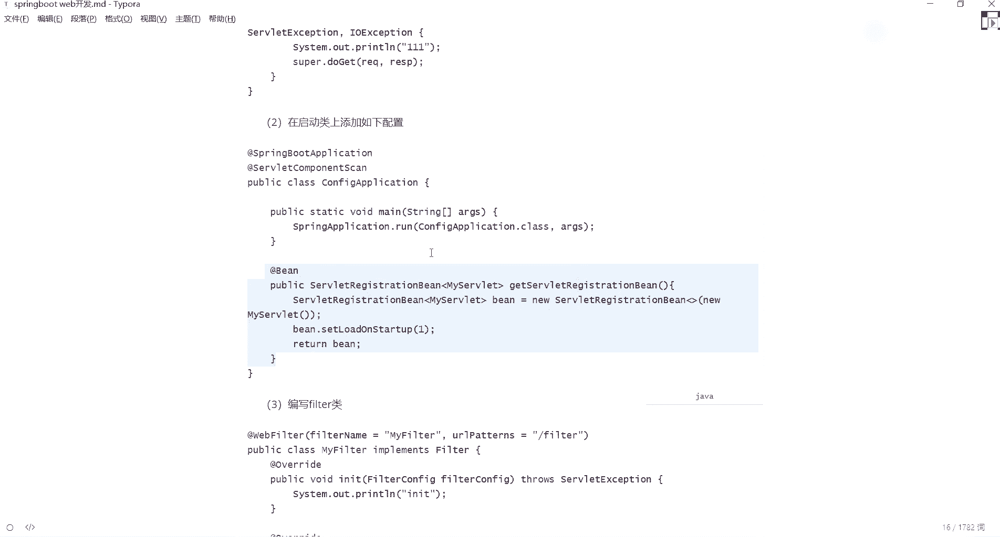

就跟什么一样，就跟你在swebot里面，你可以加一个at component scan，这是不是也可以写一个属性，比如说写一个，叫base package default。

这写一个com点马士兵之前我们是不是也这样写过，好吧，但是但是你注意了，我们现在为什么不写它，原因非常简单，它会因为你声明了three boot application这样一个，但是声明好之后。

它会自动加载当前类所在目录下面的所有文件，这是为什么，你刚刚开始在讲死神boss之前，我给你讲一个要求，说最好你启动好这类之后，主程序不要随便改变目录，如果你改变目录了。

就意味着你要改变你当前加载路径了，是不是意思之前是收获的东西，好吧，要用重要，要是用注解有顺序吗，什么什么顺序，说说说的是哪块顺序，你说这个上下顺序啊，这无所谓啊，这个是无所谓的。

这个无所谓这个无所谓啊，这个无所谓的，好吧好了，这是我们srt里面最基本的一个点。

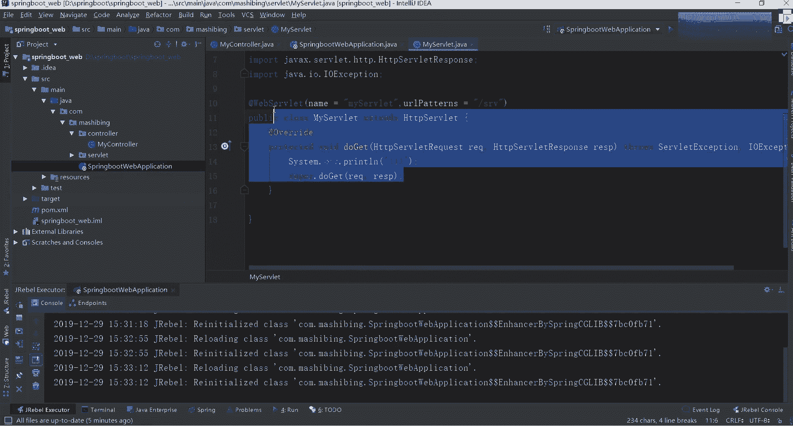

好吧，这块用的不多，下面我们来看另外一个东西好吧，看什么呢，看下我们的过滤器，大家想一下过滤器有用吗，有用吗，你想想如果你要做一个网站，你做一个网站，做完网站之后，我们是要过滤掉某些请求。

比如说如果这个用户没登录，我让他进行登录，不能不登录的话，这块是没法进行使用的，是不是要写一个过滤对应的一个过滤器的过滤器的时候也非常简单，大家可以看一下这块一个代码是跟thy里面写的一模一样。

没有任何变化，还是一个web filter加filter name，加一个请求，加一个请求，有个need，有个ditry，还有一个do filter，这啥意思啊，告诉你说我什么时候要启动。

或者说初始化我们的过滤器什么时候执行，我们的过滤器，什么时候销毁我们的过滤器，这一块在做的时候，我希望你注意一件事，因为什么事呢，在我们的filter这个里面有一个东西叫filter chain。

它是一个什么，它是一个链链条，好吧，什么意思啊，它会延长一个顺序，接着每一个过滤器都挨着往下进行一个执行，所以在写的时候必须要加什么叫tm。do filter，当你做到最里面之后，如果没有输入了怎么办。

它就相当于这个意思，这样的意思啊，比如刚开始这是filter 1 f1 ，然后这里面可以是f2 ，后面是f3 ，然后里面才是我们对应的一个s，当你的设备处理完之后，再回来f3 f2 。

然后f一是这样一个执行顺序，好这块大家知道就行了，你们看过设计模式是吧，就责任练练模式这块稍微注意下就行了，所以这块一样，我们把它直接给拿进来，小c拿完之后一样的吧。

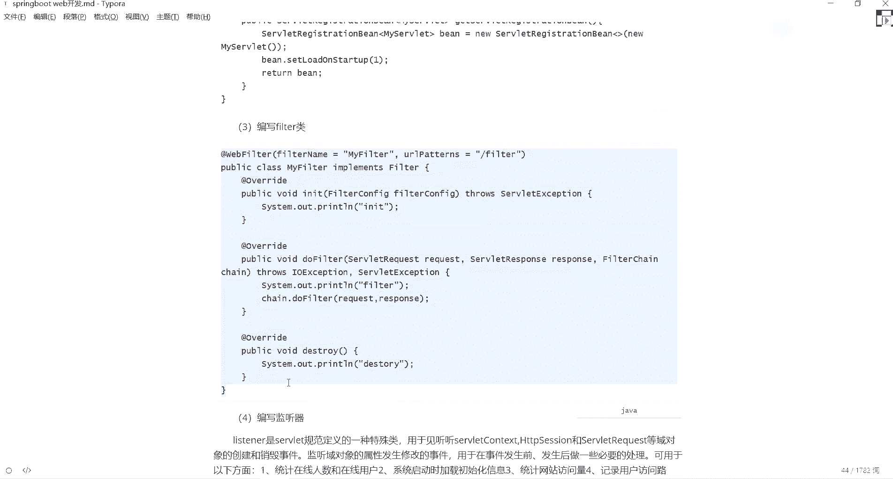

在我们当时代码里面建一个目录，看看这叫fault，有他，麻烦你先写好就好了，好了，这就是我们对应这个filter好吧，有数字化，有我们的呃，执行由我们对应的一个d4 串，当你把它配置好之后要干嘛。

这是不是也要顾虑我们对应的请求，所以一会儿我请求filter的时候，请filter的时候，你会看到这个打印这个filter一个对象，此时虽然你不用重启，但是我这建议你重启一下，为什么。

因为重启的时候你能看到对应的一个效果，往上看看什么效果，往上看看这个东西，看个东西，这有啥，in it吧，是不是意味着当我在重新启动我们当前这个服务器的时候，它已经完成了我们整体这样的一个初始化工作。

是完成初始化工作了，然后现在他没有执行的fter吧。

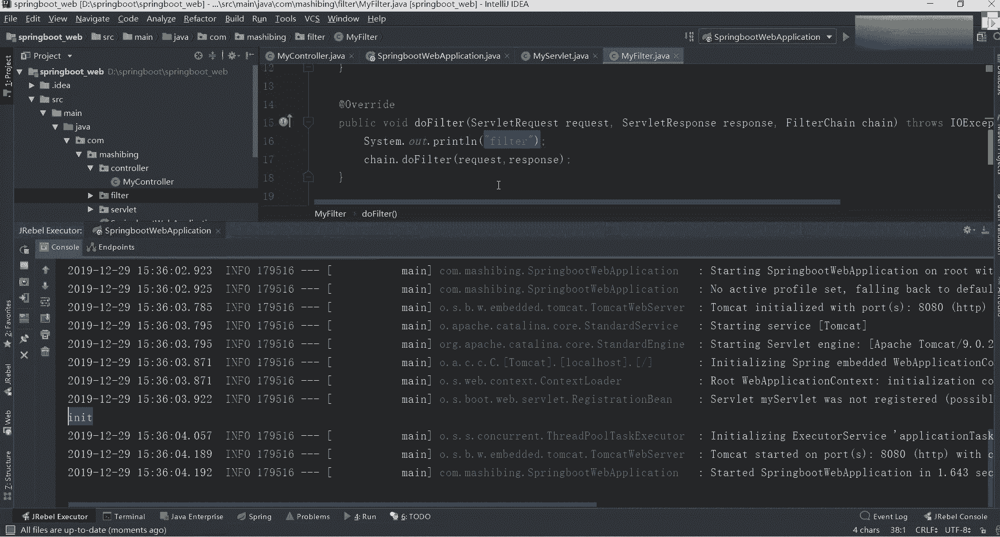

为什么没执行，我这可以发一个请求叫gfilter。

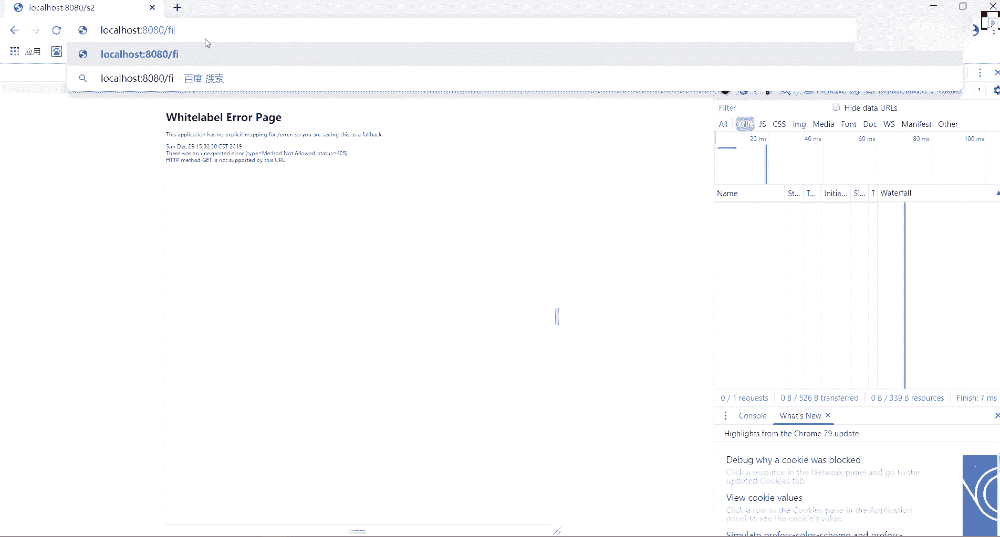

当你加载完gfilter之后往下翻，有filter了吗，有fter吧，是不是有filter了，是不意味着我已经执行好了好吧，它会一直往里面进行执行。

但因为我们没有对应于filter好匹配的server的，所以这不有会有任何的一个显示，会有任何一个显示，那现在你可以干嘛把它给关掉，发的多了，我这是直接关的，所以它不会打印diy。

如果你是一个正常结束的话，会把这个diy也给你打印出来啊，就这样一个顺序，所以以后你可以在我们这个filter里面添加任何的一个数据代码，比如说加什么东西，if我不可以做一个匹配，叫做quest啊。

不对，叫什么，request get，contest，sorry，contest，第二get，比如session，没有吗，request get，那怎么写来着，get contest，第二get 3。

成都，get session，那这块儿注意了，你可以设置到我们获取到我们对应的一个强转是吧，哦这是一个啊，这是一个server contest，这样强转一下，旋转完之后。

你可以获取到我们的c获取到我们三人对象，是不是可以把它跳转到我们的这个首页登录里面，是不是可以过滤到我们的武器对应的一个请求，这是我们的过滤器，它最常用的应用场景，除此之外还要干嘛，比如说你的js请求。

再比如说你对应的c3 次请求，将这些请求就不要发送我们对应请求，直接把我们计算资源返回就可以了，是不是也可以这样过滤，特别是在进行登录页面设置的时候，这块几乎是必须要做的。

所以这个过滤器你知道怎么做就行了啊，知道怎么做就可以了，可以了，过滤器牛头是这样的，ok这这块的一个相关配置配置完了之后，除了之外还有啥来着。

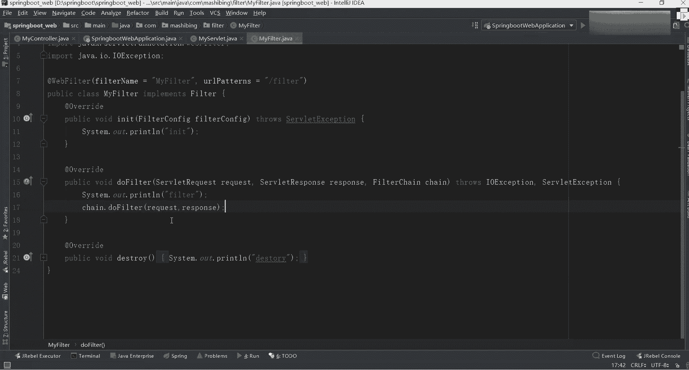

刚刚说的吧，刚刚我们在官网里面看到这样一个属性叫啥，叫filter registration beans了，你是不是也可以通过它来往里面注册成一个being，这是不是也可以，但之前啊我没有写啊。

这是不是写它了，ok那所有页面都要写一个filter吗，还是一样的，filter里面在写的时候，你注意一件事。

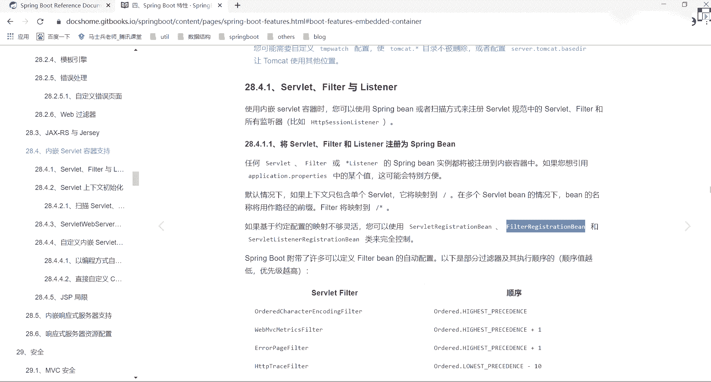

这是不是有东西叫ur python，他会设置说我发送什么请求的时候才会进行一个匹配，如果你的请求不匹配的话，这就不会进来啊。

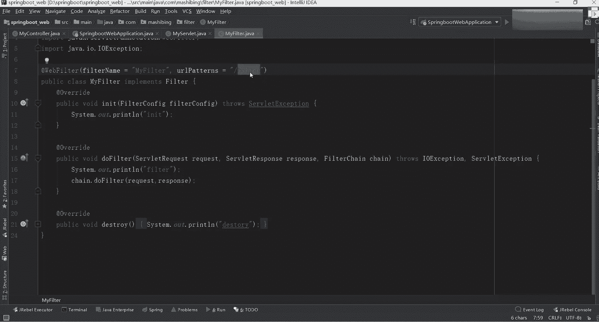

这不会进来的，比如说你这写一个我随便发言请求啊，刚刚那不是写了一个很乐，还记得吗。

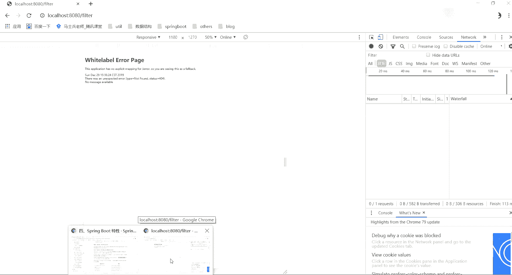

把这个请求给删掉，然后我们的状重新启动下。

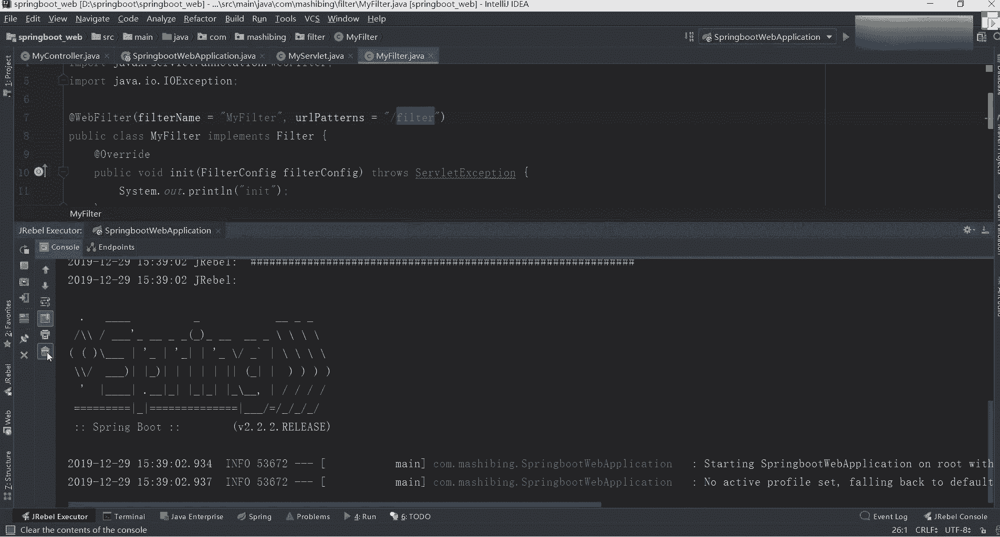

走了把删掉，我这发一个hello。

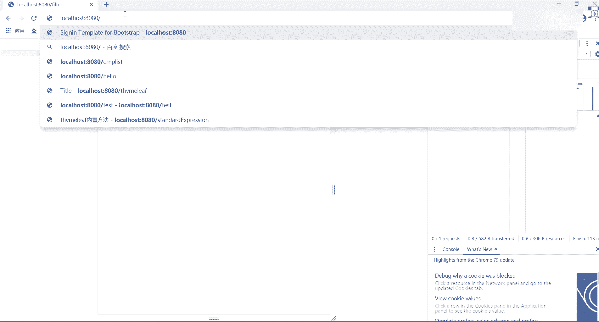

h e l o走翻译合作之后，大家看一下这块会打印pter吗，不会吧，不会不会吧，你可以进行这你可以进行这样一个设置，一般我们设置怎么设置，你要如果是首页登录的话，写一个杠星对吧，你写完钢琴之后。

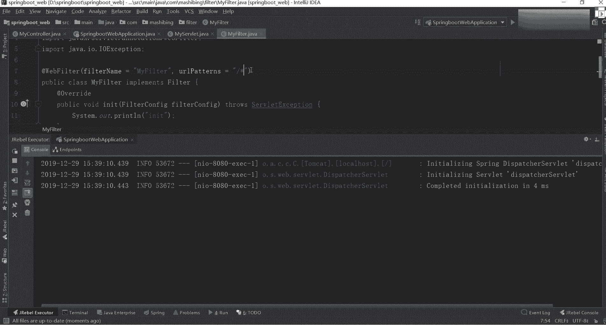

意味着你所有的请求都会进行一个过路走，这怎么没没没没起作用，发送请教。

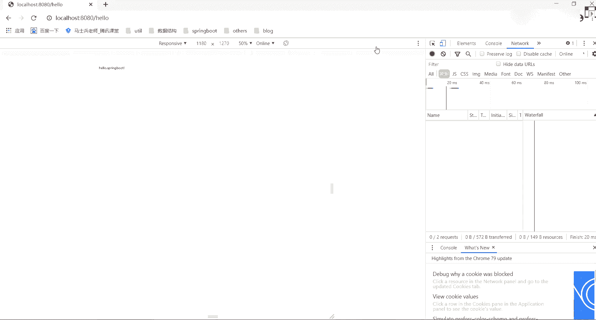

你写作业了吗，抗抗鞋吗，要不要更新啊，这不对吧，不能直接写杠杠新了，应该是，怎么不管用啊，我们配的支配是纸质宝，这应该可以啊，说实话是不好了，来刷一下刷新是不是filter了，重启一下就好了吧。

这重启一下就好了，然后现在然后现在的话我们怎么做，所以现在再发送另外一个，比如说发送一个a b c d随便写，你之前请不到，这边是有filter，是不是有filter这块，大家注意就行了。

ok如果一个页面一二要是match多个filter呢，都怪无所谓啊，我说过了，你的filter它是一个什么，以一个链式的消防车往前走了之后会跳到我们下一个filter。

一直往filter里面进行一个跳转，进行一个跳转，所以还在往里面跳的，这你不用担心，好的老师，那这个filter的顺序我应该怎么定义了，如果你现在如果你现在写filter的时候，热的时候。

你如果直接像我们这样写，直接写一个类别的东西不配的，那此时的话有什么顺序吗，就是加载到哪一类，第三方哪一类，而如果你用了，我们刚刚在官网里面看到那个方法叫filter register。

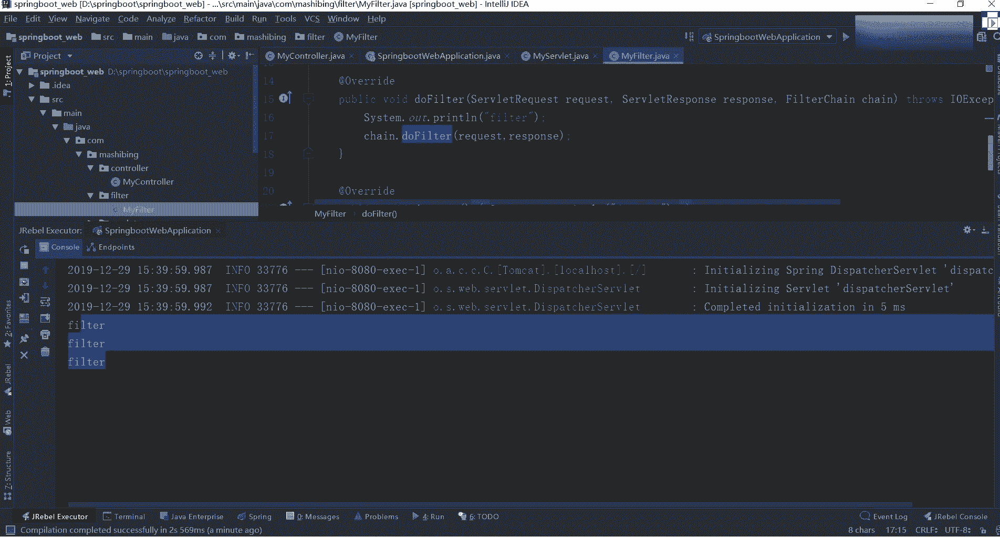

你是不是可以设置我们对应注册的一个类怎么做。

是不是跟我们刚刚那service一样，你挨个房里面有对象就行了吧，也是一样的吧，ok这小点可以设置不拦截蘑菇请求吗，这应该不可以啊，这我还没写过，这应该不可以啊，一般情况下。

如果你要想设置拦截和不拦截的话，有什么有include和include，我不知道里面有这样的属性，不知道有这样一个属性啊，反正有include和include哇，应该有这样一个配置，但是里面怎么配。

我忘了怎么配的啊，你稍微注意下就行了好吧，差数是这东西是吧，这上面可以加一个order的一个属性，order这个值可以指定啊，比如-1可以指定一，他越值值越高，值越高意味着什么，值越小是越越越优先执行。

是不是这意思啊，这个order是顺序啊，这个顺序要求越小越优先嘛，输输出越小越先执行，这是顺序，但不然就得请求我看一下，这没有啊，我们可以看一下里面的属性啊，给个注解，找一下里面的东西。

display name for your name，icon，sername ur pc，这好像没有啊，这边好像没有对应的属性啊，这应该是没法控制的，这没法控制啊，反正请求里面是不是没法做的啊。

如果你直接在这里面加参数的话，是没法做的，in the sector叫什么叫拦截器，不叫过滤器，过滤器和拦截器还是有区别的，过滤器和拦截器还是有区别的，好吧，加逻辑自己放回去啊，这可以这可以做合作。

搞混好了。

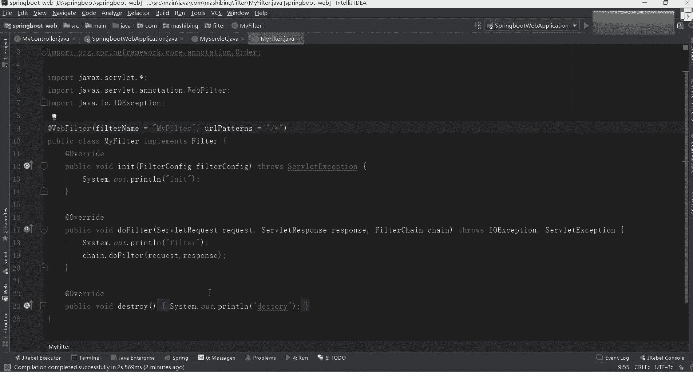

这是我们对应的一个过滤器吧，过期完了之后要放最后一个r什么的角，接连起男同学还一直搞不懂说老师这个监听器是干嘛的，非常简单，说监听器也是src规范定义的一个特殊类，用于监听，不用于监听。

什么叫thread contest与tp session，thread request等于对象的创建和消费，事件监听与对象的属性发生修改的一些事件，用于在事件发生前发生后做一些必要处理。

一般可以用于哪些方面，第一个叫统计人数啊，第二个加载初始化信息，第三个网站访问量，第四个用户路径访问，访问路径都可以做，我让你写的好吧，来把它拿过来，当然方式都比较简单的代码都比较简单，我直接给他粘了。

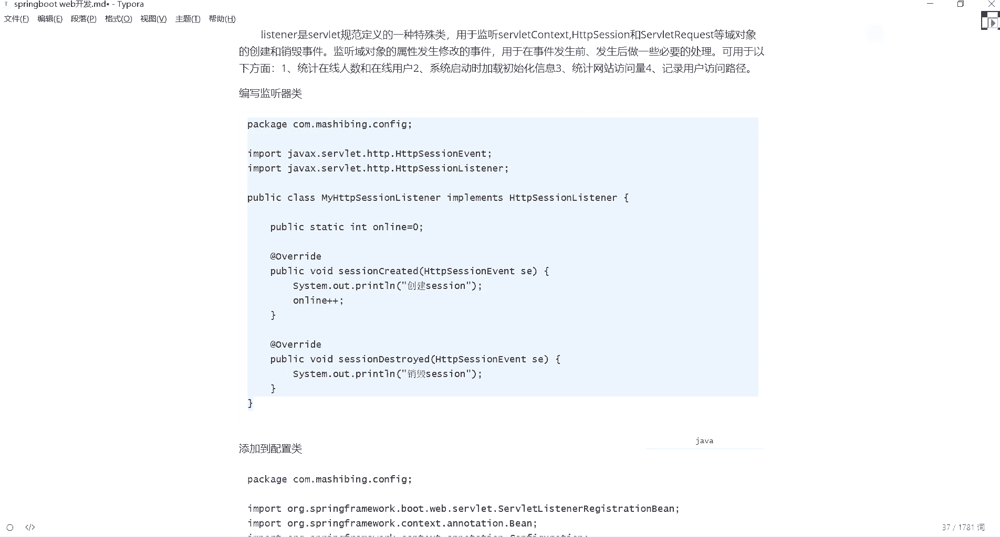

当我们的坑写哪，我我直接选filter啊，这些这些里面去了计算器之后，大家看到了，这是不是有一个继承了一个htp session listener，继承完之后，这定了一个正弦变量叫online等于零。

你说每次三神创建的时候，这会创建一个三人对象，打印一句话，同时online加一，销毁的时候是告诉你说销毁这个session这块我们不用做那么严格啊，不用做那么严格，怎么做，注意了。

这必须要创建好我们对应的一个3d对象，所以此时这里面没有加任何的一个注解的配置。

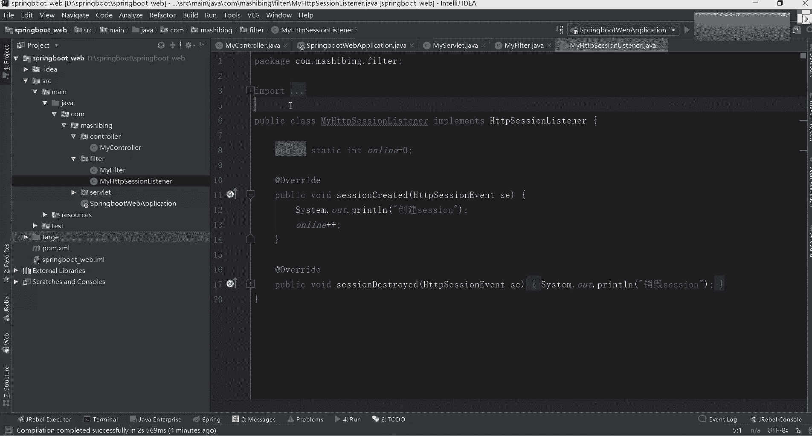

那此时怎么办，你这样是不是又要写这样一个属性啊，是不是还要把它注入进来。

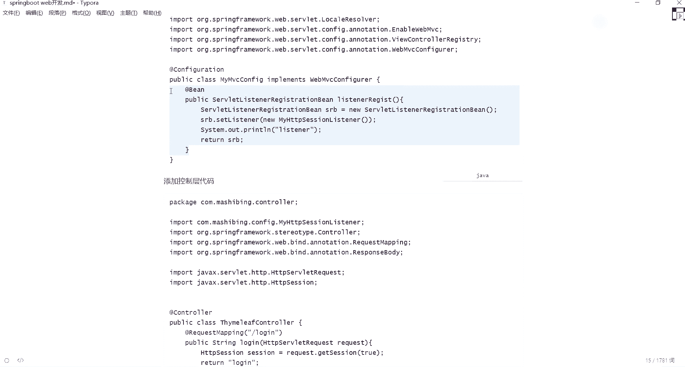

2c加到我们的这个配置里面去，找所谓，叫server listener regestion beans吧，是不是往里面创建好我们对应的一个对象，把对象放到我们这个listener里面去。

翻完之后就搞定了，这东西并不是特别难，那怎么做一样，我们重新启动一下嗯，接着不先启动，看看效果，你看效果知道了，ok类似的是不是启动好了，启动好之后，我这是不是可以进行一些配置的。

这配置的时候大家注意一件事，在我们的listen呢里面，这时候有个session。

这不是打印一句话，同时这还是没站稳，还有东西啊，这样还要加一个什么，加一个控制层的一个代码，就告诉你我的ctrl我要加什么样的一个信息。

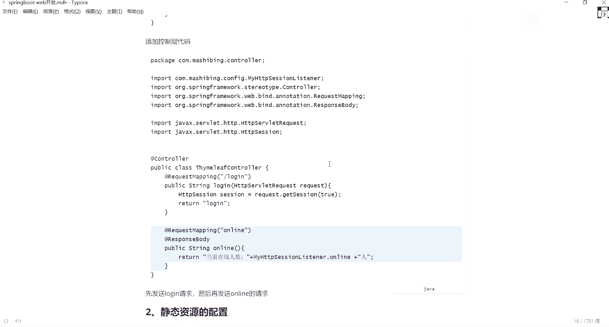

拿过来找到我们来看中了这块儿不要他了，不要乱四，从这边，ok，哎不加保底了，这跟我刚才写的不一样，还加了次ctrl，写完之后，这是不是有这样一个值，把纸打进来，告诉你说再见入多少人。

是不是请求online就可以了，那现在我们把它干掉。

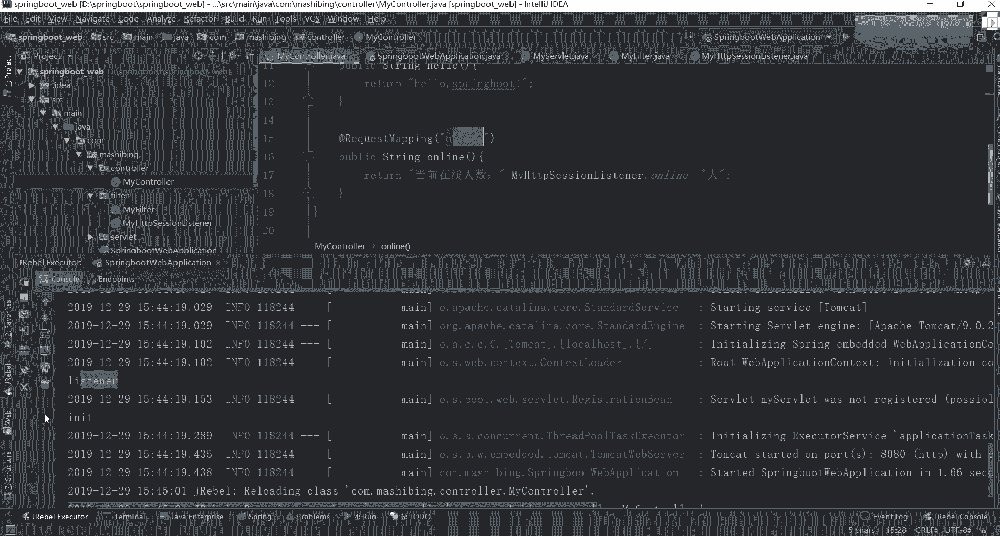

现在来请求一下小奥出来走，大家看到了，我现在在线人数多少，是不是零人对吧，走走走走，刘老师，这为什么总是零个人啊，这不太对啊，为什么。

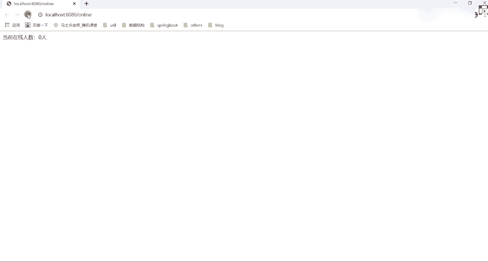

原因非常简单，你注意你刚刚写的这个监听器，你到底是怎么写的，你写的时候是什么，是创建三成对象之后，是不是才会给他加加，你想一下刚刚我发那个请求的时候，有任何三人对象的一个请求吗，没有吧。

那怎么做也非常简单，在里面是有一个hello，在lo里面的时候，我这加一个信息，加一个什么叫a t t p session session，这里写一个什么叫session，第二三台这边加一个东西吧。

a a等会a a假如我加这样一个属性，这可以吧，是不是可往上面加一个随便一个值，这个值无所谓，我们反正也不用，我们反正也不用，然后现在干嘛呢，还是一样的程序清空清空完了之后哎，这怎么又有页面。

页面打开完之后刷新。

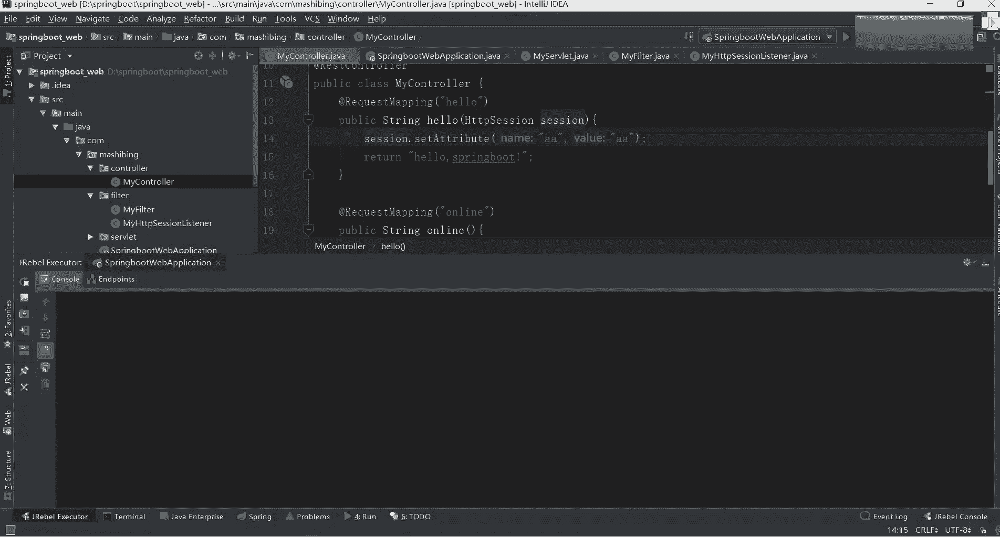

现在是不是还是零人，然后现在做一件事情叫logo host冒号走，说不行，又回来了，此时你再刷新变成一个了吧，然后现在我再换另外一个浏览器，你再试一下，你打不开打开这还是一样local host的。

然后呢这写一个hello，走，是不是挺有意思，这个时候你再来刷新一下，变成二了吧，我现在在请求再刷一诶，这里面有有有有有有有那个三项三项是不是同一个，那现在怎么办，只能换浏览器了吧。

是不是只能换浏览器了，是不是已经看到这个直已经在变化了。

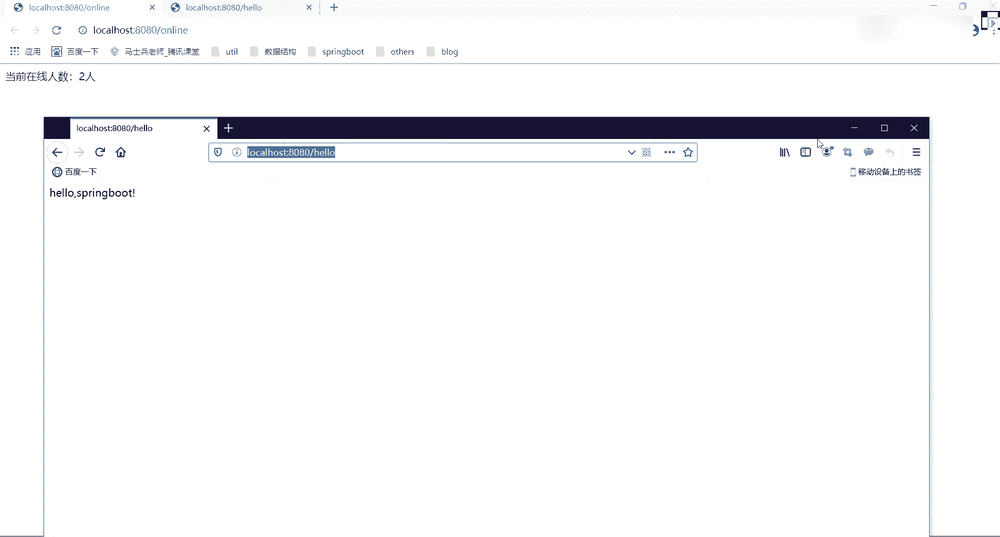

也就是说你监听器里面你监听的是什么数据啊，今天是什么数据，这块就会进行一个增长，这是有三针的，有三针，this ro有很多这样的一个属性值配置。

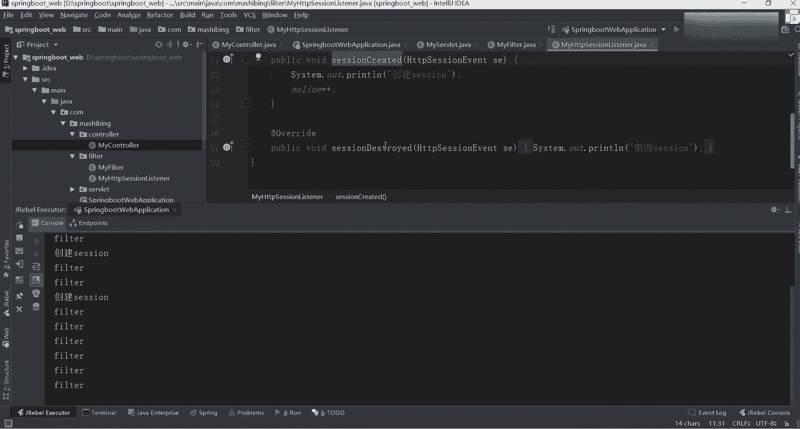

下载之后，我刚才说了，在文档里游戏比较清楚，我说了，你可以监听我们的session，也可以见证我们的service contest，也可以进行service service request等与对象。

你都可以做一个对应监控，只要里面的值发生更改了，拿过来之后直接用就行了，你如果实在说老师我还想看一下到底有哪些电器怎么办。

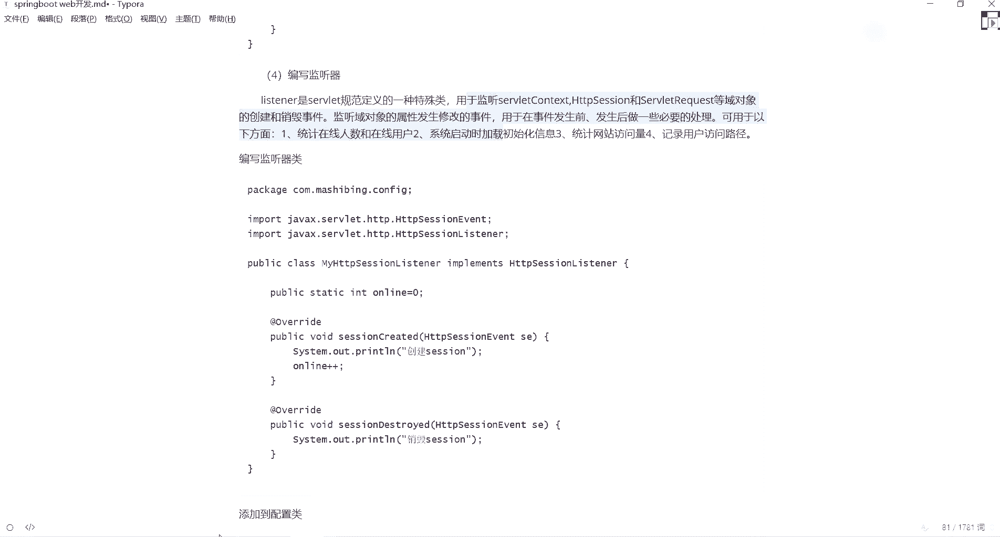

很简单，打开它，打那之后你看一下当前结构里面是有session create，是有session提出来，是不是有两个方法好，周三你再往下翻，这个没有了，就这个接口啊，还有其他一些接口啊。

比如说htp session，找一下ttp server late contest listening，a s那，就这个了，在哪儿吗。

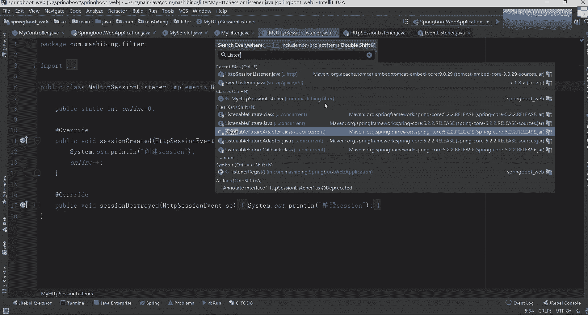

这块儿啊，你看一下这块怎么办，也非常简单，之前我讲过这东西，很早了，我来找一下，之前我在讲那个，的时候之前录过一次这类的视频啊，找一下，找好了，人哪去了，找不到了，之前我录过一次那个java一个视频。

在那个java视频里面讲了各种各样的一个监听器，好，server request dion，对，就这样监听器每个监听器里面它有自己实现的一个方法。

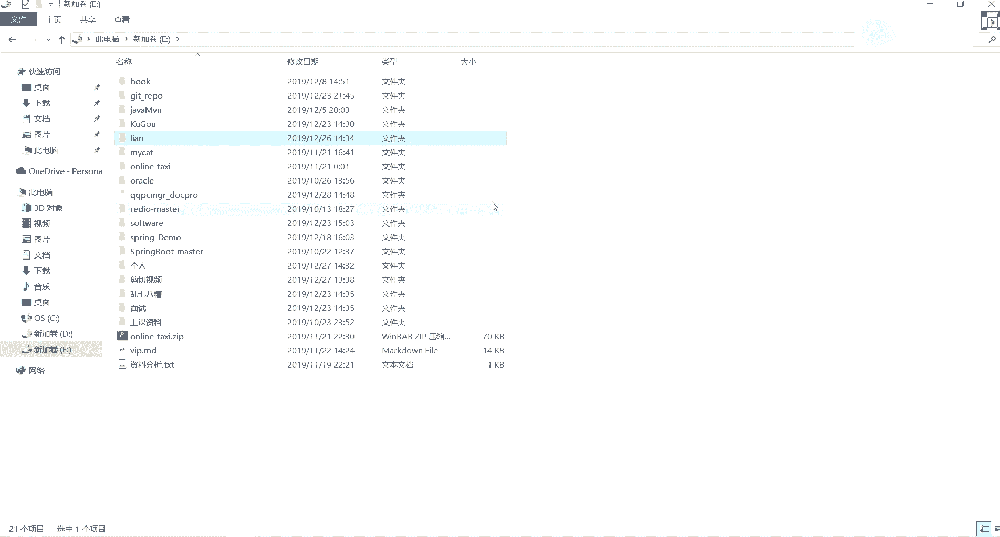

所以你把这些方法拿过来之后，直接继承过来实现一下就行了，好像不同这样一个分类，但有兴趣的话看可以回过头来看一下siri，好看一下three这块我们看了没啥意思，没啥意思啊。

你知道监听器过滤器这个东西应该如何配置就够了。

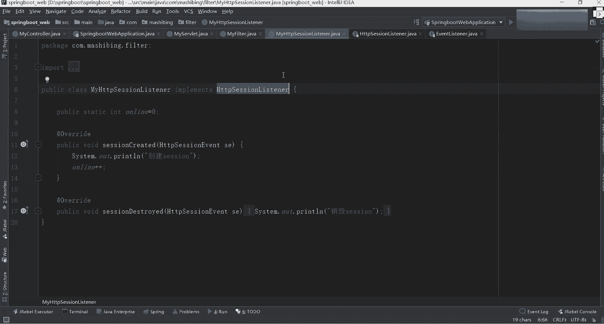

相当于回顾一下我们之前相关的一个知识，你下来之后自己也可以做一个演示，好，自己可以做一个演示，明白了吧，这块大家还有问题吗，没问题，能学扣个一，就非常简单了，这不用多说了啊，非常简单一些东西啊。

下来之后拿着这个笔记好好看一下，我笔记写的是比较详细的，一般该写的都写了好了，这是第一点，第二点该看看什么了，看一下我们对应的一个静态资源的一个配置，是集成了我们的surate。

大家发现了surface其实写起来并不方便。

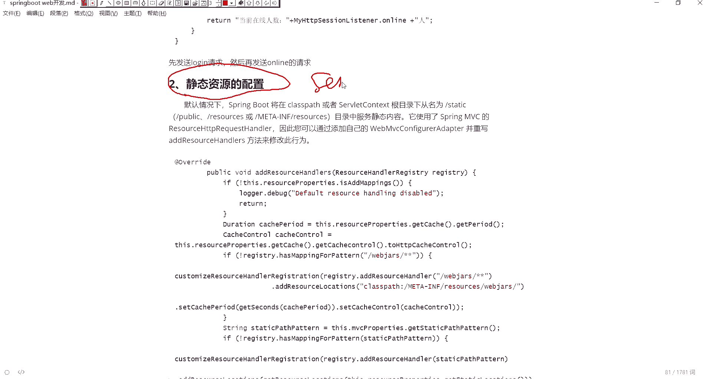

而在我们刚刚你出现好我们队的一个数据目录之后和项目录之后，你发现了在我们的com下面有一个resource，这个resource下面有一个esthetic，有一个timate。

这里面是可以放置我们对应的一个静态资源的，sa里面放什么，他们里面放什么，我怎么去读取里面的一个数据文件啊，应该怎么做，是涉及到静态文件的一个资源加载过程了。

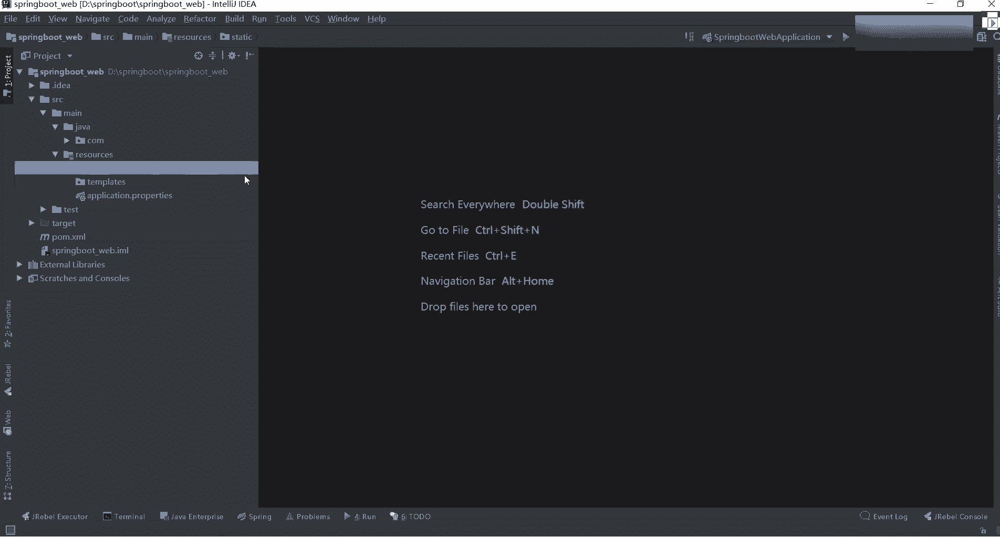

这要说了下，spring boot会在class pass或者server contest根目录下名为esthetic，然后呢这有个public resource。

然后呢resources目录的目录中开始读取我们的精彩内容，使用了sprmc叫resource，http request handler，因此你可以添加什么东西来编写这样的一个行为是啥意思啊。

告诉你我们写页面的时候可能写了很多html对吧，可能写了很多js文件，可能写了很多cs文件，可能写了很多emage这样的一个图片，对于这样的一些请求，我是要把它放到哪个地方。

原来是你是有个web bot，web in fin fin里面，是不是可随便往里面扔，但现在没有这东西了，没有这东西了，那我怎么做，我只能把它带到我们某一个静态资源的一个目录里面。

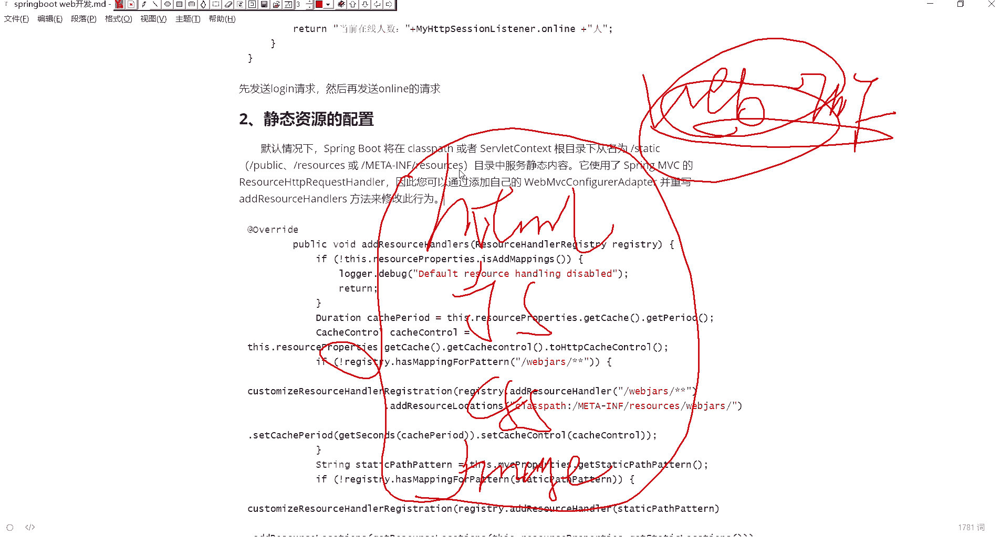

所有人都不知道说老师我应该往resource连放，谁能告诉我为什么要往resource面放好吧，或者说result里面还可以建什么东西，你在公司里面如果是不是自己开发项目，如果是拿别人项目的话。

你看到有些人可能接到这样的，我就发个对不对，还有些人可能在这里面又建了一个dt教授source，有人见过这样目录吗，public resources，有人见过吗，你刚建好目录的时候。

是不是有static对吧，那为什么public和results它要创建好，他怎么把这些文件给读进来的啊，有人想过这东西吗，先这东西还是一样，我们要看看看到我们对应的一个呃源码自动装备配置的吧，是这样的。

你告诉我哪找啊，下去之后我们可以给他看这样一个类，什么类呢，叫web还在单元码了啊，叫外web mvc auto，a u t o com configuration，这个了点这类啊。

各种auto configure是这样的，在里面你要找一下我们对应的一个资源目录，你看一下他在哪指定了那些静态文件的配置目录，我怎么去里面查看，ok下去之后，我们切个十分钟，十分钟时间内。

你看一下这个源码，自己打开idea，自己看看看能不能找到，这里面肯定有你认识的东西行吧，ok那行，那我们就先休息十分钟。

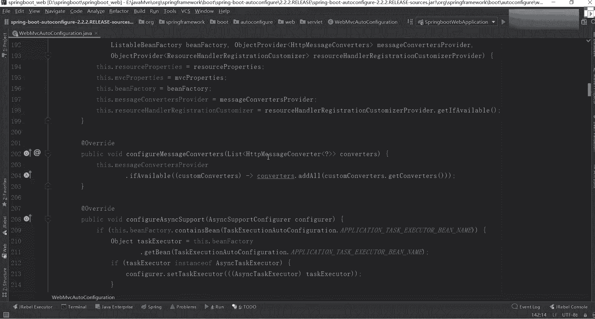

你们找一下这个目录。