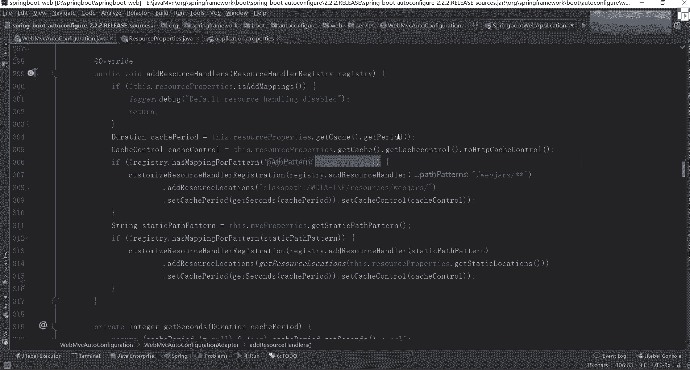
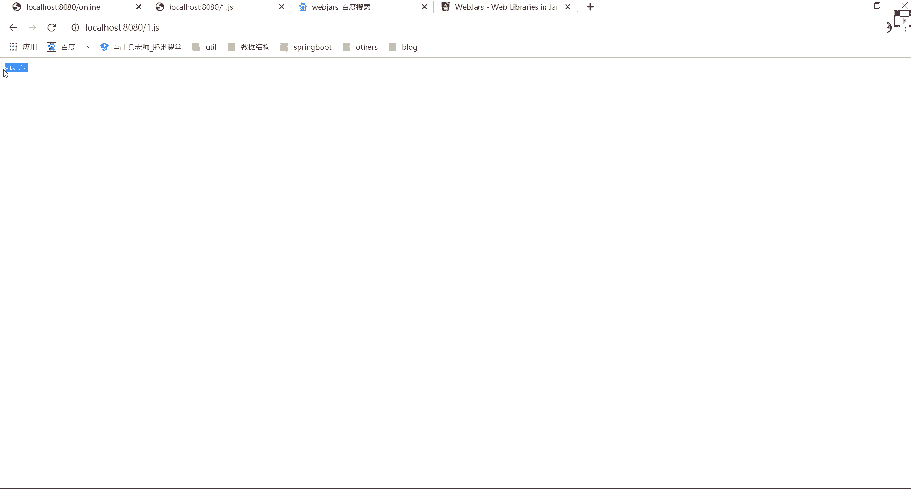

# 系列 3：P62：【Spring】SpringBoot资源配置源码分析 - 马士兵_马小雨 - BV1zh411H79h

好嘞还在同学扣波一来了勾一我们来玩讲源码了，带你们看一下源码，很多老觉得这东西简单，我们可以聊点不简单的东西啊，刚刚我说了，我们都知道我们在写页面的时候要加载很多css，js等这样的一些近代文件。

在官网里面告诉你了，说我们写静态文件的时候可以把干嘛呢，把cass pass下面的这些目录的东西给导进去啊，为什么可以倒，这告诉你了，说你可以添加web m v c configuration det。

并重写里面的add results conter来修改此行为。

那么刚刚通过查找之后，你应该已经发现了，怎么找来着，先打开外版vc configuration，你点开这confiation之后。

找到里面的一个东西叫外版m v c auto configuration at，在里面有一个方法叫爱resource h，在这里面他告诉你了，我应该如何进行一个相关配置，怎么配啊，说if什么东西。

然后呢这有个if什么东西，if什么东西，是不是做了三个最基本的逻辑判断，这块我们挨个来看，他说了，this the resource properties，there is a advp。

就是说它会判断你是否修改了自己对应的一个资源目录，如果你自己这儿已经做了一个添加，那不好意思好吧，这块就不会做一个任何，就你原来配这东西就可能不会生效了，只有这个resource properties。

这是不是有这样一类点，这类你看一下哪个哪个目录叫spring。resources，然后呢往里面翻，里面是有很多一些属性，像这些属性值，你就可以直接在我们的配置文件里面进行一个直接的编写啊。

直接进行一个编写，就这块东西好，但你要知道这个前缀是啥，你们之前写代码的时候，很多人写的都直接写，比如说spring第二个冒号，然后呢mvc，然后冒号后面可以加各种各样的属性，为什么要加这样的前缀。

在哪标识的就在于我们刚刚这个properties里边有个perfect，在这profit里面告诉你说这块是哪个东西，懂我意思吧，这都会有b一个对应的标识，回过来我们刚刚看的地方，刚刚看完之后。

你发现了它有一个东西叫i的result handler，第一个是判断它是否等于空，这样的信息判断完之后，第二个叫什么呢，叫多些什么东西，不用看，往下看，这个东西叫什么，叫web js，正常玩意儿。

我不知道你们在公司里面是否有人用脑袋被炸死了，比如说我们在写前端页面的时候，可能需要导入很多的一些web框架，比如说jquery等等相关信息。

而web js就指的是我们对应的一个jquery里面的一个相关信息，这怎么找啊，非常简单，不止可以折合人啊，你说直影这块是有这个问题的。

可以干嘛，在百度里面你直接做一个搜索，搜啥搜web j a r s，他把这些静态文件，静态文件也打成了我们对应的一个home文件的方式，比如第一个这是jk ry。

是不是npm boss rap swagger对吧，第三点，js是不是有很多js的一些文件拿过来之后好吧，你可以把里面比如说我们选择这块是吧，选择我们的妹妹把这块东西拿过来。

把他c拿完之后可以加载到我们当前这个项目路径里面。

找到我们的pom文件，把一代先进去，二位ok讲完之后，打开我们的依赖包，我来找一下这是不是多了一个jquery，在这块里面，你往下翻，因为刚刚在岩板做了一个标识，哪个目录啊。

往下翻是不是在web炸死星星，它可以读取这个资源目录，同时有class pass m e t a app，然后呢resource，然后web炸死，所以我们在看的时候，点开它，点开里面的resource。

点开里面的web js，在点开里面的jquery，点开里面的版本号，点开里面的j query的js，这意味着什么事啊。

因为什么事意味着当前这个项目我其实可以进行一个直接访问了，怎么访问，选择它，第一个叫web，这时候反问过，直接访问过了吧，回车，来吧炸死走。

请求不到，重新重新重启一下，周琦等下，前端框架都放了，被炸死吗，不一定看你自己的需要啊。

拿完之后来写一下发，请发送一下，看这请求到了吗，说不行了，大家这个文件了，这边是谁，是不是就相当于是我们问问包里面某一个的一个依赖。

就是说我这可以自动设置为它读取我们web js里面的一些相关配置信息，是不是这这这这里面的衣服，也就是说你到底是否参与这个配置，占完了之后，第三个什么东西呢，叫static past present。

这啥玩意儿啊，是不是叫静态路径的一个匹配，或者说静态资源的一个匹配，那句话怎么找这个东西讲this的m v c properties，get static papa，点进去，点完之后你发现它有个地方。

this past pata，点进去叫杠星星啊，这杠星星指向什么地方，这其实已经跳过了，跳到哪了，看这叫web mvc properties了，是不是跳这个文件里面了，在这个文件里面，你往上翻翻。

翻哪去了，这儿有一个resource来着，找一个resource，这没有啊，我搜一下叫resource properties，在这个文件里面，大家看到有什么东西叫class pass。

source locations，是不是指定几个目录，第一个叫resource，第二个呢叫resource，ctras spa下面的resource，第二呢叫卡斯帕下面的static。

第三呢叫卡斯帕下面的public，这意味着里面有很多的一个目录结构，这是the static locations等于class resource locations，是不是就指向了我们刚刚那个目录。

所以我每次在进行资源查找的时候，为什么在你的resource这个资源目录下面，有人写public，有人写resource，有人写esthetic，有人写te，他这写的是模板。

主要是上面三个public resource和static里面，其实按道理来说都可以放我们对应的一个静态资源这块，其实我们都可以进行一个请求，怎么请求来右击又一个费，再写一个一点js，写一个呵呵。

有什么东西thetic吧，然后这再放一个东西，你有一个fail，这依然叫一点js里面写一个叫resource，他们这个面也一样，我也可以放一个fil，再写一个一点js，大家看到了诶，要js。

这写一个public，大家看到了这三个文件名称是不是一模一样，几乎没有什么变化吧，名称虽然一样，但是我在发送请求的时候，它都会从我们当前这个资源路径里面，是不是查找我们对那个一个目录啊。

刚看到了在哪来着，叫m web mvc，好多configation在里面找一个东西叫resource properties，是不是三个目录，1233个目录，那你告诉我。

我现在如果发送一个请求叫一点js的话。

它会先请求哪个显示哪个哪个哪个东西，或者显示哪个目录下面的东西，你觉得刚是不是在三个目录里面都创建了public resource sdk。

先请用谁，后请用谁自带，这个是吧，来我们验证一下对应的一个情况。

就是现在谁，选谁results吧，好吧，然后呢，现在我在做一件事情，什么事情呢，把resource里面的东西给干掉。

dele掉k d6 。

完了之后，我现在在同样发请求刷哎呀，这个这个到哪了，是不是到thetic了，是到thetic了，thetic完了之后。

我可以再把我们的thetic也给进行一个删除delete。

然后现在我再发送一个请求，在哪儿pk吧，所以大家看到了，这里面是有对应的一个顺序，就是说我可以包含n多个同名的一个数据文件。

但是它有一个加载顺序，而那个加载的顺序是不是刚刚好跟我们这块写的一模一样，第一个叫resources，第二个叫static，第三个叫public，这里面是标志好了，我将来数学，所以以后你在写资源的时候。

我家里人进来进来资源文件的时候，不要随便乱放好吧，谁的运气更大，你往前放面积更小，往后放，这样的话他不会进行随便乱覆盖，使得一个样式就乱了，懂我意思吧，当然一般情况下也没人写那种同名的啊。

一般也没人写同名的，如果写同名的，你要知道它对应的一个加载顺序是啥啊，加载顺序是啥，第四个是44吗，等第四个这个吗，tm里面放的是我们对应的ap mk面的模板啊，这模板引擎里面有东西跟你们无关。

跟你目录无关，跟这没关系，就上面三个目录，把上面三个目录如果不放这的话，你往哪放，是不是m e t a杠in for，然后resource刚想要刚刚那个web炸死，你放哪了。

是不是放在我们的m e t a info，然后里面是不是有resource resour，下面是不是有web js jquery 3。4。1，什么东西是从哪进价来的啊。

刚刚我们写近代文件不算是这样的一个配置目录，所以此时的话只有这三个，所以你要知道他们对应的一个单项数据，第一次找的时候，先去找我们这个m e t a inform。

让resource里面第二个找resources，第三个找static，第四个找public啊，这块我们那里面都给大家写了啊。

web web 2怎么做，现在在资源的时候，它路径是杠新星会去我们的resource properties，这个类里面看到对应一个资源目录就是四个。

然后下面固定上说可以看到资源目录一共有如下几个resources，static public，它们的顺序就是这样一个顺序，所以你直接拿过来看就行了，听到了吗，知道我们加载了吗，这是我们今年资源。

所以放的时候不要随便乱放好吧，但是一般情况下，其实你们在做的时候可能就有一个static public和resource，你们可能没有自己自己没有创建过，没创建过，你不用管它了，所有的cs文件。

js文件都直接把我们sd里面中就完事，但是你最好把它给分好目录，明白了吧，ok这个静态资源的加载，听完同学来扣个一，还是这样，你通过源码里面是不是能验证到很多东西啊，这个源码里面信息好吧。

说实话第二个什么呢，叫加载下面一个叫首页资源的一个配置，这个首页配置在哪啊，一样的，在官网里面有帮我们做了一个东西叫呃欢迎页面是不是有展示是吧，spring boot支持静态和外漫画，欢迎欢迎面。

你首先在配置静态内容是找到index html，如果找不到就找index的模板好吧，如果找到其中任何一个，它将自动用用作什么的应用程序的欢迎页面是啥意思啊，也非常简单，每次写的时候都写index。

为什么呀啊，或者说凭什么写就是index啊，凭什么index就是我们对应的一个欢迎页面，原因也非常简单。

还是一样，找哪儿是找源码，从哪开始找啊，别忘了我刚刚说的东西好吧，还是在我们的web mvc all configuration里面。

在web m c of convation里面找到我们的adaptor，在data里面拍下去，这边我们来找另外一个东西，找啥呀，找一个东西啊，这有什么信息诶，别走别跑，往上看什么呢。

叫welcome配置hler mein，不要看这个gain dex啊，是不是看这块了对吧，这里面怎么做的呀，你往里面翻，他说啊，这都参数啊，说new一个welcome page on remain。

然后用完之后呢，里面做了一件事情，说用了一个template provider，什么东西，然后从里面获取的时候怎么获取的，叫get welcome page。

这里面是不是调了我们的get welcome page，你点进去是不是下面的方法里面，这告诉你了，说get resources，然后这次resource什么的叫gas study location。

是依然从我们今天目里面找好吧，整完之后，这里面有一个方法叫什么呢，叫this冒号，get index html，这种写法大家见过吗，见过吧，这些话大家见过吧，什么时候见过拉姆达表达式对。

所以如果浪漫表达式不会的话，看一下，我之前在基础班讲拉达表达式那个地方讲的比较细，比较比较清楚好吧，放完以后这东西讲的比较多，好慢慢冒，这样的方式讲完之后，我往下看这个方法是哪儿啊。

是不是调到我们的get一代47m2 ，到这之后往上看，说什么呢，叫location，加上一个东西叫index。htm，二是不是告诉你说我默认在进行调动的时候就会找我们的index html。

所以这个地方是标志出来我的欢迎页面，就是我们的index tm是不是要标注出来了，所以思维这块你是不是可以自己进行一个自我定制了，懂我意思吧，所以你把这个原版看完之后。

你会发现很多相关的信息你能找到说ok他是从哪来的，从哪来的，你要给别人能把这个东西给说清楚，说明白白的说明白就够了，听明白意思吧，把这东西难吗，不难吧，来这块听明白，同学扣个一。

是不是你能看到很多关键的信息啊，这为什么让你看源码，源码里面都有，大家看一下这个源码难不难不难吧，我个人感觉spring boot源码相对而言还是比较简单的，但现在啊怎么说呢。

就是你们现在还没还没梳理出框架，等咱下周开始吧，下周开始我给你讲源码的时候，我先帮你梳理出来一个整体的脉络图，根据那个脉络的图，我们在一步一步进去找找对应的实现类，你就知道哦，原来是这么回事。

明白了吧啊这这块有相关信息，所以配首页配置怎么做，你应该知道了，我们那里面我这里都写了。

通过哪一类找过来，找过来之后找那个方法它都有展示行吧。

