# 花了2万多买的Java架构师课程全套，现在分享给大家，从软件安装到底层源码（马士兵教育MCA架构师VIP教程） - P64：【Spring】Springboot启动源码解析二 - 马士兵_马小雨 - BV1zh411H79h

世界有很多爱你的人呐，放手吧，别想她是否值得你这样牵挂就放手吧，别想她过就好，何必要苦苦挣扎，放手吧，别想她把所有一切都当作是一个笑话，你害怕的吗，是不是海里的头发，无聊的午后，特别爱讲爱情的童话。

你害怕大雨，我还记得在分手那天风很大，等再想不起那些后悔的话，若不是你的人常去我生活，我怎会把死守的寂寞放任了，爱我的话，你都说爱我的事你不做，我却。

可惜我们终于来到一个句号，窗外不愿飞的蜂鸟也在哀悼，城市再也不会停靠，我们争吵，你会不会少了一点烦恼，回到12年前，回忆就在眼前，你戴着帽子，而我样子带着腼腆，不过第一次的见面。

你说你有先见我的先天被训难过，我能有偏见，我当时天真寡见，鲜闻不像成年人有能力，别人不是为了赚了有钱分，我为我的前程，希望我写的歌里面有更好的和弦声，谢谢你，你的恋爱情，霜雪心里话，be a怀念。

第一次发唱片就一马当先，从此在大场面，我不在家旁边，我是真的感谢佩服你的眼界，想到和你是带着刺痛的完结，你看着一朵花慢慢萌芽，我想看着你气慢慢风发，欲望，价值慢慢分岔到的失望，让我对你的信任慢慢崩塌。

可惜我们终于来到一个句号，窗外不愿飞的蜂鸟也在哀悼城市，再也不会听到我们讲讲你会不会少一点烦恼，小声滴滴答，你还记，说句心里话，你还怀念吗，你说我是个商品，没有你们就不可以。

这些扭曲的真理差点毁掉我的自信，如今的我已觉醒，如今我不再哭泣，再不怕坚持自己做你没做对的决定，你知道吗，再唱一辈子，除了我的爸爸，你曾是我最信任的男人吧，但空白的娃娃总会慢慢长大。

抱歉我没法永远当你听话的傻瓜，不是吧，终于来到一个知道，we are the right now，就是爱不会停留在快乐的挣扎，我们终于来到一个区，多少年里多少遍，你没去过多少座城，没多少解密。

但过去了就不再介意，反正感到快乐，幸福里把痛的伤的全都忘记，下次我往前转的全部回忆，这可爱的很难，全都是你，我想希望你偶尔也会想起，就让我真心真意把这场梦囚禁在这里啊，你还记，说句心里话，你还会变得。

似奔走之友，爱你，每个结痂伤口酿成的陈年烈酒入喉尚算可口，要你是看心中缺口，裂缝中留存温柔，爱的人正在路上，我知他风雨兼程，途经日暮不赏，穿越人海，只为与你相拥从容才可以皓月当空，爱的人手捧星光。

我知他乘风破浪去了黑暗一趟，感同身受，给你救赎了我，知道你不能还要你感受，让星光加了一点彩虹，让樱花偷偷吻你额头，让世间美好与你环环相扣，爱的人正在路上，我知他风雨兼程，途经日暮不赏，穿越人海。

只为与你相拥，我此刻已皓月当空，爱的人手捧星光，我知他乘风破浪去了黑暗一趟，感同身受，给你救赎热望，爱的人正在路上，我知他风雨兼程，途经日暮，不赏穿越人海，只为与你相拥，我此刻已皓月当空。

爱的人手捧星光，我知他乘风破浪去了黑暗一趟，感同身受，给你救赎热望，知道你不能还要你感受，让星光加了一点彩虹，当樱花开的纷纷扬扬，当世间美好与你环环相。

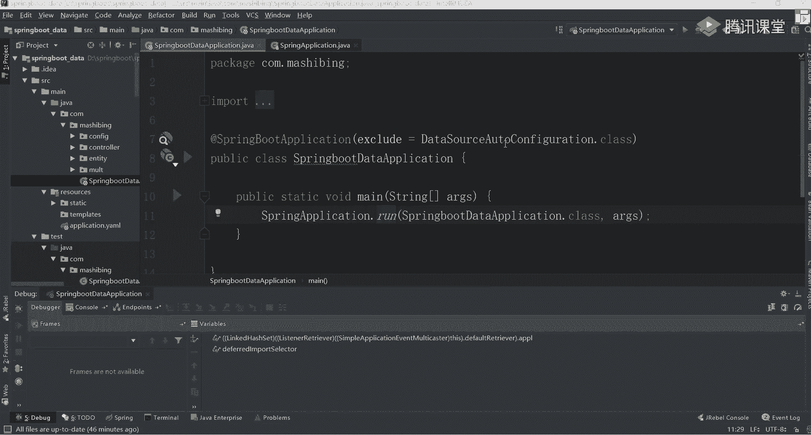

沿着路灯一个人走回家。

和老朋友打电话。

你那里天气好吗，有什么新闻可以当作笑话，回忆与我都不爱说话，偶尔我会想起的，心里有一些牵挂，有些爱却不得不各安天涯，在夜深人静的时候，想起她送的那些话，还说过一些撕心裂肺的情话，赌一把幸福的筹码。

在人来人往的街头想起他，他现在好吗，可我没有能给你想要的回答，可是你一定要幸福啊，好同学们能听到声音吗，能听到话来扣个一，我准备上课了，呃今天讲什么，讲swibot源码，发下spot源码。

大家想听源码课吗，哈哈哈哈哈，这个野马克啊听起来确实是比较无聊的，是不太行呃，研网课天天确实比较无聊，然后上次我讲课的时候，很多同学可能已经听懵了啊，可能已经听懵了呃。

然后呢就是不知道你下课之后自己有没有啊，虽然痛，但是爽呃这个过程啊，你必须要经历，当你完完整整的把一个项目的源码，如果呃听完了，听完了之后，然后的话你再看新的源码的时候，你会有一种非常舒服的感觉。

最主要是找那种感觉，反正源码啊之后怎么着都是要听的啊，或者怎么着都是要自己看的，你不看的话，面试问到怎么办，很麻烦好吧，呃前两天的课约马课没听，今天能听懂吗，呃估计有点够呛啊，估计有点够呛啊。

但你可以先过一遍，先听一听，先听一听呃，什么时候讲网约车，等咱们所谓boot源码讲完之后呃，来讲这网页车项目，好像网易车项目呃，不用担心微服务熔断，没听完困难不，这块没关系啊。

这个跟b服务这种断那块没有关系，我们就看一下它里面的一些实现机制，其实像swim源码在问的时候可能自动装配，问的比较多，所以我现在在考虑说这个源码大概讲到哪哪一个层次呃，这还没想好。

但最起码我们这个启动过程是要讲完的，讲完启动过程之后，第二个就是讲一下我们对应自动装配的一个原理啊，第三个我准备讲一下我们那个starter它那个整体的启动过程。

因为我们知道每次你在搭建spring sgo项目的时候，有些外不了这些东西所在的讲一下呃，其他的一些系列，比如说spark bot的一些环境方面的东西对吧，呃再比如说像后面的一些自定义的东西。

我们这儿就不讲了，或者第一期暂时先不讲了，我怕讲完之后很多同学就懵了，所以我们这儿呢先讲讲一些简单的或者说面试中经常被问到的，好吧，别的废话，我们这就不多说了，周末的时候人比较少啊。

什么时候讲完四五节课就讲完了，好吧，大概还有四节课左右吧，如果跟不上的话，可以先不跟好吧，先看那些基础的东西，ok好了，来看我这个项目，我们还是一样，先回顾一下上节课我们大概讲点什么东西啊，我知道了。

每次我们的spring boot项目在启动的时候，必须要执行我们这个装方法，然后你往里边依次进行点击的时候，你会发现了他创建了一个spring application的一个对象。

在这个对象里面大家还记得做什么事吗，应该还有印象吧，首先它创建了一些资源的一些管理器，但这个值是空的，第二指定了我们这个程序启动的主力是谁，叫primary source。

第三个指定我们当前应用程序它是什么样的一个类型，第四个往里边设置了一堆的什么，是不是初始化器和我们这样的一些监听器，这些监听器和初始化器。

这些文件是不是在一个叫spring their factories的文件里面，大家应该有只有有印象吧，说在账号里面，当时我跟你们说了，其他账号是没有的，那两个你再看一下呃。

找一下我们的spring boat，第一个在stboot里面有一堆的配置吧，这是第一个文件，第二个有个out to wear，out，out to confia。

在这里面也有一个spring factory，这两个文件就会进行自动一个加加载，而且它加载完之后，因为后续的源码里面会不停的从这个文件里面取对应的一个类啊，取定一个类文件，所以这样希望大家注意一件事。

注意什么事呢，它首先加载过来之后，会把文件里面的全部顺序，把全部顺序，然后直接读取到我们的全部内容堆，都堆到我们的缓存里面以后，再取的时候就会直接从我们的缓存里面进行一个获取，懂我意思吧好吧。

所以这块大家注意了，我们这说的是什么，是swing bot里面的东西啊，spring源码你们之前已经讲过了，我知道不太重复了，懂我意思吧，the board里面只有两个，里面有spring bot。

肯定要依赖我们的spring吗，懂我意思吧，ok这块稍微注意下就行了，就这些东西，然后呢，最后一个找到我们当前这个应用程序它所执行的一个主函数，我找到我就是主函数，它是有一个对对战的一个路径吧。

依次往上找，能找到我们对应的一个主函数，就是当前这个类在创建对象的时候，他所做的一些事情，好想做一些事情，大家进行完成之后还要干嘛，是不是该进行整体的一个启动环节了。

我们上节课也大概就讲到这个启动环节了，大家想一下这个启动环节前期他做了哪些准备工作，第一个设置了一个stop watch的一个对象，这个对象里面非常简单，就给了一个名称，给了一个时间。

记录一下我当前程序启动了多长时间啊，这是第一个，第二个又进了一个上下文的一个对象，当然此时对象还是空的啊，此时对线还是空的，之后才会给他进行一个创建，第三步，我们定义了一个异常的报告器。

它是一个release，第四个配置一个什么叫java wt headless这样的一个属性，把在我们的系统属性里面去了六个，是不是加载了一些监听器的内容，表示一些监听器监听，我跟你们说过了。

首先我们会从11个监听器里面来进行一个数据的获取，取完之后并不是说所有东西都能进行适配的，他要干嘛，根据我们的事件来进行匹配，刚开始你第一次刚进去的时候，这儿有个什么东西找一下。

是把我们这个装类似呢都给获取到，当你获取到之后，第二步开始进行一个starting，一点starting里面会出现一个对应的事件吧。

你点一下看个什么东西叫application starting event，第一次的时候会像这里面，也就是说我会从那些过滤器里面进行一个匹配，能匹配到当前事件处理的进行监听器，留下来。

不能匹配的直接过滤掉，然后呢把那些监听器分别进行一个整体的处理环节，这是第一个我们讲的一个事件，后面的时候啊还有很多，然后这块我跟大家说了，我们在取的时候是不是有这样一个这样一个属于是这样一个对象值。

这样对象值是在当前这个类进行呃，初始化的时候，或者处上对象的时候，这里面进行了一些复制操作，这东西啊之前已经带你们看过了是吧，我是反过头来带你们直接看的，所以这块要留一个印象。

然后当这些监听器都启动好之后，下一步骤该干嘛了，是不是解析我们对应的一个参数值，而当前的参数值是从哪来的，是从我们的命令行来的吧，你还记得解析了我们命令行的一个参数，然后带你们看了是以杠杠开头。

k等于v这样的一个方式来指定的，他后面会有一系列的一个匹配过程，匹配到之后直接把它带到我们的呃，那个这个配置而配置参数里面来好参数里面来，这是我们上节课讲的东西，然后这节课我们讲什么。

主要讲一下我们当前这个环境好吧，也就是说我们spring boot程序在运行的时候，它是需要依托于环境的，叫conferable environment吧，是不是叫配置环境，因为我们都知道啊。

你虽然可以从我们的application properties或者说application emar里面读取我们的配置参数，除此之外好处之外，在很多的类的上面，其实你定义的一些注解吧，好吧。

这块一定要总结到我们对应的一个什么环境里面去，所以这主要是准备环境，还记得吧，那我从这儿开始进行一个讲解了，这个方法上节课大概带你们看了一下呃，可能因为下课的原因吧，也可能时间比较长的原因。

很多同学听到那之后就已经听懵了，好我们今天把这个东西再重新重新重复讲一下，来到这个环节为止，上面的东西还有点印象，可能记个大概的同学，老师扣波一，好了，那没问题啊，没问题的话，我们来开始执行程序。

记住我说过了，第八个来进行执行，嗯错了，稍微进行一个跳转啊，往下走走走走走，说到这一步骤了好吧，到了之后f7 进到我们当前这个环境里面来进到里面去之后，你能看到很多相关的一个呃语句啊，看下语句干嘛呢。

你通过名字你能做一个判断，第一个叫get or create environment，先创建一个环境对象，是第一步骤，第二步骤是进行一个合理的配置吧，第三个叫attach，很多同学看到太太之后懵了。

我这个touch什么意思，你把它理解为什么贴上，就是说它会往这个环境里面再加载一些对应的属性值，第四个是进行一些计算器的一些启动准备工作吧。

第五个把我们当前这个环境绑定到我们的application里面去，第六个做一个类型的一个判断，环境变量对环境对象是否是符合我们的类型的，如果不符合再进行一个转换，第七步也是往里边加一些其他属性。

仅此而已，明白了吧，我们挨个来看一下，第一个叫创建，或者说获取一个环境，大家想一下，到目前为止，我们在之前的操作里面有做过任何跟环境相关的事情吗，没有吧，所以此时你在进去之后一定是什么。

是不是一定是我们要进行一个创建工作，而不是一个获取工作，四连续看一下，刚开始environment是不等于空，等于空的话不走，这然后这个会进行什么，根据我们当前应用程序的一个类型来做一个判断，再说了。

什么类型叫throat吧，是不是throat，因为之前说过了，有三种类型，一个是n exerate，一个是reactive，三种式的东西之前它会根据一些参数进行一个判断，好进行一个判断。

为什么要贪吃两次，你看一会我要回来再说啊，回来再说，一会儿再讲讲这东西啊，回来再说，来来看，这是一个survey的东西，所以在往下走的时候往下走走，是不是匹配到这儿了。

叫stard server envim吧，这个方法我希望大家能够注意一下，非常关键，为什么他这实际上是创建了一个对象，而在我们当前这个对象里面，对象里面你们可以看一下它的一个类的一个结构图啊。

收大家过来看这个层次依赖关系了吗。

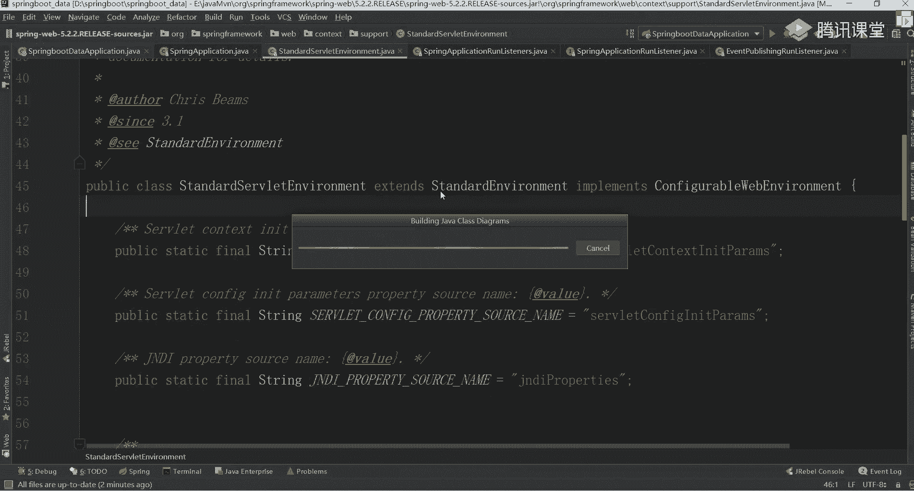

它的上面是谁叫stand you warn warm，上面是谁叫abstract you warr，为什么要带大家看这样的一个依赖关系图，上面这个接口不用看了，接口不用看好，先放一边。

我们主要看它对应类的一个继承关系，因为当你创建完成当前对象之后，他默认情况下需要做一些准备工作的准备工作，来回来我们看一下，如果按我们刚刚的说法的话，点赞点它，点它之后是不是找他的构造方法。

你看一下当前这方法里面有构造方法吗，有没有做过吗，没有吧，没有说老师，那我就单单创建这个对象就行了嘛，很简单嘛，不对好，你这样看原版的时候，很容易漏掉一些关键的属性值，为什么我说了他有一个继承关系。

在此类创建我们对象的时候，父类对象是不是也要进行一个创建，所以此时你要往上翻，明白我意思吧，一定要往上翻，你看一下分类里面大概做了什么样的一个事情，大家做什么样一个事情，往上走点，负累负累的时候。

你看一下当前这个分类里面有对应的构造方法吗，是不是也没有，没有的话，再往分类里面找它是一个什么类，叫抽象类吧，虽然是抽象类，但是当前抽象类里面它有一个什么，是不是也有一个对应的各个方法。

各个方面它掉了一个什么，是不是这样的一个方法值，所以你发现了当你的子类对象在创建的时候，他依然是不是也会掉的方法，而这个方法里面做了很多的事情，做很多事情，我们这儿可以点一下看看点它点完之后。

这是个空时线，空实现的话一定要找什么，是不是找具体子类的一个实现了，刚刚我们看叫什么叫standard server，然后呢environment点它这是两个选哪个，下面这个吧，点下面这个点完之后。

这告诉你一个道理，或者说这告诉你一个信息，property source，点at last at last，这个property source是什么东西啊，你猜一下应该知道吧。

这不就是一个放置我们属性资源的一个对象，或者是一个集合点，看一下是不是传过来一个这样一个呃不可变的一个集合对象，有了它之后往里边叫at last，往里面最后进行添加嘛。

加上了new了一个什么叫s t o b property source，这个psource，这是一个对象都无所谓，关键是看后面的参数值，哪个地方叫server configure promise好。

inal pm pm啥意思是surface it里面配置的一些初始化参数值是第一个，第二个再点一下这什么叫server lake context，interfms，一个是confe。

一个是context，如果你对你的server的印象还比较深的话，这是server里面两个非常非常重要的对象吧，或者会之前的时候如果是sv的话，会从我们的外表上班里面读取一些参数，配置好。

这样的话是不是把这个参数值也帮你给加载过来，是不是完成这样一个基本工作，所以前面做了这样一件事，这要记住了啊，这样记住了，一定要去记住它，这样做完之后没完好没完，还有什么事。

下面这还有一个叫gndi这家店的东西啊，你们一般用不到，所以不用管它好，往上看，这有一个super点什么东西，一键看到super了，一定是掉负类的，你点一下负类上面有什么东西。

是不是跟刚刚的代码一模一样，直播现在变成什么了，变成叫properties，点什么东西，system in environment，点什么东西，你点开这两个常量值，你看到了谁。

是不是表示我们的系统属性是不是系统属性对吧，你再点下面那个叫什么，是不是也是我们的系统环境，看明白这意思吗，所以大家能看到刚刚我们完成那个操作之后。

实际上它是往我们的property source里面加载了四个默认的一个配置资源，好吧，你想一下啊，你要想运行你的应用程序，当时我们在那个jdk刚刚讲java的时候，老让你配环境变量。

环境max里面是不是指定了很多的一个路径，像那些路径是不是都属于我们当前的一个系统环境了，所以那些系统环境的参数值它都会被加载进来，一会儿我们可以看一下，明白意思吧。

所以一定要看一下当前类这里面的一个继承关系，你比方说老师，我就new一个对象就完事了，那样看的话是不完整的，我说了你会丢掉很多关键的一些属性值，所以这块是不是直接创建了往下走了，那个东西不带你们看了。

不带你们看了，说到这了，这次老师已经得到一个最基本的环境对象了对吧，来看一下这个环境吧，我拉一下environment，找到我们的property source是不是有四个。

分别是server config in need a paparamel，server contest in it，persi system properties，然后呢。

system environment能看到四个属性值了吗，现在是不是应该知道说哦，原来四个属性值是通过这样的方式给加载进来的，来这个点，听完同学扣个一能看懂吧，就是我们之后啊，这不管在配置文件里面也好。

还是在那些系统变量里面也好，配置的这些值都会降到里面去，这个时候你可以看一个东西啊，叫environment，sm environment，点开我们的source，你往下看这些属性值能看见东西吗。

他有没有把这些东西加加加载过来，是不是指定好一些路径，再比如说你点开上面这个叫system properties，点开你看这东西了吗，java vm version等于谁好吧。

java javm是什么东西，然后一堆参数看看出了吗，能看到吧，是不是能看到具体一些相关信息，所以这些信息都已经被我们给加进来了，如果之后的程序里面我需要用的话，是不是拿过来之后直接用就行了。

懂我意思了吧，所以这块也能看到很多相关的一些参数值的，它不是说我白加来的，一定是存在具体的一个意义的，那上面这块da source有东西吗，没有吧，因为现在你还没往里边处理任何东西。

所以现在还没有任何的艺术性，但之后我们会往里面加载很多的一些其他属性值，是第一步骤，先创建当前的一个环境，环境完之后，第二步该往当前这个环境里面进行相关参数的一个具体值的配置了。

这个配置其实也非常简单也非常简单，你可以点一下这个参数值走交方案里面去，是不是在这儿在这儿的时候，这儿需要大家注意一件事儿，我们都知道在写spring boat这些程序的时候。

比如说string转成int对吧，再比如说date日期做转成字符串，字符串转成date日期，是不是及到很多相关的一些转化工作，而那些转化工作最终会在这个步骤里面完成，当然啊呃这个东西啊。

是根据你不同的那个总部的版本不一样而决定的啊，在老区的里面，版本里面是没有这个东西的，这是新加的，因为我讲的是2。2。2，最新的版本，明白意思吧，这地方该做什么事，第一个是属性值是处，所以肯定能进去。

进去之后我们这里做一个判断，往下走啊，注意判断他说了叫application conversion service，点get share instance，这get share instance干嘛的。

不知道吧，好吧，你们有没有印象，之前好像似曾相识过这样的东西叫share什么东西，没有的话，我们接着往里边进行点击，点完之后，这里面告诉你了，说是一个share instance的一个值吧。

这是不是有定义这样一个属性，你往下走，刚开始这个属性值有值吗，没有吧，是不是空的，空了之后它往里边一直往里面走走，现在还是空的啊，一直往里边空，到这块的时候，你看一下这做点什么事。

是不是又开始创建我们当前这个对象了，来点进去走，在这里面做了什么事，看这块了吗，我们挨着往下看吧，这个值等于空吗，等一会啊，是跳下面一块，这有个config，你点到这个configure方法里面去。

第一个叫default conversion service，点at default converters，converters，熟不熟，什么叫converter啊，见过吧。

之前是不是也自定义过一些对应的一些转化器，你自定义过实现过吗，哎还记得这东西吗，double check clock，不要管这个锁的事好吧，你先理大概的一个思路行吗，限制外连锁的是你先理一个大概思路。

你先把这个流程给捋清楚了，是不是叫转化器，这个时候你可以往里面进行一个点击走，看里面做什么事，第一个叫a什么什么东西，computers点进去看他做什么。

叫number two number converters，然后呢string to number object to string，string to chara，character。

object to string，然后number to a character一堆一堆，看到了吗，这是不是我们之前看到的一些相应的一些转换器的东西了，能看到了吗，是不是相当于在我们配置环境的时候。

他已经把这些对象直接把我们给注册进去了，这样能看懂吧，把能看到我直接把他跳了一行行走，这里面就是一些对象，这没啥好吧，这些对象的一些处理过程，这个很简单，没啥没啥可看的啊，往哪走走走走走，东西很多啊。

点进去第二就第二个什么叫at cassions converters，是集合的一些转换器了，你点进去一样的，array to collections，collections to array。

array to a ray，然后呢collection collection map to map，是不是一堆转换器也是一样的啊，一样的都搞完，搞完之后，下面还有别的什么呢，叫bad buffer。

computer，string to tytwo，他们呃，他们id to time zone，什么什么一堆东西，是不是还是一堆转换器，就这里面定义了n多个的一个实体类对象，这没问题吧。

这是第一步要做的事情，第二步叫什么呢，叫at default format formula，什么，啥玩意格式化题吧，是不是格式化器，然后点进去依然看一下。

这不是可以加一个number for me and education for factory，什么东西对吧，我这不往里边点了，不往里边点了，你还跟往下走，这做一个判断，判断完了之后。

这儿有一个叫data time for me register对吧，后面还有一堆的一些逻辑判断，比如date formal register，是不是有很多这样的一个格式化器了，要转换完就完事儿了。

再来看第三个叫at application for it，把刚刚那个转换器是不是加进来，点进去叫char array format，night address for it。

s upset format，是不是这个值再往外边走，string to多多tion to string number two，多tion，什么cba一堆东西，所以这波大家看到了，我们这儿不用管。

但我知道了，整体上来说这块儿一共完成了一件事儿，什么事，把我们很多的一些转换器和格式化器对象都已经提前创建好，创建好之后加载到我们当前这个commercial service里面吧。

而这个converse service最终是不是还要给到我们的environment里面，所以它有一个层次递进的一个关系来往下走，创建好对象了，这个值是不是已经有值了instance了。

然后把这个值返回回去，返回去之后叫environment set conversion service，把它加载到我们当前这个environment里面去，加完之后你可以看一下debug里面的一些值。

来找一下我们的另外ment，找完之后找一下刚看到的小叶是谁来着，格挡environment in哪去了，看这converse service吧，点完之后，这儿有个converters，点进去。

converters点进去多少个多少个，一共134个吧，意味着把我们所有这些转换器，这些工作是不是都已经加到里面去了，那这块之后在做的时候还用我们操心吗，不用吧，你在写代码的时候。

它是不是有些情况下自动也会帮我们进行转化，如果是他转化那种格式不太符合我们需求的话，我自己是不是也可以进行自定义的时候，他也会进行整体的一个装载工作，加载工作也能够进行一个生效这块东西。

所以这样都比较简单，来到为止能听明白，同学扣个一，你最起码要知道说他这一步做什么事，做什么事，你平常用的时候看起来好像很舒服的样子，好像不知道什么是做的，但其实在初始化的时候。

或者在创建这个应用程序的时候，他已经把这些基本工作都帮我们做好了之后往下看，下面两个东西就非常非常关键了，第一个叫配置property source，第二呢叫配置profiles。

这profiles到底指的是啥呀，promise s不用我说了吧，就是我们参数的一些属性值，对不对，这个profit是啥呀，有人知道吗，对spring profile。

你想一下你在配置的时候是不是指定过多个环境，比如说有生产环境，有测试环境，有各种各样的环境属性，叫spring。profit，点active，你可以指定说我可以在多环境里面进行直接的一个切换。

是多个多个配置了，就是这样一个意思，来挨个往里面看，挨个往里面看好吧，先看第一个叫config promise，这里面做的事情也比较简单，刚刚我们看到了，在我们当前这个environment里面。

它所谓的properties一共有四个值，对不对，这个一共有四个大四个参数值给我记住，service configure sweet呃，contest system，properties。

system environment，把它40只给记住，因为这现在它要往里边加东西了，删东西了，来点一下往下走，这时候告诉你这是一个source，这没有吗，有吧，看看看第八个里面参数值吧。

点下去一个source是不是四个，还是刚刚那四个这个没有变化，那这样会做一个判断时候干嘛，它会往里边重新创建一个叫default properties的东西，就默认的一些参数值的配置。

默认参数直接配置不完了，加这样的属性，忘了吗，不换了吧，所以这第一个不是什么叫不等于空，并且什么不等于mt的时候会进去，连续能进去吗，进不去吧，进不去没关系，往下走，这个this。

at command line properties and ex大于零，我们这儿有参数吗，没参数没参数会跨过去啊，没参数会跨过去走，所以大家看到了这个里面好像没做什么事对吧，我做完这个步骤之后。

他依然还是我们四个参数属性值，但你要知道后续的时候，因为刚刚在这个方法里面，它指定了一个default properties的东西，虽然现在没有之后，是不是也一定会往里边进行一个具体的添加工作。

只不过在这部里面没有进行一个完成工作，那后面肯定会完成吗，现在这样一个悬念，看一下他什么时候做这件事情的好，第五步干嘛叫convex profile吧，是不是家里profile了。

这里面你能看到很多你认识的东西来往上看，第一个叫new一个现在集合吧，叫additional profile，这个值现在是空的好现在是空的，这就是一个high集合，进行一个驱动操作，这么啥说的。

第二步往下走，叫environment的get action profiles，你想一下我们现在我们现在有指定任何配置文件吗，没有吧，大家看一下我这个配置文件啊，几乎都没写。

找一下我们的这里面有些东西吗，没有吧，是不是没有好没有，没关系，我们往这边走一下，点进去叫get do get actor fi，再往里面点多了之后，你看下这个属性值啊，不是不是是这个东西。

看这个名字你熟不熟，叫spring profiles，点active，看这名字了吗，这名字熟吧，原来是读取我们当前这样的一个参数值，你在生产环境里面肯定会用的，一定是多环境的配置，测试环境了。

开发环境了对吧，这一定是有的，回来之后，这里面就干嘛做这样一个参数值的一个判断，看完之后，因为我们这里都没有吗，没有之后直接返回就行了，我们没配，所以直接返回，但你要知道他完成了这样的一个基本工作。

如果他有的话，加回来没有的话，那这个值还是空号空的，什么都没有，再来看干嘛，把我们刚刚设置好的这个活页或t profile文件，加载到我们当前这个environment里面来，是不是加进来了。

当然这个id profit是什么空的吗，我说了，我没指定任何值，所以这时候是空的，空就空吧，无所谓啊无所谓啊，大家看一下，刚刚那个步骤是完成了，所以这里面你看到了他除了这里面其实做两件事。

第一加一个什么，或者判断一下有没有default，让他和那个properties这样一个参数值，第二个加一下叫spring profile，然后呢active就加两个东西，别的东西不加了。

这个大家注意一下就行了，注意一下行了，第三个叫configuration proof property source，点attach很多，刚刚问了说老师这儿有一个attach。

下面是不是还有一个attach，你看完这块的一个逻辑之后，其实非常简单，都是把什么把我的有外面的时候加进去，只会进入这样的环节，做一个转换器，他把你转换过程中里面丢失了，所以后面重新加了一次。

仅此而已啊，来试一下吧，点击看一下做什么事，第一个是断言，不管它是第二个往下走，是不是获取到我们当前这个泡泡的source，这里面还有几个四个吧，看一下source是不是还有四个没任何变化，没任何变化。

然后呢往这边点这个source，点get，看那儿看到了吗，是不是叫configuration properties，我们现在这里面有这个configuration properties吗。

所以向下做一个判断了，如果它不等于空方法怎么做，如果等于空的话怎么做，是不是我们要看一下什么，看一下这个等于空的时候，他做什么事，对不对，在当前这个等于空的时候，可能跳到里面去，往臊子里面加东西。

这里面加东西就非常非常关键了啊，非常非常关键了，为什么这么说，为什么这么说，一会儿往里面看一下，你知道大概是什么样的一个意思了，好往上走一下，来看一下，点一下这个f7 走，第一个创建一个呃。

是不是一个构造方法，这构造方法非常简单啊，不管它了，走走走，然后第二个看这个参数值是不是还是那composition properties。

第二个叫new spring composition property source，点这些对象，点完之后点super，点完super之后呃，这也是他是吧，看到一个属性值是吧。

这点i force在这往下来看，这是不是值了，刚刚取过来一个属性值，configuration properties parties。

完了之后会把它把它加到我们这个property source list集合里面去，所以这样可以完成这样的一个基本工作，往下走，你走完之后你再看一下当前这个值几个了，12345了吧。

是不是相当于我加了一个值，叫configuration properties，现在你看到几个了，12345个吧，这五个参数是什么时候加载的，你必须要知道刚才的过程我已经带你看过了。

你必须要知道它到底什么时候加载的，听懂我意思吧，啊做完之后来回来，是不是，这不是做完了，做完了吗，知道这个函函是干嘛的吧，就是把这个判断一下，我有没有confirefpx，如果有的话加进去啊。

没有的话就加进去，有的话就不管它了，懂我意思吧，这这块儿的一个基本工作好，来到这块，到房前为止，能听见同学扣个一，谁让你记他了，你记他干啥，这个源码不是让你去记的啊，你要说老师我把原号背下来。

我也背不住，但是里面关键的某些步骤，你把它能说清楚就行了啊，这比较重要，这比较重要啊，好了这块判断完之后，下面又到这个环境叫this，然后呢第二environment prepared。

一看到这个方法好像有点似曾相识的感觉，有种感觉吗，有种感觉，这之前是不是也见过一个listeners加什么东西，这不之前叫什么叫listeners destarting吗，现在换了吧。

换了这一warm perfect prepared，就说我们环境准备刚刚是应用程序的启动，现在是环境准备往这边点，自己回头写一个，没意义好吧，点进去，点完之后看这个环境了吗。

是不是又该进行listener了，你告诉我还记得这个listener是谁吗，这个真的是谁，还有印象吗，我现在不带你看那个值，有没有同学记得上节课讲的叫event publishing。

然后呢run listeners吧，是不是这个东西来往里面看一下，是不是这只一event polication，run listener，是不是还是卡，整个我们这个程序启动的环节里面，唯一的只有这一。

这只有这个对象，m是什么，我们之前说的那11个监听器吧，然后再往里边进行点击走，连进去之后就到这了吧，这个时候看到一个新的对象了，原来叫application starting。

现在呢叫application environment prepared ev，相当于我多了这样一个对象值，看到了吧，所以这块出逻辑啊，调到同一方法基本上是一样，没有变化点，这是创建我们那些对象。

你往这边看一下，也没啥，往下走，是不是就记住一个时间，这个没啥值好吧，没啥值，不用管他，就创建这样一个对象，对象出完之后往里面走，走到这行是不是就看了点走，走到这方法里面去，到那之后可能又熟了吧。

干嘛呢，往下走，走到这，这这这是空的空，怎么办，这有个方法叫get obligation listeners，还是一样，我要通过干嘛，从那11个对应的一个参数里面值把它取出来，符合我们规则的吧。

什么规则叫application environment，什么application environment，然后呢prepare吧，还记得那个疑问的事件吧，把那个事件给我记住了。

往来看看这是不是有个疑问，看那the vironment prepared问，把这参数值给我记住，然后进来之后往前走走走，这儿有一个哪去了，这把是不是检检索我们对应的信息值往上走，这有个判断。

这是从缓存里面直接把这个值给读取，来，把读取出来，读完之后，这一个叫sports疑问词吧，都知道刚刚那个so这个listen有多少个，看listen us多少个类似点的形式有吗，多少个11个吧。

是不是还是11个，所以我还是一样，同时11个里面做一个筛选了吧，来走第一个不不不符合吧，好吧，来走走，第二个是不是进来了，进来之后往里面进行一个添加工作。

叫abstract obligation event，什么东西还是一样，最终要往里边进行一个整体添加工作，是这样，我希望能带你们好好看一下，因为他那把这个鉴定事件加进去之后，并不是我加就完事了。

不是这样的，还是要做一些最基本的一些工作的啊，最基本的一些工作的，大家看一下吧，这先过滤吧，先过滤好吧，一个啊，刚刚看到了，这是第一个，第二个吧，往里面挨个走走走走走，你不用数了。

一会儿看我直接看结果就行了，这就是个循环工作，循环完了吧，循环之后来看底下的一些参数，是不是有七个，这记住记住这个参数值好吧，记住特征值，同时还有一个什么叫点retrials applications。

点at leen是吧，他还往这里面也加了一份加值多少，是不是还是七个确实是一模一样的，还是这七个更没有什么变化，你把这个值给我记住了好吧，知道这里面放了这样一个对象，放完之后还是一样。

挨个往下走吧，这里面干嘛的，获取并对象，然后获取不了，往下走走走，把它加进来，加完之后返回我们这个值一共有七个，走，回七个访问七个之后，这儿开始具体的一个执行工作了，这个步骤我们需要重新看的。

因为之前想一下，第一次我们看那个事件的时候，是不是一共有四个，我你们还记得没有，当然是实现出来四个事件，那四个是不是有四个类似的，那四个类似的里面是不是只做两件事，第一个叫log system。

是不是和日志系统的一个初始配置，还记得吗，第二个是什么，是配置了很多转换器，格式化器等等很多操作参数，还有另外两个是什么作用没起，这块在执行的时候依然是一模一样的。

我们还是要挨个进行一个最基本判断走第一个叫什么叫configure，fail application listeners，你一看这个名字就知道这两个东西一定是有用的啊，一定是有的。

为什么说一定是有用的呀，告诉我这个有用吗，有用啊，这块可能会往里边跟的比较深，跟的比较深，因为p2 是配置文件，我们最主要处理其实就是配置文件可能会跟的比较深，我希望这块你能够好好听，好好听这块东西啊。

来往这边走，这个选项pm对，就他listeners而走，点进去开始执行吧，点进去走走，do invoke listeners，点进去，这有一个listener on application event。

再点进去，这是不是作为判断了，判断一下当前这个事件是不是ation viv，是他吗是吧，是的话，就往这边走了，再点进去，整体的一个处理环节，在这个处理环节的时候，这东西叫什么。

叫漏的post processors，这个是干嘛的，是干嘛的，叫post processor吧，是不是我们在主里面你们见过这个东西吗，在我们注入并对象的时候，它相当于是一个构造函数里面这样的东西。

就这块大家也知道啊，在词语里面经常见到这样这样这样单词，你把它理解为一个处理类就行了，扩展处理类就行了，也没什么特别难的，然后点点到下面了吧，这有个东西叫spring factory loader。

点load a哎点点点点错了，不管没关系，大家看点点方法不对了吧，在这个方法叫spring factory，load load factory，这东西少不少，是不是还告诉你说。

我要从我们刚开始那个spring factories，这个文件里面开始加载一些具体类名了，这名称告诉你叫event post processor，来点开我们那个配置文件，我说了啊。

我都提前给大家给粘出来了啊。

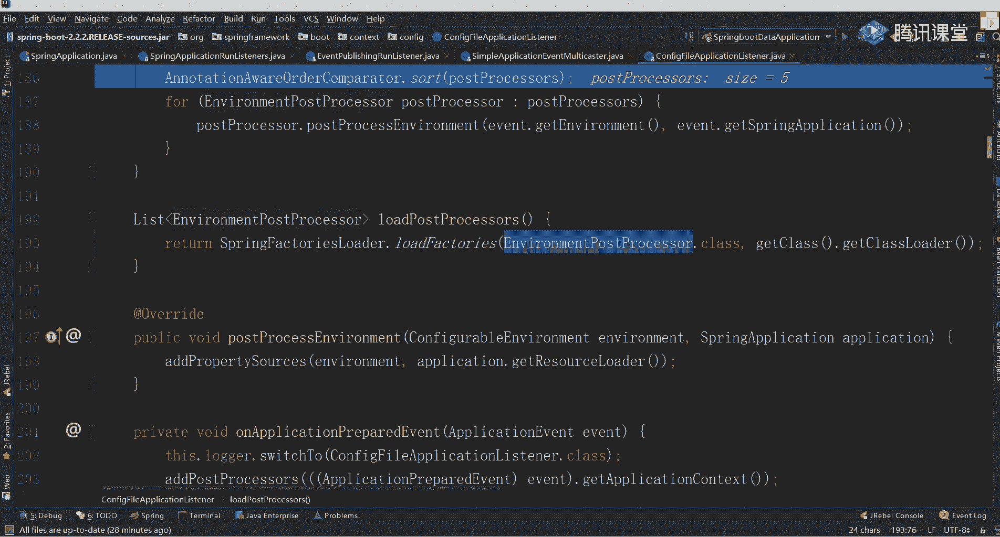

晚上再往上翻找一下，叫event，找一下，看这是不是叫environment post processor，你点那个地方，第一个叫color什么啊，found foundry什么东西。

第二呢three application什么东西，第三个system e n v property，source environment pose，第四个叫debug agent。

environment processor，之前几个值一共有几个，所以我这加载回来之后。

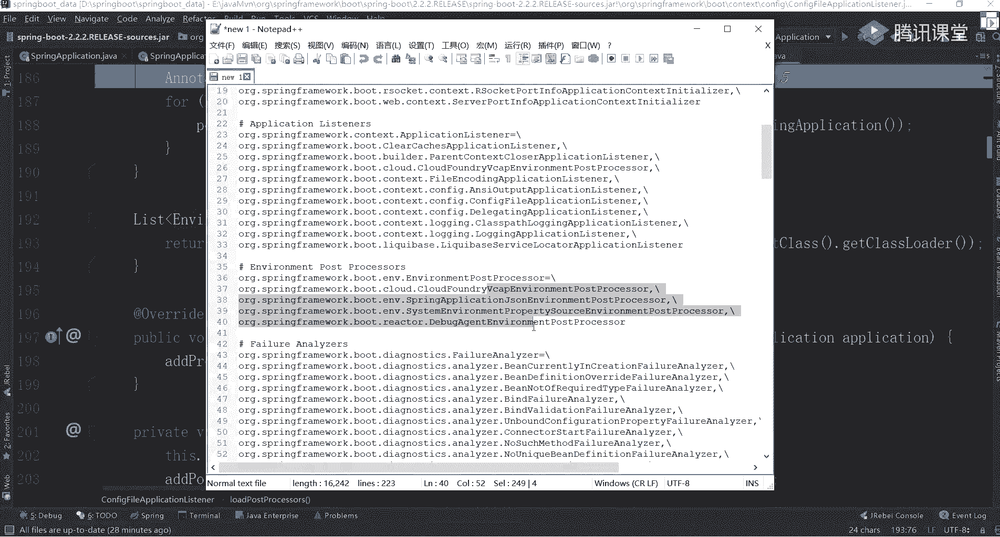

是不是四个一定是吧，来往下走啊。

这这这这已经过去了，过去告我们看一下这个值吧，刚刚点快了过去了，怎么五个呀，下面还有吗，看下面还有没有了，别问我们的pos processor，没有了没事，应该四个怎么五个呀，看这个这是啥啊。

第一个这有第二个，第三个，第四个，看这儿这家里什么东西，那这加个什么东西叫at processor，at this吧，是把自己本身也加进去了，所以是不是一共五个，对的没说错啊，是不是有五个有过之后。

这tation where all compare to shot，是不是把它进行一个排序操作，你排完序之后，这儿你要注意了，注意什么事，在这里面开始进行一个for循环操作。

而这个for循环操作里面叫post processor，问vironment是开始往里面加这些东西了，好吧，挨个来辨认一下试试啊，走第先取出来叫什么，叫system environment。

properti先读取回来是这样一个属性值，这里面他做了个什么事儿啊，可以往里面点一下，第一个get environment告诉你了，是slender serenvironment。

不管他第二个参数是get through application，这就是我们当前那个主动的一个application程序，大家走，你看这个b不成程序啊，找一下找一下来问他，是这个疑问，到这儿没有啊。

没看到啊，点开大家看一下吧，even get spring，是不是我们之前说的spring date，simple the application好，还是我们当前这个类啊，这类是不变的那个主类主体动类。

然后再往里边进行点击，叫post process in 2文字，这里面就很关键了，点一下这个参数什么值叫system environment吧。

还记得我们之前那个source properties里面是不是有将来这样的东西，所以现在我先把它给获取到完了之后，第二步叫you want get process，这get通过这个名字把它拿过来。

拿完之后不等于空，这做了整体的一个替换工作，叫replace property source，给你看一下，干嘛呢啊，值取出来，取完之后放到一个mac结构里面，放完之后。

他把刚刚那个配置参数值是不是什么叫origin or system environment property source，在这样一个对话对象转换恰多少都没做。

我到现在我也没猜测到说他为什么要把这个对象给转化成这样啊，不知道啊，我只知道说他里面做这件事，但是我没猜到他为什么要这样干，懂我意思吧，反正不管你记住一件事，他这个操作非常简单。

就是把我们刚刚那个呃系统参数的一个值，system arm的是不是做了一个对象转换之后，转换之外其他东西都没做，懂我意思吧，啊这是第一个，我们要做一个事儿，来这块评判同学扣个一，你听我说啥吧。

所以我们在读取参数的时候，有一个system environment这样一个对象，但这个对象拿过来之后，他在里面做一件事儿，把那个对象转成另外一个类型，但现在我也没猜到他为什么要把它转成这个类型。

还不知道，如果谁有那个研究过的话，可能跟我说一下，我没猜到为什么要这么干，你懂我意思吧，没关系，来再接着往下看，其他的完了循环循环，第二个叫什么叫spring application。

jason什么东西，看到spring jason的话是干嘛的，肯定是要处理我们对应一些战斗数据了吧，点一下走，这都不用管它，点进去到这块了吧，这里面你看到这样一个操作点，这个旁白色等于谁。

看一下是configuration provisource里面是不是传了这样一些参数值啊，这值啊很多了，我们点开看一下吧，叫property，是不是一共有对应的五个值，这个值就是五个值。

这个值拿过来之后，它变成了一个什么，是一个集合对象，有机电之后点stream这个1。8之后，它保留出来一个流式处理，或者说函数式编程对吧，map jason get什么filter过滤。

然后放first找到第一个，然后pet呢判断一下这个值，然后press jackson能处理我们对应的一个json的一个对象了，是这意思吧，好它能处理整体的一个这样对象，你往这里面做一下。

你点完之后你发现了用了一个什么，这块是用了一个东西叫jason property source啊，你点进去是不是就加了这样一个值，叫obligation，叫jason吗，这三个不熟吗，之前有人见过吗。

来见过同学扣个一有没有见过，就是看说诶这东西见过吗，没见过，这个参数值你们都没试过是吧啊，就是说允许我们对应的一个参数值，它以jason的格式啊进行一个呃数据传入啊，就这个意思，没别的东西啊。

就是jjason，如果没见过没关系，但你要知道说他这里面做了这样一个基本操作，基本操作操作给记住了吧，记完之后往回返，我不看它了，那我就不看它了，这接着玩家处理吧，玩家处理走走走走。

是不是第二个过滤不做完了，做完之后就相当于说我这只是说允许了一个战神的基本操作，别的东西没有了，来看大家看该第三个了吧，往下走，第三是谁叫cloud foundry，什么东西。

你看到cloud肯定是云上面的一些东西，我们这里面有涉及到云上面的东西吗，没有吧，所以起码这个点之后，你会发现它里面好像什么事都没做一样，点进去，这衣服放哪走，有做任何事吗，没做没做就不管他啊。

这是第三个事件了，来咱们来看第四个事件叫configure fail application，你看到这个值，很多同学应该知道了哦，原来这看看了吧，做事情就比较多了，这种事就比如说很多老师。

老师在读取配置文件的时候，可以是application properties，也可以是什么叫yy的properties吧，那东西我怎么看的，怎么知道它有这样一个东西的。

从这儿你就能看到你们看到我们来看一下吧，好不好，再点下试试吧，第一个获取当前环境，不管它，第二个还是apeaction，不管它也是三个。

再点这块叫application get resource loader，它是不是就获取了一个resource loader的一个值，点一下试试吧，看一下这个返回一个值是空的。

不管它第四个叫and property source，该加载我们property s资源的吧，然后往里边点，第一个叫random value，property source。

点add to environment，这干嘛的，value随机值吧，你想一下之前你在你的配置参数里面有没有见过随机值这样的东西，应该见过吧，见过吗，就这样就这样这样写吧，我们也没写过，我来写。

随便写一个，就这个就这块东西是不是dollar符号加一个random点，是是不是印t对吧，是不是还有浪，是不是这样类型值上这个见过了对吧，ok这块就注意了，就它里面加了这样一个属性值，仅此而已。

所以这块也没有管它，这边加完之后，我们可以往回看能做什么什么处理啊，连续对之后，这有一个environment吧，原版完之后，这有一个呃啊after，然后这儿有一个参数的一个系统值。

是不是叫system environment，当前系统的一个环境，第三个叫new value property source rdom。

source name是random告诉你说你可以random进行一开头，下面告诉你了，这是一个前缀是random点，在这里面提供了很多的一个哪去了啊。

别在这儿是不是get next int什么range，这一只反正都是返回我们这样乱乱乱乱那么一个值啊，慢慢走一下试试点一下，这是获取到我们的psource赶走，那再往下走。

add up是往里边进行一个调用，super往里面点类似，都是往里边一直往上加加东西就行了，正好不用看了，不重要，回回回对，让他往那边走，叫add after吧，是不是开始往里面加我们这东西了。

叫at at index是一，然后property source是不是把我们这个值给它给加进去，是不是加进去，相信最后意味着你当前环境里面已经允许，允许我们出现random两个东西了。

这东西怎么看也非常简单，点开我们debug debug，debug之后往里边找，找外文，找property source，看他有没有多一个东西，多了吗，做啥是多了一个random这样的东西。

最后一个random刚刚第一行执行完之后，是不是rm之前是没见过这东西，之前一直说是五个吗，现在是六个了啊，所以这块儿你能看到具体的一个职业情况没完，这东西还是比较简单的，知道什么。

我可能在工作中可能压根不用它，因为我没有那么多的一个随机值的情况，代码就非常非常重要的，叫new logo。ler，你有六点六点是干嘛的呀，就是用来读取我们之前说的那些配置文件的东西，来点一下试试。

牛的往这边走啊。

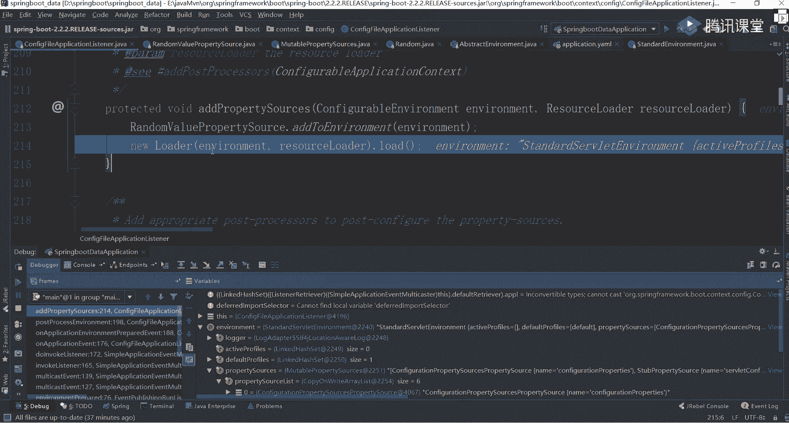

这里面开始开始开始操作了啊，比较关心了，就哎这是对对象创建完第一个environment，environment还是我们的标准service的一个环境，不管它第二个叫new person啊。

然后呢source of his holder resource，这rett不用管它走，走到这块之后，这儿有个东西叫load factories，应该比较熟吧，是不是又看到这句话了，之前已经不止一次。

是不是见到过这句话了，配置匹配什么匹配我们spring factory里面的文件，这类名叫什么叫property source，点ler是不是他往上翻。

最上面是不是叫property source la，看懂了吗，取完之后是不是应该取回来，是两个具体的一个类，一个叫什么叫power property。

然后sloader第二个呢叫em 2 property，sload是把这两个文件给你加载过来。

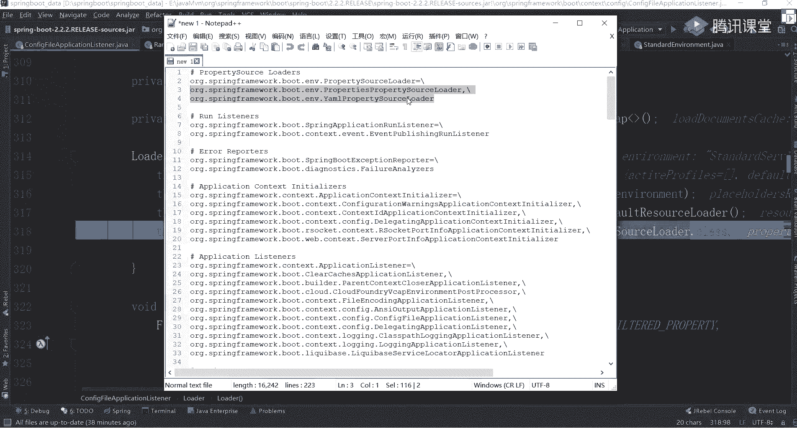

当然这是两个具体的类，这两个具体的一个类，具体类完了之后还要干嘛，我们看看这logo fet他都忘了走，不管他就是卡索格表，他你往下翻找一个东西啊，来走一下吧。

第一个是获取到我们这样的一个factory实现的一个名称吧，我们可以看一下这个名称是啥，找一下这两个看两个类是两类吗，对吧，有点累之后没完没完还要干什么事，叫呃在哪找找找找，这东西是干嘛的。

instance是什么东西吧，一看到instance，很明显他就是为了进行一个具体的实例化操作吧，再找一下试试吧，来走一下，那我们走一下第一个加载过来是什么。

叫o r g three free work bot，因为properties，property，property sorder吧，是不是下载第一个这样的类加载完之后把它点燃槽。

是不是进行一个实际化操作，实际化的时候就是我们反射角度，flash reflection，you tos。accessible，什么ctrl，后续的话当前这个构造器吧。

ult完之后点at的是把当前的类加载过来，你要想完成这个类的一个注册的话，你必须要干嘛，是不是看一下当前类的构造方法，pr t i e s power source，就找他。

是不是当前情况下我们这类看一下这个类啊，load点下a ler诶，p r o p a r t i e s，p a r t y source load，点的是这类，这里面告诉你啥了，有个东西叫点xml。

同时告诉你叫get fail extensions，叫applications啊，不是properties dexml吧，不是两个，一个是properties，一个是插m2 。

是不是两种配置文件方式都可以进行一个整体下载这样一个方式啊，ok这是第一个，第二个还有什么来着，叫ym 2吧，哎出不来了，怎么诶诶叫啥来着，看看值啊，把这拿过来，有大的类没记不住啊，来走他这边告诉你了。

后面是啥，是不是ym和ym 2，那此时当你完成之后，我应该就完成了具体两个类的一个实例化工作，对不对啊，计划工作完成之后返回把这个结果返回去，就这里面一定是两个啊，里面是不是这两个对象。

一个叫ymar property source ler，再加回去，这样就这样直接返回，发完了之后，这就有了，有后面别忘了还有什么方法叫low的方法吧，是漏方法，你可以点一下我们当前这个漏的方法里面。

他做的事情其实也比较简单，也比较简单，什么environment，什么default什么东西，然后呢往里面进行一个直接资源的一个加载，叫at property source吧。

这里面做的时候完了几bug不太好debug，因为它是什么，是不是我们对应的一个浪漫表达式里面用到一些东西，如果你表示不太熟的话，这块你可能看不清楚，我看不明白，但你要知道一件事。

这里面就办完成一件什么事，我们当以前的一个配置文件里面的一些相关属性值。

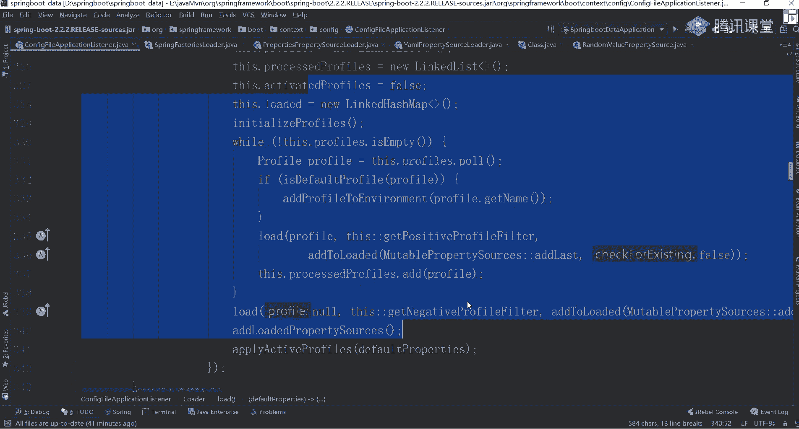

给你完成一个整体的加载工作，所以到你这儿完成之后，拿走拿走拿走，是不是完成了。

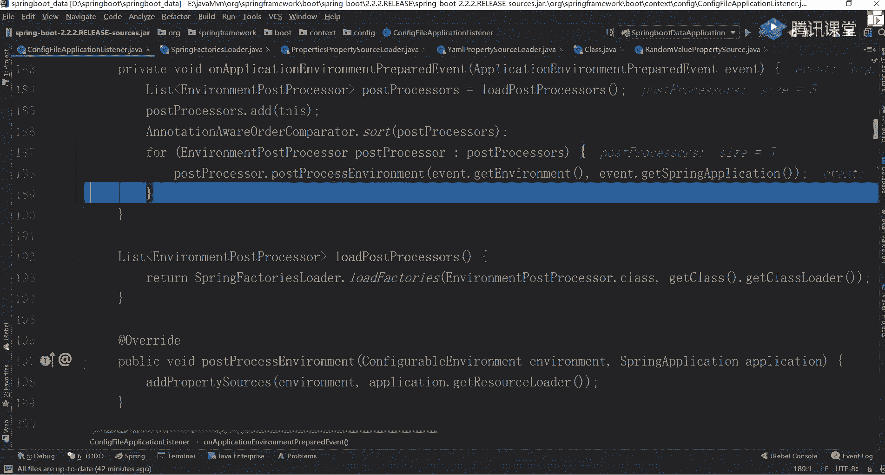

完成了之后，你往上翻看我们的这个话，找一下我们的vironment，点一下我们的source source，点它多一个没，是不是多了个什么东西叫application。

第二差我压ma你这配的是properties的话，你这就变成properties了，如果你这样配的是ym 2的话，就变成ym了，能够把我们当前这个文件是不是都取过来。

所以又看到了你当前这些属性值加载的时候，一共是从这七个地方进行加载的，就是开始你整体这个加载的过程看了吗，来到这儿能听完同学扣个一，能不能听懂，他是不是已经懵了，你会看到这个环境一个环境好吧。

这里面的东西都会把你给读过来，这一启动要把那两个文件中的所有人都实例化吗，需要用的实例化，不需要用的不实例化，需要用实例化，不需要用呃，不需用就不实例化了，这啥意思，就是刚刚给大家看那东西啊。

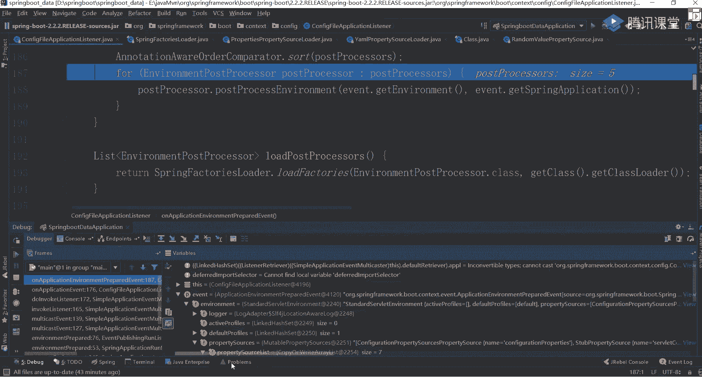

这里面是不是有很多类，它是以kv的形式存在的，而每次在取k v的时候就get什么，get ft是这样的方式来读取的，你读取过来之后，读取过来之后，我会进行一个有实例化，就实例化，没实例化我就不实例化了。

代码怎么写，那你需要哪个用哪个，到目前为止我们看看哪些。

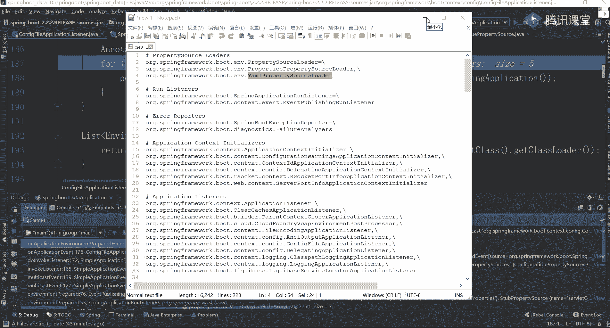

第一个他是加载过了，第二个他是加载过了好吧，第三个这块会一会就看到它加载了，第四个初始化载过了吧，listen是载过了好加载过了，还有这个暂时没用了，一会会用到它。

再来看还有什么东西也会用到in internet，用过了，用过了，listener，这个还没用到，一会一会用到了，一会用到它了好吧，再来看这个也没用到，这这是那个自动导入是会用的，下面都是自动导入。

会用的，会用到的东西，也就是说你需要的时候会停下来，基本上所有对象都会给你加进来是吧，基本上都是这样的，会有多个配置文健康，你如果配置文件也没关系，我说了。

卡拉斯帕斯路径下面的所有spring final文件都读过来，那这个地方其实就是两个配置文件里面的东西，就是两这价格不是不是一个，我只不过把两个合到一块儿，合合合到一起了，我们这儿可以看一下吧。

给你看一下啊，第一个spring boot里面的一个东西，你点开之后，你发现最后用的到哪，到failure the letter reporter吧，点一下the reporter reporter。

去了这就结束了，从下面的开始都属于第二个配置文件的啊，都属于配第二配置文件的，不管你有多少配件，它都会进行加载的啊，在刚开始的时候就进加载，而且会把它放到我们的缓存里面，你把上节课那个视频听一下。

就知道我上节课讲过的东西啊，都是聊过这东西了，好吧，这关了啊，不管他了，不看他了。

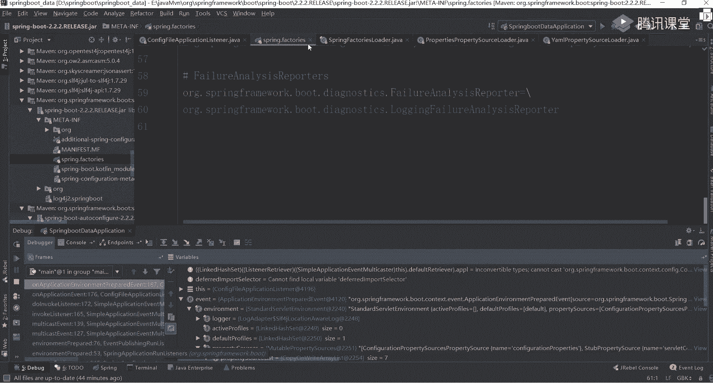

大家看到了，刚刚我已经把我们对应的一个配置都加进来了，加加之后这个循环还没完还没完，还要往下走，让他走一下走，这个是不是又看一个post processor了。

这叫啥叫debug agent environment，什么东西，是这玩意儿，这玩意儿干嘛的呀，我想走试一下吧，这debug里面要用到用到一个东西啊，走一下，走开他就跳，判断是不是什么都没做。

就什么都没做，直接跳过去了，拿走走还有吗，这是我们一共找了五个对应的一个pose processor，但这五个里面其实最重要的是谁。

是configure fail obligation listener啊，是这里面的一些呃processor，一些相关相关相关相关的一些处理，其他东西几乎都没用对吧，这做完之后往回返好，往后翻。

翻到这儿之后，说到这哪去了，往下走走走，走，走到这了吧，是不是又该电离我们的listener了，还记得刚刚提了吧，不是有七个，是不是七个来着走，再拿走，第二个叫什么叫a n s。

i output application，是什么东西，这东西啊，我不管你不管这边看了没啥用，就设置a n s i的一个输出，知道什么叫in si吗，知道吧，你应该知道吧。

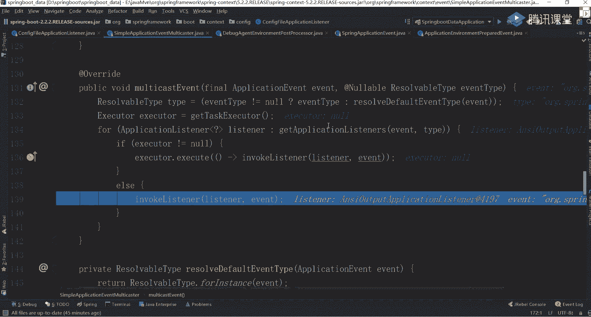

什么时候知道，还给我举个例子，不知道啊，来我来看你点开它a t s文件，你选文件另存为，在上面你选一个东西叫n s，看到了吗，就是编码格式，就编码格式而已，看这块了吗，没是不是选ut。

ut的ut和八是不是可以是ns格式。

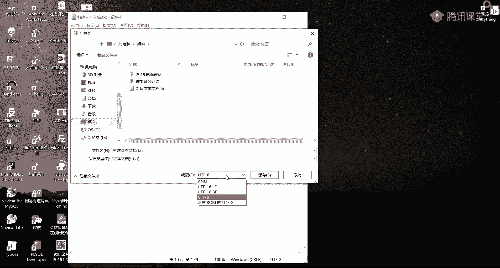

这块不用管它好吧，呃对我们的影响也不是特别大啊，就这样一个东西好了，那这块不往里面看了，再往上走，第三个叫login application是什么东西，这个logation这个东西见过吗。

之前我是完成了一个初始化日志系统的功能，这块也是一样的啊，也是一样的，走了上哪走，第三个叫卡拉斯pass log，什么东西，点一下吧，有点儿不舒服啊，点一下走，能有做什么事了吗，没做吧，这什么都没做。

来没做完过，烦烦烦烦，放这儿再下走，第五个叫bground，什么什么东西，这个bground什么做什么事了吗，走点进去，走走看，那是不是全部全部都没有对吧，是什么什么事都没做没做，我再往下走。

叫pk是什么东西，这边也一样，往下走玩，别人试试吧好吧，反正几乎大部分东西啊，这时候做了一个获取到一个类似的一个对象，获取完之后做一个return，这不直接return了，如果这等于空接着能回去。

所以相当于跟什么事也没做，一样都一样好吧，咱俩走，第四个叫fencoding，这不用说了吧，这也是一样，指定我们对应的一个什么文件编码格式吧，这不看了啊，下面走还有吗，没了，刚刚大家想一下。

我是不是把完成的七个具体的一个呃listen的一个操作做完了，做完之后，王一凡王一凡，王一凡，王一凡，王一凡，这波是刚看到这波下面是不是还有呢，是不是还有，但这波你要知道了，上面其实干嘛。

就是创建了一个最基本的环境，然后呢往环境里面多加了一些配置参数，仅此而已，这东西就没有了好吧，所以大家想一想，我们花一小时时间就讲这么点东西多吗，不多吧，我只能听明白，同学扣个一，1。5，多也要看。

多也要看，你不用想了，我现在带着你看，我不带你看，你往那边走的时候走多少，走多深都很麻烦，都很麻烦，看懂了，你现在能听多少，能听多少，能进记多少记多少，自己下课之后多迪拜了，东方里面点点试试，多看看。

你知道哦，原来这么回事哦，原来这么简单，你会有这种感受的，现在没这样感受，原因是啥，是因为你们之前没自己看过自主思维，或者说我应该看到哪个层次就结束了，也没有这样的感知，像我之前第一次看的时候也一样。

我我我我怎么看，有先把整体的东西能看懂的，就先看过去，看不懂方法不管了，不往里边，不往里面深究，因为你的方法如果一层一层一直往里边点的话，点完之后就封了，完之后就分了，好吧，看到这里了。

下午就听得听得懂点好，能听懂就好啊，不知道在干嘛，这环境啊，准备我们的环境啊，想一下你现在如果想赢取你的jdk，想赢取你的jdk，jdk的话，需不需要一个环境。

那同样的你要想运行你的spring bot的一个应用程序，它不需要一个环境吗，就是在这个环境里面，我需要做哪些对应的一个准备工作，仅此而已，ok，把刚刚讲的东西啊先换一下，我们休息十分钟。

十分钟回来之后，我们再接着讲好吧，放三脑子，抽根烟，上个厕所，喝杯咖啡好吧，放松一下，ok，雷声大，想一件事让开他是好事，你看懂了，别人没看懂，你面试是不是沾光了，随便的人都能看懂的话。

你面试的时候没有什么优势啊，对不对，构图呃，这东西啊跟我们的spark不太一样吧，不太一样，像spark的时候，我们之前画过很多的一些图，给大家画点东西，因为它里面有一些，比如说组建statement。

excel这些对象里面干什么事都是一层一层嵌套的，我在这儿debug。

看的时候，我往里面找的时候，我自己都找不到，有时候都找不到他，因为他这个对象的一个嵌套过程太太太复杂，太麻烦了，等我们把整个启动过程完了之后，给你们画图画画整体图行吧，我这个这个笔记你们看了吗。

这个东西你们看了吗，有有人看这东西吗，没人看啊，我在这个笔记写的时候，我把我能写的东西我基本都给你们写进去了，只不过有些方法，有些方法之后没有点那么深，都往里面粘的话太麻烦了，然后我其实刚开始的时候。

我设想的是我要自己编一个呃，2021个源码给大家看一下。

其实我也编辑好了，但是不能用就很麻烦，看一下，我之前真的想在那个原画里面自己来做这件事情的，你看一下吧，笔记跟那个注释啊都是分离的，我原来是想往这里面写的，原来写的时候我其实写了一部分。

但写完之后发现跳不过去给大家看一下。

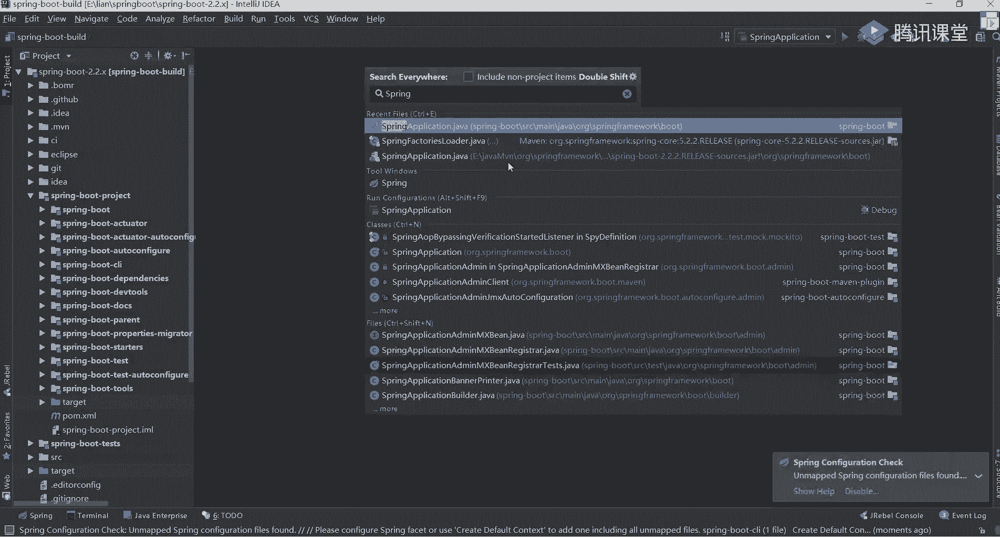

这里面我写一些东西，我写东西写完之后，我发现我点的时候，呃不对，不是找找一个东西啊，找一个还是这个类啊，跳一个类啊啊这玩儿吧，看这个地方一点，但之后这里面他跳的还是maven里面的东西。

还是没法在面直接直接直接改，而且这里面还有还有一些错误的东西，反正就我上网搜些帖子，他们都说这个2。2里面有一些bug，他跑不起来还能跑起来，但高本跑不起来，所以我就没往里面写写写写注释，其实跑不起来。

2。2确实跑不起来，地板本身能跑起来，2。2确实跑不起来，我试了好久，真跑不起来，没办法，我只能帮你们写笔记，帮你写笔记嗯。

我觉得那我的笔记写的还是足够全的，足够多了，下来之后自己看啊，慢慢看，我看得多了，自然而然就知道啥意思，就知道啥啥问题应该怎么看了啊，面试的时候怎么都源码都问哪些东西，一般的就是启动过程。

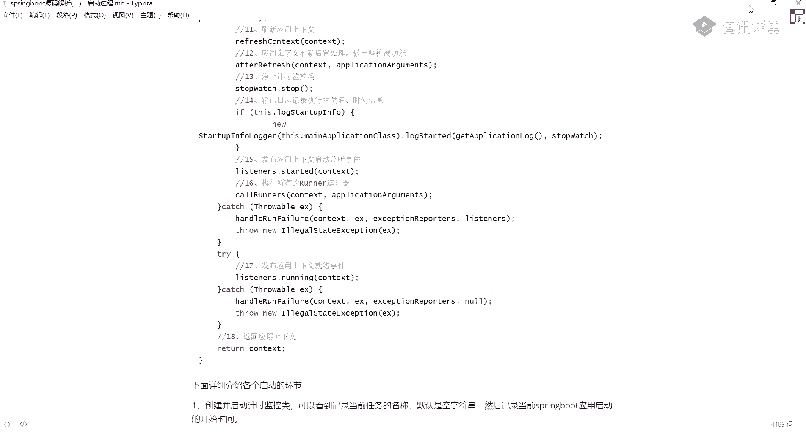

如果再问的话，就是我们的starter下面的相关的东西了，所以我这次原来我本来打算讲讲讲比较深，后来想算了吧，我们讲一下这个启动过程，讲一下那个自动装备的一些原理。

然后再讲一下呃什么还有还有那个dk就完事了啊，不跟你们讲太深了，后面如果还需要的话，我们把二期里面加，二期往里面加以后，课程里面往里面加东西，更新东西不讲太深了，我感觉你们听着也好难受，是吧。

不难受就好，讲一步流程，你把每一个环节能把它给捋清楚，就行了好吧，把一些关键步骤就行了，没让你都记啊，都记得干嘛没意义啊，还是一句话，你看完这个源码之后，你自己捋一个流程线出来，每一步做什么事儿啊。

面试的时候如果问到这些点了，你能把它给说出来就够了就够了，千万千万不要像我跟周老师这样开眼玩，跟周像我跟周老师这样开源码的话，看完之后你就疯了啊，讲完这个启动过程之后，我会画，我会画的，我会说的。

我会说的，拿拿杯水，拿杯水回来，我们接着讲啊，好在同学扣波一，我们见马奖，你看源码的时候千万注意一件事，不要想着把所有东西都搞明白，结果刚你说的那个一样，然后转化下类型，我到现在都没想明白。

但是在不影响我们整体大局上面的一个查看，懂我意思吧，这是一样的啊，再往下走吧，往下看呃，刚刚我们看到这个准备环境，这个监听器里面做哪些事情，这个很明显翻译过来干嘛呢。

往我们的spring application里面绑定我们对应的一个engram的这样一个对象吧，是不是意思，这个时候在外面看的时候，你会发现一件就是比较神奇的事情，看看点类似，这里面有一个东西。

荧光粉是不是等于空对吧，当他执行完这个代码之后，你可以往外面看一下，我看完之后我也没搞明，特别想干啥，来了走走一点都不难，做完之后你发现了它虽然名字叫这样的名字，但是它实际上这个值还是空的吧，我又懵了。

我当时也不知道他为什么要做这样一件事儿，我到现在我也没想明白，对对吧，所以这块想不明白，我们先放一放，先不管它，反正不会影响我们后面的一个整体思路的这块可以先往后整理边。

所以你也别指望说老师把源码全部都看明白，不太不太可能，反正我是做不到，那那那一点你毕竟不是作者，你不知道怎么想的，你只能说根据他写的代码，你去大概去猜，但有些东西能验证出来，有些都验证不出来。

不知道干嘛的，懂我意思对吧，好这样大家要注意了好了，我们接着来看吧，刚刚那个绑定的过程，因为绑定逻辑也非常简单，但是我发现的绑定成功，不知道为什么把原版根据看了，看完之后也没得到一个结论。

这不管它了好吧，再来看第三个是什么东西，做一个基本判断，说its customer environment做了一个基本判断，这个值默认值是false false，你可以点击看一下这个这是force吧。

刚开始就是false false，完了之后这样做一个判断，感叹号是不是取反，就是true了，进去之后再做一个执行，执行之后这个过程也非常简单，干什么事儿叫new一个warm的converter。

是不是做了一个类型，一个转换器，转换完了，这里面有一个方法，这个方法也比较重要，什么叫deduce environment class，也没有见过，后面有没有一种似曾相识的感觉，有吗，来给你看一下啊。

不管他走给这get的，不用管他走，converter，也不管他到哪去了，是不是该第六次就放完了，在这方法里面好也非常一样，是判断一下我们当前这个应用程序的一个类型perate吧，它返回了具体的一个值。

跟我们之前一样，还是service environment，所以判断判断完之后就是这样一个对象创建，是给大家做一个转换，如果必要的话，把它进行一个转换，转换完成之后就行了，好这是我们的对象啊。

这里面做事情就一样，就是说他会判断一下你当前这个环境是什么环境，如果不符合规则的话，会再做一下这个这个事情啊，转成我们的stard is sweb的这样一个环境，做完之后，这是该该到这了，这干嘛的。

是不是还是还是刚刚上放，上面的话一模一样，它里面执行的具体逻辑也是一模一样的，没有任何的一个变化，所以这块你挨个看一下就行了，只是说在转换环境的时候，top里面再做一次验证。

如果里面没有我们对应那个composition properties的话，会往里面再加一次，如果有的话，就不做这个事情了，这事情了，然后最终会把我们这个environment进行一个返回操作。

所以相当于我们这个环境已经准备好了，你准备好了，就这个环境准备其他发现环境里面我们噼里啪啦说了这么多东西，其实最最最最核心的还是啥，我们的配置文件要做一些事情，如何读取配置文件。

如果将来我们的配置文件这些东西啊，记住就行了好吧，制作环境这块环境完了之后再往下看，下面一行叫config，一个not being inform啊，这行代码这样代码也非常非常简单好吧，它其实一点都不难。

其实你如果名字也能够把它给猜出来，它到底完成了一具体的验什么样的一个事情啊，什么样的事情，其实说白了干嘛的啊，干嘛呢，就是说这里面设置了一个系统的一个属性值，用来忽略我们某些的一些病啊，你点进去。

你能发现这样一个值啊，点一下嗯，然后点fc到了之后看到这个什么属性叫spring。being for，点一nore，就是我忽略哪些对应的一个属性值，这会做一个最基本的判断，如果等于空的话，往下走。

是不是这样，后续的这样一个布尔类型值，把这个布尔类型值放哪儿，是不是system。set properties里面，所以这块看完之后，当他把把整体的逻辑执行完了，你在我们当前这个属性里面。

你能看到这样一个值，environment，笑死，找到我们的system enarment system哪去了，找一个source，找一下我们刚刚设置的那个值啊，叫什么，叫spring点也没在这里面。

spring一个闹什么东西，有啊在这是不是叫spring。being for you know，就把当前这个属性给加进来啊，别的东西没做了，所以说只是说我可以读取这样的一个属性值。

来后面做这个并判断的时候做一个这样一个判断啊，是否可以忽略某些病，就这块东西，所以这行代码其实无所谓，其实无所谓，好吧，就是一个系统属性的一个判断值，再来看下面该干嘛了。

叫banner print banner等于print banner什么东西，这是干嘛的，很明显的，大家知道就是用来读取我们对应在哪儿，当我的代码执行到现在之后，你会发现控制台现在几乎什么都没打印。

什么都没打一会儿我们是可以打印一下我们那个spring那个样那个图标了，那个样式的就在这里面进行完成的，所以这里面我们也可以想起来查看一下啊，其实这块儿看不看问题不大，看看问题不大，就好好看看吧。

我们带你带你去过一下，这里面东西比较简单了，点进去你要说prince banner，然后在print banner里面好，你可以做一个判断，说banner model等于啥。

banner model是我们之前进行一个设置的，就是说你创建完spring这个对象之后，我说你们还没有印象，我们这来试试吧，之前我给你们写过这样的东西，就不要创建对象之后。

比如说你一个spring app，set da model，这边有个model，然后model，啧是不是有of有console log，有一种一一堆的值，这是做一个进行判断，所以刚刚第一步骤的时候。

就是用来把这个参数值做了一个小的判断而已，好也没啥啊，你没事的话，默认是什么，默认是不是我们csol的这里面等于他们不等于好，不等于，所以直接就可以划过去了。

那第二步叫做resource loader是什么东西，是不是还是用来加载我们当前这个resource的一个资源，但这只是空的vl。

看这现在是不是有了new了一个什么叫default resource loader吧，还是一样创建这样一个默认资源的加载器里面就是一个对象啊，什么没有，什么都没有，不管它了。

战斗完之后一样的到dj一波了，这波有意思，什么呢，叫spring application banner print，是不是也是构造了这样一个对象，对象里面非常简单，叫gf jpg png这一首首。

我们之前在放我们对应图片的时候，可不是不可以，是我们这样的一个格式好，先往下走，刷完之后再判断下这个模式是啥啊，往下走到这步了，叫banner print，是不是刚创建好对象对象。

什么叫print prince environment in class是什么东西，然后set out进行一个输出，这给你看一下，叫bba等于get banner，是不是还是获取到我们当前这样一个值。

注意了，现在在我们的控台里面依然什么输出都没有，只是为了获取我们班长这样的对象，点进去是一个banner，用完之后判断一下这个get in mage banner是否能读取到我们当前这个图片。

走这个属性是这个图片吗，是不是叫spring banner的，emage叫location，你是不是给这个属性直接属性之后，可以把我们对应的一个图片移动到不同的一个位置，但现在留给人的是什么空的空的。

完了之后往下走，这么判断了吧，再来看这一步干嘛的，叫spring e s t，叫以mage extension是干嘛的啊，是不是还是我们的扩后缀名吧，有gbgm，jpg和png这三种文件格式，慢慢走。

让我来获取这一类词的，没有一类是没有，应该是没有，这边的话是不是都反应反空，也说我们现在并没有自定义我们对应的一个半点图片，来来走，叫test版的，是不是获取一下我们图片没有了，那ok文本就可以了吧。

点进去也一样的，但是是不是这个值叫spring banner，点location一样的一模一样东西，再点它叫default blocation，是不是叫banner。t s t想替换ban的话。

呃之前讲过的东西吧，是放到我们的results作业目录下面就可以了，它会进行直接的一个读取，那读完之后这是什么，是不是也应该是我们具体的一个btc文件，读完之后。

然后呢resource等于get resource是把这个文件给你读进来看一下吧，走走location start with，然后呢往下走，这是微信告诉你他在哪儿好吧，然后读取我们当前这样的一个文件。

把它给读起来，好读起来，做一个ist mel，是不是还是因为现在也没指定了，所以直接返回空了，翻完之后往下走走，都是逻辑盘的，都返回不了，所以还是我们的默认单点，默认搬完之后，到这儿的时候。

开始进行整体的一个打印工作，打印工作怎么打印，注意啊，你看起来是一个图像，但是我希望你注意，实际上它本身看起来就是一个字符串，明白了吗，来看效果，点进去，点完之后是不是有个在哪儿点进去，你看这东西了吗。

啥，字符串吧，字符串啊，是不是后面是不是也都是字符串，是不是全部串，你现在看起来好像是乱的，但是你把它的格式排列好之后，它就是一个正常的一个半点一个图片，所以此时干嘛了。

该循环我们当前这样一个在哪好循环一下，再往外面走走，第一行空了吧，第二行看第一行吧，再循环是不是出来这一部分了，再循环再循环再循环，看这发信息了吗，我是不是经过n次的一个循环之后。

我就把这个图片给打印出来了，是不是打印出来了，说了啊，他本身就是字符串嘛，你看见之后就打印出来了，其实并不难，也没啥难，就打印这样的东西，打印完之后反应回来。

这样获取一个姊妹book的一个version，告诉你这version多少点，release version等于它如果不等于空的话，做一个转换，为什么东西做一个格式格式化转换，转换完成之后。

又一让他往里面进行循环，添加这个空格加空格，最好看那是冒号three bot冒号，然后后面加一个这样的空格，空完之后是括号v2。2。2的意思，翻盘输出吧，输完之后回车快走，是不是返回了。

此时这个反应的是他打印出来了是吧，定义的肯定可以啊，自定义的你可以放一个图片嘛，对不对，是不是也可以放一个天启文档，之前我在第一节课的时候讲自boss的时候，是不是就放了一个半点t s d。

作者为什么给一个班长设置都设置这么多逻辑扩展性，扩展性，你发现了，刚刚里面虽然看起来好像很复杂的样子，但其实都在干嘛读，有没有图片的配置好不好，有没有你自定化的一个配置对吧，如果都没有的话。

我只能用默认配置了，默认配置就是字符串，没别的了，扩展性好一点，就是你自己可以定制自己画自己的一些东西，仅此而已，没啥难的啊，听一下墙也不是特别关键，行吧啊，这个不是bt男同学来扣个一，比较简单吧。

彩蛋没啥彩蛋啊，就非常low的一种实验方式而已，好一点就是他考虑到各种各样的情况，你可以往里面放图片，也可以往里面放一个传统文档啊，放什么都行，所以这东西你往这边点点试试，你会发现它并不难。

得看野马都不露脸，都很好，你看完之后，你觉得实现没没没没没没没多大那个那个意义好吧，搞个小电影儿想多了吧，这样搞完之后，这样搞完之后感悟说放什么图片都可以吗。

放图片必须是什么jb j j f p n g吧，他一那你知道这是干啥啊，干啥没意义好吧对，跟面试官想搬，那将来能干啥，没人用，没啥用，没啥用处啊，对了，我往下看，这块下面东西比重要了好吧。

这个东西是我们今天要讲的一个最核心的一个点，最核心的一个点就是我们的application contest，刚刚准备的是什么叫environment，对不对，是环境，环境完了之后还要干嘛。

还是它应该有一个上下文的一个对象，之前我们上面其实见过了，有个叫convictable application contest，是不是这样一个类，但这类是空的这个值。

而现在相当于干嘛给这个空的值附上我们具体的一个对象，给他一个给给给他一个对象，对对象怎么做的，叫可以的，obcompass，手往后站，这步骤很关键，很核心很核心，然后来看过干了一件什么事情。

这里面它也有各种各样不同的类型，所以点的时候给你看一下这是干嘛的，你看这东西之后是不是有点似曾相识的感觉，我在讲那个spring application这个构造方法的时候，我说了。

永远不要小看这个应用程序的类型，因为后面在很多地方是不是都用到我们的应用程序类型，第一个我们的对象创建的时候是不是判根据类型来判断的，第二个你的contest也是根据文应用程序类型来判断的。

就这个值一定要注意了，好吧，聊聊第一个会制造值应该是空的，因为我们没做过赋值嘛，空的话没关系，这有一个switch的一个判断判断了，如果是的话，匹配到第一个，第一个值好像是某一个类。

哪个类叫annotation confide呃，config server类的web server，application contest名字非常长，所长，为什么零之一嘛是吧，名字写的非常长。

大家知道它读取的是这样一个类，然后他通过什么，通过我们对应的一个class for name干嘛的，是不是把它变一个大写的a class的对象，但对象完了之后，最后面还有一个是什么步骤来走一下，大家好。

是不是叫b有tos。iso什么class吧，是进行一个初始化的一个呃，不是进行实例化的一个工作，刚刚只是一个卡组对象，现在要完成一个对象创建了，把整理下这过程，所以你往这边点的话，这个不点了。

点完之后就是一个实例化工作，这有一个什么来着，找下一个注解的一些东西，看着return一个昵称class class，加什么东西会叫做造器，然后往里边点的话，一定有一个什么叫拉啊，拿去吧。

呃就反正就是通过反射来进行一个正常的，接下来自己看吧，找不到了，反正就是通过反射来，你看到了是吧，有有有意思吗，啊啊，这是不是这个一次分子是不是这就进行一个是对象创建了啊，就这样过啊，所以这块都不难。

也没必要往里面看看，很深的东西，知道就行了，那直接完之后往回返回，此时看了吗，对象有了，但是你打开当前这个对象之后，你会发现打开我们的这个当前contest里面哪去了，这里面空了吧，是不是做空的。

有些对象有些对象好吧，那大部分值是不是都是空的，是做空的一些值之后，是不是该往我们这个context上下文对象里面放一堆东西了，是放一堆东西，所以放东西这就会成为我们的一个重点，当然除此之外。

这中间夹了一个步骤，叫什么叫exception reporter，这个reporter还记得吗，原来是因为这块不难。

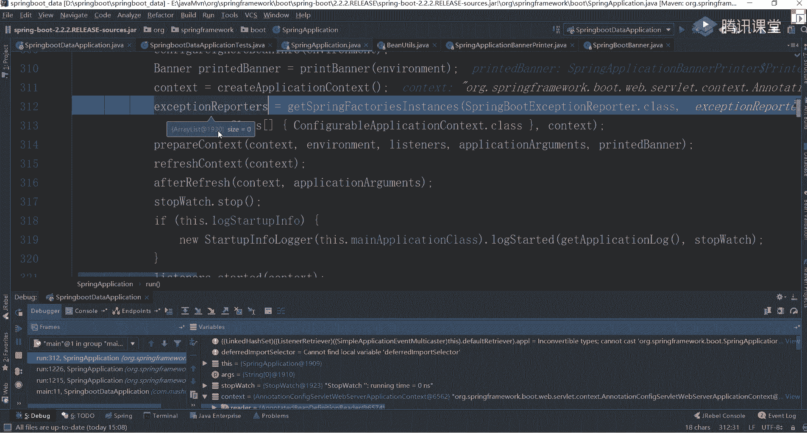

就创建对象了，就有个对象不能看这个地方，我们之前不也穿过这对象了，干嘛的，是在启动过程中如果报异常了，这会有一个异常的一个缩进器，同样的你看完代码之后。

就get spring fetory instance，一看到这个方法很明显干嘛的，是不是还是我们的spring fast文件里面来进行数据的读取。

这类spring boat exception reporter往上翻，spring boeing reporter吧，好吧，说这个东西后面还有吗，是不是意味着我就读到了当前这样的一个类。

并且把它进行实例化，哪一类叫failure and letter，就这样对象啊这样的一个对象。

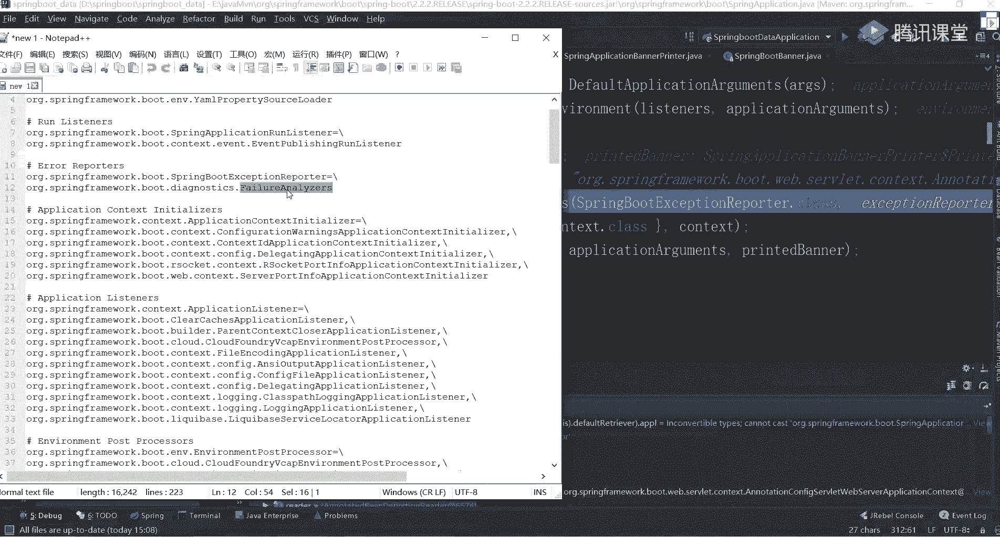

所以你读完之后，我们可以看一下这个集合里面的一个值，不往里面看了，打开我们的reorder，failure la，这个对象是不是就有他给他，这就够了啊，之后其中一条报错的时候，这里面都会给它放进去。

都会放进去啊，别忘啥了呀，暂时这块还没用到，还没用到这些东西不往后面看吧，这是抛一场六，这会这才会有不抛异常的话，这没用，这没用啊，来再往下看该干嘛了，我说了。

刚刚只是创建到我们的创test这样一个对象，但对象里面很多属性值还没付呢，所以这段时间最主要的就是往里面进行一些最基本的赋值操作啊，复制操作。

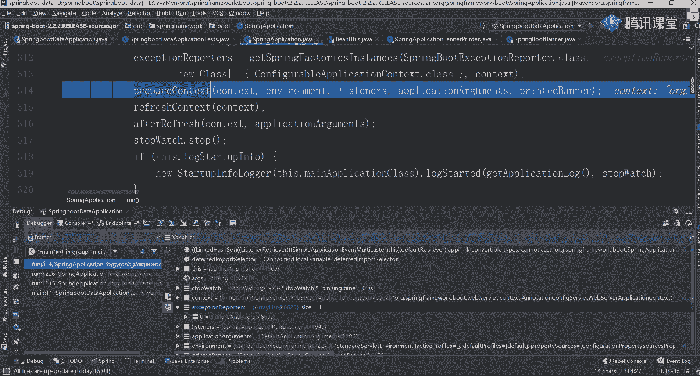

这副装作可能看起来稍微有一点点麻烦，有点麻烦啊，但是呃怎么说呢。

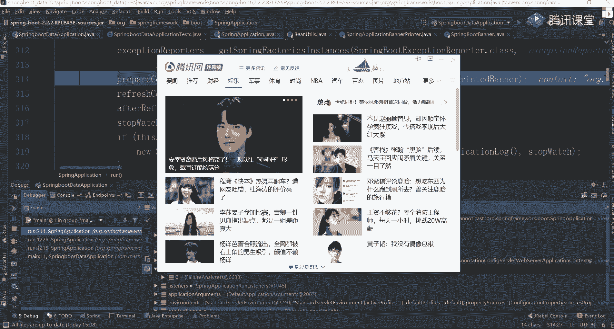

看多了就知道咋回事了，这东西啊也不是特别难，但是在讲这个操作之前，我希望大家先看一些东西，什么东西呢，就是这些类它们之间的关系，我们都知道，你如果就是之前详细聊，结果spring源码的话。

其实你看spring boot会比较容易一点，如果你这目前是什么源码，一点都没看过的话，你看这个课程确实比较麻烦，它里面其实很多地方都用到了我们spring一些东西啊，这是肯定的懂我意思吧好吧。

所以这样大家一定要一定一定要注意了，一定要注意了，然后呢往上看contest吧，好吧，点进去这类里面还记得刚刚16号，16号那个类是哪个哪个类。

啊就是我给大家点一下看看annotation config，我们先把它打开吧，财神诶没有吗，tt不可能没有吧，是不是这一类好吧，你一定记住我们当时剩下的环境就是这样一类，它里面是有多方法好多个方法啊。

各方这块儿我们先你先停到这儿，先停到这块儿，先停到这块，这块看完之后，这块看完之后，这里面两对象很重要，一个是render，一个是scout，之后我们都会用两个对象，好象就是说你现在要往里面放东西了。

放对象的时候，首先要创建好战略对象，对不对，这东西大家应该没有疑问的，但没疑问之后，我希望大家你可以打开当前这个类，看一下这个类的一个类图啊，或者它这个继承关系的一个图，这个图很重要。

我为什么上课的时候带你们看这个东西，因为你发现你后面在找某些属性值的时候。

你找不到，其实是在是在父类里面，它帮你完成了整体的一个赋值，或者说初始化的一个工作，初始化工作，所以这玩意看起来可能会稍微有那么一丢丢的一个难受，难受也要接着看，你要接着看，大家看这里面类比较多。

你要把每一个类都看完之后，你就疯了，但有一些类你们应该知道的，比如说这东西叫冰山水，知道吧，对不对，是最中间一类，但你看什么，看绿色这个是看蓝色这个线，看蓝色这个线好，开始我们看是什么。

最底下的东西上面有什么呢，叫server web，server application contest，还有个叫，然后呢，web application contest。

那真的是obliation contest，abstract obligation test，它是不是有这样默认的一层继承关系了，我希望大家注意一件事儿，什么事儿呢。

呃spring时候你们是不是看过这个东西，你看过的东西吗，看过来扣一，没看过来扣二，哼看过就好了啊，看一定要去看啊，没改，你看一定要去看，那这块我就简单来说一下，简单说一下做什么事情，做什么事情。

你看到蓝色这条线了，蓝色这条线表示它整体的一个继承路线的关系，这些对你不要觉得无所谓，你看起来好像我只出了这样一个对象就完事了，不对，你也父子之间的一个继承关系，因为在这些继承关系里面。

它依然有很多非常重要的属性会帮你进行加载，比如第一个叫resource loader，这里面干嘛呢干嘛呢，是不是为了获取我们默认的一个类加载的一个器对吧，获取一下上下文类加载器。

这第一个方法要怎么上这个事情，第二个叫什么呢，叫abstract object contest，名称范，这叫什么，叫抽象的一个应用上下文，这是我们翻一个东西吧，但其实但其实你注意了，这里面用很多东西。

或或者说有很多东西，比如说有个叫resource，pattern reserver，有人知道吗，给大家敲一下呃，resource，然后呢reserver，这东西有人知道吗。

模式一个解析器是资源模式解析器啊，没听过算了，没听过就先留个印象好吧，就这里面它会完成很多事情，还有很多事情就说为什么你在配置加载一些配置文件的时候，是通过什么呢，叫class pass。

通过阿斯pass这个路径写完之后，冒号后面可以直接跟我们的文件名称，他也能读取到，原先在这个地方它会完成很多这方面的一些工作，把这连完成的好吧，而且在这个通用的上下文对象里面，把这个类里面除此之外。

什么东西我们可以来看一下这个呃，咋说呢，看看这一类吧，这么多，详细看一下。

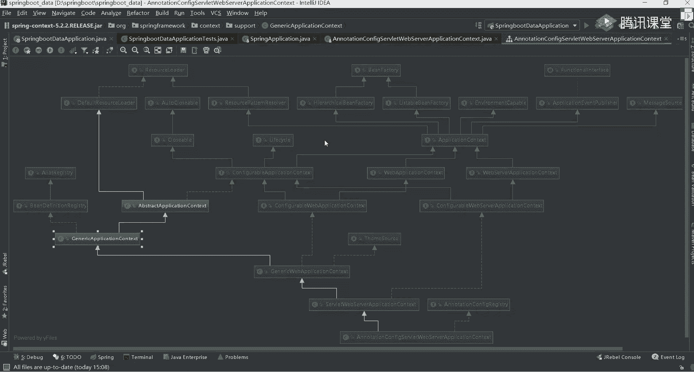

我们找一下这个继承关系啊，s，这里面有一个非常非常重要的一个对象，好吧，叫being f，叫default，并单这东西，default lizable ban factory之后。

我们在很多地方都会看到这样的一个属性值，这样属性值大家看到了，这是创建的对象，是不是在我们父类的构造方法里面定义好吧，不是啊，是在缝里面做好的，所以你点开这个对象，你看一下当前对象。

这个类图也一样的，看例图流程里面也依然表明了一个继承的一个关系，这继承关系啊，这其实在你们应该会接触到的第一个default是最底层的。

上面有什么叫abstract auto where comparable being factory，abstract being factory，factory being reject，然后呢。

default singleton being registry，然后rest register，是不是看到很多这样的人类的关系，它里面有一个集中关系。

你在new的时候依然会一层一层一层一层往里面进行创建，其实这些类的名称我们大概能做一个最基本的一个猜测，是不是第一叫simple alex，什么东西是啥简单别名儿吧。

你想想你做错弊的时候有没有写写别名儿，可以吧，这边注册边边边注射器对吧，那大家看这是什么东西，叫singleton being reject reject，什么叫单例bean的一个注册器吧，是不是意思。

下面来看还有什么叫factory being register，your support是工厂并注册了一个什么是注册一个的方法，提供这样的一个支持，对不对。

再来看abstract being factory，抽象工厂类就不用说了吧，为什么呢，呃abstract auto wear comparable being factory。

是不是抽象的有自动装配功能的一个兵工厂，是不是自动装配的一个功能了，是不是这块东西，再往下最后一个才是我们这个默认的一个最基本的实现对吧，所以刚刚就是为什么很多同学在看源码的时候看不懂。

其实更多的还是因为这个点就是你在new一个对象的时候，你看到源码里面也有很多对象，但是很少有人去说我一层一层往上看一下它里面到底办成什么事儿啊，把这些事情的脉络如果都捋的非常非常清楚了。

你再看这块的时候，其实就觉得哦原来这么回事啊，原来并没有那么难，如果你前新的一个基础建设没有的话，你后面看的时候肯定会越来越难，越来越麻烦啊，这点我希望大家能认能认认同把这块要注意，一定要注意了。

曲线实现蓝色线是什么意思，这类图里面表示去具体的一个继承关系了，大家看一下这个来自什么，是我们具体的一个class之间继承关系，好吧，这儿应该有一个徒弟来找我，我找一下啊，这没有是吧，就去图例啊。

就这块呢其实表示就是一个继承和实现的一个呃，就就就你看到啊，这是不是有c有i i表示是我们的接口啊，i表示我们接口，然后呢c表示我们的类类跟类之间的寄生关系，用蓝色来表示的。

把接口之间的实践大家看看是不是用绿色线表示的，就这样的关系哇，这这这没啥，这没啥，就啥好看的吗啊就是实现实现是类虚线，虚线是接口，接口都是虚线，就这东西啊，没看过这东西是吗，没下一周一定要详细看一下。

这块一定要看呃，所以啊大家发现了呃，如果你要看一些比较sploud这样源码的时候，最常看的时候，其实他们都是依托于spring的，还能把spring源码好好听一下，好好看一下，真的很重要。

这东西难或听不懂，我就不听了呃硬着头皮咬着牙一定要去看，因为你看完这东西之后，你再回来听的时候感觉容易一点，或者说最起码有那么点感觉，能印象有点印象，如果都没有的话，你就看起来很麻烦，实现是啥。

一个是表示继承，一个是表示是我们的一个实现接口的，要继承接口，接口是不能实现接口，能不能继承接口也可以吧，就这样的是继承的关系，它表示是实践的关系，就接口之间的一个继承，你接是不是可以用extends。

是不是也可以用那个imp，好了好了，这没关系啊，不知道说这个这个没必要看嗯，呃看一遍之后你知道你记住就行了，这没啥好吧，这个没啥可学的，懂我意思吧，下来思考的话什么的，spring啊，最好就看一下。

最好去看一下，一定要看啊，看完之后你你的感受是不一样的，整体的一个架构都是不一样的，懂我意思吧，好吧不看了再也不看了。

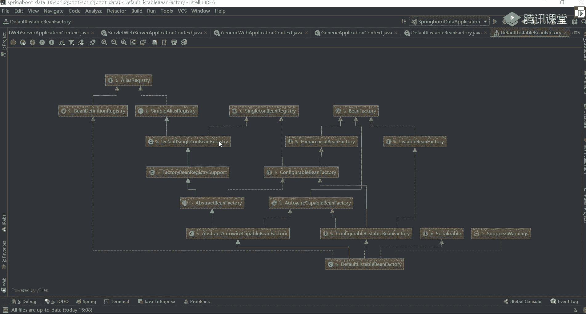

不看了不看了就有种过，再回反反啊啊看看这个这个类类类类出了是吧。

看到这块之后，看到这块之后，下面是什么呢，叫generate web application，然后呢那个application是不是到这块了，这块也是一样的，这是通用的，什么叫通用的应用程序。

上下文叫通用的web应用程序，上下文也是一样，提供了一个外方面的一个支持，贷方面的一个支持，仅此而已是吧，下面还有什么叫呃server web，server application contest吧。

这里面是啥叫server web应用程序的一个上下文啊，server程序上文仅此而已，那下面最下面是什么，是我们具体子类是annotation里面的一个东西啊。

tation里面的东西按类是我们自己是不是上下行的市场分对象啊，你知道这样提升关系，因为之后你会看到很多being reje并finantory这样的东西，你如果这块东西不了解的话，你听起来很懵。

这东西我也没他给你做一个就非常简短的一个解释，说我一句话把它说明白，说明白听吧，下去之后好好看一下，最好好好看一下是吧，呃看完之后你会有一个整体的感知的，很重要，行吧好了，别的东西废话我就不多说了。

不多说了，来回来再看看什么东西，还是看到我们刚刚的安装tation这个类啊，这类还是要看的。

来看这类这个类，刚刚我们是在完成一个是那个实例化，当实例化我是直接跳过去了，但其实你会发现在整个实例化的一个环节，它又两个对象，一个叫this。reader，一个叫this。scanner。

这块东西不懂没关系，你往下看，他说创建了一个新的这个东西，然后需要干嘛呢，叫popular through cause，and then呃，什么reflesh，这干嘛要被进行调用吊起。

并且呢需要被进行reflesh，是不是进行一个刷新操作，那这个this reader是干嘛的，好吧，上面看有没有解释啊，找一下没解释啊，为什么是不是读取scar，是不是进行一个扫描对吧，用于干嘛呢。

用于完成我们对于一些病的一些注册功能，病的一些注册功能，比如说我们之前在那个还是说你们经常用一些，比如说像卡罗德斯干啊，像component，然后呢像service对吧，还有那个呃respon一个东西。

你在进行并实例的时候，其实都是通过我们当前这个read对象来完成的啊，都通过对象来完成的，scanner其实它也比较简单好吧，它就是定义的一个扫描器，用来扫描我们这个地方。

它符合我们对应规则的一些并对象，因为你只有扫我们通过之后，才能把我们b注册到我们对应的一个上下文环境里面，此时在后面用的时候，你才能够完成对应的一个调取的功能，如果没有这样操作，你是掉不了的。

懂我意思吧，好吧就这样，大家要注意了o那我们再接着往下看呃，在对象里面创建的时候也非常简单，就是一个早点去一个操作吧，在操作里面我还是希望大家注意一个注意一个东西稍微注意一下啊，你稍微留个印象也行啊。

哪怕留个印象有这样的东西，他也没有留意过这干嘛的啊，这个东西吗，叫condition v6 条是干嘛的，这这这这东西干啥的，什么叫肯定是，条件我们后面再进行自动装配的时候。

自动装配的时候你会看到有很多的一个限制条件，比如说举一个例子，我们来看，别累啊，看了你就知道了点，我这没有是吧，应该有条件来着，叫小web，at肯定是看那有什么叫conditional。

然后呢呃十on web plication，conditional on class，然后呢conditional on missing becditional order，哦。

上面这四个是不是conneon on web pication，on class on miss bean，是不是这东西看错了啊啊好吧，然后呢on class on miss me。

这都是我们这些条件的一个判断，好你不明白没关系，不过没关系，到后面的时候会在呃那个自动装配的时候会讲，这个东西其实就是一个条件的一个判断啊，看错了也有点晕，刚翻过来。

里面会注册这样一个条件的一个判断一个器啊，这回大家写了。

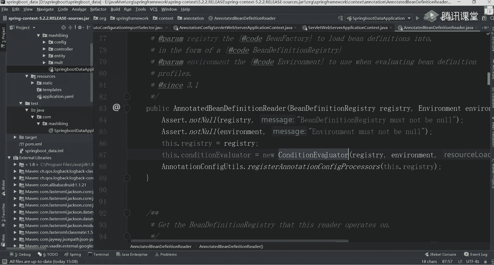

给大家找一下装配的运行原理吧，很多笔记啊，为了方便你们所理解，还没在这儿，他大概有这么多扩展一些属性，就是说我必须要满足什么样一个条件才能进行一个生效，就这块东西啊，这块的东西明白了吧。

这东西啊咱们后面聊，到时候再再讲，先不管他，你现在有这样一个印象，就是这里面会加一些条件判断的一个计算器啊。

有些东西呃我们能做很多的一些条件上的判断了，这时候是比较舒服的，你懂我意思了吧，啊这款稍微注意下就行了，稍微注意下就行了好了，这是我们就这样一个render，一个对象，又有render对象，回来回来。

除了这个润到这还有个什么，还有一个scanner吧，点下scanner，点进去点进去，你这个就是非常简单吧，做什么事儿叫呃呃先注册这个注册器。

做新完了之后叫reject before the filter，是获取我们默认的一些过滤器，来获取我们的环境，获取我们对你一个资源型的加载器，我说了，他完成一个什么，再说了吧。

是不是component repository service controler是不会检测这方面的一些注解，有了这些注解之后，我会把你扫描进来，如果没有这些注解的话，我就不给你扫描了啊，整体上来说。

这个上下文环境是非常非常重要的一个对象，好吧，这块儿先留一个印象，因为后面的时候我们大概会用到它，你先留印象，有了印象之后，我们后面会讲的时候，我们再详细说这东西行吧，好这东西啊。

我们这儿就不再浪费时间了，再浪费时间了啊，重点来我们再见吧，再再再再往下看，再看什么东西啊，刚刚只是我们当前这个上下文环境的一个准备，除了这个上下的话天之外，还有什么东西来着。

是不是还要往里边添加一些对应的一个参数了，那么会反到哪了，ok到这，好吧，还知道还知道我我在我我在说啥吧，map爆红跟这个有关吗，啊没关系，那爆红是因为你没有引入map的一个依赖。

有没有引入map的一个注解，引了注解之后就不会爆红了，刚才上面写了只有四个注解或者散文，那四个注解里面它是否会做一个并对象，把它给呃自动呃，那个什么角度外进来，凹凸外进来啊，好了。

这是我们这样一个contest的一个对象的一个解释，好好看看很重要，这步骤完成之后讲到这儿了，叫prepare contest是吧，这步骤这步骤很关键啊，很关键啊，这才是我们整体完成的一个核心。

来我们看一下完成到底它里面到底做了一件什么样的一个事情啊，什么事情呃，其实事情怎么说呢，难道并不难难并不难，关键是你要知道好吧，来走一下吧，第一个叫contest s vironment，干嘛的是吧。

那contest里面设置我们对应一个当当前对象，一个环境给您看一下，走突破点，set environment，是把环境对象给设进来，这是第一个，第二个叫z。render。set environment。

第二叫点scanner，scenvironment，是不是除了给我们当前这个对象做一个最基本的设置之外，还要往哪把我们reader属性里面设一个，把我们的skt属性里面再设一个，是不是要设很多东西对吧。

私信问问的，一定要把它给设计来，把这块很重要，因为后面会用到我们那个环境里面的一些属性值，一些自己具体操作，所以这往下走就行了，都往这边看了，a一啊，就是一个设设置一个属性看一下吧。

是不是就往里边外面的时候加进来就行了，用了几个新的对象就出来一个操作，不管他了之后，第三位叫什么呢，叫post post process obligation contest，就看这东西了吧。

这东西难吗，并不难好吧，一起来看一下往里边到底做了什么样的一个事情，走这儿先做一个叫big name generator的一个判断，是什么东西，名称的一个生成器，对不对，这个值刚开始是什么，因为你没。

所以刚开始的话一定是等于空的吧，第二个呢叫瑞等于空吗，等于空，往下走到第三步，this is的conversion service，这熟不熟，熟之前已经见过他了，是不是见过他了。

还是一样来用来添加我们很多这方面的转化了，它所对应的一些服务，这不往里面看了，之前我们带你们带带你们看过了，那走走走，做完之后完成了，关键是你要看一下这个这个方法好吧。

叫apply in the nether，这干嘛呢，叫用我们的初始化的一些呃初始化器，对不对，你想一下刚开始我们在创建对象的时候，我有没有往里面读取我们一些触发器，有吧，还记得有多少个吗，记不记得。

啊这个in factory里面对七个好吧，那记得很清楚啊，对就是七个，进行税务工作了，这个处理工作记录了非常非常关键，而且非常非常重要啊，同学同学一直在聊老师后面那个自动装备怎么聊，面试官同学怎么答。

其实就用到了这里面的某些点，某些点来看一下吧，我这点啊点进去连线之后，这是不是一共有七个拿走，我们看一下这个这个集合，能看集合吗，啊看不懂没关系啊，这get的英雄来点哦，我点点一下这方法试试啊。

走点进去，这这这这没有是吧，热点你是来的，看这是不是有七个七个，就我们从那个类文件里面直接带过来的这些呃，初始化器已经输入进来了，这边一共有七个，第一个叫什么叫培根认刚才的一生来着，之前做什么事。

不知道啊，不知道没关系，你可以接着往下看，中间一个class对象，然后呢也是一个application context letter class，这边往下走到这一步，这一步是最核心的啊。

最核心的看的是完成我们这样的一个初始化功能，走完了点一下试试啊，看一下第一个叫get environment，是涉及我们当前这个环境变量，往边走走，不等于空，看这儿大家懂是不是进不来进不来。

这里面不是相当于什么事都没做，只是获取了让我们当前一个对象，所以这个方法什么都没做来做，第二个叫shared meat date reader。

然后呢叫factory contest issulator，这个方法很重要很重要，这里面其他东西什么叫mac data，就是我们的原数据，这里面往里面放一个metadata。

catch metadata的一个post processor，一个类往下面看一下吧，还有一样你就在这里面点进去，就说到这吧，叫at bean factory post processor。

你有了一个什么就想叫catching，my data reer，factory post processor，很重要，好吧，你记住了，他是不是完全放这个类似于一个对象点样，可能构造方法什么没有。

还是一样，在父类里面，我们这不往里面看了，然后点完之后往下走走，诶，慢慢走，叫this being factory propost processor，加at是把刚才的方法给加进来，加完之后也一样。

这是一个对象添加集合，加完之后你可以看一下，找一下我们对这东西啊，我不是给你contest，很重要呃，找一下叫bin factory，叫post processor，找一下。

post processor，你成功，你怎么看到你，嗯，这是看到了，我先生，是这样吗，病人post processor，没有呢，我没看错吧，in fe，泡泡or这个没有了，应该应该有一个对象啊，拿走吧。

不管他了，contest，这有了吧，看这是不是经进来了，看错地方了，看错地方了，看错地方了，大家看这里面加了什么呢，是不是叫catch metadata，reer，factory。

post processor，之后要用它，我这强调一下，把这家店的对象别东西没做拿走，第三个叫contest，idea of lication，什么东西依然往里面走。

编译之后get contest的id啊，这个contest的id是什么东西，还记得吗，那个contest慢慢走，或者一个地址地址就是谁叫compass的id，然后呢in出来的是我们刚才进行那个初始化。

那个初始化器往输查器拿走，也是往里面进行设置，设置完了之后注册一个单例的一个对象啊，注册单对象做完之后就搞定了啊，这个东西不用管它，再来看第三个叫confi warning是什么东西，这一类也很重要。

往下走，走到这儿点进去，是不是又加了个对象，叫configuration warning，post post processor，是不是相当于另外东西也是往里面加另外一个对象。

将完之后返回再来看第三个叫r socket port，什么东西拿走，是加上一个新的listener啊，这是我们往里面需要添加的东西，大家注意了，他是往我们那个呃pos加吗，不是啊。

这是往哪儿往我们的application listener里面加啊，加对象不一样的啊，加地址不一样的，那走走，第四个叫server port infer，什么东西好吧，咱们走向下走，啥东西判断不等于空。

and listener是把这listener给加进来好吧，把这listen listener站起来，加完之后就搞定了，叫the report in for。

然后呢a contest in the letter，再站起来，加完之后再往上翻翻吧，还有吧叫是呢，是不是也是条件的一个最基本判断，一次也是一样，每次都掉一个初始化方法，然后完了之后。

我们对应的一些初始化功能，是不是也是往这里面注册一个类似的东西之后啊，我们都是要用的啊，都是要用的啊，好那么走没了吧，是不是这七个初始化器在这个地方几乎都经完成了，完成好之后往这看看，先进行。

属于这里面有两个类啊。

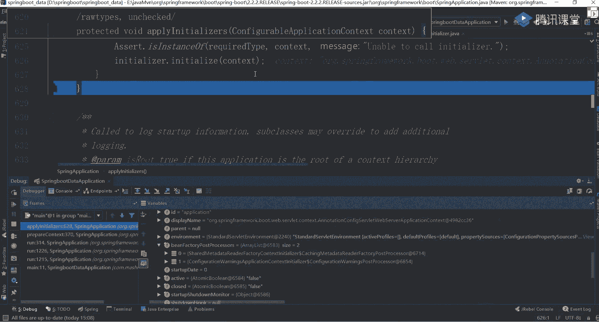

有两个具体类，这两类后面会用到，除此之外还有什么呢，还有个东西叫listeners，找一下，那我们小雷智能有are 什么东西，server port inf定是拿什么东西。

反正对象记住后面我们要用的时候，你要知道啊，原来在这儿进行了一个最基本的赋值操作，在这完成了好，玩完之后，我来往返再看一下高那个初始化就完成了吧，所以那些初始化器在这些步骤里面。

要不然我注册成一个类似的了，要不然我注册成一个什么叫post processor还是pos pos也行，他就说白了最终都是为了给我们后面的一些操作做准备工作的，现在你还不知道什么，没关系，我再给你强调。

到了强化之后，你先把它留下来，等我后面看的时候，你要知道是干嘛用的就行了好吧，看完之后听懂同学来扣，我一听蒙了吧，好，问题之后没再往下看，看到这行代码，你看到这行之后是不是又会变得非常非常熟悉啊。

是不是是叫类似呢，点contest prepared，就看这句话了吧，那一样啊，要完成我们相应的一些具体功能了吧，外面走连续连续，这时候又该循环类似的listen呢，注意了，永远只有一个，往下走。

点进去，点进去之后是不是叫new一个叫application contest，new sualize environment，来到目前为告诉我，你现在见到几个疑问了，几个问，第一个叫什么。

obligation，starting event，第二，prepared什么event吧，是不是三个，这是第三个叫obligation contest，usual letter event，咋想起。

不管是多少个疑问的，最终它所对应的一个处理的一个环节，或者说处理的一个流程一样不一样一样的，是不是一模一样，他几乎注意了没有完，几乎没有一些任何多余的一个操作，任何多余的操作。

所以这样大家一定要注意了啊，一定要注意了好了，这个题之后，我们下面来接着往下看，看这块来干嘛的呢，慢慢走吧，点一下试试吧，走创建这样对象，不管他走那边去点点进去呃，大家知道又该进行处理了吧。

还是一样判断一下它是否格式是一样的，是不是判断判断一下它是否呃哪些监听器符合我们的规则，感觉看一下吧，点下去知道来走走走走走走，大家看一下这个代码处理逻辑啊，都是一模一样，没有任何变化。

同一套代码把同样代码把y哥进行遍历，哪个复合条件不符合条件，就这样吧，结束了吧，所以这第一个叫什么叫background，然后呢点进去往下走走走，执行执行判断判断是不是什么什么都没做一样，什么都没做完。

再来看第二个走叫digation，什么什么东西来走，点进去，第二个也是依然什么都没做啊，你还是一样进行a x的一个循环就可以了啊，压制完之后往下走，大家发现了，一共有两个监听器留下。

那这样监听器几乎好像什么都没做，是什么都没做，什么没做什么，这么做，不管它好，不管它，然后接着往下进行便利走啊，早结束了吧，把接收完之后，这准备工作就算是完成了，所以大家看到了。

当我完成这个最基本的准备工作之后，相当于什么是不是跟什么都没做一样啊，其实它对应的就是一个最基本的空时线啊，虽然里面留下两个监听器，带两个电器依然手都没做啊，你不用管它了。

懂我意思吧啊这这一块的一个基本操作照，做完之后来再往下看，get到这块儿了，叫什么呢，叫this点，log start up in for，它是什么，它是一个最基本的属性值，叫什么。

触网是不是处的值出来之后，这一定是能进来的，一定进来，当你这进来之后叫log start in for什么东西，log that profile inf什么东西，你看方法也没有点熟悉的感觉。

你之前在启动我们当前这个spring程序的时候，到这一步没拿，是不是里面还要打印多余的几行的一个日志，而那些日志信息的一个打印就是在这完成的啊，对同位置就这东西，所以我们可以怎么样呢，往里面看一下。

第一个叫lost stin for，看里面做什么事儿啊，走这配上他不管他点去啊，他说判断是不是root是吧，然后点进去，这是不是你有一个叫set up in flog这样的对象。

然后log点击对象创建对象，不管好了，是这个对象创建啊，再往下走，叫harder走走走，get application log吧，走走再点看那obligation。log。

in for message是什么呢，叫this。get starting message吧，怎么get ssage，往上看，spring builder message等于什么东西。

然后呢message append starting说application message name等于啥，然后呢append version等于什么东西，append on。

append pad什么东西，append contact是什么东西，return一个message message，是不是，所以当你把这个代码执行完成之后，看着输出了吗。

是不是叫starting什么spring boot，spring bot dation on root with p i d等于谁这个目录在哪，然后start by root，然后in哪个目录。

是不是刚刚我们这些相关信息啊，这是不是直接进行输出了啊，这就是我们启动日志完了之后，第二个叫application。log，点debug loc of o什么get running message。

点进去是不是叫running start a spring boot，那加上一个mac class，一个类名称，加上一个碰到一个spring，然后面加一个mec也一样，直接把它返回吧，我们这直接运行了。

走看啊，没输出吧，为什么没输出啊，没说原因是这是什么级别，第八呃，是不是第八个级别，不是我们log级别啊，这不是我们一份级别，所以这没这没有进行输出吧，唉这应该输出吧，没输出啊。

of new一个什么的设置，默认info是吧，不管他了，没说没输入法不行，必向大局啊，这第一个是不是你说我启动一些信息，告诉我什么时候启动的对吧，这块信息打印再看第二个什么呢。

叫log start up profit for，是告诉你说我是哪个profile的一个文件，连续大家都走，这是我们的logo对象，别管他往哪走，spring acid profile，contest。

get environment，get in profile，这个地方我没有指定吗，没有吧，没有的话，这有一个是不是一个空的一个值，大家走，is empty吧，做什么事，然后log in for。

大家走走看，那什么东西叫no active profile，set for a back to default，profile default是不是使用就是我们默认的一个日，这是打印，是不是情况了。

往下走走，这不就完了，就是一个启动日志信息的一个打印工作，所以这块大家应该能看懂不难吧，所以你看到了它每一步骤每一步骤都分解开的话，它并不难，没步骤完成，这事情就是我们眼界所能看到的东西，明白了吧。

好来段目前为止能看懂同学对吧，扣个一还能看懂吗，如果没问题之后下面的东西就比较复杂了，我们五分钟讲完了好吧，大家说一下，你其实大家可以看一下，叫艾伯特specific single和bs，干完了。

你看他内行的一个注释，你来告诉我他完成了一件什么样的一个事情是吧，叫a boat specific singleton beans，是不是天boss里面指定的那些单利的b是不是意思，这边都是非常简单啊。

首先获取我们的b factory，然后呢注册一下我们当前这个sletter吧，谁是我们的spring application arguments，是不是我们当前在初始化的时候设置的那个参数的一个对象。

把那个参数对象给你加进来啊，这就注册了这样一个面对象，懂我意思吧，就是这样的这样这样这样的东西做完之后打印我们的fbanner，对不对，然后告诉你说变对象属于哪个面对象，然后呢允许怎样进行一个设置。

是否是懒加载的对吧，后面再来进行一些相关设置，然后类似的什么东西，然后呢old lol什么东西，这东西啊，我们晚上就会再讲好，现在不讲了，那讲不完了啊，记住到哪了，答对不知道吧，我们晚上再接着往下看。

打打个点好吧，你想刚刚我们所看到完成的一个具体的一个过程，我们今天要讲讲讲讲啥啊，想接下来再加上什么东西啊，来找一下找放方法，找绕绕方法，在当前这个弱方案里面，弱方案里面。

首先我们讲一下这个环境的一个基本配置对吧，是不是讲一下这个环境配置是吧，这个环境做哪些事情，做哪些准备工作，然后呢忽略哪些，然后我们ban怎么打印的，创建了我们的contest这样一个对象。

对象里面我们又往里面做什么事，说就这步完成的，其实这些东西啊，呃说难吧，也不是特别难，也不是特别难，但关键在哪儿，其实看方法里面你留个e，今天晚上我们重点会看里面的一个变的东西啊。

不是这这个漏的这个东西，就记住了个banner哈哈，但是大家比较简单是吧，啊唉呀那个整体的流程给记住了，这个漏的方法，我希望大家下去之后能自己先看一下漏的方法，非常非常重要的方法。

非常重要好非常非常重要，因为我们之后用到一些核心操作，其实都是在这个漏洞方案里面完成的，都放里完成的，这东西我们晚上再聊，其实啊呃源代码看到现在我不知道有种感觉，很多类可能不知道是干嘛的是吧。

但是大致的流程我是能梳理出来的，我能说出来的同时你会发现了里面重复的代码多不多，很多吧，比如说从spring spring property的那个spring f文件里面读取文件对吧。

再比如说像刚刚那个监听器那一块东西一模一样吧，只不过说我的世界换了一下而已，其他东西都一模一样，所以我只能在那里面定义不同的方法，但我不同的事件就搞定了，就这意思。

所以啊你们也不要把原本想说老师这东西是不是特别复杂或怎么样，没必要是吧，他们都指着火慢慢往下看，哪个地方看不懂，先跳过去，只要不影响你整体的一个布局就完事了啊，这块大家能够注意到啊，呃今天晚上吧。

我今天晚上尽量把这个早市写出来了，别吹牛逼好吧，别吹牛，别吹牛逼啊，这个早10年你写写不出来啊，你要我想你要想实现出来，这个太太麻烦了，所以我说我不讲好吧，呃你们现在玩一会儿之后。

把今天刚讲东西好好消化一下，然后晚上的时候我们再接着讲，我尽量在今天晚上的时间，我们把这个呃这个这个启动这个过程说完，启动过程说完，人家说完的话其实很麻烦，因为我后面要讲的东西还是比较多的。

我还想讲一下自动装配，还想讲一下start，对你有帮助吗，感觉有帮助，同学扣个一，呃不是慢慢讲的事儿，嗯啊还是一样，我在讲课的时候，我就想带你们一步步去看，呃按照顺序去看，原因非常简单，懂我意思吧。

呃这东西啊迟早慢慢看，还等等，你怎么看呢，我真想讲他们看的，我看到你们这这个这个这个这个这个东西，我觉得讲他们看你们不一定能看到，他们看不能容一点，能容一点，加课加课，你不加了啊，呃还是一样。

我把我计划东西讲完，这个没讲的东西，到后期的话呃，我们再更新，我们在更新讲讲太多，我们也讲两节课，今天晚上三节课，如果再讲三节课，我就懵了，你们就疯了，所以咱慢慢讲，我希望你能把整个流程给捋清楚了好吧。

大家可能要等到等到年后了，年前就就没有了，研发完了是什么，原版玩的是网约车，网约车项目，我啊计划不算，今天的课还有2~3节，就我说的东西，第一把启动过程讲完，第二把自动装配讲完。

第三再讲一下这个start，就是你你看那个starter的东西，就是我们配的时候，你们都都都打吧，这个三怎么用的，如何自定义的ar这个原理应该怎么写，这原理底层源码怎么走的，讲了三个点。

这三个点讲完之后，就就别的东西不聊了，当然除了这点，这边还有什么，比如说像呃环境东西好吧，自定义的一些东西其实很很麻烦是吧好吧，我还一样能面，最主要是什么，能在面试中帮到你们，课过年讲不讲课。

听老马看老马的安排，不知道老马在网上讲行吧，好了废话不多说呃，利用这里三个小时间尽快消化一下，然后呢，我们晚上八点准时再见，好。

