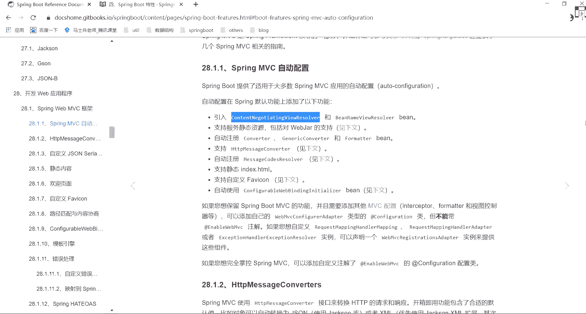
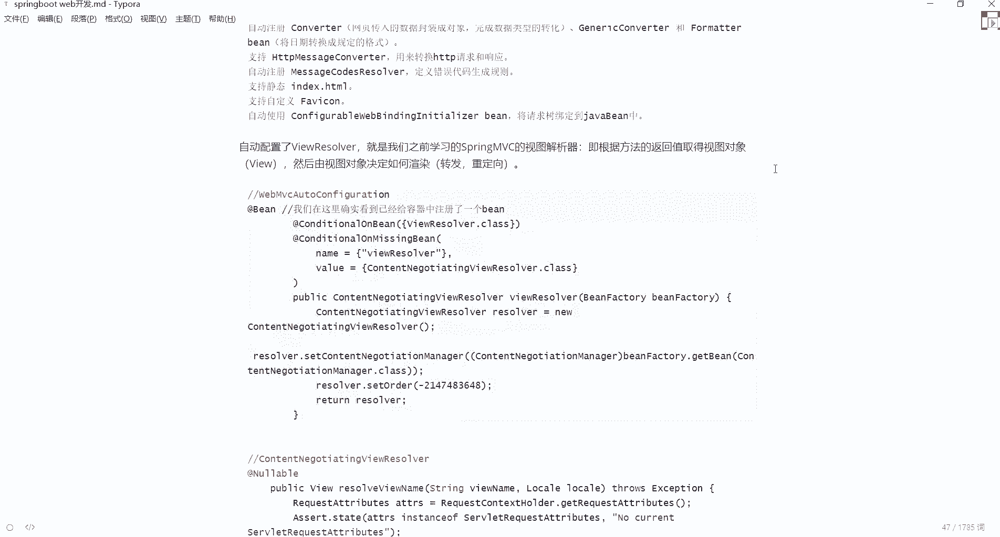
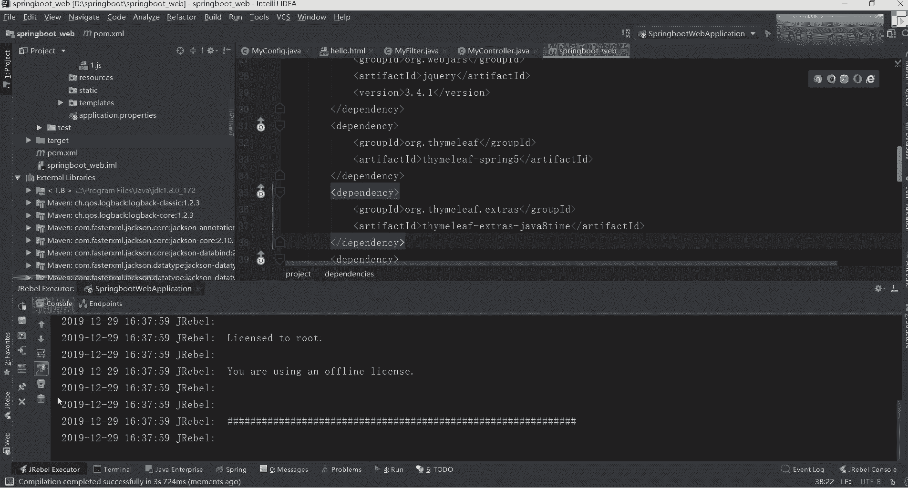

# 系列 3：P66：【Spring】SpringMvc的扩展 - 马士兵_马小雨 - BV1zh411H79h

下面再来介绍第三个点叫mc的一个扩展内容是啥意思啊，什么叫spring mc的扩展，这块也一样，我从官网里面截取的某一部分东西来找找一个spring mvc的一个扩展，哪去了诶，走掉了。

希望老师不要劝退啊，不会的不会的，原码没那么难，没那么难好吧，别别想太多，然后来看看这块的一个最基本解释，说cbot提供了适用于大多数spring vc应用的一个自动配置，第一个叫contest。

什么东西是一对be，你看到这些病之后叫will reserver，好吧，will reserve是干嘛的，这叫视图解析器啊，你们都学过mvc了吧，有不会mvc的吗，不会的同学扣二有不会的吗，小虎不会啊。

不可能吧，不过没关系好吧，你知道里面有什么东西叫视图解析器，这不是看到了，是不是里面自己经加载的，第二个什么叫支持服务，静态资源，刚刚已经看到了，web站是可以的，第三个叫什么呢。

叫自动注册converter啊，converter和former什么意思，是不是指的我们的转换器和我们对应的一个格式化器，这个转换器是什么意思啊，你前端输入的项目输入的信息都是我们的字符串。

它能把对对应转换成对应一个实体类对吧，格式化什么意思，比如日期转成对应的一个格式，是不是都有，再比如说支持什么呢，也是computer是还有个叫message code reserver啊，这个东西啊。

一一般在那个to message这块，主要是在我们那个那个叫什么呃，国际化的时候可能会用一下好吧，一带四tml是吧，支持自定义的一个标签吧，还有什么东西叫confederation。

是不是也是一对bec初始化，所以这块是spring boot里面自动装载的一些配置啊，这我都做了解释，每个属性什么意思好，什么意思啊，看错了，第一个叫石头解析器对吧，然后第二个叫支引入静态资源。

现在的主动著作converter这些东西，然后这是我们的htp t a a t p请求和响应的一个转换，这是我们的错误代码生成规则，这是静态的一代词自定义的分呃，这个呃标标签不是标签那个那个图标。

再看看自动使用我们这样的东西，将请求数绑定到我们的java并中，是有很多这样的一个知识对吧，大家注意啊，这是谁，这是我们对应的那个bot里面自动集成的啊，自动提升之后往上看书。

自动配置的vs reserver，之后就是我们之前自己学的marvc的一个视图联系，并且根据方法的返回值取得试图对象，然后呢由视图对象决定如何进行一个渲染，就是我们的重立项和转发站功能这块也是一样的。

你看干嘛，你可以在我们对应的一个类里面进行一个查找，简单找对应类好吧，还是那样找里面的类，找哪一类，官网里面给我们表示出来一个类叫什么，叫它看看，把那y之后，我们去里面进行一个搜索。

怎么搜啊，是不是这个页面ctrl f ctrl v找这个吗，走往下走，往上看，这是东西，是不是告诉你说这个值是这样的一个值，这是不是引入进来了，引入进来之后。

下面告诉你说我这是一个will reserver，表示一个视图解析器，当前这个视图解析器，然后呢new了这样一个对象，你完对象之后往里边设置了一些相关的一些属性，是不是就能看到这个对线到对应相关信息了。

这是我们整体那个视图处理器的一个处理过程，是不是在我们的mv c呃，y版mvc auto configuration这个类里面，你能看到这个信息吧对吧，但是我也说过了。

这块不是说你随便写完之后就一定能生效，这是不是有很多判断叫conditional on be conditional on missing beans，是有很多的一些肯定判断。

你只有符合了对应的一个条件之后，这块才会生效，如果你没有对应条件的话，这块是不会进行一个生效的，你懂我意思吧。

ok掀开之后往下翻，这是不是只要有这样的一个具体类，这类完了之后你可以干嘛，看一下刚刚写好的具体的那个类表示什么意思，就说把类点开。

点完之后它是集成了继承什么东西，然后呢实现了什么样的东西，里面就告诉你说这就是一个最基本的视图解析器，tap那里面是不是定义了n多方法，但现在你看到这方法之后可能还有点懵啊，不知道是干嘛的啊。

不知道干嘛的，没关系，我这里面写了，看里面有一个方法叫什么呢，叫resolve，will name，要处理我们当前这个视图解析器的一个名称吧，是处理器的解析的名称对吧，处理名称的时候怎么处理的。

来我们看一下这方法刚刚已经翻到了啊。

那是哎干什么，看看是不是叫reserve，然后呢叫view name，老师spring版本boss版本多少，最新的2。2。2，最新的版本我们直接看最新的不看老了好吧，这是截出来一堆的一些请求集。

合完之后这种东西马上翻，这是一个if的判断，判断完了之后做些什么事情，看这看这行代码叫get啊，不会读啊，什么什么will，是不是，这样的获取方法，这方法返回什么，返回是一个list的一个will。

是返回是一个will的一个集合了，你点开当前这个方法好吧，这里面是不是告诉你说我要循环变量的集合了，集合循环变量的时候，是不是有for循环球员告诉你说我要处理当前这个视图解析器了，然后呢这有一个判断。

判断完了之后也是一个循环遍历的过程，便利之后把这个视图解析器都给拿出来，是不是这样的过程啊，所以你看了源码之后，你会发现说ok这里面有关于我们的视图解析器，完整的一个整体处理环节，一模块怎么找的。

我是怎么找到这个地方的，找完之后我是做哪些的一个处理，是不是经过自己一个旋火循环，我现在只是带你看一个大概的一个步骤，还有大概步骤之后讲袁老的时候，这块我们详细讲的，我会想一想，他这块你先别管。

你要知道说我一步步是怎么找进来的。

怎么来处理我们对应的一个视图就够了好，所以这里面我把代码给粘出来了，装完站出来之后，这个get什么vo，然后往里面进行一个旋转好吧，转完之后可以it这个sorry con，干什么东西把它给取出来。

所以他说了一句话，说通过上面代码的分析，我们知道了spring board是在容器中去查找视图解析器，因此我们可以干嘛，可以给容器自定义添加食肉，什么叫食肉啊，点视图啊，自己写啊，自己写的错别字啊。

是看了可以给容器自动添加，我们是不解气，这个时候这个类会帮我们将它给组合起来，是不是这意思啊，好吧，这块也一样，刚刚代码你告诉你说我把它加载到一个容器里面了，通过当前这个容器。

我们就能把我们的视图给取出来，它取出来之后，这可能是一个原理，再记住了啊，说它是在容器里面找，所以此时如果自定义了一个视图解析器，只需要把它声明为一个视图，我们意味着是就能自己做一个操作了，好在这。

我来看我这写个这样的东西啊，写什么写，他说了他这个will reserver，然后呢，mary reserver，然后写了这样一个缩写是吧，是不是自己定义的东西啊，不对啊，这下面下面是自定义东西。

叫py class，my view reserver in lee，什么东西，实验完之后什么处理都不做，不漏水之后，这可以return一个my will reserver，是不是这里写了一个be。

当你想到变之后，意味着我加载到我们当前容器里面了，此时你当前这个视图解析器就生效了，当然一般情况下你不需要做这件事，情，是不需要做这件事情，为什么，因为词汇vc里面它本身提供了收集器。

除非说它提供了收集器，不再满足你的需求了，你这个时候没办法，我必须要进行一个自定义了，基于这样的情况下，你猜怎么样呢，需要自己来完成一个添加过程，这块能听明白吗，能听明白吗，源码没带，你拿个看啊。

我这给你们截出来了，我说了源码，我们现在先不看看，先讲这些基础知识，先把这块东西搞明白了之后，我们再看源码好吧，这两把下来之后，有兴趣的同学你可以先看看，你可以先看看好吧。

每一步我给你写都其实有有能写注释的地方给你写注释了，来这里吗，能听到同学扣个一本来，是不是懵了，能听懂吗，摸摸满引擎是不是得重启，不需要他本身是不是支持了自己的公关引擎。

你知你除非用一个自己特定的荧光引擎啊，一般不需要是比如说你现在只需要处理一个视图解析器，就是说如果你现在想添加视图解析器的时候，为什么我把它声明成一个病，它能处理的就在刚刚代码里面。

你看到了它是从容器里面进行加载的时间有限，只有原版课的时候，我会详细带你们读里面每一个步骤到底干什么事情好吧，怎么做这样一个处理环节，这块我会带你们说的明白了吧，ok如果你这块看明白之后也一样。

回到我们这个官网这个环节，官网这块就刚刚说这块好吧，怎么进行添加的，你配置什么东西就行了，听到辉煌每一步步记录下来，没关系，我笔记会发出去，你按照我笔记里面写就行了，我这笔记啊写的比较详细的。

每一个步骤通过哪个类哪个方法找进来的，怎么都要调调，调过来的都写得比较清楚好吧，来再来看下面这块的一个文字描述，这个描分析描述我注意的是我们对应的官网里面的一个描述，他说了。

如果你想保留spring boot mvc的功能，并且需要添加其他mvc的一个配置，比如拦截器，比如格式化器，比如视图控制器，可以添加自己的web mvc，configuration。

debt内容的and configuration类，但是不能带上enable web mvc这个标签，为什么，因为你带上这个标签之后，就意味着你自己完全掌控了我们的mvc，而spring boot好吧。

就不再起作用了，虽然说了，如果你想自定义它它它这些实例好吧，可以声明一个y版mc registration or类来提供这些组件啊，刚才说了叫原油配置都失效，确实这样的，所以这可能会成为一个问题。

公告里面是不是四词都写的很清楚了，就是告诉你说一般不要做这件事，那我们这儿其实也可以做这样一个类似的配置，怎么配置呢，还有笔记里面写的，这样我自定义好自己的一类，记住你要继承这个时间类好吧。

一定要记住这个时间类好，接下来之后我们可以添加我们的视图控制器，来写一下吧。

打开我们的项目，找到我们的com mv，在里面，我有一个，package，再写一个咖啡的，这写一个class叫麦，config写完之后注意了，这一定要实现一个东西。

实现叫bb mvc configure，生完成之后在里面加一个方法叫i will control，当你加完函数之后，你发现它里面有个什么参数啊，叫registry吧，是不是注册的意思是registry。

a的什么东西，这个方法是不是i的vo control对吧，是不是vctrl，这里面你可以写什么，写一个随便的请求，它是ur地址嘛，有写一个叫m s b，然后呢这边写一个叫set，没有内功，这写些东西。

我们有页面吗，没任何页面是吧，创建页面吧，创建页面切换页面，这是一个hello，你好，老师就是老板了，这是一个hello，12o，虽然不懂是不是这完成这样的一个页面了，然后此时我后面给你写什么了。

写上我们对应的一个情节叫杠嗯，hello，第二htm呃，刚好了，是不是发生这样一个请求，当你写完这个请求之后，下面一个告诉我再怎么解，我需不需要在我们对应的一个control里面。

大家看到我说写这样的东西是不是返回一个词size。

你随便换个名字就行了，这个名字无所谓，当你匹配请求之后，我需不需要在我们当前这个control里面加一个。

看这这这这是一个lo，这访问是不是字符串，我们这rise control的，大家告诉我，你现在这样写有问题没有，我现在这样写的话，能进入到我们的同页面吗，能不能请求到来，重启下试试好吧，重下试试。

不行来把进攻掉。

进攻到这来请求一下试试，我才没叫过来，mf b告诉你什么。

这怎么做是吧，at confusion，ok别忘了这东西，at configuration刚刚在这儿说写的比较清楚了。

官网里面看这块说告诉你说你要添加一个哪儿哪去了，and configuration类，必须要把它做一个标识吧，是不是必须要把它做一个标识，是不是写了，但是你不要带这个标签，不要带这个标签。

这个标签之后可能会成为一个问题，所以这块来周深。

请问一下，我重启下，保证这个效果啊，好来再重新刷新一下，刷请到了吗。

听到了吧，但是你想想这个请求什么请求是合洛斯不认吧，这是我们刚才说服务输出的东西吗，不是吧，因为什么它跳转到我们刚刚那个my control里面去了吧。

这时候把它改一下，我干掉，这儿返回一个信息，然后一个hello，这出来再重启，其实不用重启啊，不用重启也可以啊，重启一下吧，来再刷新一下，啥都找到了。

哪儿写错了。

刚刚合作写错了吗，这儿写错了啊，找一下，well pass，hello world back，干活哦，再加一个东西，没开微信，这不要加杠，这不要加杠，不要加杠，这不要加杠，这不要加杠。

啊申请一下嗯。

不知道问题吗，ctrl a ctrl没写错啊，来ctrl不是hello，我要去河道页面搞点htm，没错啊，周几。

诶这怎么还不对啊，我写的很多方法是不不是把没写错吧。

看这款my conversion写是吧，这是cl标记，标记等于hello，访问写的是msb。

没写错啊，虽然sb，然后四个赛。

request mapping，啊这儿是吧。

这是试玩还是粉丝。

这还跳回来啊，诶这啥情，是个目录，没墨了，这就放他那里面，没问题啊，确实一边。

request的map加，这不用加杠，这个问题吗，没啥事啊，这有什么屏啊，hello啊，这请求一个，加不加这加杠不加无所谓啊，这这这不是杠的事，没name等于他请求是他是一个和，应该写一个hell。

去掉不去掉，去掉之后不跟我意思不一样吗。

对啊，这哪有问题了，我错了，我刚才重新重新看一下，confusion是我们自己的，添加一个杠m m sb，然后呢发挥一个叫hello的一个请求，这样请求过来之后找到我们对应的一个梗。

这没写错啊。

之前测过了，这这应该不会有问题啊。

这波有问题，麦可麦，继承错了试一下，刚进行错了吗，来试一下啊，不是集成问题啊，这应该就应该写hello啊，这这起匹配的就是我们的河洛这个请求啊，有问题吗。

好的刘导吧，你这个说几下试试。

这个腰是set up flow game。

就过了，恐怖的是这两个问题啊。

要站起来，这奇怪了，rise刚出来。

rise control，没关系，这就是ctrl return一个hello，这是40，没导播幻引擎，魔幻级没关系啊，我现在没用到魔幻引擎，换诺手啊，诺手要试一下，弄出来试一下，是出问题了，奇怪了。

没看出来行。

这不对啊，不集成做累了吗，没写错吧。

在外边没c confusion。

这也不对啊，web，这不疼，不是他不是他，没写错，就是web，然后我会写这个，就这东西啊，这时间没问题啊，这个应该不应该出错啊。

这好奇怪啊。

是因为我加过滤器的原因吗，你想给自己试试啊，这我写的应该没问题啊，这是我们的数字连线，是msd，我是一你看啊看这意思啊，再看一下这个地方，现在我就加一个视图控制器，好，叫m sb。

然后设置它一个视图名称叫hello对吧，所以我现在相当于什么呢，我要请求一下我们的m s b，当我请求m s b的时候，相当于我映射到是我们的hello，这个这个页面里面是不是把它给请请请求到就行了。

是这样的意思啊，那我这写的时候，这个妈团中要这样写的时候，就应该写他写hello啊，这啥意思啊，就很奇葩啊。

又不让我请求了，需要用这两个名字换个名字也一样啊，你换一个a b c d就可以了，跟名字无关啊，爱着他，这应该没问题啊，这为什么会出问题吗，hello，肯定没问题，这不就写了个这这就写了一个天猫页面。

啥啥啥都没写，什么都没写啊。

这样我们先访问下楼，看能不能合作，能请求到，我这hello。

请求不到啊，这是controler，as you guys map return hello，我知道啥意思，好像好像这个问题啊，我们倒一个东西啊，额外加一个东西加一个。

找一下东西，找一个我们的依赖，找一个依赖，找一下我们simply和依赖啊，这很奇怪啊，福马克，我靠官网都不用了，什么离谱，吓死我了，来把这个一代加进来加一下试试，四。

这娱乐有关系吗，这次抱我抱我很意外啊，所以为什么找不到啊。

这就有了，我现在请求a b c d现在好了吗，好了吧，我说咋回事啊。

我们代码写的肯定没问题啊，待会来看，我来看刚好加什么，是不是a b c d，相当于说我请求这a b c d的时候给它加了一个视图，名称叫hello啊，叫hello，ok，这集刚出的模板引擎。

我刚刚那个目录放的时候是放这个呃，他们里面去了，这时候必须要加工引擎之后才能才能去便利我们这个他们的目录，要不然的话他找不到对应，找到对应一个属性啊，找找找到对应这个页面好，那这个时候不是就没问题了。

现在我放在a b c d改回来，m sb额外。

来再重新请求一下，这个还不行。

这个这个sb中毒了吗，重启一下试试。

好了现在说好了，是不是请求到了，因为我们没加了模拟引擎这块给大家标标注一下，注意需要添加，老板引擎，好吧，我刚刚给他粘出来的东西，给他粘过来，搁这，好了是这块东西好吧，稍微注意一下就行了。

知道你们自己试试，添加这个输入，输入节气就行了，明白意思吧，啊这块翻车了，浪浪费了点时间，不好意思啊，反正我刚写就感觉代码这块肯定是没问题的。

好吧，请过来就找不到折叠器，刚刚应该听折器啊，听折叠器早早就解掉了行了，这块咱们大家就聊这么多吧，啊别的不说了，来这边听吧，同学扣个一，知道哪有问题了吧。

