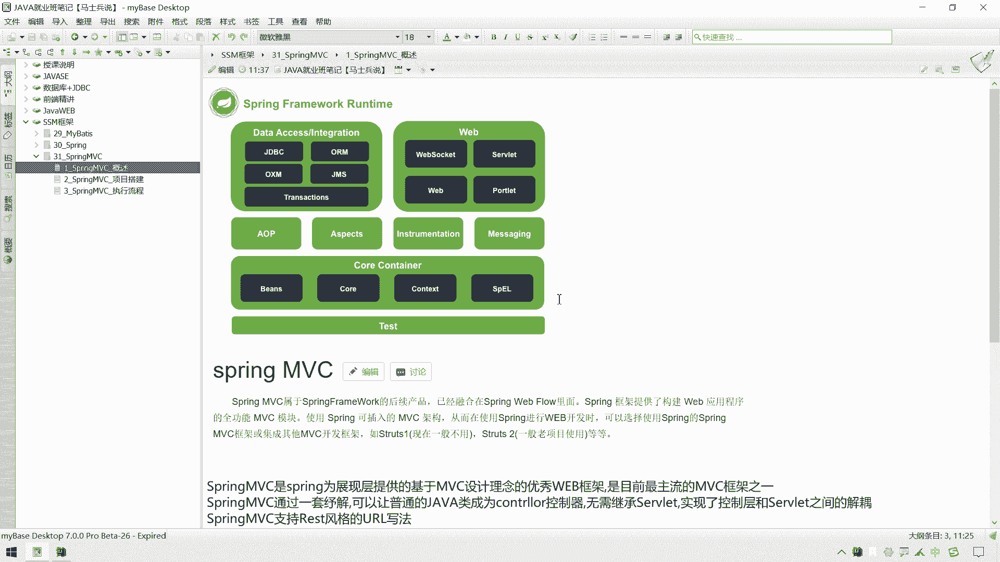
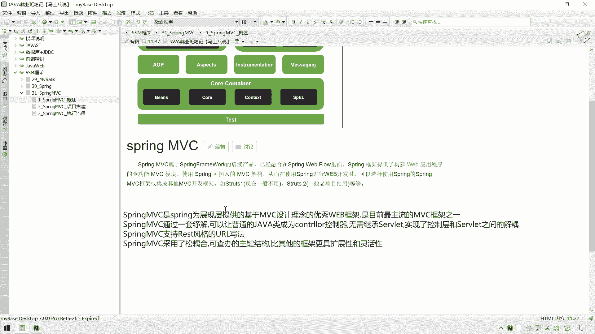
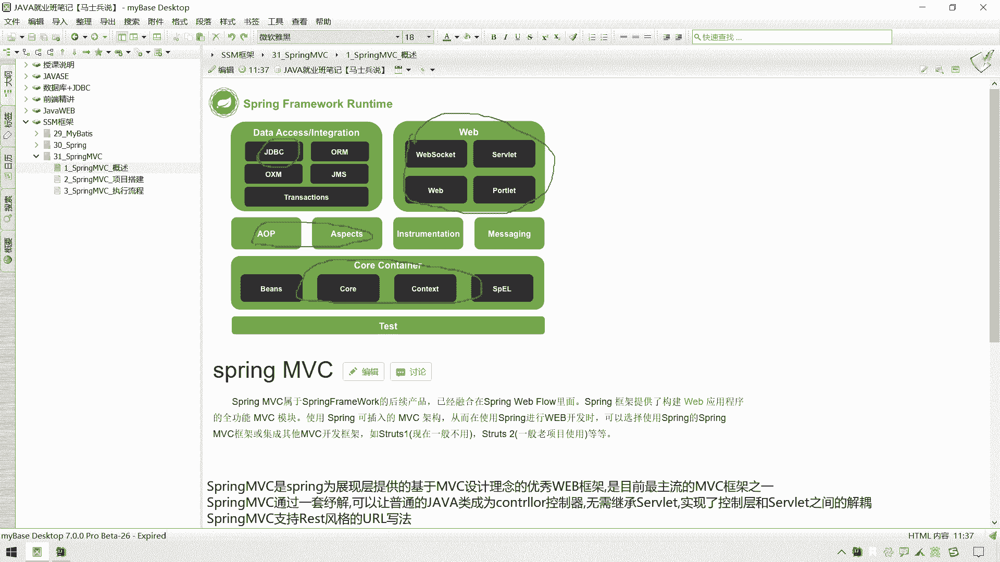
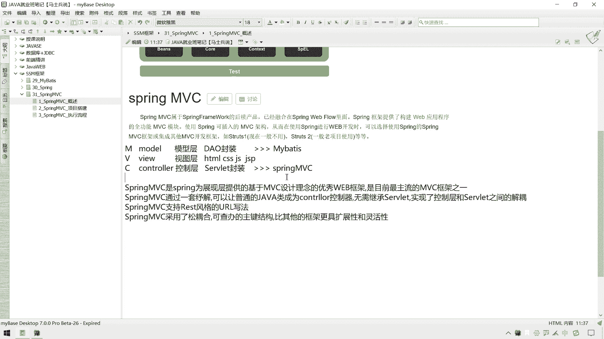
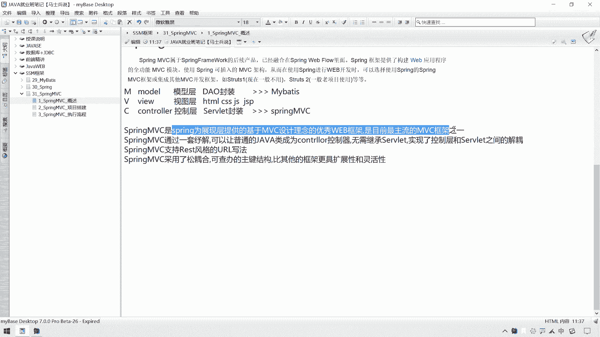
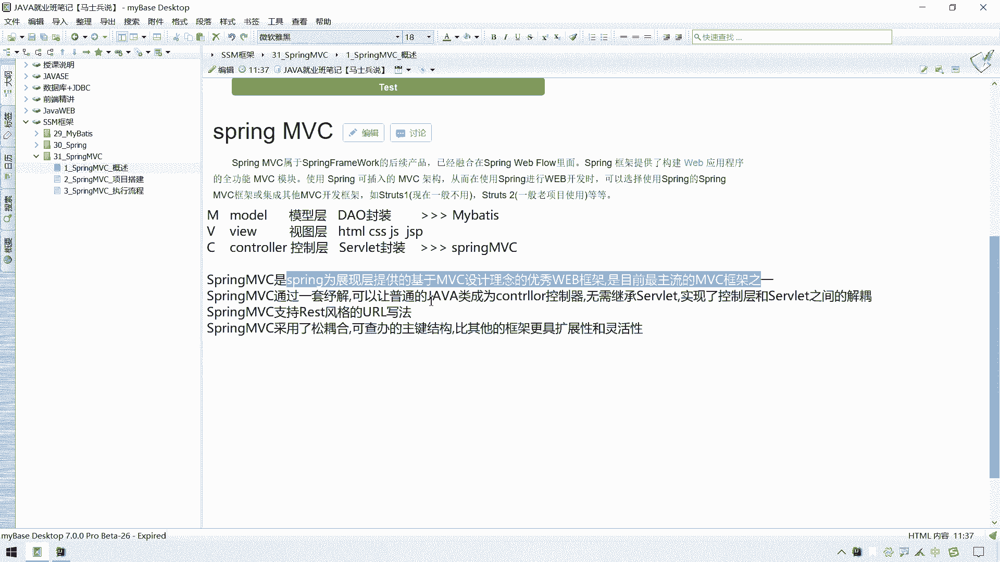
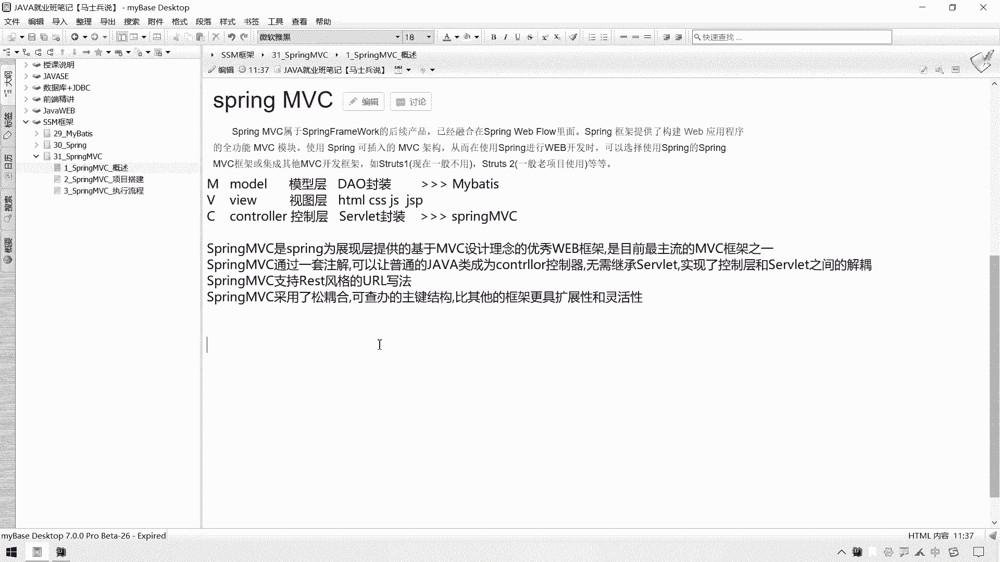

# 花了2万多买的Java架构师课程全套，现在分享给大家，从软件安装到底层源码（马士兵教育MCA架构师VIP教程） - P67：【Spring】springMVC_概念引入 - 马士兵_马小雨 - BV1zh411H79h

好从这一节开始呢，我们就进入到这个s s m里面，第三个框架，这个spring mc mvc这个框架的一个啊，这个血线单说一下什么是我们这个spring mvc这个框架哈。

我们这个spring framework这个体系里面呢，那么就是我们那个i o c和d n那一块，这个a p a spect就是我们的切面编程呃。

gdbc这块呢我们加上了一个呃这个gd vc template，完成自身改查，同时呢又完成了一个事务控制，然后我们在这讲一个叫做spring mvc的一个这个框架。

那么spring mvc这个框架主要解决的是什么问题，他能给我们做什么。

接下来简单给大家描述一下，那么呃我们在这个呃我们说一下sumsor怎么来的，它是spring呃，framework的一个后续产品，它已经融合在了这个supreme web flow里面了。

那么也就是说我们要是想使用这个spring mvc的话呢，我们还是要借助呃这个spring 5的一个环境，或者spring的一个环境才能够使用它，它还是要依赖spring的。

那么这个spring mvc它主要是对哪一层进行封装呢，我们先说一下这个m v c是什么，m v c m还有这个v啊，还有这个c，这是我们这个软件架构的这个mv c模式，它分别指向我们这个三层。

那这个m指的是什么，指的就是我们这个model，那m o m o d model啊，是我们的模型层，还有我们这个d啊啊，针对于数据操作的一个模型啊，叫做模型层，模型层，那么在这一层呢我们讲了一个框架啊。

就针对于dao的一个封装啊，那么指的是哪个啊，这个框架呢就是我们这个my b，也就是说我们这个my bet c已经解决了模型层的一个这个增删改查，一个封装了啊。

或者是我们那个g d b c template也是针对于模型层的，那这个v指的是什么，which指的是一个view，vn e w view，view这块指的是什么，叫做视图层，嗯是吐槽。

那么视图层这一块的主要讲的都是一些页面技术，像一些这个html啦啊这个cs啦g啦，或者是我们说这个gsp了，嗯，在这个分层上，它也是属于这个呃模型层，视图层的，它主要是用来展现数据的。

那么这一层呢我们还没有接触过一些呃正式的一些框架，或者是前端的一些框架，这这层就算是有框架，它也是前端工程师的一些框架，可能对我们来说呢，这个框架相对来说比较模糊，那么还有第三层呢就是什么呢。

就是我们这个control层啊，这个control层，那么control层指的是什么，就是我们的一个控制层，控制层，啊控制词，那么这一层啊主要是通过我们之前是用什么技术来实现的呢。

用的是这个so well let技术嗯，缩短技术，那么这一层主要就是用来控制前后端数据交互以及那页面跳转，以及我交互的一个逻辑等等，都要通过这个控制层面进行处理的。

那么我们今天所讲这个super mvc其实就是对什么呢，其实就是对soviet的一个封装啊，就是我们今天的一个呃soviet封装，原始的时候我们可能会用这个呃so light，但是solar封装之后呢。

我们今天使用这个spring mvc这个框架来进行一个处理就可以了，那么你可能会说这才两个框架呀，那spring在这里面有什么作用呢，那就是我们所说的一个s s m啊，当然这个框架整合呢。

我们把这个m c m v c学完之后，我们在后续呢再去处理就可以了。

那么呃supremvc啊是什么，是spring v展现提供呃，呃展现提供的呃，我是为展现曾提供的一个基于mvc设计模式的，一个优秀的一个web框架之一，也是目前主要的mvc框架。

那么在他之前用的是这个struts和struts to，但是struts to呢在我们这个web 30之后呢，基本上就是属于一个淘汰的状态了，都属于这个spring mvc了。

那么呃spring mvc呢给我们提供了一套这个注解，你注解可以让普通的java类成为controller，而无需继承soviet，就是我们之前写control层，要写sol的话。

那可能要继承这个http soviet，那么我们以后再定义ctrl层的时候，就无需自己继承这个soviet了啊，那么这样的话呢可以实现我们的代码呢与soviet之间的一个jo。

就是后面我们在编写soviet的时候，其实我们不需要tomcat的一个环境，不需要so let api和这个jsp app，这h2 的话也是可以进行一个运行的，之后呢。

supreme m v c还提供了支持rest风格的一个url的一个写法，它可以让我们这个ul呢这个安全性可以提高一些啊，这样可以减少我们参数的一些暴露呃，supervisa还采用了一个松耦合哎。

可这个查询的这个主题结构比其他框架的更加的呃，具有扩展性和这个呃灵活性，那么这个是我们supremc的一个呃这个呃这个简单的一个介绍哈。

那可能大家对于这个surprimvc还是没有一定的一个呃这个呃感受，那么接下来呢我们就搭建一个呃这个web项目，然后呢我们从普通web项目到什么到使用spring mvc框架。

那么这样的一个转变转变之后呢，带大家体会一下这个spring mvc框架它的运行呃。

