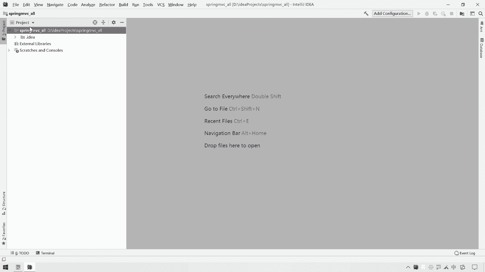
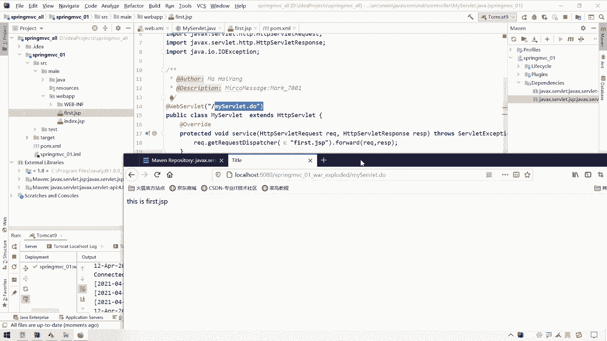

# 系列 3：P68：【Spring】SpringMVC_创建并运行war项目 - 马士兵_马小雨 - BV1zh411H79h

好，接下来呢我们就搭建一个呃外部项目。因为我们这个spriMAC呢主要是对于控制层来进行一个封装的。那么我们接下来就答应通过美文搭建一个外部项目来给大家展示的，也不是我们储通的一个炸项目。

而是一个腕项目了。呃，这块呢这个改了一下字啊，这不是一个查询，这是可热差的一个组件结构啊。那么接下来呢我们就搭建一个项目。搭建完项目之后呢，我们呃测试一下在man状态下的搭建项目这一块。呃。

然后呢再把这个MV框架给大家加上之后，看一看它有哪些变化哈。那首先呢我们创建一个项目，create new project。那么我们还是创建一个空项目。然后在空项目里面呢，我们可能会创建若干几个模块。

这样就省得我来回切换项目，每天一个就可以了。选择这个empty project，然后来一个next起个名字。名字叫做spring mVC啊，这个小写名MVC，然后来个下划线哦啊。

那么我们把所有的MVC的这个测试项目全放这就可以了。那么再来一个finishfinish之后呢，这个可以关掉哈，我们这个项目就已经创建好了。但是这块呢并没有显示我们的项目名。如果不显示的话。

你可以直接在这哈，可以在这右击直接new这个呃在这儿这个file直接new model model就可以了。那如果说你想显示这个项目名的话呢。

呃那么也可以在这块给它来一个叫做呃close project关掉之后呢，再点开这个sup mAC。然后你会发现这时候项目名就出来了。它就是我们的一个项目的一个根文件夹。😊。

那，创建完这个文件夹之后呢，下一步呢我们就要在这个项目中创建我们一个外呃这个外部项目，就是一个W项目。那么呃在创建W项目的时候呢，有一些细节的注意点，大家需要调试一下。在创建va项目之前。

我们需要干这样几个事儿。

呃，空项目准备好之后呢，我们下一件事就是我们要把当前项目这个maven和lo bookroom book可能给它设置一下。

因为这个maven和lo book可呢是针对每个项目都要单独进行设置的那我们创建新项目之后呢，这个应该已经失效了。所以这个小细节呢大家自己注意一下就可以了。这个还是非常简单的哈。

file，然后选择这个stting呃，找这个me文，这个me文呢指定成我们自己那个meve文。因为这块之前已经讲过了，那我这块呢就快速操作一下就可以了。选择它。

然后这块over ride选择我们自己那个ma文里面那个配置文件。呃，维稳。好，里面这个sing4点叉MO啊，把这个给它设置一下apply应用完毕之后呢。

我们顺便找一下这个compercomp里面有个叫做annotation processes，把这个给它勾上。那你勾上之后呢，代表你当前项目这个就支持 book的一个注解了。

然后最后来一个来一个OK呢也就可以了。啊，那么这个两个就一块设置了。设置完之后呢，后面我们创建项目就不用担心说这个me和这个room book插件一个问题了。

之后呢，我们就要创建一个maven的一个web项目的一个模块了。其实呢我们一开始直接创建这个模块也可以。但是呢我为了方便在ID中切换，呃。

不用再来ID中来回切换呢我们直接呢创建一个mave web的一个模块。

那么这个怎么创建呢？还是在这儿右击新建一个model，然后在model里面的时候，我们要选择这个me。

在选作me的时候呢，大家一定要注意哈，我们在创建ma呃呃va项目的时候呢，我们就要从这个create from arc type，从这个骨节这个archrctype其实你可以理理解为项目的模板。

也有这样一个称呼叫做股价。就是这个骨头的骨，然后呢架子的架。其实说白了就是一个项目模板啊，有人称之为股架，有人称之为项目模板。那么我们在选择这个骨架的时候呢，这个之前呢也这个提示过大家哈，呃。

我们要选什么？要选这个外bAPP这样一个项目。但是大家注意这块有两个外APP一个是这个外APP一个是这个APP但是大家注意哈。

前面这个外APP呢是叫做COO的一个APP而我们这块是一个的一个外APP我们要选择它千万不要选择上面这个选择上面这个就错了。啊，不要用它选择这个叫做moctype webAPP就可以了。

然后再来一个next我们起给这个模块呃准备一个group IDDcom点MSB。嗯，MSB哎，然后呢起一个名字叫做spring。MVC然后呢MVC的1个01个的一个项目啊，那我们在这块启占一个模块名哈。

这个没什么可说的，然后再来一个next呃，这个里面暂时也没什么可说的。这里面你看我们之前已经选择了me文，它就已经使用我们我我自己配置那个me文来来进行啊对我们这个项目的一个管理了。😊，再来一个nex。

就是我们当唉这个可以给大家截个图哈。这个是如果说你的这个在创建外部项目的时候，如果这里面不是你自己配置那个ma文的话呢，当然你使用idea默认的也可以哈，这个没有没有什么明确的一个强制要求。

其实都是可以的。

这是在这块来一个。下一步哈。

呃，这是查看这个目前你当天使用这个me，它会给再给你展示一下，然后再来一个nex，然后再来一个finish也就可以了。

那么这个时候呢呃你的idD呢会自动的先运行一一些东西。呃，这里边呢会默认往这里面怼一堆东西。怼完一堆东西之后呢，你可以先点一下这个叫做也呃可以在这块先点一下这个import这个 changes。

因为目前你会发现这里边给我们准备了一个外APP。但是明显看着它不是一个外APP那个结构。你先点一下这个import changes。点完这个inpost沉解词之后呢。

你会发现这个weAPP里面就带了一个小蓝点，那说明它是我们这个项目的一个资源的一个跟录径了，是吧？那那同样的在这个股价项目里面呢，项目股架里面呢，它给我们带上了很多东西。

像例如这块有一个呃nameURL，还有这个proty，它默认使用这个编辑工具是1。7的呃，结果里头用4。11的，还默认导入了一些这个插件一些依赖。那这些东西其实我们都不需要了。

我们从这个packaging以下后面的所有东西，一直到我们这个project的这些东西都给它删掉就可以了。哎，删掉完之后呢，我们重新的再来inport这个 changess就OK了。

呃不用它导入那些东西也是OK了。我们自己后面需要什么，我们自己导什么啊。

导进来之后呢，我们发现在一个呃使用股架创建我们这个spring的一个MVC嗯，这个ma的一个外部项目的时候呢，它有些毛病。这里边只有一个ma啊，它但是没有什么呢？没有那个就是像我们之前那种项目结构啊。

就这种ma下面有java有 resourcessources。然后呢除了除了min以外SRC呃，下面还有一个test的一个包。所以呢我们要把这些目录呢，手动的给它补齐，那怎么补呢？

呃，我们在SRC下面先补充一个什么，先补充一个directy叫做test，这是一个test目录。然后在ma目录里面呢，还有什么？还得有一个哎java目录。这个java目录是放java源代码的。

还得有一个什么呢？在ma下面还得有一个叫做呃RESOURCSresources目录。这个resources目录是放那个我们的配置文件的。然后在ts下面，我们再准备一个java目录。

这个java目录呢是放我们测试代码的。但是你会发现我们创建了这几个目录之后呢，它只是普通的目录而已，再点一下这个你跑的证据。这种普通目录呢并没有被我们当前项目识别为特殊的资源目录啊，那么怎么办呢？

我们需要告诉当前项目，这是特殊的资源目录，对这个文项目这个目录呢进行一个标记，那怎么标记呢？选中它右击有个叫做markdirecty as什么什么东西。那这个地方明显是放java源代码的那放什么？

放这个叫做source rootot，哎，标记为我们的这个叫做呃这个这个源代码的一个跟跟目录。那么这个resources呢是放配置文件的，它怎么做呢？

有个叫做mark什么mark叫做resources rootot那就是放我们这个资源配置文件的一个跟录键。在test下面这块有个java。

选择它右击啊叫做mark什么mark这个叫做test source，就是我们测试的这个原代码的一个呃这个跟录件啊，那么这样的话呢就把这几个配置文件呢给准备好了。准备好之后呢。我们再来看一下哈。

那么这个we部项目呢给我们创建的一个骨架，这个通过这个骨架给我们创建一个外部项目，我们发现在这个webAPP里面，它这个域它这个版本太低了。😊，就是我们之前在学习java意的时候呢。

我们用的这个呃web的这个约束呢，webAPP这个约束呢已经是4。0版本的一个约束了。所以这个约束不能用。那这个约束不能用呢？我怎么知道这个呃这个java意4。0这个we点叉里面这个约束长什么样子呢？

你可以在这块再创建一个什么创建一个普通的一个项目，普通的一个模块就是我们的一个java意的一个模块entterprise模块。

把这个web applicationplication的勾上勾上之后再来一个next这个名字你可以随便起一个AA是吧？finishfinish之后呢，呃它会给我们。

创建这样一个呃这样一个web项目，然后这里面不就有一个web点叉ML吗？我们把这个来给它cttrol C复制一下，复制完之后呢，给它粘这不就完了吗？这这之后呢，那我们这个AA项目怎么办呢？不要了。

移除这个模块，右击先什么呢？先这个叫做remove model，把这个模块移掉，移掉之后呢，这个文件夹也不要了，右机再来给它哎删掉就可以了。

那么我们当前这个webNF下面的一个web点叉ML它的一个版本，我们也已经指定好了。哎，那这就是一个呃整个web项目的一个创建，以及什么呢？以及我们这个目录一个准备就准备好了。

呃，准备好之后呢，那么我们接下来做一个简单的一个呃简单的一个呃这个测试。测试什么呢？就是这个项目怎么运行啊，对吧？哎，怎么运行，然后呢怎么编写这个controller，那么我们这个该怎么办哈？

我们先准备一个普通的serv light，然后呢请求slight调转GSP。那么我们先做一个这样的一个代码。这个这个代码做完之后呢，那么我们呃这个再把它改成这个sMV的哈。😊，这一步改完了。

嗯，我们先准备一个so light，然后呢跳转至GSGSP。在java这块呢，我们先准备一个controller层com点MSB点啊这个CUNTROcontroller。没有。

controller嗯来个点什么叫做呃my server吧。哎，让它去继承HTTPsolet。但是你会发现在继承的时候呢，这里面并没有找到这个HTTP soul light，这是为什么呢？

这个HTDP嗯。s light这个类呢它是来自于哪类呢？它是来自于呃这样的一个账包，这个账包叫做s light杠API。A片。那么这个s like APII在哪里呢？

它其实就是在我们这个tom cat里面。正式来说，这里面应该是不会有这个tom cat。我们可以先把这个删掉哈。所以这个一会儿啊他给我默认关联它了，我们可以先把这个给它删掉。呃。

我们用maven来这个呃这个管理我们项目之后呢，这个炸包啊导入呢全部都交给mave了啊。那么此时呢当前我们呃这个项目里面是没有这个slight APII这个炸的slet APII这个炸在哪呢？

在我们这个tom cat里面呢，可以可以给大家找一下哈。呃，地盘在这个program forAT，然后tom cat tom cat99。0。41。这里面有个lab。

然后lab里面有一个叫做slet APII。那么这个 APII还有我们这个在编写GSP的时候呢，还有个叫做GSP APII这两个依赖呢，在我们普通java意义项目里面，如果我们一关联t之间呢。

就会把这个两个依赖呀给导入进我们的项目，导入进我们的项目之后呢，我们编码就可以使用这里面代码了。但是运行的时候呢，我们还要把我们的项目放到我们这个t里面。所以事实上呢。

这两个依赖并不需要真正的导入到我们项目之中。但是编码的时候，我们还需要这两个。也就说这两种这两个呢它的这个这个使用级别呢仅是在编译的时候，或者是编码的时候需要。呃，那么怎么办呢？当前又是一个me文项。

me文项目需要导入这个swat APII和GSP APII那怎么办呢？我们只能通过这个me文坐标来导入这两个哎炸包了，那怎么导呢？我们可以打开我们这个搜索me坐标的一个那个那个那个网址MVN啊。

这个reposory点com。

在这里面我们可以搜一下，第一个叫做slight APII。搜索一下搜索完之后呢，我们看一看这是java X包里面的一个s APII选择它，然后里面有一个看看这个版本已经到4。0版本了。

那我们就选择这个4。0。1啊，你看使用最高了，已经是2728了，就用它就可以了。

呃，选它来ctrol C哎，放到什么呀？放到我们这个pome点叉M之中，在这放一个dependencies。

放进来。除了这个solight APII以外呢，还有一个叫做GSP APIIGSP杠API这样的一个依赖。那这个依赖呢我们也得导进来哈，这个是它。

呃，用的也是新一点版本吧，2。3。3就用它了。来ctrl C拿过来也放到这个里面。

嗯。这个是一个加格注释，这是sve light和这个GSP的这个依赖。你来。导进来之后，点一下这个import changes啊，注意哈，在导入这个slight APII和GSP pad的时候。

你会发现这里面有个scope，这个scope都是一个叫做provid的意思是什么呢？就是编译的时候也不编译它。仅仅是在我们编码的时候，编写的过程中呢，使用这两个依赖。那么事实运行的时候呢。

我们把这个代码放到一个容器中，容器中自动就给我们提供这两个依赖了。所以呢这个是呃scope provided它的一个作用啊。那么导入进来两个依赖之后呢。

我们这个my server里面就可以让它去继承ext HTTP。HTTP哎是外了。喂。S。SERV啊，我应该是还没有成功导入。呃，我们先把这个这个me的一个导入给它重新处理一下哈，在这里。

右击ma问呃reimport一下。po一下，我们点开看一看，这里面已经应该有这个slet APII和GSP APII了。那么我们再到我们自己的这个代码里面找一下哈。Ex H， T， T P。

 server light。exts hTTPserv light，但是好像没有提示，没有提示，那就手动放进来吧。鼠标放进来，然后点inport class a就导进来了。

那那这是一个导进来了一个HTTPserv light。然后呢我们还来还是要干嘛呢？还是要重写这个service方法嘛啊，来一个service方法。呃，那么我们这块做一个页面跳转。

我们要给它跳转到我们在这个外APP里面呢，我们准备一个叫做。呃，FIRST first1个GSP吧，然后在这写成一个叫做this is first。点GSP我们要往这个页面上去跳，那怎么跳呢？

它直接放到我们这个外APP下面了，就是放到我们这个跟外NNF同一个级别下面了。那我们就请求转发请详象同像其实都行。

请求转发吧QQ点get request然呢请求转发至我们这个FIRST first点GSP上去，然后呢并做出转发动作报IQP。那么同样的我们要给这个呃my soul呢准备一个什么准备一个请求映射路径啊。

再来一个什么再来一个艾一个叫做web soullet请求映射路径呢，我们直接写成什么？直接写成一个做呃斜线my server civil点 do哎就可以了。那好。

那么接下来呢我们启动一下我们这个项目来看一看这个呃这个项目该如何去去去这个呃请求我们这个m light哈，该如何去启动。那么我们创建个vi webb项目之后呢，你这里面可能还没有一个启动的服务器。

那怎么办呢？我们可以手动添加一个，例如我们在这添加一个什么，添加一个呃这个tomca一个serv。然后呢，一个是logo，一个是本地，一个是远程。那我们添加本地这个logo就可以了。

再加本地运行环境的时候呢，第一个这块要起个名字。那这个名字呢我们直接写成tom cat9就可以了。然后前面这个首字母大不大写无所谓啊，就当便代表你当前这个服务器的名字。

那服务器这个application server在哪里呢？因为我这里面已经我ide已经这个整合过这个9。04了。如果没整合过的话，你这块应该是空的空的那怎么办呢？你点一下这个confi去找什么。

去找你的你这块有可能是一个空的空的干嘛呢？你就按照这个路去去找找你个这个这个的这个路径啊，选择到这个上一层然后O然后下面这块呢自动就跟着变了这个GS自然而然就进来了。

那么你这块点这个confi配置完之后呢，这里面就会有一个9。4了。但是我这块已经配置过了，我就不需要再重新配置了。那么配到这之后呢，我们下面的东西先别动啊，先回到这个deployment这一块。

我们先把什么呀，先把我们当前这个supreme mVC01这个项目呢给它部署进我们当前这个服务。呃，这个这个容器里面那怎么部署呢？点这个加号artact选什么？选我们这个叫做哦。

我之前这里面创建1个AAY exploitloed的，已经删掉了，它还提示我呢，选谁呢？选这个supMVC01Y exploited，把它部署进来。部署间之后。

这个application contactt就是上下文路径，或者是你简单理解就是我们访问的时候，项目这个名字，你想改的可以改，你不想改的话呢，你这样也行这样也行。然后再回到这个server这块来。

你会发现呃，在我们项目启动之后，默认用什么浏览器打开呢？我默认用这个火狐吧，可能我更喜欢火狐一点，是吧？on update actions那给它改成什么呀？

class 呃up classes and resourcestheon frame declaration这块可以改成up resources。

或者你改成下面这个up classes and resources也可以啊都行。有。那么下面这个是1个GRE默认的是什么呢？默认就是我们当前项目这个呃1。8161就OK了。嗯。

当然deeffat也是行的哎。呃，这块可以使用这个呃这个这个deeffault，我们就给它改成GDK1。8吧哎。这个GDK181611。8。0161，这是我自己安装的那个GDK是吧。

或者是用这个GRE啊也都可以用它了。这个是我们呃服务启动的一个端口号8080啊，那你想改的话呢，可以给它改一改。例如88998081是吧？下面是GMX1个po，这个就不用动，1099就完事儿了。哎。

然后再来一个apply ok。那你会发现这个时候上面就多了一个tomca9，我们就可以用这个tom cat9来启动啊，启动tomca9之后，把我们这个项目呢自动的给它部署到我们这个tomca9里面。

但是大家一定要注意哈，此时我们的项目这里面还有没有编译呢？并没有编译，它并没有编译成一个可部署的项目。但是我们一启动这个tom k9的时候呢，它就会先对这个项目进行一个编译。

然后自动的给它部署到我们这个tm k9里边。那真的是这样吗？我们可以试一下哈。点下他。这里面应该会有一些这个日志。这个第一次启动打印日志还是挺挺挺这个挺耗时的哈。

好，那么成功打开了我们这个呃tom cat9呢已经成功运行了。成功运行之后呢，你会发现我们这里面也多了一个target目录，它就已经对S2RC里面东西呢进行一个编译了。编译完之后呢生成这个样子。

classsses是看代码的，然后这个super m呢是看我们整个项目打包之后的一个结构的forGSP在这儿啊这个indexGSP在这外NF里面有classclass呢在在这里面有一个我们的一个controller。

在这块也有。那我们试一下访问这个my server letter do啊，看看它能不能给我们跳转到这个first这个点这这个first点GSP上去哈。那在这怎么访问呢？

直接在这儿访问这个叫做呃my呃 my server light点 do，然后一回车，你会发现成功的给你跳转到了this is first gSP调转到这个位置上去了。那么整个的一个用创建外部项目。

并启动外部项目这块呢给大家演示了一下了，演示完之后呢，那么下一步我们就是在这个上面呢使用s mV框架，对我们这个con层对我们这个serv light进行一个替换啊，替换为s mV就已就O了。

