# 系列 3：P69：【Spring】SpringMVC_框架搭建1 - 马士兵_马小雨 - BV1zh411H79h

我们创建了一个可以正常启动运行的一个maven web项目之后，那么接下来呢我们就要在maven web项目里面呃，这个导入我们这个mvc spring mvc的一个框架。

然后有了super mvc框架之后呢，我们ctrl层就不用这么写了啊，就我们自不会再再也不会自己去这个写这种啊，so let或者继承这种sol了，呃那么我们自己写这个select呢有很多毛病。

第一个毛病就是呃我们这一个soviet它都有一个独立的一个应试路径，那么如果说我们针对于一个啊，这个我们假设想在一个server之中定义大量不同的这些业务逻辑处理的话。

可能会产生很多很多的这种搜罗来的对象，因为你这个每个搜来的只能对应一个应试路径嘛，对不对，那么我们想在一个类里面啊，可以处理很多很多不同的这个路径或者不同的请求的话，那么我们嗯怎么做呢。

就得用这个spring mvc框架来给我们处理的，这是第一个，第二个呢呃我们在获取页面参数的时候呢，可能要通过这个request对象去获取，获取完之后呢。

我们还要把这个request对象所获取参数的封装成什么，封装成对象，然后再把对象传给我们的这个思维一层，再把对象传给我们这个这个d o层，然后一层一层逐层的呢呃去这个进行一个处理。

那么我们有了mvc之后，supremvc之后呢，我们获取参数这一块呢也再也不用自己去手动去获取request，get premeter map了，get permeter了。

那么完全有这个40框架自动给我们获取参数就已经ok了，包括后面的请求转发和想要成像啊，都有一些简化的一些写法啊，那么简单来说spring mvc是干嘛的。

其实就是把我们这个呃control层对于我们的so light进行一个封装的一层框架，那么接下来既然用四fmc来替代我们这个ctrl层了，那么我们接下来就不写这个my sou了。

直接把这个my soul light给他干嘛给它删掉。

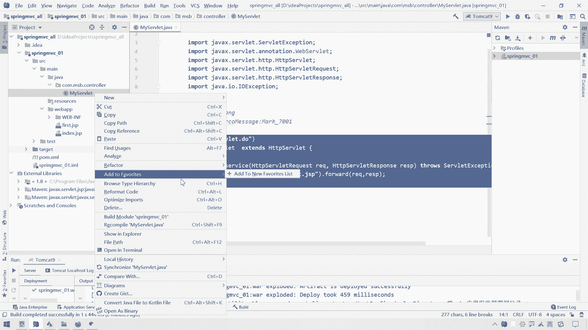

删掉上弹完之后呢，那么接下来呢我们就要引入我们这个super mvc的一个框架。

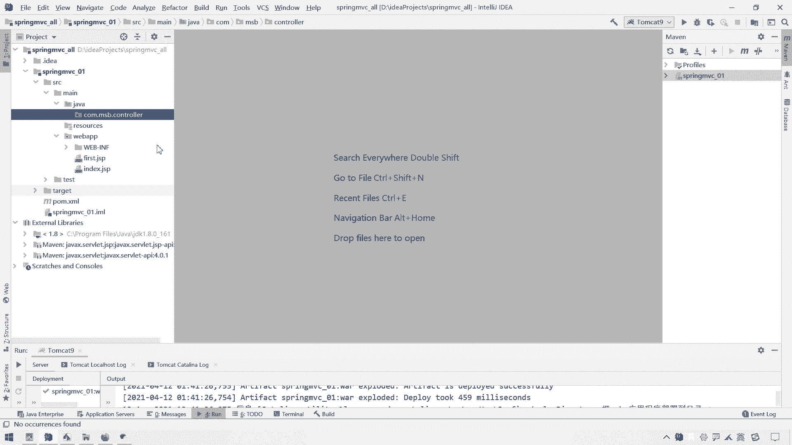

但在引入super vc框架这块这块就要添加依赖。

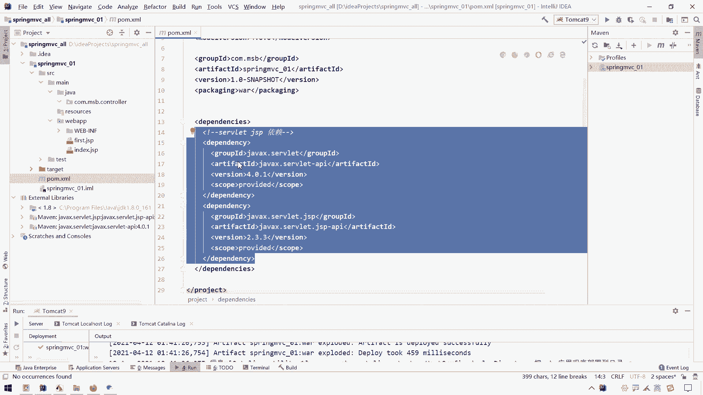

那么都要添加哪些依赖呢，这个依赖呢我都给大家准备好了。

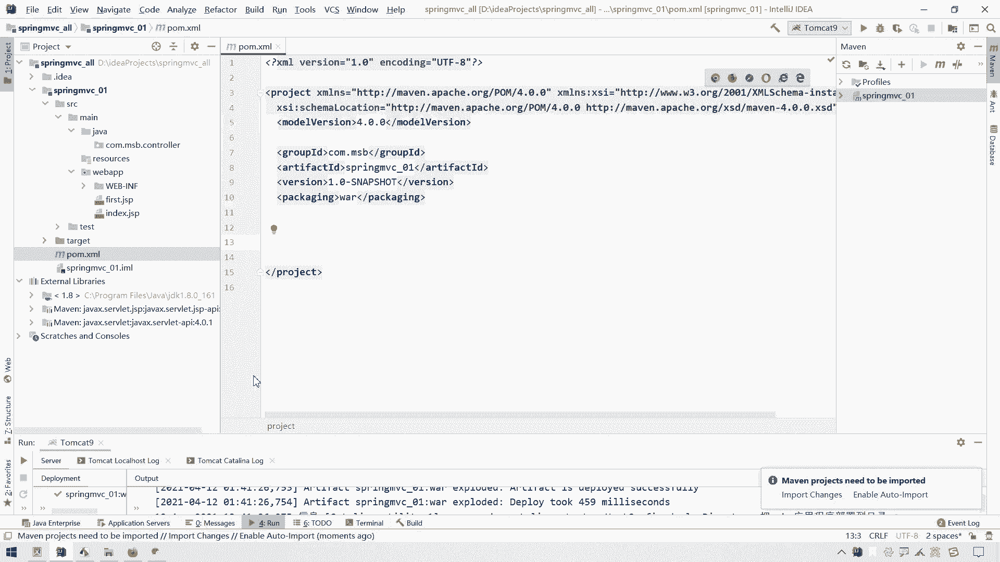

大家可以按照这个呃，我把我这个依赖拿过来之后呢，带着大家阅读一下啊。

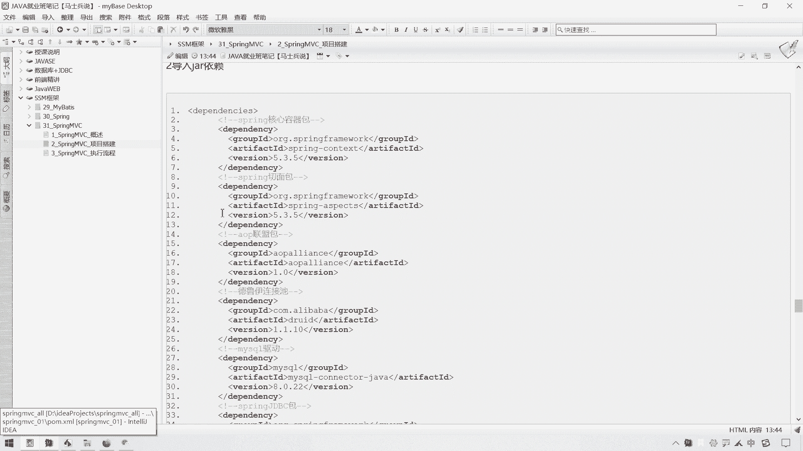

这个依赖已经带了dependency了，我们把这个从上往下给它复制一下。

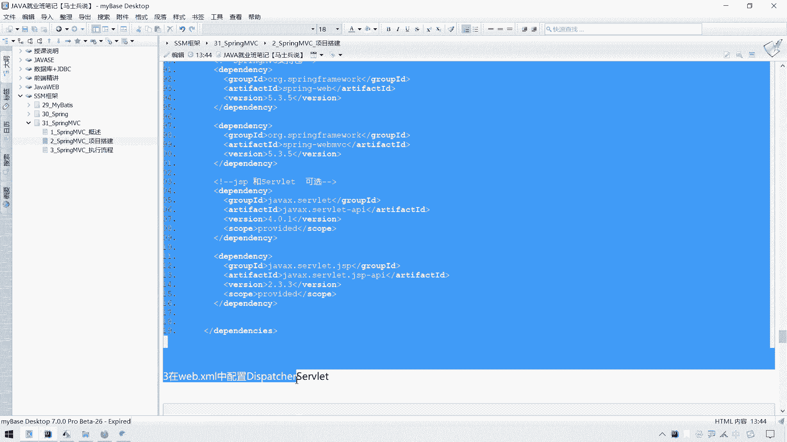

来，ctrl c复制一下呃，复制完之后呢，往这一站，那么第一步导入这些依赖来import changes一下，你自己慢慢打就可以了，这应该很快就倒完哈，人你会发现导入了这么多依赖哦，我的天呐。

怎么这么多是吧，给大家解释一下，其实如果说我们要是想单纯的使用这个spring mvc框架的话，是不需要导入这么多的，那需要导入哪些呢，需要第一个spring gn context。

这个context里面还要依赖谁呢，还要依赖我们这些，这个还要依赖我们这个呃这个contact里面像a o p r b和core expressions啊，这些还是要依赖的。

因为我们这个preme mission它是作为一个spring的一个延伸，它还是要在spring这个核心框架基础之上再继续进行一个使用的，那么切换编程这一块呢，其实不导弹也行，我不知道他也行。

因为这个呢是我们后面这个a op的一个内容，但是将来呢我们要面临的一个问题是ssm整合到一起，这些炸包将来早早往往也要需要需要用到，那么暂时呢这个放置也是ok的。

这其实就是我们之前做的那些东西的俗的依赖，然后op联盟啊，德鲁伊连接池连接数据库的这个connector，j d b c包，tx 85包，om自动运输包，还有com login，com login。

其实找不到也无所谓，因为目前spring日式这一块呢，我们使用的这个呃这个logo for you to，那我这块用的也是一个logo for you to，那我们看一下这块。

我用的就是一个呃呃这是一个log for j2 的一个日志包，如果不插件，这个自然啊放了是吧，还有我们的spring测试包，这个我们直接用这个5。3。5这个版本了嗯。

还有这个我们用的这个g unit也是用直接用这个五这个版本了啊，那么我们这个直接用最新的，还有我们这个spring告web，spring杠web，这个是我们新导进来的啊，这个是spring的。

在web这块支持一个沙包，这块还有个spring mvc包，就这两个包，这两个包是我们新到进来的这两个依赖，那么要是想使用我们这个super mac的话。

这两个依赖是是我们今天呢在这个呃今天在这里新增的之后，这个呃so let api和jsp api在这块倒不倒就已经无所谓了。

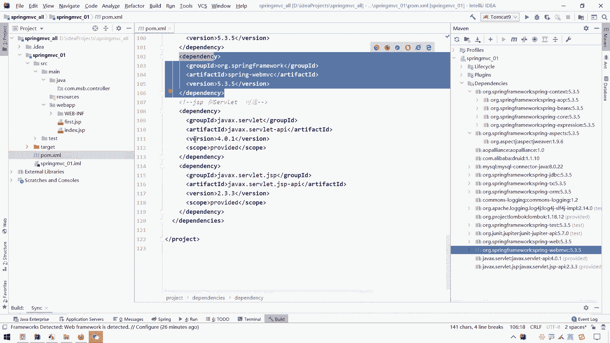

为什么呢，因为这个东西它是放在我们这个服务器的环境区运行的啊，我们在这个编码中已经不需要直接写这个so let和jsp了，所以呢暂时是不需要打他也可以的，那么这个倒了也没关系。

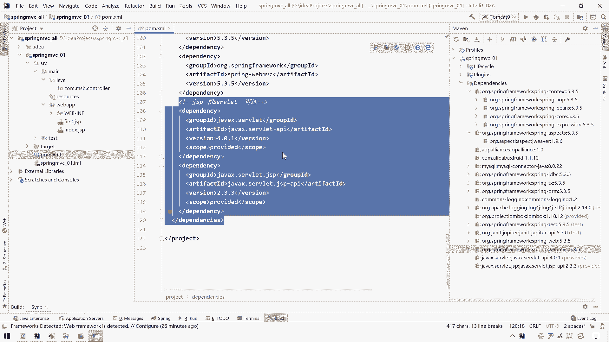

因为我们的项目在打包的时候，因为这个scope控制是一个provided，他也不会打进我的项目，所以这块呢暂时放着吧，那方便我们测试自己写so let以及gsp上的一些东西对吧。

那么这个是整个呃这个导入依赖的一个简单的一个介绍，导入完依赖之后，下一步就是要开除我们这个呃spring mvc的一个这样的一个编码了哈，之后呢，接下来我们在呃开发这个项目后面要干什么事呢。

呃我们说这个之前给大家总结过哈，这个但凡是框架的使用都分为这样几部。

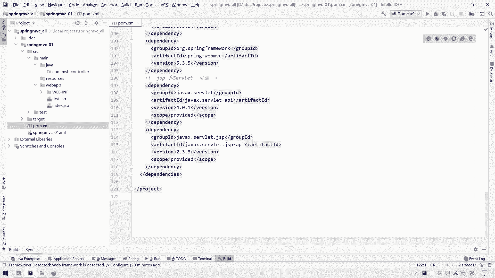

第一步倒依赖，第二步呢做配置文件，第三步干嘛呢，第三步这个呃这个就是我们的一个运行测试，那么呃接下来我们跟大家说一下，这个简单说一下这个spring mvc它的一个这个呃这个在在在配置super mc。

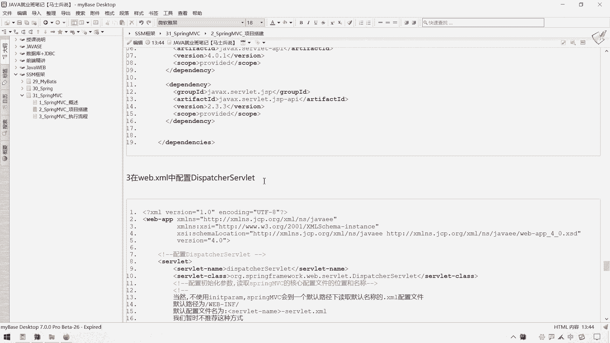

在使用的时候，我们需要做的几件事，呃第一件事呢这个引爆的真实怎么总提示我导入再导一下吧。

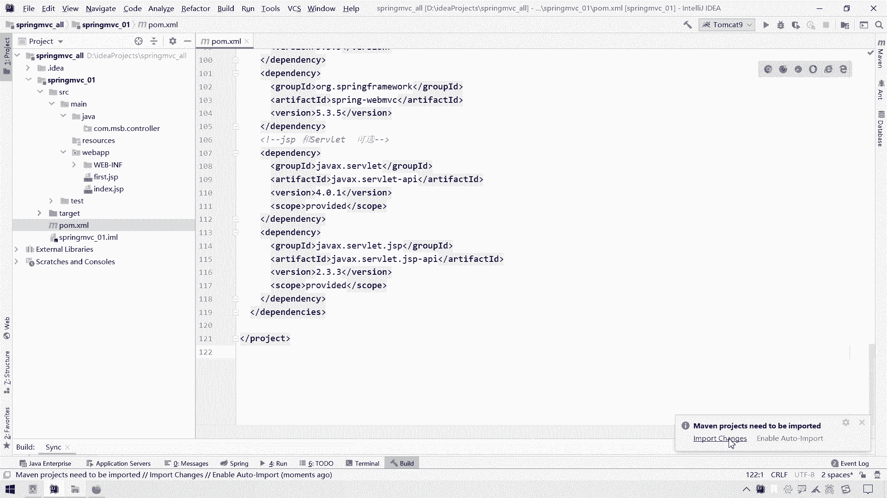

呃我们spring mvc框架在使用的时候呢，呃那么呃需要注配置一个东西叫做这个叫做一个核心的一个啊控制器。

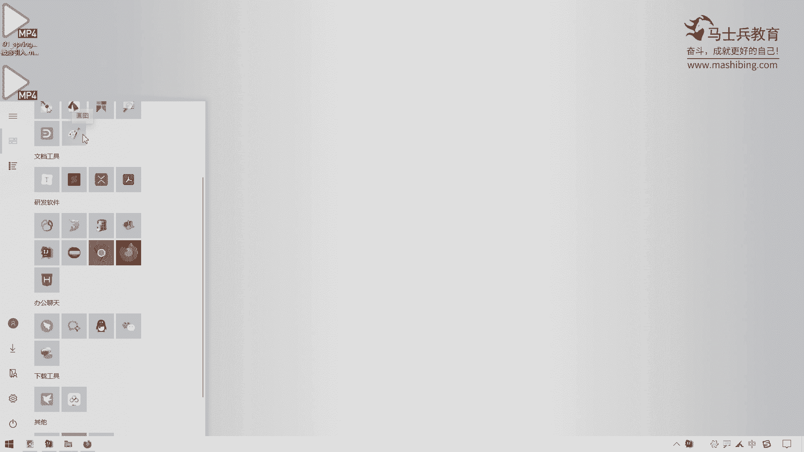

呃，这个super m vc这块呢我们需要配置一个什么东西呢，我们需要配置第一个东西叫做前端控制器，那这个清单控制器它是一个什么玩意儿呢，可能现在大家这个东西有点抽象，不是很好理解，给大家说一下啊。

呃我们的这个sprmc呢，对于我们这个嗯对于我们这个呃ctrl层进行一个封装。

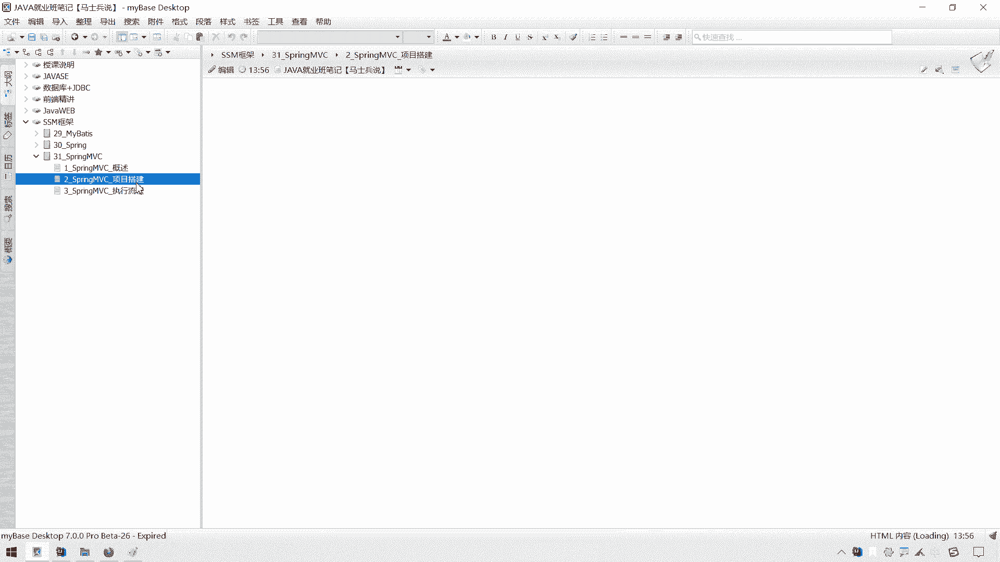

那封装之后呢，那个这个ctrl层呢还是要我们自己去写的哈。

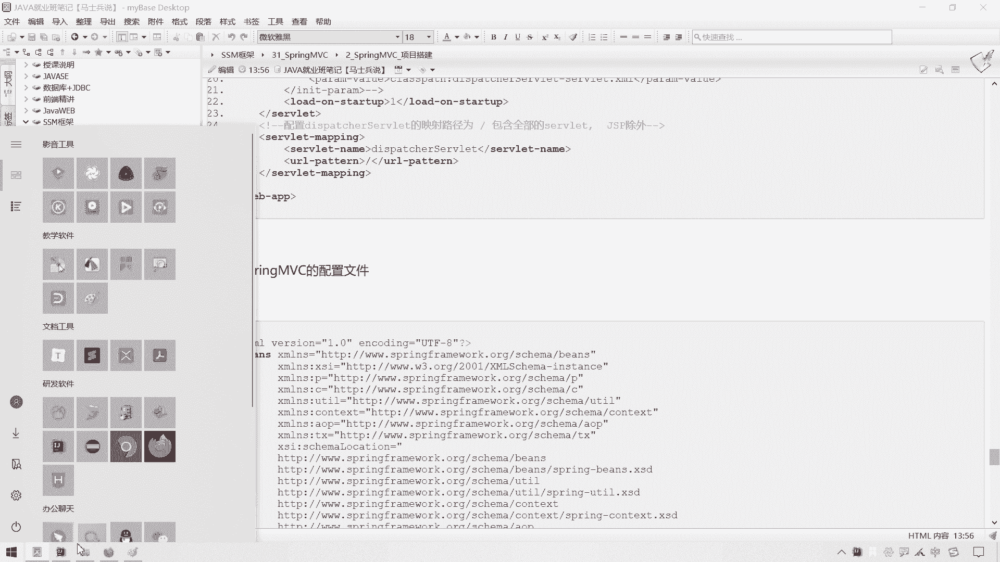

就是我们的程序里面可能有多个control control 1 ctrl 2 ctrl 3，ctrl 4，还写成一个还是a c u n一啊，ctrl一这个叫做c u n c o n2 。

然后再来一个cn cn 3啊，还有一个是cn cn 4，就是我这就是我们程序中多个control嘛啊当然了，现在这个control呢已经不再是我们那个so let，是我们自己单独单独去定义就可以了。

嗯那么我们想请求某个control的时候，肯定要通过这个浏览器在地址栏上写一个这个路径才可以，例如我们的一个叫做叉叉叉叉叉的一个项目，然后后面写成一个叫做c o n e啊，或者是二啊，或者是三呢。

我们想请求哪个ctrl在后面写这个路径就可以了，但是一写这个路径之后啊，那我们这个ul凭什么能找到对应的control呢，这里面需要一个前端控制器啊，那个前端控制器，前端控制器，那么这个前端控制器呢。

呃你这个请求呢会先到达这个前端控制器，那你说这个东西怎么会先到达前端控制器呢，前端控制器需要我们自己配置一下，它可以拦截一下，就是您所请求的这个这个路径先走他，然后在前端控制器这块呢。

它要控制判断一下啊，你要反问哪个资源，访问哪个资源，往往哪个资源之后呢，那么他后面其实还有一个环节叫做什么呢。

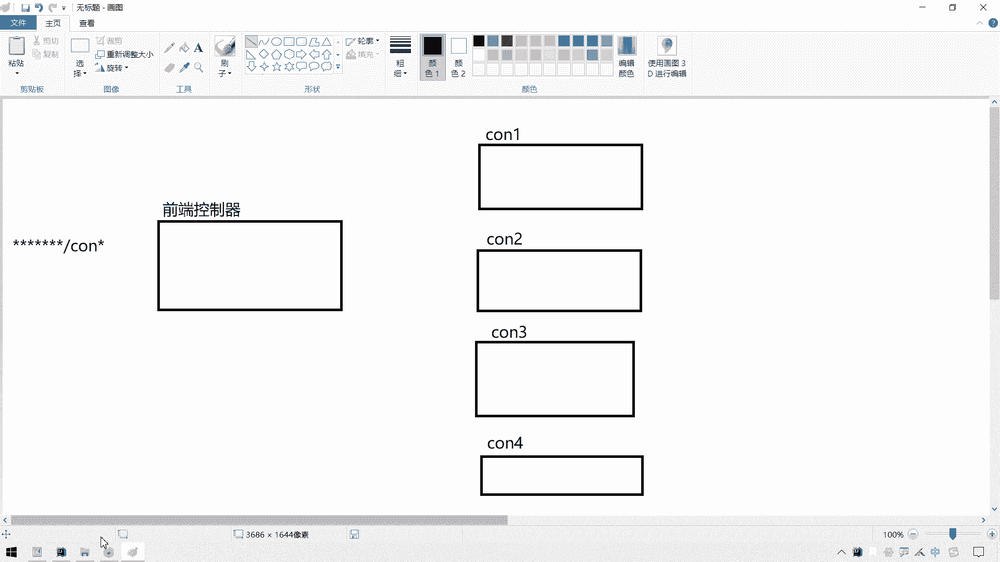

还有另外一个环节叫做嗯，这个叫做处理器映射器，叫做handler mapping，但是这个hello mapping呢暂时我们不需要控制啊，暂时我们不需要控制。

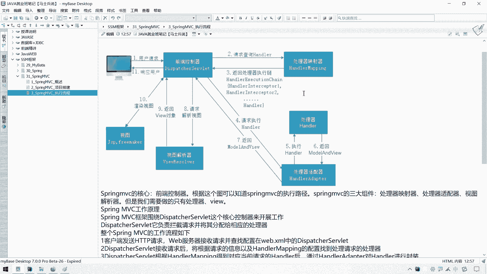

那么暂时呢这个先不讲解它，我们先说这个前端控制器，这个前端控制器呢根据你的路径啊，给你匹配到对应的control是哪一个，那是哪一个嗯，就是你这块写了一个一了，然后走他他给你看哦，你走了之一。

那好给你调用这个ctrl，然后去执行，执行完之后做出响应，做后续操作就可以了，所以呢我们要配置一下这个前端控制器，那么前端控制器在哪里呢。

这个前端控制器其实就是spring mvc里面给我们提供的一个so light，这个so light叫做this parture，你this parture，so light。

这个so由这个so light呢来给大家呃，这个这个ctrl做一个这个分发的一个处理啊。

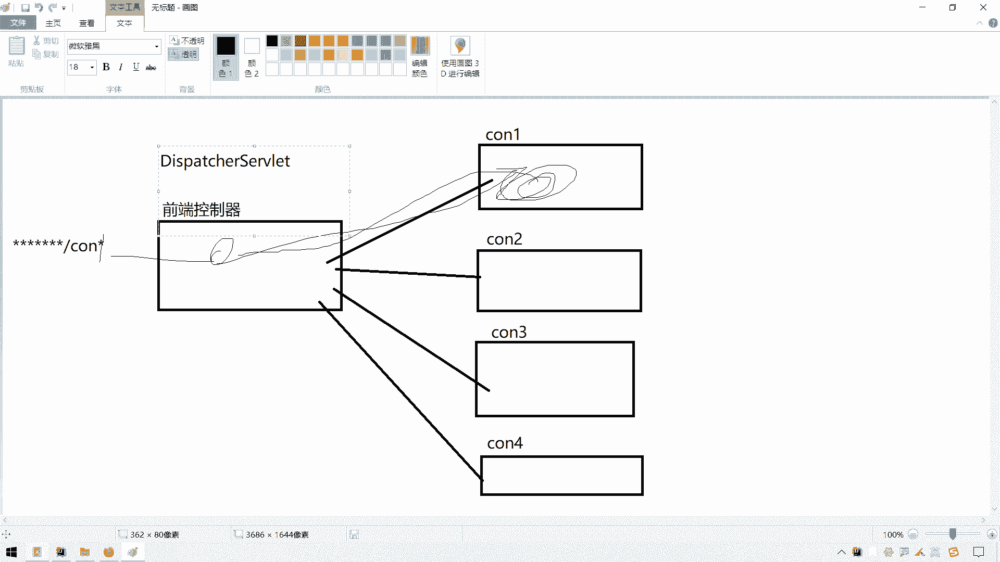

那这个怎么配置呢，呃我们知道这个so let呢是在我们这个web点叉ml中配置的。

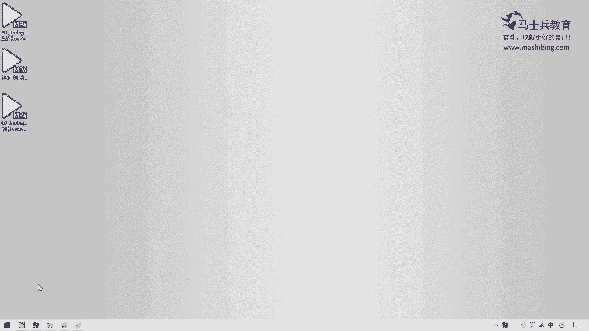

所以呢我们要在web inf这里面去进行配置就好了，那么首先我们说一下这个so light的一个基本配置，一个是so light，然后呢之后还得有一个so let mapping，那solar的卖品哈。

select name这一块呢我们先空着吧，我们先把这个对应的so eclass写上，它是一个叫做d i s p a t c h r dispatcher soviet。

一回车你看它是o n g spring framework web包里面的一个soviet，里面的一个dispatcher soviet，那么这个soviet呢它的一个soviet name。

我们自己随便写一个吧，叫做departure so let就可以了，然后呢我们给这个departure soviet，给他一个请求的一个运输路径，那么它的运输路径是什么呢，这块呢我们就要好好斟酌一下了。

直接写成一个斜线就可以了，这个呢我们在讲java的时候呢，学习过就是你这块写成一个斜线，代表拦截所有的这个so light啊，拦截所有的路径，但是不包含g s p，那如果你写成一个斜线性的话呢。

就既包含了包含了所有的请求了，也包含了j s p了，所以这块呢我们暂时不包含g s p就可以了，因为g s p呢跟我们这个ctrl层其实本质上并没有什么特别明显的关系。

我们只拦截所有的这个出jsp以外的资源就可以了啊，那好那这个departure so that，配置完之后吧，还有另外一个小问题，另外一个什么小问题呢，就是我们后续的controler都要给它放到这里。

都要给它放到我们这个com。m sb。ctrl里面来，那既然都放到这里的话呢，这不ctrl层呢已经不再是需要继承sol的一个普通的一个账号的对象了，那我怎么知道这些呃这个control都在这儿呢。

我们需要在我们这个resources目录下面准备什么，准备一个核心配置文件，那这个核心配置文件，spring mvc的配置文件，那个spring mvc的配置文件怎么写呢。

在这写成一个叫做spring spring mvc mvc点叉m这个配置文件，我们要通过这个supremc点叉ml配置键来指明我的ctrl都大都在哪里，但是这个spring。m嗯，mvc。

x ml这个配置员怎么写呢，我们知道啊，这个supreme m v c它是拓展自这个spring的。

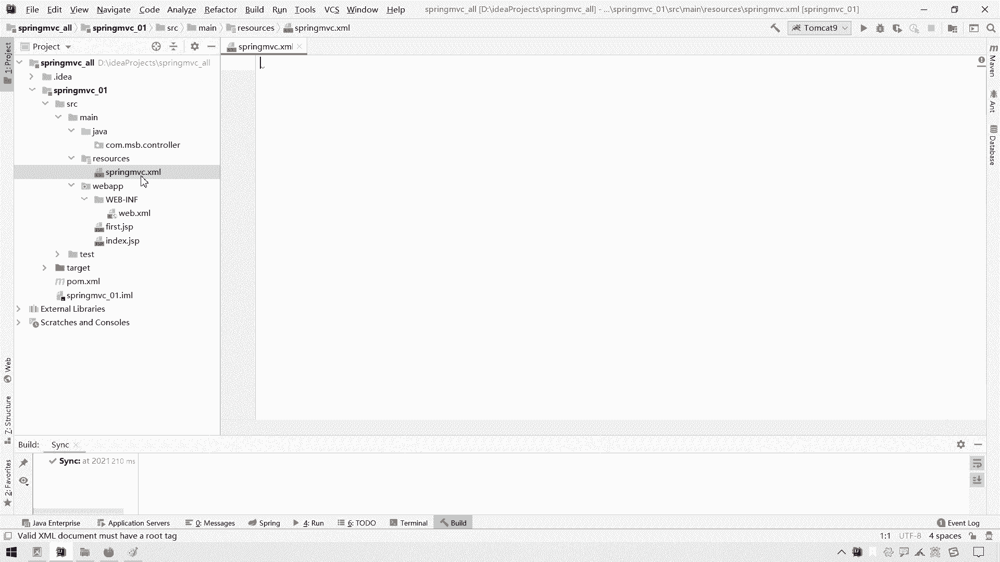

所以它的配置文件格式呢跟我们的supreme的格式其实是一样的。

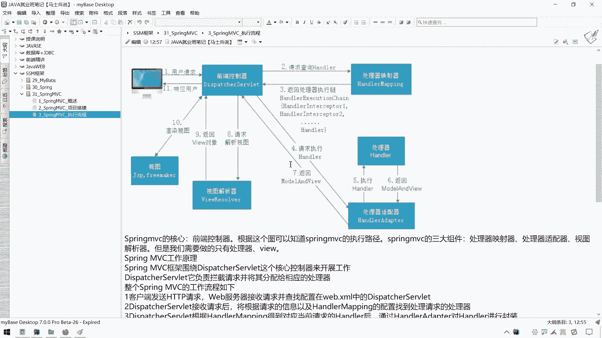

我们把spring那个配置性的约束头拿回来就可以了哈，这个呢是我们之前做过的一个spring的一个约束。

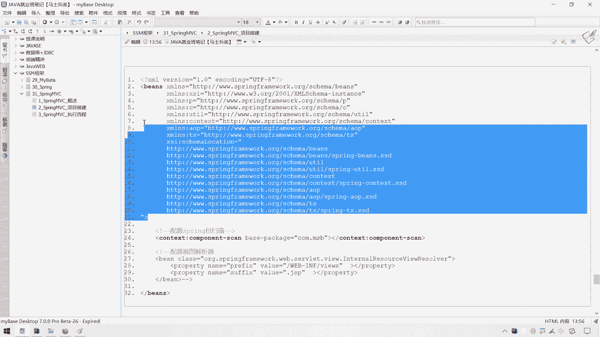

那把这个约束头拿过来，来ctrl c复制一下，往这一放，放完之后呢，在这边写成一个斜线啊，b就ok了，那么这就是一个spring mvc的一个配置文件，在这个配置文件里面我们要干一个什么事呢。

要扫描control层，扫描啊，c有问题，of control什么意思呢，就是我们的control层它也是一些呃这个类和一些方法，那么也可能需要一些对象去调方法，那么在我们spring mvc那块呢。

我们spring那块呢我们已经学过了这个包括描这个东西，那同样的我们也需要啊，让我们这个这个mvc呢进行一个保存苗，那扫描哪个包呢，我们要扫描这个control层下面说的这个类，那怎么扫呢。

用这个叫做context component scan come，点m sb扫这个负极目录就可以了，在扫负极目录的时候，就自然而然把这个ctrl ctrl也给我们扫上了，那扫上之后。

那么接下来呢我们就要想了，那在这个web。x秒之中，我们这个dispatches of light，它要区分要找到我们这个control在哪块，那他怎么知道这个control在我们这个包里呢。

它需要读这个我们spring mvc这个配置文件，就是这里面要读谁要读我们这个spring mvc这个点差面这个配置文件，通过这个配置文件里面的配置信息能够找到ctrl层选在这。

那么也就是说现在有这样一个逻辑哈，就是从这个web的插标之中，我们要读这个配置文件，通过读了这个配置文件之后，哎，找到了所有的control选在这，全给我们实例化，是这样一个层次结构啊。

那怎么配置这个配置文件呢，用这个东西叫做in need pl，这个in the pol，我们在讲那个so light config对象的时候呢，已经提过这个事了，就是提供一些初始化参数。

它有一个叫做呃context configuration的这样的一个属性啊，就是它的一个项目配置一个属性，然后permit viper py这块可以写成一个class path字节码路径。

下面的一个spring mvc，点差秒就读这个配置文件了，然后在这块呢我们再加上一个叫做load on startup，项目，一启动就初始化，我们这个dispatch soviet叫做前端前端控制器。

那就可以了，那这块呢我们给大家加一点注释，这是一个配置前端控制器，前端控制器，然后呢这个前端控制器呢这块提供了一些初始化参数，这个初始化参数，初始化参数参数它是指定什么呢，是指定spring嗯。

mvc配置文件的这个入境的，或者是读取这个配置文件的，然后呢这个low down start up，这个是tom开的启动，记什么记忆初始化就要就要记，立即诶立即啊初始化这个sol light。

你放一个漏当star法唯一其实不推荐一，但是没事，协议也可以哈，那这一块呢就是一个so light map，就是我们当前这个前端控制器它的一个请求运输路径了，那么这个u r l这块大家需要注意一下。

它是匹配什么，匹配匹配所有的资源，所有的路，所有的路径除了什么，除了这个呃，这个g s p g s p。

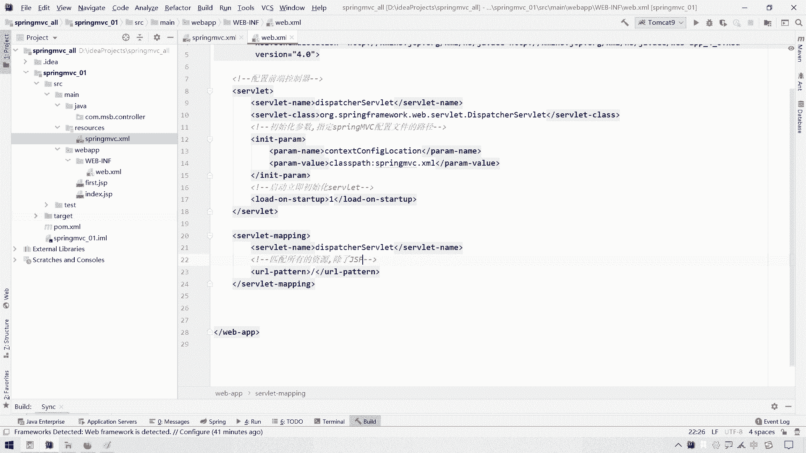

那么我们的请求，任何请求只要不是js p的任何请求都要走这个前端控制器，而这个前端控制器呢它会根据我们自动分析我们请求的运输路径，然后呢去给我们调用ctrl层里面的一些代码就可以了。

那么这个是我们前端控制器的一个配置就搞定了。

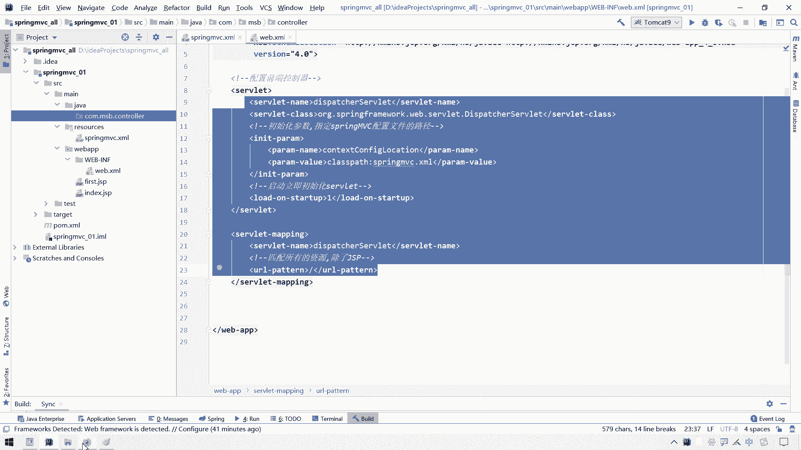

这个配置搞定之后呢，呃那么呃这个包扫描呢也放了这个视图解析器。

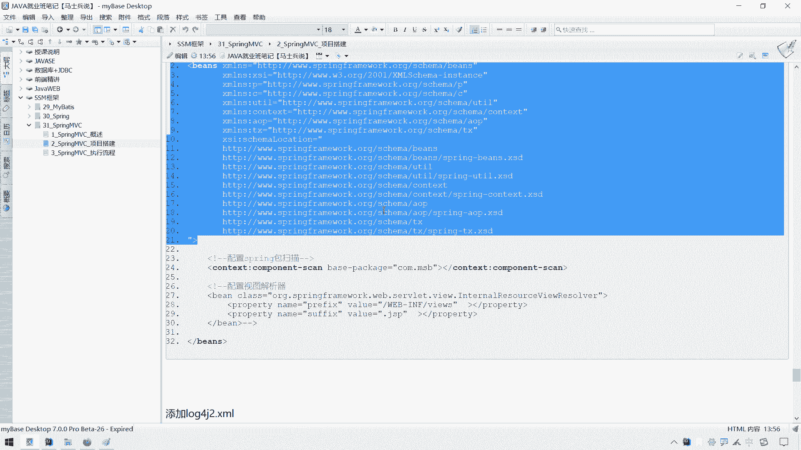

我们后面再说哈，那接下来这个log fg 2点叉面，这个加不加都行。

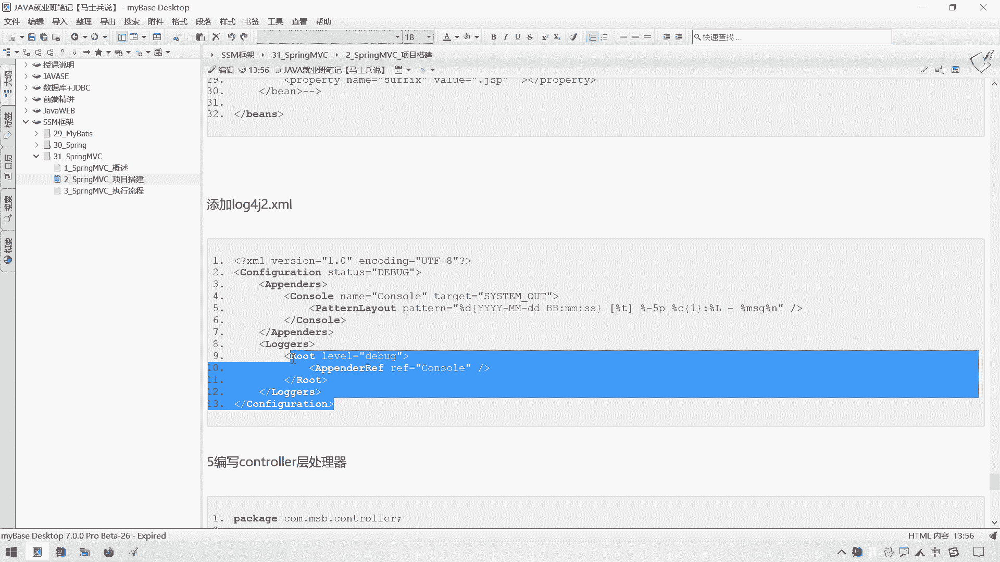

因为这个呢我们spring mvc呢它也是supreme的一个这个延伸嘛，所以呢supreme呢这块要使用log for j2 来打印日志，那么我们也使用这个log four加二来打印就可以了。

当然这个你不加，其实目前暂时也没事儿。

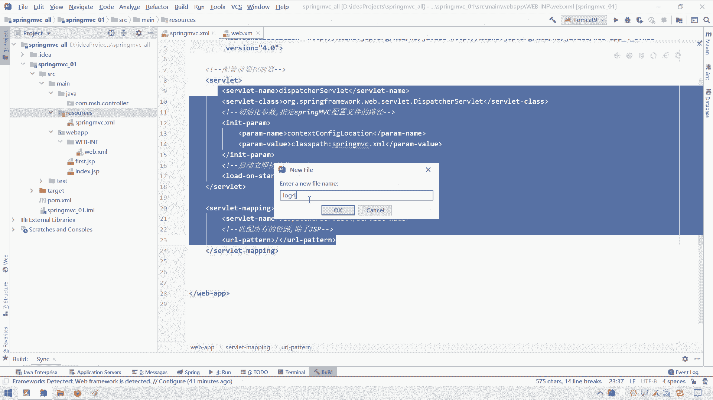

log for j2 点cml往这一粘啊，粘上就可以了，那么如果说你想打日就打日志呗，呃你想打这个debug的可能太细了，那就可以调成什么，调成info i n f o这块调成info之后呢。

这块也可以调成i fo，就不用打印那么细的这个日志啊，当然这个后面如果说你想调的话，那再调也可以，当然这个暂时先这么地吧，因为目前好像还没有什么日式需要打印，所以它也不会显示什么东西啊。

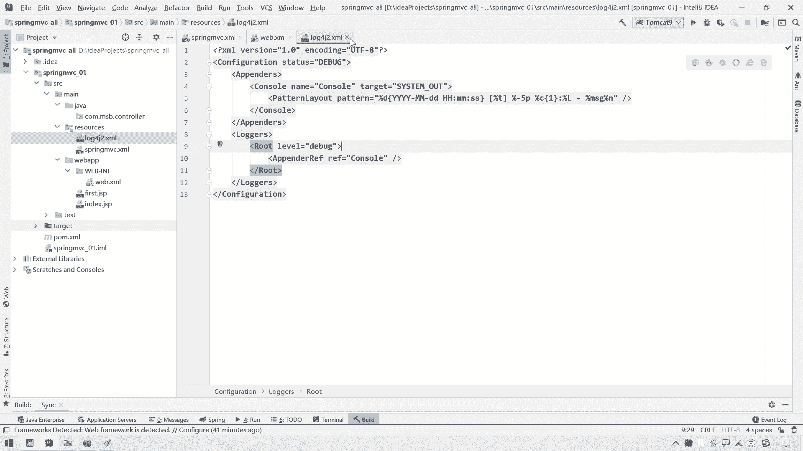

前端控制器这一块的，我们配置好之后呢。

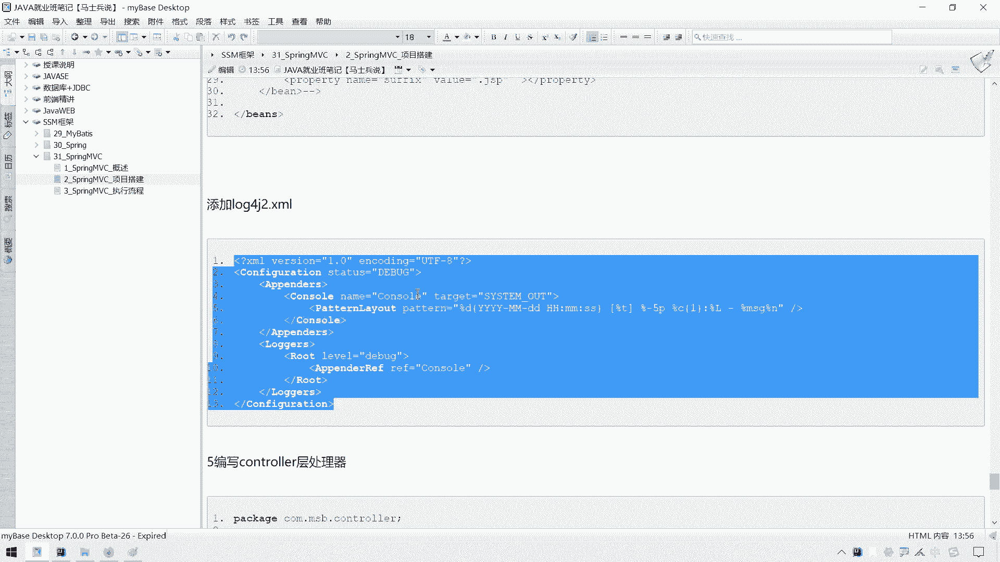

呃那么我们supreme的这个mv 4个核心配件也准备好了之后，这个写什么在哪呢，在这个呃r e e s o u r c resources啊，这个下，添加什么。

添加这个spring mvc点插边的一个这样的一个映射文件哈，那这个视图解析器呢我暂时没写，后面呢回头咱们再说他能干嘛啊，先不管它呃，之后呢就是定义我们的ctrl层处理器了。

呃那么我们在使用mvc这个框架下。

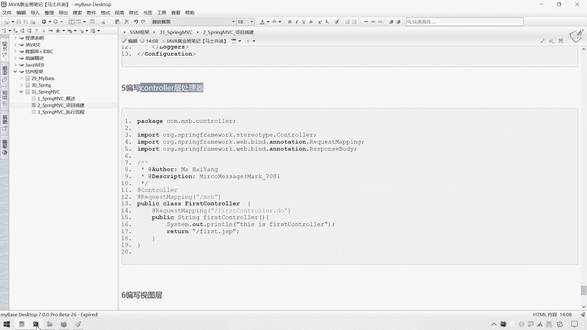

我们的control呢就不用再去继承我们什么，继承我们这个继承我们的这个呃叫什么叫做呃，叫做叫做这个htp so light了，我们写成普通的jv类就可以了，例如我们写成一个叫做my my cn啊。

看出来需不需要继承任何东西呢。

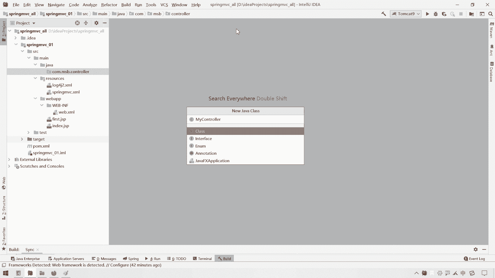

不需要继承任何东西呃，不需要继承任何东西了哈，诶那好开始呃，这个定义我们自己的control。

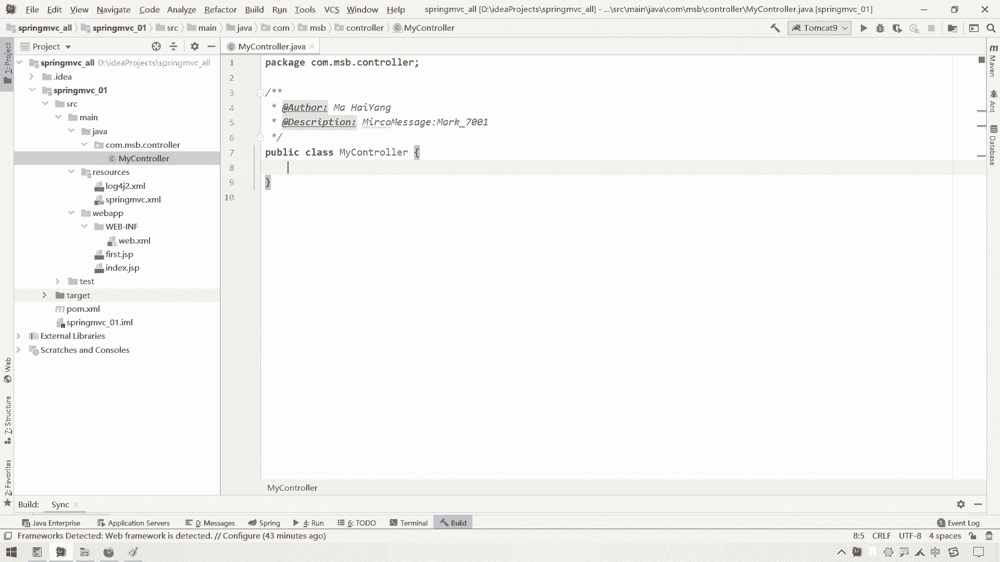