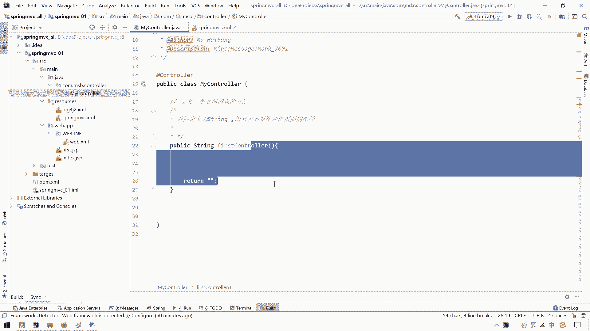

# 花了2万多买的Java架构师课程全套，现在分享给大家，从软件安装到底层源码（马士兵教育MCA架构师VIP教程） - P70：【Spring】SpringMVC_框架搭建2 - 马士兵_马小雨 - BV1zh411H79h

好接下来呢我们定义我们这个ctrl层的一个代码哈，呃那么在spring mvc下呢，我们就不需要自己去这个呃这个继承这个htp server light了，但是我们需要在这块加上这个东西。

叫做at control，呃，这个at cla这个注解呢我们在讲spring的时候，其实已经提过了，这个其实是哪个注解，是这个at component，component的它的一个子主写。

那么这个at computer呢有三个子路解，一个是i，一个是at的service，一个是at repulsory，一个是at controller，那么我们今天终于用到了这个control了。

但是这块就不用它了哈。

什么意思呢，意思就是我们加上这个数据之后呢，呃在我们spring这里面有扫描了一个com。m s b。

它一定会扫到这个类，走到这个类的时候，一看这块有control，那么就自然而然就会把它实例化，跟那个at control是一样的，但是因为这块是一个control层。

所以这块呢我们要选择用这个at ctrl这个主题，结果我们之前在实例化service的时候，这块加什么，加这个at service是一个道理的，但是这块得加at rol啊。

看出了哎好交叉的ctrl之后呢，呃那么下一步就是要定一个什么，定义一个处理方法，定义一个处理请求的这个方法，那这个方法怎么定义呢，这么定义的，随便写成一个吧，来一个public返回值。

为什么返回值为string，起个名字叫做什么叫做f i r s t first，什么first，看出来，那就是我们自己定义的第一个ctrl，然后我们return虽然随随便return个什么东西吧。

那我们说这个方法它这个定义这个格式，怎么这块非得是string呢，我们先解释一下哈，这个返回值返回值定义为string啊，ring嗯，spring其实是什么意思呢，其实就是呃用来用来用来返回什么。

用来返回，用来这个表明什么呢，表明啊这个呃这个界面啊跳要跳转的，要跳转的啊，这个呃这个这个页面页面的路径，也就是你一会儿请求到我们这个方法之后呢，那么我们这个处理完之后，中间可能经过了一系列处理。

处理之后呢，做个页面跳转，那页面跳转的话，你直接把要跳出那个页面路径都放这就可以了，他一直turn自动就给你跳呃，那么这个不同于什么呢，不同于我们之前那个呃service方法。

你service方法在service方法里面呢，它给我们封装了这个类似于这个http servlet request iq，http。

so that response a response r e s p啊，它类似于它给我们定义了这样的一些呃对象呃，这块呢再来一个什么，再来一个void void，诶诶。

那么在这里面呢我们自己在定义ctrl的时候呢，因为已经没有继承这个http so light。

也就没有重写这个思维方法，自然而然的呃，我们暂时就就不用这个request和response。

也可以做这个参数的接收和相应的一些处理了，那么处理方式就会有差别，这个是一个word没关系，那我们这块这个可以换成一个string就来指明什么，指明我们要跳转那个页面路径。

当然后面这块也可以换换成末端的wave也可以啊，你好呃，呃这个呃，那么这个可以给它先删掉。

知道之后你可能会说，那这个请这个控制层如何接触页面参数啊。

啊也可以接受，那是我们后面下一步动作了哈，那么我们接下来需要通过浏览器来请求什么，请求我们这个my control里面这个first control，那么我们可以在这嗯输出语句。

输出语叫做f i r s t fc u n t i o cl，那我们说出一句，看看能不能请求到他哈，请求到它之后呢，我们接下来要由它这个页面跳转到哪里呢，跳转到我们这个first js p呢，怎么跳呢。

这块直接写f i r s t first。jsp就可以了，那么直接写成我们要调整的一个文件的一个页面的路径的名字就ok了，ok之后，那接下来我们还面临一个问题，就是我们在乱七的地址栏上。

最后呢要写什么东西才能映射到我们这个这个处理器这个方法呀，对吧，那这个处理的映射路径是什么呀，我们之前用的这个注解呢叫做at web so light。

但是这个at web so light只能给这个类上定一个请求的一个映射，那我们要给这个方法上定一个请求，应试路径用什么呢，用这个叫做at request map，request就是请求的意思。

map就是映射的意思，就是你在请求的时候用什么路径能映射到这个方法呢，是吧，我们可以写成一个来一个冒号斜线，叫做first cn嗯嗯t cl，那看出来点度吧，这点度加不加其实都行。

那么这样呢也就ok了啊，那么其实呢还有一个什么好处，好处就是呃我们在这种模式下，你可以下面写多个方法啊，再来一个再来一个叫做second controler是吧。

s e c o d second controler，然后这块再来一个second s e c o n d c g f i r s啊。

second controller就是我们可以在这一个类里面定义多个这种方法，然后呢呃这个我们在浏览器上呢，用不同路径可以只用到不同这个方法上。

那这样的话就省就不会像我们之前定义so light那一块啊。

那么那么什么那么麻烦了哈，当然这个是一个我们的一个control层的一个定义，那么接下来我们要干的事情就是启动我们这个项目，然后呢请求我们这个my controler，请求mac trl之后呢。

看一看控制台上能不能够输出，他输他之后能不能给我们跳转到first js p啊。

到这个界面上去就可以了，那接下来就请启动我们这个项目呗，点一下这个汤姆开的九这个小绿色箭头走起，启动它。

这个日志打印可能会花一点时间。

呃默认呢也帮助我们打开了这个火狐，然后呢看这我们当前这个呃这个项目的上下文路径的是它。

那么我们要在这个路径下面写谁呢。

要访问我们这个ctrl就是当前我们项目下面这个first control。do，来把它ctrl c复制一下。

放到我们这个ui后面来，看成v诶，然后一回车你会发现成功的给我们跳到了this is first jsp。

已经成功的给我们跳到了什么，跳到这个first jsp这个位置了，然后看这这个first ctrl有没有输出位也输出了啊。

那么这样的话呢我们这个spring mvc框架的一个搭建啊，就已经简单了，这个搞定了，那我们快速回顾一下我们干了什么事儿哈，第一件事在这倒了一堆依赖啊，这对依赖呢有这个spring的一些依赖。

还有包含我们这个spring的一些a p呀，呃日志啊，哎这个loon book插件啊，嗯还有这个一些测试啊，呃这个这个等等的一些依赖，然后呢我们增加了两个依赖，一个是spring guy吧。

一个是spring gm v c，呃，这个select j a p i和j s p a p n呢，其实呢还是应该导进来，因为后面呢我们在呃写这个测试的时候，可能还会用到这两个依赖哈。

下一步是干嘛呢，下一步就是我们在这个web n f里面定义了一个前端控制器。

前端控制写法，这是固定的，就这么写就可以了呃，前端控制器里面要读一个spring mvc的一个核心配置文件的一个位置，那么这个核心配置文件放哪呢。

放到resources目录下面，我们定义那个spring mvc的x m l，在日本我们只要扫了什么。

只要扫了一下ctrl层，或者是扫描了一下，扫ctrl层就行了，只要是扫了一下这个mac rol，在my ctrl这块呢加上一个艾特ctrl一个注解，然后通过这个request mapping的。

我们指定了什么，指定了我们这个呃这个这个当前是一个呃，指定了我们当前这个处理器的一个映射路径，那好呃，那么这个是我们开发spring mvc的一个基本的一个流程就已经搞定了。

