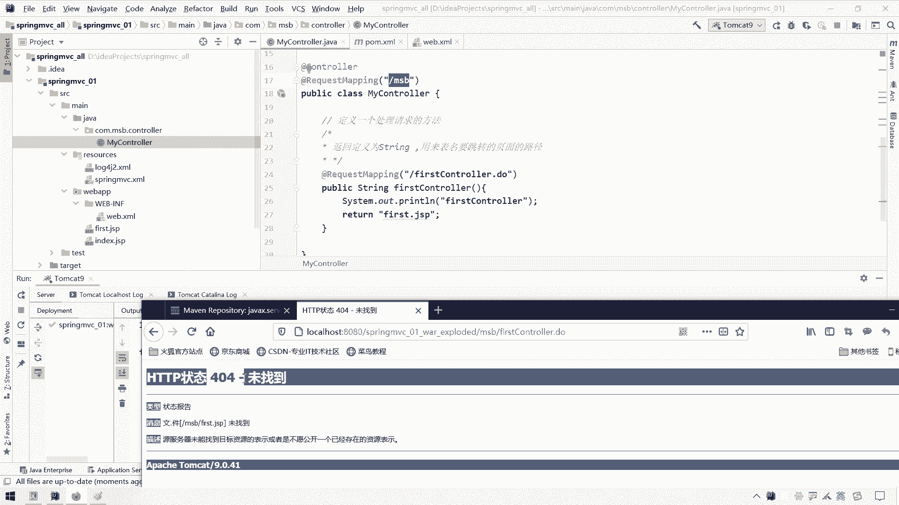

# 花了2万多买的Java架构师课程全套，现在分享给大家，从软件安装到底层源码（马士兵教育MCA架构师VIP教程） - P71：【Spring】SpringMVC_框架搭建3 - 马士兵_马小雨 - BV1zh411H79h

嗯这一小节呢我们先简单说一下这个spring mvc，它的一个呃项目搭建的时候呢，它的一些配置的一些细节问题哈，我们先说一个第一个细节问题。

就是这个dispatch so light这一块呃，在departure solar这一块就是这个里面。

那么前端控制器这块呢要默认这个初始化参数。

它要读取我们这个spring mvc点叉ml的一个这样的一个映射文件呃，那么我们说这个映射文件我们要是不通过这个引力的para，我们来配置，可不可以可以也可以，那不通过它来配置的话呢。

这个时候我们这个departure of light就会默认的干嘛呢，默认到一个指定路径下面去读取配置文件，如果如果不用什么，不用这个init pero来指定什么，指定这个spring mvc。

那sirmvc的这个配置文件的路径，然后镜那么呃那么我们这个this spiso light啊，this parture so light会自动到什么，到这个斜线web中横线inf下点找什么。

找指定的啊，指定指定名字的什么名字的这个配置文件配文件，那么这个指定的名字到底长什么样子呢，它这个配置的名字默认什么默认默认配置文件名，明白什么呢，为我们上面这个soviet name啊。

就是你这个soviet name里面写的是啥，这个标题中间写的东西是什么呢，嗯这个soviet name这个属性里面的值后面拼成一个中横线soviet，然后点叉ml会会给我们指定这样一个配置文件。

什么意思呢，就是当我们这个this part so like，没有指定我们这个配置文件到class part里面去读它的时候，它会干一个什么事呢，它会自动到web inf里面去干嘛。

去读取配置文件去那读取配置，读哪个配置键呀，它会这么读，会读你这个呃思维，like name，假设这块有新建一个xml文件，会读这个dispatch sl综合线，civili点差ml。

他会读这个配置文件里面的内容，那这个配置要放什么呀，跟他放一样就可以了，ctrl ctrl c拿过来就往这一放一粘就完事了，那么这个时候它会呃配置文件，它会进行这样的一个读取。

这个配置读取的可能这个格式是有点奇怪哈，呃后面这些都不用动，那你说这个时候他也会读取我们这个spring mvc配置念，只不过这个配置文件名它有这样一个要求啊。

读起来也是一样，但是这种方式我们推不推荐的，不太推荐不太推荐。

我们一般还是把这个推荐用这个context configuration，这个初始化参数来指定我们super mvc的一个配置线的位置哈。

那么这是一个呃这是一个呃呃dispatch select里面的东西啊，那我们试一下，看好使吧，我们再来重新部署一下这个项目呃，重新刷新一下这个项目之后呢，呃这个不用管它，重新刷新项目之后呢。

我们再来测试一下，访问我们这个first control。do，然后一回车哎，你看它也是能够访问到的，然后这块也是一个this is first jsp也搞定了。

我们看一看编译之后这个项目是不是成功编译了哈，classes，然后呢我们在这个在在在在哪，在这个target里面呃，这里面，然后哎就变成它了，在这个web inf里面。

你会发现有一个dispatch solila，dispatch sogsl的点茶面读的就是他那么好，确实也编译过来了，说明走的也是他哈，呃那么这是我们第一个配置信息，但是我们不推荐它。

我们还是使用这种就可以了，所以这种方式呢这个方式呢作为一个了解，杀了他别写了，这就完事了啊，那除了这个我们配置要简单了解以外之后呢，我们还要了解另外一个就是my control这一块，嗯。

在my control这一块呢，我们说一下这个request mapping，这个request mac是用来指定我们当前这个ctrl它的一个请求，因是路径的。

那么这个跟我们之前那个叫做at web soviet不太一样，at web so light呢你会发现它只能放到类上，如果这个i的web so light要是放到我们这个方法上的，他应该是报错的。

但是这个request mapping不一样，我们看一下这个request mapping，它能放的位置呢，既是元素类型上，也能放到方法上，也就是说什么呢。

也就是说我们这个add request mapping这一块ctrl c既可以放到z上，也可以放到我们这个啊ctrl上，那当我们在这个control上和我们这个呃在我们这个类上和这个方法上。

如果都放在这个request map之后，会发生什么事呢，当然他们两个不能写成一样卡，我写成这样，那我写成这样之后，我加了两个request making，那我在访问这个ctrl会发生什么事呢。

来我们在这块还是得刷一下这个项目来重新部署一下，呃重新部署一下之后呢，我们再来请求我们这个first control do，原因就是我们找不到这个first control点多了。

当我们在这个类上加了request map和这个方法上也加了request map之后，那么如果我们要是想请求这个处理器的话，我们在应试路径上要加上类上这个路径才可以，嗯。

然后呢再拼上我们这个呃这个方法上这个这个应收入境，那么我们在请求的时候呢，就要请求这个东西，就要在这个上面先请求什么，先请这个m s b，然后斜线下面里面这个first control。

那么也就是说当这个request map放到内存的时候，其实就是为这里面的每一个方法的上一层。

再加上一层前全运输路径啊，那我们试一试看看是不是这样的哈，呃这回再访问测试一下。

看看行不行，然后再来一回车。

我们控制台上输出了这个first controller，不是的，找到他了，因为也运行了这个first control了，出在这里了，他找了一个first。js p。

它返回的是这个first sig sp，这个first sig sp里面他没有找到，然后我们看这你看提示我什么斜线下面msb斜线m4 ，first jsp为知道为什么能找到他呢。

当我们在这个request mapping里面啊，这个在类上定义了个request mapping之后，我们这个return这块跟大家说一下，这其实就是默认在用请求转发呃。

这个return里面放的东西是什么呢，它其实就是我们这个http so light request对象，当我们return它的时候，本质上其实就是在用这个request对象调什么。

调这个get request departure，然后呢请求这个f i r s t first first。jsp，然后呢再做一个forward。

i q逗号i e s p a r a i q i e s p哈，当然i e s p我们现在还没往上写呢，呃其实本质上本质上我们return他的时候就是在干这个事儿，但是在干这个时候涉及到一个路径问题了。

就是我们这个first j s p它的路径问题，它是一个相对路径，是相对于当前这个control当前这个方法的路径啊，那么在这个路径下面去找这个first js p，但当前方法这个路径在哪，在哪里面。

在这个msb下面，说白了你当return这个first jsp的时候呢，其实就是请求转发给什么呢，转发给m sb下面一个first gsp啊，所以这是一个路径问题哈，但这块如果我们要写成这样一个斜线呢。

它就在每个绝对路径了，那或者是一个基准路径了，他会以什么呢，他就跟这这个时候再请求在这个跳转路径时候就跟他没关系了，固定往哪跳啊，固定在当前项目下，就是我们当前这个外bp下面往下走，再往下走。

我下面的哪一个下面这个first js p，那这个时候跟上面这个路径啊就没关系了，就不会参照这个路径来来调整它了，这个呢我们在java e那块讲过这个呃，这个什么就是请求转发和响应重定向的一个路径问题。

那么跟那个是一样的哈，我们把它改一下之后呢，我们再来测试一下，看看行不行哈。

好部署完毕，部署完毕之后呢，我们再来来在这儿再来一刷新。

ok没问题就过来了，那么这是一个呃关于这个呃control里面的第二个参数的一个，这个这个处理也就搞定了，呃搞定之后呢，接下来我们说第三个参数处理啊，第三个参数理这块呢。

假设我们这里面有一个什么这里面呃，我们的页面为了安全考虑，我统统都不放在这儿了，我放哪儿呢，我放到web inf里面，我创建一个什么，创建一个叫做v i e w v5 的一个这个在web inf里面。

我创建一个v5 层，然后呢我把这个first这个first gp我放这了，我把这个first gsp，我放view这块放这里，ok就完事了，都挪过去呃，挪过去之后呢。

那么呃这个时候哈呃我们要是想请求转发的这个first js就该怎么写呢，在这个web中横线inf下面这个first jsp就可以了，呃那么这个请求转发也是可以请求转发到这个web i f幕下面的。

那这个时候我们再来测试一下，看看行不行哈，这个应该也是没问题的。

没问题之后呢，我们再来在这块再测试一下，一回车诶，找不到了啊。

web i f e web i f下面一个少了一层，这边还有个view呢，这边还少了一个view层斜线v i e w不定还有一层这样的目录是吧。

嗯再来重新部署一下。

ok刷新完毕了一回车诶，也找到了，那找到之后哈。

那假设我后面的每个页面我都想往这个web web inf里面呃，放，你会发现这个东西特别特别什么特别特别难受，就是我每次返回界面的时候，都要加上前面这一串。

而且呢假设我的这个每个这个js p呢都是每个页面都是点jsp的，我后面还要加上一个什么，加上一个点j s p，这样会比较麻烦，那我能不能在这块把这个路径简化一下呢，可以简化一下。

在简化的时候呢，我们需要配置这个东西叫做呃叫做什么，叫做我们这个叫做视图解析器。

这个视图解析器是个什么意思呢，这个跟什么呢，这个跟我们这个还是跟我们这个sprm mc执行流程相关呃。

前端控制器呢通过处理器映射器找到了什么，找到了我们自己的这个处理器，我们自己处理器是啥，自己处理器就是我们自己处理那个control是谁呢，其实说白了哈，这个我们现在还没看到，没看到没关系。

通过前端控制器，假设现在找到了，找到了我们自己的处理器了，那处理器是谁呀。

自己这个处理器就是它嗯，就是我们在这块写的这个代码，它就是我们自己定义的一个处理器，然后处理器返回这个字符串之后呢。

谁给我解析这个字符串并跳转页面呢，是这样的，他把这个路径返回之后哈，继续向上返回，会给一个这个视图解析器，由视图解析器来解析我们返回那个字符串一个路径，然后他解析完之后呢。

由他来给我们帮助跳转到那个页面去啊，跳到那个页面去，那么我们可以通过配置视图解析器来简化什么的，简化我们返回一个路径啊，那怎么配置呢，是这样的呃。

我们需要在这个呃在我们这个spring mvc这个xml中配置一个视图解析器，配置一个这个视图解析器解析器，那这个解析是怎么配置的，就是一个b吗，非常简单。

这个class叫做呃internal i n t e r n l internal呃，resource view resolar，就是它默认的一个视图解析器，在这个配置视图解析器的时候呢。

我们可以指定路径的前缀和后缀，指定指定路径的这个前缀和后缀哎，通过一个叫做props属性，叫做prefix啊，就是指定前缀，还有一个叫做诶，还有个什么，还有一个就是哦哟。

还有一个是property a property，通过他的一个surface来干嘛呢，来指定这个后缀，然后呢分别给定value值，然后给定这个value值v l v l u e v60 哈等于。

那么这个prefix和surface怎么指定呢，假设我们这个control想往往这个web n f里面这个view里面去跳转，访问这里面界面，这里面假设有十个界面啊，但是访问哪个不一定。

但是我可以肯定的是什么呢，肯定的一定是y不按f v里面的东西，同时呢这个view里面放的一定是js p，那也就是说我们整个这个路径里面，其中前面这一部分已经固定了，后面这一部分已经固定了。

唯一变化的就是这个first，那好我可以把这个固定的内容给它配置到视图解析器里面去，在视图解析器里面，在解析这个路径的时候，自动在我们返回的这个基础上呢，给我们拼一个前缀和拼一个后缀，那拼的前缀是谁呢。

就是他注意啊，来ctrl c复制一下，ctrl x剪切一下吧，哈放到我们这个前缀上去，注意以斜线为开头，以前为结尾，不要丢哈，那么在什么呢，在我们这个呃点j s p这块的后缀这块，我们配置什么。

配这个点js p呃，在这个这里面这个它当我们把这个视图解析器的前缀，配后缀和配置好之后呢，那我们ctrl层只要返回我们这个文件名就可以了，那么它会自动在这个文件名前面拼什么呢。

在这个文件名前面拼这个前缀，然后自动这个上面在这个后面拼这个后缀啊，那我们这个ctrl层这块呢法东西会简单一点，只要写对应的这个文件名，不带透视名就简单多了，ok了，那这样ok吗啊，我们来测试一下。

重新部署一下。

好部署完毕之后呢。

我们再来访问我们这个first control do，然后呢再来一回车，ok它也是可以正常的跳转过来的。

那么这块呢简单的给大家解释一下这个视图解析器哈，就是说一下这个配置。

当然这个呃spring mvc这个执行流程，我们后面会给大家再稍稍细致一点讲哈，那只不过呢我们在第一次测试super mvc这块呢，我们把这个这个呃大家目前能够了解到的一些配置呢跟大家说一下哈。

嗯那哎呦谢谢哈。

