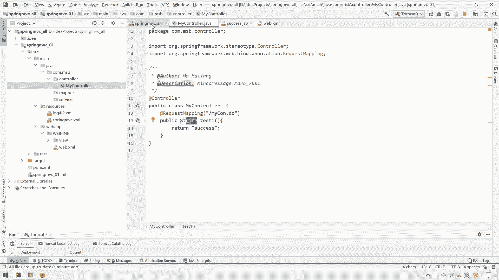
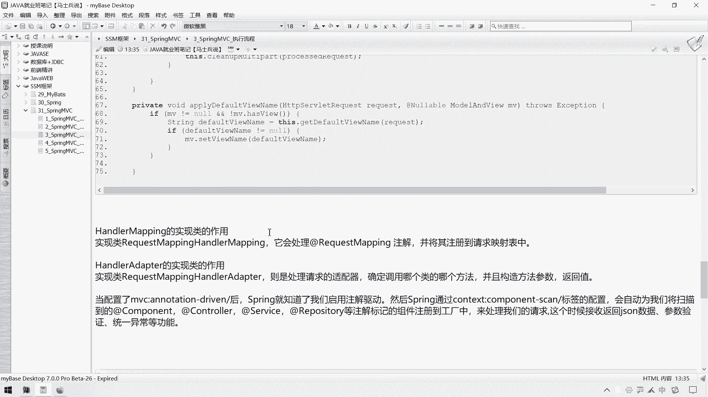

# 花了2万多买的Java架构师课程全套，现在分享给大家，从软件安装到底层源码（马士兵教育MCA架构师VIP教程） - P72：【Spring】SpringMVC_执行流程和三大组件 - 马士兵_马小雨 - BV1zh411H79h

这节课呢我们给大家讲一下这个spring mvc这个框架，它的一个执行流程，以及它的一些组件，还有它相关的一些啊，这个静态资源处理和放行的一些东西给大家总结一下哈。

嗯那么我们之前呢在测试这个spring mvc的时候呢，我们是在这准备了一个ctrl，呃因为在这块扫描ctrl层的话呢，这里面其实在mvc模式下，在我们整个项目里面不光有这个ctrl这一层。

那么在我们这里面可能还有什么还能有这个嗯，com。m s b。s e r v s c service层，后续呢可能这里面还有什么呢，还有这个呃我们这个dio啊，或者是我们结合my bt之后。

这里面还有一个map，那么我们这个呃mvc这块需要扫那一层的，它需要只需要扫ctrl层就可以了，所以暂时这个map和service这一块呢我们不扫也行，所以这块我们可以把它改成soctrl也行的啊。

那么呃我们之前的代码呢是在这个control层里面呢，我们准备了一个control这块我写成一个普通的class，假设叫做my c o n t r o uo t i o cler。

呃，然后呢呃加上一个at controler的一个注解，那在这里面呢我们再来一个哎，public返回值为string，然后起个名字叫做呃test呃，test一这的一个方法。

那在这块呢我return一个这个什么return一个这个界面的一个路径，例如我这块写成一个s u c c e s s success，那么要想返回它的话呢，我们需要在这个web app下面呢准备一个呃。

之前呢我是把这个页面放到了web i f里面，我在这边准备一个v i e w的一个一个目录，然后在这个目录里面呢，我们准备一个success的一个页面，s u c c e s s success。

点js p，然后呢在这块写成一句叫做呃呃this is s u c c e s success啊，这个page啊，那么我们准备占一页，那如果说我在control层要是想往这块跳的话呢。

我们直接return一个success就可以了。

但是这里面有个什么东西，我们需要配置呢，需要在这配置一个视图解析器啊，需要一个视图解析器，这个视图解析器呢可以呢。

呃可以呢，其实我们不需要输入解析器，我们在这块这么写也行y吧，这个我们之前也讲过哈，a n f写信下面这个v w v w里面这个success。jsp，我们写它这个完整的路径也可以。

但是通过视图解析器呢，我们可以在这块定义这个它的一个前缀和后缀，那么这个叫做呃b然后呢它的这个class class叫做呃internal internal resolve。

an internal resource resolve。

这是一个视图解析器，然后呢我们在这里面呃配置了这样几个属性，一个是a property，一个叫做pre prefix，嗯，然后呢通过这个value属性去给它指定吧，写成一个呃写成一个斜线。

y中横线i n f里面的这个v i e w和v5 啊，不要忘了一个斜线哈，还有一个是这个叫做surface surface x的一个属性s u surface x。

然后呢这块呢我们放了一个啊这个点g s p。

那么我们配置了视图解析器之后呢，它就可以在我们这个返回的这个路径之上呢，我们只要返回这个文件名就可以了，它就会在我们这个文件的路径之上呢，自动补充一个前缀和后缀了。

在这块再加上一个at request mapping，然后呢这块呢给他来一个map吧，谢谢my c o n。do，其实呢我们在request map这块呢，这个后续再讲吧，前面这个斜线加不加都行。

但是我暂时呢我还是先跟我之前这个思维来写法的，保持一致哈，先给它加上呃，那么我们先来启动项目是吧，启动项目之后，我们请求这个my controler，然后跳转到我们这个success or jsp。

那么我们接下来给大家分析一下，就是诶这个请求以及跳转这一块这个过程啊，他都发生了什么事，他都有哪些环节需要我们去这个呃，注意一下，说一下他这个spring mvc，它的一个执行流程，这个应该已经。

好浏览器的已经帮我们帮我们打开了。

打开之后呢，因为它默认帮助我们访问这个index嗯，index jsp，但是这个index jsp呢，呃js p呢在我刚才已经在这里把这个index jsp已经删掉了，没关系啊，我们直接访问什么。

直接访问这个做嗯，my c o n。do一回事。

哎他就跳了这个success成功这个页了，这是我们之前的操作哈。

那我们就分析一下，当我们请求这个ctrl的时候，然后呢请求他然后一跳转之后呢。

这个过程啊发生了什么事呃，在这块呢通过一个时序图的形式来给大家分析一下，就当我们tom开始启动以及请求完成响应这一块都发生哪些事情，这个时序图是这么看，这是我们整个的这个程序在往前走的时候。

它的一个运行环境和各个环节在什么时间发生了什么事，当我们项目一启动的时候，发生了一个什么事呢，就是我们的tom看着一启动，它会加载这个web。xml这个文件，一加载这个web。xml文件呢。

它会初始化呃，实力并实例化并初始化这里面所定义的这个so light，然后呢在扫描这个web的差别的时候呢，就会发现这里面有个什么，有个dispatch soviet。

就会把这个dispatch soviet进行一个初始化，初始化之后呢，呃那么他也会呃也会通过这个spring mvc点叉ml配置文件来创建什么，来创建spring容器，然后再根据那个我们的一些注解容器。

我们初中嗯初始化我们容器中的一些对象，那这个是在我们正式发生请求之前，那么唐门开始启动所发生的一个事情，那整个过程是由tom cat读取web的插苗，然后呢在初始化dispatch soviet。

然后再进行一个spring容器以及spring容器扫描ctrl层，促使我们的ctrl这样一些的操作之后呢，我们用户这块呢啊就发生了一次请求，这一次请求的时候呢，先经过tom cat。

然后tom cat根据我们的请求路径呢，它会先到达我们这个前端控制器，就是我们这个dispatchet，因为在dispatch soviet里面呢，我们配置这个路径是一个斜线。

那么这一个斜线它的作用是什么，是拦截除gsp以外的所有的请求，都会经过这个departure so that，然后呢请求到达这个dispatch撕下来之后呢，这个dispatch搜过来的就会干嘛呢。

就会解析啊，就会帮助我们解析什么，解析我们这个请求路径对应的是哪个control，然后在对应ctrl的时候呢，就找到了什么，就知道我们自己定义的这个mac ctrl啊。

就是我们在这个dpture so light这一块呃，我们的请求到了这个呃，到了我们这个tom开了之后，tom cat根据这块的这个呃这块可以先这个可以先哦删掉哈，这个是我们后需要玩一个事情哈。

呃我们的this party，我们的请求到达了我们这个tom开了之后呢。

呃根据这个运输路径就匹配到了我们这个dispatchet。

然后我们的departure soviet呢会根据我们在这块请求的这些参数，然后请求在上升到ul进行解析。

解析完之后呢，我们发现这个ul定的是谁呢，对应的就是我们这个my controller。

对应的就是这个方法，那么这个时候呢就会执行这个方法，在执行这个方法之后呢。

他return一个success，那么这个success就是对应了什么呀，对应了啊，对应了我们的一个呃，就是在运行这个control的时候呢，对应了我们这个路径。

然后对应到我们这个success jsp，那我这个时候呢就会把success or js p呢响应给什么，响应给我们的一个用户，那么这个整个就是它的一个呃时序图，那么有了这个一个时序图之后呢。

我们说在这个发生的这个在时序图上所发生的各个事件，那么呃都是哪些，都是spring mvc中哪些组件，哪些东西来帮助我们完成的，那接下来呢我们就说一下这个supreme m v c啊。

它的一个执行的一个原理，这个上面是执行的时序图，而下面这个是它的一个执行原理图，注意下面这个不是时序图哈，这个只是一个逻辑图，当我们的用户请求啊，请求到达了我们这个前端控制器之后，这个前端控制器啊。

就好比是什么，就好比是一个公司的一个呃这个什么主控，就好比是一个公司的主控或者是一个控制中心，控制中心由它控制着我们整个super mc它的一个交互啊，那么有了这个也就是说我们请求先到达这个主控之后呢。

他干了一个什么事呢，他先解析这个路径，解析这个路径之后呢，他自己解析吗，他自己解析可能太麻烦了，他下面有个小弟，第一个小弟叫做处理器映射器，处理信息测器是干嘛的呢。

他就把这个路径或者把这个u r l或者把这个请求给他给他之后呢，由这个处理器映射器通过解析我们的路径，给我们返回什么呀，给我们返回对应的这个controller，嗯。

对的这个control就说白了说白了我们这个前端控制器在找什么呀。

前端控制器嗯，在在在在在这里我们这里面配置的前端控制器，它是如何找到我们这个呃control里面这个这个这个处理单元，它并不是自己直接来制造的，它是有个叫什么，有个叫做呃处理器映射器的一个组件。

他要通过这个组件来帮助我们找到什么，来帮助我们找到我们自己定义的roller controler啊，在哪里找到之后呢，他把这个control给给再返回什么，再返回给我们这个前端控制器。

返回给前端控制器之后，前端控制器在这块直接调用ctrl的方法吗，是不是这样呢，是不是在前端控制器里面直接调用我们这个方法进行运行呢，也不是，为什么也不是呢，因为我们再往后学啊，我们这就会大家就会知道了。

就是这个ctrl这一块啊，这这个参数列表是可以变化的，是可以多种多样的，返回类型也是可以多种多样的啊，呃你可能我们需要把什么，需要把请求的参数往这放，需要把这个结果呢进行解析等等啊。

封装参数和解析这个过程呢，是不是要让我们的这个前端控制器是不是要让他来执行呢。

也不是的，那么前端控制器呢说要是找到了对应这个ctrl之后，这个ctrl就是它就是我们定义的handler呃，我们的这个定义的这个自己定的那个呃处理请求的那个ctrl层的方法。

其实就是对应我们这个处理器，就是它呃，那么我们处理汽车器呢已经告诉前端控制器了，你的处理器在这里呢，那你直接调用这个处理器吗，我们的前端控制器是直接调用这个处理器吗，不是的，也不是的。

它要通过一个处理器适配器来调用我们这个处理器，什么叫适配器呢，这个适配器能给简历给大家翻译一下，就举个例子，就像我们的电脑是19伏的，但是我们查的电源是220伏的，我们要把这个19伏呢。

28 20伏能转换成19伏对吧，一样的，那么同样的我们前端控制器这块呢，如果是自己调用这个处理器，自己调用我们的ctrl里面的方法，那需要我们在这自己做这种方，做什么，做这个参数的处理啊。

返回值的处理啊啊等等一系列的东西比较麻烦，那怎么办呢，那么前端控制器这块呢也不是直接调用处理器，它是先干嘛呢，它是通过这个组件叫做处理器适配器，他告诉处理器设备区t去干嘛，你去给我执行这个呃。

这个去调用这个方法去，调用完之后呢，你把这个结果，处理器适配器会把请求中的参数给我们放到我们的ctrl之中，同时呢再把这个结果放到这个model and wave当中，给我们干嘛呢，给我们返回呃。

所以是有一个什么有一个中间商，那么这个东西就叫做处理器适配器。

那么我们这个处理器是谁，处理器已经说了，这个处理器其实就是我们在这所定义的一个什么呢。

就是我们的ctrl的一个代码，就是我们这一个处理单元，那这个数据单元啊，那好那么当我们这个处理器通我们的前端控制器，通过处理器适配器调用完我们的处理单元之后呢，我的处理器适配器会把这个结果呀返回什么。

会给我们返回我们的前端控制器，返回阶段控制器的时候呢，需要传递的参数呢都给它放到这个model and wave这个对象里面去，那可能说老师我没有看到这个对象，这是在底层源码的时候能进行这么一个封装。

当然我们也可以直接返回正对象，也是ok的，那么这个model view返回之后呢，那么这个时候前端控制器就会看是吧，这个model view里面有没有跳转的页面和一个数据，有有的话的时候。

前端控制器是直接控制页面跳转吗，不是的，他假设想控制页面跳转的话呢，它也不是自己直接干这个活，他再交给什么，交给自己的第三个小弟，第三个小弟就是一个视图解析器，把这个末端的wave呢。

把这个wave试图给你挤到这里面来，就是我们的什么，就是我要页面跳转的一个路径，例如把这个success信息，s u c c e s s success信息给你放到视图解析器里。

视图解析器呢会通过会处理这个我们的一个视图的路径，然后呢给你给我们返回一个view对象，那这个view对象里面就带着什么，就带着我们的一个试图的一个信息了，但这个视图信息之后呢。

那么前端控制器获得这个视图信息，再把什么呢，再把这个数据给我们的一个视图层，在视图层再进行渲染，怎么渲染呢，例如用jsp技术把数据展示出来，或者用free marker技术哎。

网页静态化技术把这个视图展现出来，展现出来之后，那么这个视图准备好了，再告诉前端控制器，视图已经准备好了，准备好之后呢，这时候前端控制器再把这个视图里面那些信息的响应个什么，相应给我们的用户啊。

那这个就是我们整个spring mvc它的一个执行流程，那那么执行流程这一块呢，可能大家还是稍微的第一次接触，可能还是稍稍有点蒙圈，没关系，再大家整理一遍哈，用户请求过来之后，他肯定是又通过一个ul啊。

那然后到达我们的前端控制器了，前端控制器呢如何找到我们对应的这个ctrl处理单元呢，他自己不找，他交给我们这个处理器映射器去找，找完之后呢，他把这个处理器映射器呢，把我们处理单元给我们返回之后呢。

那他自己直接调这个处理单元吗，也不是他在通过第二个小弟处理器适配器，让他去这个调用处理器的里面的一些方法，我们处理单元的一些方法返回结果之后呢，在这个处理器适配器把这个结果返回给我们的前端控制器。

前端控制器拿到结果之后，直接控制页面跳转和做数据展示吗，不是再把这个页面信息交给视图解析器，解析完视图之后，由视图解析器在正式的返回啊，要跳转的视图是哪一个视图，哪一个拿到之后呢。

前端控制器要直接把这个数据进行渲染吗，也不是他再把数据交给什么，交给视图层，视图层进行渲染就可以了，但是视图层这个渲染这一块呢啊就是我们前端的一些事情了啊，是渲染完之后呢。

前端控制器的告诉我们的这个用户啊，就是你可以有这样一个响应啊，可以做出响应了，你可以拿到什么样的一个数据了，那么这个就是整个的一个spring mvc的一个执行流程呃。

在spring mvc这个执行流程这一块呢，大家一定要注意这样啊这样的一个这个面试题啊。

就是呃supreme vc这块呢它也会有这样一个面试题。

就是问一下这个spring mvc的这个组件，也就是三大组成部分啊，或者三大控制。

三大组成部分分别是哪些呢，是这一部分一个叫做处理器映射器，帮助我们找我们的处理单元的一个叫做处理器适配器，处理器适配器呢是帮助我们调用啊，这个我们处理单元方法的，第三个呢是我们的视图解析器。

这个视图解析器呢是帮助我们处理视图解析的啊，那么这个是也是我们spring mvc的，叫做三大组件，大家一定要记住哈，这三大组件的名称一定要记住，分别是处理器，映射器，处理器适配器和视图解析器。

那你可能说这里面还缺了一个前端控制器，这个前端控制器可以说是我们spring mvc的一个核心的一个组件，它是做一个主控主要的控制中心，在这个主要控制中心下面有三个组件。

那么这三个组件呢呃spring mvc呢其实已经给我们默认配置好了。

这三个组件其实是我们可以自己指定的哈。

再来看一下前端控制器，我们说了呃，handler mapping就是我们的处理器映射器，handler就是我们的处理器，它其实就是我们自己定义的ctrl代码，就是我们自己定义的什么自己定义的。

嗯ctrl层的这个叫做ctrl这个处理单元哎，所以单元啊三大组件里面有没有这个处理器的没有，因为这个处理器是我们自己定义的，三大组件，分别是处理器，这个给你标一下，还有一个是我们的一个叫做处理器适配器。

还有一个就是我们的这个视图解析器叫做will resoler。

呃，那么呃为什么要用处理器适配器去调用我们这个自己的处理单元呢，要原因就是呃这个我们呃我们这个处理器里面。

还将来可能在里面会写不同的参数啊，这里面可能会写不同参数，然后呢会有不同的返回值进行处理。

那么这些处理的话呢全交给谁来做呢，全交给我们这个处理器适配器来做，那么这边都是一个usb，就相当于对应对接着我们这this partisweet，而这边不同的结果呢相当于对应我们不同的这个韩德尔。

它的一些特征呢，通过这个处理器适配器呢去给我们调试就可以了。

最终走到这个view resolver这一块呢，view resolar啊会给我们生成v无视的对象，然后呢对view对象进行渲染之后。

再将信息返回的用户对，然后第六部分这个视图层，视图层这块呢就这个技术其实就是偏前端一点的技术了，那么我们在这个呃spring mvc中的。

正常来说应该是配置一下什么呢，应该是配置一下处理器，映射器，处理器适配器和这个视图解析器的呃，但是目前来看我们发现我们只配置了这个视图解析器，在配置视图解析器的时候呢。

呃省配置视图视图解析器是怎么配置呢，就是在这儿配置的，在这个spring mvc点叉ml里面。

我们在这配置了一个视图解析器，配置完视图解析器之后呢，可以通过视图解析来指定我们跳转路径的前缀和后缀，以简化我们可除了层返回的这个信息的这个路径的一个，编写的一个写法呃，正常来说我们应该干嘛呢。

应该在这个spring mvc中配置三个什么，配置三大组件，这三大组件分别是什么呢，分别是配置配置，配置处理器，配置处理器映射器，还要配置一个什么呢，还要配置一个处理器适配器，但是别信。

但是呢嗯我们要是不配置的话呢，目前来看这个代码测试似乎也是好用的，但是事实上呢我们还是要在这配置一下的，为什么要在这配置一下呢，主要是不配置这个处理器映射器和这个处理器适配器的话。

那我们后期呃在这个control层接收参数以及返回数据这块呢。

可能会存在存在问题，所以呢我们还是需要配置一下的。

你怎么配置呢，这个东西是这么配置的啊，可以给大家这个在我们文章已经写了哈。

怎么配置，是这样的，这个这的这个hler mapping的实现类的作用是什么。

实验类的作用就是它是帮助我们处理这个request mapping这个注解，所以呢实现类是这叫做request making handler mapping。

我们要在我们的这个哦这个spring mc中的配置一下这个处理器映射器，然后用这个类就可以了。

应该怎么写呢，是这样写的哈，其实就是说明一个b非常简单，说明一个b，然后呢指定这个class。

为什么这个class class为我们的这个叫做在这呢叫做request mapping。

hla ma，你这有点长啊，e q r e q e request making，emp，然后看到了卖屏，那么这就是配置我们这个处理器映射器，除了处理器映射器外，还有叫做处理器适配器。

这个适配叫做request main handler adapter，a d a p a t e r啊，那这就是配置我们的处理器映射器和处理器适配器，那么spring默认给我们不写的话。

spring其实也给我们配置了两个默认的，但是这两个默认的呢其实没有这两个好啊，这两个呢相对来说比较好一点哈，那么配配它之后可能会让我们这个三大组件就已经配置齐全了。

但是呢这两个东西看起来似乎这么配置稍微有点繁琐，我们可以用一个什么注解来给它简化呢，用一个annotation driven的一个注解来给它简化一下，怎么写呢。

用的是我们这个叫做呃尖角号mvc mvc的一个呃vc的一个标签，但是目前这里面这个mv c标签用不了，为啥用不了呢，我们名称空间里面好像没有mvc呢，我们把这个复制一行，给他来一个mvc。

然后呢把这两个也给它复制两行，把这个mvc的这个这个名称空间都给他加上哈，呃t所有的tx改成mvc啊，这个地方也给它改成m v c。

这个地方给它改成mvc，那么改成mvc之后呢，我们就在这块就可以用这样一个注解叫做m v c冒号叫做annotation driven，呃，加上这个诶，怎么变成tx了。

我上面应该是配错了是吗。

哦这块还没有改呢，这块也得改成一个mv c啊，那这回就对了，mvc annotation driven，然后呢这个是一个可以写成书面签，当然也可以形成一个单标签就可以了，那么这个其实就是什么。

其实这个叫做开启mvc的注解，这个作用叫做开启mc的，这个叫做注解驱动，开启开启，mvc注解驱动，但是在开启mvc注解驱动的时候呢，呃那么它会自动干嘛呢，自动给我们给我们配置好什么。

配置好这个处理器映射器和处理器处理器适配器，啊适配器，所以呢我们在使用mvc的时候。

一定还是要把这个加成下来，加上下之后呢，就默认给我们配置了，省得我们自己在写这么两行比较麻烦是吧。

那么三大组件的一个配置呢，在这块儿呢也跟大家说一下哈。

那么当配置了mvc annotation driver后，其实说白了就是把这两个处理器映射器和处理器适配器配置了之后。

那么啊我们后续呢这个像接收返回的json数据啦，啊参数验证啊，还有统一一些异常灯的一些功能才能够正式的生效和使用。

所以呢这个三大组件的一个配置这块呢。

